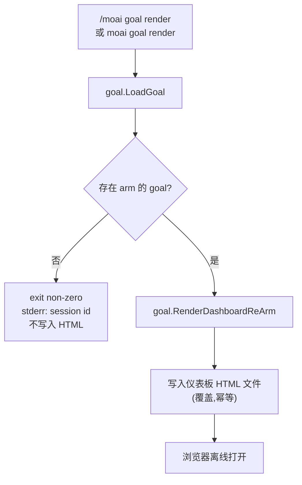

声明完成条件后,会话会自主工作直到该条件满足的 **条件声明型自主循环** 命令。用 `/moai goal "<条件>"` arm 完成条件后,每个回合结束时 `stop-goal` Stop 钩子评估条件是否满足,直到满足为止自动开始下一个回合。


**一句话概括**:`/moai goal` 是"声明终态的通用循环"。若说 `/moai loop` 是把"直到消除诊断工具找到的全部问题为止"这一条件预先设定好的预设,那么 `/moai goal` 就是 **直接声明** 完成条件的通用引擎。



**程序化命令**:原生 Claude Code 的 `/goal` 是只有用户能输入的(HUMAN-ONLY)TUI 命令。`/moai goal` 是把相同语义 **在流水线中程序化** 实现的 MoAI 自有命令,通过 `moai` 技能路由和 `moai goal` CLI 进入。


## 概述

当你想让智能体"在此条件满足之前自行持续工作"时使用。条件可以混用两种。

- **机械条件(mechanical)**:由 shell 命令验证的条件。例:`go test ./... exits 0`。执行命令并观察退出码。
- **模型评估条件(model-evaluated)**:由对 transcript 的判断验证的条件。例:`所有 AC 行记录为 PASS`。基于会话至今留下的内容进行评估。

该循环是 v3 的第二根支柱 **智能体循环工程** 的通用引擎。goal 状态按会话保存到 `.moai/state/goal/<session-id>.json`(非共享文件),**回合上限(默认 30)** 使循环有界。达到上限时评估器给出 5 段判定(Claim / Evidence / Baseline-attribution / Gaps / Residual-risk)并停止阻断。`--max-turns 0` 可启用一种跨越压缩边界持续运行的无限 goal,其实际上限由 `--max-duration`(运行时间)和停滞防护担任,而非回合数。仅 arm `--max-turns 0` 而不带任何实上限会在 arm 时被拒绝(fail-closed)。

## 动词(verbs)

### `/moai goal "<条件>"` — 注册 + arm

注册条件文本并对活跃会话 arm goal。条件被解析为 `conditions[]` 数组 —— 纯 shell 命令字符串是机械条件,引用 transcript 的主张是模型条件。arm 后会原子地(temp+rename)写入 `.moai/state/goal/<session-id>.json`,`stop-goal` Stop 钩子会在下一回合结束时读取它并开始评估。

```bash
> /moai goal "go test ./... exits 0;所有 AC 记录为 PASS,或 30 回合后停止"
```

### `/moai goal status [--all]`

输出活跃会话的 goal(或用 `--all` 输出所有会话的 goal)—— 条件文本、conditions 数组、已用回合数 vs 上限、进度日志、生命周期状态(`armed` / `satisfied` / `ceiling-exit` / `cleared`)。

### `/moai goal clear`

解除活跃会话的 goal(删除状态文件)。Stop 钩子见到没有 arm 的 goal 便停止阻断。这是编排器判定模型条件已满足后结束循环的方法。


**不提供 `resume` 动词。** 以前讨论过的 `resume`(从归档恢复已解除的 goal)动词目前不在 CLI 中 —— `moai goal --help` 中也找不到 `resume`,只列出 `arm` / `status` / `clear` / `render`。因为 `clear` 会 **删除** 状态文件(而非归档为 tombstone),所以不留下可恢复的原件。


### `/moai goal render` — 仪表板 HTML 渲染

将活跃会话的 goal 状态渲染为 **自包含 HTML 仪表板**,写入 `.moai/state/goal/<session-id>.html`。它是幂等的(idempotent),重复执行会覆盖同一路径。可通过斜杠命令(`/moai goal render`)和终端 CLI(`moai goal render`)两种方式调用,两者都调用相同的 `goal.RenderDashboardReArm`。若没有 arm 的 goal,则以非零退出码将 session id 输出到 stderr,且不写入 HTML。加 `--json` 标志会输出 `{action, session_id, path, bytes}`。关于渲染内容和安全属性,请参见下方 [目标看板](#目标看板) 章节。

## 进行模式(自主 / 半自主)

编排器执行实施启动批准(plan→run 边界的 `AskUserQuestion`)时,会让用户在与批准/拒绝决定 **相区分的独立轴** 上选择 **自主 vs 半自主** 进行模式。所选模式保存在 goal 状态的 `progression_mode` 字段中(用户不选则默认 `autonomous`)。

| 模式 | 行为 |
|------|------|
| **自主(autonomous,默认)** | 评估器在条件满足或达到上限之前每回合阻断,不会每回合询问用户。与既有 Stop 钩子行为相同。 |
| **半自主(semi-autonomous)** | `stop-goal` 钩子在每个回合边界发出 **检查点信号** 块 JSON,编排器读取它并进行 `AskUserQuestion` 确认轮次(继续 / 解除 goal / 转为自主)。钩子本身绝不调用 `AskUserQuestion`(钩子·子智能体边界 —— 只发出结构化 JSON)。 |


**两种模式下批准都是必需的。** 进行模式轴只选择门禁通过 **之后** 做什么 —— 它不是门禁绕过,也不是实施启动批准的放宽。arm 的 goal 在任何模式下都不批准进入 run 阶段、不创建 PR、不执行破坏性操作。


## 安全不变式

1. **实施启动批准两种模式都必需** —— 进行模式是批准之后的进行选择,而非门禁放宽,且与分数无关地保持。
2. **arm 的 goal 不绕过门禁** —— 不自动创建 PR,不执行破坏性操作。评估器只决定是否继续回合,不预先批准不可逆的操作。
3. **`stop-goal` 钩子不调用 `AskUserQuestion`** —— 只发出结构化 JSON(钩子·子智能体边界)。
4. **停滞守卫(stagnation guard)** —— 检测到连续 N 次无进展的迭代时停止循环,并给出附带 E1/E3 升级说明的 5 段判定。

## goal 条件应当快

评估器在每回合结束时执行。相比完整套件更倾向 `go test -run <pattern>`,相比耗时命令更倾向确定性命令 —— `stop-goal` 的 Stop 钩子超时为 120 秒,但快命令能让回合循环更紧凑。

## 与 /moai loop 的关系

`/moai loop` 是 **goal 引擎之上的预设**。若说 `/moai goal` 是用户直接声明完成条件的通用循环,那么 `/moai loop` 就是把"直到清空诊断工具找到的问题队列为止"这一条件预填好的预设。

| 引擎 | 目标 | 完成条件 |
|------|------|----------|
| `/moai goal` | 条件声明型通用循环 | 满足用户定义的条件式 |
| `/moai loop` | 诊断修复循环(预设) | 清空问题队列 + 诊断干净(0 错误 / 测试通过 / 覆盖率) |

若终态能用条件式表达则用 `/moai goal`,若是"把工具找到的问题全部消除"则 `/moai loop` 更合适。

## 目标看板

`render` 动词将当前会话的 goal 状态渲染为一个静态 HTML 仪表板,写入 `.moai/state/goal/<session-id>.html`。该文件不依赖外部 JS·CSS 框架或 CDN,仅使用内联 CSS,因此可在浏览器中离线直接打开;作为邮件附件或 Slack 拖拽分享也不会破损。




**自包含 HTML**:无外部资源,即使断网也能打开。渲染时刻的 goal 状态被完整序列化进文件。


**仪表板显示的内容**:从 v3.1(PR #1388)起,渲染器已接入生产,判定与重新武装状态会真正显示在仪表板上。

- **页眉** — 会话 id、生命周期状态(`armed` / `satisfied` / `ceiling-exit` / `cleared`)、回合用量/上限、进行模式(`autonomous` / `semi-autonomous`)、生成时间戳
- **条件声明部** — goal 条件文本原样显示在有边框的块中
- **已声明条件表** (Declared Conditions) — 各 condition 以表格列出。机械条件以 `<命令> (expect exit N)` 形式显示;模型评估条件以主张(claim)文本原样显示
- **判定段(天花板 exit 时激活)** — `stop-goal` 评估器仅在到达回合上限/停滞守卫/壁钟上限的 exit 回合向 sidecar `.moai/state/goal/<sid>.verdict.json` 写入 5 段上限判定(Claim / Evidence / Baseline-attribution / Gaps / Residual-risk)。`moai goal render` 在渲染时读取该 sidecar,填入回合/上限行、失败条件表和 5 段判定。若在非 exit 回合之后渲染,则显示"尚无判定"占位符(sidecar 只在 exit 回合写入)。
- **重新武装 (re-arm) 条件视图** — 渲染时从待办/活动状态自动构造三个条件视图:(1) `/clear` 时将重新武装待办 goal 的指示、(2) 以新 id 重新武装的视图、(3) D8 无限 goal 拒绝横幅。条件不成立时各视图隐藏。

**XSS 自动转义**:所有不可信字段通过 Go 标准库 `html/template` 的 `{{.Field}}` 语法渲染,自动进行 HTML 转义。即便条件文本或条件值中嵌入 `<script>` 载荷,也会被转换为 HTML 实体而不执行。goal 条件中可能混入 shell 命令字符串与自由文本,因此此自动转义是有意义的安全属性。

**`clear` 联动的兄弟 HTML 清理**:`moai goal clear` 在删除状态文件(`<session>.json`)的同时也删除兄弟 `<session>.html` 仪表板文件。此外 `PruneOrphans` 会将孤立的 `.html` 与 `.json` 一并移入 `consumed/` 归档目录(best-effort)。因此状态目录不会堆积过期的仪表板文件。

## 路线图

 渲染器已就绪,但将在后续版本接入。

-  **LIVE 仪表板(每回合自动刷新)** — 当前 `moai goal render` 渲染的是调用时刻的静态快照。后续版本中,`stop-goal` Stop 钩子将在每个回合结束时自动重写 `.html` 文件,刷新浏览器即可实时看到进展,变成 LIVE 看板。


**重新武装机制已发布**:重新武装逻辑本身(会话交接嵌入 + `/clear` 时重新武装 + D8 无限 goal 拒绝防护)已在先前的 SPEC-INFINITE-GOAL-001 中发布。v3.1(PR #1388)新增的只是将该机制状态 **表面化** 到仪表板 UI 的部分。


## 相关文档

- [/moai loop - 反复修复循环](/utility-commands/moai-loop)
- [/moai fix - 一次性自动修复](/utility-commands/moai-fix)
- [/moai - 完全自主自动化](/utility-commands/moai)
