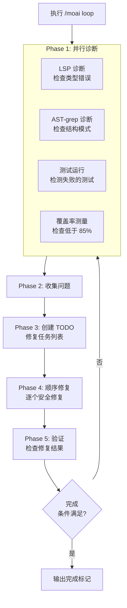
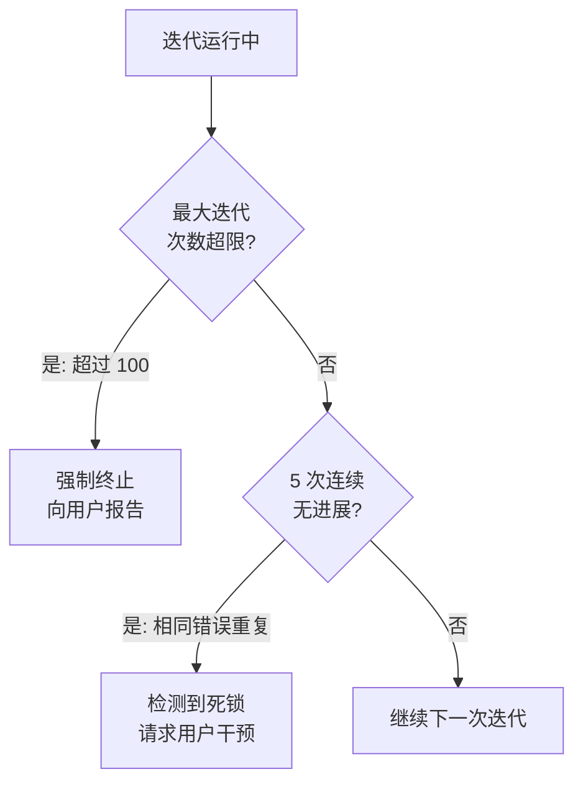
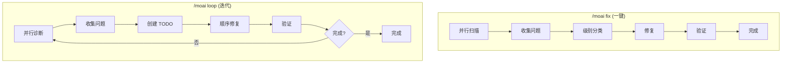
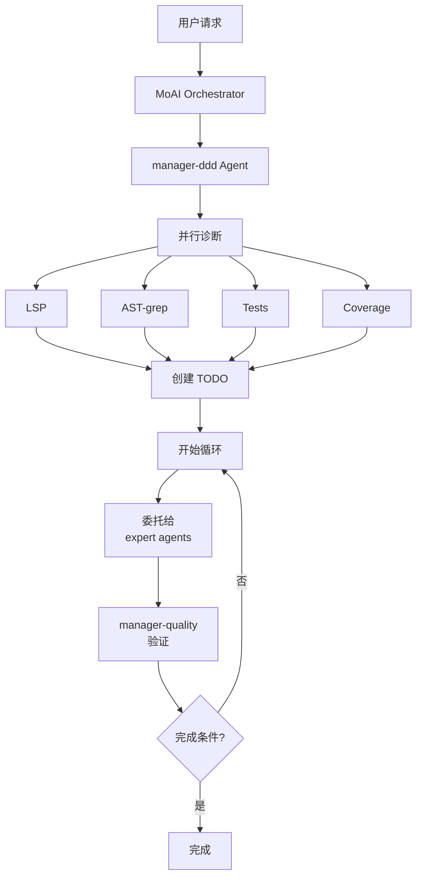

# /moai loop

自主迭代修复循环命令。AI 自动重复**诊断、修复、验证**问题的过程，直到**所有错误都被解决**。


  **一句话总结**: `/moai loop` 是"Ralph Engine"自主修复引擎。
  它重复**诊断 → 修复 → 验证**以自动解决所有代码问题。



**斜杠命令**: 在 Claude Code 中输入 `/moai:loop` 可以直接运行此命令。仅输入 `/moai` 即可查看所有可用子命令列表。


## 概述

编写代码时，可能同时发生多个问题: 类型错误、lint 警告、测试失败。与其手动一个个修复，不如运行 `/moai loop`，AI 会**自动迭代修复**所有问题。

与 `/moai fix` 不同，它**持续重复**直到**满足完成条件**。

## 用法

```bash
> /moai loop
```

在没有单独参数的情况下执行时，会自动查找并修复当前项目的所有问题。

## 支持的标志

| 标志                                   | 描述                             | 示例                          |
| ---------------------------------------- | -------------------------------- | ----------------------------- |
| `--max N` (或 `--max-iterations`)      | 限制最大迭代次数 (默认 100) | `/moai loop --max 10`         |
| `--path <path>`                          | 仅针对特定路径        | `/moai loop --path src/auth/` |
| `--stop-on {level}`                      | 在特定级别或以上停止          | `/moai loop --stop-on 3`      |
| `--auto` (或 `--auto-fix`)             | 启用自动修复 (默认 Level 1)  | `/moai loop --auto`           |
| `--sequential` (或 `--seq`)            | 顺序诊断而不是并行        | `/moai loop --sequential`     |
| `--errors` (或 `--errors-only`)        | 仅修复错误，跳过警告         | `/moai loop --errors`         |
| `--coverage` (或 `--include-coverage`) | 包括覆盖率 (默认 85%)       | `/moai loop --coverage`       |
| `--memory-check`                         | 启用内存压力检测          | `/moai loop --memory-check`   |
| `--resume ID` (或 `--resume-from`)     | 从快照恢复                  | `/moai loop --resume latest`  |

### --max 标志

限制迭代次数:

```bash
# 最多 10 次迭代
> /moai loop --max 10
```


  为防止无限循环，默认值为 100 次。大多数情况在 10 次迭代内完成。


## 执行过程

`/moai loop` 每次迭代都经过以下过程:



### Phase 1: 并行诊断

四种诊断工具**同时运行**以快速识别所有项目问题:

| 诊断工具 | 检查内容 | 发现的问题示例 |
| --------------- | ------- | ------------------------ |
| **LSP** | 类型系统 | 类型不匹配、未定义变量、错误参数 |
| **AST-grep** | 代码结构 | 未使用的 import、危险模式、代码异味 |
| **Tests** | 测试执行 | 失败的测试、发生的错误 |
| **Coverage** | 覆盖率测量 | 低于 85% 的模块 |


  **什么是并行诊断？** 同时运行 4 种诊断比顺序执行快约 4 倍。收集的问题合并为一个列表。


### Phase 2: 问题收集

整理并行诊断发现的所有问题为一个列表:

```
发现的问题 (示例):
  [LSP] src/auth/service.py:42 - 无法将 "int" 分配给 "str" 类型
  [LSP] src/auth/router.py:15 - 未定义类型 "User"
  [AST] src/utils/helper.py:3 - 未使用的 import "os"
  [TEST] tests/test_auth.py::test_login - AssertionError
  [COV] src/auth/service.py - 覆盖率 62% (目标 85%)
```

### Phase 3: TODO 创建

基于收集的问题自动创建修复任务列表 (TODO)。考虑**依赖顺序**来确定修复序列。

例如，如果缺少类型定义，则先添加该类型，然后修复使用该类型的代码。

### Phase 4: 顺序修复

**逐个顺序**修复 TODO 列表中的项目。并行修复可能导致冲突，因此安全地一次处理一个。

### Phase 5: 验证

修复后，再次运行诊断以验证问题已解决。如果仍有问题，返回 Phase 1 并重复。

## 循环防止机制

两种安全措施防止无限循环:



| 安全措施       | 条件             | 动作                                           |
| -------------------- | --------------------- | ------------------------------------------------- |
| **最大迭代限制** | 超过 100 次迭代   | 强制终止循环并报告当前状态    |
| **无进展检测** | 连续 5 次相同错误 | 考虑死锁并请求用户干预 |


  **发生死锁时？** 如果 AI 连续 5 次未能修复同一错误，会自动停止并请求用户干预。这种情况下，请直接检查错误内容或提供提示。


## 完成条件

`/moai loop` 满足以下**三个条件**时终止循环:

| 条件                | 标准              | 描述                              |
| -------------------- | ---------------- | ---------------------------------------- |
| **zero_errors**      | 0 个 LSP 错误      | 没有类型错误或语法错误          |
| **tests_pass**       | 所有测试通过   | 没有失败的测试                         |
| **coverage >= 85%**  | 覆盖率 85%+    | 满足 TRUST 5 质量标准           |

## 与 /moai fix 的区别

`/moai fix` 和 `/moai loop` 看起来相似，但有关键区别:



| 比较项目 | `/moai fix`           | `/moai loop`            |
| ---------------- | --------------------- | ----------------------- |
| **执行次数**| 1次                   | 重复直到完成      |
| **目标**      | 修复当前可见的错误 | 完全解决所有错误 |
| **级别分类** | 有 (Level 1-4)      | 无 (处理所有问题)   |
| **需要批准**| Level 3-4 需要批准| 自主处理         |
| **所需时间**  | 短 (1-2 分钟)       | 可能较长 (5-30 分钟)   |
| **使用时机**   | 简单修复          | 大规模重构后清理 |


  **选择指南**: 错误较少时使用 `/moai fix` 快速解决。错误较多或存在相互关联的问题时，`/moai loop` 更有效。


## Agent 委托链

`/moai loop` 命令的 agent 委托流程:



**Agent 角色:**

| Agent                | 角色        | 主要任务          |
| -------------------- | ----------- | ------------------- |
| **MoAI Orchestrator** | 循环协调 |
| **manager-ddd**       | 循环管理 | 创建 TODO、协调修复 |
| **expert-\***         | 执行修复 | 实际代码修改       |
| **manager-quality**   | 质量验证 | 检查完成条件       |

## 实际示例

### 情况: DDD 实现后出现多个错误

使用 `/moai run` 实现代码后，假设仍有多个错误。

```bash
# 检查当前状态
$ pytest --tb=short
# 3 个测试失败
# 覆盖率: 71%

# 检查 LSP 错误
# 5 个类型错误，2 个未定义引用

# 运行 loop
> /moai loop
```

**执行日志:**

```
[迭代 1/100]
  诊断: 5 个 LSP 错误，3 个测试失败，覆盖率 71%
  TODO: 创建 7 个修复任务
  修复: 解决 5 个类型错误
  验证: 0 个 LSP 错误，2 个测试失败，覆盖率 71%

[迭代 2/100]
  诊断: 2 个测试失败，覆盖率 71%
  TODO: 创建 2 个修复任务
  修复: 2 个测试逻辑修复
  验证: 0 个 LSP 错误，0 个测试失败，覆盖率 74%

[迭代 3/100]
  诊断: 覆盖率 74% (目标 85%)
  TODO: 创建 3 个测试添加任务
  修复: 添加缺失的测试用例
  验证: 0 个 LSP 错误，0 个测试失败，覆盖率 87%

完成条件满足!
  - LSP 错误: 0
  - 测试: 全部通过
  - 覆盖率: 87%

DONE
```

在此示例中，`/moai loop` 仅用 3 次迭代就解决了所有问题。手动操作时，您必须逐个检查和修复每个错误。

## 常见问题

### Q: 如果 `/moai loop` 运行时间过长怎么办？

可以使用 `--max` 标志限制迭代次数，或用 `Ctrl+C` 中断。当前状态已保存，稍后可以恢复。

### Q: 如果只想修复特定类型的错误怎么办？

使用 `--stop-on` 标志:

```bash
# 在 Level 3 或以上停止 (手动处理安全、逻辑错误)
> /moai loop --stop-on 3
```

### Q: `/moai loop` 和 `/moai` 有什么区别？

`/moai loop` 仅负责**错误修复循环**。`/moai` 自动执行**从 SPEC 创建到实现和文档的整个工作流**。

### Q: 如果循环陷入死锁怎么办？

如果 AI 连续 5 �重复相同的错误，会自动停止并请求用户干预。这种情况下，请直接检查代码或提供提示。

## 相关文档

- [/moai fix - 一键自动修复](/utility-commands/moai-fix)
- [/moai - 完全自主自动化](/utility-commands/moai)
- [TRUST 5 质量系统](/core-concepts/trust-5)
- [领域驱动开发](/core-concepts/ddd)
