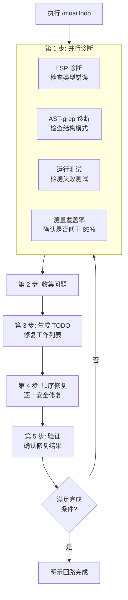
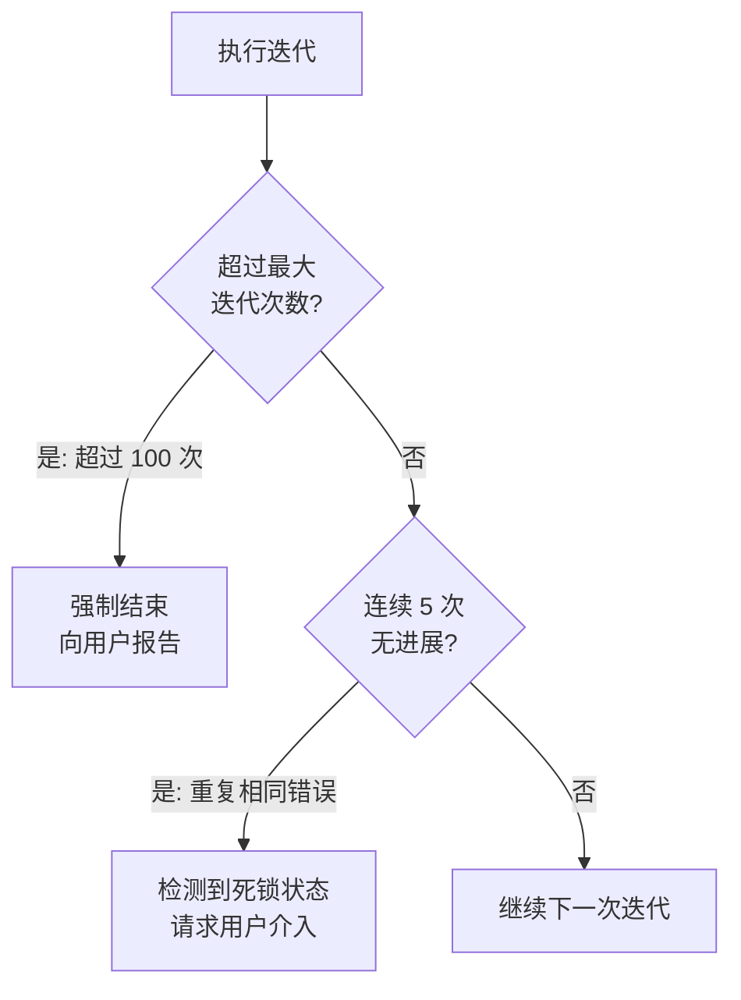
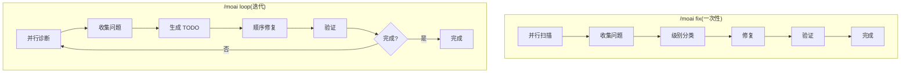
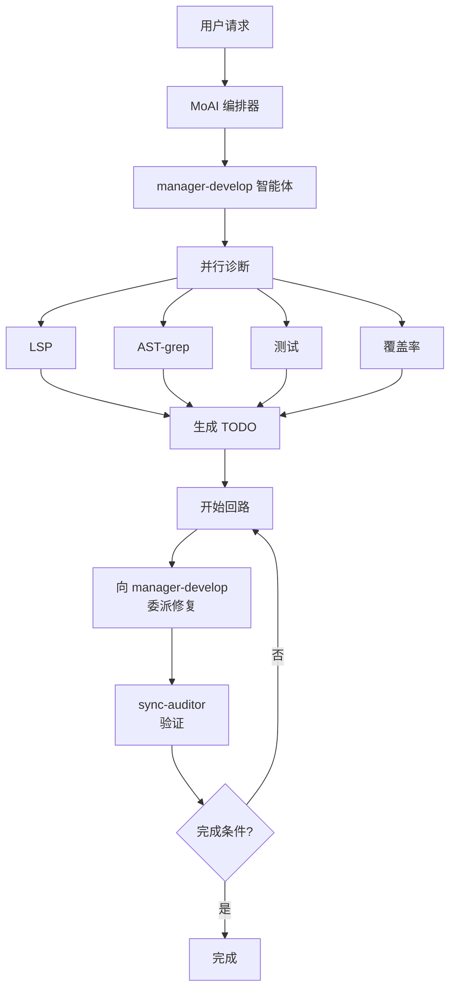

自主迭代修复回路命令。AI 自行诊断问题、修复并验证,**直到所有错误都被解决** 为止自动重复这一过程。


  **一句话总结**: `/moai loop` 是名为 "Ralph Engine" 的自主修复引擎。
  通过反复执行 **诊断 → 修复 → 验证**,自动解决代码中的所有问题。



**斜杠命令**: 在 Claude Code 中输入 `/moai:loop` 即可直接执行此命令。仅输入 `/moai` 会显示所有可用子命令列表。


## 概述

编写代码时,类型错误、lint 警告、测试失败等多个问题可能同时出现。与其手动逐个修复,不如执行 `/moai loop`,让 AI **自动迭代修复** 所有问题。

与 `/moai fix` 只修复 **一次** 不同,`/moai loop` 会 **持续重复直到满足完成条件**。

这个回路是 v3 第二大支柱 **智能体回路工程** 的代表案例。回路自行诊断与修复,无需人在每个错误上介入,而回路留下的观察则作为挽具学习(递归式自我学习)的原料被积累。引擎实现位于 `internal/ralph/engine.go` — 每次迭代的 `Decide()` 按优先级顺序判定 continue / converge / request_review / abort 之一。

## 与 /moai goal 的关系

`/moai loop` 是 **goal 引擎之上的预设**。如果说 `/moai goal "<条件>"` 是用户直接声明完成条件的通用回路,那么 `/moai loop` 就是预先填入"直到清空诊断工具发现的问题队列"这一条件的预设。

| 引擎 | 目标 | 工作方式 | 完成条件 |
|------|------|----------|----------|
| `/moai goal` | 目标收敛回路 | 直到满足用户定义的条件 | 条件表达式满足 |
| `/moai loop` | 诊断修复回路 | 迭代直到错误为 0 | 0 错误 / 0 类型 / 85%+ 覆盖率 |

```text
/moai goal "go test ./... exits 0; 所有 AC 记录为 PASS"
/moai goal status | clear
```

如果终态可以表达为条件表达式,用 `/moai goal`;如果是"把工具发现的问题全部消灭",用 `/moai loop`。

## 使用方法

```bash
> /moai loop
```

无需任何参数,执行后会自动找到并修复当前项目的所有问题。

## 支持的标志

| 标志                                   | 说明                             | 示例                          |
| ---------------------------------------- | -------------------------------- | ----------------------------- |
| `--max N`(或 `--max-iterations`)      | 限制最大迭代次数(默认 100) | `/moai loop --max 10`         |
| `--path <path>`                          | 仅针对特定路径        | `/moai loop --path src/auth/` |
| `--stop-on {level}`                      | 在特定级别及以上中断          | `/moai loop --stop-on 3`      |
| `--auto`(或 `--auto-fix`)             | 启用自动修复(默认 Level 1)  | `/moai loop --auto`           |
| `--sequential`(或 `--seq`)            | 顺序诊断代替并行        | `/moai loop --sequential`     |
| `--errors`(或 `--errors-only`)        | 仅修复错误,跳过警告         | `/moai loop --errors`         |
| `--coverage`(或 `--include-coverage`) | 包含覆盖率(默认 85%)       | `/moai loop --coverage`       |
| `--memory-check`                         | 启用内存压力检测          | `/moai loop --memory-check`   |
| `--resume ID`(或 `--resume-from`)     | 从快照恢复                  | `/moai loop --resume latest`  |

### --max 标志

限制迭代次数:

```bash
# 最多迭代 10 次
> /moai loop --max 10
```


  为防止无限循环,默认值为 100 次。大多数情况下 10 次以内即可
  完成。


## 执行过程

`/moai loop` 每次迭代 (iteration) 都经过以下过程。


```mermaid
flowchart TD
    Start["执行 /moai loop"] --> Diag

    subgraph Diag["第 1 步: 并行诊断"]
        D1["LSP 诊断<br/>检查类型错误"]
        D2["AST-grep 诊断<br/>检查结构模式"]
        D3["运行测试<br/>检测失败测试"]
        D4["测量覆盖率<br/>确认是否低于 85%"]
    end

    Diag --> Collect["第 2 步: 收集问题"]
    Collect --> Todo["第 3 步: 生成 TODO<br/>修复工作列表"]
    Todo --> Fix["第 4 步: 顺序修复<br/>逐一安全修复"]
    Fix --> Verify["第 5 步: 验证<br/>确认修复结果"]
    Verify --> Check{满足完成<br/>条件?}
    Check -->|否| Diag
    Check -->|是| Done["明示回路完成"]
```

### 第 1 步: 并行诊断

4 种诊断工具 **同时** 运行,快速掌握项目的所有问题。

| 诊断工具    | 检查对象     | 发现的问题示例                           |
| ------------ | ------------- | -------------------------------------------- |
| **LSP**      | 类型系统   | 类型不匹配、未定义变量、错误参数        |
| **AST-grep** | 代码结构     | 未使用的 import、危险模式、代码坏味道 |
| **Tests**    | 测试执行   | 失败的测试、发生错误                   |
| **Coverage** | 覆盖率测量 | 低于 85% 的模块                              |


  **什么是并行诊断?** 4 种诊断 **同时** 执行,比逐个顺序
  执行快约 4 倍。这样收集到的问题会合并为
  一个列表。


### 第 2 步: 收集问题

将并行诊断中发现的所有问题整理为一个列表。

```
发现的问题(示例):
  [LSP] src/auth/service.py:42 - 无法将 "int" 赋值给 "str" 类型
  [LSP] src/auth/router.py:15 - "User" 类型未定义
  [AST] src/utils/helper.py:3 - 未使用的 import "os"
  [TEST] tests/test_auth.py::test_login - AssertionError
  [COV] src/auth/service.py - 覆盖率 62%(目标 85%)
```

### 第 3 步: 生成 TODO

基于收集到的问题自动生成修复工作列表 (TODO)。此时会考虑 **依赖顺序** 来决定修复次序。

例如缺少类型定义时,先添加该类型,再修改使用该类型的代码。

### 第 4 步: 顺序修复

**逐一顺序** 修复 TODO 列表中的项目。并行修复可能相互冲突,因此安全地逐一处理。

### 第 5 步: 验证

修复结束后再次运行诊断,确认问题是否解决。若仍有剩余问题,则回到第 1 步继续迭代。

## 回路防护机制

为防止无限循环,有两道安全装置。让回路无限运转也是令牌浪费,因此安全装置同时守护稳定性与令牌经济学。


```mermaid
flowchart TD
    A[执行迭代] --> B{超过最大<br/>迭代次数?}
    B -->|是: 超过 100 次| C["强制结束<br/>向用户报告"]
    B -->|否| D{连续 5 次<br/>无进展?}
    D -->|是: 重复相同错误| E["检测到死锁状态<br/>请求用户介入"]
    D -->|否| F[继续下一次迭代]
```

| 安全装置           | 条件               | 行为                                              |
| ------------------ | ------------------ | ------------------------------------------------- |
| **最大迭代限制** | 超过 100 次         | 强制结束回路并报告当前状态       |
| **无进展检测**    | 连续 5 次相同错误 | 判定为死锁状态并请求用户介入 |


  **发生死锁状态怎么办?** AI 连续 5 次未能修复同一错误时,
  会自动中断并请求用户介入。此时请直接
  查看错误内容或提供提示。


## 完成条件

`/moai loop` 在 **同时满足以下三个条件** 时结束回路。

| 条件                | 标准              | 说明                                 |
| ------------------- | ----------------- | ------------------------------------ |
| **zero_errors**     | LSP 错误 0 个      | 必须没有类型错误、语法错误 |
| **tests_pass**      | 所有测试通过  | 必须没有失败的测试      |
| **coverage >= 85%** | 覆盖率 85% 以上 | 必须满足 TRUST 5 质量标准  |

## 与 /moai fix 的区别

`/moai fix` 和 `/moai loop` 看起来相似,但有核心差异。


```mermaid
flowchart TD
    subgraph Fix["/moai fix(一次性)"]
        F1[并行扫描] --> F2[收集问题]
        F2 --> F3[级别分类]
        F3 --> F4[修复]
        F4 --> F5[验证]
        F5 --> F6[完成]
    end

    subgraph Loop["/moai loop(迭代)"]
        L1[并行诊断] --> L2[收集问题]
        L2 --> L3[生成 TODO]
        L3 --> L4[顺序修复]
        L4 --> L5[验证]
        L5 --> L6{完成?}
        L6 -->|否| L1
        L6 -->|是| L7[完成]
    end
```

| 对比项目     | `/moai fix`           | `/moai loop`            |
| ------------- | --------------------- | ----------------------- |
| **执行次数** | 1 次                   | 迭代直到完成      |
| **目标**      | 修复当前可见的错误 | 完全解决所有错误     |
| **级别分类** | 有 (Level 1-4)      | 无(处理所有问题)   |
| **需要批准** | Level 3-4 需批准 | 自主处理         |
| **耗时** | 短(1-2 分钟)          | 可能较长(5-30 分钟)     |
| **使用时机** | 简单修复           | 大规模重构后的收尾 |


  **选择指南**: 错误不多时用 `/moai fix` 快速解决。错误
  较多或问题相互关联时,`/moai loop` 更有效。


## 智能体委派链

`/moai loop` 命令的智能体委派流程:


```mermaid
flowchart TD
    User["用户请求"] --> Orchestrator["MoAI 编排器"]
    Orchestrator --> ManagerDDD["manager-develop 智能体"]

    ManagerDDD --> Diagnose["并行诊断"]
    Diagnose --> LSP["LSP"]
    Diagnose --> AST["AST-grep"]
    Diagnose --> Test["测试"]
    Diagnose --> Cov["覆盖率"]

    LSP --> Todo["生成 TODO"]
    AST --> Todo
    Test --> Todo
    Cov --> Todo

    Todo --> Loop["开始回路"]

    Loop --> Fix["向 manager-develop<br/>委派修复"]
    Fix --> Verify["sync-auditor<br/>验证"]

    Verify --> Complete{"完成条件?"}
    Complete -->|否| Loop
    Complete -->|是| Done["完成"]
```

**智能体角色:**

| 智能体                | 角色      | 主要工作            |
| ----------------------- | --------- | -------------------- |
| **MoAI 编排器** | 协调回路 | 协调诊断、向用户报告 |
| **manager-develop**     | 管理回路与执行修复 | 生成 TODO、实际修改代码 (cycle_type=autofix) |
| **sync-auditor**        | 质量验证 | 确认完成条件       |

## 实战示例

### 场景: DDD 实现后出现多个错误

假设用 `/moai run` 实现代码后,仍残留多个错误。

```bash
# 确认当前状态
$ pytest --tb=short
# 3 个测试失败
# 覆盖率: 71%

# 确认 LSP 错误
# 5 个类型错误, 2 个未定义引用

# 执行 loop
> /moai loop
```

**执行日志:**

```
[迭代 1/100]
  诊断: LSP 错误 5 个, 测试失败 3 个, 覆盖率 71%
  TODO: 生成 7 项修复工作
  修复: 解决 5 个类型错误
  验证: LSP 错误 0 个, 测试失败 2 个, 覆盖率 71%

[迭代 2/100]
  诊断: 测试失败 2 个, 覆盖率 71%
  TODO: 生成 2 项修复工作
  修复: 修改测试逻辑 2 处
  验证: LSP 错误 0 个, 测试失败 0 个, 覆盖率 74%

[迭代 3/100]
  诊断: 覆盖率 74%(目标 85%)
  TODO: 生成 3 项添加测试的工作
  修复: 补充缺失的测试用例
  验证: LSP 错误 0 个, 测试失败 0 个, 覆盖率 87%

满足完成条件!
  - LSP 错误: 0 个
  - 测试: 全部通过
  - 覆盖率: 87%

DONE
```

在这个例子中,`/moai loop` 仅用 3 次迭代就解决了所有问题。如果手动处理,需要逐个确认并修复每个错误。

## 常见问题

### Q: `/moai loop` 执行太久怎么办?

可以用 `--max` 标志限制迭代次数,或用 `Ctrl+C` 中断。当前状态会被保存,以后可以重新开始。

### Q: 只想修复特定类型的错误?

请使用 `--stop-on` 标志:

```bash
# 在 Level 3 及以上中断(安全、逻辑错误手动处理)
> /moai loop --stop-on 3
```

### Q: `/moai loop` 和 `/moai` 有什么区别?

`/moai loop` **只负责错误修复回路**。`/moai` 则从 SPEC 生成到实现、文档化,自动执行 **完整工作流**。

### Q: `/moai loop` 和 `/moai goal` 有什么区别?

`/moai loop` 的目标是消灭诊断工具(LSP、测试、linter)发现的问题,而 `/moai goal` 是朝着用户声明的任意完成条件(例: "AC-001~AC-010 全部达成")持续轮次。`/moai loop` 是 goal 引擎的预设。

### Q: 回路陷入死锁状态怎么办?

AI 连续 5 次重复同一错误时,会自动中断并请求用户介入。此时请直接查看代码或提供提示。

## 相关文档

- [/moai fix - 一次性自动修复](/utility-commands/moai-fix)
- [/moai - 完全自主自动化](/utility-commands/moai)
- [TRUST 5 质量系统](/core-concepts/trust-5)
- [领域驱动开发](/core-concepts/ddd)
