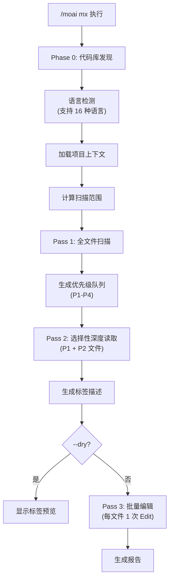

扫描代码库并添加 @MX 代码级注解的命令。自动插入注释，使 AI 代理能够**快速理解代码上下文**。


**一句话总结**: `/moai mx` 自动安装"代码导航标识"。将危险代码、重要函数、缺失测试等**用 @MX 标签标记**，帮助 AI 代理更好地理解代码。



**斜杠命令**: 在 Claude Code 中输入 `/moai:mx` 可以直接运行此命令。仅输入 `/moai` 即可查看所有可用子命令列表。


## 概述

@MX 标签是附加在代码上的元数据注解。帮助 AI 代理在读取代码时立即识别重要函数、危险模式和未完成的工作。`/moai mx` 通过 3 遍扫描分析代码库，自动插入适当的标签。

### @MX 标签类型

| 标签 | 用途 | 使用时机 |
|------|------|---------|
| `@MX:ANCHOR` | 不变契约 | fan_in >= 3 (被 3 处以上调用) |
| `@MX:WARN` | 危险区域 | 复杂度 >= 15, goroutine/async 模式 |
| `@MX:NOTE` | 上下文传递 | 魔术常量、业务规则说明 |
| `@MX:TODO` | 未完成工作 | 缺少测试、SPEC 未实现 |

## 用法

```bash
# 扫描整个代码库
> /moai mx --all

# 预览 (不修改文件)
> /moai mx --dry

# 仅 P1 优先级 (高 fan_in 函数)
> /moai mx --priority P1

# 强制覆盖现有标签
> /moai mx --all --force

# 仅扫描特定语言
> /moai mx --all --lang go,python

# 降低 fan_in 阈值
> /moai mx --all --threshold 2
```

## 支持的标志

| 标志 | 描述 | 示例 |
|------|------|------|
| `--all` | 扫描整个代码库 (所有语言, 所有 P1+P2 文件) | `/moai mx --all` |
| `--dry` | 仅预览 - 不修改文件显示标签 | `/moai mx --dry` |
| `--priority P1-P4` | 按优先级过滤 (默认: 全部) | `/moai mx --priority P1` |
| `--force` | 覆盖现有 @MX 标签 | `/moai mx --force` |
| `--exclude PATTERN` | 附加排除模式 (逗号分隔) | `/moai mx --exclude "vendor/**"` |
| `--lang LANGS` | 仅扫描指定语言 (默认: 自动检测) | `/moai mx --lang go,ts` |
| `--threshold N` | 覆盖 fan_in 阈值 (默认: 3) | `/moai mx --threshold 2` |
| `--no-discovery` | 跳过 Phase 0 代码库发现 | `/moai mx --no-discovery` |
| `--team` | 按语言并行扫描 (代理团队模式) | `/moai mx --team` |

## 优先级级别

| 优先级 | 条件 | 标签类型 |
|--------|------|---------|
| **P1** | fan_in >= 3 (被 3 处以上调用) | `@MX:ANCHOR` |
| **P2** | goroutine/async, 复杂度 >= 15 | `@MX:WARN` |
| **P3** | 魔术常量, 缺少 docstring | `@MX:NOTE` |
| **P4** | 缺少测试 | `@MX:TODO` |

## 执行过程

`/moai mx` 分 3 遍执行。



### Phase 0: 代码库发现

支持 16 种语言的自动检测。识别每种语言的配置文件和注释语法。

### Pass 1: 全文件扫描

扫描所有源文件并生成优先级队列:

- **Fan-in 分析**: 统计函数/方法引用次数
- **复杂度检测**: 行数、分支数、嵌套深度
- **模式检测**: 语言特定危险模式

### Pass 2: 选择性深度读取

深度分析 P1 和 P2 文件，生成准确的标签描述。

### Pass 3: 批量编辑

每文件 1 次 Edit 调用插入标签。现有 @MX 标签默认保留 (`--force` 除外)。

## 批量检查点

大规模扫描 (50+ 文件) 使用批量处理:

- **批量大小**: 每次 50 个文件
- **自动提交**: 每批完成后提交中间结果
- **进度跟踪**: `.moai/cache/mx-scan-progress.json`
- **可恢复**: 从中断的扫描处继续


检测到速率限制时，保存当前批次并优雅停止。重新运行 `/moai mx` 将从上次检查点恢复。


## 与其他工作流的集成

| 工作流 | MX 集成方式 |
|--------|-----------|
| `/moai sync` | 同步期间自动执行 MX 验证 (SPEC-MX-002) |
| `/moai edit` | 文件编辑时自动验证 @MX 标签 (v2.7.8+) |
| `/moai run` | DDD ANALYZE 阶段自动触发 |
| `/moai review` | 包含 MX 标签合规检查 |

## 常见问题

### Q: @MX 标签会影响代码执行吗？

不会，@MX 标签仅作为注释存在。对代码执行和性能没有任何影响。

### Q: 已有标签会怎样？

默认保留现有标签。使用 `--force` 标志可以覆盖。

### Q: 自动生成的文件也会被标记吗？

不会。根据 `.moai/config/sections/mx.yaml` 中的排除模式，生成文件、vendor 目录和 mock 文件会自动跳过。

## 相关文档

- [/moai clean - 死代码删除](/utility-commands/moai-clean)
- [/moai review - 代码审查](/quality-commands/moai-review)
- [/moai - 完全自主自动化](/utility-commands/moai)
