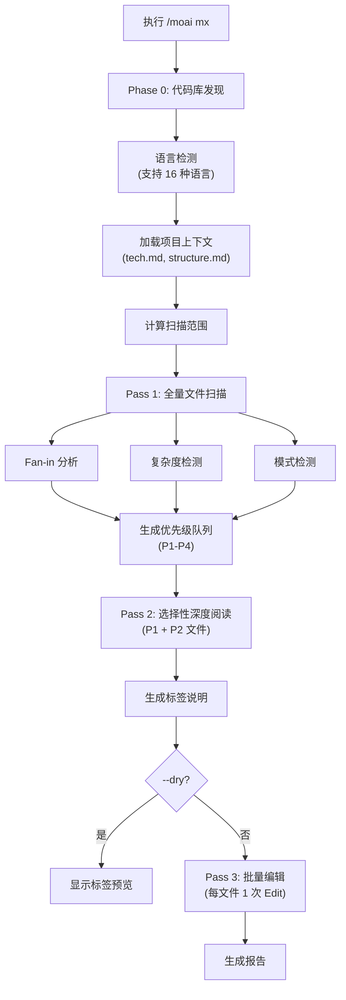
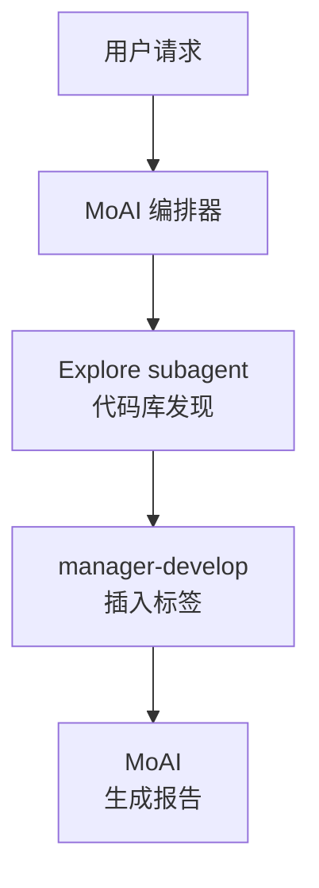

扫描代码库并添加 @MX 代码级注解的命令。自动插入注释,使 AI 智能体 **能够快速理解代码上下文**。


**一句话总结**: `/moai mx` 自动安装"代码导航路标"。将危险代码、重要函数、缺失测试等 **用 @MX 标签标记**,让 AI 智能体更好地理解代码。



**斜杠命令**: 在 Claude Code 中输入 `/moai:mx` 即可直接执行此命令。仅输入 `/moai` 会显示所有可用子命令列表。


## 概述

@MX 标签是附加在代码上的元数据注解。它使 AI 智能体在阅读代码时能立即掌握重要函数、危险模式、未完成工作。`/moai mx` 通过 3 阶段扫描分析代码库,并自动插入合适的标签。

把项目知识以文件形式留给智能体是挽具设计的基本模式,@MX 标签是把这一模式应用到 **代码层面** 的做法。智能体不必每次通读全部代码重新发现风险点,只需跟着路标走 — 既节省探索令牌(令牌经济学),又不漏掉风险点(质量),一举两得。

### @MX 标签类型

| 标签 | 用途 | 使用时机 |
|------|------|----------|
| `@MX:ANCHOR` | 不变契约 | fan_in >= 3(3 处以上调用) |
| `@MX:WARN` | 危险区域 | 复杂度 >= 15,goroutine/async 模式 |
| `@MX:NOTE` | 传递上下文 | 魔法常量、业务规则说明 |
| `@MX:TODO` | 未完成工作 | 缺少测试、SPEC 未实现 |

## 使用方法

```bash
# 扫描整个代码库
> /moai mx --all

# 预览(不修改,仅确认)
> /moai mx --dry

# 仅 P1 优先级(高 fan_in 函数)
> /moai mx --priority P1

# 强制覆盖既有标签
> /moai mx --all --force

# 仅扫描特定语言
> /moai mx --all --lang go,python

# 降低 fan_in 阈值
> /moai mx --all --threshold 2
```

## 支持的标志

| 标志 | 说明 | 示例 |
|-------|------|------|
| `--all` | 扫描整个代码库(所有语言,所有 P1+P2 文件) | `/moai mx --all` |
| `--dry` | 仅预览 - 不修改文件,只显示标签 | `/moai mx --dry` |
| `--priority P1-P4` | 优先级过滤(默认: 全部) | `/moai mx --priority P1` |
| `--force` | 覆盖既有 @MX 标签 | `/moai mx --force` |
| `--exclude PATTERN` | 额外排除模式(逗号分隔) | `/moai mx --exclude "vendor/**"` |
| `--lang LANGS` | 仅扫描特定语言(默认: 自动检测) | `/moai mx --lang go,ts` |
| `--threshold N` | 重设 fan_in 阈值(默认: 3) | `/moai mx --threshold 2` |
| `--no-discovery` | 跳过 Phase 0 代码库发现 | `/moai mx --no-discovery` |
| `--team` | 按语言并行扫描(智能体团队模式) | `/moai mx --team` |

## 优先级级别

| 优先级 | 条件 | 标签类型 |
|---------|------|----------|
| **P1** | fan_in >= 3(3 处以上调用) | `@MX:ANCHOR` |
| **P2** | goroutine/async,复杂度 >= 15 | `@MX:WARN` |
| **P3** | 魔法常量,缺少 docstring | `@MX:NOTE` |
| **P4** | 缺少测试 | `@MX:TODO` |

核心原则不是"给所有代码打标签",而是 **"只给 AI 最应优先关注的代码打标签"**。大多数代码不满足任何条件因而没有标签,这才是正常的。

## 执行过程

`/moai mx` 以 3 个 Pass 执行。


```mermaid
flowchart TD
    Start["执行 /moai mx"] --> Phase0["Phase 0: 代码库发现"]

    Phase0 --> LangDetect["语言检测<br/>(支持 16 种语言)"]
    LangDetect --> Context["加载项目上下文<br/>(tech.md, structure.md)"]
    Context --> Scope["计算扫描范围"]

    Scope --> Pass1["Pass 1: 全量文件扫描"]
    Pass1 --> FanIn["Fan-in 分析"]
    Pass1 --> Complexity["复杂度检测"]
    Pass1 --> Pattern["模式检测"]
    FanIn --> Queue["生成优先级队列<br/>(P1-P4)"]
    Complexity --> Queue
    Pattern --> Queue

    Queue --> Pass2["Pass 2: 选择性深度阅读<br/>(P1 + P2 文件)"]
    Pass2 --> Generate["生成标签说明"]

    Generate --> Pass3{"--dry?"}
    Pass3 -->|是| Preview["显示标签预览"]
    Pass3 -->|否| Insert["Pass 3: 批量编辑<br/>(每文件 1 次 Edit)"]
    Insert --> Report["生成报告"]
```

### Phase 0: 代码库发现

支持 16 种语言的自动检测:

| 语言 | 检测文件 | 注释前缀 |
|------|-----------|------------|
| Go | go.mod, go.sum | `//` |
| Python | pyproject.toml, requirements.txt | `#` |
| TypeScript | tsconfig.json | `//` |
| JavaScript | package.json | `//` |
| Rust | Cargo.toml | `//` |
| Java | pom.xml, build.gradle | `//` |
| Kotlin | build.gradle.kts | `//` |
| Ruby | Gemfile | `#` |
| Elixir | mix.exs | `#` |
| C++ | CMakeLists.txt | `//` |
| Swift | Package.swift | `//` |
| 另 5 种 | 各语言的配置文件 | 按语言 |

### Pass 1: 全量文件扫描

扫描所有源文件并生成优先级队列:

- **Fan-in 分析**: 统计函数/方法被引用次数
- **复杂度检测**: 行数、分支数、嵌套深度
- **模式检测**: 各语言的危险模式(goroutine, async, threading, unsafe)

### Pass 2: 选择性深度阅读

深度分析 P1 和 P2 文件,生成精准的标签说明。利用项目上下文(tech.md, structure.md, product.md)。不是通读全部文件,而是仅深读优先级靠前的文件 — 扫描本身也按令牌效率设计。

### Pass 3: 批量编辑

每个文件仅调用 1 次 Edit 插入标签。既有 @MX 标签会得到保留(`--force` 除外)。

## 批处理检查点

大规模扫描(50+ 文件)使用批处理:

- **批大小**: 每次迭代 50 个文件
- **自动提交**: 每批完成后提交中间结果
- **保存进度**: `.moai/cache/mx-scan-progress.json`
- **可恢复**: 中断的扫描可以继续进行


检测到 rate limit 时会保存当前批次并 graceful 中断。再次执行 `/moai mx` 会从中断点恢复。


## 智能体委派链


```mermaid
flowchart TD
    User["用户请求"] --> MoAI["MoAI 编排器"]
    MoAI --> Explore["Explore subagent<br/>代码库发现"]
    Explore --> Backend["manager-develop<br/>插入标签"]
    Backend --> Report["MoAI<br/>生成报告"]
```

## 与其他工作流的集成

@MX 标签已集成到 SPEC 3-Phase 全阶段 — plan 中识别对象,run 中创建/更新,sync 中验证并补充缺失:

| 工作流 | MX 集成方式 |
|-----------|-------------|
| `/moai run` | 在 DDD ANALYZE 阶段自动触发,创建/更新标签 |
| `/moai sync` | 同步中自动执行 MX 验证 |
| `/moai review` | 包含 MX 标签合规检查 |

## 常见问题

### Q: @MX 标签会影响代码执行吗?

不会,@MX 标签只以注释形式存在。对代码执行或性能完全没有影响。

### Q: 已有既有标签会怎样?

默认保留既有标签。使用 `--force` 标志则会覆盖。

### Q: 自动生成的文件也会打标签吗?

不会。按照 `.moai/config/sections/mx.yaml` 的排除模式,生成的文件、vendor、mock 文件会被自动跳过。

## 相关文档

- [/moai clean - 移除死代码](/utility-commands/moai-clean)
- [/moai review - 代码审查](/quality-commands/moai-review)
- [/moai - 完全自主自动化](/utility-commands/moai)
