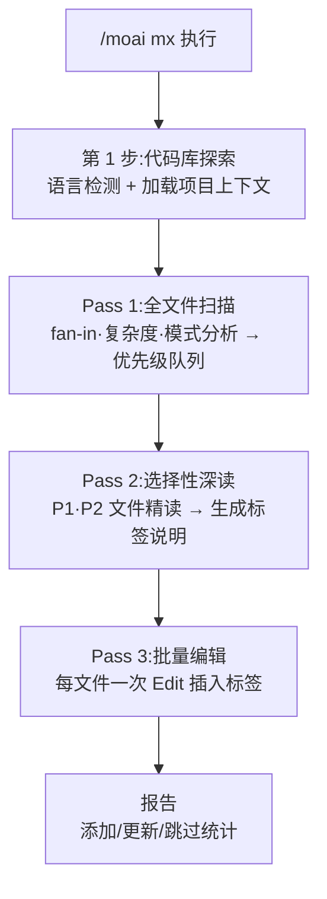

扫描代码库并添加 **@MX 代码注释** 的命令。@MX 标签是帮助 AI 智能体快速把握代码的上下文、意图、风险的代码级注解。


**一句话概括**:`/moai mx` 是"为 AI 安装代码路标的工具"。它自动找出高 fan-in 函数、危险区域、未完成之处等,在代码中植入 `@MX:ANCHOR`、`@MX:WARN`、`@MX:NOTE`、`@MX:TODO` 标签。



**斜杠命令**:在 Claude Code 中输入 `/moai:mx` 即可直接执行该命令。仅输入 `/moai` 会显示所有可用子命令列表。


## 概述

智能体理解代码所耗费的成本即上下文(代币)。@MX 标签把"此函数在 8 处被调用,不要随意改动签名"之类的上下文直接钉在代码旁,使智能体无需每次都重新分析整个代码库。从 harness 工程的角度看,这是 **植入代码的锚点** —— 用一次注解替代反复探索成本的代币经济学装置。

主要在以下情况使用:

- 没有 @MX 标签的遗留代码库
- 大规模重构前标注危险区域
- 大幅代码变更后更新注解
- `/moai sync` 中的 MX 验证(自动执行)

## 标签类型与优先级

| 优先级 | 条件 | 标签类型 |
|----------|------|-----------|
| P1 | fan_in >= 3 调用者 | `@MX:ANCHOR`(不变契约,高 fan_in) |
| P2 | goroutine/async,复杂度 >= 15 | `@MX:WARN`(危险区域,必须有 `@MX:REASON`) |
| P3 | 魔法常量、缺失的 docstring | `@MX:NOTE`(上下文·意图) |
| P4 | 缺失的测试 | `@MX:TODO`(未完成) |
| P5 | 有意的可运行简化(伴随 `@MX:CEILING` + `@MX:UPGRADE` 子行) | `@MX:DEBT` |

## 用法

```bash
# 扫描整个代码库(16 种语言)
> /moai mx --all

# 不修改的预览
> /moai mx --dry

# 仅 P1(高 fan_in 函数)
> /moai mx --priority P1

# 仅扫描 Go、Python
> /moai mx --all --lang go,python
```

## 支持的标志

| 标志 | 说明 | 示例 |
|-------|------|------|
| `--all` | 扫描整个代码库(所有语言,P1+P2 全部文件) | `/moai mx --all` |
| `--dry` | 预览 —— 不修改文件,仅显示将添加的标签 | `/moai mx --dry` |
| `--priority P1-P4` | 按优先级级别过滤(默认:全部) | `/moai mx --priority P1` |
| `--force` | 覆盖已有的 @MX 标签 | `/moai mx --all --force` |
| `--exclude pattern` | 额外的排除模式(逗号分隔) | `/moai mx --exclude "vendor/,*.gen.go"` |
| `--lang go,py,ts` | 仅扫描指定语言(默认:自动检测) | `/moai mx --lang go,python` |
| `--threshold N` | 覆盖 fan_in 阈值(默认:3) | `/moai mx --all --threshold 2` |
| `--no-discovery` | 跳过第 1 步代码库探索 | `/moai mx --no-discovery` |

## 执行过程

`/moai mx` 以探索第 1 步 + 3-Pass 扫描执行。


```mermaid
flowchart TD
    Start["/moai mx 执行"] --> Phase1["第 1 步:代码库探索<br/>语言检测 + 加载项目上下文"]
    Phase1 --> Pass1["Pass 1:全文件扫描<br/>fan-in·复杂度·模式分析 → 优先级队列"]
    Pass1 --> Pass2["Pass 2:选择性深读<br/>P1·P2 文件精读 → 生成标签说明"]
    Pass2 --> Pass3["Pass 3:批量编辑<br/>每文件一次 Edit 插入标签"]
    Pass3 --> Report["报告<br/>添加/更新/跳过统计"]
```

### 第 1 步:代码库探索

检测项目语言(16 种语言,标记文件优先级)并确定各语言的注释前缀(`//`、`#` 等)。读取 `.moai/project/tech.md`、`structure.md`、`product.md`、`README.md` 以加载用于标签说明的项目上下文,并计算扫描范围与代币预算。给出 `--no-discovery` 则跳过此步骤。

### Pass 1:全文件扫描

用各语言的模式 Glob 所有源文件,执行 fan-in 分析(函数·方法引用计数)、复杂度检测(行数·分支·嵌套深度)、模式检测(goroutine·async·threading·unsafe),并生成按分数排序的优先级队列(P1-P4)。

### Pass 2:选择性深读

仅精读 P1·P2 文件以分析函数签名与调用模式,并以各语言的注释语法生成反映项目上下文(tech.md·structure.md·product.md)的准确标签说明。

### Pass 3:批量编辑

每文件一次 Edit 一并插入该文件的所有标签。已有的 @MX 标签在没有 `--force` 时会被保留。插入对象少于 5 个时由编排器直接编辑(不 spawn),5 个及以上时委派给批量编辑智能体。

## 与 /moai sync·run 的集成

- **`/moai sync`**:在 sync 阶段自动执行 MX 验证 —— 扫描上次 sync 之后变更的文件以确认缺失的 @MX 标签,若无 `--skip-mx` 标志则添加标签,然后将标签变更包含进 sync 报告。
- **`/moai run`**:在 DDD ANALYZE 阶段,若代码库中一个 @MX 标签都没有,则自动触发 3-Pass。已有标签会被验证·更新,新代码会添加新标签。

## 智能体委派链

| 阶段 | 执行主体 | 主要工作 |
|------|-----------|-----------|
| 第 1 步(探索) | Explore 子智能体 | 语言检测、加载项目上下文 |
| Pass 1(扫描) | Explore 或 `Agent(general-purpose)`(后端范围) | 全文件扫描、生成优先级队列 |
| Pass 2(深读) | `Agent(general-purpose)`(后端范围) | P1·P2 精读、生成标签说明 |
| Pass 3(编辑) | `Agent(general-purpose)`(后端范围);少于 5 个由编排器直接 | 批量编辑、插入标签 |

## 相关文档

- [/moai sync - 文档同步](/workflow-commands/moai-sync)
- [/moai run - DDD/TDD 实现](/workflow-commands/moai-run)
- [/moai clean - 死代码清除](/utility-commands/moai-clean)
