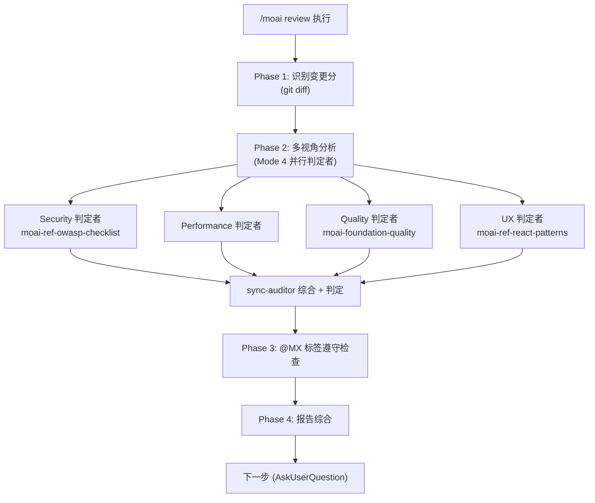

从安全·性能·质量·UX 四个视角审查代码，并确认 `@MX` 标签的遵守情况，生成一份按优先级排序的综合报告。


**斜杠命令**：在 Claude Code 中输入 `/moai:review` 即可立即执行该命令。只输入 `/moai` 会显示所有可用子命令列表。


## 概述

`/moai review` 是**多视角代码审查**命令。它以安全（Security）·性能（Performance）·质量（Quality）·UX 四个视角的 read-only 判定者分析变更分，点检 `@MX` 标签遵守情况后，产出一份按严重度整理的综合报告。

`/moai review` 是**只读、仅报告的透镜**——只负责找出并报告缺陷，不修改任何文件。要真正修复所发现的问题，交给 `/moai fix`（或 `/moai loop`）。也就是说，`/moai review` **报告**问题，`/moai loop` **修复**有限的问题集合，二者是层次关系。

## 支持的标志

| 标志 | 说明 | 示例 |
|-------|------|------|
| `--staged` | 只审查已暂存（`git add`）的变更分 | `/moai review --staged` |
| `--branch BRANCH` | 将当前分支与 BRANCH 比较（默认 main） | `/moai review --branch main` |
| `--security` | 聚焦安全审查（OWASP·injection·认证） | `/moai review --security` |
| `--file PATH` | 只审查特定文件 | `/moai review --file src/auth.go` |


`--team` 并行审查模式已随 Agent Teams 静态层一起**退役（tombstone）**。并行审查以 Mode 4 子代理扇出执行，而非团队。


## 代理链

四个视角以 **Mode 4 并行 read-only 扇出**执行——每个视角一个、最多 4 个 read-only 判定者（`Agent(general-purpose)`）在一轮中 spawn，并在 3-5 并发上限内运作。各判定者的发现汇入 **sync-auditor** 子代理的综合，由 sync-auditor 拥有最终判定——扇出只改变执行形态，不转移判定所有权。



## 四个视角

| 视角 | 检查项 |
|------|-----------|
| **Security** | OWASP Top 10、输入校验、认证/授权、密钥泄露、injection（SQL/command/XSS/CSRF） |
| **Performance** | 算法复杂度、DB 查询效率（N+1）、内存模式、缓存机会、并发安全 |
| **Quality** | TRUST 5 遵守、命名/可读性、错误处理、变更代码测试覆盖率、项目模式一致性 |
| **UX** | 用户流程完整性、错误状态/边界情况、可访问性（WCAG/ARIA）、加载状态、公开接口 breaking change |

发现阶段会把置信度低或严重度低的问题也**全部**报告（各自赋予 confidence·severity）。过滤由判定阶段（must-pass 阈值 + 调和平均分）在 downstream 负责——发现阶段的目标是覆盖率。

## --security 正式流程

指定 `--security` 标志时，安全视角获得优先级并做更深入的分析。

### 依赖漏洞扫描

枚举项目清单文件（`go.mod`、`package.json`、`requirements.txt`、`Cargo.toml`、`pyproject.toml`、`Gemfile`、`composer.json`、`mix.exs`、`Package.swift`、`pubspec.yaml`），用 project marker 自动检测语言后，以 per-spawn `Agent(general-purpose)` 安全审查者执行漏洞扫描。OWASP 完整检查清单由 `moai-ref-owasp-checklist` 技能供给。

### 密钥扫描（增量 + 检查点）

对 git 历史做增量扫描。把上次扫描的 SHA 检查点记录在 `.moai/state/secrets-scan-checkpoint.txt`，若有检查点则只扫描新提交范围 + 工作树，然后把检查点更新为当前 HEAD。首次运行或显式 full-scan 时，用 `--all` 扫描全部历史。

### 数据隔离点检

确认多租户（阻断跨租户数据流）、PII 分离（日志·指标·遥测中不记录 PII）、共享状态泄漏（无携带请求作用域数据的可变全局）等边界。

## @MX 标签遵守检查

视角分析之后，点检变更文件的 `@MX` 标签遵守情况：

- 新增 export 函数：推荐 `@MX:NOTE` 或 `@MX:ANCHOR`
- high fan_in 函数（调用者 ≥ 3）：必须 `@MX:ANCHOR`
- 危险模式：推荐 `@MX:WARN`
- 未测试的公开函数：推荐 `@MX:TODO`

把缺失或过时的 `@MX` 标签作为 findings 报告。

## 报告结构

综合审查报告按严重度整理：

```markdown
## Code Review Report - {target}

### Critical Issues (must fix)
- [SECURITY] file:line: 说明
- [PERFORMANCE] file:line: 说明

### Warnings (should fix)
- [QUALITY] file:line: 说明
- [UX] file:line: 说明

### MX Tag Compliance
- Missing tags: N / Outdated tags: N / Compliant files: N/M

### Overall Assessment
- Security: PASS/FAIL
- Performance/Quality/UX: PASS/WARN
- TRUST 5 Score: N/5
```


**Security FAIL = 整体 FAIL**。安全 must-pass 基准不会被其他视角的高分抵消。


## 下一步

报告后以 `AskUserQuestion` 提供如下选项：

- **自动修复（推荐）**：用 `/moai fix` 自动解决 Level 1-2 问题（critical·复杂问题需手动审查）
- **创建修复任务**：把每个 finding 登记为 TaskList 条目
- **导出报告**：保存到 `.moai/reports/`
- **忽略**：不做即时处理，只查看审查结果

## 相关文档

- [/moai fix](/utility-commands/moai-fix) - 自动修复所发现的问题
- [/moai loop](/utility-commands/moai-loop) - 反复修复有限的问题集合
- [TRUST 5 质量系统](/core-concepts/trust-5) - 质量基准详情
