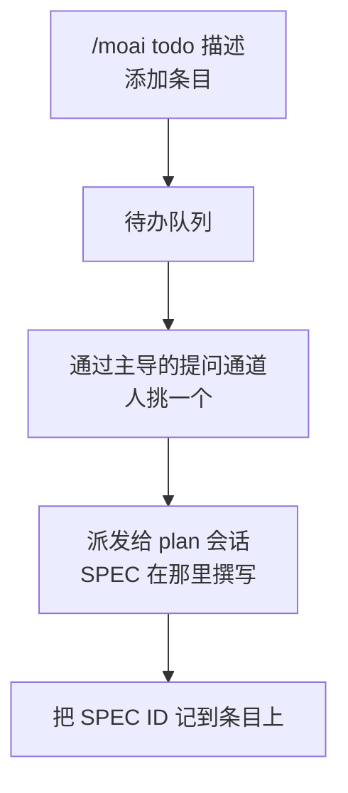



把接下来要做的事一行一行堆起来的**待办队列**。看板的 `backlog` 列没有专属会话，所以没有人会自己把工作塞进去。因此，把卡片放上看板始终是人的判断，而 `/moai todo` 就是那个入口。


**一句话概括**：`/moai todo` 是"记下下一步做什么的那一行"。放入条目、查看列表、清掉已完成的、再挑出下一个要开工的。它既不是 SPEC 也不是计划——只有在被挑中的那一刻，它才成为 SPEC。



**斜杠命令**：在 Claude Code 中输入 `/moai:todo` 即可直接执行。只输入 `/moai` 会显示所有可用子命令的列表。


## 概述

待办队列的一个条目就是**一行意图**。不是 SPEC、不是计划书、也不是估算。只有当人挑中这个条目、主导会话把它派发给 `plan` 会话时，它才成为 SPEC。

这个队列刻意保持单薄。SPEC、git 历史或看板能更好地记录的东西一概不装，只留下**人接下来想要什么**。



## 用法

```bash
# 添加条目
> /moai todo "整理认证中间件的错误路径"

# 查看队列
> /moai todo
```

| 调用 | 行为 |
|------|------|
| `/moai todo "<描述>"` | 把条目追加到队列末尾，并显示新增的条目及其位置。 |
| `/moai todo` | 按顺序显示队列，带位置编号。 |

移除条目和挑选下一张卡片不是斜杠表面上的动词。这两件事归下文的终端 CLI（`moai todo done`、`moai todo next`），或通过主导会话完成选择。

其他参数形式一律当作描述处理。`/moai todo 解决 CI 缓存不稳定` 不是错误，而是一次条目添加——听错话的代价不过是人删掉一行而已。

## 状态文件

队列保存在 `.moai/state/kanban/backlog.json`。它只存在于项目内部，不会被提交。

```json
{
  "version": 1,
  "items": [
    {
      "id": "t1",
      "text": "整理认证中间件的错误路径",
      "added_at": "<RFC3339 时间>",
      "spec_id": null,
      "state": "queued"
    }
  ]
}
```

| 字段 | 含义 |
|------|------|
| `id` | 添加时分配的简短而稳定的标识符。移除后永不复用。 |
| `spec_id` | 指向 SPEC 标识符的可选关联。挑选时用 `--spec` 传入就会当场填写；还不知道时，即使处于 `picked` 状态也保持 `null`。 |
| `state` | 生命周期判别字段。取值为 `queued` · `picked` · `dropped`——"还是待办条目"与"已上看板的卡片"由这个值区分。被挑中的条目也留在文件里，让进行中的工作可见。把条目移出队列的途径只有一条：由人手动执行 `moai todo done`——工作完成时不会有任何自动清除。(`dropped` 只是记录模式里定义的取值，没有任何命令会设置它。) |

文件以原子方式写入（先写临时文件再改名），写入中途崩溃也不会截断队列。文件缺失不是错误，而是**空队列**；格式损坏的文件只报告、不触碰——这里存的人的意图，是唯一无法重新生成的值。

## 挑选下一张卡片

挑选由人通过主导会话的提问通道完成。主导会话把队列作为选项呈现——从最旧的开始、每次一个、最多到工具允许的四个，其余在正文中摘要列出，什么都不隐藏；在 `/clear` 之后的第一手呈现队列时，用的也是同样的方式。只想在终端看看候选时，不带参数的 `moai todo next` 会以只读方式输出同一份列表。


 **挑选的主体是人。** 不预先替你选好，不按估算的优先级重排，也不把"从最上面开始"设为默认。队列空了就明说并停下——空的待办队列是正常状态，不是要凭空造活的信号。


也可以一次批准多张卡片——点名若干张，或者说"按顺序推进直到队列清空"。这仍是人的选择，只是把逐张换成了一次批量。主导会话按批准的顺序放入卡片，并不再次询问。但那次批准所允许的范围仅此而已——它不是往队列里加条目、调整顺序、或替你决定批准范围之外需要判断的卡片的依据。

卡片被挑中之后，流程如下延续：

1. 用一次加锁写入把挑中的条目标记为 `picked`：`moai todo next <n> [--spec <SPEC-ID>]`。已经知道标识符时就当场附上。
2. 按看板派发规约交给 `plan` 会话。卡片进入 `plan` 列，SPEC 的撰写发生在那里而不是这里。
3. 挑选时还不知道标识符的，得知后再次运行 `moai todo next <n> --spec <SPEC-ID>` 把它附到条目上。后续附加没有任何自动化路径——派发和这次补录都是主导会话执行的动作，不是队列自己做的事。

## 在看板模式之外

`/moai todo` 在普通的单一会话里照常可用——它只是一个队列。但它不会派发。没有伴随会话就没有可指示的对象，所以读写队列就是全部，其余由人手动推进。

## 边界

- **不是工作管理工具。** 没有优先级、负责人、截止日期、依赖关系。需要这些的工作属于 issue 跟踪器或 SPEC。
- **不是看板。** 卡片在哪一列由主导会话和 SPEC 状态掌握，不在这个文件里。
- **不是进行中工作的原本。** 卡片有了 SPEC 之后，SPEC 产物才是基准；待办条目只是指向它的标记。
- **不会自行填充。** 工具不会自动抓取 TODO 注释、开放 issue 或审计结果放进队列。放条目的是人。

## CLI 表面

同一个队列也可以从终端操作。斜杠命令 `/moai todo` 在 Claude Code 对话中使用，终端 CLI `moai todo` 在 shell 中调用——它们是两个不同的表面：操作同一个文件，但语法不同。

```bash
# 添加条目——输出签发的 id 和队列位置各一行
$ moai todo add "整理认证中间件的错误路径"

# 查看队列 (id · 状态 · 正文)
$ moai todo list

# 以结构化记录查看
$ moai todo list --json

# 移除条目——接受编号（t4）或显式 id
$ moai todo done 4

# 按从旧到新输出排队中的条目（只读）
$ moai todo next

# 把一次挑选记录在案——可一并附上 SPEC 标识符
$ moai todo next 4 --spec SPEC-AUTH-001
```

| 命令 | 行为 |
|------|------|
| `moai todo add "<text>"` | 添加条目，输出签发的 id 和位置。 |
| `moai todo list` / `--json` | 呈现队列。`--json` 以 JSON 输出完整记录。 |
| `moai todo done <n>` | 移除第 `n` 号条目。推荐使用显式 `t<n>` id 形式——并发添加会让位置移动。 |
| `moai todo next` | 按从旧到新打印排队条目。只读。 |
| `moai todo next <n> [--spec <SPEC-ID>]` | 把条目标记为 `picked`；给出 `--spec` 时原样记录标识符。一次加锁写入完成。 |

CLI 不会弹出提示。它接受参数和标志、输出一行、把错误写到 stderr——在脚本和 CI 中都能安全使用的形态。

两个表面共享同一个存储层。变更先抓住队列文件旁边的锁文件（backlog.lock），再通过同目录临时文件写入加原子改名落盘；读取则不加锁。条目 id 在锁内从文件中持久化的最高水位标记（`last_seq`）签发，因此被移除条目的 id 永不复用。


**已安装的二进制**：CLI 已合入 main 随版本分发。已安装的 `moai` 二进制要重新安装后才能获得这个命令。


## 相关文档

- [看板模式](/zh/advanced/kanban-mode) — 离开待办队列的卡片流经的看板
- [`/moai` 统一命令](/zh/utility-commands/moai) — 子命令全图
- [`/moai plan`](/zh/workflow-commands/moai-plan) — 被挑中的卡片成为 SPEC 的阶段
