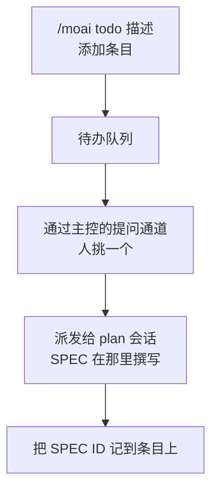



把接下来要做的事一行一行堆起来的**待办队列**。看板的 `backlog` 列没有专属会话，所以没有人会自己把工作塞进去。因此，把卡片放上看板始终是人的判断，而 `/moai todo` 就是那个入口。


**一句话概括**：`/moai todo` 是"记下下一步做什么的那一行"。放入条目、查看列表、清掉已完成的、再挑出下一个要开工的。它既不是 SPEC 也不是计划——只有在被挑中的那一刻，它才成为 SPEC。



**斜杠命令**：在 Claude Code 中输入 `/moai:todo` 即可直接执行。只输入 `/moai` 会显示所有可用子命令的列表。


## 概述

待办队列的一个条目就是**一行意图**。不是 SPEC、不是计划书、也不是估算。只有当人挑中这个条目、主控会话把它派发给 `plan` 会话时，它才成为 SPEC。

这个队列刻意保持单薄。SPEC、git 历史或看板能更好地记录的东西一概不装，只留下**人接下来想要什么**。



## 用法

```bash
# 添加条目
> /moai todo "整理认证中间件的错误路径"

# 查看队列
> /moai todo
```

| 调用 | 行为 |
|------|------|
| `/moai todo "<描述>"` | 把条目追加到队列末尾，并显示新增的条目及其位置。 |
| `/moai todo` | 按顺序显示队列，带位置编号。 |

移除条目和挑选下一张卡片不是斜杠表面上的动词。这两件事归下文的终端 CLI（`moai todo done`、`moai todo next`），或通过主控会话完成选择。

其他参数形式一律当作描述处理。`/moai todo 解决 CI 缓存不稳定` 不是错误，而是一次条目添加——听错话的代价不过是人删掉一行而已。

## 状态文件

队列保存在 `.moai/state/kanban/backlog.json`。它只存在于项目内部，不会被提交。

```json
{
  "version": 1,
  "items": [
    {
      "id": "t1",
      "text": "整理认证中间件的错误路径",
      "added_at": "<RFC3339 时间>",
      "spec_id": null,
      "state": "queued"
    }
  ],
  "findings": [
    {
      "subject_id": "t2",
      "related_id": "t1",
      "relation": "near-duplicate",
      "source": "mechanical",
      "score": 0.83,
      "note": "",
      "at": "<RFC3339 时间>"
    }
  ]
}
```

| 字段 | 含义 |
|------|------|
| `id` | 添加时分配的简短而稳定的标识符。移除后永不复用。 |
| `spec_id` | 指向 SPEC 标识符的可选关联。挑选时用 `--spec` 传入就会当场填写；还不知道时，即使处于 `picked` 状态也保持 `null`。 |
| `findings` | 关于卡片**成对关系**的记录。关系属于两张卡片之间，而不属于其中任何一张，所以它放在这里而不是放进条目里。它永远是数组——在该功能之前写入的文件也会以空数组载入，因此“没有记录”不会与“没有这个功能”混淆。`source` 为机器测量的 `mechanical`，或由人与智能体写入的 `agent`。卡片离开文件时，指向它的记录也一并离开。 |
| `state` | 生命周期判别字段。取值为 `queued` · `picked` · `dropped`——"还是待办条目"与"已上看板的卡片"由这个值区分。被挑中的条目也留在文件里，让进行中的工作可见。把条目**从文件中删除**的途径只有一条：由人手动执行 `moai todo done`——工作完成时不会有任何自动清除。丢弃不等于删除：`moai todo drop <n> "<理由>"` 把卡片移入 `dropped` 但仍留在文件里，并把理由加在文本前面，`moai todo undrop <n>` 则精确地把它还原。`dropped` 的卡片不再是挑选候选。 |

文件以原子方式写入（先写临时文件再改名），写入中途崩溃也不会截断队列。文件缺失不是错误，而是**空队列**；格式损坏的文件只报告、不触碰——这里存的人的意图，是唯一无法重新生成的值。

## 自动分析

每次添加卡片时，以及运行 `moai todo analyze` 时，队列都会读一遍自己，**找出相似的卡片并记录下来**。记录不会改变卡片：文本、顺序、状态都不动。

真正被拦下的只有一种情况。若一张卡片规范化后的文本与已在队列中或已挑选的卡片完全相同，添加会被直接拒绝。拒绝不删除任何东西，队列文件逐字节保持原样，你看到的是错误而不是 id。若仍要加入，`--force` 会加入，并记录这次重复是被强制的。

相似但不相同的卡片（词集 Jaccard 不低于 0.80）会**原样加入**，只附带一条近似重复记录。措辞不同而含义相同的两张卡片，机器察觉不到——这是有意为之的边界：这一层判错会丢掉别人写下的卡片，而判断含义是 `moai todo relate` 的职责，那里判错只多出一行输出。

`contains` · `absorbs` · `replaces` · `conflicts` 四种关系由人或智能体手工写入。**它们名不副实，什么也不做**——写下 `absorbs` 并不会吸收任何卡片。如何处置由你读过记录后决定，并通过 `drop` · `edit` · `move` 执行。

`moai todo list` 会把记录作为缩进行印在它所指的卡片下方；只要同一对卡片上没有任何人工写入的记录，就标记 `machine-only`。这个标记只说明记录出自机器，绝不表示无人复核过——CLI 无法知道是谁调用了它。

## 挑选下一张卡片

挑选由人通过主控会话的提问通道完成。主控会话把队列作为选项呈现——从最旧的开始、每次一个、最多到工具允许的四个，其余在正文中摘要列出，什么都不隐藏；在 `/clear` 之后的第一手呈现队列时，用的也是同样的方式。只想在终端看看候选时，不带参数的 `moai todo next` 会以只读方式输出同一份列表。


 **挑选的主体是人。** 不预先替你选好，不按估算的优先级重排，也不把"从最上面开始"设为默认。队列空了就明说并停下——空的待办队列是正常状态，不是要凭空造活的信号。


也可以一次批准多张卡片——点名若干张，或者说"按顺序推进直到队列清空"。这仍是人的选择，只是把逐张换成了一次批量。主控会话按批准的顺序放入卡片，并不再次询问。但那次批准所允许的范围仅此而已——它不是往队列里加条目、调整顺序、或替你决定批准范围之外需要判断的卡片的依据。

卡片被挑中之后，流程如下延续：

1. 用一次加锁写入把挑中的条目标记为 `picked`：`moai todo next <n> [--spec <SPEC-ID>]`。已经知道标识符时就当场附上。
2. 按看板派发规约交给 `plan` 会话。卡片进入 `plan` 列，SPEC 的撰写发生在那里而不是这里。
3. 挑选时还不知道标识符的，得知后再次运行 `moai todo next <n> --spec <SPEC-ID>` 把它附到条目上。后续附加没有任何自动化路径——派发和这次补录都是主控会话执行的动作，不是队列自己做的事。

## 在看板模式之外

`/moai todo` 在普通的单一会话里照常可用——它只是一个队列。但它不会派发。没有伴随会话就没有可指示的对象，所以读写队列就是全部，其余由人手动推进。

## 边界

- **不是工作管理工具。** 没有优先级、负责人、截止日期、依赖关系。需要这些的工作属于 issue 跟踪器或 SPEC。
- **不是看板。** 卡片在哪一列由主控会话和 SPEC 状态掌握，不在这个文件里。
- **不是进行中工作的原本。** 卡片有了 SPEC 之后，SPEC 产物才是基准；待办条目只是指向它的标记。
- **不会自行填充。** 工具不会自动抓取 TODO 注释、开放 issue 或审计结果放进队列。放条目的是人。

## CLI 表面

同一个队列也可以从终端操作。斜杠命令 `/moai todo` 在 Claude Code 对话中使用，终端 CLI `moai todo` 在 shell 中调用——它们是两个不同的表面：操作同一个文件，但语法不同。

```bash
# 添加条目——输出签发的 id 和队列位置各一行
$ moai todo add "整理认证中间件的错误路径"

# 两个词以上时，不带 add 也会被当作添加（自然语言 fallthrough）
$ moai todo rename 提示过时了

# 查看队列 (id · 状态 · 正文) —— 不带动词的裸调用结果相同
$ moai todo
$ moai todo list

# 以结构化记录查看
$ moai todo list --json

# 移除条目——接受编号（t4）或显式 id
$ moai todo done 4

# 按从旧到新输出排队中的条目（只读）
$ moai todo next

# 把一次挑选记录在案——可一并附上 SPEC 标识符
$ moai todo next 4 --spec SPEC-AUTH-001

# 添加与挑选在一次加锁写入里完成
$ moai todo add "整理图查询文档" --pick

# 撤销挑选标记——用于还没交给 plan 的卡片
$ moai todo unpick 4

# 重新分析整个队列，只留下记录（不触碰任何卡片）
$ moai todo analyze

# 即便是精确重复也加入——队列会记录这次是强制加入的
$ moai todo add "整理认证中间件的错误路径" --force

# 记录两张卡片之间的关系（仅记录，卡片保持原样）
$ moai todo relate t2 t1 --relation absorbs --note "t2 覆盖 t1"

# 打印队列对这张卡片所知的一切
$ moai todo why t1

# 删除一条记录——序号由 why 打印
$ moai todo unrelate 2
```

| 命令 | 行为 |
|------|------|
| `moai todo`（裸调用） | 输出队列。与 `list` 输出相同。 |
| `moai todo <两个词以上>` | 按自然语原样添加条目。单个词（包括打错的动词）不是添加而是报错。若形如动词的首个词后面跟着卡片 id（`moai todo pick t151`），会被当作打错的动词而报错 —— 只是在句子中提到 id 的卡片仍然照常添加。 |
| `moai todo add "<text>" [--pick]` | 添加条目，输出签发的 id 和位置。带 `--pick` 时，添加与挑选标记在一次加锁写入里完成。 |
| `moai todo list` / `--json` | 呈现队列。`--json` 以 JSON 输出完整记录。 |
| `moai todo done <n>` | 移除第 `n` 号条目。推荐使用显式 `t<n>` id 形式——并发添加会让位置移动。 |
| `moai todo next` | 按从旧到新打印排队条目。只读。 |
| `moai todo next <n> [--spec <SPEC-ID>]` | 把条目标记为 `picked`；给出 `--spec` 时原样记录标识符。一次加锁写入完成。 |
| `moai todo unpick <n>` | 撤销 `picked` 标记。挑选本身是人的判断，撤销也由人亲自执行。 |
| `moai todo drop <n> "<理由>" [--expect <prefix>]` | 把排队中的卡片移入 `dropped`，并在文本前加上 `[DROPPED — <理由>] ` 标记。两个参数都必填；理由为空或含有 `]` 时拒绝执行。卡片仍留在文件里，只是不再是挑选候选。`--expect` 只有在卡片文本以该前缀开头时才执行。 |
| `moai todo undrop <n> [--expect <prefix>]` | 把 `dropped` 卡片还原为 `queued`，若有标记则去掉。依据是状态而不是标记——手工标为 dropped 的卡片也会在文本原样不动的情况下还原。这是 `drop` 的精确逆操作。 |
| `moai todo edit <n> "<text>" [--expect <prefix>]` | 只重写卡片文本。`id` · `added_at` · `state` · `spec_id` 保持不变，因此纠正内容不会像 done 后重新添加那样更换卡片身份。确认行会同时打印新文本与原文本。 |
| `moai todo move <n> (--top \| --bottom \| --before <m> \| --after <m>)` | 在队列文件的**顺序**中移动卡片位置。必须且只能给一个目标标志——没有或给两个都算调用有误而被拒绝。移动只是重排条目，不删除也不修改任何内容，移错了再移一次即可还原。 |
| `moai todo add "<text>" --force` | 即便分析器判定为精确重复也照样加入。队列会记录这次重复是被强制的，冲突因此保持可见。 |
| `moai todo analyze` | 重新分析整个队列并记录所得。不添加、不删除、不重排、不修改；重复运行也不会把同一条记录叠加两次。 |
| `moai todo relate <a> <b> --relation (contains \| absorbs \| replaces \| conflicts) [--note <text>]` | 记录两张卡片之间的一条关系。它只是记录——两张卡片原封不动，`absorbs` 不会执行任何吸收。 |
| `moai todo unrelate <index>` | 删除指定的那条记录。序号即 `why` 打印的序号。卡片不变。 |
| `moai todo why <n>` | 打印指向该卡片的所有记录；若没有，则明确说明没有——什么都不打印会与崩溃无法区分。 |

CLI 不会弹出提示。它接受参数和标志、输出一行、把错误写到 stderr——在脚本和 CI 中都能安全使用的形态。

在链接型 worktree 里执行时，队列也**归属为 primary 检出的那一个队列**——一个仓库一条队列的契约。在卡片 worktree 里执行 `moai todo add`，追加的就是主控和工头循环读取的同一份文件。没有 git 元数据的项目把队列放在 `~/.moai/todo/<project-key>/backlog.json`。

两个表面共享同一个存储层。变更先抓住队列文件旁边的锁文件（backlog.lock），再通过同目录临时文件写入加原子改名落盘；读取则不加锁。条目 id 在锁内从文件中持久化的最高水位标记（`last_seq`）签发，因此被移除条目的 id 永不复用。


**已安装的二进制**：CLI 已合入 main 随版本分发。已安装的 `moai` 二进制要重新安装后才能获得这个命令。


## 相关文档

- [看板模式](/zh/advanced/kanban-mode) — 离开待办队列的卡片流经的看板
- [`/moai` 统一命令](/zh/utility-commands/moai) — 子命令全图
- [`/moai plan`](/zh/workflow-commands/moai-plan) — 被挑中的卡片成为 SPEC 的阶段
