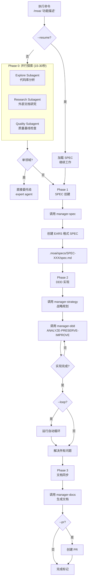

# /moai

完全自主自动化命令。当您提供目标时，MoAI 自主执行 **plan → run → sync** 流水线。


  **一句话总结**: `/moai` 是一个"完全自主自动化"命令。您只需用自然语言描述想要的功能，MoAI 就会自动执行**从 SPEC 创建到实现和文档化的整个过程**。



**斜杠命令支持**: MoAI 的所有子命令都已封装为技能。只需输入 `/moai` 即可查看可用子命令列表。每个子命令也可以通过 `/moai:fix`、`/moai:loop`、`/moai:review` 等格式直接运行。


## 概述

`/moai` 是 MoAI-ADK 的**完全自主自动化工作流**命令。无需单独执行子命令 - 整个开发过程通过一个命令自动化:

1. **SPEC 创建** (manager-spec)
2. **DDD 实现** (manager-ddd)
3. **文档同步** (manager-docs)

## 用法

```bash
# 基本用法
> /moai "想要实现的功能描述"

# 使用 worktree
> /moai "功能描述" --worktree

# 使用分支
> /moai "功能描述" --branch

# 启用循环模式
> /moai "功能描述" --loop

# 恢复现有 SPEC
> /moai --resume SPEC-AUTH-001
```

## 支持的标志

| 标志                | 描述                             | 示例                           |
| ------------------- | --------------------------------------- | --------------------------------- |
| `--loop`            | 启用自动迭代修复       | `/moai "功能" --loop`          |
| `--max N`           | 指定最大迭代次数 (默认 100) | `/moai "功能" --loop --max 10` |
| `--branch`          | 自动创建功能分支              | `/moai "功能" --branch`        |
| `--pr`              | 完成后自动创建 PR         | `/moai "功能" --pr`            |
| `--resume SPEC-XXX` | 恢复现有 SPEC 工作                | `/moai --resume SPEC-AUTH-001`     |
| `--team`            | 强制代理团队模式            | `/moai "功能" --team`          |
| `--solo`            | 强制子代理模式        | `/moai "功能" --solo`          |

### --loop 标志

在实现后自动执行迭代修复以解决所有错误:

```bash
> /moai "JWT 认证系统" --loop
```

使用此选项时:

1. 创建 SPEC
2. DDD 实现
3. **自动运行循环** (解决 LSP 错误、测试失败、覆盖率问题)
4. 文档同步
5. PR 创建


  `--loop` 选项**完全自动化实现后的清理工作**以最大化生产力。


### --team / --solo 标志

`--team` 标志强制使用代理团队模式，让多个专业代理**并行协作**：

```bash
> /moai "功能描述" --team
```

#### 前提条件

使用代理团队模式需要同时满足以下两个条件：

1. 环境变量：`CLAUDE_CODE_EXPERIMENTAL_AGENT_TEAMS=1`（在 settings.json 中设置）
2. 配置文件：`workflow.team.enabled: true`（`.moai/config/sections/workflow.yaml`）

#### 模式选择

| 标志 | 行为 |
| ---- | ---- |
| `--team` | 强制代理团队模式（并行执行） |
| `--solo` | 强制子代理模式（顺序执行） |
| （无） | 基于复杂度自动选择 |

**自动选择标准**（无标志时）：

- 影响域 >= 3 → 团队模式
- 修改文件 >= 10 → 团队模式
- 复杂度分数 >= 7 → 团队模式
- 其他 → 子代理模式

#### 团队组成

**Plan 阶段团队：**

| 代理 | 角色 | 主要任务 |
| ---- | ---- | -------- |
| **researcher** | 代码库探索 | 相关代码、参考实现、依赖分析 |
| **analyst** | 需求分析 | 用户故事、验收标准、边缘情况 |
| **architect** | 技术设计 | 架构决策、替代方案评估、权衡 |

**Run 阶段团队：**

| 代理 | 角色 | 主要任务 |
| ---- | ---- | -------- |
| **backend-dev** | 后端实现 | API、业务逻辑、数据库 |
| **frontend-dev** | 前端实现 | UI 组件、状态管理、样式 |
| **tester** | 测试编写 | 单元、集成、E2E 测试 |

#### 文件所有权

在团队模式下，每个代理**独占**特定文件模式以防止冲突：

| 代理 | 所有文件模式 |
| ---- | ------------ |
| backend-dev | `src/**/*.go`, `internal/**`, `pkg/**` |
| frontend-dev | `src/**/*.tsx`, `src/**/*.css`, `public/**` |
| tester | `**/*_test.go`, `**/*.test.ts`, `**/*.spec.ts` |

#### 令牌成本

代理团队中每个代理使用独立的上下文窗口，因此令牌消耗会增加：

| 团队模式 | 代理数量 | 预期倍数 |
| -------- | -------- | -------- |
| Plan 研究 | 3 | ~3x |
| 实现 | 3 | ~3x |
| 调查 | 3 | ~2x (haiku) |


  `--team` 模式是实验性功能。在复杂的跨层任务中最有效，对于简单的单域任务，`--solo` 模式更高效。


## 执行过程

`/moai` 内部执行的整个过程:



**关键点:**

- **Phase 0 (并行探索)**: 三个 agent 同时运行，速度提升 2-3 倍
- **单领域路由**: 简单任务直接委托给 expert agent，跳过 SPEC
- **完成标记**: 工作完成时输出 `<moai>DONE</moai>` 或 `<moai>COMPLETE</moai>`

## 分阶段详情

### Phase 0: 并行探索 (可选)

三个 agent **同时运行**以快速理解项目上下文:

| Agent    | 角色              | 任务                                           |
| -------- | ----------------- | ---------------------------------------------- |
| **Explore**  | 代码库分析 | 查找相关文件、架构模式、现有实现 |
| **Research** | 外部文档研究 | 官方文档、API 文档、类似实现示例 |
| **Quality**  | 质量基线  | 测试覆盖率、lint 状态、技术债务    |

**速度提升**: 并行执行比顺序执行快 2-3 倍 (15-30秒 vs 45-90秒)

**单领域路由:**

- 单领域任务 (例如:"SQL 优化"): 直接委托给领域专家 agent，不创建 SPEC
- 多领域任务: 继续完整工作流

### Phase 1: SPEC 创建

**manager-spec** subagent 创建 EARS 格式 SPEC 文档:

- .moai/specs/SPEC-XXX/spec.md
- EARS 格式需求
- Given-When-Then 验收标准
- 使用 conversation_language 编写的内容

### Phase 2: DDD 实现循环

**[HARD] Agent 委托规则**: 所有实现工作必须委托给专业 agent。即使在自动压缩后也禁止直接实现。

**专家 Agent 选择:**

| 任务类型          | Agent                         |
| ------------------ | ----------------------------- |
| 后端逻辑      | expert-backend subagent       |
| 前端组件| expert-frontend subagent      |
| 测试创建      | expert-testing subagent       |
| Bug 修复         | expert-debug subagent         |
| 重构        | expert-refactoring subagent   |
| 安全修复     | expert-security subagent      |

**循环行为 (当 --loop 或 ralph.yaml loop.enabled 为 true 时):**

```
问题存在 且 迭代 < 最大次数:
  1. 运行诊断 (默认并行)
  2. 将修复委托给适当的专家 agent
  3. 验证修复结果
  4. 检查完成标记
  5. 发现标记时退出循环
```

### Phase 3: 文档同步

**manager-docs** subagent 将实现与文档同步:

- 生成 API 文档
- 更新 README
- 添加到 CHANGELOG
- 成功时添加完成标记

## TODO 管理

**[HARD] 必须使用 TodoWrite 工具**: 必须使用 TodoWrite 进行所有任务跟踪

- 发现问题时: TodoWrite (pending 状态)
- 开始工作前: TodoWrite (in_progress 状态)
- 完成工作后: TodoWrite (completed 状态)
- 禁止将 TODO 列表打印为文本

## 完成标记

AI 在工作完成时添加标记:

- `<moai>DONE</moai>` - 任务完成
- `<moai>COMPLETE</moai>` - 完全完成
- `<moai:done />` - XML 格式

## LLM 模式路由

基于 llm.yaml 设置自动路由:

| 模式          | Plan 阶段     | Run 阶段      |
| ------------- | -------------- | -------------- |
| `claude-only` | Claude         | Claude         |
| `hybrid`      | Claude         | GLM (worktree) |
| `glm-only`    | GLM (worktree) | GLM (worktree) |

## 实际示例

### 示例: JWT 认证系统完全自动化

**步骤 1: 执行命令**

```bash
> /moai "基于 JWT 的用户认证系统: 注册、登录、令牌刷新" --worktree --loop --pr
```

**步骤 2: Phase 0 - 并行探索**

```
[开始并行探索]
  Explore subagent: 正在分析 src/auth/...
  Research subagent: 正在研究 JWT 最佳实践...
  Quality subagent: 确认测试覆盖率 32%...

[探索完成 - 23秒]
  找到文件: 4
  推荐库: PyJWT、bcrypt
  基线: LSP 0 错误，覆盖率 32%
```

**步骤 3: Phase 1 - SPEC 创建**

```
[调用 manager-spec]
  SPEC ID: SPEC-AUTH-001
  需求: 5 个 (EARS 格式)
  验收标准: 3 个场景

  用户批准: 完成
```

**步骤 4: Phase 2 - DDD 实现**

```
[manager-strategy]
  工作分解: 7 个任务
  战略规划完成

[manager-ddd]
  ANALYZE: 代码结构分析完成
  PRESERVE: 编写了 12 个特征测试
  IMPROVE: 7 个任务实现完成

[manager-quality]
  TRUST 5: 所有支柱通过
  覆盖率: 89%
  状态: PASS
```

**步骤 5: 自动循环 (--loop)**

```
[开始循环 - 迭代 1/100]
  诊断: 发现 2 个类型错误
  修复: 委托给 expert-backend subagent
  验证: 所有错误已解决

[循环完成 - 1 次迭代]
  满足完成条件!
```

**步骤 6: Phase 3 - 文档同步**

```
[manager-docs]
  API 文档: 已创建 docs/api/auth.md
  README: 更新了使用方法部分
  CHANGELOG: 添加了 v1.1.0 条目
  SPEC-AUTH-001: ACTIVE → COMPLETED
```

**步骤 7: 完成**

```
[完成]
  SPEC: SPEC-AUTH-001
  提交: 7 个
  测试: 36/36 通过
  覆盖率: 89%
  PR: 已创建 #42 (Draft → Ready)

<moai:COMPLETE />
```

## 常见问题

### Q: `/moai` 和子命令有什么区别？

| 命令       | 范围          | 使用时机                     |
| ------------- | -------------- | ------------------------------- |
| `/moai`       | 完全自动化| 想要快速完全自动化      |
| `/moai plan`  | 仅 SPEC      | 想要先查看 SPEC        |
| `/moai run`   | 仅实现| SPEC 已存在        |
| `/moai sync`  | 仅文档| 实现后更新文档 |

### Q: 什么时候应该使用 --loop 标志？

当您想在实现后自动修复所有错误时使用。对于大规模重构后的清理特别有用。

### Q: 什么是单领域路由？

单领域任务 (例如:"SQL 查询优化") 直接委托给领域专家 agent，不创建 SPEC，节省时间。

## 相关文档

- [/moai plan](/workflow-commands/moai-plan) - SPEC 创建详情
- [/moai run](/workflow-commands/moai-run) - DDD 实现详情
- [/moai sync](/workflow-commands/moai-sync) - 文档同步详情
- [/moai loop](/utility-commands/moai-loop) - 迭代修复循环详情
- [/moai fix](/utility-commands/moai-fix) - 一键自动修复详情
