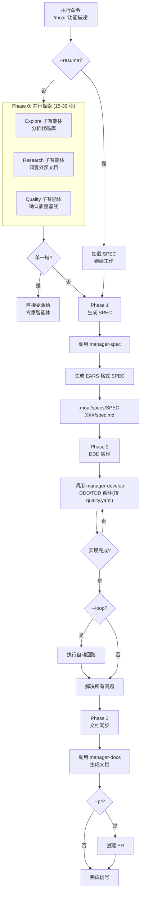

完全自主自动化命令。用户提供目标后,MoAI 自主执行 **plan → run → sync** 流水线。


  **一句话总结**: `/moai` 是"完全自主自动化"命令。用户只需用自然语言描述想要的
  功能,MoAI 就会从 SPEC 生成到实现、文档化 **自动执行所有
  过程**。



**斜杠命令支持**: MoAI 的所有子命令都封装为技能,仅输入 `/moai` 即可显示可用子命令列表。各子命令也可以用 `/moai:fix`、`/moai:loop`、`/moai:review` 等形式直接执行。


## 概述

`/moai` 是 MoAI-ADK 的 **完全自主自动化工作流** 命令。无需单独执行子命令,只需一条命令即可自动化整个开发流程:

1. **生成 SPEC** (manager-spec)
2. **DDD/TDD 实现** (manager-develop — 按 quality.yaml 的 development_mode)
3. **文档同步** (manager-docs)

## Analyze-First 路由

从 v3 起,`/moai` 的默认路由是 **Analyze-First** — 语言无关的意图分析。它对请求的语义进行分类,而非英语关键词匹配,因此无论用什么 `conversation_language` 发出请求,路由质量都相同。

路由按以下顺序进行:

1. **意图分析**: 对用户请求的意图分类(与输入语言无关)
2. **上下文充分性检查**: 不充分时通过苏格拉底式访谈澄清
3. **构建执行计划**: 选择技能 / 智能体 / 动态工作流链
4. **选择编排模式** (Phase 4): solo-sequential / parallel-subagents / dynamic-workflow

也就是说,即使像 `/moai "帮我修复登录 bug"` 这样只输入自然语言而不带子命令,也会经过意图分析连接到合适的工作流(修复类走 fix 系列,新功能走 plan→run→sync 流水线)。

## 使用方法

```bash
# 基本用法
> /moai "想要实现的功能描述"

# 配合 worktree
> /moai "功能描述" --worktree

# 配合分支
> /moai "功能描述" --branch

# 启用回路模式
> /moai "功能描述" --loop

# 恢复既有 SPEC
> /moai --resume SPEC-AUTH-001
```

## 支持的标志

| 标志              | 说明                             | 示例                           |
| ------------------- | -------------------------------- | ------------------------------ |
| `--loop`            | 实现后启用自动迭代修复    | `/moai "功能" --loop`          |
| `--max N`           | 指定最大迭代次数(默认 100) | `/moai "功能" --loop --max 10` |
| `--branch`          | 自动创建 feature 分支         | `/moai "功能" --branch`        |
| `--pr`              | 完成后自动创建 PR             | `/moai "功能" --pr`            |
| `--resume SPEC-XXX` | 恢复既有 SPEC 工作              | `/moai --resume SPEC-AUTH-001` |
| `--team`            | (已退役)伴随 `MODE_TEAM_UNAVAILABLE` 回退到子智能体模式 | `/moai "功能" --team`          |
| `--solo`            | 强制子智能体模式          | `/moai "功能" --solo`          |

### --loop 标志

实现完成后自动执行迭代修复,解决所有错误:

```bash
> /moai "JWT 认证系统" --loop
```

使用此选项时:

1. 生成 SPEC
2. DDD 实现
3. **自动执行回路**(解决 LSP 错误、测试失败、覆盖率不足)
4. 文档同步
5. 创建 PR


  `--loop` 选项 **完全自动化实现后的收尾工作**,将生产力
  最大化。


### --team / --solo 标志与编排模式

不带标志执行时,MoAI 会根据工作规模自动选择编排模式:

**自动选择标准**(无标志时):

- 影响域 >= 3 个 → 并行执行
- 修改文件 >= 10 个 → 并行执行
- 复杂度评分 >= 7 → 并行执行
- 其他 → 子智能体模式(顺序执行)

| 标志 | 行为 |
| ------ | ---- |
| `--team` | (已退役)伴随 `MODE_TEAM_UNAVAILABLE` 回退到子智能体模式 |
| `--solo` | 强制子智能体模式(顺序执行) |
| (无) | 基于复杂度自动选择 |


**v3.0.0-rc11 变更**: Agent Teams 静态编排层已 **退役**。即使强制 `--team`,也会伴随 `MODE_TEAM_UNAVAILABLE` 回退到子智能体模式。并行执行由并行子智能体扇出与两种动态工作流(plan-phase 研究并行扇出、sync-phase 4 维质量评估)承担,原生 teammate 运行时(`moai cg` 的 tmux pane)保持不变。


并行执行中每个智能体使用独立的上下文窗口,令牌用量会增加。对于简单的单域工作,`--solo`(顺序)更经济 — 这就是基于规模的自动选择成为默认值的原因。

## 执行过程

`/moai` 在内部执行的完整过程如下:


```mermaid
flowchart TD
    A["执行命令<br/>/moai '功能描述'"] --> B{--resume?}
    B -->|是| C["加载 SPEC<br/>继续工作"]
    B -->|否| D["Phase 0<br/>并行探索"]

    subgraph D["Phase 0: 并行探索 (15-30 秒)"]
        D1["Explore 子智能体<br/>分析代码库"]
        D2["Research 子智能体<br/>调查外部文档"]
        D3["Quality 子智能体<br/>确认质量基线"]
    end

    D --> E{"单一域?"}
    E -->|是| F["直接委派给<br/>专家智能体"]
    E -->|否| G["继续 Phase 1"]

    C --> G["Phase 1<br/>生成 SPEC"]
    G --> H["调用 manager-spec"]
    H --> I["生成 EARS 格式 SPEC"]
    I --> J[".moai/specs/SPEC-XXX/spec.md"]

    J --> K["Phase 2<br/>DDD 实现"]

    K --> L["调用 manager-develop<br/>DDD/TDD 循环(按 quality.yaml)"]
    L --> M{"实现完成?"}
    M -->|否| L
    M -->|是| N{"--loop?"}

    N -->|是| O["执行自动回路"]
    O --> P["解决所有问题"]
    N -->|否| P

    P --> Q["Phase 3<br/>文档同步"]

    Q --> R["调用 manager-docs<br/>生成文档"]
    R --> S{"--pr?"}
    S -->|是| T["创建 PR"]
    S -->|否| U["完成信号"]
    T --> U
```

**核心要点:**

- **Phase 0(并行探索)**: 三个智能体同时执行,提速 2-3 倍
- **单一域路由**: 简单工作直接委派给专家智能体,跳过 SPEC
- **完成信号**: 工作完成时在完成报告中明示工作已完成

## 各 Phase 详解

### Phase 0: 并行探索(可选)

三个智能体 **同时** 执行,快速掌握项目上下文:

| 智能体     | 角色            | 工作                                     |
| ------------ | --------------- | ---------------------------------------- |
| **Explore**  | 分析代码库 | 发现相关文件、架构模式、既有实现 |
| **Research** | 调查外部文档  | 官方文档、API 文档、类似实现示例      |
| **Quality**  | 质量基线     | 测试覆盖率、lint 状态、技术债务    |

**速度提升:** 并行执行比顺序执行快 2-3 倍(15-30 秒 vs 45-90 秒)

**单一域路由:**

- 单一域工作(例: "SQL 优化"): 不生成 SPEC,直接委派给专家智能体
- 多域工作: 走完整工作流

### Phase 1: 生成 SPEC

**manager-spec** 子智能体生成 EARS 格式 SPEC 文档:

- .moai/specs/SPEC-XXX/spec.md
- EARS 格式需求
- Given-When-Then 验收标准
- 以 conversation_language 编写的内容

### Phase 2: DDD/TDD 实现回路

**manager-develop** 子智能体基于 SPEC 执行实现:

- DDD 循环: ANALYZE-PRESERVE-IMPROVE(重构既有代码)
- TDD 循环: RED-GREEN-REFACTOR(开发新功能)
- 自动注入领域上下文(后端、前端、安全、数据库等)

**quality.yaml development_mode 设置:**

- `development_mode: ddd` → 使用 DDD 循环(改进既有代码)
- `development_mode: tdd` → 使用 TDD 循环(开发新功能,默认值)

**回路行为(--loop 或 loop.enabled 为 true 时):**

```
问题存在 AND 迭代 < 最大值:
  1. 执行诊断(LSP 错误、测试失败、覆盖率)
  2. 将修复委派给 manager-develop
  3. 验证修复结果
  4. 确认是否满足完成条件
  5. 检测到完成语句时结束回路
```

### Phase 3: 文档同步

**manager-docs** 子智能体同步实现与文档:

- 生成 API 文档
- 更新 README
- 追加 CHANGELOG
- 成功时明示工作完成

## TODO 管理

**[HARD] 必须使用 TodoWrite 工具:** 所有工作追踪必须使用 TodoWrite

- 发现问题时: TodoWrite (pending 状态)
- 开始工作前: TodoWrite (in_progress 状态)
- 工作完成后: TodoWrite (completed 状态)
- 禁止以文本形式输出 TODO 列表

## 完成信号

所有工作流阶段成功完成后,MoAI 在完成报告(横幅/散文)中明示工作已完成,使结果清晰明确。

## LLM 模式路由

这是令牌经济学的核心装置。根据 llm.yaml 设置,按阶段在 Claude 与 GLM 之间自动路由 — 战略·计划由 Claude 负责,大量实现由低成本 GLM 负责的混合模式成为可能。

| 模式          | Plan 阶段      | Run 阶段       |
| ------------- | -------------- | -------------- |
| `claude-only` | Claude         | Claude         |
| `hybrid`      | Claude         | GLM (worktree) |
| `glm-only`    | GLM (worktree) | GLM (worktree) |

## 实战示例

### 示例: JWT 认证系统完全自动化

**第 1 步: 执行命令**

```bash
> /moai "基于 JWT 的用户认证系统: 注册、登录、令牌刷新" --worktree --loop --pr
```

**第 2 步: Phase 0 - 并行探索**

```
[开始并行探索]
  Explore 子智能体: 正在分析 src/auth/...
  Research 子智能体: 正在调查 JWT best practices...
  Quality 子智能体: 确认测试覆盖率 32%...

[探索完成 - 23 秒]
  发现文件: 4 个
  推荐库: PyJWT, bcrypt
  基线: LSP 0 错误, 覆盖率 32%
```

**第 3 步: Phase 1 - 生成 SPEC**

```
[调用 manager-spec]
  SPEC ID: SPEC-AUTH-001
  需求: 5 项 (EARS 格式)
  验收标准: 3 个场景

  用户批准: 完成
```

**第 4 步: Phase 2 - DDD 实现**

```
[manager-spec]
  工作分解: 7 个任务
  策略规划完成

[manager-develop]
  ANALYZE: 代码结构分析完成
  PRESERVE: 编写 12 个特征化测试
  IMPROVE: 7 个任务实现完成

[sync-auditor]
  TRUST 5: 全部支柱通过
  覆盖率: 89%
  状态: PASS
```

**第 5 步: 自动回路 (--loop)**

```
[回路开始 - 迭代 1/100]
  诊断: 发现 2 个类型错误
  修复: 委派给 manager-develop 子智能体
  验证: 所有错误已解决

[回路结束 - 1 次迭代]
  满足完成条件!
```

**第 6 步: Phase 3 - 文档同步**

```
[manager-docs]
  API 文档: 生成 docs/api/auth.md
  README: 更新用法部分
  CHANGELOG: 添加 v1.1.0 条目
  SPEC-AUTH-001: ACTIVE → COMPLETED
```

**第 7 步: 完成**

```
[完成]
  SPEC: SPEC-AUTH-001
  提交: 7 个
  测试: 36/36 通过
  覆盖率: 89%
  PR: #42 创建 (Draft → Ready)

<moai:COMPLETE />
```

## 常见问题

### Q: `/moai` 和子命令有什么区别?

| 命令       | 范围        | 使用时机                    |
| ------------ | ----------- | ---------------------------- |
| `/moai`      | 全流程自动化 | 想要快速的完全自动化时     |
| `/moai plan` | 仅生成 SPEC | 想先审查 SPEC 时 |
| `/moai run`  | 仅实现      | 已有 SPEC 时          |
| `/moai sync` | 仅文档化    | 实现后只想更新文档时 |

### Q: 什么时候该用 --loop 标志?

想在实现后自动修复所有错误时使用。特别适合大规模重构后的收尾工作。

### Q: 什么是单一域路由?

单一域工作(例: "优化 SQL 查询")无需生成 SPEC,直接委派给该领域专家智能体以节省时间。

### Q: 可以用非英语的语言发出请求吗?

可以。Analyze-First 路由是语言无关的意图分析,无论用韩语、日语、中文等任何语言发出请求,行为都相同。

## 相关文档

- [/moai plan](/workflow-commands/moai-plan) - SPEC 生成详解
- [/moai run](/workflow-commands/moai-run) - DDD 实现详解
- [/moai sync](/workflow-commands/moai-sync) - 文档同步详解
- [/moai loop](/utility-commands/moai-loop) - 迭代修复回路详解
- [/moai fix](/utility-commands/moai-fix) - 一次性自动修复详解
