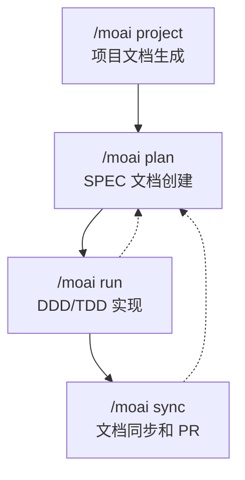

# 工作流命令

通过 MoAI-ADK 的 4 个工作流命令完成系统化的开发周期。

## 开发周期概览

MoAI-ADK 通过**4 阶段工作流命令**支持从项目初始化到部署准备的全部过程。每个命令由专业化的 AI Agent 管理，按顺序执行即可稳定地创建高质量软件。



## 命令摘要

| 命令 | 阶段 | 负责 Agent | Token 预算 | 目的 |
|---------|-------|-------------------|--------------|---------|
| [`/moai project`](./moai-project) | Phase 0 | manager-project | - | 自动生成项目文档 |
| [`/moai plan`](./moai-plan) | Phase 1 | manager-spec | 30K | SPEC 文档创建 |
| [`/moai run`](./moai-run) | Phase 2 | manager-ddd / manager-tdd | 180K | DDD/TDD 方式实现 |
| [`/moai sync`](./moai-sync) | Phase 3 | manager-docs | 40K | 文档同步和 PR 创建 |


如果是首次使用，请从 `/moai project` 开始。需要项目文档，AI 才能在后续阶段准确理解并处理项目。


## 快速开始

```bash
# Phase 0: 项目文档生成（仅首次）
> /moai project

# Phase 1: SPEC 创建
> /moai plan "实现用户认证功能"
> /clear

# Phase 2: DDD 实现
> /moai run SPEC-AUTH-001
> /clear

# Phase 3: 文档同步和 PR
> /moai sync SPEC-AUTH-001
```

## 相关文档

- [基于 SPEC 的开发](/core-concepts/spec-based-dev) - SPEC 和 EARS 格式详细说明
- [DDD 方法论](/core-concepts/ddd) - ANALYZE-PRESERVE-IMPROVE 周期详细说明
- [TRUST 5 质量系统](/core-concepts/trust-5) - 质量门详细说明
- [快速开始](/getting-started/quickstart) - 从头到尾的教程
