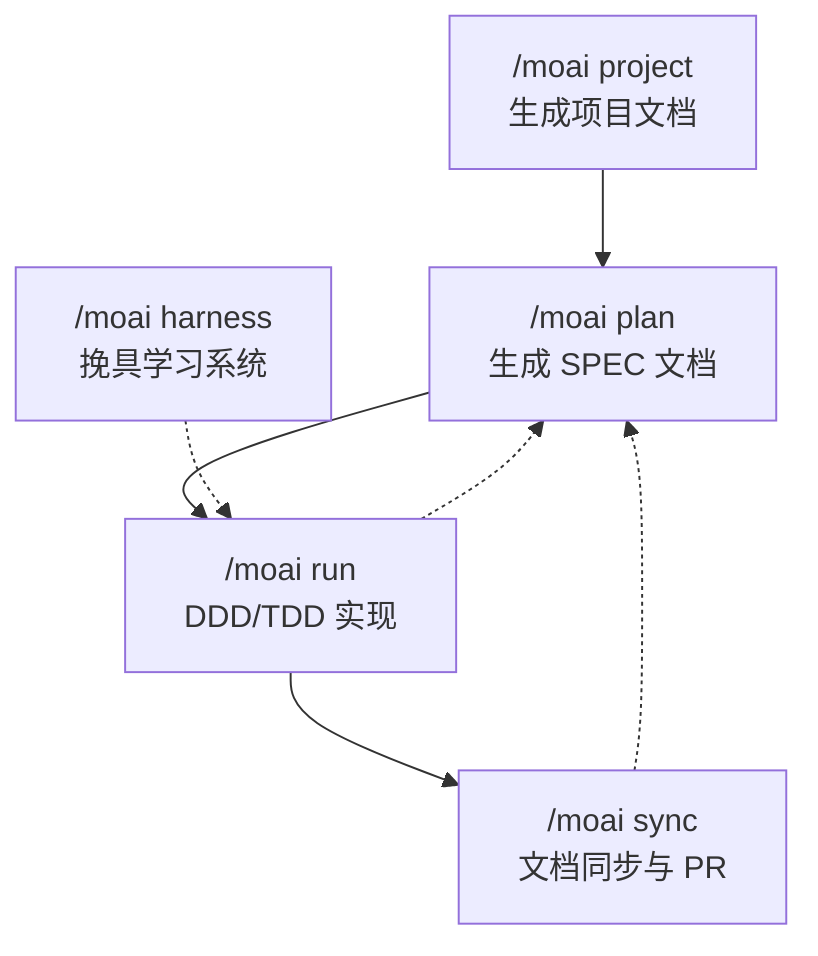

执行基于 SPEC 的 3-Phase 生命周期(plan → run → sync)的命令集合。



## 智能体挽具的核心 — 3-Phase 生命周期

MoAI-ADK v3 的核心价值之一是 **智能体挽具** (Agentic Harness)。它的含义是:与其直接编写代码,不如设计一个让智能体高效工作的环境 — SPEC 文档、质量门禁、反馈回路。工作流命令执行这一挽具的中枢 — **plan → run → sync** 流水线。

每个阶段由专门的智能体负责,并且 **计划与审计相分离**,确保创建者不自行检查自己的产出。plan 阶段的产出由 plan-auditor 独立审计,sync 阶段的成果由 sync-auditor 从 4 个维度(Functionality·Security·Craft·Consistency)进行评估。在进入 run 阶段之前,**实现启动批准**(人工门禁)始终交还给用户决定。


```mermaid
flowchart TD
    A["/moai project<br>生成项目文档"] --> B["/moai plan<br>生成 SPEC 文档"]
    B --> D["/moai run<br>DDD/TDD 实现"]
    D --> E["/moai sync<br>文档同步与 PR"]
    E -.-> B
    D -.-> B
    F["/moai harness<br>挽具学习系统"] -.-> D
```

## 命令摘要

| 命令 | 阶段 | 负责智能体 | 令牌预算 | 目的 |
|--------|------|---------------|-----------|------|
| [`/moai project`](./moai-project) | Phase 0 | manager-docs | - | 自动生成项目文档 |
| [`/moai plan`](./moai-plan) | Phase 1 | manager-spec | 30K | 生成 SPEC 文档 |
| [`/moai run`](./moai-run) | Phase 2 | manager-develop | 180K | 以 DDD/TDD 方式实现 |
| [`/moai sync`](./moai-sync) | Phase 3 | manager-docs | 40K | 文档同步与创建 PR |
| [`/moai harness`](./moai-harness) | 辅助 | builder-harness | - | 挽具创建与学习生命周期管理 |

各阶段令牌预算不同,这也是 v3 **令牌经济学** (Token Economics) 设计的一部分。计划阶段需要深度推理但产出较小(30K),实现阶段代码量大、需要充足预算(180K),文档同步介于两者之间(40K)。在阶段之间用 `/clear` 清空上下文的惯例也出于同一原因 — 不把上一阶段的对话带入下一阶段,每个阶段才能完整地使用自己的预算。


如果您是首次使用,请从 `/moai project` 开始。只有项目文档就绪,AI 才能在后续阶段准确理解并处理项目。

`/moai harness` 是用于管理挽具学习子系统的辅助命令 — 它监控 CLAUDE.md 的变更,并提出基于层级的自动更新建议。


## 快速开始

```bash
# Phase 0: 生成项目文档(仅首次)
> /moai project

# Phase 1: 生成 SPEC
> /moai plan "实现用户认证功能"
> /clear

# Phase 2: DDD 实现
> /moai run SPEC-AUTH-001
> /clear

# Phase 3: 文档同步与 PR
> /moai sync SPEC-AUTH-001

# 辅助: 挽具学习管理(可选)
> /moai harness status
> /moai harness apply
```

也可以直接用自然语言发出请求。像 `/moai "帮我修复登录 bug"` 这样不带子命令输入时,**Analyze-First 路由** 会分析意图并自动连接到合适的工作流。

## 相关文档

- [基于 SPEC 的开发](/core-concepts/spec-based-dev) - SPEC 与 EARS/GEARS 格式详解
- [DDD 方法论](/core-concepts/ddd) - ANALYZE-PRESERVE-IMPROVE 循环详解
- [TRUST 5 质量系统](/core-concepts/trust-5) - 质量门禁详解
- [挽具工程](/core-concepts/harness-engineering) - 挽具学习子系统概览
- [快速开始](/getting-started/quickstart) - 从零开始的入门教程
