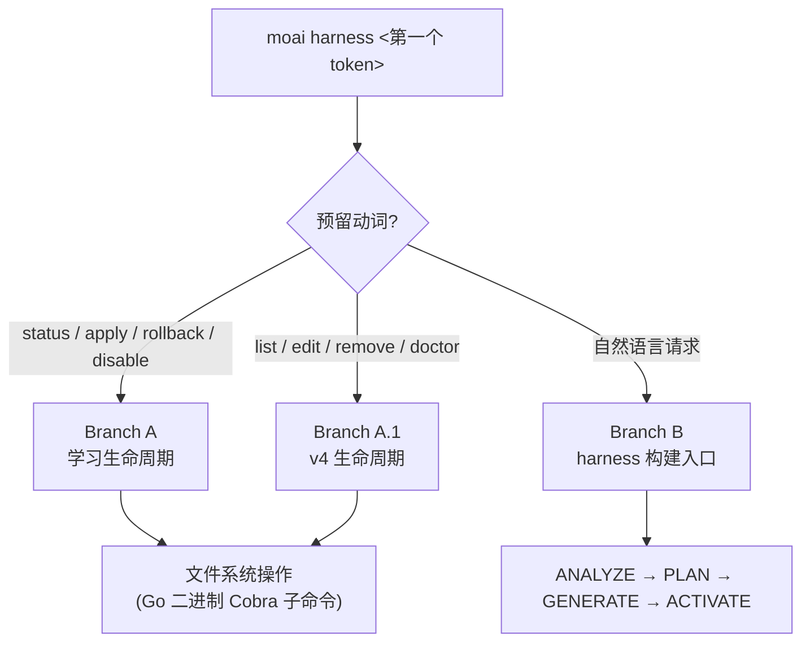

创建项目专属的动态专家团队(挽具),并管理挽具学习生命周期。


**斜杠命令**: 在 Claude Code 中输入 `/moai:harness <自然语言请求>` 即可直接执行此命令。


## 概述

`/moai:harness` 运行 MoAI-ADK 的 **Harness v4 Builder**,自动生成契合项目需求的动态专家团队。

这条命令可以让您直接体验 v3 的第三大支柱 — **智能体挽具**:挽具创造挽具的递归结构。当通用智能体目录无法覆盖项目特有领域(例如特定的数据库迁移流程、公司内部 API 规范)时,只需一句自然语言,即可为该领域搭建一支专家团队。生成的挽具还与 **递归式自我学习** 子系统相连 — 随着使用观察的积累,挽具会自行生成改进建议,并在通过用户批准门禁后使指令持续演化。

### 什么是 Harness v4 Builder?

Harness v4 Builder 通过基于苏格拉底式访谈的 4-phase 工作流(ANALYZE → PLAN → GENERATE → ACTIVATE)组建团队。

| 阶段 | 说明 |
|------|------|
| ANALYZE | 分析项目结构、使用语言、现有智能体清单 |
| PLAN | 决定所需团队规模(3~5 人)、每位成员的角色、是否使用 worktree 隔离 |
| GENERATE | 生成 `.claude/agents/harness/` 智能体文件、`.moai/harness/manifest.json` |
| ACTIVATE | 注册团队并激活 `/harness:<name>` 命令 |

## 单一 `harness` 子命令路由

`moai harness` 是单一 Cobra 子命令树,根据第一个参数($ARGUMENTS 的第一个 token)分流到三条路径之一 —— 是一种不引入额外命令的 **argument-branching 路由**。

| 第一个 token | 路由目标 | 说明 |
| ------- | ----------- | ---- |
| `status` / `apply` / `rollback` / `disable` | **Branch A — 学习生命周期** | 观察积累 → 模式 → 规则 → 自动进化建议的 4 层学习系统管理 |
| `list` / `edit` / `remove` / `doctor` | **Branch A.1 — v4 生命周期** | 枚举已生成的 harness、编辑、原子删除、引用完整性诊断 |
| 其他(自然语言) | **Branch B — harness 构建入口** | 用 v4 Builder 的 ANALYZE → PLAN → GENERATE → ACTIVATE 4-phase 生成新 harness |



所有动词都通过 `moai harness <verb>` Go 二进制 Cobra 子命令树同样地 dispatch —— 学习动词与 v4 动词并不分离到不同的 Go 二进制。

## 使用方法

### 第 1 步: 用自然语言请求创建团队

```bash
> /moai:harness <自然语言请求>
```

**示例:**
```
请为我们的 Go 后端项目组建一支合适的专家团队。
需要分别负责数据库迁移、REST API 端点、单元测试的团队。
```

### 第 2 步: Builder 自动处理

Builder 自动执行 4-phase:

1. **ANALYZE**: 检测 Go、PostgreSQL、REST API 技术栈
2. **PLAN**: 决定组建 DB Engineer、API Developer、Test Engineer 3 人团队
3. **GENERATE**:
   - `.claude/agents/harness/db-engineer.md`
   - `.claude/agents/harness/api-developer.md`
   - `.claude/agents/harness/test-engineer.md`
   - 生成 `.moai/harness/manifest.json`
4. **ACTIVATE**: 注册 `/harness:backend-team` 命令

### 第 3 步: 使用生成的团队

生成后,所有工作都会自动使用该团队:

```bash
/moai run SPEC-BACKEND-001
/moai run --team SPEC-BACKEND-001    # 强制团队模式
```

MoAI 分析 SPEC 复杂度后,按照 manifest 的 phase 顺序自动向团队成员委派工作。

## Harness v4 生命周期管理 (Branch A.1)

已生成的 harness 用 `moai harness` 子命令管理。四个 v4 生命周期动词以 Go 二进制 Cobra 子命令 dispatch。

### moai harness list

查看所有已生成的 harness 列表:

```bash
moai harness list
```

输出信息:harness 名称、领域、入口命令、manifest 中声明的调度(仅在声明时显示)。

### moai harness edit <name>

显示 manifest.json 与智能体定义文件路径以引导编辑 —— manifest 是 SSOT:

```bash
moai harness edit backend-team
```

编辑对象:
- `.claude/commands/harness/<name>/manifest.json` (SSOT)
- `.claude/agents/harness/hns-<name>*-specialist.md` (专家定义)
- `.claude/skills/hns-<name>*/` (伴随技能)

### moai harness remove <name>

原子地删除 harness 及所有关联文件:

```bash
moai harness remove backend-team
```

被删除的项目:
- `.claude/commands/harness/<name>.md` (thin-wrapper command)
- `.claude/commands/harness/<name>/manifest.json` (SSOT)
- `.claude/workflows/hns-<name>-run.js` (Runner)
- `.claude/agents/harness/hns-<name>*-specialist.md` (专家)
- `.claude/skills/hns-<name>*/` (伴随技能)


`remove` 以 fail-closed 方式运行 —— 若产出物中缺少任何一个,则中止删除并报告缺失文件。保证不留下 orphan 产出物。


### moai harness doctor

验证所有 harness 引用完整性的 smoke gate:

```bash
moai harness doctor
```

检查项目:
- 所有 harness 的 manifest / specialist / skill 文件是否存在
- manifest 与产出物之间的交叉引用是否一致
- 调度声明的 schema 有效性(无效时为 ERROR 严重度)

## 挽具学习生命周期 — 递归式自我学习 (Branch A)

harness 不是创建完就结束的静态产物。用 `moai harness` 子命令管理 **学习子系统** 的生命周期。学习动词(status / apply / rollback / disable)路由到 Branch A。

| 命令 | 说明 |
|--------|------|
| `moai harness status` | 查看学习状态(观察数、模式、建议、tier 分布、rate-limit 窗口) |
| `moai harness apply` | 应用 Tier-4 建议(需通过编排器 AskUserQuestion 批准门禁) |
| `moai harness rollback <YYYY-MM-DD>` | 回滚到指定日期的快照(日期参数必需) |
| `moai harness disable` | 禁用学习(设置 harness.yaml `learning.enabled: false`) |

**4 层学习阶梯** — 观察越积累,学习层级越高:

| Tier | 观察数 | 行为 |
|------|---------|------|
| TierObservation | ≥1 | 单纯记录 |
| TierHeuristic | ≥3 | 模式识别 |
| TierRule | ≥5 | 形成规则 |
| TierAutoUpdate | ≥10 | 自动更新建议(必须经用户批准) |

**产出物**: `.moai/harness/` 目录 (usage-log.jsonl, learned-rules.yaml, proposals/, learning-history/snapshots/)

### Tier-4 应用门禁

Tier-4 (TierAutoUpdate) 建议在修改文件前 **必须** 经过编排器发起的 `AskUserQuestion` 轮次。工作流本体在编排器的主上下文中运行,子智能体不能直接调用 `AskUserQuestion` —— 子智能体需要用户输入时返回结构化 blocker report,由编排器重新执行门禁。

批准时执行 5-layer safety pipeline:

1. **FrozenGuard** —— path-prefix check(阻断受保护路径的修改)
2. **Schema validation** —— 建议字段的 schema 验证
3. **Diff inspection** —— 检查变更内容
4. **Rate-limit window** —— 每周最多 3 次,24 小时冷却(harness.yaml `rate_limit` SSOT)
5. **Snapshot creation** —— 把修改前的快照保存到 `.moai/harness/learning-history/snapshots/<ISO-DATE>/`


`moai harness apply --execute --id <proposal-id>` CLI 路径是 **独立的 ungated trust boundary** —— 不经 `AskUserQuestion` 批准门禁,直接以 Go execute pipeline 应用。CLI 进程无法向用户提示,因此 `--execute` 是为在调用前已通过其他方式获得批准的调用者准备的显式 opt-in。默认 `apply`(无 `--execute`)是 payload-only,仅输出 JSON 而不修改文件。


自动演化始终只在 **用户批准门禁** 之下应用。随时可以用 `moai harness rollback <YYYY-MM-DD>` 恢复。

## Manifest 结构

Harness v4 通过 **manifest.json** 定义团队构成。

### manifest.json 示例

```json
{
  "spec_id": "HARNESS-BACKEND-001",
  "name": "Backend Development Team",
  "version": "1.0.0",
  "created_at": "2026-07-01T10:00:00Z",
  "worktree_isolation": "L1_optional",
  
  "phases": [
    {
      "name": "plan",
      "teammates": [
        {
          "name": "architect",
          "role": "API 架构专家",
          "model": "inherit",
          "skills": ["moai-foundation-core"]
        }
      ]
    },
    {
      "name": "run",
      "teammates": [
        {
          "name": "db-engineer",
          "role": "数据库设计与迁移",
          "model": "inherit"
        },
        {
          "name": "api-developer",
          "role": "REST API 端点",
          "model": "inherit"
        },
        {
          "name": "test-engineer",
          "role": "单元测试",
          "model": "haiku"
        }
      ]
    }
  ]
}
```

### Phase 字段

| 字段 | 说明 |
|------|------|
| `name` | 阶段名称 (`plan`, `run`, `sync`) |
| `teammates` | 参与此阶段的团队成员数组 |

### Teammate 字段

| 字段 | 默认值 | 说明 |
|------|--------|------|
| `name` | 必填 | 团队成员唯一标识符 |
| `role` | 必填 | 团队成员的角色描述 |
| `model` | `inherit` | 模型选择 (`inherit`, `haiku`, `sonnet`, `opus`) |
| `skills` | `[]` | 需要预加载的技能列表 |

可以为每位成员指定不同的模型(`model` 字段),这是令牌经济学设计的延伸 — 像架构决策这样推理繁重的角色,与像重复编写测试这样轻量的角色,没有理由使用同一个模型。

## Worktree 隔离

Harness v4 支持可选的 worktree 隔离。

### L1_optional (默认值)

```json
"worktree_isolation": "L1_optional"
```

当 Claude Code 检测到并行团队成员之间的冲突时,会自动创建 L1 worktree。

- **可选**: 仅在冲突时应用隔离
- **自动**: 运行时检测到冲突后自动创建
- **成本**: worktree 隔离时内存占用增加

### none

```json
"worktree_isolation": "none"
```

所有团队成员都在项目根目录工作(内存占用最小)。

## 团队委派工作流

挽具激活后,MoAI 会自动使用相应的团队。

### 执行 SPEC 时的团队委派

```bash
> /moai run SPEC-BACKEND-001
```

**MoAI 的自动判断:**
1. 估算 SPEC 复杂度(文件数、代码行数)
2. 选择合适的挽具
3. 按照 manifest 的 phase 顺序,顺序/并行委派团队成员

### 基于 Phase 的委派示例

```
PLAN Phase:
  → architect 成员负责架构设计

RUN Phase:
  → db-engineer、api-developer 并行委派
  → test-engineer 顺序委派(测试)

SYNC Phase:
  → 生成文档与撰写 PR(默认 manager-docs)
```

## 自然语言请求的力量

Harness v4 Builder 以苏格拉底式访谈的方式了解需求。

### 高效请求示例

```
我们团队正在开发 Python FastAPI 后端。
需要一支擅长 API 端点、数据校验、错误处理的团队。
```

Builder 会自动:
- 检测 Python、FastAPI、asyncio 技术栈
- 决定 3~5 人的团队规模
- 设定每位成员的专长领域
- 预加载所需技能

### 请求不明确时 Builder 会主动提问

```
我需要一个团队。

→ Builder: 项目的主要技术是什么?(语言、框架)
→ Builder: 团队应聚焦的领域是?(后端、前端、全部)
→ Builder: 是否有特别需要的专长?
```

## 相关文档

- [Harness v4 Builder 指南](/advanced/builder-agents) - Builder 4-phase 详解
- [智能体指南](/advanced/agent-guide) - 理解 11 个智能体目录
- [基于 SPEC 的开发](/workflow-commands/moai-plan) - SPEC 工作流概览


**提示**: 挽具创建一次后,所有后续工作都会自动使用该团队。也可以随时通过 `/harness:team-name` 命令复用。

