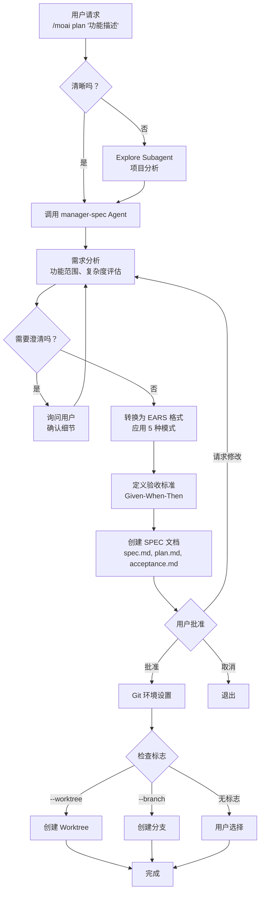
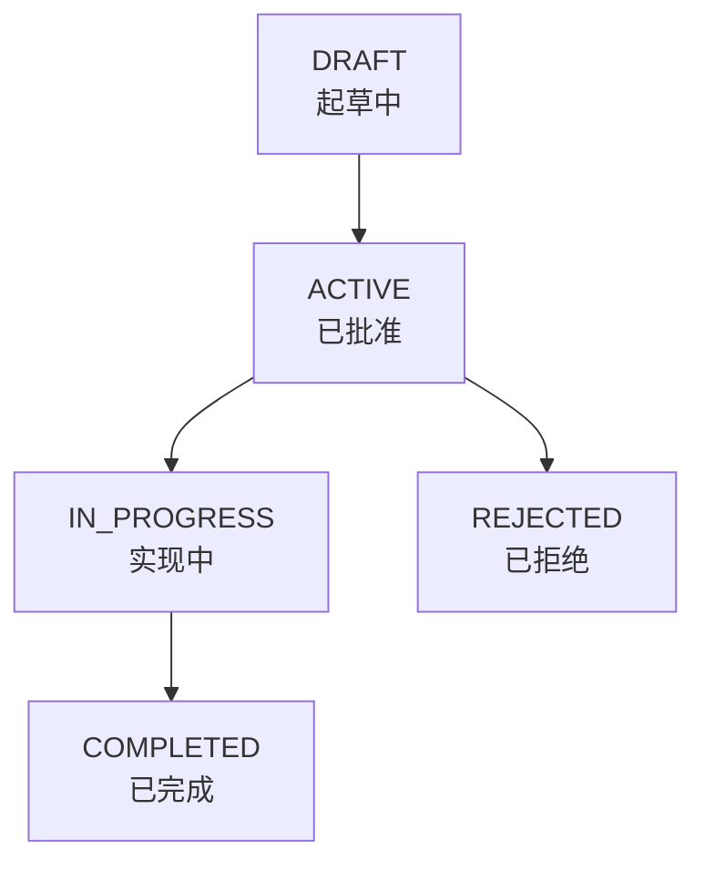

以 EARS 格式创建清晰的 SPEC 文档，将您与 AI 的对话转换为永久的需求文档。


**斜杠命令**: 在 Claude Code 中输入 `/moai:plan` 可以直接运行此命令。仅输入 `/moai` 即可查看所有可用子命令列表。


## 概述

`/moai plan` 是 MoAI-ADK 工作流的 **Phase 1 (Plan)** 命令。它将自然语言功能请求转换为结构化的 **EARS** (Easy Approach to Requirements Syntax) 格式的 **SPEC** 文档。在内部，**manager-spec** agent 分析需求并生成无歧义的规格说明。



**为什么需要 SPEC？**

**Vibe Coding** 的最大问题是**上下文丢失**。

当您与 AI 的对话结束时，**所有之前的讨论都会消失**。当超出 token 限制时，**旧对话会被截断**。第二天继续工作时，**您不会记得昨天做出的决定**。

**SPEC 文档解决了这个问题。**

它们将需求**保存到文件**中以便永久保存。它们以 EARS 格式**无歧义地**构建结构。即使会话中断，也可以**继续工作**，只需阅读 SPEC。



## 用法

在 Claude Code 对话中输入以下内容：

```bash
> /moai plan "要实现的功能描述"
```

**使用示例：**

```bash
# 简单功能
> /moai plan "用户登录功能"

# 详细功能描述
> /moai plan "基于 JWT 的用户认证：登录、注册、令牌刷新 API"

# 重构请求
> /moai plan "将遗留认证系统重构为基于 JWT"
```

## 支持的标志

| 标志                | 描述                        | 示例                                |
| ------------------- | --------------------------- | ----------------------------------- |
| `--worktree`        | 自动创建 worktree（最高优先）     | `/moai plan "功能" --worktree`      |
| `--branch`          | 创建传统分支          | `/moai plan "功能" --branch`        |
| `--resume SPEC-XXX` | 恢复中断的 SPEC 工作       | `/moai plan --resume SPEC-AUTH-001`    |
| `--team`            | 强制代理团队模式             | `/moai plan "feature" --team`          |
| `--solo`            | 强制子代理模式               | `/moai plan "feature" --solo`          |
| `--seq`             | 顺序诊断而不是并行诊断       | `/moai plan "feature" --seq`           |
| `--ultrathink`      | 启用 Adaptive Thinking | `/moai plan "feature" --ultrathink`    |

### 标志优先级

当指定多个标志时，它们按以下顺序应用：

1. **--worktree**（最高优先级）：创建独立的 Git worktree
2. **--branch**（次选）：创建传统 feature 分支
3. **无标志**（默认）：仅创建 SPEC，根据用户选择创建分支

### --worktree 标志

创建 **独立的 Git worktree** 以及 SPEC，为并行开发做准备：

```bash
> /moai plan "实现支付系统" --worktree
```

使用此选项时：

1. 创建 SPEC 文档
2. 提交 SPEC（worktree 创建所需）
3. 在 `feature/SPEC-{ID}` 分支上创建 worktree
4. 允许在不影响主代码的情况下独立开发


  `--worktree` 选项在**同时开发多个功能**时很有用。每个 SPEC 在独立的 worktree 中工作，因此它们不会相互冲突。


## EARS 格式需求

SPEC 文档使用 **EARS** (Easy Approach to Requirements Syntax) 格式定义需求。有 5 种模式，manager-spec agent 自动将自然语言转换为适当的模式。

| 模式         | 格式                          | 目的              | 示例                                                |
| --------------- | ------------------------------- | -------------------- | ------------------------------------------------------ |
| **Ubiquitous**  | "The system SHALL ~"            | 始终适用的规则 | "The system SHALL log all API requests"                |
| **Event-driven**| "WHEN ~, THEN the system SHALL ~"| 事件响应       | "WHEN logging in, THEN the system SHALL issue a JWT"   |
| **State-driven**| "WHILE ~, the system SHALL ~"   | 基于状态的行为 | "WHILE logged in, the system SHALL maintain session"   |
| **Unwanted**    | "The system SHALL NOT ~"        | 禁止事项         | "The system SHALL NOT store passwords in plain text"   |
| **Optional**    | "WHERE PRACTICAL, the system SHALL ~" | 可选功能  | "WHERE PRACTICAL, the system SHALL support 2FA"        |


  您不需要记住 EARS 格式。manager-spec agent **自动转换**自然语言。只需自然地描述您想要的功能。


## 执行过程

`/moai plan` 内部执行的过程：



**关键点：**

- 如果请求不清晰，**Explore subagent** 会分析项目
- 如果需求不清晰，manager-spec agent 会**向用户询问其他问题**
- 自动为所有需求生成 **Given-When-Then 格式的验收标准**
- 生成的 SPEC 文档在获得**用户批准**后定稿

## SPEC 创建阶段

### Phase 1A: 项目分析（可选）

在请求不明确或需要了解项目情况时执行：

| 执行条件         | 跳过条件             |
| --------------------------- | -------------------------- |
| 不明确的请求             | 清晰的 SPEC 标题           |
| 需要查找现有文件/模式 | Resume 场景        |
| 项目状态不确定    | 现有 SPEC 上下文存在 |

### Phase 1B: SPEC 规划

**manager-spec** agent 执行以下任务：

- 项目文档分析（product.md、structure.md、tech.md）
- 提出 1-3 个 SPEC 候选和命名
- 检查重复的 SPEC（.moai/specs/）
- 设计 EARS 结构
- 识别实现计划和技术约束
- 验证库版本（仅稳定版本，排除 beta/alpha）

### Phase 1.5: 预验证门

在 SPEC 创建之前防止常见错误：

**步骤 1 - 文档类型分类：**

- 检测 SPEC、Report、Documentation 关键字
- 将 Report 路由到 .moai/reports/
- 将 Documentation 路由到 .moai/docs/

**步骤 2 - SPEC ID 验证（所有检查必须通过）：**

- **ID 格式**：`SPEC-domain-number` 模式（例如 `SPEC-AUTH-001`）
- **域名**：批准的域名列表（AUTH、API、UI、DB、REFACTOR、FIX、UPDATE、PERF、TEST、DOCS、INFRA、DEVOPS、SECURITY 等）
- **ID 唯一性**：在 .moai/specs/ 中检查重复
- **目录结构**：必须创建目录，禁止平面文件

**复合域名规则：** 最多推荐 2 个域名（例如 UPDATE-REFACTOR-001），最多允许 3 个。

### Phase 2: SPEC 文档创建

同时创建三个文件：

**spec.md:**

- YAML frontmatter（7 个必填字段：id、version、status、created、updated、author、priority）
- HISTORY 部分（紧接 frontmatter 之后）
- 完整的 EARS 结构（5 种需求类型）
- 使用 conversation_language 编写的内容

**plan.md:**

- 包含任务分解的实现计划
- 技术栈规格和依赖项
- 风险分析和缓解策略

**acceptance.md:**

- 最少 2 个 Given/When/Then 场景
- 边缘情况测试场景
- 性能和质量门标准

**质量约束：**

- 需求模块：每个 SPEC 最多 5 个
- 验收标准：最少 2 个 Given/When/Then 场景
- 技术术语和函数名保持英文

### Phase 3: Git 环境设置（有条件）

**执行条件：** Phase 2 完成 且满足以下之一：

- 提供了 --worktree 标志
- 提供了 --branch 标志或用户选择创建分支
- 设置中允许分支创建（git_strategy 配置）

**跳过点：** develop_direct 工作流，无标志且选择了"使用当前分支"

## 输出

SPEC 文档保存在 `.moai/specs/` 目录中：

```
.moai/
└── specs/
    └── SPEC-AUTH-001/
        ├── spec.md          # EARS 需求
        ├── plan.md          # 实现计划
        └── acceptance.md     # 验收标准
```

**SPEC 文档的基本结构：**

```yaml
---
id: SPEC-AUTH-001
version: 1.0.0
status: ACTIVE
created: 2026-01-28
updated: 2026-01-28
author: 开发团队
priority: HIGH
---
```

## SPEC 状态管理

SPEC 文档具有以下状态生命周期：



| 状态       | 描述                  | 可以运行 `/moai run` |
| ------------ | ---------------------------- | ------------------- |
| `DRAFT`      | 仍在起草中          | 否                  |
| `ACTIVE`     | 已批准，等待实现   | **是**             |
| `IN_PROGRESS`| 当前正在实现  | 是（恢复）        |
| `COMPLETED`  | 实现和验证完成    | 否  |
| `REJECTED`   | 已拒绝，需要重写    | 否                  |

## 实际示例

### 示例：创建 JWT 认证 SPEC

**步骤 1：执行命令**

```bash
> /moai plan "基于 JWT 的用户认证系统：注册、登录、令牌刷新"
```

**步骤 2：manager-spec 询问**（如需要）

manager-spec agent 可能会询问细节：

- "密码最小长度是多少？"
- "令牌过期时间应该设置多少？"
- "包括社交登录吗？"

**步骤 3：SPEC 文档创建结果**

创建具有以下结构的 SPEC 文档：

```yaml
---
id: SPEC-AUTH-001
title: 基于_jwt_的_user_authentication_system
priority: HIGH
status: ACTIVE
---
```

```markdown
# 需求（EARS 格式）

## Ubiquitous

- 系统必须使用 bcrypt 哈希所有密码进行存储
- 系统必须记录所有认证请求

## Event-driven

- WHEN 使用有效凭据登录时，THEN 系统必须签发 JWT 访问令牌（1 小时）和刷新令牌（7 天）

## Unwanted

- 系统不得以明文存储密码
- 系统不得允许使用过期令牌访问 API
```

**步骤 4：用户批准后的 Git 环境设置**

```bash
# 使用 --worktree 标志时
> /moai plan "JWT 认证" --worktree

# 结果:
# 1. 创建 SPEC 文档 (.moai/specs/SPEC-AUTH-001/)
# 2. 提交 SPEC (feat(spec): Add SPEC-AUTH-001)
# 3. 创建 worktree (.git/worktrees/SPEC-AUTH-001)
# 4. 显示 worktree 路径
```

**步骤 5：执行 `/clear` 后进入实现阶段**

```bash
# 清理 tokens
> /clear

# 开始实现
> /moai run SPEC-AUTH-001
```

## 常见问题

### Q: 我可以手动编辑 SPEC 文档吗？

可以，您可以直接编辑 `.moai/specs/SPEC-XXX/spec.md` 文件。如果您添加需求或修改验收标准，然后运行 `/moai run`，更改将被反映。

### Q: 我可以直接编写代码而不用 SPEC 吗？

您可以在 Claude Code 中直接编写代码，但没有 SPEC 的工作意味着每当会话结束时都会丢失上下文。**对于复杂功能，首先创建 SPEC 更高效。**

### Q: 生成 SPEC ID 使用什么规则？

遵循格式 `SPEC-domain-number`（例如 `SPEC-AUTH-001`）

- `SPEC-AUTH-001`：第一个认证相关的 SPEC
- `SPEC-PAYMENT-002`：第二个支付相关的 SPEC

域名由 manager-spec 根据功能区域自动确定。

### Q: `/moai plan` 和 `/moai` 有什么区别？

`/moai plan` 只负责 **SPEC 文档创建**。`/moai` 自动执行从 SPEC 创建到实现和文档的**整个工作流**。

### Q: --worktree 和 --branch 有什么区别？

**--worktree** 创建独立的工作目录，用于完全隔离的环境。**--branch** 在当前仓库中创建新分支。如果同时开发多个功能，推荐使用 --worktree。

## GEARS 表示法 (v3.0.0+) {#gears-notation}

从 MoAI-ADK v3.0.0 开始，**GEARS**(Generalized Expression for AI-Ready Specs)被引入为推荐的 SPEC 编写表示法。原有的 EARS 表示法在 **6 个月** 期间内保持向后兼容，期间可逐步迁移到 GEARS。新建 SPEC 建议从一开始就遵循 GEARS 模式。

GEARS 保留 EARS 的 5 个核心模式，同时收紧其语义边界，使 AI 编码代理能够更明确地解释。两项实质性变更是：**废弃 IF/THEN 模式**(归一化为 WHEN)以及**重新定义 WHERE 的语义**(静态前置条件、配置、功能开关)。

参考资料：Σ\*/SubLang, **"GEARS: The Spec Syntax That Makes AI Coding Actually Work"**, DEV Community 2026-01-23. <https://dev.to/sublang/gears-the-spec-syntax-that-makes-ai-coding-actually-work-4f3f>

### 5 种模式对照表

| 表示法 | EARS (legacy) | GEARS (canonical) | Lint 行为 |
|---|---|---|---|
| Ubiquitous (普遍) | `The system shall <action>` | Same | 不变 |
| Event-driven (WHEN) | `WHEN <event>, the system shall <action>` | Same | 不变 |
| State-driven (WHILE) | `WHILE <state>, the system shall <action>` | Same (stateful precondition) | 不变 |
| Precondition (WHERE) | `WHERE <feature-exists>, the system shall <action>` | `WHERE <precondition>, the system shall <action>` (重新定义：静态前置条件、配置、功能开关) | lint 层不变 |
| Negative trigger | `IF <condition>, THEN the system shall <action>` | **DEPRECATED** — 改用 `WHEN <event-detected>, the system shall <action>` | **新增：`LegacyEARSKeyword` warning** |

### 向后兼容窗口 (6 个月)

迁移窗口自 v3.0.0 发布起持续 **6 个月**，或在批量修正 SPEC `SPEC-V3R6-GEARS-SWEEP-001`(provisional)完成时结束，以两者中先到者为准。窗口期间的行为如下：

- **非 strict 模式(默认)**：仅发出 `LegacyEARSKeyword` 警告，lint 不会失败。
- **`--strict` 模式(opt-in)**：警告升级为错误并阻断 CI。
- **现有 88 个 SPEC**：本 SPEC 范围内不直接修改(REQ-GM-007)；批量迁移由后续 SWEEP SPEC 负责。

### LegacyEARSKeyword 诊断

`internal/spec/lint.go` 中的 `isLegacyEARSPattern()` 辅助函数在检测到 EARS legacy IF/THEN 模式时发出以下消息：

```
REQ <REQ-ID>: GEARS migration: replace IF/THEN with WHEN/event normalization; see https://adk.mo.ai.kr/en/workflow-commands/moai-plan/#gears-notation
```

- **代码**：`LegacyEARSKeyword`
- **严重等级**：warning(非 strict)/ error(`--strict`)
- **来源**：`internal/spec/lint.go`

### 工具作者指南

在下游工具(校验器、代码生成器、IDE 插件等)中匹配 SPEC 文本时，请按如下方式迁移：

- 将 `IF .* THEN` 匹配器切换为 `WHEN .* shall` 匹配器。
- 注意 6 个月的废弃窗口；在窗口关闭前同时识别两种模式。
- 将 `LegacyEARSKeyword` finding 代码作为升级信号使用。

### 迁移示例

**Before (EARS legacy)：**

```
IF input is null, THEN the system shall return an error.
```

**After (GEARS canonical)：**

```
WHEN input is null is detected, the system shall return an error.
```

这种归一化将触发条件表达为 "事件" 而非 "条件"，从而减少 AI 代理的意图解释模糊性，并在编写测试用例时更清晰地界定输入和验证时机。

## 自适应推荐配置 (Adaptive Recommendation Placement)

MoAI-ADK v0.1.0 起，**AskUserQuestion 推荐**现在适配您的决策模式。系统捕获您的选择，并基于观察到的统计多数而非系统默认值来个性化未来的问题选项。

### 工作原理

当 MoAI 通过 `AskUserQuestion` 向您提问时，推荐配置遵循以下 5 条原则：

1. **Fisher 信息时机** — 在不确定性最高时（p≈0.5，Fisher 信息 I=p(1−p) 在决策边界处最大）提问。当 p≈0 或 p≈1（几乎确定）时，系统自动处理并跳过提问。

2. **问题排序按信息增益** — 需要多个问题时，按估计的信息增益降序排列，以便您尽早做出最重要的决策。

3. **统计多数合理默认值** — 推荐选项（标记 `(권장)`）反映您决策历史中观察到的多数选择，**而非**系统策略默认值。数据不足时（冷启动）会公开说明：*"基于静态默认值，个性化需要 N 次观察"*。

4. **前提条件公开** — 每个推荐选项包含其成功前提条件，格式为：*"Recommended when <precondition>"*，便于您立即评估权衡。

5. **基于熟练度的自适应强度** — 推荐强度根据您的会话数调整：
   - **专家**(20+ 会话): 弱强度 — 推断偏好仅公开，无 `(권장)` 覆盖（info-centric，尊重自主性）
   - **一般用户**(5-19 会话): 强强度 — 推荐选项带 `(권장)` + 透明理由
   - **冷启动**(<5 会话): 中立强度 — 无覆盖，应用系统默认

### 隐私与安全

- **会话范围切换**: `moai preference toggle` 按项目禁用个性化（会话间不持久）
- **敏感域门槛**: 安全相关主题（漏洞、渗透测试、泄露）接收中立推荐 + 公开日志
- **自动衰减**: 瞬时偏好 28 天后 soft-delete，稳定偏好（显式标记）保留
- **Advisory 捕获**: PostToolUse 捕获钩绝不阻塞 AskUserQuestion 执行（fail-open 设计）
- **Recovery-Signal Carve-Out**: recovery 回合（compact 恢复、prompt_too_long 等）advisory 钩子让步于恢复（REQ-ADM-010 准则，doctrine-honest）

### 技术实现


**内部原理**：5 条原则在 `.claude/rules/moai/core/askuser-protocol.md` § Recommendation Placement Principles 中详细说明，由 `moai.md` 渲染。捕获钩子实现在 `internal/hook/user_decision_capture.go`，支持 schema 容错解析和域分类。衰减策略遵循 power-law 函数 `(age+1)^(-0.5)`，α=0.5 固定（Standard tier）。完整架构和验收标准参见 [SPEC-V3R6-ASKUSER-DECISION-MEMORY-001](https://github.com/modu-ai/moai-adk-go/blob/main/.moai/specs/SPEC-V3R6-ASKUSER-DECISION-MEMORY-001/spec.md)。


## 相关文档

- [基于 SPEC 的开发](/core-concepts/spec-based-dev) - EARS 格式详细说明
- [/moai run](./moai-run) - 下一步：DDD 实现
- [/moai sync](./moai-sync) - 最后一步：文档同步
