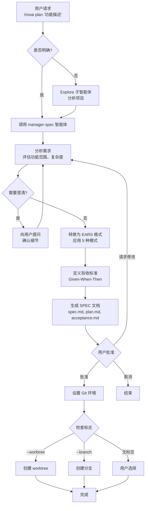
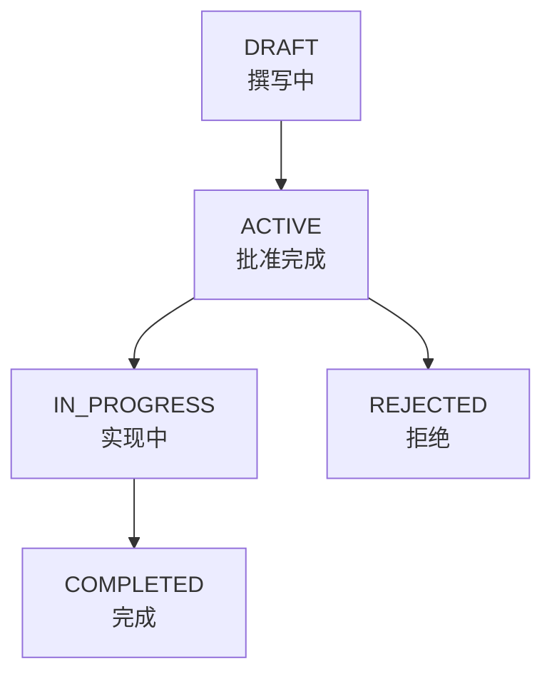

把与 AI 的对话转化为永久的需求文档。自然语言请求成为结构化的 SPEC 文档,这份文档将成为后续所有阶段的基准。


**斜杠命令**: 在 Claude Code 中输入 `/moai:plan` 即可直接执行此命令。仅输入 `/moai` 会显示所有可用子命令列表。


## 概述

`/moai plan` 是 MoAI-ADK 工作流的 **Phase 1 (Plan)** 命令。它将自然语言形式的功能请求转换为 **EARS** (Easy Approach to Requirements Syntax) 格式的结构化 SPEC 文档。内部由 **manager-spec** 智能体分析需求,生成没有歧义的规格说明书。

在 v3 令牌经济学设计中,计划阶段是被分配最深推理的阶段 — 需求在这里越清晰,后续实现阶段的返工和令牌浪费就越少。因此 MoAI-ADK 遵循"计划要深,实现要省"的分配原则,并且生成的 SPEC 由 **plan-auditor** 独立审计。创建它的智能体不会自行检查。



**为什么需要 SPEC?**

**氛围编程** (Vibe Coding) 最大的问题是 **上下文丢失**。

与 AI 对话时会话一旦中断,**之前讨论的内容全部消失**。超过令牌上限时,**旧对话会最先被截断**。第二天恢复工作时,**AI 不记得昨天决定的事项**。

**SPEC 文档解决了这个问题。**

将需求 **保存为文件** 永久留存。以 EARS 格式 **毫无歧义地** 结构化。即使会话中断,只要读取 SPEC 就能 **继续工作**。



## 使用方法

在 Claude Code 对话框中如下输入:

```bash
> /moai plan "想要实现的功能描述"
```

**使用示例:**

```bash
# 简单功能
> /moai plan "用户登录功能"

# 详细功能描述
> /moai plan "基于 JWT 的用户认证: 登录、注册、令牌刷新 API"

# 重构请求
> /moai plan "将遗留认证系统重构为基于 JWT"
```

## 支持的标志

| 标志              | 说明                        | 示例                                |
| ------------------- | --------------------------- | ----------------------------------- |
| `--worktree`        | 自动创建 worktree(最优先) | `/moai plan "功能" --worktree`      |
| `--branch`          | 创建传统分支          | `/moai plan "功能" --branch`        |
| `--resume SPEC-XXX` | 恢复中断的 SPEC 工作       | `/moai plan --resume SPEC-AUTH-001` |
| `--team`            | 强制智能体团队模式       | `/moai plan "功能" --team`          |
| `--solo`            | 强制子智能体模式     | `/moai plan "功能" --solo`          |
| `--seq`             | 顺序诊断代替并行          | `/moai plan "功能" --seq`           |
| `--ultrathink`      | 启用 Adaptive Thinking | `/moai plan "功能" --ultrathink`  |

### 标志优先级

指定多个标志时,按以下顺序应用:

1. **--worktree** (最优先): 创建独立的 Git worktree
2. **--branch** (次优先): 创建传统 feature 分支
3. **无标志** (默认): 仅生成 SPEC,由用户选择是否创建分支

### --worktree 标志

在生成 SPEC 的同时创建 **独立的 Git worktree**,准备并行开发环境:

```bash
> /moai plan "实现支付系统" --worktree
```

使用此选项时:

1. 生成 SPEC 文档
2. 提交 SPEC(创建 worktree 的必要条件)
3. 以 `feature/SPEC-{ID}` 分支创建 worktree
4. 可以在不影响主代码的情况下独立开发


  `--worktree` 选项在 **同时开发多个功能** 时非常有用。每个 SPEC
  都在独立的 worktree 中工作,互不冲突。


## EARS 格式需求

SPEC 文档以 **EARS** (Easy Approach to Requirements Syntax) 格式定义需求。共有 5 种模式,manager-spec 智能体会自动将自然语言转换为合适的模式。

| 模式             | 格式                          | 用途               | 示例                                             |
| ---------------- | ----------------------------- | ------------------ | ------------------------------------------------ |
| **Ubiquitous**   | "系统应当 ~"         | 始终适用的规则 | "系统应当记录所有 API 请求"         |
| **Event-driven** | "WHEN ~ 时,THEN 应当 ~" | 事件响应        | "WHEN 登录时,THEN 应当签发 JWT"      |
| **State-driven** | "WHILE ~ 期间,应当 ~"  | 基于状态的行为     | "WHILE 处于登录状态期间,应当保持会话" |
| **Unwanted**     | "系统不得 ~"      | 禁止事项          | "系统不得以明文存储密码"      |
| **Optional**     | "如有可能,应当 ~"      | 可选功能          | "如有可能,应当支持两步验证"         |


  无需背诵 EARS 格式。manager-spec 智能体会将自然语言 **自动
  转换**。您只需自然地描述想要的功能即可。


## 执行过程

`/moai plan` 在内部执行的过程如下:


```mermaid
flowchart TD
    A["用户请求<br/>/moai plan '功能描述'"] --> B{是否明确?}
    B -->|否| C["Explore 子智能体<br/>分析项目"]
    B -->|是| D["调用 manager-spec 智能体"]
    C --> D
    D --> E["分析需求<br/>评估功能范围、复杂度"]
    E --> F{"需要澄清?"}
    F -->|是| G["向用户提问<br/>确认细节"]
    G --> E
    F -->|否| H["转换为 EARS 格式<br/>应用 5 种模式"]
    H --> I["定义验收标准<br/>Given-When-Then"]
    I --> J["生成 SPEC 文档<br/>spec.md, plan.md, acceptance.md"]
    J --> K{"用户批准"}
    K -->|批准| L["设置 Git 环境"]
    K -->|请求修改| E
    K -->|取消| M["结束"]
    L --> N{"检查标志"}
    N -->|--worktree| O["创建 worktree"]
    N -->|--branch| P["创建分支"]
    N -->|无标志| Q["用户选择"]
    O --> R["完成"]
    P --> R
    Q --> R
```

**核心要点:**

- 请求不明确时,**Explore 子智能体** 会分析项目
- 需求不清晰时,manager-spec 智能体会 **向用户追加提问**
- 为所有需求自动生成 **Given-When-Then 格式的验收标准**
- 生成的 SPEC 文档在获得用户 **批准之后** 才最终确定

## SPEC 生成阶段

### Phase 1A: 项目分析(可选)

当请求模糊或需要了解项目状况时执行:

| 执行条件                | 跳过条件               |
| ------------------------ | ----------------------- |
| 请求不明确            | SPEC 标题明确        |
| 需要发现现有文件/模式 | resume 场景         |
| 项目状态不确定     | 已存在既有 SPEC 上下文 |

### Phase 1B: SPEC 规划

**manager-spec** 智能体执行以下工作:

- 分析项目文档 (product.md, structure.md, tech.md)
- 提出并命名 1-3 个 SPEC 候选
- 检查重复 SPEC (.moai/specs/)
- 设计 EARS 结构
- 识别实现计划与技术约束条件
- 确认库版本(仅稳定版,排除 beta/alpha)

### Phase 1.5: 预验证门禁

在生成 SPEC 之前防止常见错误:

**Step 1 - 文档类型分类:**

- 检测 SPEC、Report、Documentation 关键词
- Report 路由到 .moai/reports/
- Documentation 路由到 .moai/docs/

**Step 2 - SPEC ID 验证(必须通过所有检查):**

- **ID 格式**: `SPEC-域-编号` 模式(例: `SPEC-AUTH-001`)
- **域名称**: 已批准的域列表 (AUTH, API, UI, DB, REFACTOR, FIX, UPDATE,
  PERF, TEST, DOCS, INFRA, DEVOPS, SECURITY 等)
- **ID 唯一性**: 在 .moai/specs/ 中检查重复
- **目录结构**: 必须创建目录,禁止平铺文件

**复合域规则:** 建议最多 2 个域(例: UPDATE-REFACTOR-001),最多允许 3 个

### Phase 2: 生成 SPEC 文档

三个文件同时生成:

**spec.md:**

- YAML frontmatter(7 个必填字段: id, version, status, created, updated, author,
  priority)
- HISTORY 部分(紧跟在 frontmatter 之后)
- 完整的 EARS 结构(5 种需求类型)
- 以 conversation_language 编写的内容

**plan.md:**

- 工作分解实现计划
- 技术栈规格与依赖
- 风险分析与缓解策略

**acceptance.md:**

- 至少 2 个 Given/When/Then 场景
- 边界情况测试场景
- 性能与质量门禁标准

**质量约束条件:**

- 需求模块: 每个 SPEC 最多 5 个
- 验收标准: 至少 2 个 Given/When/Then 场景
- 技术术语与函数名保持英文

### Phase 3: 设置 Git 环境(条件性)

**执行条件:** Phase 2 完成 AND 满足以下之一:

- 提供了 --worktree 标志
- 提供了 --branch 标志,或用户选择创建分支
- 配置允许创建分支 (git_strategy 设置)

**跳过时机:** develop_direct 工作流,无标志且选择"使用当前分支"

## 输出结果

SPEC 文档保存在 `.moai/specs/` 目录中:

```
.moai/
└── specs/
    └── SPEC-AUTH-001/
        ├── spec.md          # EARS 需求
        ├── plan.md          # 实现计划
        └── acceptance.md     # 验收标准
```

**SPEC 文档的基本结构:**

```yaml
---
id: SPEC-AUTH-001
version: 1.0.0
status: ACTIVE
created: 2026-01-28
updated: 2026-01-28
author: 开发团队
priority: HIGH
---
```

## SPEC 状态管理

SPEC 文档具有如下状态生命周期:


```mermaid
flowchart TD
    A["DRAFT<br/>撰写中"] --> B["ACTIVE<br/>批准完成"]
    B --> C["IN_PROGRESS<br/>实现中"]
    C --> D["COMPLETED<br/>完成"]
    B --> E["REJECTED<br/>拒绝"]
```

| 状态          | 说明                 | 可执行 `/moai run` |
| ------------- | -------------------- | --------------------- |
| `DRAFT`       | 仍在撰写中         | 否                |
| `ACTIVE`      | 批准完成,等待实现 | **是**                |
| `IN_PROGRESS` | 当前正在实现         | 是(继续)           |
| `COMPLETED`   | 实现与验证完成    | 否                |
| `REJECTED`    | 已拒绝,需要重写  | 否                |

## 棕地分类 — Delta Markers

在既有代码库(棕地)项目中对 SPEC 需求进行分类。

| 标记 | 含义 | 说明 |
|------|------|------|
| `[EXISTING]` | 保留现有 | 不变更,仅引用 |
| `[MODIFY]` | 修改 | 变更现有代码 |
| `[NEW]` | 新增 | 全新创建 |
| `[REMOVE]` | 删除 | 移除现有代码 |

## 节省令牌的装置 — spec-compact.md

在 Plan phase 自动生成 SPEC 文档的摘要版 (`spec-compact.md`)。Run phase 加载摘要版而非完整 spec.md,可 **节省约 30% 令牌** — 这是令牌经济学装置内嵌于 SPEC 生命周期之中的典型例子。

## 防止范围偏移 — Exclusions 与 What/Why 约束

**强制 Exclusions ("What NOT to Build")**: 所有 SPEC 文档必须包含 **Out of Scope / Exclusions** 部分。预先防止范围偏移。

**What/Why 约束**: SPEC 需求只描述 **What** (什么) 和 **Why** (为什么)。**How** (如何) 在实现阶段决定,不在 SPEC 中过度规格化。

## Decision Point 3.5: 执行模式选择门禁

在 Plan 完成后、Run 开始前,自动检测执行环境并向用户推荐最优模式。

**检测项目:**
1. tmux 可用性 (`$TMUX` 环境变量)
2. 当前 LLM 模式 (`llm.yaml` 的 `team_mode`: cc/glm/cg)

**tmux 可用时:**
- Worktree + \{当前模式\} (Recommended)
- Team Mode (in-process)
- Sub-agent Mode (sequential)

**tmux 不可用时:**
- Sub-agent Mode (Recommended)
- Team Mode (in-process)

## 实战示例

### 示例: 生成 JWT 认证 SPEC

**第 1 步: 执行命令**

```bash
> /moai plan "基于 JWT 的用户认证系统: 注册、登录、令牌刷新"
```

**第 2 步: manager-spec 提问**(必要时)

manager-spec 智能体可能会为确认细节而提问:

- "密码最小长度是多少位?"
- "令牌过期时间设置为多久?"
- "是否也包括社交登录?"

**第 3 步: SPEC 文档生成结果**

将生成如下结构的 SPEC 文档:

```yaml
---
id: SPEC-AUTH-001
title: 基于 JWT 的用户认证系统
priority: HIGH
status: ACTIVE
---
```

```markdown
# 需求 (EARS 格式)

## Ubiquitous

- 系统应当使用 bcrypt 对所有密码进行哈希后存储
- 系统应当记录所有认证请求

## Event-driven

- WHEN 使用有效凭证登录时,THEN 应当签发 JWT 访问令牌(1 小时)与刷新
  令牌(7 天)

## Unwanted

- 系统不得以明文存储密码
- 系统不得允许使用过期令牌访问 API
```

**第 4 步: 用户批准后设置 Git 环境**

```bash
# 使用 --worktree 标志时
> /moai plan "JWT 认证" --worktree

# 结果:
# 1. 生成 SPEC 文档 (.moai/specs/SPEC-AUTH-001/)
# 2. 提交 SPEC (feat(spec): Add SPEC-AUTH-001)
# 3. 创建 worktree (.git/worktrees/SPEC-AUTH-001)
# 4. 显示 worktree 路径
```

**第 5 步: 执行 `/clear` 后进入实现阶段**

```bash
# 清理令牌
> /clear

# 开始实现
> /moai run SPEC-AUTH-001
```

## 常见问题

### Q: 可以手动修改 SPEC 文档吗?

可以,您可以直接编辑 `.moai/specs/SPEC-XXX/spec.md` 文件。添加需求或修改验收标准后执行 `/moai run`,修改内容就会被反映。

### Q: 不写 SPEC 直接编写代码不行吗?

也可以在 Claude Code 中直接编写代码,但没有 SPEC 的话,每次会话中断都会丢失上下文。**功能越复杂,先创建 SPEC 越高效**。

### Q: SPEC ID 按什么规则生成?

采用 `SPEC-域-编号` 格式(例: `SPEC-AUTH-001`)

- `SPEC-AUTH-001`: 认证相关的第一个 SPEC
- `SPEC-PAYMENT-002`: 支付相关的第二个 SPEC

域由 manager-spec 根据功能所属领域自动决定。

### Q: `/moai plan` 和 `/moai` 有什么区别?

`/moai plan` 只负责 **生成 SPEC 文档**。`/moai` 则从 SPEC 生成到实现、文档化,自动执行 **完整工作流**。

### Q: --worktree 和 --branch 有什么区别?

**--worktree** 创建独立的工作目录,提供完全隔离的环境。**--branch** 在当前仓库中创建新分支。若要同时开发多个功能,推荐使用 --worktree。

## GEARS 表示法 (v3.0.0+) {#gears-notation}

从 MoAI-ADK v3.0.0 起,引入 **GEARS**(Generalized Expression for AI-Ready Specs)作为撰写 SPEC 的推荐表示法。既有的 EARS 表示法在 **6 个月** 内保持向后兼容,期间可以逐步迁移到 GEARS。建议新 SPEC 从一开始就遵循 GEARS 模式。

GEARS 保留了 EARS 的 5 种核心模式,同时打磨了语义边界,使 AI 编程智能体能够更清晰地解读。核心变更是 **废弃 IF/THEN 模式**(归一化为 WHEN)以及 **重新定义 WHERE 的语义**(静态前提条件/配置/功能开关)。

参考资料: Σ\*/SubLang, **"GEARS: The Spec Syntax That Makes AI Coding Actually Work"**, DEV Community 2026-01-23. <https://dev.to/sublang/gears-the-spec-syntax-that-makes-ai-coding-actually-work-4f3f>

### 5 种模式对比表

| 表示模式 | EARS (legacy) | GEARS (canonical) | Lint 行为 |
|---|---|---|---|
| Ubiquitous (普遍) | `The system shall <action>` | Same | 无变更 |
| Event-driven (WHEN) | `WHEN <event>, the system shall <action>` | Same | 无变更 |
| State-driven (WHILE) | `WHILE <state>, the system shall <action>` | Same (stateful precondition) | 无变更 |
| Precondition (WHERE) | `WHERE <feature-exists>, the system shall <action>` | `WHERE <precondition>, the system shall <action>` (重新定义: 静态前提条件、配置、功能开关) | lint 层无变更 |
| Negative trigger | `IF <condition>, THEN the system shall <action>` | **DEPRECATED** — 改用 `WHEN <event-detected>, the system shall <action>` | **新增: `LegacyEARSKeyword` warning** |

### 向后兼容期(6 个月)

迁移窗口自 v3.0.0 发布起 **6 个月**,或至 `SPEC-V3R6-GEARS-SWEEP-001`(provisional) 批量修正 SPEC 完成之时,以先到者为准。窗口期内的行为如下。

- **非 strict 模式(默认)**: 仅产生 `LegacyEARSKeyword` 代码的 warning,不导致 lint 失败
- **`--strict` 模式(opt-in)**: warning 升级为 error,阻断 CI
- **既有 88 个 SPEC**: 不在本 SPEC 范围内直接修改 (REQ-GM-007)。批量修正由后续 SWEEP SPEC 负责

### LegacyEARSKeyword 诊断

`internal/spec/lint.go` 的 `isLegacyEARSPattern()` 助手在检测到 EARS legacy IF/THEN 模式时,输出如下消息。

```
REQ <REQ-ID>: GEARS migration: replace IF/THEN with WHEN/event normalization; see https://adk.mo.ai.kr/en/workflow-commands/moai-plan/#gears-notation
```

- **代码**: `LegacyEARSKeyword`
- **严重度**: warning (非 strict) / error (`--strict`)
- **来源**: `internal/spec/lint.go`

### 面向工具作者的指南

在 downstream 工具(验证器、代码生成器、IDE 插件等)中匹配 SPEC 文本时,请按以下方式迁移。

- 将 `IF .* THEN` 匹配逐步转换为 `WHEN .* shall` 匹配
- 认知 6 个月的 deprecation 窗口,在窗口结束前实现为同时识别两种模式
- 将 `LegacyEARSKeyword` finding 代码用作 upgrade 信号

### 迁移示例

**Before (EARS legacy):**

```
IF input is null, THEN the system shall return an error.
```

**After (GEARS canonical):**

```
WHEN input is null is detected, the system shall return an error.
```

这种归一化通过将触发器明确表述为"事件"而非"条件",降低了 AI 智能体解读意图的模糊性,并使测试用例编写时的输入/验证时机更加清晰。

## 自适应推荐布局 (Adaptive Recommendation Placement)

从 MoAI-ADK v0.1.0 起,**AskUserQuestion 推荐** 会根据用户的决策模式实现个性化。系统捕获选择,并基于观察到的统计多数(而非系统默认值)对未来的问题选项进行个性化。从回路积累观察、系统从观察中学习这一点来看,这是 v3 **递归式自我学习** 原则应用于提问·推荐领域的实例。

### 工作原理

当 MoAI 通过 `AskUserQuestion` 提问时,适用指导推荐布局的 5 项原则:

1. **Fisher 信息时机** — 在不确定性最高时(p≈0.5,Fisher 信息 I=p(1−p) 最大的决策边界)发起提问。当 p≈0 或 p≈1(几乎确定)时,系统自动处理并省略提问。

2. **问题排序 — 信息增益降序** — 需要多个问题时,按估算信息增益从高到低排序,让最重要的决策先被做出。

3. **统计多数的理性默认值** — 推荐选项(带 `(권장)` 标记)反映决策记录中观察到的多数选择,**而非系统策略默认值**。数据不足时(cold-start)会公开 *"基于默认设置,个性化需 N 次观察"*。

4. **公开前提条件** — 每个推荐选项以 *"Recommended when <precondition>"* 格式明示成立的前提条件,便于立即评估权衡。

5. **基于熟练度的自适应强度** — 推荐强度按会话计数调节:
   - **专家**(20+ 会话): 弱强度 — 仅公开 inferred preference,不使用 `(권장)` override(info-centric,尊重自主性)
   - **一般用户**(5-19 会话): 强强度 — `(권장)` + 透明的依据说明
   - **Cold-start**(<5 会话): 中立强度 — 无 override,应用系统默认值

### 隐私与安全

- **会话范围开关**: 通过 `moai preference toggle` 按项目禁用个性化(不跨会话持久)
- **敏感域门禁**: 安全相关主题(漏洞、渗透 test、泄露)采用中立推荐 + 公开日志
- **自动衰减**: Transient 偏好 28 天后 soft-delete,stable 偏好(明确标记)保留
- **Advisory 捕获**: PostToolUse 捕获钩子绝不阻断 AskUserQuestion 执行(fail-open 设计)
- **Recovery-Signal Carve-Out**: 在 recovery 轮次(compact 恢复、prompt_too_long 等)中,advisory 钩子让位于恢复(遵循 recovery-signal carve-out,doctrine-honest)

### 技术实现


**内部机制**: 5 项原则在 `.claude/rules/moai/core/askuser-protocol.md` § Recommendation Placement Principles 中规格化,并渲染到 `moai.md`。捕获钩子实现于 `internal/hook/user_decision_capture.go`,支持 schema 宽容解析与域分类。衰减策略遵循 power-law 函数 `(age+1)^(-0.5)`,α=0.5 固定(Standard tier)。完整架构与验收标准请参阅项目的 SPEC 文档。


## 相关文档

- [基于 SPEC 的开发](/core-concepts/spec-based-dev) - EARS 格式详解
- [/moai run](./moai-run) - 下一步: DDD 实现
- [/moai sync](./moai-sync) - 最终步骤: 文档同步
