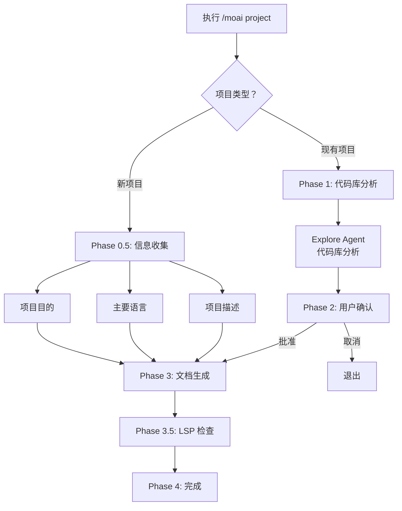
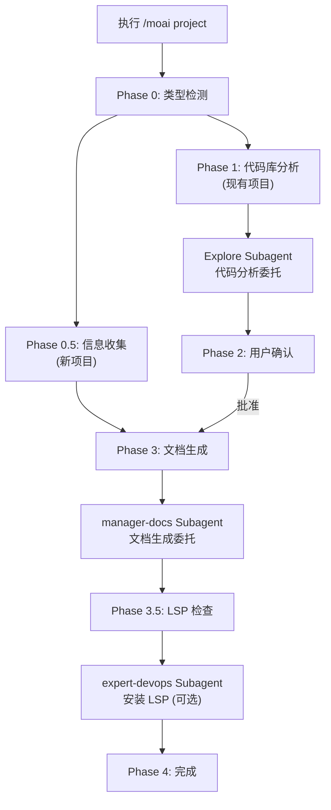

分析项目的代码库，自动生成 AI 理解项目所需的基础文档。


**斜杠命令**: 在 Claude Code 中输入 `/moai:project` 可以直接运行此命令。仅输入 `/moai` 即可查看所有可用子命令列表。


## 概述

`/moai project` 是 MoAI-ADK 工作流的**项目文档生成**命令。它分析项目的源代码、配置文件和目录结构，帮助 AI 快速理解项目。


**为什么需要项目文档？**

Claude Code 在开始新对话时对您的项目一无所知。
通过 `/moai project` 创建的文档，AI 将理解：

- 项目**做什么**（product.md）
- 代码**如何构建**（structure.md）
- 使用**什么技术**（tech.md）

只有这些文档，AI 才能在后续命令（如 `/moai plan` 和 `/moai run`）中执行适合项目上下文的准确任务。



## 用法

```bash
> /moai project
```

在没有单独参数或选项的情况下执行时，自动分析当前项目目录。

## 生成的文档

`/moai project` 在 `.moai/project/` 目录下创建 3 个文档：

```
.moai/
└── project/
    ├── product.md      # 项目概览
    ├── structure.md    # 目录结构分析
    └── tech.md         # 技术栈信息
```

### product.md - 项目概览

包含项目的核心信息：

| 项目            | 描述                      | 示例                           |
| --------------- | -------------------------------- | --------------------------------- |
| **项目名称** | 项目的正式名称     | "MoAI-ADK"                         |
| **描述**  | 项目做什么            | "基于 AI 的开发工具包"     |
| **目标用户**   | 项目为谁服务           | "使用 Claude Code 的开发者"     |
| **核心功能**     | 主要功能列表           | "SPEC 创建、DDD 实现、文档自动化" |
| **项目状态**| 当前开发阶段        | "v1.1.0, Production"              |

### structure.md - 目录结构

分析项目的文件和文件夹组成：

| 项目               | 描述                                      |
| ------------------ | ------------------------------------------------ |
| **目录树**  | 可视化整个文件夹结构           |
| **主要文件夹目的** | 描述每个文件夹的作用        |
| **模块组成**      | 核心模块之间的关系        |
| **入口点**    | 程序启动文件（main.py、index.ts 等） |

### tech.md - 技术栈

整理项目中使用的技术信息：

| 项目              | 描述             | 示例                          |
| ----------------- | ------------------------ | -------------------------------- |
| **编程语言** | 使用的语言和版本   | "Python 3.12, TypeScript 5.5" |
| **框架**     | 主要框架         | "FastAPI 0.115, React 19"         |
| **数据库**    | 数据库类型和 ORM  | "PostgreSQL 16, SQLAlchemy"       |
| **构建工具**  | 构建和包管理      | "Poetry, Vite"               |
| **部署环境**    | 托管和 CI/CD     | "Docker, GitHub Actions"          |

## 执行过程

`/moai project` 根据项目类型运行不同的工作流。

### 新项目 vs 现有项目



## 详细工作流

### Phase 0: 项目类型检测

首先检查项目类型。


  **[HARD] 规则**：必须先询问项目类型。在分析代码库之前，向用户确认项目情况。


**问题**：这是什么类型的项目？

| 选项            | 描述                                                   |
| ----------------- | ------------------------------------------------------------ |
| **新项目**   | 从头开始的项目。以信息收集格式进行 |
| **现有项目** | 有现有代码的项目。自动分析代码    |

### Phase 0.5: 新项目信息收集

对于新项目，收集以下信息：

**问题 1 - 项目目的**：

- **Web 应用程序**：前端、后端或全栈 Web 应用
- **API 服务**：REST API、GraphQL 或微服务
- **CLI 工具**：命令行实用程序或自动化工具
- **库/包**：可重用的代码库或 SDK

**问题 2 - 主要语言**：

- **Python**：后端、数据科学、自动化
- **TypeScript/JavaScript**：Web、Node.js、前端
- **Go**：高性能服务、CLI 工具
- **其他**：Rust、Java、Ruby 等（详细问题）

**问题 3 - 项目描述**（自由输入）：

- 项目名称
- 主要功能或目标
- 目标用户

基于收集的信息，生成初始文档并移动到 Phase 4。

### Phase 1: 代码库分析（现有项目）

对于现有项目，将分析委托给 **Explore agent**。


  **Agent 委托**：代码库分析由 Explore subagent 执行。MoAI 仅收集结果并向用户展示。


**分析目标**：

- **项目结构**：主目录、入口点、架构模式
- **技术栈**：语言、框架、核心依赖项
- **核心功能**：主要功能和业务逻辑位置
- **构建系统**：构建工具、包管理器、脚本

**Explore Agent 输出**：

- 检测到的主要语言
- 识别的框架
- 架构模式（MVC、Clean Architecture、微服务等）
- 主目录映射（source、tests、config、docs）
- 依赖目录
- 入口点识别

### Phase 2: 用户确认

向用户展示分析结果并获得批准。

**显示内容**：

- 检测到的语言
- 框架
- 架构
- 核心功能列表

**选项**：

- **继续**：继续文档生成
- **详细审查**：先查看分析详细信息
- **取消**：调整项目设置

### Phase 3: 文档生成

将文档生成委托给 **manager-docs agent**。

**传递的内容**：

- Phase 1 分析结果（或 Phase 0.5 用户输入）
- Phase 2 用户确认
- 输出目录：`.moai/project/`
- 语言：config 中的 conversation_language

**生成的文件**：

| 文件          | 内容                                                                     |
| ------------- | --------------------------------------------------------------------------- |
| **product.md** | 项目名称、描述、目标用户、核心功能、用例           |
| **structure.md**| 目录树、每个目录的用途、关键文件位置、模块组成 |
| **tech.md**   | 技术栈概览、框架选择理由、开发环境要求、构建/部署配置 |

### Phase 3.5: 开发环境检查

检查是否为检测到的技术栈安装了适当的 LSP 服务器。

**特定语言的 LSP 映射**（支持 16 种语言）：

| 语言               | LSP 服务器                   | 检查命令                      |
| ---------------------- | ---------------------------- | ---------------------------------- |
| Python                 | pyright 或 pylsp             | `which pyright`                    |
| TypeScript/JavaScript  | typescript-language-server   | `which typescript-language-server` |
| Go                     | gopls                        | `which gopls`                      |
| Rust                   | rust-analyzer                | `which rust-analyzer`              |
| Java                   | jdtls (Eclipse JDT)          | -                                  |
| Ruby                   | solargraph                   | `which solargraph`                 |
| PHP                    | intelephense                 | 通过 npm 检查                      |
| C/C++                  | clangd                       | `which clangd`                     |
| Kotlin                 | kotlin-language-server       | -                                  |
| Scala                  | metals                       | -                                  |
| Swift                  | sourcekit-lsp                | -                                  |
| Elixir                 | elixir-ls                    | -                                  |
| Dart/Flutter           | dart language-server         | Dart SDK 内置                      |
| C#                     | OmniSharp 或 csharp-ls       | -                                  |
| R                      | languageserver (R 包)   | -                                  |
| Lua                    | lua-language-server          | -                                  |

**未安装 LSP 时的选项**：

- **在没有 LSP 的情况下继续**：继续到完成
- **显示安装指南**：显示检测到的语言的设置指南
- **现在自动安装**：通过 expert-devops agent 安装（需要确认）

### Phase 4: 完成

以用户的语言显示完成消息。

- 生成的文件列表
- 位置：`.moai/project/`
- 状态：成功或部分完成

**下一步选项**：

- **编写 SPEC**：使用 `/moai plan` 定义功能规格
- **查看文档**：打开并查看生成的文件
- **开始新会话**：清除上下文并重新开始

## 何时使用？

### 必须运行

- **首次将 MoAI-ADK 应用于新项目** - AI 理解项目所需的基础文档
- **将 MoAI-ADK 引入现有项目** - 即使是有现有代码的项目也会自动生成文档

### 适合再次运行

- **项目结构重大变更后** - 当目录结构或技术栈发生变化时
- **引入新的主要技术后** - 例如：数据库更改、框架添加
- **新团队成员加入项目时** - 基于最新文档进行入职培训


  `/moai project` **覆盖**现有文档。如果您有手动修改，请在运行前备份。


## 实际示例

### 示例 1：从新项目开始

#### 步骤 1：执行命令

首先在终端中初始化项目并运行 Claude Code。

```bash
# 在终端中初始化项目
$ moai init my-api-project
$ cd my-api-project

# 在 Claude Code 中生成项目文档
> /moai project
```

#### 步骤 2：选择项目类型

由于这是一个新项目，选择"新项目"。

```bash
AI: 请选择项目类型：
1. 新项目（从头开始）
2. 现有项目（代码存在）

User: 1
```

AI 切换到新项目信息收集模式。

#### 步骤 3：选择项目目的

选择项目的目的。

```bash
AI: 请选择项目目的：
1. Web 应用程序
2. API 服务
3. CLI 工具
4. 库/包

User: 2
```

选择 API Service 以指定这是一个 REST API 服务器项目。

#### 步骤 4：选择主要语言

选择要使用的编程语言。

```bash
AI: 请选择主要语言：
1. Python
2. TypeScript/JavaScript
3. Go
4. 其他

User: 1
```

选择 Python 以配置后端 API 服务器开发环境。

#### 步骤 5：输入项目详细信息

输入有关项目的详细信息。

```bash
AI: 请描述项目（名称、目标、目标用户）：

User: REST API 服务器。具有用户认证和数据管理功能。面向开发者的工具。
```

此信息用于创建 `product.md` 文档。

#### 步骤 6：文档生成完成

AI 基于收集的信息自动生成文档。

```bash
[正在生成文档...]

完成！已在 .moai/project/ 目录中创建了 3 个文档。
```

生成的文档：

- `.moai/project/product.md` - 项目概览
- `.moai/project/structure.md` - 目录结构
- `.moai/project/tech.md` - 技术栈

### 示例 2：将 MoAI-ADK 引入现有项目

#### 步骤 1：导航到项目目录并初始化

导航到有现有代码的项目并初始化 MoAI-ADK。

```bash
# 导航到现有项目目录
$ cd ~/projects/existing-api

# 初始化 MoAI-ADK
$ moai init

# 在 Claude Code 中生成项目文档
> /moai project
```

#### 步骤 2：选择项目类型

选择这是现有项目。

```bash
AI: 请选择项目类型：
1. 新项目（从头开始）
2. 现有项目（代码存在）

User: 2
```

继续现有项目模式以开始代码库分析。

#### 步骤 3：自动代码库分析

Explore agent 自动分析项目。

```bash
[Explore agent 正在分析代码库...]

分析结果：
- 语言：Python 3.12
- 框架：FastAPI 0.115
- 数据库：PostgreSQL 16
- 架构：Clean Architecture
- 核心功能：
  * 用户认证
  * 数据 CRUD
  * API 端点管理
```

agent 自动识别项目结构、依赖项和模式。

#### 步骤 4：确认分析结果

查看分析结果并批准文档生成。

```bash
是否要使用此分析生成文档？
1. 继续
2. 详细审查
3. 取消

User: 1
```

如果分析准确，选择"继续"继续文档生成。

#### 步骤 5：文档生成

manager-docs agent 基于分析结果生成文档。

```bash
[manager-docs agent 正在生成文档...]

完成！已创建以下文件：
- .moai/project/product.md
- .moai/project/structure.md
- .moai/project/tech.md
```

每个文档记录项目的不同方面。

#### 步骤 6：LSP 检查和完成

验证开发环境配置正确。

```bash
LSP 服务器 'pyright' 已安装。

请选择下一步：
1. 编写 SPEC (/moai plan)
2. 查看文档
3. 开始新会话
```

由于 LSP 服务器已安装，您可以立即开始开发。

### 示例 3：项目文档生成后的工作流进展

#### 步骤 1：生成项目文档（仅首次）

首次设置项目时生成文档。

```bash
> /moai project
```

此步骤每个项目只需执行一次。

#### 步骤 2：创建 SPEC

项目文档生成后，AI 已理解项目。

```bash
> /moai plan "实现用户认证功能"
```

由于 AI 已经知道项目的技术栈和结构，它可以创建更准确的 SPEC。


  `/moai project` 通常每个项目只需运行 **1-2 次**。您不需要每次都运行；仅在项目结构发生重大变化时再次运行。


## Agent 链



## 常见问题

### Q: 如果没有项目文档就运行 `/moai plan` 会怎样？

您可以创建 SPEC，但 AI 在不了解项目技术栈或结构的情况下可能会做出**不准确的技术判断**。始终建议先运行 `/moai project`。

### Q: 也分析私有代码吗？

`/moai project` 仅在**本地环境**中运行。代码不会传输到外部服务器，生成的文档也存储在本地的 `.moai/project/` 目录中。

### Q: 在 monorepo 项目中也能工作吗？

是的，也支持 monorepo 结构。从根目录执行会分析整个项目结构。

### Q: 如果没有 LSP 服务器会怎样？

即使没有 LSP 服务器，文档生成也会继续进行。但是，后续 `/moai run` 阶段的代码质量诊断可能会受到限制。Phase 3.5 提供 LSP 安装指导。

## 相关文档

- [快速开始](/getting-started/quickstart) - 完整工作流教程
- [/moai plan](./moai-1-plan) - 下一步：SPEC 文档创建
- [基于 SPEC 的开发](/core-concepts/spec-based-dev) - SPEC 方法论详细说明
- [Subagent 目录](/advanced/agents) - Explore、manager-docs agent 详细信息
