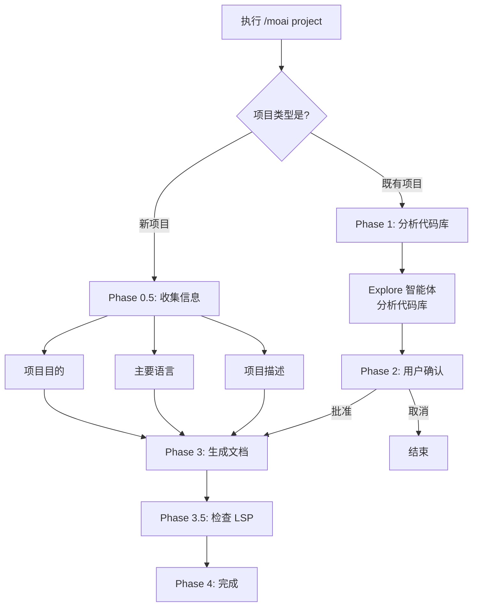
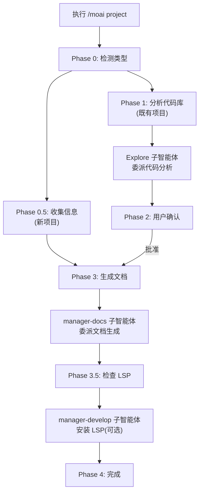

分析项目的代码库,自动生成 AI 理解项目所需的基础文档。


**斜杠命令**: 在 Claude Code 中输入 `/moai:project` 即可直接执行此命令。仅输入 `/moai` 会显示所有可用子命令列表。


## 概述

`/moai project` 是 MoAI-ADK 工作流的 **项目文档生成** 命令。它分析项目的源代码、配置文件、目录结构,帮助 AI 快速理解项目。

从智能体挽具的角度看,这条命令是挽具的 **地基工程**。与其让智能体每个会话都从头重新了解代码库,不如把项目知识固定为文件 — 基于文件的持久记忆是挽具设计的基本模式,而 `/moai project` 正是这一切的起点。用一次文档生成替代每个会话重复的探索成本,这也带来了令牌经济学上的收益。


**为什么需要项目文档?**

Claude Code 在开始新对话时对项目一无所知。
通过 `/moai project` 生成的文档,AI 将理解以下内容:

- 这个项目 **做什么** (product.md)
- 代码 **如何组织** (structure.md)
- 使用了哪些 **技术** (tech.md)

有了这些文档,在 `/moai plan`、`/moai run` 等后续命令中,AI 才能执行
契合项目上下文的精准工作。



## 使用方法

```bash
> /moai project
```

无需任何参数或选项,执行后会自动分析当前项目目录。

## 生成的文档

`/moai project` 在 `.moai/project/` 目录下生成 3 份文档:

```
.moai/
└── project/
    ├── product.md      # 项目概要
    ├── structure.md    # 目录结构分析
    └── tech.md         # 技术栈信息
```

除了生成文档,针对项目的 **挽具自动配置** 也是这条命令的职责 — 基于分析出的技术栈,可以一并组建项目专属的智能体团队(挽具)。挽具创建的详情请参阅 [/moai harness](./moai-harness)。

### product.md - 项目概要

包含项目的核心信息:

| 项目              | 说明                     | 示例                               |
| ----------------- | ------------------------ | ---------------------------------- |
| **项目名称** | 项目的正式名称     | "MoAI-ADK"                         |
| **描述**          | 项目所做的事       | "基于 AI 的开发工具包"           |
| **目标用户**   | 项目面向的人群 | "使用 Claude Code 的开发者"    |
| **核心功能**     | 主要功能列表           | "SPEC 生成、DDD 实现、文档自动化" |
| **项目状态** | 当前开发阶段           | "v1.1.0, Production"               |

### structure.md - 目录结构

分析项目的文件与文件夹构成:

| 项目               | 说明                                      |
| ------------------ | ----------------------------------------- |
| **目录树**  | 整体文件夹结构可视化                     |
| **主要文件夹用途** | 说明各文件夹的职责                  |
| **模块构成**      | 核心模块间的关系                         |
| **入口点**         | 程序启动文件(main.py, index.ts 等) |

### tech.md - 技术栈

整理项目使用的技术信息:

| 项目                | 说明                | 示例                          |
| ------------------- | ------------------- | ----------------------------- |
| **编程语言** | 使用语言与版本   | "Python 3.12, TypeScript 5.5" |
| **框架**      | 主要框架     | "FastAPI 0.115, React 19"     |
| **数据库**    | DB 种类与 ORM      | "PostgreSQL 16, SQLAlchemy"   |
| **构建工具**       | 构建与包管理 | "Poetry, Vite"                |
| **部署环境**       | 托管与 CI/CD     | "Docker, GitHub Actions"      |

## 执行过程

`/moai project` 根据项目类型执行不同的工作流。

### 新项目 vs 既有项目


```mermaid
flowchart TD
    Start["执行 /moai project"] --> Q1{项目类型是?}

    Q1 -->|新项目| New["Phase 0.5: 收集信息"]
    Q1 -->|既有项目| Exist["Phase 1: 分析代码库"]

    New --> NewQ["项目目的"]
    New --> NewL["主要语言"]
    New --> NewD["项目描述"]

    NewQ --> Gen["Phase 3: 生成文档"]
    NewL --> Gen
    NewD --> Gen

    Exist --> Exp["Explore 智能体<br/>分析代码库"]
    Exp --> Conf["Phase 2: 用户确认"]

    Conf -->|批准| Gen
    Conf -->|取消| End["结束"]

    Gen --> LSP["Phase 3.5: 检查 LSP"]
    LSP --> Complete["Phase 4: 完成"]
```

## 详细工作流

### Phase 0: 检测项目类型

首先确认项目类型。


  **[HARD] 规则**: 必须先询问项目类型。在分析代码库之前,
  向用户确认项目状况。


**提问**: 这是什么类型的项目?

| 选项              | 说明                                                 |
| ----------------- | ---------------------------------------------------- |
| **新项目** | 从零开始的项目。以信息收集的形式进行 |
| **既有项目** | 已有代码的项目。自动分析代码      |

### Phase 0.5: 收集新项目信息

选择新项目时,收集以下信息:

**问题 1 - 项目目的**:

- **Web Application**: 前端、后端或全栈 Web 应用
- **API Service**: REST API、GraphQL 或微服务
- **CLI Tool**: 命令行实用工具或自动化工具
- **Library/Package**: 可复用的代码库或 SDK

**问题 2 - 主要语言**:

- **Python**: 后端、数据科学、自动化
- **TypeScript/JavaScript**: Web、Node.js、前端
- **Go**: 高性能服务、CLI 工具
- **Other**: Rust、Java、Ruby 等(详细追问)

**问题 3 - 项目描述**(自由输入):

- 项目名称
- 主要功能或目标
- 目标用户

基于收集到的信息生成初始文档,然后进入 Phase 4。

### Phase 1: 分析代码库(既有项目)

选择既有项目时,将分析工作委派给 **Explore 智能体**。


  **智能体委派**: 代码库分析由 Explore 子智能体执行。
  MoAI 只收集结果并展示给用户。


**分析目标**:

- **项目结构**: 主目录、入口点、架构模式
- **技术栈**: 语言、框架、核心依赖
- **核心功能**: 主要功能与业务逻辑的位置
- **构建系统**: 构建工具、包管理器、脚本

**Explore 智能体输出**:

- 检测到的主要语言
- 识别出的框架
- 架构模式(MVC、Clean Architecture、Microservices 等)
- 主要目录映射(source, tests, config, docs)
- 依赖目录
- 入口点识别

### Phase 2: 用户确认

将分析结果展示给用户并获取批准。

**展示内容**:

- 检测到的语言
- 框架
- 架构
- 核心功能列表

**选项**:

- **继续**: 继续进行文档生成
- **详细审查**: 先审查分析细节
- **取消**: 调整项目设置

### Phase 3: 生成文档

将文档生成委派给 **manager-docs 智能体**。

**传递内容**:

- Phase 1 分析结果(或 Phase 0.5 用户输入)
- Phase 2 用户确认
- 输出目录: `.moai/project/`
- 语言: config 的 conversation_language

**生成文件**:

| 文件             | 内容                                                                     |
| ---------------- | ------------------------------------------------------------------------ |
| **product.md**   | 项目名称、描述、目标用户、核心功能、用例                  |
| **structure.md** | 目录树、各目录的用途、核心文件位置、模块构成             |
| **tech.md**      | 技术栈概览、框架选择依据、开发环境要求、构建/部署设置 |

### Phase 3.5: 检查开发环境

确认是否安装了与检测到的技术栈匹配的 LSP 服务器。

**各语言 LSP 映射**(支持 16 种语言):

| 语言                  | LSP 服务器                   | 确认命令                        |
| --------------------- | -------------------------- | ---------------------------------- |
| Python                | pyright 或 pylsp         | `which pyright`                    |
| TypeScript/JavaScript | typescript-language-server | `which typescript-language-server` |
| Go                    | gopls                      | `which gopls`                      |
| Rust                  | rust-analyzer              | `which rust-analyzer`              |
| Java                  | jdtls (Eclipse JDT)        | -                                  |
| Ruby                  | solargraph                 | `which solargraph`                 |
| PHP                   | intelephense               | 通过 npm 确认                      |
| C/C++                 | clangd                     | `which clangd`                     |
| Kotlin                | kotlin-language-server     | -                                  |
| Scala                 | metals                     | -                                  |
| Swift                 | sourcekit-lsp              | -                                  |
| Elixir                | elixir-ls                  | -                                  |
| Dart/Flutter          | dart language-server       | Dart SDK 内置                      |
| C#                    | OmniSharp 或 csharp-ls   | -                                  |
| R                     | languageserver (R 包)  | -                                  |
| Lua                   | lua-language-server        | -                                  |

**未安装 LSP 时的选项**:

- **不使用 LSP 继续**: 进行到完成
- **显示安装指南**: 显示检测到的语言的配置指南
- **立即自动安装**: 通过 manager-develop 智能体安装(需要确认)

### Phase 4: 完成

以用户的语言显示完成消息。

- 生成的文件列表
- 位置: `.moai/project/`
- 状态: 成功或部分完成

**下一步选项**:

- **撰写 SPEC**: 用 `/moai plan` 定义功能规格说明
- **审查文档**: 打开生成的文件进行审查
- **开始新会话**: 清空上下文重新开始

## 何时使用?

### 必须执行的情况

- **首次在新项目中应用 MoAI-ADK 时** - 需要 AI 理解项目的基础文档
- **在既有项目中引入 MoAI-ADK 时** - 即使项目已有代码,也会自动生成文档

### 建议重新执行的情况

- **项目结构发生重大变更后** - 目录结构或技术栈改变时
- **引入新的主要技术后** - 例如: 更换数据库、添加框架
- **有新成员加入项目时** - 基于最新文档进行入职引导


  `/moai project` 会 **覆盖** 既有文档。如有手动修改的内容,
  请在执行前备份。


## 实战示例

### 示例 1: 从新项目开始

#### 第 1 步: 执行命令

首先在终端初始化项目并启动 Claude Code。

```bash
# 在终端初始化项目
$ moai init my-api-project
$ cd my-api-project

# 在 Claude Code 中生成项目文档
> /moai project
```

#### 第 2 步: 选择项目类型

由于是新项目,选择"新项目"。

```bash
AI: 请选择项目类型:
1. 新项目(从零开始)
2. 既有项目(已有代码)

User: 1
```

AI 切换到新项目信息收集模式。

#### 第 3 步: 选择项目目的

选择项目的目的。

```bash
AI: 请选择项目目的:
1. Web Application
2. API Service
3. CLI Tool
4. Library/Package

User: 2
```

选择 API Service,指定这是一个 REST API 服务器项目。

#### 第 4 步: 选择主要语言

选择要使用的编程语言。

```bash
AI: 请选择主要语言:
1. Python
2. TypeScript/JavaScript
3. Go
4. Other

User: 1
```

选择 Python,配置后端 API 服务器开发环境。

#### 第 5 步: 输入项目详细信息

输入项目的详细信息。

```bash
AI: 请描述您的项目(名称、目标、目标用户):

User: 这是一个 REST API 服务器。具有用户认证和数据管理功能。面向开发者的工具。
```

这些信息将用于生成 `product.md` 文档。

#### 第 6 步: 文档生成完成

AI 基于收集到的信息自动生成文档。

```bash
[正在生成文档...]

完成! 已在 .moai/project/ 目录中生成 3 份文档。
```

生成的文档:

- `.moai/project/product.md` - 项目概要
- `.moai/project/structure.md` - 目录结构
- `.moai/project/tech.md` - 技术栈

### 示例 2: 在既有项目中引入 MoAI-ADK

#### 第 1 步: 进入项目目录并初始化

进入已有代码的项目并初始化 MoAI-ADK。

```bash
# 进入已有的项目目录
$ cd ~/projects/existing-api

# 初始化 MoAI-ADK
$ moai init

# 在 Claude Code 中生成项目文档
> /moai project
```

#### 第 2 步: 选择项目类型

选择这是既有项目。

```bash
AI: 请选择项目类型:
1. 新项目(从零开始)
2. 既有项目(已有代码)

User: 2
```

以既有项目模式继续,开始分析代码库。

#### 第 3 步: 自动分析代码库

Explore 智能体自动分析项目。

```bash
[Explore 智能体正在分析代码库...]

分析结果:
- 语言: Python 3.12
- 框架: FastAPI 0.115
- 数据库: PostgreSQL 16
- 架构: Clean Architecture
- 核心功能:
  * 用户认证
  * 数据 CRUD
  * API 端点管理
```

智能体自动掌握项目结构、依赖与模式。

#### 第 4 步: 确认分析结果

审查分析结果并批准生成文档。

```bash
是否以此分析生成文档?
1. 继续
2. 详细审查
3. 取消

User: 1
```

分析结果准确时,选择"继续",继续生成文档。

#### 第 5 步: 生成文档

manager-docs 智能体基于分析结果生成文档。

```bash
[manager-docs 智能体正在生成文档...]

完成! 已生成以下文件:
- .moai/project/product.md
- .moai/project/structure.md
- .moai/project/tech.md
```

每份文档记录项目的不同侧面。

#### 第 6 步: 检查 LSP 并完成

确认开发环境是否配置妥当。

```bash
LSP 服务器 'pyright' 已安装。

请选择下一步:
1. 撰写 SPEC (/moai plan)
2. 审查文档
3. 开始新会话
```

由于 LSP 服务器已安装,可以立即开始开发。

### 示例 3: 生成项目文档后推进工作流

#### 第 1 步: 生成项目文档(仅首次)

首次配置项目时生成文档。

```bash
> /moai project
```

这一步每个项目只需执行一次。

#### 第 2 步: 生成 SPEC

项目文档生成后,AI 已处于理解项目的状态。

```bash
> /moai plan "实现用户认证功能"
```

AI 已经了解项目的技术栈与结构,因此能生成更精准的 SPEC。


  `/moai project` 每个项目通常只需执行 **1-2 次**。无需每次执行,
  仅在项目结构发生重大变化时重新执行即可。


## 智能体链


```mermaid
flowchart TD
    Start["执行 /moai project"] --> Phase0["Phase 0: 检测类型"]
    Phase0 --> Phase05["Phase 0.5: 收集信息<br/>(新项目)"]
    Phase0 --> Phase1["Phase 1: 分析代码库<br/>(既有项目)"]

    Phase1 --> Explore["Explore 子智能体<br/>委派代码分析"]
    Explore --> Phase2["Phase 2: 用户确认"]

    Phase05 --> Phase3["Phase 3: 生成文档"]
    Phase2 -->|批准| Phase3

    Phase3 --> Docs["manager-docs 子智能体<br/>委派文档生成"]
    Docs --> Phase35["Phase 3.5: 检查 LSP"]

    Phase35 --> DevOps["manager-develop 子智能体<br/>安装 LSP(可选)"]
    DevOps --> Phase4["Phase 4: 完成"]
```

## 常见问题

### Q: 不生成项目文档就执行 `/moai plan` 会怎样?

虽然也能生成 SPEC,但由于 AI 不了解项目的技术栈或结构,可能做出 **不准确的技术判断**。建议始终先执行 `/moai project`。

### Q: 也会分析私有代码吗?

`/moai project` **仅在本地环境** 运行。代码不会被发送到外部服务器,生成的文档也保存在本地的 `.moai/project/` 目录中。

### Q: 在 monorepo 项目中也能工作吗?

是的,也支持 monorepo 结构。在根目录执行时会分析整个项目结构。

### Q: 没有 LSP 服务器会怎样?

即使没有 LSP 服务器,文档生成也会进行。只是在之后的 `/moai run` 阶段,代码质量诊断可能受限。Phase 3.5 会提供 LSP 安装指南。

## 相关文档

- [快速开始](/getting-started/quickstart) - 完整工作流教程
- [/moai plan](./moai-plan) - 下一步: 生成 SPEC 文档
- [/moai harness](./moai-harness) - 创建项目专属挽具
- [基于 SPEC 的开发](/core-concepts/spec-based-dev) - SPEC 方法论详解
- [子智能体目录](/advanced/agent-guide) - Explore、manager-docs 智能体详解
