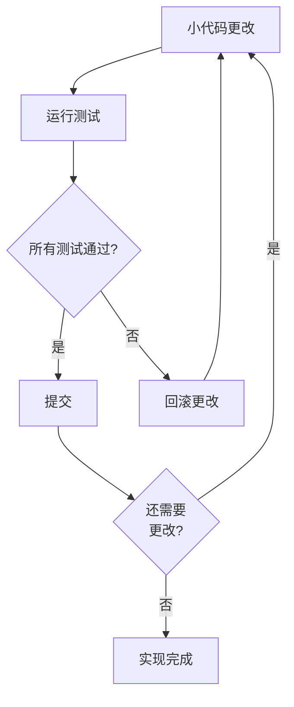
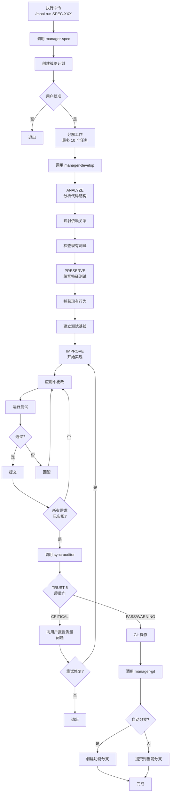

基于 SPEC 文档使用 DDD (Domain-Driven Development) 方法论实现代码。


**斜杠命令**: 在 Claude Code 中输入 `/moai:run` 可以直接运行此命令。仅输入 `/moai` 即可查看所有可用子命令列表。


## 概述

`/moai run` 是 MoAI-ADK 工作流的 **Phase 2 (Run)** 命令。它读取在 Phase 1 中创建的 SPEC 文档，通过 **ANALYZE-PRESERVE-IMPROVE** 周期安全地实现代码而不破坏现有功能。内部由 **manager-develop** agent 管理整个过程。



**通过家庭装修理解 DDD**

DDD ANALYZE-PRESERVE-IMPROVE 周期就像**家庭装修**:

| 阶段        | 类比            | 实际工作                       |
| ------------ | ------------------ | --------------------------------- |
| **ANALYZE**  | 房屋检查    | 理解当前代码结构和问题 |
| **PRESERVE** | 拍照        | 使用特征测试记录现有行为 |
| **IMPROVE**  | 逐个房间改造| 在测试通过的同时进行小改进 |

就像一次性拆除整个房屋很危险一样，**在每次验证的同时逐步更改代码**更安全。



## 用法

将在 Plan 阶段创建的 SPEC ID 作为参数传递:

```bash
# 必须在 Plan 阶段完成后运行 /clear
> /clear

# 通过指定 SPEC ID 开始实现
> /moai run SPEC-AUTH-001
```


  在执行 `/moai run` 之前确保运行 `/clear`。您需要清理 Plan 阶段使用的 tokens 以充分利用 Run 阶段的 **200K tokens**。


## 支持的标志

| 标志                | 描述                  | 示例                             |
| ------------------- | ---------------------------- | ----------------------------------- |
| `--resume SPEC-XXX` | 恢复中断的实现 | `/moai run --resume SPEC-AUTH-001` |
| `--team`            | 强制代理团队模式 | `/moai run SPEC-AUTH-001 --team`   |
| `--solo`            | 强制子代理模式   | `/moai run SPEC-AUTH-001 --solo`   |

**恢复功能:**

重新执行时，从上一个成功的阶段检查点继续工作。

## DDD 周期

`/moai run` 按顺序执行三个阶段: **ANALYZE -> PRESERVE -> IMPROVE**。让我们详细看看每个阶段发生什么。

### 1. ANALYZE (分析)

读取现有代码并与 SPEC 需求进行比较，以了解需要做什么。

**分析项目:**

| 项目        | 描述                 | 示例                                   |
| ----------- | -------------------------- | ----------------------------------------- |
| 代码结构 | 文件、模块、依赖项 | "auth.py 依赖于 user_service.py"      |
| 领域边界 | 业务逻辑范围   | "分离认证和用户领域" |
| 测试状态 | 现有测试覆盖率     | "当前覆盖率 45%"                  |
| 技术债务 | 需要改进的部分  | "发现 SQL 注入漏洞"       |

### 2. PRESERVE (保留)

将现有代码的当前行为记录为**特征测试**。这些测试作为**安全网**，以确保重构后现有功能仍然正常工作。



**什么是特征测试？**

不是判断"这段代码是对还是错"，而是**记录"这是它当前的行为方式。"**

例如，如果现有的登录函数在成功时返回 `{"status": "success"}`，则此行为被记录为测试。稍后，如果您更改代码并且此测试失败，您会立即知道"现有行为已更改"。



### 3. IMPROVE (改进)

根据 SPEC 需求对代码进行**小更改**，每次运行测试以验证现有行为是否保留。

**核心原则: 小更改 + 每次验证**



## 执行过程

`/moai run` 内部执行的整个过程:



## 分阶段详情

### Phase 1: 分析和规划

**manager-spec** subagent 执行以下任务:

- 完整的 SPEC 文档分析
- 提取需求和成功标准
- 识别实现阶段和单个任务
- 确定技术栈和依赖项需求
- 估算复杂度和工作量
- 创建具有分阶段方法的详细执行策略

**输出:** 包括 plan_summary、requirements list、success_criteria、effort_estimate 的执行计划

### Phase 1.5: 工作分解

将批准的执行计划分解为原子化和可审查的任务:

**任务结构:**

- **任务 ID**: 在 SPEC 内按顺序排列 (TASK-001、TASK-002 等)
- **描述**: 清晰的任务陈述
- **需求映射**: 满足的 SPEC 需求
- **依赖项**: 先决任务列表
- **验收标准**: 验证完成的方法

**约束:** 每个 SPEC 最多 10 个任务。如果需要更多，建议拆分 SPEC。

### Phase 2: DDD 实现

**manager-develop** subagent 执行 ANALYZE-PRESERVE-IMPROVE 周期:

**要求:**

- 初始化任务跟踪
- 执行完整的 ANALYZE-PRESERVE-IMPROVE 周期
- 在每次转换后验证现有测试通过
- 为没有覆盖率的代码路径创建特征测试
- 达到 85% 或更高的测试覆盖率

**输出:** files_modified、characterization_tests_created、test_results、behavior_preserved、structural_metrics

### Phase 2.5: 质量验证

**sync-auditor** subagent 执行 TRUST 5 验证:

| TRUST 5 支柱 | 验证项目                     |
| -------------- | ------------------------------------ |
| **Tested**     | 测试存在并通过，保持 DDD 纪律 |
| **Readable**   | 遵循项目规则，包括文档 |
| **Unified**    | 遵循现有的项目模式    |
| **Secured**    | 无安全漏洞，符合 OWASP |
| **Trackable**  | 清晰的提交消息，支持历史分析 |

**附加验证:**

- 测试覆盖率 85% 或更高
- 行为保留: 无更改通过现有测试
- 特征测试通过: 行为快照匹配
- 结构改进: 耦合和内聚指标改进

**输出:** trust_5_validation results、coverage_percentage、overall_status (PASS/WARNING/CRITICAL)、issues_found

### Phase 3: Git 操作 (有条件)

**manager-git** subagent 执行 Git 自动化:

**执行条件:**

- quality_status 为 PASS 或 WARNING
- 如果 git_strategy.automation.auto_branch 为 true，则创建功能分支
- 如果 auto_branch 为 false，则直接提交到当前分支

### Phase 4: 完成和指导

向用户展示以下选项:

| 选项          | 描述                                   |
| --------------- | --------------------------------------------- |
| 文档同步   | 运行 `/moai sync` 创建文档和 PR        |
| 实现其他功能 | 运行 `/moai plan` 创建额外的 SPECs |
| 查看结果 | 在本地检查实现和测试覆盖率 |
| 完成        | 结束会话                                   |

## 质量门

实现完成后，必须满足以下所有质量标准:

| 项目           | 标准       | 描述                              |
| -------------- | -------------- | ---------------------------------------- |
| LSP 错误     | **0**          | 无类型检查器、linter 错误           |
| 类型错误    | **0**          | 无来自 pyright、mypy、tsc 等的类型错误 |
| Lint 错误  | **0**          | 无来自 ruff、eslint 等的 linter 错误 |
| 测试覆盖率  | **85% 或更高** | 代码测试覆盖率目标             |
| 行为保留 | **100%**   | 所有特征测试通过         |



**为什么是 85% 覆盖率？**

目标是 85% 而不是 100% 的原因

**100% 是不现实的**，并且可能添加无意义的测试。**85% 覆盖了大多数核心逻辑**。其余 15% 是难以测试的代码，如配置文件和错误处理程序。



## 实际示例

### 示例: 实现 SPEC-AUTH-001

**步骤 1: 在 Plan 阶段完成 SPEC 创建**

```bash
> /moai plan "基于 JWT 的用户认证: 注册、登录、令牌刷新"
# SPEC-AUTH-001 创建完成
```

**步骤 2: 清除 Tokens 然后开始实现**

```bash
> /clear
> /moai run SPEC-AUTH-001
```

**步骤 3: manager-develop 自动执行的任务**

manager-develop agent 为实现 SPEC 执行的 4 个阶段。

---

#### Phase 1: 战略规划

分析 SPEC 文档并创建实现策略。

```bash
Phase 1: 战略规划
- SPEC 文档分析完成
- 提取了 5 个需求
- 分解为 7 个任务 (TASK-001 ~ TASK-007)
- 估算复杂度: 中等
```

---

#### Phase 1.5: 工作分解

将实现工作分解为详细的单元。

```bash
Phase 1.5: 工作分解
- TASK-001: 定义用户模型
- TASK-002: 密码哈希工具
- TASK-003: JWT 令牌生成/验证
- TASK-004: 注册 API
- TASK-005: 登录 API
- TASK-006: 令牌刷新 API
- TASK-007: 输入验证中间件
```

---

#### Phase 2: DDD 实现

使用 ANALYZE-PRESERVE-IMPROVE 周期安全地实现。

**ANALYZE 阶段** - 理解现有代码:

```bash
ANALYZE 阶段:
- 现有代码结构分析: src/auth/ (4 个文件)
- 测试覆盖率检查: 当前 32%
- 依赖关系映射: bcrypt、PyJWT、SQLAlchemy
```

**PRESERVE 阶段** - 保护现有行为:

```bash
PRESERVE 阶段:
- 编写了 12 个特征测试
- 现有行为捕获完成
- 测试基线建立: 32%
```

**IMPROVE 阶段** - 逐步实现:

```bash
IMPROVE 阶段:
- 迭代 1: TASK-001 用户模型 (测试通过)
- 迭代 2: TASK-002 密码哈希 (测试通过)
- 迭代 3: TASK-003 JWT 令牌 (测试通过)
- 迭代 4: TASK-004 注册 API (测试通过)
- 迭代 5: TASK-005 登录 API (测试通过)
- 迭代 6: TASK-006 令牌刷新 (测试通过)
- 迭代 7: TASK-007 输入验证 (测试通过)
```

---

#### Phase 2.5: 质量验证

使用 TRUST 5 支柱验证质量。

```bash
Phase 2.5: 质量验证
- 所有 TRUST 5 支柱通过
- 测试覆盖率: 89%
- LSP 错误: 0
- 类型错误: 0
- 特征测试: 12/12 通过
- 新测试: 24/24 通过
- 状态: PASS
```

---

#### Phase 3: Git 操作

使用 Conventional Commits 创建提交。

```bash
Phase 3: Git 操作
- 分支: feature/SPEC-AUTH-001
- 创建了 7 个提交 (Conventional Commits)
```

---

#### Phase 4: 完成

实现完成后，引导到下一步。

```bash
Phase 4: 完成
- 实现完成
- 下一步: /moai sync
```

**步骤 4: 实现完成后，进入 Sync 阶段**

```bash
> /clear
> /moai sync SPEC-AUTH-001
```

## 常见问题

### Q: 如果新项目中没有现有代码，PRESERVE 阶段会发生什么？

如果没有现有代码，PRESERVE 阶段**快速通过**。新代码的测试在 IMPROVE 阶段一起编写。

### Q: 如果在实现期间 tokens 用完了怎么办？

manager-develop agent **自动保存进度**。在 `/clear` 之后，再次运行 `/moai run SPEC-XXX` 以基于 SPEC 文档继续工作。

### Q: 如果难以达到 85% 的测试覆盖率怎么办？

您可以在 `quality.yaml` 中调整覆盖率目标，但**不建议这样做**。
85% 是确保核心逻辑经过测试的最低标准。如果覆盖率不足，manager-develop 会自动添加缺失的测试。

### Q: 如果在 Phase 2.5 中出现 CRITICAL 状态怎么办？

质量问题会报告给用户，并询问是否重试修复。选择"是"将返回 IMPROVE 阶段继续修复。

### Q: `/moai run` 和 `/moai` 有什么区别？

`/moai run` 仅执行**基于已创建 SPEC 的实现**。`/moai` 自动执行**整个工作流**，从 SPEC 创建到实现和文档。

## v2.9.0 新增功能

### Harness Level Routing（质量深度路由）

在 Run 阶段开始时根据 SPEC 复杂度自动决定质量管道深度。

| 级别 | 目标 | evaluator | 跳过的 Phase |
|------|------|-----------|---------------|
| **minimal** | 简单错误修复、配置更改 | 禁用 | 0, 0.5, 2.0, 2.5, 2.75, 2.8a |
| **standard** | 常规功能开发（默认值） | final-pass（仅 Phase 2.8a） | 无 |
| **thorough** | 安全/支付等关键功能 | per-sprint（Phase 2.0 + 2.8a） | 无 |

失败时自动升级：minimal → standard → thorough（最多 2 次）

### Phase 0.9: JIT 语言检测（自动语言检测）

自动检测项目的主要语言，在代理生成时注入适当的语言技能。

| 检测文件 | 语言技能 |
|-----------|-----------|
| `go.mod` | moai-lang-go |
| `package.json` (typescript) | moai-lang-typescript |
| `pyproject.toml` | moai-lang-python |
| `Cargo.toml` | moai-lang-rust |
| `pom.xml` / `build.gradle` | moai-lang-java |

### Phase 0.95: 规模基础模式选择（基于规模选择模式）

根据 SPEC 规模自动选择最优执行模式。

| 模式 | 标准 | 执行模式 |
|------|------|-----------|
| 错误修复 | 文件 ≤ 3，单一域 | **Fix Mode** |
| 单一功能 | 文件 ≤ 5，单一域 | **Focused Mode** |
| 域内功能 | 文件 5-10 | **Standard Mode** |
| 多域 | 文件 ≥ 10 或域 ≥ 3 | **Full Pipeline** |
| 大型变更 | complexity ≥ 7 + --team | **Team Mode** |

### Phase 2.0: Sprint Contract（仅限 thorough）

仅在 thorough 级别执行。sync-auditor 和实现前预先同意 Done 标准。

**合同内容：**
- 必须通过的具体测试用例
- 确定的边缘情况
- 硬阈值（覆盖率 %、性能目标、安全要求）

最多经过 2 轮协商后由 evaluator 建议确定。

### Phase 2.8a/2.8b 分离

原有的 Phase 2.8 分为两个阶段：

- **Phase 2.8a**: sync-auditor 能动评估（功能/安全/工艺/一致性）
- **Phase 2.8b**: sync-auditor TRUST 5 静态验证（既有行为）


Security FAIL = 整体 FAIL。最多 3 轮修复-评估循环后报告给用户。


### Drift Guard（范围偏离检测）

在 DDD/TDD 周期完成时比较计划与实际变更。

- drift ≤ 20%：仅记录信息
- 20% < drift ≤ 30%：警告
- drift > 30%：触发 Phase 2.7 重新规划门

### tasks.md 持久化工件

将任务分解记录在 `.moai/specs/SPEC-{ID}/tasks.md` 中。可由 Git 追踪，由 Drift Guard 引用。

### spec-compact.md

进入 Run 阶段时自动加载 SPEC 摘要，节省约 30% 的 tokens。如果 `.moai/specs/SPEC-{ID}/spec-compact.md` 存在，将使用它而不是完整的 spec.md。

## 相关文档

- [领域驱动开发](/core-concepts/ddd) - 详细的 ANALYZE-PRESERVE-IMPROVE 周期说明
- [TRUST 5 质量系统](/core-concepts/trust-5) - 详细的质量门说明
- [/moai plan](./moai-plan) - 上一阶段: SPEC 文档创建
- [/moai sync](./moai-sync) - 下一阶段: 文档同步和 PR
