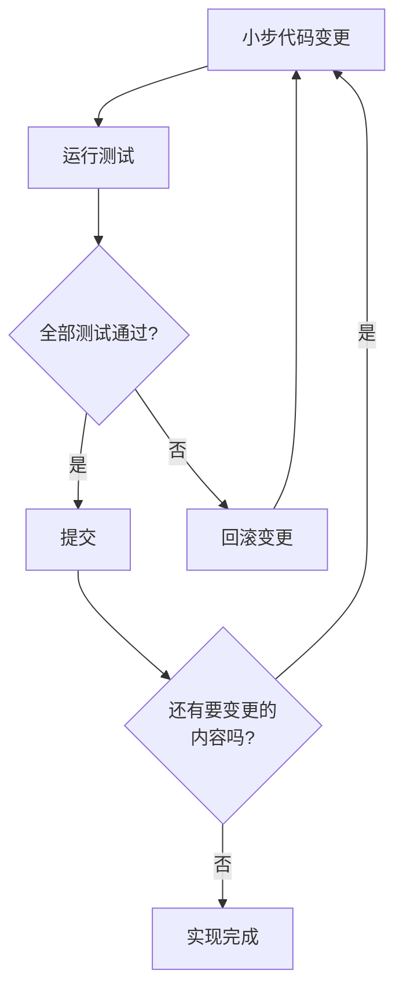
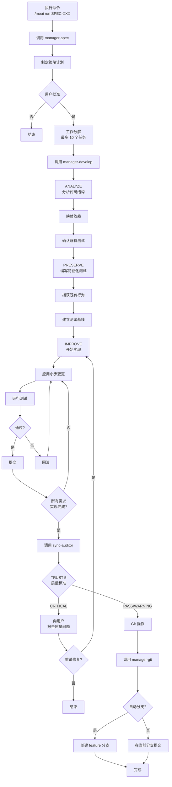

基于 SPEC 文档实现代码的 Run 阶段命令。根据项目状态应用 TDD (RED-GREEN-REFACTOR) 或 DDD (ANALYZE-PRESERVE-IMPROVE) 循环,本文以安全改进既有代码的 DDD 循环为中心进行说明。


**斜杠命令**: 在 Claude Code 中输入 `/moai:run` 即可直接执行此命令。仅输入 `/moai` 会显示所有可用子命令列表。


## 概述

`/moai run` 是 MoAI-ADK 工作流的 **Phase 2 (Run)** 命令。它读取 Phase 1 生成的 SPEC 文档,通过 **ANALYZE-PRESERVE-IMPROVE** 循环,在不破坏既有功能的前提下安全地实现代码。内部由 **manager-develop** 智能体管理整个过程。

实现阶段是 3-Phase 流水线中消耗令牌最多的阶段。因此 v3 令牌经济学设计集中投入在这一阶段 — 自动加载 SPEC 摘要版 (`spec-compact.md`) 可节省约 30% 令牌;根据 SPEC 复杂度调节验证深度的 Harness Level Routing 减少不必要的审计成本;进度保存为文件,即使会话中断也能继续工作。


**用房屋改造理解 DDD**

DDD 的 ANALYZE-PRESERVE-IMPROVE 循环就像 **房屋改造**:

| 阶段         | 比喻                | 实际工作                       |
| ------------ | ------------------- | ------------------------------- |
| **ANALYZE**  | 检查房屋         | 掌握当前代码结构与问题点    |
| **PRESERVE** | 为现状拍照 | 用特征化测试记录既有行为  |
| **IMPROVE**  | 逐个房间改造  | 在通过测试的同时一点点改进 |

正如一次拆掉整栋房子很危险,代码也要 **一点点改、每次都验证** 才安全。



## 使用方法

将 Plan 阶段生成的 SPEC ID 作为参数传入:

```bash
# Plan 阶段完成后务必执行 /clear
> /clear

# 指定 SPEC ID 开始实现
> /moai run SPEC-AUTH-001
```


  执行 `/moai run` 前请务必先执行 `/clear`。清理 Plan 阶段消耗的
  令牌,Run 阶段才能 **完整利用 200K 令牌**。


## 支持的标志

| 标志              | 说明                  | 示例                               |
| ------------------- | --------------------- | ---------------------------------- |
| `--resume SPEC-XXX` | 恢复中断的实现工作 | `/moai run --resume SPEC-AUTH-001` |
| `--team`            | 强制智能体团队模式 | `/moai run SPEC-AUTH-001 --team`   |
| `--solo`            | 强制子智能体模式 | `/moai run SPEC-AUTH-001 --solo`   |

**Resume 功能:**

重新执行时,从最后一个成功阶段的检查点继续工作。

## DDD 循环

`/moai run` 依次执行 **ANALYZE -> PRESERVE -> IMPROVE** 三个阶段。下面详细看看每个阶段发生了什么。

### 1. ANALYZE (分析)

读取既有代码,与 SPEC 需求比对,掌握需要做什么。

**分析项目:**

| 项目        | 说明                 | 示例                               |
| ----------- | -------------------- | ---------------------------------- |
| 代码结构   | 文件、模块、依赖   | "auth.py 依赖 user_service.py" |
| 领域边界 | 业务逻辑的范围 | "认证域与用户域分离" |
| 测试现状 | 既有测试覆盖率 | "当前 45% 覆盖率"                |
| 技术债务   | 需要改进的部分   | "发现 SQL Injection 漏洞"        |

### 2. PRESERVE (保留)

用 **特征化测试** 记录既有代码的当前行为。这些测试起到 **安全网** 的作用,用来确认重构后既有功能仍然照常工作。


**什么是特征化测试?**

它不是判断"这段代码对还是错",而是 **记录"当前它是这样运行的"**。

例如,既有登录函数成功时返回 `{"status": "success"}`,就把这一
行为记录为测试。之后修改代码时如果该测试失败,就能立即知道"既有
行为发生了变化"。



### 3. IMPROVE (改进)

按照 SPEC 需求 **以小步幅** 修改代码,每次都运行测试,确认既有行为得到保留。

**核心原则: 小步变更 + 每次验证**


```mermaid
flowchart TD
    A["小步代码变更"] --> B["运行测试"]
    B --> C{"全部测试通过?"}
    C -->|是| D["提交"]
    D --> E{"还有要变更的<br/>内容吗?"}
    E -->|是| A
    E -->|否| F["实现完成"]
    C -->|否| G["回滚变更"]
    G --> A
```

## 执行过程

`/moai run` 在内部执行的完整过程如下:


```mermaid
flowchart TD
    A["执行命令<br/>/moai run SPEC-XXX"] --> B["调用 manager-spec"]
    B --> C["制定策略计划"]

    C --> D{"用户批准"}
    D -->|否| E["结束"]
    D -->|是| F["工作分解<br/>最多 10 个任务"]

    F --> G["调用 manager-develop"]
    G --> H["ANALYZE<br/>分析代码结构"]
    H --> I["映射依赖"]
    I --> J["确认既有测试"]

    J --> K["PRESERVE<br/>编写特征化测试"]
    K --> L["捕获既有行为"]
    L --> M["建立测试基线"]

    M --> N["IMPROVE<br/>开始实现"]
    N --> O["应用小步变更"]
    O --> P["运行测试"]
    P --> Q{"通过?"}
    Q -->|是| R["提交"]
    R --> S{"所有需求<br/>实现完成?"}
    S -->|否| O
    S -->|是| T["调用 sync-auditor"]

    Q -->|否| U["回滚"]
    U --> O

    T --> V{"TRUST 5<br/>质量标准"}
    V -->|CRITICAL| W["向用户<br/>报告质量问题"]
    V -->|PASS/WARNING| X["Git 操作"]

    W --> Y{"重试修复?"}
    Y -->|是| N
    Y -->|否| Z["结束"]

    X --> AA["调用 manager-git"]
    AA --> AB{"自动分支?"}
    AB -->|是| AC["创建 feature 分支"]
    AB -->|否| AD["在当前分支提交"]
    AC --> AE["完成"]
    AD --> AE
```

## 各阶段详解

### Phase 0.9: JIT Language Detection (语言自动检测)

自动检测项目的主要语言,在生成智能体时注入合适的语言技能。平等支持 16 种语言。

| 检测文件 | 语言技能 |
|-----------|-----------|
| `go.mod` | moai-lang-go |
| `package.json` (typescript) | moai-lang-typescript |
| `pyproject.toml` | moai-lang-python |
| `Cargo.toml` | moai-lang-rust |
| `pom.xml` / `build.gradle` | moai-lang-java |

### Phase 0.95: Scale-Based Mode Selection (基于规模的模式选择)

根据 SPEC 规模自动选择最优执行模式。不为小任务运转沉重的流水线 — 这也是令牌经济学。

| 模式 | 标准 | 执行模式 |
|------|------|-----------|
| Bug 修复 | 文件 ≤ 3, 单一域 | **Fix Mode** |
| 单一功能 | 文件 ≤ 5, 单一域 | **Focused Mode** |
| 域内功能 | 文件 5-10 | **Standard Mode** |
| 多域 | 文件 ≥ 10 或域 ≥ 3 | **Full Pipeline** |
| 大规模变更 | complexity ≥ 7 + --team | **Team Mode** |

### Harness Level Routing (质量深度路由)

在 Run phase 开始时,根据 SPEC 复杂度自动决定质量流水线的深度。

| 级别 | 对象 | evaluator | 跳过的 Phase |
|------|------|-----------|---------------|
| **minimal** | 简单 Bug 修复、配置变更 | 停用 | 0, 0.5, 2.0, 2.5, 2.75, 2.8a |
| **standard** | 一般功能开发(默认) | final-pass (仅 Phase 2.8a) | 无 |
| **thorough** | 安全/支付等关键功能 | per-sprint (Phase 2.0 + 2.8a) | 无 |

失败时自动升级: minimal → standard → thorough(最多 2 次)

### Phase 1: 分析与规划

**manager-spec** 子智能体执行以下工作:

- 完整分析 SPEC 文档
- 提取需求与成功标准
- 识别实现阶段与各项工作
- 决定技术栈与依赖需求
- 估算复杂度与工作量
- 生成分阶段方法的详细执行策略

**输出:** 包含 plan_summary、requirements 列表、success_criteria、effort_estimate 的执行计划

### Phase 1.5: 工作分解

将已批准的执行计划分解为原子化、可审查的工作:

**工作结构:**

- **Task ID**: SPEC 内顺序编号(TASK-001、TASK-002 等)
- **Description**: 明确的工作陈述
- **Requirement Mapping**: 满足的 SPEC 需求
- **Dependencies**: 前置工作列表
- **Acceptance Criteria**: 完成验证方法

**约束条件:** 每个 SPEC 最多 10 个任务。若需更多,建议拆分 SPEC

任务分解结果持久记录于 `.moai/specs/SPEC-{ID}/tasks.md`。可通过 Git 追踪,并由 Drift Guard 引用。

### Phase 2.0: Sprint Contract (仅 thorough)

仅在 thorough 级别执行。在实现前与 sync-auditor 预先商定 Done 标准。

**契约内容:**
- 必须通过的具体测试用例
- 已识别的边界情况
- 硬性阈值(覆盖率 %、性能目标、安全需求)

最多 2 轮协商后,以 evaluator 建议案确定。

### Phase 2: DDD 实现

**manager-develop** 子智能体执行 ANALYZE-PRESERVE-IMPROVE 循环:

**要求:**

- 初始化工作追踪
- 执行完整的 ANALYZE-PRESERVE-IMPROVE 循环
- 每次转换后验证既有测试通过
- 为没有覆盖率的代码路径创建特征化测试
- 达到 85% 以上的测试覆盖率

**输出:** files_modified、characterization_tests_created、test_results、behavior_preserved、structural_metrics

### Phase 2.5: 质量验证

**sync-auditor** 子智能体执行 TRUST 5 验证:

| TRUST 5 支柱  | 验证项目                          |
| ------------- | ---------------------------------- |
| **Tested**    | 测试存在且通过,维持 DDD 纪律 |
| **Readable**  | 遵守项目规则,包含文档      |
| **Unified**   | 遵循既有项目模式            |
| **Secured**   | 无安全漏洞,遵守 OWASP       |
| **Trackable** | 清晰的提交信息,支持历史分析 |

**附加验证:**

- 测试覆盖率 85% 以上
- 行为保留: 既有测试不改动即通过
- 特征化测试通过: 行为快照一致
- 结构改进: 耦合度与内聚度指标改善

**输出:** trust_5_validation 结果、coverage_percentage、overall_status (PASS/WARNING/CRITICAL)、issues_found

### Phase 2.8a/2.8b: 主动评估与静态验证

质量评估分为两个阶段执行:

- **Phase 2.8a**: sync-auditor 主动评估 (Functionality/Security/Craft/Consistency)
- **Phase 2.8b**: sync-auditor TRUST 5 静态验证


Security FAIL = 整体 FAIL。最多 3 次修复-评估循环后向用户报告。


### Drift Guard (范围偏移检测)

在 DDD/TDD 循环完成时,对比计划与实际变更:

- drift ≤ 20%: 仅记录信息
- 20% < drift ≤ 30%: 警告
- drift > 30%: 触发 Phase 2.7 重新规划门禁

### Phase 3: Git 操作(条件性)

**manager-git** 子智能体执行 Git 自动化:

**执行条件:**

- quality_status 为 PASS 或 WARNING
- git_strategy.automation.auto_branch 为 true 时创建 feature 分支
- auto_branch 为 false 时直接在当前分支提交

### Phase 4: 完成与引导

向用户提示以下选项:

| 选项           | 说明                                  |
| -------------- | ------------------------------------- |
| 文档同步    | 执行 `/moai sync` 生成文档与 PR |
| 实现其他功能 | 用 `/moai plan` 创建额外 SPEC       |
| 审查结果      | 在本地确认实现与测试覆盖率 |
| 完成           | 结束会话                             |

## 节省令牌的装置 — spec-compact.md

进入 Run phase 时自动加载 SPEC 摘要版,**节省约 30% 令牌**。若 `.moai/specs/SPEC-{ID}/spec-compact.md` 存在,则代替完整 spec.md 使用。

## 质量门禁

实现完成后,必须通过以下全部质量标准:

| 项目            | 标准         | 说明                                 |
| --------------- | ------------ | ------------------------------------ |
| LSP 错误        | **0 个**      | 无类型检查器、linter 错误            |
| 类型错误       | **0 个**      | 无 pyright、mypy、tsc 等类型错误 |
| Lint 错误       | **0 个**      | 无 ruff、eslint 等 linter 错误       |
| 测试覆盖率 | **85% 以上** | 代码测试覆盖率目标            |
| 行为保留       | **100%**     | 全部特征化测试通过              |



**为什么需要 85% 覆盖率?**

目标定为 85% 而非 100% 的原因

**100% 不现实**,而且可能加入无意义的测试。**85% 就能覆盖大部分核心
逻辑**。其余 15% 是配置文件、错误处理器等难以测试的代码。



## 实战示例

### 示例: 实现 SPEC-AUTH-001

**第 1 步: 在 Plan 阶段完成 SPEC 生成**

```bash
> /moai plan "基于 JWT 的用户认证: 注册、登录、令牌刷新"
# SPEC-AUTH-001 生成完成
```

**第 2 步: 清理令牌后开始实现**

```bash
> /clear
> /moai run SPEC-AUTH-001
```

**第 3 步: manager-develop 自动执行的工作**

manager-develop 智能体为实现 SPEC 执行的 4 个 Phase。

---

#### Phase 1: 策略规划

分析 SPEC 文档并制定实现策略。

```bash
Phase 1: 策略规划
- SPEC 文档分析完成
- 提取需求 5 项
- 分解为 7 个任务 (TASK-001 ~ TASK-007)
- 预估复杂度: 中等
```

---

#### Phase 1.5: 工作分解

将实现工作拆分为细粒度单元。

```bash
Phase 1.5: 工作分解
- TASK-001: 定义用户模型
- TASK-002: 密码哈希工具
- TASK-003: JWT 令牌生成/验证
- TASK-004: 注册 API
- TASK-005: 登录 API
- TASK-006: 令牌刷新 API
- TASK-007: 输入验证中间件
```

---

#### Phase 2: DDD 实现

通过 ANALYZE-PRESERVE-IMPROVE 循环安全实现。

**ANALYZE 阶段** - 理解既有代码:

```bash
ANALYZE 阶段:
- 分析既有代码结构: src/auth/ (4 个文件)
- 确认测试覆盖率: 当前 32%
- 映射依赖: bcrypt, PyJWT, SQLAlchemy
```

**PRESERVE 阶段** - 保护既有行为:

```bash
PRESERVE 阶段:
- 编写 12 个特征化测试
- 完成既有行为捕获
- 建立测试基线: 32%
```

**IMPROVE 阶段** - 渐进式实现:

```bash
IMPROVE 阶段:
- 迭代 1: TASK-001 用户模型(测试通过)
- 迭代 2: TASK-002 密码哈希(测试通过)
- 迭代 3: TASK-003 JWT 令牌(测试通过)
- 迭代 4: TASK-004 注册 API(测试通过)
- 迭代 5: TASK-005 登录 API(测试通过)
- 迭代 6: TASK-006 令牌刷新(测试通过)
- 迭代 7: TASK-007 输入验证(测试通过)
```

---

#### Phase 2.5: 质量验证

按 TRUST 5 支柱验证质量。

```bash
Phase 2.5: 质量验证
- TRUST 5 支柱全部通过
- 测试覆盖率: 89%
- LSP 错误: 0 个
- 类型错误: 0 个
- 特征化测试: 12/12 通过
- 新测试: 24/24 通过
- 状态: PASS
```

---

#### Phase 3: Git 操作

以 Conventional Commits 创建提交。

```bash
Phase 3: Git 操作
- 分支: feature/SPEC-AUTH-001
- 创建 7 个提交 (Conventional Commits)
```

---

#### Phase 4: 完成

实现完成后引导进入下一步。

```bash
Phase 4: 完成
- 实现完成
- 下一步: /moai sync
```

**第 4 步: 实现完成后进入 Sync 阶段**

```bash
> /clear
> /moai sync SPEC-AUTH-001
```

## 常见问题

### Q: 新项目没有既有代码时,PRESERVE 阶段会怎样?

没有既有代码时,PRESERVE 阶段会 **快速通过**。新代码的测试在 IMPROVE 阶段一并编写。

### Q: TDD 和 DDD 中会应用哪个循环?

遵循 `quality.yaml` 的 `development_mode` 设置。新功能开发适合 TDD (RED-GREEN-REFACTOR),测试覆盖率低的既有项目重构适合 DDD (ANALYZE-PRESERVE-IMPROVE)。

### Q: 实现中途令牌不足怎么办?

manager-develop 智能体会 **自动保存进度**。执行 `/clear` 后再次执行 `/moai run SPEC-XXX`,即可基于 SPEC 文档继续工作。

### Q: 难以达到 85% 测试覆盖率怎么办?

可以在 `quality.yaml` 中调整覆盖率目标,但 **不推荐**。85% 是保证核心逻辑已被测试的最低标准。覆盖率不足时,manager-develop 会自动补充缺失的测试。

### Q: Phase 2.5 出现 CRITICAL 状态怎么办?

会向用户报告质量问题,并询问是否重试修复。选择"是"则返回 IMPROVE 阶段继续修复。

### Q: `/moai run` 和 `/moai` 有什么区别?

`/moai run` **仅基于已生成的 SPEC 执行实现**。`/moai` 则从 SPEC 生成到实现、文档化,自动执行 **完整工作流**。

## 相关文档

- [领域驱动开发](/core-concepts/ddd) - ANALYZE-PRESERVE-IMPROVE 循环详解
- [TRUST 5 质量系统](/core-concepts/trust-5) - 质量门禁详解
- [/moai plan](./moai-plan) - 上一步: 生成 SPEC 文档
- [/moai sync](./moai-sync) - 下一步: 文档同步与 PR
