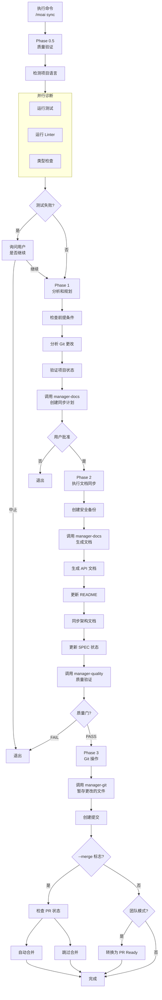

# /moai sync

同步已完成实现的代码的文档，并通过 Git 自动化准备部署。


**斜杠命令**: 在 Claude Code 中输入 `/moai:sync` 可以直接运行此命令。仅输入 `/moai` 即可查看所有可用子命令列表。


## 概述

`/moai sync` 是 MoAI-ADK 工作流的 **Phase 3 (Sync)** 命令。它分析在 Phase 2 中实现的代码以自动生成文档，并创建 Git 提交和 PR (Pull Request) 以完成部署准备。内部由 **manager-docs** agent 管理整个过程。



**为什么需要文档同步？**

编写代码后单独编写文档很繁琐，代码和文档容易不一致。`/moai sync` 解决了这个问题:

- **分析代码**以**自动生成** API 文档
- **自动更新** README 和 CHANGELOG
- **自动创建** Git 提交和 PR

由于代码更改和文档始终同步，"文档过时"的问题消失了。



## 用法

在 Run 阶段完成后执行:

```bash
# Run 阶段完成后运行 /clear (推荐)
> /clear

# 文档同步和 PR 创建
> /moai sync
```

## 支持的模式

| 模式          | 描述                        | 使用时机                  |
| ------------- | --------------------------- | -------------------------- |
| `auto` (默认) | 仅智能同步更改的文件   | 日常开发                  |
| `force`       | 重新生成所有文档            | 错误恢复、大规模重构 |
| `status`      | 只读状态检查         | 快速健康检查             |
| `project`     | 更新整个项目文档 | 里程碑完成、定期同步 |

### 按模式使用

```bash
# 默认模式 (仅更改的文件)
> /moai sync

# 完整重新生成
> /moai sync --mode force

# 仅状态检查
> /moai sync --mode status

# 更新整个项目
> /moai sync --mode project
```

## 支持的标志

| 标志    | 描述                 | 示例                 |
| --------- | -------------------- | -------------------- |
| `--pr`   | 跳过 changelog 提示并自动打开 PR | `/moai sync --pr` |
### --pr 标志

跳过 changelog 提示并自动打开 PR:

```bash
> /moai sync --pr
```

**使用场景**: 当您想在不手动输入 changelog 信息的情况下快速创建 PR 时。changelog 可以在 PR 审查期间稍后添加。

| `--merge` | 完成后自动合并 PR | `/moai sync --merge` |
| `--team`  | 强制代理团队模式 | `/moai sync --team`   |
| `--solo`  | 强制子代理模式   | `/moai sync --solo`   |

### --merge 标志

Sync 完成后自动合并 PR 并清理分支:

```bash
> /moai sync --merge
```

**工作流程:**

1. 检查 CI/CD 状态 (gh pr checks)
2. 检查合并冲突 (gh pr view --json mergeable)
3. 通过且可合并时: 自动合并 (gh pr merge --squash --delete-branch)
4. 签出到 develop 分支，pull，删除本地分支


  `--merge` 选项仅在 **CI/CD 通过时**自动合并 PR。确保安全自动化。


**Token 效率策略:**

- 仅从 SPEC 文档加载元数据和摘要
- 缓存并重用先前阶段的更改文件列表
- 使用文档模板减少生成时间

## 执行过程

`/moai sync` 内部执行的整个过程:



## 分阶段详情

### Phase 0.5: 质量验证 (并行诊断)

在文档同步前验证项目质量。

**Step 1 - 检测项目语言:**

| 语言                | 指示文件                                  |
| ------------------- | ------------------------------------------ |
| Python              | pyproject.toml, setup.py, requirements.txt |
| TypeScript          | tsconfig.json, package.json (typescript)   |
| JavaScript          | package.json (无 tsconfig)                 |
| Go                  | go.mod, go.sum                             |
| Rust                | Cargo.toml, Cargo.lock                     |
| 支持其他 11 种语言 |

**Step 2 - 并行诊断:**

三种工具同时运行:

| 诊断工具   | 目的             | 超时 |
| ----------- | ---------------- | -------- |
| 测试运行 | 检测测试失败 | 180 秒    |
| Linter        | 检查代码样式 | 120 秒    |
| 类型检查   | 检查类型错误   | 120 秒    |

**Step 3 - 处理测试失败:**

当测试失败时，向用户展示选项:

- **Continue**: 无论失败都继续
- **Abort**: 停止并退出

**Step 4 - 代码审查:**

**manager-quality** subagent 执行 TRUST 5 质量验证并生成综合报告。

**Step 5 - 生成质量报告:**

汇总 test-runner、linter、type-checker、code-review 的状态并确定整体状态 (PASS 或 WARN)。

### Phase 1: 分析和规划

**manager-docs** subagent 创建同步策略。

**输出:** documents_to_update、specs_requiring_sync、project_improvements_needed、estimated_scope

### Phase 2: 执行文档同步

**Step 1 - 创建安全备份:**

在修改前创建备份:

- 创建时间戳
- 备份目录: `.moai-backups/sync-{timestamp}/`
- 复制重要文件: README.md、docs/、.moai/specs/
- 验证备份完整性

**Step 2 - 文档同步:**

**manager-docs** subagent 执行以下任务:

- 在 Living Documents 中反映更改的代码
- 自动生成和更新 API 文档
- 必要时更新 README
- 同步架构文档
- 修复项目问题和恢复损坏的引用
- 确保 SPEC 文档与实现匹配
- 检测更改的领域并创建特定领域的更新
- 生成同步报告: `.moai/reports/sync-report-{timestamp}.md`

**Step 3 - 同步后质量验证:**

**manager-quality** subagent 根据 TRUST 5 标准验证同步质量:

- 所有项目链接完成
- 文档格式良好
- 所有文档一致
- 无凭据泄露
- 所有 SPEC 适当链接

**Step 4 - 更新 SPEC 状态:**

批量更新完成的 SPEC 状态为 "completed"，记录版本更改和状态转换。

### Phase 3: Git 操作和 PR

**manager-git** subagent 执行 Git 操作:

**Step 1 - 创建提交:**

- 暂存所有更改的文档、报告、README、docs/ 文件
- 创建单个提交，列出同步的文档、项目修复、SPEC 更新
- 使用 git log 验证提交

**Step 2 - 转换为 PR Ready (仅团队模式):**

- 检查 git_strategy.mode 中的设置
- 如果是团队模式: 从 Draft PR 转换为 Ready (gh pr ready)
- 如果配置则分配审查者和标签
- 如果是个人模式: 跳过

**Step 3 - 自动合并 (仅 --merge 标志):**

- 使用 gh pr checks 检查 CI/CD 状态
- 使用 gh pr view --json mergeable 检查合并冲突
- 通过且可合并时: 运行 gh pr merge --squash --delete-branch
- 签出到 develop，pull，删除本地分支

### Phase 4: 完成和后续步骤

**标准完成报告:**

汇总并显示以下内容:

- mode、scope、更新/创建的文件数
- 项目改进
- 更新的文档
- 生成的报告
- 备份位置

**Worktree 模式后续步骤 (从 git 上下文自动检测):**

| 选项                 | 描述                         |
| -------------------- | ---------------------------- |
| 返回主目录 | 退出 worktree 并转到主       |
| 在 Worktree 中继续    | 在当前 worktree 中继续工作  |
| 切换到其他 Worktree | 选择另一个 worktree           |
| 删除此 Worktree     | 清理 worktree                |

**分支模式后续步骤 (从 git 上下文自动检测):**

| 选项                  | 描述                      |
| --------------------- | ------------------------- |
| 提交并推送更改 | 将更改上传到远程    |
| 返回主分支    | 转到 develop 或 main     |
| 创建 PR               | 创建 Pull Request         |
| 在分支上继续       | 在当前分支上继续工作 |

**标准后续步骤:**

| 选项           | 描述                     |
| -------------- | ------------------------ |
| 创建下一个 SPEC | 运行 `/moai plan`        |
| 开始新会话   | 运行 `/clear`            |
| 查看 PR        | 团队模式: gh pr view    |
| 继续开发      | 个人模式: 继续工作 |

## 生成的文档

`/moai sync` 自动生成或更新的文档:

### API 文档

从实现的代码分析 API 端点、函数签名和类结构以创建文档。

| 文档类型    | 内容                         | 生成条件               |
| ------------ | ---------------------------- | ----------------------- |
| API 参考 | 端点、请求/响应架构 | 当包含 REST API 时  |
| 函数文档    | 参数、返回值、异常       | 当包含公共函数时 |
| 类文档  | 属性、方法、继承关系      | 当包含类时    |

### README 更新

按如下方式更新项目的 README.md:

- **使用方法部分**: 新增功能的使用示例
- **API 部分**: 添加新端点列表
- **依赖项部分**: 反映新添加的库

### CHANGELOG 编写

以 [Keep a Changelog](https://keepachangelog.com) 格式记录更改历史:

```markdown
## [Unreleased]

### Added

- 基于 JWT 的用户认证系统 (SPEC-AUTH-001)
  - POST /api/auth/register - 注册
  - POST /api/auth/login - 登录
  - POST /api/auth/refresh - 令牌刷新
```

## Git 自动化

`/moai sync` 在文档生成后自动执行 Git 操作。

### 提交消息格式

MoAI-ADK 遵循 [Conventional Commits](https://www.conventionalcommits.org/) 格式:

| 前缀     | 用途      | 示例                                        |
| ---------- | --------- | ------------------------------------------- |
| `feat`     | 新功能   | `feat(auth): add JWT authentication`        |
| `fix`      | Bug 修复 | `fix(auth): resolve token expiration issue` |
| `docs`     | 文档      | `docs(auth): update API documentation`      |
| `refactor` | 重构  | `refactor(auth): centralize auth logic`     |
| `test`     | 测试    | `test(auth): add characterization tests`    |

## 质量门

Sync 阶段的质量标准比 Run 阶段更注重文档:

| 项目     | 标准          | 描述                        |
| -------- | ------------- | --------------------------- |
| LSP 错误 | **0**       | 代码必须没有错误         |
| 警告     | **最多 10 个** | 文档生成时允许一些警告 |
| LSP 状态 | **Clean**     | 整体清洁状态      |


  如果质量门失败，文档生成和 PR 创建将被**阻止**。首先回到 `/moai run` 修复代码问题，或使用 `/moai fix` 快速修复错误。


## 实际示例

### 示例: 文档同步和 PR 创建

**步骤 1: 确认 Run 阶段完成**

```bash
# 检查 Run 阶段是否完成
# manager-ddd 应该输出了 "DONE" 或 "COMPLETE" 标记
```

**步骤 2: 清除 Tokens 然后运行 Sync**

```bash
> /clear
> /moai sync
```

**步骤 3: manager-docs 自动执行的任务**

manager-docs agent 为文档同步执行的 4 个阶段。

---

#### Phase 0.5: 质量验证

在文档生成前验证项目状态。

```bash
Phase 0.5: 质量验证
  项目语言: Python
  测试: 36/36 通过
  Linter: 0 错误
  类型检查: 0 错误
  覆盖率: 89%
  整体状态: PASS
```

---

#### Phase 1: 分析和规划

分析 Git 更改并创建同步计划。

```bash
Phase 1: 分析和规划
  Git 更改: 12 个文件修改
  同步计划: 1 个 API 文档、README 更新、添加 CHANGELOG
  用户批准: 完成
```

---

#### Phase 2: 文档同步

生成必要的文档并更新现有文档。

```bash
Phase 2: 文档同步
  创建备份: .moai-backups/sync-20260128-143052/
  API 文档: docs/api/auth.md (新增)
  README.md: 更新使用方法部分
  CHANGELOG.md: 添加 v1.1.0 条目
  SPEC-AUTH-001 状态: ACTIVE → COMPLETED

  质量验证: 所有项目通过
```

---

#### Phase 3: Git 操作

创建提交并打开 PR。

```bash
Phase 3: Git 操作
  创建提交: docs(auth): synchronize documentation for SPEC-AUTH-001
  PR 状态: Draft → Ready (团队模式)
```

**步骤 4: 查看创建的 PR**

```bash
# 在终端中查看 PR
$ gh pr view 42
```

创建的 PR 自动包含 SPEC 需求、更改文件列表和测试结果。

## 常见问题

### Q: 如果不想自动创建 PR 怎么办？

在 `git-strategy.yaml` 中设置 `auto_pr: false` 以仅自动执行到提交。您可以在首选时间手动创建 PR。

### Q: 可以更改 CHANGELOG 格式吗？

目前默认使用 [Keep a Changelog](https://keepachangelog.com) 格式。未来计划支持自定义格式。

### Q: 如果只想生成文档而不进行 Git 操作怎么办？

在 `git-strategy.yaml` 中设置 `auto_commit: false` 以仅执行文档生成。您可以手动执行 Git 操作。

### Q: 质量门失败时怎么办？

有两种方法:

```bash
# 方法 1: 使用 /moai fix 快速修复
> /moai fix "修复 lint 错误"

# 方法 2: 使用 /moai run 重新实现
> /moai run SPEC-AUTH-001
```

修复后再次运行 `/moai sync`。

### Q: `/moai sync` 和 `/moai` 有什么区别？

`/moai sync` 仅负责**记录已完成实现的代码**。`/moai` 自动执行**整个工作流**，从 SPEC 创建到实现和文档。

## 相关文档

- [/moai run](/workflow-commands/moai-run) - 上一阶段: DDD 实现
- [TRUST 5 质量系统](/core-concepts/trust-5) - 详细的质量门说明
- [快速开始](/getting-started/quickstart) - 完整工作流教程
