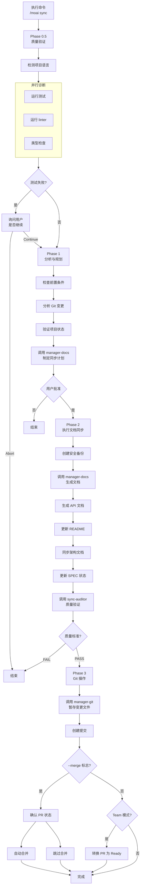

同步已完成实现的代码文档,并通过 Git 自动化准备部署。这是 3-Phase 生命周期的最后一步。


**斜杠命令**: 在 Claude Code 中输入 `/moai:sync` 即可直接执行此命令。仅输入 `/moai` 会显示所有可用子命令列表。


## 概述

`/moai sync` 是 MoAI-ADK 工作流的 **Phase 3 (Sync)** 命令。它分析 Phase 2 中完成实现的代码,自动生成文档,并创建 Git 提交与 PR (Pull Request),完成部署准备。内部由 **manager-docs** 智能体管理整个过程。

同步产出由 **sync-auditor** 独立评估 — 生成文档的智能体与检查的智能体相互分离,阶段的收尾依据的是经过验证的证据,而不是"已同步"的口头主张。


**为什么需要文档同步?**

写完代码后再单独撰写文档既繁琐,又容易造成代码与文档不一致。
`/moai sync` 解决了这个问题:

- **分析代码** 并 **自动生成** API 文档
- **自动更新** README 与 CHANGELOG
- **自动创建** Git 提交与 PR

代码变更与文档始终保持同步,"文档过时了"的问题就此消失。



## 使用方法

在 Run 阶段完成后执行:

```bash
# Run 阶段完成后执行 /clear(推荐)
> /clear

# 文档同步与创建 PR
> /moai sync
```

## 支持的模式

| 模式          | 说明                        | 使用时机                  |
| ------------- | --------------------------- | -------------------------- |
| `auto` (默认) | 仅智能同步变更文件   | 日常开发                  |
| `force`       | 重新生成全部文档            | 错误恢复、大规模重构 |
| `status`      | 只读状态检查         | 快速健康检查             |
| `project`     | 更新项目整体文档 | 里程碑完成、周期性同步 |

默认 `auto` 模式只挑选变更文件进行同步,这也是令牌经济学设计 — 如果没有理由每次重建全部文档,就不消耗那部分令牌。

### 各模式用法

```bash
# 默认模式(仅变更文件)
> /moai sync

# 全量重新生成
> /moai sync --mode force

# 仅确认状态
> /moai sync --mode status

# 项目整体更新
> /moai sync --mode project
```

## 支持的标志

| 标志    | 说明                 | 示例                 |
| --------- | -------------------- | -------------------- |
| `--pr`   | 跳过 changelog 提示并自动打开 PR | `/moai sync --pr` |
| `--merge` | 完成后自动合并 PR | `/moai sync --merge` |
| `--team`  | 强制智能体团队模式 | `/moai sync --team`   |
| `--solo`  | 强制子智能体模式 | `/moai sync --solo`   |

### --pr 标志

跳过 changelog 提示,自动打开 PR:

```bash
> /moai sync --pr
```

**使用场景**: 不想手动输入 changelog 信息、希望快速创建 PR 时。changelog 可以在 PR 审查期间稍后补充。

### --merge 标志

Sync 完成后自动合并 PR 并清理分支:

```bash
> /moai sync --merge
```

**工作流程:**

1. 确认 CI/CD 状态 (gh pr checks)
2. 确认合并冲突 (gh pr view --json mergeable)
3. 通过且可合并时: 自动合并 (gh pr merge --squash --delete-branch)
4. 检出到 develop 分支,pull,删除本地分支


  `--merge` 选项 **仅在 CI/CD 通过时** 自动合并 PR。保障安全的
  自动化。


**令牌效率化策略:**

- 只加载 SPEC 文档的元数据与摘要
- 缓存并复用上一阶段的变更文件列表
- 使用文档模板缩短生成时间

## 执行过程

`/moai sync` 在内部执行的完整过程如下:


```mermaid
flowchart TD
    A["执行命令<br/>/moai sync"] --> B["Phase 0.5<br/>质量验证"]

    B --> C["检测项目语言"]
    C --> D["执行并行诊断"]

    subgraph D["并行诊断"]
        D1["运行测试"]
        D2["运行 linter"]
        D3["类型检查"]
    end

    D --> E{"测试失败?"}
    E -->|是| F["询问用户<br/>是否继续"]
    F -->|Abort| G["结束"]
    F -->|Continue| H["继续 Phase 1"]

    E -->|否| H["Phase 1<br/>分析与规划"]

    H --> I["检查前置条件"]
    I --> J["分析 Git 变更"]
    J --> K["验证项目状态"]
    K --> L["调用 manager-docs<br/>制定同步计划"]

    L --> M{"用户批准"}
    M -->|否| N["结束"]
    M -->|是| O["Phase 2<br/>执行文档同步"]

    O --> P["创建安全备份"]
    P --> Q["调用 manager-docs<br/>生成文档"]
    Q --> R["生成 API 文档"]
    R --> S["更新 README"]
    S --> T["同步架构文档"]
    T --> U["更新 SPEC 状态"]

    U --> V["调用 sync-auditor<br/>质量验证"]
    V --> W{"质量标准?"}
    W -->|FAIL| G
    W -->|PASS| X["Phase 3<br/>Git 操作"]

    X --> Y["调用 manager-git<br/>暂存变更文件"]
    Y --> Z["创建提交"]
    Z --> AA{"--merge 标志?"}
    AA -->|是| AB["确认 PR 状态"]
    AB --> AC["自动合并"]
    AB --> AD["跳过合并"]
    AC --> AE["完成"]
    AD --> AE
    AA -->|否| AF{"Team 模式?"}
    AF -->|是| AG["转换 PR 为 Ready"]
    AF -->|否| AE
    AG --> AE
```

## 各阶段详解

### Phase 0.5: 质量验证(并行诊断)

在文档同步前验证项目质量。

**Step 1 - 检测项目语言:**

| 语言                | 标志文件                                  |
| ------------------- | ------------------------------------------ |
| Python              | pyproject.toml, setup.py, requirements.txt |
| TypeScript          | tsconfig.json, package.json (typescript)   |
| JavaScript          | package.json (no tsconfig)                 |
| Go                  | go.mod, go.sum                             |
| Rust                | Cargo.toml, Cargo.lock                     |
| 另支持其他 11 种语言 |

**Step 2 - 并行诊断:**

三种工具同时运行:

| 诊断工具   | 目的             | 超时 |
| ----------- | ---------------- | -------- |
| 运行测试 | 检测测试失败 | 180 秒    |
| Linter        | 检查代码风格 | 120 秒    |
| 类型检查   | 检查类型错误   | 120 秒    |

**Step 3 - 处理测试失败:**

测试失败时向用户提示选项:

- **Continue**: 无视失败继续
- **Abort**: 中断并结束

**Step 4 - 代码审查:**

**sync-auditor** 子智能体执行 TRUST 5 质量验证并生成综合报告。

**Step 5 - 生成质量报告:**

汇总 test-runner、linter、type-checker、code-review 的状态,并判定整体状态 (PASS 或 WARN)。

### Phase 1: 分析与规划

**manager-docs** 子智能体制定同步策略。

**输出:** documents_to_update、specs_requiring_sync、project_improvements_needed、estimated_scope

### Phase 2: 执行文档同步

**Step 1 - 创建安全备份:**

在修改前创建备份:

- 生成时间戳
- 备份目录: `.moai-backups/sync-{timestamp}/`
- 复制重要文件: README.md, docs/, .moai/specs/
- 验证备份完整性

**Step 2 - 文档同步:**

**manager-docs** 子智能体执行以下工作:

- 将变更的代码反映到 Living Documents
- 自动生成与更新 API 文档
- 必要时更新 README
- 同步架构文档
- 修复项目问题并恢复损坏的引用
- 确认 SPEC 文档与实现一致
- 检测变更的域并生成按域更新
- 生成同步报告: `.moai/reports/sync-report-{timestamp}.md`

**Step 3 - 同步后质量验证:**

**sync-auditor** 子智能体以 TRUST 5 标准验证同步质量:

- 所有项目链接完整
- 文档格式规范
- 所有文档保持一致
- 无凭证泄露
- 所有 SPEC 得到恰当关联

**Step 4 - 更新 SPEC 状态:**

批量更新已完成 SPEC 的状态,设为 "completed",并记录版本变更与状态转换。

### Phase 3: Git 操作与 PR

**manager-git** 子智能体执行 Git 操作:

**Step 1 - 创建提交:**

- 暂存所有变更的文档、报告、README、docs/ 文件
- 创建单个提交,列出同步的文档、项目修复、SPEC 更新
- 用 git log 验证提交

**Step 2 - 转换 PR 为 Ready(仅 Team 模式):**

- 在 git_strategy.mode 中确认设置
- Team 模式时: 从 Draft PR 转换为 Ready (gh pr ready)
- 如有配置,指定审查者并分配标签
- Personal 模式时: 跳过

**Step 3 - 自动合并(使用 --merge 标志时):**

- 用 gh pr checks 确认 CI/CD 状态
- 用 gh pr view --json mergeable 确认合并冲突
- 通过且可合并时: 执行 gh pr merge --squash --delete-branch
- 检出 develop,pull,删除本地分支

### Phase 4: 完成与下一步

**标准完成报告:**

汇总显示以下内容:

- mode、scope、更新/生成的文件数
- 项目改进事项
- 更新的文档
- 生成的报告
- 备份位置

**Worktree 模式下一步(从 git 上下文自动检测):**

| 选项                 | 说明                         |
| -------------------- | ---------------------------- |
| 返回主目录 | 离开 worktree 回到主目录 |
| 在 worktree 中继续    | 在当前 worktree 继续工作  |
| 切换到其他 worktree | 选择其他 worktree           |
| 移除此 worktree     | 清理 worktree                |

**分支模式下一步(从 git 上下文自动检测):**

| 选项                  | 说明                      |
| --------------------- | ------------------------- |
| 提交并推送变更 | 将变更上传到远端    |
| 返回主分支    | 到 develop 或 main     |
| 创建 PR               | 创建 Pull Request         |
| 在分支上继续       | 在当前分支继续工作 |

**标准下一步:**

| 选项           | 说明                     |
| -------------- | ------------------------ |
| 创建下一个 SPEC | 执行 `/moai plan`        |
| 开始新会话   | 执行 `/clear`            |
| 审查 PR        | Team 模式: gh pr view    |
| 继续开发      | Personal 模式: 继续工作 |

## 生成的文档

`/moai sync` 自动生成或更新的文档如下:

### API 文档

从已实现的代码中分析 API 端点、函数签名、类结构,生成文档。

| 文档类型    | 内容                         | 生成条件               |
| ------------ | ---------------------------- | ----------------------- |
| API 参考 | 端点、请求/响应 schema | 包含 REST API 时  |
| 函数文档    | 参数、返回值、异常       | 包含公开函数时 |
| 类文档  | 属性、方法、继承关系      | 包含类时    |

### 更新 README

按如下方式更新项目的 README.md:

- **用法部分**: 新增功能的使用示例
- **API 部分**: 添加新端点列表
- **依赖部分**: 反映新添加的库

### 撰写 CHANGELOG

以 [Keep a Changelog](https://keepachangelog.com) 格式记录变更历史:

```markdown
## [Unreleased]

### Added

- 基于 JWT 的用户认证系统 (SPEC-AUTH-001)
  - POST /api/auth/register - 注册
  - POST /api/auth/login - 登录
  - POST /api/auth/refresh - 令牌刷新
```

## Git 自动化

`/moai sync` 在生成文档后自动执行 Git 操作。

### 提交信息格式

MoAI-ADK 遵循 [Conventional Commits](https://www.conventionalcommits.org/) 格式:

| 前缀     | 用途      | 示例                                        |
| ---------- | --------- | ------------------------------------------- |
| `feat`     | 新功能   | `feat(auth): add JWT authentication`        |
| `fix`      | Bug 修复 | `fix(auth): resolve token expiration issue` |
| `docs`     | 文档      | `docs(auth): update API documentation`      |
| `refactor` | 重构  | `refactor(auth): centralize auth logic`     |
| `test`     | 测试    | `test(auth): add characterization tests`    |

## PR 创建后的 CI 监控

`/moai sync` 创建 PR 之后,MoAI-ADK 会执行两个阶段的自动监控。Wave 1 轮询 CI 结果,判断哪个 required check 失败;Wave 2 在发生失败时进入自动 fix 循环。PR 创建后也无需人工盯着 CI 界面,而是由回路观察结果并做出响应 — 这是智能体回路工程延伸到 CI 领域的结构。

### Wave 1 — 轮询 CI 结果

- 以 30 秒间隔调用 `gh pr checks`(尊重 GitHub API rate limit)
- 30 分钟硬性超时 — 若 required check 在该时间内未完成,
  watch loop 以 exit code 3 结束
- required check 定义的 SSoT: `.github/required-checks.yml`
- auxiliary check 即使失败也不是 merge blocker(仅警告)

### Wave 2 — 自动 fix 循环(最多 3 次)

required check 失败时,MoAI-ADK 进入自动 fix 循环。

- 每次 iteration 都以 **新 commit** 应用 fix(禁止 force-push / amend)
- 每次 PR push 最多 3 次 iterations(不是 per-session)
- iteration ≥ 4 时,通过 blocking AskUserQuestion 升级至用户

### 自动处理 vs 需要人工决策

| 缺陷类型                  | 自动处理?    | 备注                                         |
| -------------------------- | ------------- | -------------------------------------------- |
| lint error                 | 自动          | `golangci-lint` 可 autofix 的项目          |
| format drift               | 自动          | `gofmt` / `prettier` 等                      |
| test syntax error          | 自动          | import 缺失 / 编译错误                    |
| **data race**              | **人工决策** | semantic failure — 判断是否为有意的并发   |
| **deadlock**               | **人工决策** | semantic failure                             |
| **panic**                  | **人工决策** | semantic failure                             |
| **test assertion failure** | **人工决策** | spec 与代码哪个正确需人工判断    |

### auto-fix 绝不触碰的文件


auto-fix 循环 **绝不修改** 以下文件:

- `.env`, `.env.*`(环境变量 / 机密)
- credentials 文件
- `scripts/ci-watch/run.sh`(Wave 2 infrastructure)
- `.github/required-checks.yml`(Wave 1 SSoT)


### 相关文档

- 轮询 doctrine SSoT: `.claude/rules/moai/workflow/ci-watch-protocol.md`
- auto-fix doctrine SSoT: `.claude/rules/moai/workflow/ci-autofix-protocol.md`

## 质量门禁

Sync 阶段的质量标准比 Run 阶段更侧重文档:

| 项目     | 标准          | 说明                        |
| -------- | ------------- | --------------------------- |
| LSP 错误 | **0 个**       | 代码必须没有错误 |
| 警告     | **最多 10 个** | 文档生成时允许部分警告 |
| LSP 状态 | **Clean**     | 整体处于干净状态      |


  未通过质量门禁时,文档生成与 PR 创建会被 **中断**。请先
  回到 `/moai run` 修复代码问题,或用 `/moai fix` 快速修复
  错误。


## Worktree 上下文 Auto-Merge

在 worktree 环境中执行时,auto-merge 是默认行为。

**Worktree 上下文检测:**
- 当前 git 目录路径是否包含 `/.moai/worktrees/`
- 或 `.moai/worktrees/registry.json` 中存在当前 SPEC-ID 的活跃条目

**标志行为:**

| 标志 | v2.8 之前 | v2.9.0 之后 |
|--------|----------|------------|
| (无) | 不合并 | 在 worktree 上下文中 **自动合并** |
| `--merge` | 自动合并 | **Deprecated**(显示警告) |
| `--no-merge` | N/A | 跳过自动合并 |

**Auto-merge 执行条件:**
1. 所有 CI/CD 检查通过
2. 无合并冲突
3. 未设置 `--no-merge` 标志


CI 失败或冲突时不执行自动合并,并连同恢复命令一起报告错误。


### 合并后的自动清理

PR 合并成功后执行自动整理。

**条件:** Auto-merge 成功 AND `workflow.worktree.auto_cleanup == true`

**清理项目:**
1. 移除 worktree 目录
2. 删除 feature 分支 (`--delete-branch`)
3. 更新 worktree registry


清理失败不影响合并结果。失败时: 用 `moai worktree done SPEC-{ID}` 手动清理。


## `/cd` 缓存保留式恢复 (CC 2.1.169+)

跨目录边界恢复多阶段工作流时(例如在 run 与 sync 之间进入 L2 worktree),Claude Code 2.1.169+ 提供 `/cd <path>` — 一条在 **保留提示缓存的同时** 切换会话工作目录的命令,累积的推理上下文在 cwd 变更时得以保留而非重建。这是相对于打开新终端的缓存保留替代方案: `/cd` 保持上下文,新终端则 cold-start。在保留 run-phase 上下文的同时进入 L2 worktree 执行 sync-phase 时,`/cd <worktree-path>` 是摩擦最小的路径。缓存命中率即令牌成本,保留提示缓存的习惯从令牌经济学角度同样有效。切换如何反映在 `cwd` 字段中,请参阅 [Statusline 指南](/zh/advanced/statusline)。

## 实战示例

### 示例: 文档同步与创建 PR

**第 1 步: 确认 Run 阶段完成**

```bash
# 确认 Run 阶段是否已完成
# manager-develop 应已输出 "DONE" 或 "COMPLETE" 标记
```

**第 2 步: 清理令牌后执行 Sync**

```bash
> /clear
> /moai sync
```

**第 3 步: manager-docs 自动执行的工作**

manager-docs 智能体为文档同步执行的 4 个 Phase。

---

#### Phase 0.5: 质量验证

在生成文档前验证项目状态。

```bash
Phase 0.5: 质量验证
  项目语言: Python
  测试: 36/36 通过
  Linter: 0 错误
  类型检查: 0 错误
  覆盖率: 89%
  整体状态: PASS
```

---

#### Phase 1: 分析与规划

分析 Git 变更并制定同步计划。

```bash
Phase 1: 分析与规划
  Git 变更: 修改 12 个文件
  同步计划: API 文档 1 份、README 更新、CHANGELOG 追加
  用户批准: 完成
```

---

#### Phase 2: 文档同步

生成所需文档并更新既有文档。

```bash
Phase 2: 文档同步
  创建备份: .moai-backups/sync-20260128-143052/
  API 文档: docs/api/auth.md(新增)
  README.md: 更新用法部分
  CHANGELOG.md: 添加 v1.1.0 条目
  SPEC-AUTH-001 状态: ACTIVE → COMPLETED

  质量验证: 全部项目通过
```

---

#### Phase 3: Git 操作

创建提交并打开 PR。

```bash
Phase 3: Git 操作
  创建提交: docs(auth): synchronize documentation for SPEC-AUTH-001
  PR 状态: Draft → Ready (Team 模式)
```

**第 4 步: 确认生成的 PR**

```bash
# 在终端确认 PR
$ gh pr view 42
```

生成的 PR 自动包含 SPEC 需求、变更文件列表、测试结果。

## 常见问题

### Q: 不想自动创建 PR 怎么办?

在 `git-strategy.yaml` 中设置 `auto_pr: false`,则只自动执行到提交为止。PR 可以在想要的时间点手动创建。

### Q: 可以更改 CHANGELOG 格式吗?

目前默认使用 [Keep a Changelog](https://keepachangelog.com) 格式。自定义格式计划在未来支持。

### Q: 只想生成文档而不执行 Git 操作?

在 `git-strategy.yaml` 中设置 `auto_commit: false`,则只执行文档生成。Git 操作可以手动进行。

### Q: 质量门禁失败时怎么办?

有两种方法:

```bash
# 方法 1: 用 /moai fix 快速修复
> /moai fix "修复 lint 错误"

# 方法 2: 用 /moai run 重新实现
> /moai run SPEC-AUTH-001
```

修复后再次执行 `/moai sync`。

### Q: `/moai sync` 和 `/moai` 有什么区别?

`/moai sync` **仅负责已完成实现代码的文档化**。`/moai` 则从 SPEC 生成到实现、文档化,自动执行 **完整工作流**。

## 相关文档

- [/moai run](/workflow-commands/moai-run) - 上一步: DDD 实现
- [TRUST 5 质量系统](/core-concepts/trust-5) - 质量门禁详解
- [快速开始](/getting-started/quickstart) - 完整工作流教程
