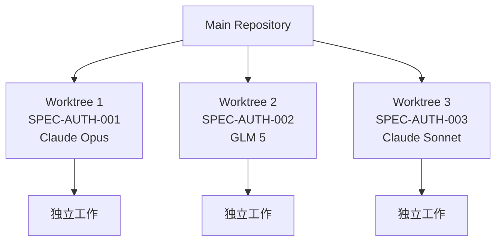
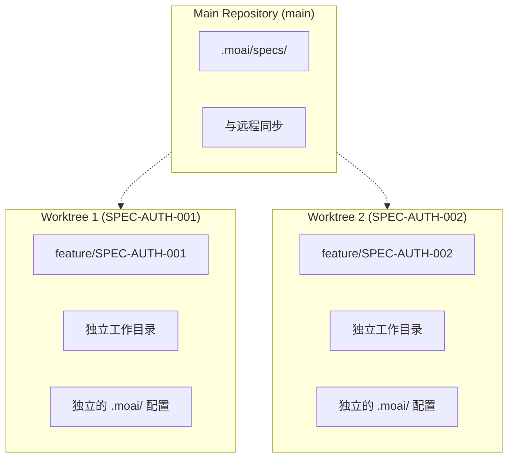
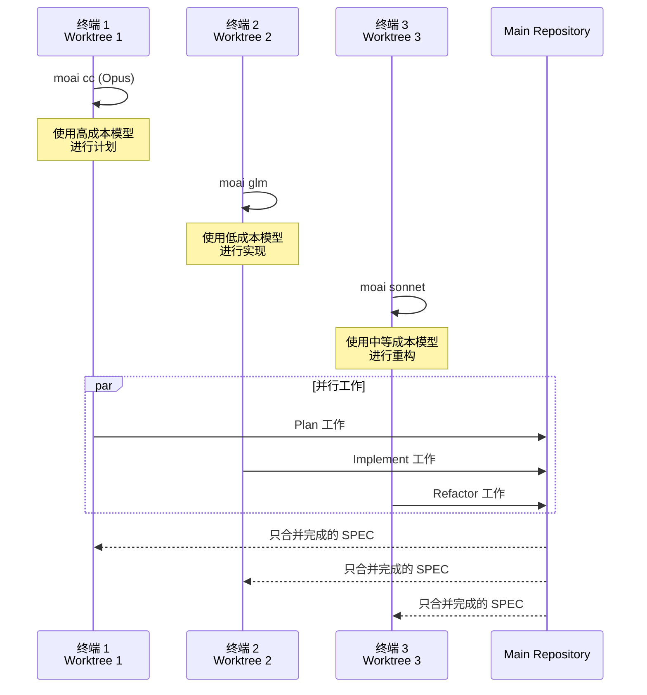
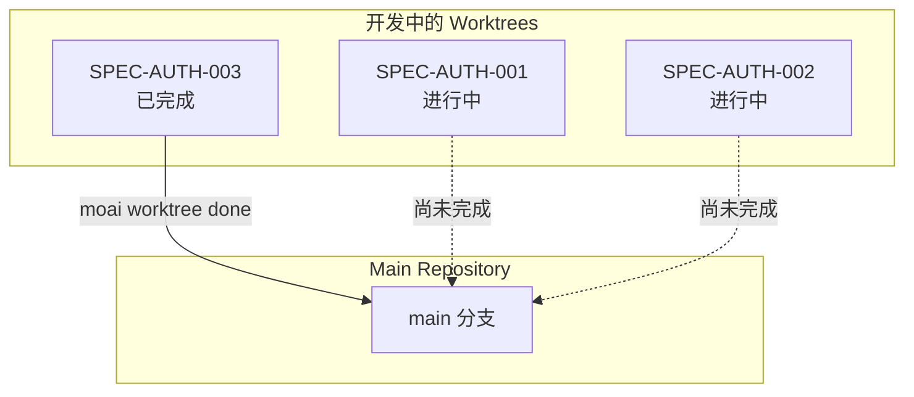

# Git Worktree 概述

Git Worktree 是 MoAI-ADK 中用于并行开发的核心功能。它提供完全隔离,使每个 SPEC 都能在独立环境中开发。

## 为什么需要 Worktree?

### 问题: 共享 LLM 设置

在传统的 MoAI-ADK 中,当您使用 `moai glm` 或 `moai cc` 更改 LLM 时,**相同的 LLM 会应用到所有打开的会话**。这会导致以下问题:

- **SPEC 间干扰**: 开发不同 SPEC 时 LLM 设置会相互影响
- **无法并行开发**: 无法同时开发多个 SPEC
- **成本效率低下**: 必须在所有会话中使用昂贵的 Opus

### 解决方案: 完全隔离

使用 Git Worktree,每个 SPEC 保持**完全独立的 Git 状态和 LLM 设置**:



## 核心工作流程

### 三步开发流程

使用 Git Worktree 的 MoAI-ADK 开发由 3 个步骤组成:

```mermaid
flowchart TD
    subgraph Phase1["阶段 1: Plan (终端 1)"]
        A1[/moai plan<br/>功能描述<br/>--worktree/] --> A2[SPEC 文档创建]
        A2 --> A3[Worktree 自动创建]
        A3 --> A4[Feature 分支创建]
    end

    subgraph Phase2["阶段 2: Implement (终端 2, 3, 4...)"]
        B1[moai worktree go SPEC-ID] --> B2[进入 Worktree]
        B2 --> B3[moai glm<br/>更改 LLM]
        B3 --> B4[/moai run SPEC-ID]
        B4 --> B5[/moai sync SPEC-ID]
    end

    subgraph Phase3["阶段 3: Merge & Cleanup"]
        C1[moai worktree done SPEC-ID] --> C2[切换到 main]
        C2 --> C3[合并]
        C3 --> C4[清理]
    end

    Phase1 --> Phase2
    Phase2 --> Phase3
```

### 分步详细说明

#### 步骤 1: Plan (终端 1)

使用 Claude 4.5 Opus 生成 SPEC 文档:

```bash
> /moai plan "添加认证系统" --worktree
```

**发生什么**:

- 自动创建 EARS 格式的 SPEC 文档
- 自动为该 SPEC 创建 Worktree
- 自动创建并切换 feature 分支

**结果**:

- `.moai/specs/SPEC-AUTH-001/spec.md`
- 新的 Worktree 目录
- `feature/SPEC-AUTH-001` 分支

#### 步骤 2: Implement (终端 2, 3, 4...)

使用 GLM 5 或其他经济高效的模型进行实现:

```bash
# 进入 Worktree (新终端)
$ moai worktree go SPEC-AUTH-001

# 更改 LLM
$ moai glm

# 开始开发
$ claude
> /moai run SPEC-AUTH-001
> /moai sync SPEC-AUTH-001
```

**优势**:

- 完全隔离的工作环境
- GLM 成本效率 (比 Opus 节省 70%)
- 无冲突的无限并行开发

#### 步骤 3: Merge & Cleanup

```bash
moai worktree done SPEC-AUTH-001              # main → 合并 → 清理
moai worktree done SPEC-AUTH-001 --push       # 以上操作 + 推送到远程
```

## Worktree 命令参考

| 命令                   | 描述                       | 示例                          |
| ------------------------ | -------------------------- | ------------------------------ |
| `moai worktree new SPEC-ID`    | 创建新 Worktree           | `moai worktree new SPEC-AUTH-001`    |
| `moai worktree go SPEC-ID`     | 进入 Worktree (打开新 shell) | `moai worktree go SPEC-AUTH-001`     |
| `moai worktree list`           | 列出 Worktree         | `moai worktree list`                 |
| `moai worktree done SPEC-ID`   | 合并并清理               | `moai worktree done SPEC-AUTH-001`   |
| `moai worktree remove SPEC-ID` | 删除 Worktree              | `moai worktree remove SPEC-AUTH-001` |
| `moai worktree status`         | 检查 Worktree 状态         | `moai worktree status`               |
| `moai worktree clean`          | 清理已合并的 Worktree       | `moai worktree clean --merged-only`  |
| `moai worktree config`         | 检查 Worktree 设置         | `moai worktree config root`          |

## Worktree 的核心优势

### 1. 完全隔离

每个 SPEC 保持独立的 Git 状态:



**优势**:

- 可以在每个 Worktree 中独立提交
- 无分支冲突的工作
- 只有完成的 SPEC 才会合并到 main

### 2. LLM 独立性

每个 Worktree 保持独立的 LLM 设置:



### 3. 无限并行开发

可以同时开发多个 SPEC:

```bash
# 终端 1: Plan SPEC-AUTH-001
> /moai plan "认证系统" --worktree

# 终端 2: Implement SPEC-AUTH-002 (GLM)
$ moai worktree go SPEC-AUTH-002
$ moai glm
> /moai run SPEC-AUTH-002

# 终端 3: Implement SPEC-AUTH-003 (GLM)
$ moai worktree go SPEC-AUTH-003
$ moai glm
> /moai run SPEC-AUTH-003

# 终端 4: Document SPEC-AUTH-004
$ moai worktree go SPEC-AUTH-004
> /moai sync SPEC-AUTH-004
```

### 4. 安全合并

只有完成的 SPEC 才会合并到 main 分支:



## 并行开发可视化

在多个终端中同时工作:

```mermaid
flowchart TD
    subgraph Terminal1["终端 1: Planning"]
        T1A[/moai plan<br/>--worktree/]
        T1B[Claude Opus<br/>高成本/高质量]
        T1C[SPEC 文档创建]
    end

    subgraph Terminal2["终端 2: Implementing"]
        T2A[moai worktree go<br/>SPEC-AUTH-001]
        T2B[moai glm<br/>低成本]
        T2C[/moai run<br/>DDD 实现]
    end

    subgraph Terminal3["终端 3: Implementing"]
        T3A[moai worktree go<br/>SPEC-AUTH-002]
        T3B[moai glm<br/>低成本]
        T3C[/moai run<br/>DDD 实现]
    end

    subgraph Terminal4["终端 4: Documenting"]
        T4A[moai worktree go<br/>SPEC-AUTH-003]
        T4B[moai sonnet<br/>中等成本]
        T4C[/moai sync<br/>文档化]
    end

    T1C --> T2A
    T1C --> T3A
    T1C --> T4A
```

## 下一步

- **[完整指南](/worktree/faq)** - Git Worktree 的所有命令和详细用法
- **[实际示例](/worktree/faq)** - 真实项目中的使用案例
- **[FAQ](/worktree/faq)** - 常见问题和故障排除

## 相关文档

- [MoAI-ADK 文档](https://adk.mo.ai.kr)
- [SPEC 系统](../spec/)
- [DDD 工作流程](../workflow/)
