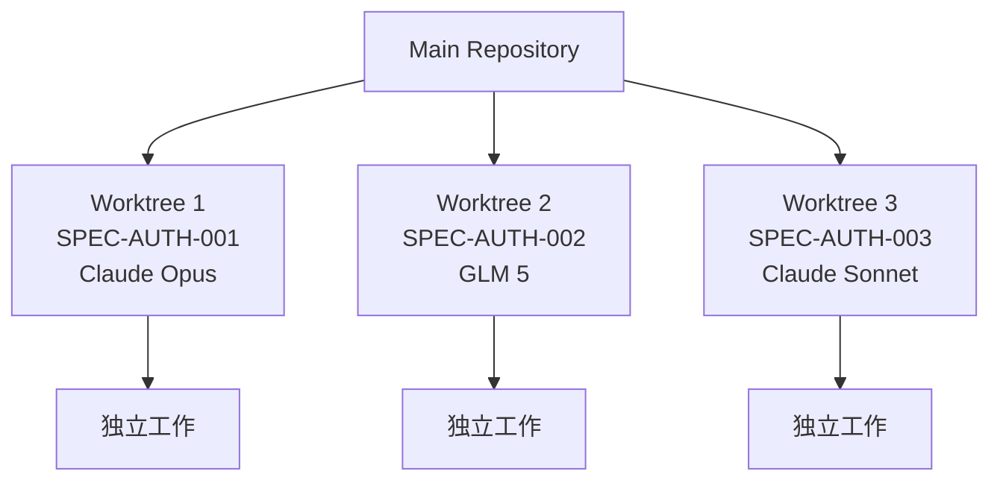
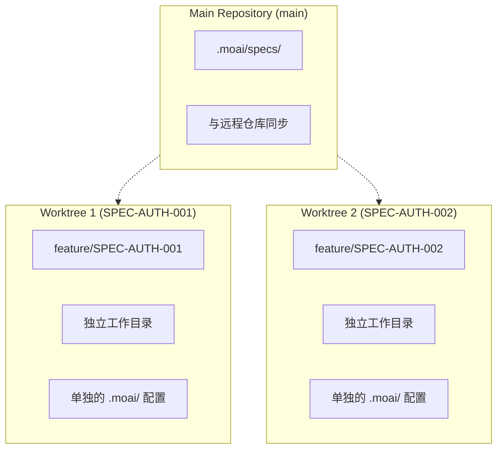
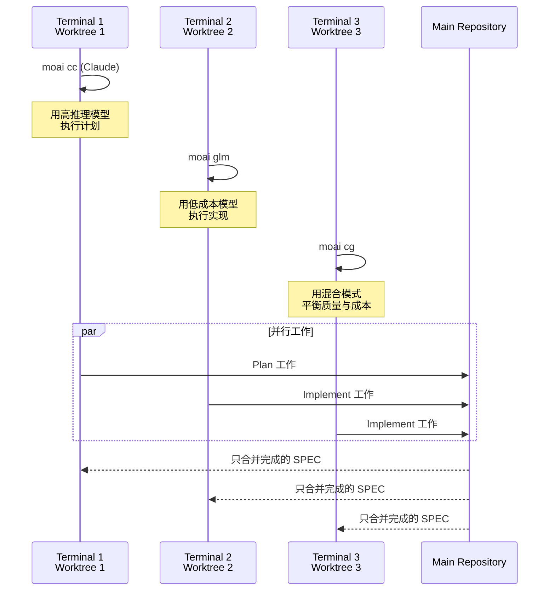
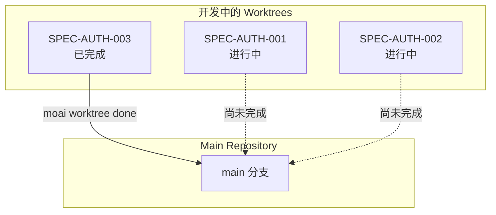

Git Worktree 是 MoAI-ADK 并行开发的基石。它为每个 SPEC 创建完全独立的工作
空间，让不同的 Git 状态和不同的 LLM 配置可以同时运转。

从 MoAI-ADK v3.0 的核心价值 **托克诺米克斯** (Token Economics) 的角度看，
Worktree 是把"计划要深、实现要省"真正落地的装置。计划终端使用高推理的
Claude 模型，实现终端使用低成本的 GLM —— 按工作阶段分配合适的模型这件事，
没有 Worktree 隔离就无法实现。



## 为什么需要 Worktree？

### 问题：LLM 配置在会话之间共享

如果不使用 Worktree，用 `moai glm` 或 `moai cc` 切换 LLM 后端时，同一项目的
**所有已打开会话都会应用相同的配置**。结果是：

- **SPEC 之间相互干扰** —— 在一个 SPEC 中更改的 LLM 配置会影响其他 SPEC 的工作
- **无法并行开发** —— 无法以不同条件同时推进多个 SPEC
- **浪费 Token** —— 连简单的实现工作也全部跑在高成本模型上

### 解决方案：完全隔离

使用 Git Worktree 后，每个 SPEC 都拥有**独立的 Git 状态和 LLM 配置**：


```mermaid
graph TB
    A[Main Repository] --> B[Worktree 1<br/>SPEC-AUTH-001<br/>Claude Opus]
    A --> C[Worktree 2<br/>SPEC-AUTH-002<br/>GLM 5]
    A --> D[Worktree 3<br/>SPEC-AUTH-003<br/>Claude Sonnet]

    B --> E[独立工作]
    C --> F[独立工作]
    D --> G[独立工作]
```

## 核心工作流

### 三阶段开发流程

利用 Worktree 的 MoAI-ADK 开发按三个阶段推进：

```mermaid
flowchart TD
    subgraph Phase1["Phase 1: Plan (Terminal 1)"]
        A1[/moai plan<br/>feature description<br/>--worktree/] --> A2[生成 SPEC 文档]
        A2 --> A3[自动创建 Worktree]
        A3 --> A4[创建 Feature 分支]
    end

    subgraph Phase2["Phase 2: Implement (Terminals 2, 3, 4...)"]
        B1[moai worktree go SPEC-ID] --> B2[进入 Worktree]
        B2 --> B3[moai glm<br/>切换 LLM]
        B3 --> B4[/moai run SPEC-ID]
        B4 --> B5[/moai sync SPEC-ID]
    end

    subgraph Phase3["Phase 3: Merge & Cleanup"]
        C1[moai worktree done SPEC-ID] --> C2[检出 main]
        C2 --> C3[合并]
        C3 --> C4[清理]
    end

    Phase1 --> Phase2
    Phase2 --> Phase3
```

### 各阶段详解

#### 第 1 阶段：Plan (Terminal 1)

计划阶段的推理质量决定结果，因此使用 Claude(Opus 级) 模型撰写 SPEC 文档：

```bash
> /moai plan "添加认证系统" --worktree
```

**工作内容**：

- 自动生成 EARS 格式的 SPEC 文档
- 自动创建该 SPEC 专用的 Worktree
- 自动创建并切换 Feature 分支

**产出物**：

- `.moai/specs/SPEC-AUTH-001/spec.md`
- 新的 Worktree 目录
- `feature/SPEC-AUTH-001` 分支

#### 第 2 阶段：Implement (Terminals 2, 3, 4...)

实现阶段虽然工作量大，但 SPEC 已经定好了方向，因此 GLM 这类成本高效的模型
足以胜任：

```bash
# 进入 Worktree（新终端）
$ moai worktree go SPEC-AUTH-001

# 切换 LLM
$ moai glm

# 开始开发
$ claude
> /moai run SPEC-AUTH-001
> /moai sync SPEC-AUTH-001
```

**优点**：

- 完全隔离的工作环境
- GLM 成本高效（相比 Opus 约节省 70%）
- 无冲突的无限并行开发

#### 第 3 阶段：Merge & Cleanup

```bash
moai worktree done SPEC-AUTH-001                    # worktree 清理（合并/推送通过 git 另行执行）
moai worktree done SPEC-AUTH-001 --delete-branch    # 清理 + 删除本地分支
```

## Worktree 命令参考

| 命令                     | 说明                       | 使用示例                       |
| ------------------------ | -------------------------- | ------------------------------ |
| `moai worktree new SPEC-ID`    | 创建新 Worktree            | `moai worktree new SPEC-AUTH-001`    |
| `moai worktree go SPEC-ID`     | 进入 Worktree（打开新 Shell） | `moai worktree go SPEC-AUTH-001`     |
| `moai worktree list`           | 显示 Worktree 列表         | `moai worktree list`                 |
| `moai worktree done SPEC-ID`   | 合并并清理                 | `moai worktree done SPEC-AUTH-001`   |
| `moai worktree remove SPEC-ID` | 移除 Worktree              | `moai worktree remove SPEC-AUTH-001` |
| `moai worktree status`         | 查看 Worktree 状态         | `moai worktree status`               |
| `moai worktree clean`          | 清理已合并的 Worktree      | `moai worktree clean --merged-only`  |
| `moai worktree config`         | 查看 Worktree 配置         | `moai worktree config root`          |

## Worktree 的核心优势

### 1. 完全隔离 (Complete Isolation)

每个 SPEC 都维持独立的 Git 状态：


```mermaid
graph TB
    subgraph Main["Main Repository (main)"]
        M1[.moai/specs/]
        M2[与远程仓库同步]
    end

    subgraph WT1["Worktree 1 (SPEC-AUTH-001)"]
        W1A[feature/SPEC-AUTH-001]
        W1B[独立工作目录]
        W1C[单独的 .moai/ 配置]
    end

    subgraph WT2["Worktree 2 (SPEC-AUTH-002)"]
        W2A[feature/SPEC-AUTH-002]
        W2B[独立工作目录]
        W2C[单独的 .moai/ 配置]
    end

    Main -.-> WT1
    Main -.-> WT2
```

**优点**：

- 可以在每个 Worktree 中独立提交
- 分支之间没有冲突地开展工作
- 只有完成的 SPEC 才合并到 main

### 2. LLM 独立性 (LLM Independence)

每个 Worktree 维持各自独立的 LLM 运行模式。如下所示，三个终端分别以
`moai cc`（Claude 专用）、`moai glm`（GLM 专用）、`moai cg`（Claude 领队 +
GLM 工作者混合）不同方式运行，互不干扰：


```mermaid
sequenceDiagram
    participant T1 as Terminal 1<br/>Worktree 1
    participant T2 as Terminal 2<br/>Worktree 2
    participant T3 as Terminal 3<br/>Worktree 3
    participant Main as Main Repository

    T1->>T1: moai cc (Claude)
    Note over T1: 用高推理模型<br/>执行计划

    T2->>T2: moai glm
    Note over T2: 用低成本模型<br/>执行实现

    T3->>T3: moai cg
    Note over T3: 用混合模式<br/>平衡质量与成本

    par 并行工作
        T1->>Main: Plan 工作
        T2->>Main: Implement 工作
        T3->>Main: Implement 工作
    end

    Main-->>T1: 只合并完成的 SPEC
    Main-->>T2: 只合并完成的 SPEC
    Main-->>T3: 只合并完成的 SPEC
```

### 3. 无限并行开发 (Unlimited Parallel)

可以同时推进多个 SPEC：

```bash
# Terminal 1: 计划 SPEC-AUTH-001
> /moai plan "认证系统" --worktree

# Terminal 2: 实现 SPEC-AUTH-002 (GLM)
$ moai worktree go SPEC-AUTH-002
$ moai glm
> /moai run SPEC-AUTH-002

# Terminal 3: 实现 SPEC-AUTH-003 (GLM)
$ moai worktree go SPEC-AUTH-003
$ moai glm
> /moai run SPEC-AUTH-003

# Terminal 4: SPEC-AUTH-004 文档化
$ moai worktree go SPEC-AUTH-004
> /moai sync SPEC-AUTH-004
```

### 4. 安全合并 (Safe Merge)

只有完成的 SPEC 才会合并到 main 分支：


```mermaid
flowchart TB
    subgraph Development["开发中的 Worktrees"]
        D1[SPEC-AUTH-001<br/>进行中]
        D2[SPEC-AUTH-002<br/>进行中]
        D3[SPEC-AUTH-003<br/>已完成]
    end

    subgraph Main["Main Repository"]
        M[main 分支]
    end

    D3 -->|moai worktree done| M
    D1 -.->|尚未完成| M
    D2 -.->|尚未完成| M
```

## 并行开发可视化

下面是在多个终端同时工作的样子。按阶段分配不同的模型，正是托克诺米克斯的
核心：

```mermaid
graph TB
    subgraph Terminal1["Terminal 1: Planning"]
        T1A[/moai plan<br/>--worktree/]
        T1B[Claude Opus<br/>高成本/高质量]
        T1C[生成 SPEC 文档]
    end

    subgraph Terminal2["Terminal 2: Implementing"]
        T2A[moai worktree go<br/>SPEC-AUTH-001]
        T2B[moai glm<br/>低成本]
        T2C[/moai run<br/>DDD 实现]
    end

    subgraph Terminal3["Terminal 3: Implementing"]
        T3A[moai worktree go<br/>SPEC-AUTH-002]
        T3B[moai glm<br/>低成本]
        T3C[/moai run<br/>DDD 实现]
    end

    subgraph Terminal4["Terminal 4: Documenting"]
        T4A[moai worktree go<br/>SPEC-AUTH-003]
        T4B[moai cc<br/>Claude]
        T4C[/moai sync<br/>文档化]
    end

    T1C --> T2A
    T1C --> T3A
    T1C --> T4A
```

## 下一步

- **[完整指南](/zh/worktree/guide)** —— 所有 Worktree 命令与详细用法
- **[实际使用示例](/zh/worktree/examples)** —— 真实项目中的使用案例
- **[常见问题](/zh/worktree/faq)** —— FAQ 与问题排查

## 相关文档

- [MoAI-ADK 文档](https://adk.mo.ai.kr)
- [SPEC 系统](/zh/core-concepts/spec-based-dev/)
- [DDD 工作流](/zh/core-concepts/ddd/)
