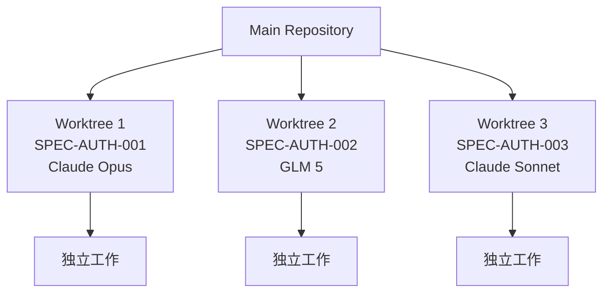
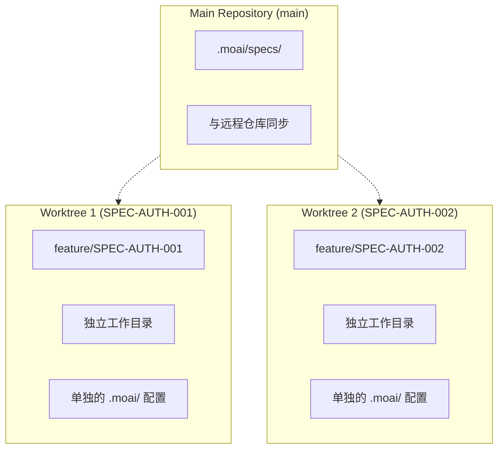
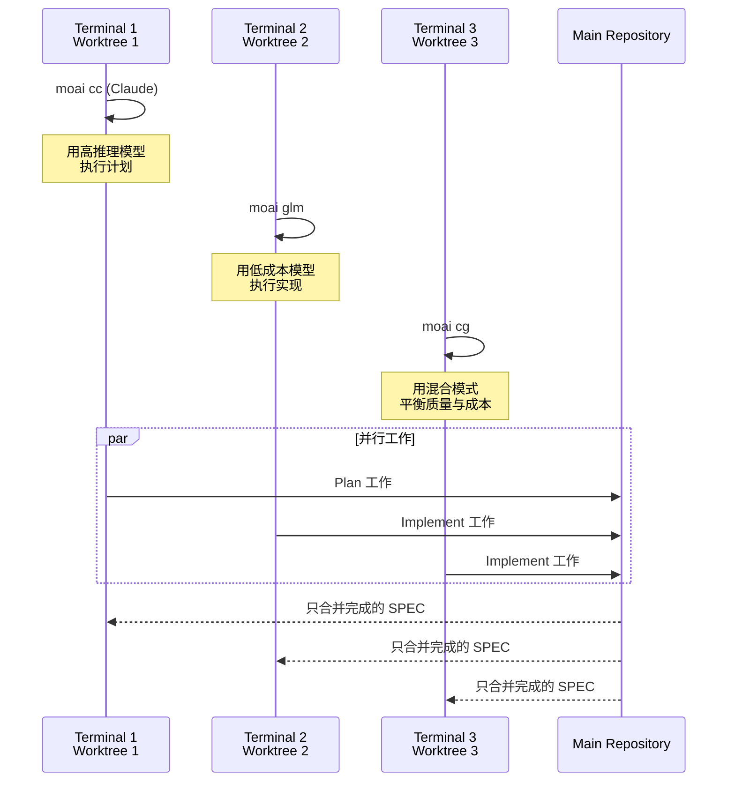
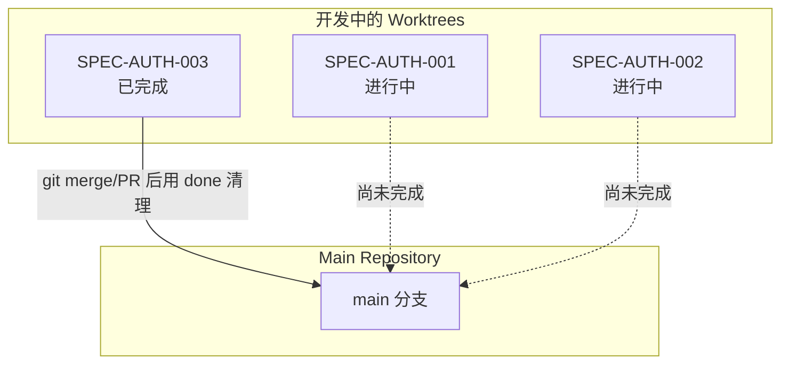

 <strong>所属价值</strong>:  智能体 Harness

<!-- @value: agentic-harness -->

Git Worktree 是 MoAI-ADK 并行开发的基石。它为每个 SPEC 创建完全独立的工作
空间，让不同的 Git 状态和不同的 LLM 配置可以同时运转。


平台层的背景说明见 [工作树](/zh/claude-code/agentic/worktrees)。本页是 MoAI-ADK 视角的说明。



从三大核心价值中 **智能体 Harness**（品质把控）的角度看，Worktree 是把每个
SPEC 的工作空间彻底切开的控制装置。智能体并行推进时不会覆盖彼此的工作，只有
完成的 SPEC 才会合并进 main。成本（代币经济学）方面的好处也随之而来：每个
worktree 都可以单独指定 LLM 运行模式，计划终端用高推理的 Claude 模型、实现
终端用低成本的 GLM，按阶段把模型分配下去。

## 为什么需要 Worktree？

### 问题：LLM 配置在会话之间共享

如果不使用 Worktree，用 `moai glm` 或 `moai cc` 切换 LLM 后端时，同一项目的
**所有已打开会话都会应用相同的配置**。结果是：

- **SPEC 之间相互干扰** —— 在一个 SPEC 中更改的 LLM 配置会影响其他 SPEC 的工作
- **无法并行开发** —— 无法以不同条件同时推进多个 SPEC
- **浪费 Token** —— 连简单的实现工作也全部跑在高成本模型上

### 解决方案：完全隔离

使用 Git Worktree 后，每个 SPEC 都拥有**独立的 Git 状态和 LLM 配置**：


```mermaid
graph TB
    A[Main Repository] --> B[Worktree 1<br/>SPEC-AUTH-001<br/>Claude Opus]
    A --> C[Worktree 2<br/>SPEC-AUTH-002<br/>GLM 5]
    A --> D[Worktree 3<br/>SPEC-AUTH-003<br/>Claude Sonnet]

    B --> E[独立工作]
    C --> F[独立工作]
    D --> G[独立工作]
```

## 核心工作流

### 三阶段开发流程

利用 Worktree 的 MoAI-ADK 开发按三个阶段推进：

```mermaid
flowchart TD
    subgraph Phase1["Phase 1: Plan (Terminal 1, 主检出)"]
        A1[/moai plan<br/>功能描述/] --> A2[生成 SPEC 文档]
        A2 --> A3[确定实现范围]
    end

    subgraph Phase2["Phase 2: Implement (Terminals 2, 3, 4...)"]
        B1["moai glm -w SPEC-AUTH-001"] --> B2[创建并进入 Worktree]
        B2 --> B3[/moai run SPEC-ID]
        B3 --> B4[/moai sync SPEC-ID]
    end

    subgraph Phase3["Phase 3: Merge & Cleanup"]
        C1[用 git merge 或 PR<br/>合并到 base] --> C2[moai worktree done 分支]
        C2 --> C3[移除 Worktree]
        C3 --> C4[可选: 删除分支]
    end

    Phase1 --> Phase2
    Phase2 --> Phase3
```

### 各阶段详解

#### 第 1 阶段：Plan (Terminal 1)

计划阶段的推理质量决定结果，因此用 Claude（Opus 级）模型撰写 SPEC 文档。这个
阶段就在主检出里进行：

```bash
> /moai plan "添加认证系统"
```

**产出物**：

- `.moai/specs/SPEC-AUTH-001/spec.md`
- 实现阶段要用的 SPEC ID

#### 第 2 阶段：Implement (Terminals 2, 3, 4...)

实现阶段虽然工作量大，但 SPEC 已经定好了方向，GLM 这类便宜的模型也足以胜任。
进入工作树交给启动器（`moai cc`、`moai glm`、`moai cg`）的 `-w` 标志。指定名称
的工作树不存在时，它会当场创建：

```bash
# 新终端：创建工作树并以 GLM 后端进入
$ moai glm -w SPEC-AUTH-001

# 在进入的会话中直接开始开发
> /moai run SPEC-AUTH-001
> /moai sync SPEC-AUTH-001
```

想保留当前会话再多开一个工作树，就加上 `--spawn`。它会在新的 tmux 窗口中启动，
原来的窗口原样保留：

```bash
$ moai glm -w SPEC-AUTH-002 --spawn
```

**优点**：

- 完全隔离的工作环境
- GLM 成本高效（节省幅度请参考 [CG 模式](/zh/multi-llm/cg-mode)）
- 无冲突的无限并行开发

#### 第 3 阶段：Cleanup

```bash
moai worktree done feature/SPEC-AUTH-001                    # worktree 清理（合并/推送通过 git 另行执行）
moai worktree done feature/SPEC-AUTH-001 --delete-branch    # 清理 + 删除本地分支
```

## Worktree 命令参考

**进入**工作树和**查看列表**都不是 `moai worktree` 的活儿。进入由启动器负责，
查询交给 git：

| 你想做的事              | 命令                            | 使用示例                               |
| ----------------------- | ------------------------------- | -------------------------------------- |
| 创建 Worktree 并进入    | `moai cc -w <名称>`             | `moai glm -w SPEC-AUTH-001`            |
| 保留会话，在新窗口中打开 | `moai cc -w <名称> --spawn` | `moai cg -w SPEC-AUTH-002 --spawn`     |
| 查看 Worktree 列表      | `git worktree list`             | `git worktree list`                    |

`moai worktree` 管理的是已经建好的工作树：

| 命令                          | 说明                            | 使用示例                               |
| ----------------------------- | ------------------------------- | -------------------------------------- |
| `moai worktree sync [分支]`   | 把 base 分支的变更带进来        | `moai worktree sync --strategy rebase` |
| `moai worktree done <分支>`   | 清理 Worktree（合并另行处理）   | `moai worktree done feature/SPEC-AUTH-001` |
| `moai worktree remove <路径>` | 按路径移除 Worktree             | `moai worktree remove ~/.moai/worktrees/your-project/SPEC-AUTH-001` |
| `moai worktree clean`         | 清理已合并/已废弃的 Worktree    | `moai worktree clean --merged-only`    |
| `moai worktree recover`       | 恢复 Worktree 注册表            | `moai worktree recover`                |
| `moai worktree snapshot`      | 捕获工作树状态                  | `moai worktree snapshot`               |
| `moai worktree verify`        | 对照快照检查当前状态            | `moai worktree verify --snapshot <路径>` |
| `moai worktree restore`       | 回退到快照 HEAD 状态            | `moai worktree restore --snapshot <路径>` |

## Worktree 的核心优势

### 1. 完全隔离 (Complete Isolation)

每个 SPEC 都维持独立的 Git 状态：


```mermaid
graph TB
    subgraph Main["Main Repository (main)"]
        M1[.moai/specs/]
        M2[与远程仓库同步]
    end

    subgraph WT1["Worktree 1 (SPEC-AUTH-001)"]
        W1A[feature/SPEC-AUTH-001]
        W1B[独立工作目录]
        W1C[单独的 .moai/ 配置]
    end

    subgraph WT2["Worktree 2 (SPEC-AUTH-002)"]
        W2A[feature/SPEC-AUTH-002]
        W2B[独立工作目录]
        W2C[单独的 .moai/ 配置]
    end

    Main -.-> WT1
    Main -.-> WT2
```

**优点**：

- 可以在每个 Worktree 中独立提交
- 分支之间没有冲突地开展工作
- 只有完成的 SPEC 才合并到 main

### 2. LLM 独立性 (LLM Independence)

每个 Worktree 维持各自独立的 LLM 运行模式。如下所示，三个终端分别以
`moai cc`（Claude 专用）、`moai glm`（GLM 专用）、`moai cg`（Claude 领队 +
GLM 工作者混合）不同方式运行，互不干扰：


```mermaid
sequenceDiagram
    participant T1 as Terminal 1<br/>Worktree 1
    participant T2 as Terminal 2<br/>Worktree 2
    participant T3 as Terminal 3<br/>Worktree 3
    participant Main as Main Repository

    T1->>T1: moai cc (Claude)
    Note over T1: 用高推理模型<br/>执行计划

    T2->>T2: moai glm
    Note over T2: 用低成本模型<br/>执行实现

    T3->>T3: moai cg
    Note over T3: 用混合模式<br/>平衡质量与成本

    par 并行工作
        T1->>Main: Plan 工作
        T2->>Main: Implement 工作
        T3->>Main: Implement 工作
    end

    Main-->>T1: 只合并完成的 SPEC
    Main-->>T2: 只合并完成的 SPEC
    Main-->>T3: 只合并完成的 SPEC
```

### 3. 无限并行开发 (Unlimited Parallel)

可以同时推进多个 SPEC：

```bash
# Terminal 1: 计划 SPEC-AUTH-001 (主检出)
> /moai plan "认证系统"

# Terminal 2: 实现 SPEC-AUTH-002 (GLM)
$ moai glm -w SPEC-AUTH-002
> /moai run SPEC-AUTH-002

# Terminal 3: 实现 SPEC-AUTH-003 (GLM)
$ moai glm -w SPEC-AUTH-003
> /moai run SPEC-AUTH-003

# Terminal 4: SPEC-AUTH-004 文档化 (Claude)
$ moai cc -w SPEC-AUTH-004
> /moai sync SPEC-AUTH-004
```

### 4. 安全合并 (Safe Merge)

只有完成的 SPEC 才会合并到 main 分支：


```mermaid
flowchart TB
    subgraph Development["开发中的 Worktrees"]
        D1[SPEC-AUTH-001<br/>进行中]
        D2[SPEC-AUTH-002<br/>进行中]
        D3[SPEC-AUTH-003<br/>已完成]
    end

    subgraph Main["Main Repository"]
        M[main 分支]
    end

    D3 -->|git merge/PR 后用 done 清理| M
    D1 -.->|尚未完成| M
    D2 -.->|尚未完成| M
```

## 并行开发可视化

下面是在多个终端同时工作的样子。每个 worktree 完全隔离，因此可以无冲突地并行
推进，这正是智能体 Harness 的核心。能按阶段分配合适的模型，则是随之而来的
代币经济学好处：

```mermaid
graph TB
    subgraph Terminal1["Terminal 1: Planning"]
        T1A[/moai plan/]
        T1B[Claude Opus<br/>高成本/高质量]
        T1C[生成 SPEC 文档]
    end

    subgraph Terminal2["Terminal 2: Implementing"]
        T2A["moai glm -w<br/>SPEC-AUTH-001"]
        T2B[低成本后端]
        T2C[/moai run<br/>DDD 实现]
    end

    subgraph Terminal3["Terminal 3: Implementing"]
        T3A["moai glm -w<br/>SPEC-AUTH-002"]
        T3B[低成本后端]
        T3C[/moai run<br/>DDD 实现]
    end

    subgraph Terminal4["Terminal 4: Documenting"]
        T4A["moai cc -w<br/>SPEC-AUTH-003"]
        T4B[Claude 后端]
        T4C[/moai sync<br/>文档化]
    end

    T1C --> T2A
    T1C --> T3A
    T1C --> T4A
```

## 下一步

- **[完整指南](/zh/worktree/guide)** —— 所有 Worktree 命令与详细用法
- **[实际使用示例](/zh/worktree/examples)** —— 真实项目中的使用案例
- **[常见问题](/zh/worktree/faq)** —— FAQ 与问题排查

## 相关文档

- [MoAI-ADK 文档](https://adk.mo.ai.kr)
- [SPEC 系统](/zh/core-concepts/spec-based-dev/)
- [DDD 工作流](/zh/core-concepts/ddd/)
