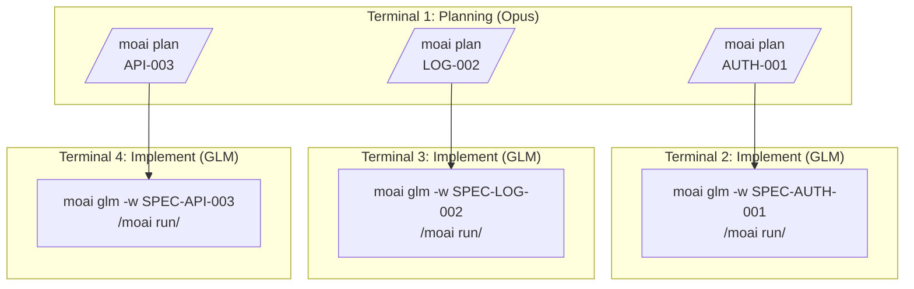
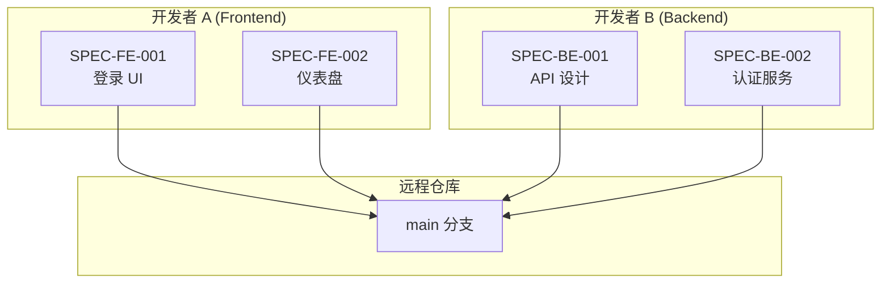
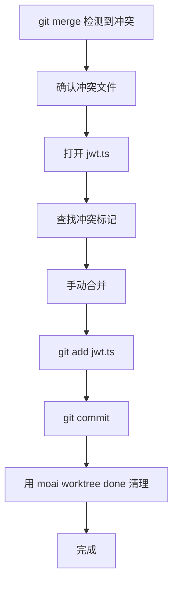
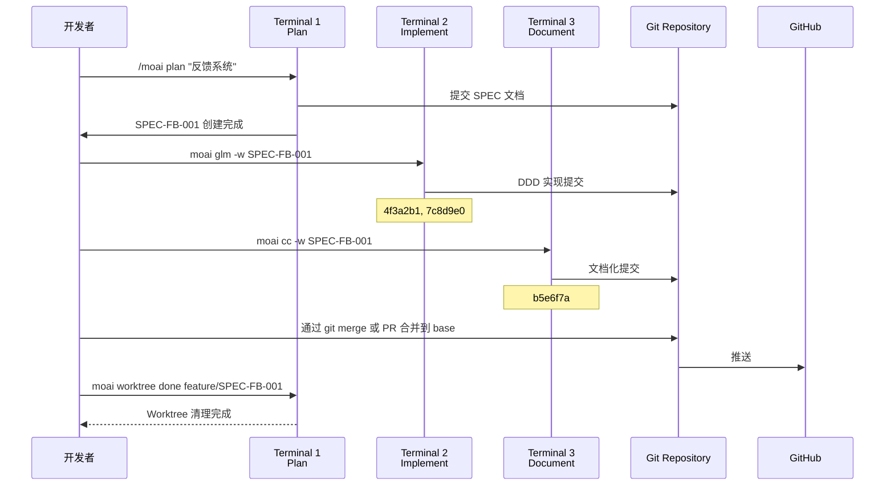

通过具体场景来看真实项目中如何运用 Git Worktree —— 从单一 SPEC 开发到并行
开发、团队协作与问题排查。每个场景都附带"哪个阶段用哪个模型"的成本判断。

## 目录

1. [单一 SPEC 开发](#单一-spec-开发)
2. [并行 SPEC 开发](#并行-spec-开发)
3. [团队协作场景](#团队协作场景)
4. [问题排查案例](#问题排查案例)

---

## 单一 SPEC 开发

### 场景: 实现用户认证系统

#### 第 1 步: SPEC 计划 (Terminal 1)

计划就在主检出里进行。

```bash
# 在项目根目录
$ cd /path/to/your-project

# 生成 SPEC 计划
> /moai plan "实现基于 JWT 的用户认证系统"

# 进度摘要 (示例)
正在分析 SPEC...
  - 将需求整理为 EARS 格式

生成 SPEC 文档:
  ✓ .moai/specs/SPEC-AUTH-001/spec.md
  ✓ .moai/specs/SPEC-AUTH-001/plan.md
  ✓ .moai/specs/SPEC-AUTH-001/acceptance.md

下一步:
  1. 在新终端运行: moai glm -w SPEC-AUTH-001
  2. 开始开发: /moai run SPEC-AUTH-001
```

#### 第 2 步: 进入 Worktree 并实现 (Terminal 2)

计划已经做完,实现阶段换到便宜的模型。创建工作树、进入、切换后端,这三件事在
启动器的一行里一起完成:

```bash
# 新终端: 工作树不存在就创建,并以 GLM 后端在其中启动会话
$ moai glm -w SPEC-AUTH-001

# 在进入的会话中开始 DDD 实现
> /moai run SPEC-AUTH-001

# 进度摘要 (示例)
Phase 1: ANALYZE
  ✓ 分析需求·现有代码

Phase 2: PRESERVE
  ✓ 生成特性化测试,确认现有行为得到保留

Phase 3: IMPROVE
  ✓ 实现 JWT 认证中间件
  ✓ 实现刷新令牌轮换
  ✓ 实现登出时令牌失效

实现完成 —— 已提交到 feature/SPEC-AUTH-001

下一步:
  1. 运行测试: 项目语言的测试命令 (例如: go test ./... / npm test / pytest)
  2. 文档化: /moai sync SPEC-AUTH-001
  3. 合并到 base (git merge/PR) 后清理: moai worktree done feature/SPEC-AUTH-001
```

#### 第 3 步: 文档化 (同一个 Terminal 2)

```bash
# 执行文档化
> /moai sync SPEC-AUTH-001

# 进度摘要 (示例)
正在同步文档...
  ✓ 更新代码地图·文档
  ✓ SPEC 状态转换并提交

文档化完成 —— 已提交到 feature/SPEC-AUTH-001
下一步: 合并到 base (git merge/PR) 后 moai worktree done feature/SPEC-AUTH-001
```

#### 第 4 步: 合并到 base 并清理 (Terminal 1)

`moai worktree done` 既不合并也不推送。到 base 分支的合并先用 `git merge` 或 PR
处理完,然后只清理 Worktree 就行。

```bash
# 回到项目根目录
$ cd /path/to/your-project

# 合并到 base 分支 (git 或 PR)
$ git checkout main
$ git merge feature/SPEC-AUTH-001
$ git push origin main

# 清理 Worktree + 删除分支
$ moai worktree done feature/SPEC-AUTH-001 --delete-branch

# 输出
✓ Done: worktree for branch feature/SPEC-AUTH-001
  Path: ~/.moai/worktrees/your-project/SPEC-AUTH-001
  Worktree removed.
  Branch feature/SPEC-AUTH-001 deleted.
```

---

## 并行 SPEC 开发

### 场景: 同时开发 3 个 SPEC

计划在一个终端用推理强的模型 (Opus) 集中做完,实现则换成 GLM 分散到三个终端:


```mermaid
graph TD
    subgraph T1["Terminal 1: Planning (Opus)"]
        P1[/moai plan<br/>AUTH-001/]
        P2[/moai plan<br/>LOG-002/]
        P3[/moai plan<br/>API-003/]
    end

    subgraph T2["Terminal 2: Implement (GLM)"]
        I1["moai glm -w SPEC-AUTH-001<br/>/moai run/"]
    end

    subgraph T3["Terminal 3: Implement (GLM)"]
        I2["moai glm -w SPEC-LOG-002<br/>/moai run/"]
    end

    subgraph T4["Terminal 4: Implement (GLM)"]
        I3["moai glm -w SPEC-API-003<br/>/moai run/"]
    end

    P1 --> I1
    P2 --> I2
    P3 --> I3
```

#### Terminal 1: 计划 (所有 SPEC)

```bash
# SPEC 1: 认证
> /moai plan "JWT 认证系统"
✓ SPEC-AUTH-001 创建完成

# SPEC 2: 日志
> /moai plan "结构化日志系统"
✓ SPEC-LOG-002 创建完成

# SPEC 3: API
> /moai plan "REST API v2"
✓ SPEC-API-003 创建完成
```

#### Terminal 2: 实现 AUTH-001

```bash
$ moai glm -w SPEC-AUTH-001
> /moai run SPEC-AUTH-001
# ... 实现进行中 ...
```

#### Terminal 3: 实现 LOG-002

```bash
$ moai glm -w SPEC-LOG-002
> /moai run SPEC-LOG-002
# ... 实现进行中 ...
```

#### Terminal 4: 实现 API-003

```bash
$ moai glm -w SPEC-API-003
> /moai run SPEC-API-003
# ... 实现进行中 ...
```

如果你在用 tmux,不必开四个终端,在一个窗口里用 `--spawn` 就能全部拉起来:

```bash
$ moai glm -w SPEC-AUTH-001 --spawn
$ moai glm -w SPEC-LOG-002 --spawn
$ moai glm -w SPEC-API-003 --spawn
```

#### 监控并行进度

工作树列表由 git 原样给出。

```bash
# 在 Terminal 1 确认已登记的 Worktree
$ git worktree list
/path/to/your-project                                      4f3a2b1 [main]
/path/to/your-project/.claude/worktrees/SPEC-AUTH-001      7c8d9e0 [feature/SPEC-AUTH-001]
/path/to/your-project/.claude/worktrees/SPEC-LOG-002       2a1b3c4 [feature/SPEC-LOG-002]
/path/to/your-project/.claude/worktrees/SPEC-API-003       9f8e7d6 [feature/SPEC-API-003]

# 确认特定 Worktree 的最近工作
$ git -C .claude/worktrees/SPEC-AUTH-001 log --oneline -5
```

---

## 团队协作场景

### 场景: 2 名开发者协作


```mermaid
graph TD
    subgraph Dev1["开发者 A (Frontend)"]
        F1[SPEC-FE-001<br/>登录 UI]
        F2[SPEC-FE-002<br/>仪表盘]
    end

    subgraph Dev2["开发者 B (Backend)"]
        B1[SPEC-BE-001<br/>API 设计]
        B2[SPEC-BE-002<br/>认证服务]
    end

    subgraph Remote["远程仓库"]
        R[main 分支]
    end

    F1 --> R
    F2 --> R
    B1 --> R
    B2 --> R
```

#### 开发者 A: Frontend 开发

```bash
# 在开发者 A 的机器上
git clone https://github.com/team/project.git
cd project

# 创建 Frontend SPEC
> /moai plan "登录 UI 组件"
✓ SPEC-FE-001 创建

# 在 Worktree 中开发
$ moai glm -w SPEC-FE-001
> /moai run SPEC-FE-001

# 实现完成后推送分支 + 创建 PR (git/gh)
$ git push -u origin feature/SPEC-FE-001
$ gh pr create --fill

# PR 合并后清理 Worktree
$ moai worktree done feature/SPEC-FE-001 --delete-branch
```

#### 开发者 B: Backend 开发

```bash
# 在开发者 B 的机器上
git clone https://github.com/team/project.git
cd project

# 创建 Backend SPEC
> /moai plan "认证 API 服务"
✓ SPEC-BE-001 创建

# 在 Worktree 中开发
$ moai glm -w SPEC-BE-001
> /moai run SPEC-BE-001

# 实现完成后推送分支 + 创建 PR (git/gh)
$ git push -u origin feature/SPEC-BE-001
$ gh pr create --fill

# PR 合并后清理 Worktree
$ moai worktree done feature/SPEC-BE-001 --delete-branch
```

#### PR 合并与集成

```bash
# 在团队负责人或 CI 系统上
gh pr list
# FE-001  Login UI Component          Ready
# BE-001  Authentication API Service  Ready

# 合并 PR
gh pr merge FE-001 --merge
gh pr merge BE-001 --merge

# 所有开发者保持最新状态
git pull origin main
```

---

## 问题排查案例

### 案例 1: 解决合并冲突

合并发生在 `git merge` 或 PR 中,因此冲突也在那个阶段产生。Worktree CLI
不参与合并。

```bash
$ git checkout main
$ git merge feature/SPEC-AUTH-001

# 输出
✗ 发生合并冲突!
冲突文件:
  - src/auth/jwt.ts
  - tests/auth.test.ts
```

**解决过程**:


```mermaid
flowchart TD
    A[git merge 检测到冲突] --> B[确认冲突文件]
    B --> C[打开 jwt.ts]
    C --> D[查找冲突标记]
    D --> E[手动合并]
    E --> F[git add jwt.ts]
    F --> G[git commit]
    G --> H[用 moai worktree done 清理]
    H --> I[完成]
```

```bash
# 解决冲突
code src/auth/jwt.ts

# 确认冲突标记
<<<<<<< HEAD
const secret = process.env.JWT_SECRET;
=======
const secret = config.jwt.secret;
>>>>>>> feature/SPEC-AUTH-001

# 手动合并
const secret = process.env.JWT_SECRET || config.jwt.secret;

# staging 后提交
git add src/auth/jwt.ts
git commit -m "fix: resolve merge conflict in JWT config"
git push origin main

# 合并结束后清理 Worktree
moai worktree done feature/SPEC-AUTH-001 --delete-branch
✓ 完成!
```

### 案例 2: 恢复损坏的 Worktree 注册表

目录被手动移动或删除,git 因此找不到工作树的状态。

```bash
# 1. 恢复注册表 —— repair 后 prune stale 引用,并打印识别到的列表
$ moai worktree recover
Scanning for worktrees in /path/to/your-project...
Recovered 2 worktree(s):
  /path/to/your-project/.claude/worktrees/SPEC-AUTH-001  [feature/SPEC-AUTH-001]
  /path/to/your-project/.claude/worktrees/SPEC-LOG-002   [feature/SPEC-LOG-002]

# 2. 仍然残留的损坏条目,指定路径移除
$ moai worktree remove ~/.moai/worktrees/your-project/SPEC-AUTH-001 --force

# 3. 重新创建并进入
$ moai glm -w SPEC-AUTH-001
```

### 案例 3: 清理占用磁盘的 Worktree

```bash
$ df -h
Filesystem      Size  Used Avail Use%
/dev/disk1     500G  480G   20G  96%

# 1. 清理已合并进 base 的 Worktree
$ moai worktree clean --merged-only
  Removing merged worktree: .claude/worktrees/SPEC-LOG-002 [feature/SPEC-LOG-002]
Removed 1 merged worktree(s).

# 2. 确认虽未合并但什么都没剩下的废弃 Worktree (预览)
$ moai worktree clean --stale
  Keeping .claude/worktrees/SPEC-API-003 [feature/SPEC-API-003]: uncommitted or untracked changes

Would remove 1 stale worktree(s):
  .claude/worktrees/SPEC-TMP-009 [feature/SPEC-TMP-009]

This was a preview. Re-run with --yes to remove them.

# 3. 清单确认过后真正移除 (分支原样保留)
$ moai worktree clean --stale --yes
  Removing stale worktree: .claude/worktrees/SPEC-TMP-009 [feature/SPEC-TMP-009]
Removed 1 stale worktree(s). Branches were left intact.
```

---

## 真实项目工作流

### 完整开发周期示例


```mermaid
sequenceDiagram
    participant Dev as 开发者
    participant T1 as Terminal 1<br/>Plan
    participant T2 as Terminal 2<br/>Implement
    participant T3 as Terminal 3<br/>Document
    participant Git as Git Repository
    participant Remote as GitHub

    Dev->>T1: /moai plan "反馈系统"
    T1->>Git: 提交 SPEC 文档
    T1->>Dev: SPEC-FB-001 创建完成

    Dev->>T2: moai glm -w SPEC-FB-001
    T2->>Git: DDD 实现提交
    Note over T2: 4f3a2b1, 7c8d9e0

    Dev->>T3: moai cc -w SPEC-FB-001
    T3->>Git: 文档化提交
    Note over T3: b5e6f7a

    Dev->>Git: 通过 git merge 或 PR 合并到 base
    Git->>Remote: 推送
    Dev->>T1: moai worktree done feature/SPEC-FB-001
    T1-->>Dev: Worktree 清理完成
```

---

## 成功案例

### 案例: 在初创公司的应用

```bash
# 情况: 需要同时开发 3 个功能
# 开发者: 2 名

# 1) 计划所有 SPEC (主检出)
> /moai plan "用户管理"
> /moai plan "支付系统"
> /moai plan "通知系统"

# 2) 并行实现 —— 在一个 tmux 窗口里拉起三个会话
$ moai glm -w SPEC-USER-001 --spawn
$ moai glm -w SPEC-PAY-001 --spawn
$ moai glm -w SPEC-NOTIF-001 --spawn

# 3) 文档化 —— 在各 Worktree 会话中执行 /moai sync

# 4) 合并到 base (git merge/PR) 后清理 Worktree
$ moai worktree done feature/SPEC-USER-001 --delete-branch
$ moai worktree done feature/SPEC-PAY-001 --delete-branch
$ moai worktree done feature/SPEC-NOTIF-001 --delete-branch

# 结果
# - 3 个功能全部完成
# - 并行开发缩短了开发流程
# - 使用 GLM 节省成本
```

把实现阶段的会话交给 GLM 后，成本明显下降。节省幅度及其依据整理在 [CG 模式](/zh/multi-llm/cg-mode)中。

---

## 技巧与窍门

### 技巧 1: tmux 窗口管理交给 --spawn

`--spawn` 会在新的 tmux 窗口中重新执行同一条命令,并输出可供切换的 pane ID。
焦点仍然留在当前窗口。

```bash
$ moai glm -w SPEC-USER-001 --spawn
Spawned pane %7 running `moai glm -w SPEC-USER-001` in /path/to/your-project
Switch to it with: tmux select-window -t %7
```

在 tmux 之外使用 `--spawn` 时,它什么都不改动,直接以错误结束。这时请去掉标志,
在当前终端里运行。

### 技巧 2: 跟踪进度

```bash
# 所有 Worktree 列表
git worktree list

# 扫一遍各 Worktree 的最近提交
for wt in .claude/worktrees/*/; do
    echo "=== $wt ==="
    git -C "$wt" log --oneline -5
    echo ""
done
```

### 技巧 3: 清理例行脚本

```bash
#!/bin/bash
# clean-worktrees.sh —— 定期运行的清理例行程序

# 移除已合并的 Worktree
moai worktree clean --merged-only

# 废弃的 Worktree 先用预览确认 (不会自动删除)
moai worktree clean --stale

echo "确认过清理对象之后,请加上 --yes 重新运行。"
```

## 相关文档

- [Git Worktree 概述](/zh/worktree/)
- [完整指南](/zh/worktree/guide)
- [常见问题](/zh/worktree/faq)
