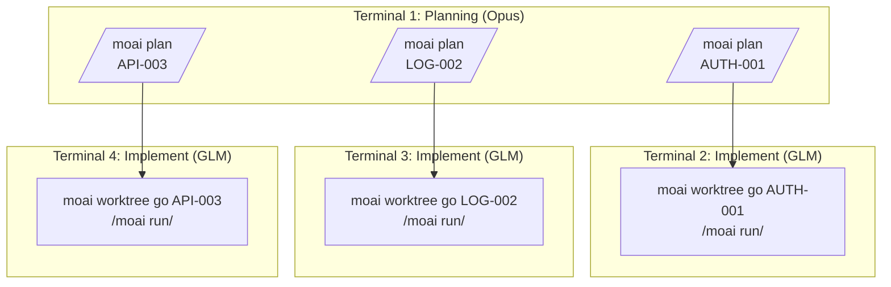
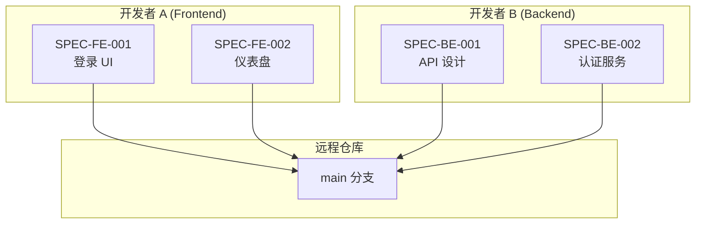
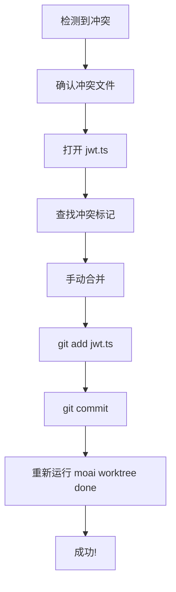
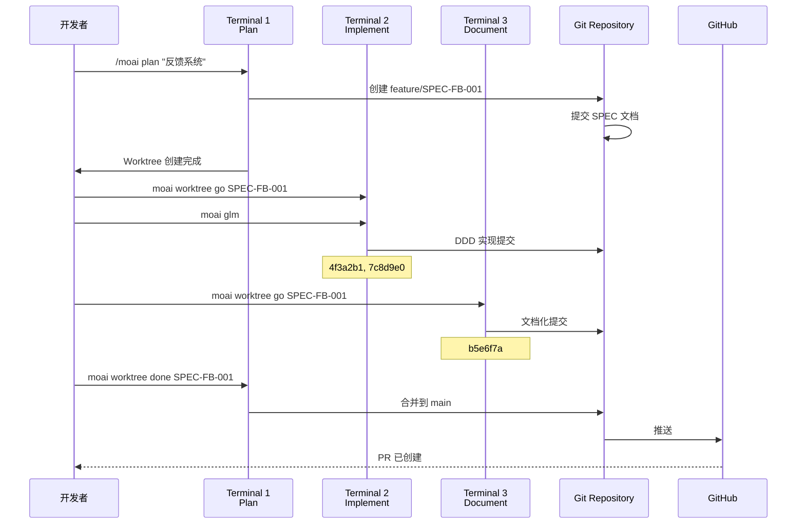

通过具体场景来看 Git Worktree 在真实项目中如何运转 —— 从单一 SPEC 开发到
并行开发、团队协作与问题排查。每个场景都附带"哪个阶段用哪个模型"的
托克诺米克斯判断。

## 目录

1. [单一 SPEC 开发](#单一-spec-开发)
2. [并行 SPEC 开发](#并行-spec-开发)
3. [团队协作场景](#团队协作场景)
4. [问题排查案例](#问题排查案例)

---

## 单一 SPEC 开发

### 场景：实现用户认证系统

#### 第 1 步：SPEC 计划 (Terminal 1)

```bash
# 在项目根目录
$ cd /path/to/your-project

# 生成 SPEC 计划
> /moai plan "实现基于 JWT 的用户认证系统" --worktree

# 输出
✓ MoAI-ADK SPEC Manager v2.0
━━━━━━━━━━━━━━━━━━━━━━━━━━━━━━━━━━━━━━━━━━

分析 SPEC 中...
  - 功能需求: 发现 8 个
  - 技术需求: 发现 5 个
  - API 端点: 识别 6 个

生成 SPEC 文档中...
  ✓ .moai/specs/SPEC-AUTH-001/spec.md
  ✓ .moai/specs/SPEC-AUTH-001/requirements.md
  ✓ .moai/specs/SPEC-AUTH-001/api-design.md

创建 Worktree 中...
  ✓ 创建分支: feature/SPEC-AUTH-001
  ✓ 创建 Worktree: /path/to/your-project/.moai/worktrees/SPEC-AUTH-001
  ✓ 分支切换完成

━━━━━━━━━━━━━━━━━━━━━━━━━━━━━━━━━━━━━━━━━━
下一步:
  1. 在新终端运行: moai worktree go SPEC-AUTH-001
  2. 切换 LLM: moai glm
  3. 启动 Claude: claude
  4. 开始开发: /moai run SPEC-AUTH-001

省钱提示: 实现阶段用 'moai glm' 可节省 70% 成本!
━━━━━━━━━━━━━━━━━━━━━━━━━━━━━━━━━━━━━━━━━━
```

#### 第 2 步：进入 Worktree 并实现 (Terminal 2)

计划已完成，实现切换到低成本模型：

```bash
# 打开新终端
$ moai worktree go SPEC-AUTH-001

# 打开新终端并移动到 Worktree
# 提示符发生变化
(SPEC-AUTH-001) ~/moai-project/.moai/worktrees/SPEC-AUTH-001

# 将 LLM 切换为低成本模型
(SPEC-AUTH-001) $ moai glm
✓ LLM 切换: GLM 5 (节省 70% 成本)

# 启动 Claude Code
(SPEC-AUTH-001) $ claude
Claude Code v1.0.0
Type 'help' for available commands

# 开始 DDD 实现
> /moai run SPEC-AUTH-001

# 输出
✓ MoAI-ADK DDD Executor v2.0
━━━━━━━━━━━━━━━━━━━━━━━━━━━━━━━━━━━━━━━━━━

Phase 1: ANALYZE
  ✓ 需求分析完成
  ✓ 现有代码分析完成
  ✓ 测试覆盖率: 目标 85%

Phase 2: PRESERVE
  ✓ 生成 12 个特征化测试
  ✓ 确认现有行为已保留

Phase 3: IMPROVE
  ✓ 实现 JWT 认证中间件
  ✓ 实现刷新令牌轮换
  ✓ 实现登出令牌失效

━━━━━━━━━━━━━━━━━━━━━━━━━━━━━━━━━━━━━━━━━━
实现完成!
  - 提交: 4f3a2b1 (feat: JWT authentication middleware)
  - 提交: 7c8d9e0 (feat: refresh token rotation)
  - 提交: 2a1b3c4 (feat: token invalidation on logout)

下一步:
  1. 运行测试: pytest tests/auth/
  2. 文档化: /moai sync SPEC-AUTH-001
  3. 完成: moai worktree done SPEC-AUTH-001
━━━━━━━━━━━━━━━━━━━━━━━━━━━━━━━━━━━━━━━━━━
```

#### 第 3 步：文档化（同一 Terminal 2）

```bash
# 运行文档化
> /moai sync SPEC-AUTH-001

# 输出
✓ MoAI-ADK Documentation Generator v2.0
━━━━━━━━━━━━━━━━━━━━━━━━━━━━━━━━━━━━━━━━━━

生成文档中...
  ✓ API 文档: docs/api/auth.md
  ✓ 架构图: docs/diagrams/auth-flow.mmd
  ✓ 用户指南: docs/guides/authentication.md

提交完成:
  ✓ b5e6f7a (docs: authentication documentation)

━━━━━━━━━━━━━━━━━━━━━━━━━━━━━━━━━━━━━━━━━━
文档化完成!
下一步: moai worktree done SPEC-AUTH-001 --push
━━━━━━━━━━━━━━━━━━━━━━━━━━━━━━━━━━━━━━━━━━
```

#### 第 4 步：完成与合并 (Terminal 1)

```bash
# 回到项目根目录
$ cd /path/to/your-project

# 完成 Worktree
$ moai worktree done SPEC-AUTH-001 --push

# 输出
✓ MoAI-ADK Worktree Manager v2.0
━━━━━━━━━━━━━━━━━━━━━━━━━━━━━━━━━━━━━━━━━━

正在完成 Worktree: SPEC-AUTH-001

1. 切换到 main 分支...
   ✓ Switched to branch 'main'

2. 合并 feature 分支...
   ✓ Merge 'feature/SPEC-AUTH-001' into main

3. 推送到远程仓库...
   ✓ github.com:username/repo.git
   ✓ Branch 'main' set up to track remote branch 'main'

4. 清理 Worktree...
   ✓ 移除 Worktree: .moai/worktrees/SPEC-AUTH-001
   ✓ 移除分支: feature/SPEC-AUTH-001

━━━━━━━━━━━━━━━━━━━━━━━━━━━━━━━━━━━━━━━━━━
✓ SPEC-AUTH-001 完成!

总计提交: 4 个
  - 2e9b4c3 docs: authentication documentation
  - 7c8d9e0 feat: refresh token rotation
  - 4f3a2b1 feat: JWT authentication middleware
  - b5e6f7a feat: token invalidation on logout

━━━━━━━━━━━━━━━━━━━━━━━━━━━━━━━━━━━━━━━━━━
```

---

## 并行 SPEC 开发

### 场景：同时开发 3 个 SPEC

计划集中在一个终端由高推理模型 (Opus) 完成，实现则切换为 GLM 分散到三个
终端：


```mermaid
graph TB
    subgraph T1["Terminal 1: Planning (Opus)"]
        P1[/moai plan<br/>AUTH-001/]
        P2[/moai plan<br/>LOG-002/]
        P3[/moai plan<br/>API-003/]
    end

    subgraph T2["Terminal 2: Implement (GLM)"]
        I1[moai worktree go AUTH-001<br/>/moai run/]
    end

    subgraph T3["Terminal 3: Implement (GLM)"]
        I2[moai worktree go LOG-002<br/>/moai run/]
    end

    subgraph T4["Terminal 4: Implement (GLM)"]
        I3[moai worktree go API-003<br/>/moai run/]
    end

    P1 --> I1
    P2 --> I2
    P3 --> I3
```

#### Terminal 1: 计划（所有 SPEC）

```bash
# SPEC 1: 认证
> /moai plan "JWT 认证系统" --worktree
✓ SPEC-AUTH-001 创建完成

# SPEC 2: 日志
> /moai plan "结构化日志系统" --worktree
✓ SPEC-LOG-002 创建完成

# SPEC 3: API
> /moai plan "REST API v2" --worktree
✓ SPEC-API-003 创建完成

# 查看 Worktree
moai worktree list
SPEC-AUTH-001  feature/SPEC-AUTH-001  /path/to/SPEC-AUTH-001
SPEC-LOG-002   feature/SPEC-LOG-002   /path/to/SPEC-LOG-002
SPEC-API-003   feature/SPEC-API-003   /path/to/SPEC-API-003
```

#### Terminal 2: 实现 AUTH-001

```bash
$ moai worktree go SPEC-AUTH-001
(SPEC-AUTH-001) $ moai glm
(SPEC-AUTH-001) $ claude
> /moai run SPEC-AUTH-001
# ... 实现进行中 ...
```

#### Terminal 3: 实现 LOG-002

```bash
$ moai worktree go SPEC-LOG-002
(SPEC-LOG-002) $ moai glm
(SPEC-LOG-002) $ claude
> /moai run SPEC-LOG-002
# ... 实现进行中 ...
```

#### Terminal 4: 实现 API-003

```bash
$ moai worktree go SPEC-API-003
(SPEC-API-003) $ moai glm
(SPEC-API-003) $ claude
> /moai run SPEC-API-003
# ... 实现进行中 ...
```

#### 监控并行进度

```bash
# 在 Terminal 1 查看所有 Worktree 状态
$ moai worktree status --verbose

Worktree: SPEC-AUTH-001
Branch: feature/SPEC-AUTH-001
Status: 3 commits ahead of main
LLM: GLM 5
Last activity: 5 minutes ago

Worktree: SPEC-LOG-002
Branch: feature/SPEC-LOG-002
Status: 2 commits ahead of main
LLM: GLM 5
Last activity: 3 minutes ago

Worktree: SPEC-API-003
Branch: feature/SPEC-API-003
Status: 4 commits ahead of main
LLM: GLM 5
Last activity: 7 minutes ago
```

---

## 团队协作场景

### 场景：2 名开发者协作


```mermaid
graph TB
    subgraph Dev1["开发者 A (Frontend)"]
        F1[SPEC-FE-001<br/>登录 UI]
        F2[SPEC-FE-002<br/>仪表盘]
    end

    subgraph Dev2["开发者 B (Backend)"]
        B1[SPEC-BE-001<br/>API 设计]
        B2[SPEC-BE-002<br/>认证服务]
    end

    subgraph Remote["远程仓库"]
        R[main 分支]
    end

    F1 --> R
    F2 --> R
    B1 --> R
    B2 --> R
```

#### 开发者 A：Frontend 开发

```bash
# 在开发者 A 的机器上
git clone https://github.com/team/project.git
cd project

# 创建 Frontend SPEC
> /moai plan "登录 UI 组件" --worktree
✓ SPEC-FE-001 创建

# 在 Worktree 中开发
moai worktree go SPEC-FE-001
(SPEC-FE-001) $ moai glm
(SPEC-FE-001) $ claude
> /moai run SPEC-FE-001

# 实现完成后推送到远程
(SPEC-FE-001) $ exit
moai worktree done SPEC-FE-001 --push
✓ 完成并创建了 PR
```

#### 开发者 B：Backend 开发

```bash
# 在开发者 B 的机器上
git clone https://github.com/team/project.git
cd project

# 创建 Backend SPEC
> /moai plan "认证 API 服务" --worktree
✓ SPEC-BE-001 创建

# 在 Worktree 中开发
moai worktree go SPEC-BE-001
(SPEC-BE-001) $ moai glm
(SPEC-BE-001) $ claude
> /moai run SPEC-BE-001

# 实现完成后推送到远程
(SPEC-BE-001) $ exit
moai worktree done SPEC-BE-001 --push
✓ 完成并创建了 PR
```

#### PR 合并与集成

```bash
# 在团队负责人或 CI 系统中
gh pr list
# FE-001  Login UI Component          Ready
# BE-001  Authentication API Service  Ready

# 合并 PR
gh pr merge FE-001 --merge
gh pr merge BE-001 --merge

# 所有开发者保持最新状态
git pull origin main
```

---

## 问题排查案例

### 案例 1：解决合并冲突

```bash
$ moai worktree done SPEC-AUTH-001 --push

# 输出
✗ 发生合并冲突!
冲突文件:
  - src/auth/jwt.ts
  - tests/auth.test.ts

解决步骤:
1. 编辑冲突文件并解决
2. git add <文件>
3. git commit
4. 重新运行 moai worktree done SPEC-AUTH-001 --push
```

**解决过程**：


```mermaid
flowchart TD
    A[检测到冲突] --> B[确认冲突文件]
    B --> C[打开 jwt.ts]
    C --> D[查找冲突标记]
    D --> E[手动合并]
    E --> F[git add jwt.ts]
    F --> G[git commit]
    G --> H[重新运行 moai worktree done]
    H --> I[成功!]
```

```bash
# 解决冲突
cd .moai/worktrees/SPEC-AUTH-001
code src/auth/jwt.ts

# 确认冲突标记
<<<<<<< HEAD
const secret = process.env.JWT_SECRET;
=======
const secret = config.jwt.secret;
>>>>>>> feature/SPEC-AUTH-001

# 手动合并
const secret = process.env.JWT_SECRET || config.jwt.secret;

# staging 后提交
git add src/auth/jwt.ts
git commit -m "fix: resolve merge conflict in JWT config"

# 重试完成
cd /path/to/your-project
moai worktree done SPEC-AUTH-001 --push
✓ 完成!
```

### 案例 2：修复损坏的 Worktree

```bash
$ moai worktree go SPEC-AUTH-001
✗ Worktree 已损坏。

# 诊断
$ moai worktree status SPEC-AUTH-001
✗ Worktree 目录不存在

# 修复
$ moai worktree remove SPEC-AUTH-001 --force
✓ 移除现有 Worktree

$ moai worktree new SPEC-AUTH-001
✓ Worktree 重建完成
```

### 案例 3：磁盘空间不足

```bash
$ df -h
Filesystem      Size  Used Avail Use%
/dev/disk1     500G  480G   20G  96%

# 清理旧的 Worktree
$ moai worktree clean --older-than 14

# 将被清理的 Worktree:
  - SPEC-OLD-001 (30 天前)
  - SPEC-OLD-002 (45 天前)
  - SPEC-OLD-003 (60 天前)

是否继续? [y/N] y

✓ 清理 3 个 Worktree 完成
✓ 释放 12GB 磁盘空间
```

---

## 真实项目工作流

### 完整开发周期示例


```mermaid
sequenceDiagram
    participant Dev as 开发者
    participant T1 as Terminal 1<br/>Plan
    participant T2 as Terminal 2<br/>Implement
    participant T3 as Terminal 3<br/>Document
    participant Git as Git Repository
    participant Remote as GitHub

    Dev->>T1: /moai plan "反馈系统"
    T1->>Git: 创建 feature/SPEC-FB-001
    Git->>Git: 提交 SPEC 文档
    T1->>Dev: Worktree 创建完成

    Dev->>T2: moai worktree go SPEC-FB-001
    Dev->>T2: moai glm
    T2->>Git: DDD 实现提交
    Note over T2: 4f3a2b1, 7c8d9e0

    Dev->>T3: moai worktree go SPEC-FB-001
    T3->>Git: 文档化提交
    Note over T3: b5e6f7a

    Dev->>T1: moai worktree done SPEC-FB-001
    T1->>Git: 合并到 main
    Git->>Remote: 推送
    Remote-->>Dev: PR 已创建
```

---

## 成功案例

### 案例：在初创公司的应用

```bash
# 情况: 需要同时开发 3 个功能
# 时间: 1 周
# 开发者: 2 名

# 第 1 天: 计划所有 SPEC
> /moai plan "用户管理" --worktree
> /moai plan "支付系统" --worktree
> /moai plan "通知系统" --worktree

# 第 2-4 天: 并行实现
# Terminal 1: 用户管理
$ moai worktree go SPEC-USER-001 && moai glm
# Terminal 2: 支付系统
$ moai worktree go SPEC-PAY-001 && moai glm
# Terminal 3: 通知系统
$ moai worktree go SPEC-NOTIF-001 && moai glm

# 第 5-6 天: 文档化与测试
# 在各 Worktree 中运行 /moai sync

# 第 7 天: 合并
$ moai worktree done SPEC-USER-001 --push
$ moai worktree done SPEC-PAY-001 --push
$ moai worktree done SPEC-NOTIF-001 --push

# 结果
# - 3 个功能全部完成
# - 并行开发缩短 66% 时间
# - 使用 GLM 节省 70% 成本
```

---

## 技巧与窍门

### 技巧 1：终端管理

```bash
# 使用 tmux 管理会话
tmux new-session -d -s spec-user 'moai worktree go SPEC-USER-001'
tmux new-session -d -s spec-pay 'moai worktree go SPEC-PAY-001'

# 会话列表
tmux ls
spec-user: 1 windows
spec-pay: 1 windows

# 切换会话
tmux attach-session -t spec-user
```

### 技巧 2：跟踪进度

```bash
# 所有 Worktree 的进度
for spec in $(moai worktree list --porcelain | awk '{print $1}'); do
    echo "=== $spec ==="
    cd ~/.moai/worktrees/$spec
    git log --oneline -5
    echo ""
done
```

### 技巧 3：自动化脚本

```bash
#!/bin/bash
# auto-workflow.sh

SPEC_ID=$1

echo "1. 生成 SPEC 计划..."
> /moai plan "$2" --worktree

echo "2. 进入 Worktree..."
moai worktree go $SPEC_ID

echo "3. 切换 LLM..."
moai glm

echo "4. 启动 Claude..."
claude

# 用法
# ./auto-workflow.sh SPEC-AUTH-001 "认证系统"
```

## 相关文档

- [Git Worktree 概述](/zh/worktree/)
- [完整指南](/zh/worktree/guide)
- [常见问题](/zh/worktree/faq)
