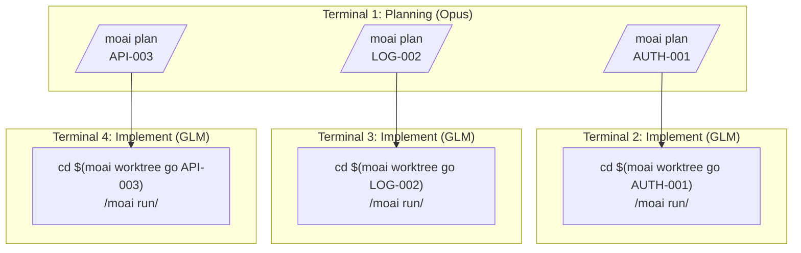
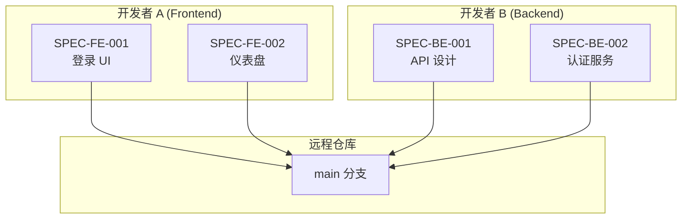
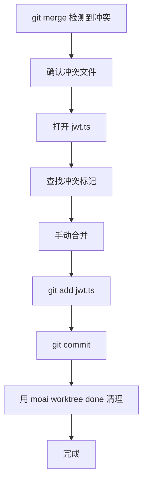
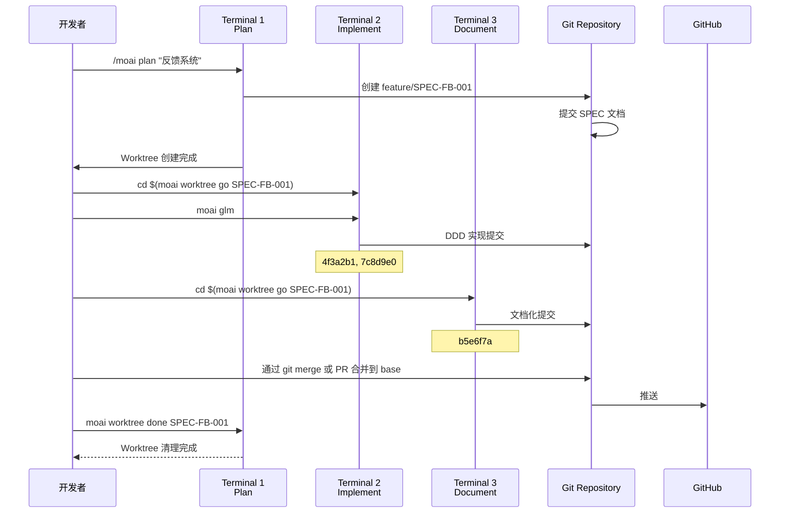

通过具体场景来看真实项目中如何运用 Git Worktree —— 从单一 SPEC 开发到并行
开发、团队协作与问题排查。每个场景都附带"哪个阶段用哪个模型"的代币经济学
判断。

## 目录

1. [单一 SPEC 开发](#单一-spec-开发)
2. [并行 SPEC 开发](#并行-spec-开发)
3. [团队协作场景](#团队协作场景)
4. [问题排查案例](#问题排查案例)

---

## 单一 SPEC 开发

### 场景: 实现用户认证系统

#### 第 1 步: SPEC 计划 (Terminal 1)

```bash
# 在项目根目录
$ cd /path/to/your-project

# 生成 SPEC 计划
> /moai plan "实现基于 JWT 的用户认证系统" --worktree

# 进度摘要 (示例)
正在分析 SPEC...
  - 将需求整理为 EARS 格式

生成 SPEC 文档:
  ✓ .moai/specs/SPEC-AUTH-001/spec.md
  ✓ .moai/specs/SPEC-AUTH-001/plan.md
  ✓ .moai/specs/SPEC-AUTH-001/acceptance.md

创建 Worktree:
  ✓ 创建分支: feature/SPEC-AUTH-001
  ✓ 创建 Worktree: ~/.moai/worktrees/your-project/SPEC-AUTH-001
  ✓ 分支切换完成

下一步:
  1. 在新终端移动: cd "$(moai worktree go SPEC-AUTH-001)"
  2. 更换 LLM: moai glm
  3. 开始开发: /moai run SPEC-AUTH-001
```

#### 第 2 步: 进入 Worktree 并实现 (Terminal 2)

计划已完成,实现阶段切换到低成本模型:

```bash
# 在新终端移动到 Worktree (moai worktree go 会输出路径)
$ cd "$(moai worktree go SPEC-AUTH-001)"
$ pwd
/Users/you/.moai/worktrees/your-project/SPEC-AUTH-001

# 把 LLM 换成低成本模型
$ moai glm

# 启动 Claude Code
$ claude

# 开始 DDD 实现
> /moai run SPEC-AUTH-001

# 进度摘要 (示例)
Phase 1: ANALYZE
  ✓ 分析需求·现有代码

Phase 2: PRESERVE
  ✓ 生成特性化测试,确认现有行为得到保留

Phase 3: IMPROVE
  ✓ 实现 JWT 认证中间件
  ✓ 实现刷新令牌轮换
  ✓ 实现登出时令牌失效

实现完成 —— 已提交到 feature/SPEC-AUTH-001

下一步:
  1. 运行测试: 项目语言的测试命令 (例如: go test ./... / npm test / pytest)
  2. 文档化: /moai sync SPEC-AUTH-001
  3. 合并到 base (git merge/PR) 后清理: moai worktree done SPEC-AUTH-001
```

#### 第 3 步: 文档化 (同一个 Terminal 2)

```bash
# 执行文档化
> /moai sync SPEC-AUTH-001

# 进度摘要 (示例)
正在同步文档...
  ✓ 更新代码地图·文档
  ✓ SPEC 状态转换并提交

文档化完成 —— 已提交到 feature/SPEC-AUTH-001
下一步: 合并到 base (git merge/PR) 后 moai worktree done SPEC-AUTH-001
```

#### 第 4 步: 合并到 base 并清理 (Terminal 1)

`moai worktree done` 不会执行合并、推送。到 base 分支的合并先用
`git merge` 或 PR 处理,然后只清理 Worktree。

```bash
# 回到项目根目录
$ cd /path/to/your-project

# 合并到 base 分支 (git 或 PR)
$ git checkout main
$ git merge feature/SPEC-AUTH-001
$ git push origin main

# 清理 Worktree + 删除分支
$ moai worktree done SPEC-AUTH-001 --delete-branch

# 输出
✓ Done: worktree for branch feature/SPEC-AUTH-001
  Path: ~/.moai/worktrees/your-project/SPEC-AUTH-001
  Worktree removed.
  Branch feature/SPEC-AUTH-001 deleted.
```

---

## 并行 SPEC 开发

### 场景: 同时开发 3 个 SPEC

计划在一个终端用高推理模型 (Opus) 集中处理,实现则换成 GLM 分散到三个终端:


```mermaid
graph TB
    subgraph T1["Terminal 1: Planning (Opus)"]
        P1[/moai plan<br/>AUTH-001/]
        P2[/moai plan<br/>LOG-002/]
        P3[/moai plan<br/>API-003/]
    end

    subgraph T2["Terminal 2: Implement (GLM)"]
        I1["cd $(moai worktree go AUTH-001)<br/>/moai run/"]
    end

    subgraph T3["Terminal 3: Implement (GLM)"]
        I2["cd $(moai worktree go LOG-002)<br/>/moai run/"]
    end

    subgraph T4["Terminal 4: Implement (GLM)"]
        I3["cd $(moai worktree go API-003)<br/>/moai run/"]
    end

    P1 --> I1
    P2 --> I2
    P3 --> I3
```

#### Terminal 1: 计划 (所有 SPEC)

```bash
# SPEC 1: 认证
> /moai plan "JWT 认证系统" --worktree
✓ SPEC-AUTH-001 创建完成

# SPEC 2: 日志
> /moai plan "结构化日志系统" --worktree
✓ SPEC-LOG-002 创建完成

# SPEC 3: API
> /moai plan "REST API v2" --worktree
✓ SPEC-API-003 创建完成

# 确认 Worktree
moai worktree list
SPEC-AUTH-001  feature/SPEC-AUTH-001  ~/.moai/worktrees/your-project/SPEC-AUTH-001
SPEC-LOG-002   feature/SPEC-LOG-002   ~/.moai/worktrees/your-project/SPEC-LOG-002
SPEC-API-003   feature/SPEC-API-003   ~/.moai/worktrees/your-project/SPEC-API-003
```

#### Terminal 2: 实现 AUTH-001

```bash
$ cd "$(moai worktree go SPEC-AUTH-001)"
$ moai glm
$ claude
> /moai run SPEC-AUTH-001
# ... 实现进行中 ...
```

#### Terminal 3: 实现 LOG-002

```bash
$ cd "$(moai worktree go SPEC-LOG-002)"
$ moai glm
$ claude
> /moai run SPEC-LOG-002
# ... 实现进行中 ...
```

#### Terminal 4: 实现 API-003

```bash
$ cd "$(moai worktree go SPEC-API-003)"
$ moai glm
$ claude
> /moai run SPEC-API-003
# ... 实现进行中 ...
```

#### 监控并行进度

```bash
# 在 Terminal 1 确认所有 Worktree 状态 (--all: 显示完整提交哈希)
$ moai worktree status --all

╭─ Worktree Status ────────────────────────────────────────────╮
│ Repository: /path/to/your-project                            │
│ Total worktrees: 3                                           │
│                                                              │
│ feature/SPEC-AUTH-001                                        │
│   Path: ~/.moai/worktrees/your-project/SPEC-AUTH-001         │
│   HEAD: 4f3a2b1c                                             │
│                                                              │
│ feature/SPEC-LOG-002                                         │
│   Path: ~/.moai/worktrees/your-project/SPEC-LOG-002          │
│   HEAD: 7c8d9e0a                                             │
│                                                              │
│ feature/SPEC-API-003                                         │
│   Path: ~/.moai/worktrees/your-project/SPEC-API-003          │
│   HEAD: 2a1b3c4d                                             │
╰──────────────────────────────────────────────────────────────╯
```

---

## 团队协作场景

### 场景: 2 名开发者协作


```mermaid
graph TB
    subgraph Dev1["开发者 A (Frontend)"]
        F1[SPEC-FE-001<br/>登录 UI]
        F2[SPEC-FE-002<br/>仪表盘]
    end

    subgraph Dev2["开发者 B (Backend)"]
        B1[SPEC-BE-001<br/>API 设计]
        B2[SPEC-BE-002<br/>认证服务]
    end

    subgraph Remote["远程仓库"]
        R[main 分支]
    end

    F1 --> R
    F2 --> R
    B1 --> R
    B2 --> R
```

#### 开发者 A: Frontend 开发

```bash
# 在开发者 A 的机器上
git clone https://github.com/team/project.git
cd project

# 创建 Frontend SPEC
> /moai plan "登录 UI 组件" --worktree
✓ SPEC-FE-001 创建

# 在 Worktree 中开发
cd "$(moai worktree go SPEC-FE-001)"
$ moai glm
$ claude
> /moai run SPEC-FE-001

# 实现完成后推送分支 + 创建 PR (git/gh)
$ git push -u origin feature/SPEC-FE-001
gh pr create --fill
# PR 合并后清理 Worktree
moai worktree done SPEC-FE-001 --delete-branch
```

#### 开发者 B: Backend 开发

```bash
# 在开发者 B 的机器上
git clone https://github.com/team/project.git
cd project

# 创建 Backend SPEC
> /moai plan "认证 API 服务" --worktree
✓ SPEC-BE-001 创建

# 在 Worktree 中开发
cd "$(moai worktree go SPEC-BE-001)"
$ moai glm
$ claude
> /moai run SPEC-BE-001

# 实现完成后推送分支 + 创建 PR (git/gh)
$ git push -u origin feature/SPEC-BE-001
gh pr create --fill
# PR 合并后清理 Worktree
moai worktree done SPEC-BE-001 --delete-branch
```

#### PR 合并与集成

```bash
# 在团队负责人或 CI 系统上
gh pr list
# FE-001  Login UI Component          Ready
# BE-001  Authentication API Service  Ready

# 合并 PR
gh pr merge FE-001 --merge
gh pr merge BE-001 --merge

# 所有开发者保持最新状态
git pull origin main
```

---

## 问题排查案例

### 案例 1: 解决合并冲突

合并发生在 `git merge` 或 PR 中,因此冲突也在那个阶段产生。Worktree CLI
不参与合并。

```bash
$ git checkout main
$ git merge feature/SPEC-AUTH-001

# 输出
✗ 发生合并冲突!
冲突文件:
  - src/auth/jwt.ts
  - tests/auth.test.ts
```

**解决过程**:


```mermaid
flowchart TD
    A[git merge 检测到冲突] --> B[确认冲突文件]
    B --> C[打开 jwt.ts]
    C --> D[查找冲突标记]
    D --> E[手动合并]
    E --> F[git add jwt.ts]
    F --> G[git commit]
    G --> H[用 moai worktree done 清理]
    H --> I[完成]
```

```bash
# 解决冲突
code src/auth/jwt.ts

# 确认冲突标记
<<<<<<< HEAD
const secret = process.env.JWT_SECRET;
=======
const secret = config.jwt.secret;
>>>>>>> feature/SPEC-AUTH-001

# 手动合并
const secret = process.env.JWT_SECRET || config.jwt.secret;

# staging 后提交
git add src/auth/jwt.ts
git commit -m "fix: resolve merge conflict in JWT config"
git push origin main

# 合并结束后清理 Worktree
moai worktree done SPEC-AUTH-001 --delete-branch
✓ 完成!
```

### 案例 2: 恢复损坏的 Worktree

```bash
# 诊断: 尝试恢复损坏的注册表
$ moai worktree recover

# 确认状态
$ moai worktree status

# 恢复: 移除现有 Worktree (指定路径) 后重新创建
$ moai worktree remove ~/.moai/worktrees/your-project/SPEC-AUTH-001 --force
$ moai worktree new SPEC-AUTH-001
```

### 案例 3: 清理已合并的 Worktree

```bash
$ df -h
Filesystem      Size  Used Avail Use%
/dev/disk1     500G  480G   20G  96%

# 只清理已合并到 base 的 Worktree
$ moai worktree clean --merged-only

✓ 已合并的 Worktree 清理完成
✓ 释放磁盘空间
```

---

## 真实项目工作流

### 完整开发周期示例


```mermaid
sequenceDiagram
    participant Dev as 开发者
    participant T1 as Terminal 1<br/>Plan
    participant T2 as Terminal 2<br/>Implement
    participant T3 as Terminal 3<br/>Document
    participant Git as Git Repository
    participant Remote as GitHub

    Dev->>T1: /moai plan "反馈系统"
    T1->>Git: 创建 feature/SPEC-FB-001
    Git->>Git: 提交 SPEC 文档
    T1->>Dev: Worktree 创建完成

    Dev->>T2: cd $(moai worktree go SPEC-FB-001)
    Dev->>T2: moai glm
    T2->>Git: DDD 实现提交
    Note over T2: 4f3a2b1, 7c8d9e0

    Dev->>T3: cd $(moai worktree go SPEC-FB-001)
    T3->>Git: 文档化提交
    Note over T3: b5e6f7a

    Dev->>Git: 通过 git merge 或 PR 合并到 base
    Git->>Remote: 推送
    Dev->>T1: moai worktree done SPEC-FB-001
    T1-->>Dev: Worktree 清理完成
```

---

## 成功案例

### 案例: 在初创公司的应用

```bash
# 情况: 需要同时开发 3 个功能
# 时间: 一周
# 开发者: 2 名

# 第 1 天: 计划所有 SPEC
> /moai plan "用户管理" --worktree
> /moai plan "支付系统" --worktree
> /moai plan "通知系统" --worktree

# 第 2-4 天: 并行实现
# Terminal 1: 用户管理
$ cd "$(moai worktree go SPEC-USER-001)" && moai glm
# Terminal 2: 支付系统
$ cd "$(moai worktree go SPEC-PAY-001)" && moai glm
# Terminal 3: 通知系统
$ cd "$(moai worktree go SPEC-NOTIF-001)" && moai glm

# 第 5-6 天: 文档化与测试
# 在各 Worktree 中执行 /moai sync

# 第 7 天: 合并到 base (git merge/PR) 后清理 Worktree
$ moai worktree done SPEC-USER-001 --delete-branch
$ moai worktree done SPEC-PAY-001 --delete-branch
$ moai worktree done SPEC-NOTIF-001 --delete-branch

# 结果
# - 3 个功能全部完成
# - 并行开发缩短了开发流程
# - 使用 GLM 节省 70% 成本
```

---

## 技巧与窍门

### 技巧 1: 终端管理

```bash
# 用 tmux 管理会话
tmux new-session -d -s spec-user -c "$(moai worktree go SPEC-USER-001)"
tmux new-session -d -s spec-pay -c "$(moai worktree go SPEC-PAY-001)"

# 会话列表
tmux ls
spec-user: 1 windows
spec-pay: 1 windows

# 切换会话
tmux attach-session -t spec-user
```

### 技巧 2: 跟踪进度

```bash
# 所有 Worktree 的进度
moai worktree list --verbose
for spec in SPEC-USER-001 SPEC-PAY-001 SPEC-NOTIF-001; do
    echo "=== $spec ==="
    cd "$(moai worktree go $spec)"
    git log --oneline -5
    echo ""
done
```

### 技巧 3: 自动化脚本

```bash
#!/bin/bash
# auto-workflow.sh

SPEC_ID=$1

echo "1. 生成 SPEC 计划..."
> /moai plan "$2" --worktree

echo "2. 进入 Worktree..."
cd "$(moai worktree go "$SPEC_ID")"

echo "3. 更换 LLM..."
moai glm

echo "4. 启动 Claude..."
claude

# 用法
# ./auto-workflow.sh SPEC-AUTH-001 "认证系统"
```

## 相关文档

- [Git Worktree 概述](/zh/worktree/)
- [完整指南](/zh/worktree/guide)
- [常见问题](/zh/worktree/faq)
</content>
</invoke>
