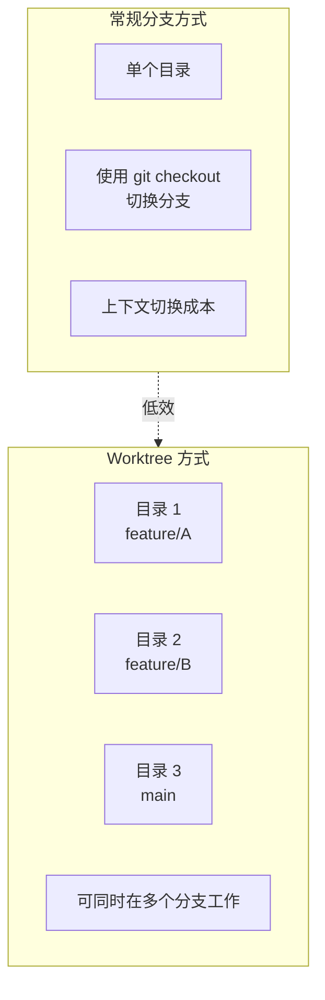
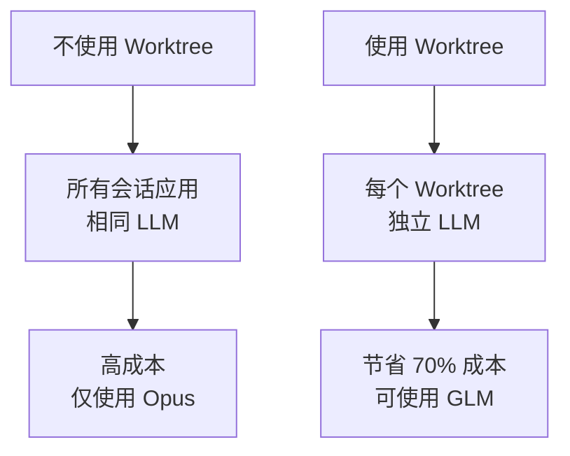
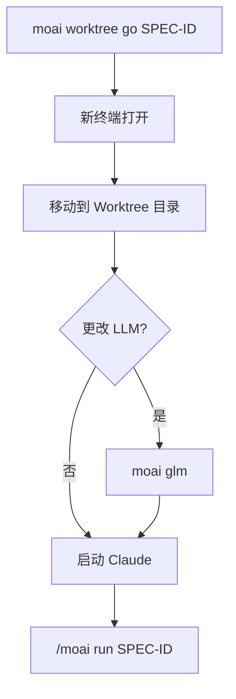
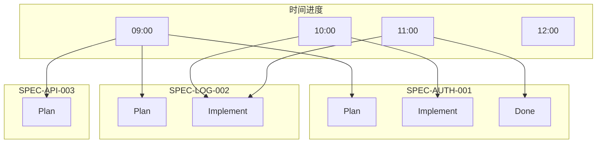
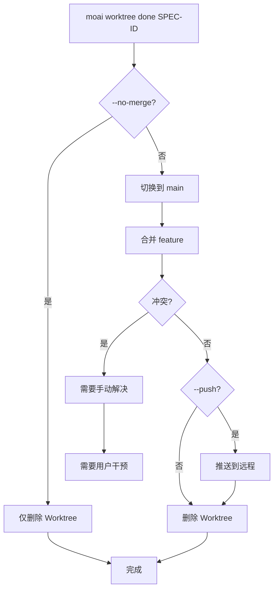
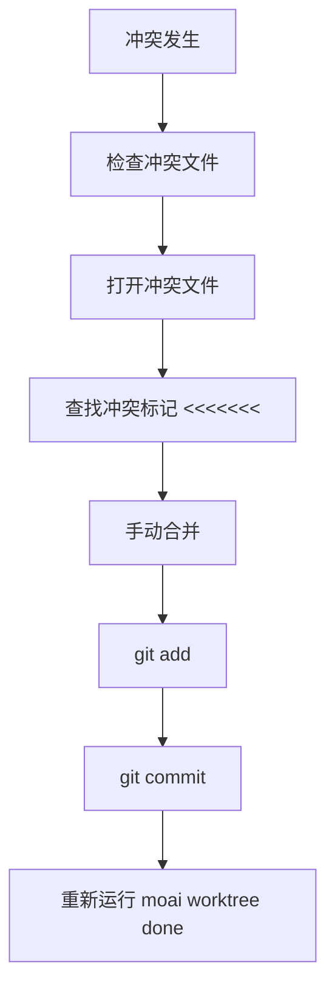
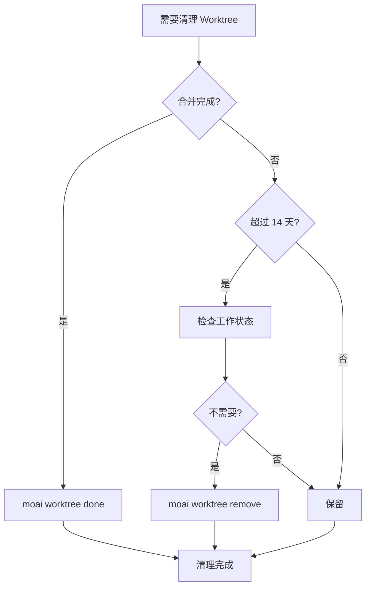
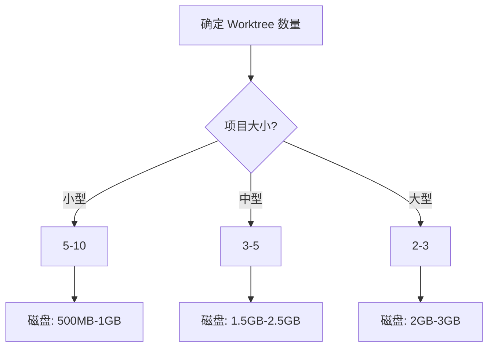
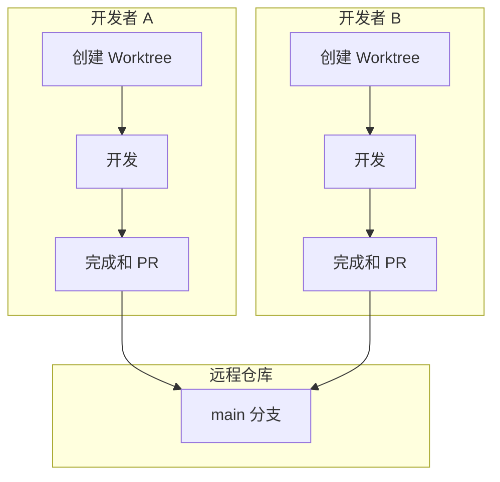

使用 Git Worktree 时的常见问题和解决方案。

## 目录

1. [基本概念](#基本概念)
2. [使用相关](#使用相关)
3. [故障排除](#故障排除)
4. [性能和优化](#性能和优化)
5. [团队协作](#团队协作)

---

## 基本概念

### Q: Git Worktree 和常规分支的区别是什么?

**A**: Git Worktree 允许您在**物理分离的目录**中工作:



**主要区别**:

| 特征          | 常规分支         | Git Worktree    |
| ------------- | ------------------- | --------------- |
| 工作目录 | 1 个共享            | N 个独立        |
| 分支切换   | 需要 `git checkout` | 仅需目录移动 |
| 同时工作     | 不可能              | 可能            |
| LLM 设置      | 共享              | 独立          |
| 冲突可能性   | 高                | 低            |

---

### Q: 为什么要使用 Worktree?

**A**: 我们推荐使用 Worktree 的以下原因:

1. **LLM 设置独立性**: 可以为每个 SPEC 使用不同的 LLM
   - Plan 阶段: Opus (高质量)
   - Implement 阶段: GLM (低成本)
   - Document 阶段: Sonnet (中等)

2. **并行开发**: 可以同时开发多个 SPEC
3. **冲突预防**: 通过隔离的工作空间最小化冲突
4. **成本节省**: 使用 GLM 节省 70% 的成本



---

### Q: MoAI-ADK 中 Worktree 是必需的吗?

**A**: 不是必需的,但**强烈推荐**:

- **单个 SPEC 开发**: 可以不使用 Worktree
- **多个 SPEC 开发**: Worktree 是必需的
- **团队协作**: 使用 Worktree 防止冲突
- **成本优化**: 使用 Worktree 分离 LLM

---

## 使用相关

### Q: 如何创建 Worktree?

**A**: 有两种方法:

**方法 1: 自动创建 (推荐)**

```bash
# 在 SPEC 规划阶段自动创建
> /moai plan "功能描述" --worktree

# 自动:
# 1. 创建 SPEC 文档
# 2. 创建 Worktree
# 3. 创建 feature 分支
```

**方法 2: 手动创建**

```bash
# 手动创建 Worktree
moai worktree new SPEC-AUTH-001

# 从特定分支创建
moai worktree new SPEC-AUTH-001 --from develop
```

---

### Q: 如何进入 Worktree?

**A**: 使用 `moai worktree go` 命令:

```bash
# 进入 Worktree
moai worktree go SPEC-AUTH-001

# 新终端打开并移动到 Worktree
# 提示符更改
(SPEC-AUTH-001) $
```

**进入后的工作流程**:



---

### Q: 可以同时使用多个 Worktree 吗?

**A**: 可以,无限制:

```bash
# 终端 1
moai worktree go SPEC-AUTH-001
(SPEC-AUTH-001) $ moai glm

# 终端 2
moai worktree go SPEC-LOG-002
(SPEC-LOG-002) $ moai glm

# 终端 3
moai worktree go SPEC-API-003
(SPEC-API-003) $ moai glm

# 所有都可以同时工作
```

**并行工作可视化**:



---

### Q: 如何完成 Worktree?

**A**: 使用 `moai worktree done` 命令:

```bash
# 基本完成 (合并 + 清理)
moai worktree done SPEC-AUTH-001

# 包括推送到远程
moai worktree done SPEC-AUTH-001 --push

# 仅删除而不合并
moai worktree done SPEC-AUTH-001 --no-merge
```

**完成流程**:



---

## 故障排除

### Q: Worktree 冲突发生了

**A**: 按以下步骤解决:



**实际示例**:

```bash
moai worktree done SPEC-AUTH-001
✗ 合并冲突发生!

# 1. 检查冲突文件
cd .moai/worktrees/SPEC-AUTH-001
git status
# 冲突文件: src/auth/jwt.ts

# 2. 解决冲突
code src/auth/jwt.ts

# 3. 检查并编辑冲突标记
<<<<<<< HEAD
const secret = process.env.JWT_SECRET;
=======
const secret = config.jwt.secret;
>>>>>>> feature/SPEC-AUTH-001

# 4. 合并
const secret = process.env.JWT_SECRET || config.jwt.secret;

# 5. 提交
git add src/auth/jwt.ts
git commit -m "fix: resolve merge conflict"

# 6. 重试完成
cd /path/to/project
moai worktree done SPEC-AUTH-001
✓ 完成!
```

---

### Q: Worktree 损坏了

**A**: 按以下步骤恢复:

```bash
# 1. 诊断
moai worktree status SPEC-AUTH-001
✗ Worktree 目录不存在

# 2. 删除现有 Worktree
moai worktree remove SPEC-AUTH-001 --force

# 3. 重新创建 Worktree
moai worktree new SPEC-AUTH-001

# 4. 验证恢复
moai worktree status SPEC-AUTH-001
✓ Worktree 正常
```

---

### Q: 磁盘空间不足

**A**: 清理旧的 Worktree:

```bash
# 1. 检查磁盘使用
$ du -sh .moai/worktrees/*
2.5G    .moai/worktrees/SPEC-AUTH-001
1.8G    .moai/worktrees/SPEC-LOG-002
3.2G    .moai/worktrees/SPEC-API-003

# 2. 清理旧 Worktree
$ moai worktree clean --older-than 14

# 要清理的 Worktree:
#   - SPEC-OLD-001 (30 天前, 2.1GB)
#   - SPEC-OLD-002 (45 天前, 1.7GB)

继续? [y/N] y

✓ 2 个 Worktree 已清理
✓ 释放 3.8GB 磁盘空间
```

**清理策略**:



---

### Q: LLM 未按预期工作

**A**: 检查 Worktree 特定的 LLM 设置:

```bash
# 检查当前 LLM
moai config
当前 LLM: GLM 5

# 在 Worktree 中更改 LLM
moai worktree go SPEC-AUTH-001
(SPEC-AUTH-001) $ moai cc
→ 已切换到 Claude Opus

# 其他 Worktree 不受影响
(SPEC-AUTH-001) $ exit
moai worktree go SPEC-LOG-002
(SPEC-LOG-002) $ moai config
当前 LLM: GLM 5 (无更改)
```

---

### Q: Git 命令不工作

**A**: 检查您是否在正确的目录中:

```bash
# 检查 Worktree 目录
pwd
/Users/goos/MoAI/moai-project/.moai/worktrees/SPEC-AUTH-001

# 检查 Git 状态
git status
On branch feature/SPEC-AUTH-001
nothing to commit, working tree clean

# 如果发生 Git 错误
git fetch --all
git rebase origin/feature/SPEC-AUTH-001
```

---

## 性能和优化

### Q: Worktree 会影响性能吗?

**A**: 影响很小:

**优势**:

- 每个 Worktree 是独立的,因此缓存高效
- Git 操作快速 (本地分支)
- 利用文件系统缓存

**劣势**:

- 磁盘空间使用 (每个 Worktree 重复)
- 初始 Worktree 创建需要时间

**优化提示**:

```bash
# 1. 删除不需要的 Worktree
moai worktree clean --merged-only

# 2. Git 垃圾回收
git gc --aggressive --prune=now

# 3. Worktree 压缩
git worktree prune
```

---

### Q: 可以创建多少个 Worktree?

**A**: 理论上无限制,但实际上受限于:

**限制因素**:

1. **磁盘空间**: 每个 Worktree 使用约 100MB-1GB
2. **内存**: 每个 Worktree 中打开的会话
3. **文件系统**: 同时打开的文件数量

**建议**:

- **小型项目**: 5-10 个 Worktree
- **中型项目**: 3-5 个 Worktree
- **大型项目**: 2-3 个 Worktree



---

### Q: 可以自动清理 Worktree 吗?

**A**: 可以,使用定期清理脚本:

```bash
#!/bin/bash
# clean-worktrees.sh

# 清理已合并的 Worktree
moai worktree clean --merged-only

# 清理 30 天前的 Worktree
moai worktree clean --older-than 30

# Git 垃圾回收
cd /path/to/project
git gc --aggressive --prune=now

echo "Worktree 清理完成"
```

**设置 cron 任务**:

```bash
# 每周日凌晨 2 点运行
0 2 * * 0 /path/to/clean-worktrees.sh >> /var/log/worktree-cleanup.log 2>&1
```

---

## 团队协作

### Q: 团队如何使用 Worktree?

**A**: 我们推荐以下工作流程:



**团队协作指南**:

1. **Worktree 命名规范**: `SPEC-{类别}-{编号}`
2. **定期同步**: `git pull origin main`
3. **PR 审查前**: 在本地完成测试
4. **冲突预防**: 频繁与 `main` 同步

---

### Q: 如何将 Worktree 与远程仓库同步?

**A**: 定期运行 `git pull`:

```bash
# 在每个 Worktree 中同步
moai worktree go SPEC-AUTH-001
(SPEC-AUTH-001) $ git pull origin main

# 或同步所有 Worktree
for spec in $(moai worktree list --porcelain | awk '{print $1}'); do
    cd ~/.moai/worktrees/$spec
    echo "Syncing $spec..."
    git pull origin main
done
```

---

### Q: 在 PR 审查期间如何管理 Worktree?

**A**: 使用以下策略:

```bash
# PR 创建前
moai worktree status SPEC-AUTH-001
# 检查状态

git log main..feature/SPEC-AUTH-001
# 检查更改

# PR 审查期间
# 保留 Worktree (等待合并)

# PR 批准后
moai worktree done SPEC-AUTH-001 --push
# 合并和清理

# PR 拒绝后
cd .moai/worktrees/SPEC-AUTH-001
# 继续修订工作
```

---

## 其他问题

### Q: 可以在没有 Worktree 的情况下使用 MoAI-ADK 吗?

**A**: 可以,但不推荐:

```bash
# 不使用 Worktree
> /moai plan "功能描述"
# 跳过 Worktree 创建步骤

# 但会发生以下问题:
# 1. 所有会话应用相同 LLM
# 2. 无法并行开发
# 3. 上下文切换成本
```

---

### Q: 需要备份 Worktree 吗?

**A**: Worktree 由 Git 管理,因此不需要单独备份:

```bash
# Worktree 是 Git 的一部分
# 推送到远程时自动备份

# 定期推送到远程
git push origin feature/SPEC-AUTH-001

# Worktree 丢失后恢复
git fetch origin
git worktree add SPEC-AUTH-001 origin/feature/SPEC-AUTH-001
```

---

## 相关文档

- [Git Worktree 概述](/worktree/index)
- [完整指南](./guide)
- [实际使用示例](./examples)

## 需要更多帮助?

- [GitHub Issues](https://github.com/MoAI-ADK/moai-adk/issues)
- [Discord 社区](https://discord.gg/moai-adk)
- [电子邮件支持](mailto:support@moai-adk.org)
