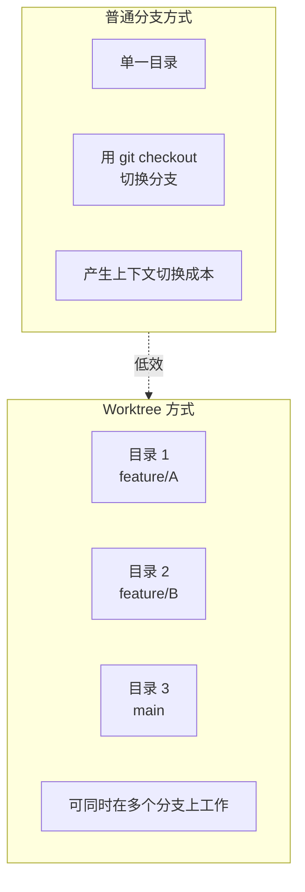
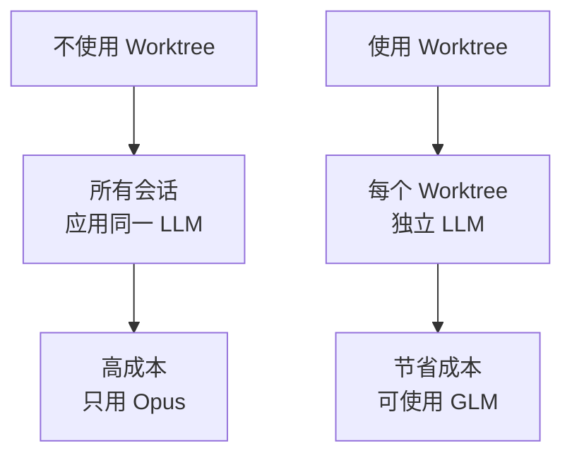
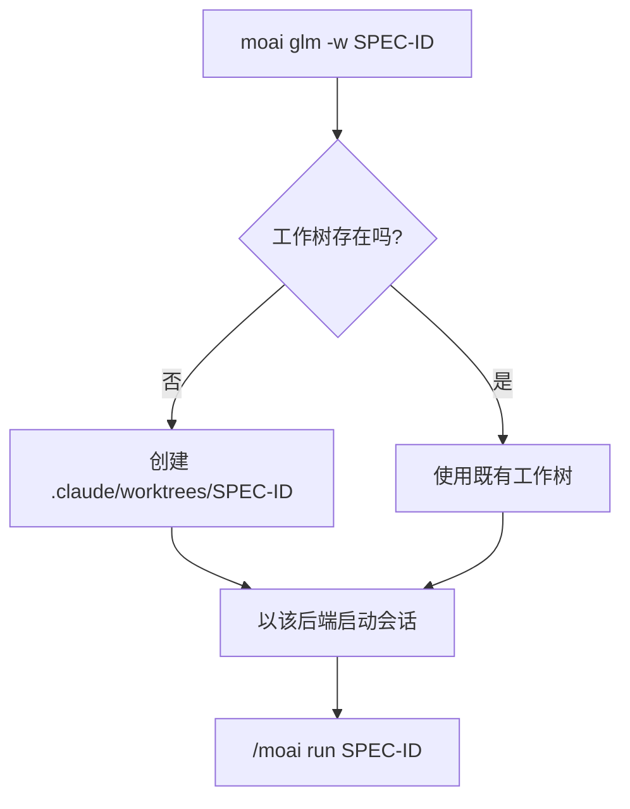
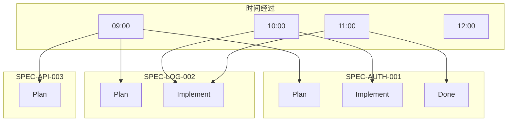
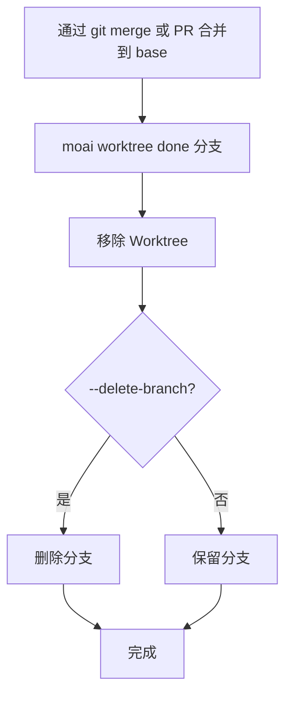
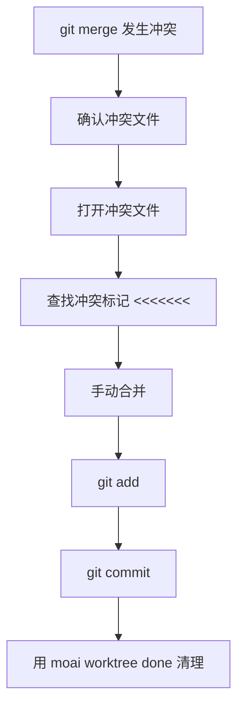
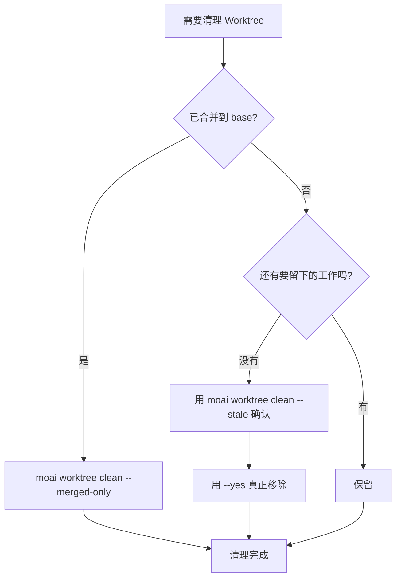
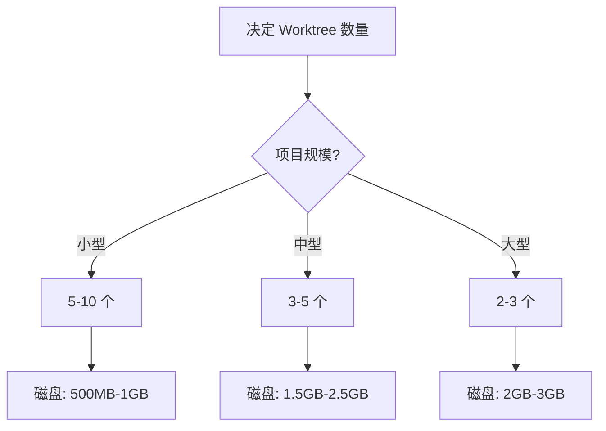
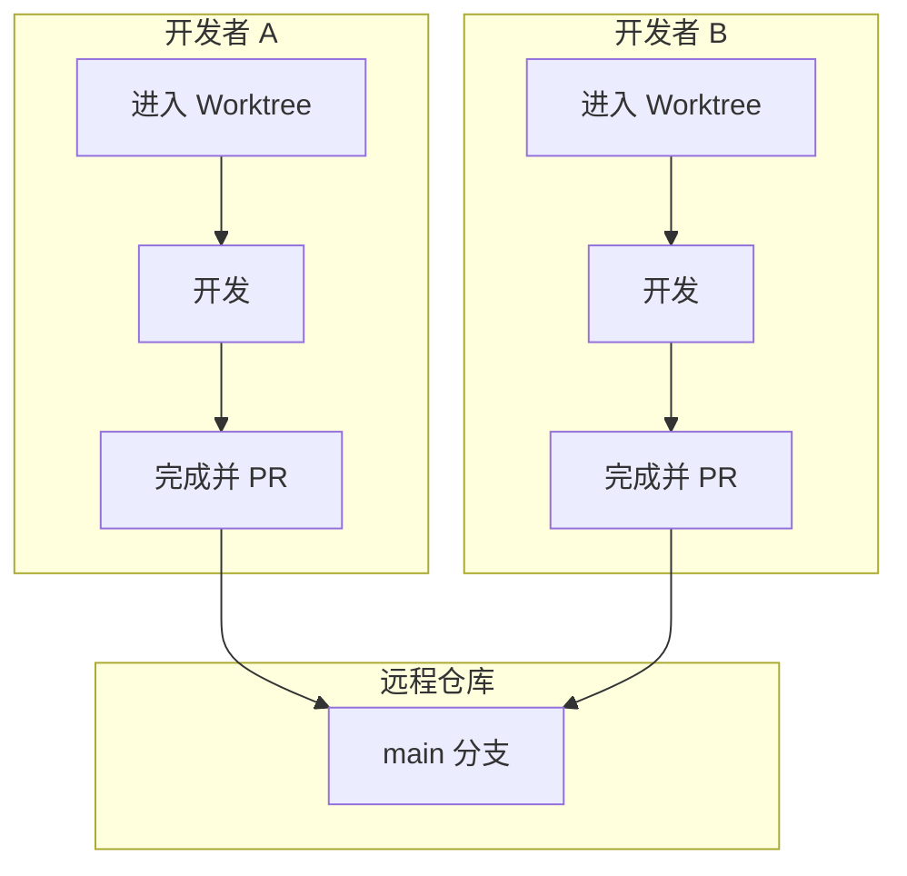

用 Git Worktree 时会碰到的问题与解答,都汇总在这里。

## 目录

1. [基本概念](#基本概念)
2. [使用相关](#使用相关)
3. [问题排查](#问题排查)
4. [性能与优化](#性能与优化)
5. [团队协作](#团队协作)

---

## 基本概念

### Q: Git Worktree 与普通分支有什么区别?

**A**: Git Worktree 让你能在**物理上分离的目录**中工作:


```mermaid
graph TB
    subgraph Traditional["普通分支方式"]
        T1[单一目录]
        T2[用 git checkout<br/>切换分支]
        T3[产生上下文切换成本]
    end

    subgraph Worktree["Worktree 方式"]
        W1[目录 1<br/>feature/A]
        W2[目录 2<br/>feature/B]
        W3[目录 3<br/>main]
        W4[可同时在多个分支上工作]
    end

    Traditional -.->|低效| Worktree
```

**主要区别**:

| 特征          | 普通分支            | Git Worktree    |
| ------------- | ------------------- | --------------- |
| 工作目录      | 1 个共享            | N 个独立        |
| 分支切换      | 需要 `git checkout` | 只需移动目录    |
| 并行工作      | 不可能              | 可能            |
| LLM 设置      | 共享                | 独立            |
| 冲突可能性    | 高                  | 低              |

---

### Q: 为什么要使用 Worktree?

**A**: 理由大致分成并行开发和代币经济学两条:

1. **LLM 设置独立性** —— 可以为每个 SPEC 分配不同的 LLM
   - Plan 阶段: Opus (高质量推理)
   - Implement 阶段: GLM (低成本)
   - Document 阶段: Sonnet (中等)

2. **并行开发** —— 可以同时推进多个 SPEC
3. **冲突防止** —— 工作空间各自独立,几乎不会起冲突
4. **成本节约** —— 在实现阶段使用 GLM 可以降低成本。节省幅度整理在 [CG 模式](/zh/multi-llm/cg-mode)中


```mermaid
graph TB
    A[不使用 Worktree] --> B[所有会话<br/>应用同一 LLM]
    B --> C[高成本<br/>只用 Opus]

    D[使用 Worktree] --> E[每个 Worktree<br/>独立 LLM]
    E --> F[节省成本<br/>可使用 GLM]
```

---

### Q: 在 MoAI-ADK 中 Worktree 是必需的吗?

**A**: 不,不是必需的,但**强烈推荐**:

- **单一 SPEC 开发**: 没有 Worktree 也可以
- **多 SPEC 开发**: Worktree 实际上是必需的
- **团队协作**: 用 Worktree 防止冲突
- **成本优化**: 用 Worktree 分离 LLM

---

## 使用相关

### Q: 如何进入 Worktree?

**A**: 用启动器的 `-w` 标志。指定名称的工作树不存在时它会当场创建,所以创建和
进入在一行里就完成了:

```bash
# 创建工作树并以 GLM 后端进入
moai glm -w SPEC-AUTH-001

# 以 Claude 后端进入同一个工作树
moai cc -w SPEC-AUTH-001

# 以 Claude 领导 + GLM 队友的混合模式进入
moai cg -w SPEC-AUTH-001
```

短名称会在 `.claude/worktrees/<名称>/` 下解析。如果已经建好的工作树在别处,给出
绝对路径即可 —— 它必须位于 `~/.moai/worktrees/` 或
`<项目>/.claude/worktrees/` 之下,其他路径会被拒绝。

**进入后的工作流程**:


```mermaid
flowchart TD
    A["moai glm -w SPEC-ID"] --> B{工作树存在吗?}
    B -->|否| C[创建 .claude/worktrees/SPEC-ID]
    B -->|是| D[使用既有工作树]
    C --> E[以该后端启动会话]
    D --> E
    E --> F["/moai run SPEC-ID"]
```

---

### Q: 能保留当前会话再多开一个工作树吗?

**A**: 加上 `--spawn` 就行。同一条命令会在新的 tmux 窗口中执行,现在这个窗口连
焦点都原样保留:

```bash
moai glm -w SPEC-AUTH-002 --spawn
# Spawned pane %7 running `moai glm -w SPEC-AUTH-002` in /path/to/your-project
# Switch to it with: tmux select-window -t %7
```

`--spawn` 只在 tmux 内有效。在 tmux 之外使用时它什么都不改动,直接以错误结束,
这时请去掉标志在当前终端里运行。只写 `-w` 会把当前进程替换成工作树会话 —— 这
就是它与 `--spawn` 的区别。

---

### Q: 建好的 Worktree 列表怎么看?

**A**: 直接用 git 命令。`moai worktree` 里没有列表命令:

```bash
git worktree list
```

特定工作树的状态或最近提交也用 `git -C` 查看:

```bash
git -C .claude/worktrees/SPEC-AUTH-001 status
git -C .claude/worktrees/SPEC-AUTH-001 log --oneline -5
```

---

### Q: 可以同时使用多个 Worktree 吗?

**A**: 可以,不限数量:

```bash
# Terminal 1
moai glm -w SPEC-AUTH-001

# Terminal 2
moai glm -w SPEC-LOG-002

# Terminal 3
moai glm -w SPEC-API-003

# 全部可以同时工作
```

如果你在用 tmux,在一个窗口里用 `--spawn` 就能全部拉起来:

```bash
moai glm -w SPEC-AUTH-001 --spawn
moai glm -w SPEC-LOG-002 --spawn
moai glm -w SPEC-API-003 --spawn
```

**并行工作可视化**:


```mermaid
graph TB
    subgraph Time["时间经过"]
        T1[09:00]
        T2[10:00]
        T3[11:00]
        T4[12:00]
    end

    subgraph Worktree1["SPEC-AUTH-001"]
        W1A[Plan]
        W1B[Implement]
        W1C[Done]
    end

    subgraph Worktree2["SPEC-LOG-002"]
        W2A[Plan]
        W2B[Implement]
    end

    subgraph Worktree3["SPEC-API-003"]
        W3A[Plan]
    end

    T1 --> W1A
    T1 --> W2A
    T1 --> W3A

    T2 --> W1B
    T2 --> W2B

    T3 --> W1C
    T3 --> W2B
```

---

### Q: 如何完成 Worktree?

**A**: `moai worktree done` 会移除 Worktree,需要的话连分支一起删除。不过它
**既不合并也不推送**。base 合并请先用 `git merge` 或 PR 处理完。它的参数不是
路径,而是分支名:

```bash
# 只移除 Worktree
moai worktree done feature/SPEC-AUTH-001

# 移除 Worktree + 删除分支
moai worktree done feature/SPEC-AUTH-001 --delete-branch

# 供自动化使用的静默模式 (PR 合并后清理)
moai worktree done feature/SPEC-AUTH-001 --auto
```

**完成流程**:


```mermaid
flowchart TD
    A[通过 git merge 或 PR 合并到 base] --> B[moai worktree done 分支]
    B --> C[移除 Worktree]
    C --> D{--delete-branch?}
    D -->|是| E[删除分支]
    D -->|否| F[保留分支]
    E --> G[完成]
    F --> G[完成]
```

---

### Q: `moai worktree done` 和 `moai worktree remove` 有什么不同?

**A**: 区别在于它们接受什么参数。

| | `done` | `remove` |
|---|---|---|
| 参数 | 分支名 (`feature/SPEC-AUTH-001`) | 文件系统路径 |
| 做的事 | 找到该分支的工作树并移除 | 移除该路径上的工作树 |
| 删除分支 | 可用 `--delete-branch` 选择 | 不做 |
| 自动化模式 | 支持 `--auto` | 没有 |

知道分支就用 `done`;只知道路径,或者要收拾分支已经坏掉的工作树时,用 `remove`。

---

## 问题排查

### Q: `moai worktree clean --stale` 安全吗?

**A**: 它就是照着安全来设计的,一共三层保护。

1. **默认只预览。** 只给 `--stale` 时,它只打印待移除清单,并不真的删除。加上
   `--yes` 才会发生删除
2. **有东西可失去就不删。** 只有工作树干净(既没有未提交变更,也没有 untracked
   文件)且分支上没有超出 base 的独有提交时,才会成为对象。只要有一条不满足就
   会被保留,并一并打印原因
3. **分支绝不删除。** 即使工作树目录消失了,提交仍然以分支名留在那里,随时可以
   再取出来

主检出以及正在运行该命令的工作树也始终排除在移除对象之外。

```bash
# 1) 先确认会删掉什么
$ moai worktree clean --stale
  Keeping .claude/worktrees/SPEC-API-003 [feature/SPEC-API-003]: uncommitted or untracked changes

Would remove 1 stale worktree(s):
  .claude/worktrees/SPEC-TMP-009 [feature/SPEC-TMP-009]

This was a preview. Re-run with --yes to remove them.

# 2) 确认过后再真正移除
$ moai worktree clean --stale --yes
```

`--stale` 与 `--merged-only` 不能一起使用。想按合并与否清理就用 `--merged-only`,
想按废弃与否清理就用 `--stale`。

---

### Q: 发生了 Worktree 冲突

**A**: 合并冲突发生在 `git merge` 或 PR 阶段。Worktree CLI 不参与合并,按下面的
顺序解开就好:


```mermaid
flowchart TD
    A[git merge 发生冲突] --> B[确认冲突文件]
    B --> C[打开冲突文件]
    C --> D[查找冲突标记 &lt;&lt;&lt;&lt;&lt;&lt;&lt;]
    D --> E[手动合并]
    E --> F[git add]
    F --> G[git commit]
    G --> H[用 moai worktree done 清理]
```

**实际示例**:

```bash
git checkout main
git merge feature/SPEC-AUTH-001
✗ 发生合并冲突!

# 1. 确认冲突文件
git status
# 冲突文件: src/auth/jwt.ts

# 2. 解决冲突
code src/auth/jwt.ts

# 3. 确认并修改冲突标记
<<<<<<< HEAD
const secret = process.env.JWT_SECRET;
=======
const secret = config.jwt.secret;
>>>>>>> feature/SPEC-AUTH-001

# 4. 合并
const secret = process.env.JWT_SECRET || config.jwt.secret;

# 5. 提交
git add src/auth/jwt.ts
git commit -m "fix: resolve merge conflict"
git push origin main

# 6. 合并后清理 Worktree
moai worktree done feature/SPEC-AUTH-001 --delete-branch
✓ 完成!
```

---

### Q: Worktree 注册表损坏了

**A**: 手动移动或删除目录后,git 就找不到工作树了。按下面的顺序恢复:

```bash
# 1. 恢复注册表 (git worktree repair + prune + 打印列表)
$ moai worktree recover
Scanning for worktrees in /path/to/your-project...
Recovered 2 worktree(s):
  /path/to/your-project/.claude/worktrees/SPEC-AUTH-001  [feature/SPEC-AUTH-001]
  /path/to/your-project/.claude/worktrees/SPEC-LOG-002   [feature/SPEC-LOG-002]

# 2. 确认当前状态
$ git worktree list

# 3. 仍然残留的损坏条目,指定路径移除
$ moai worktree remove ~/.moai/worktrees/your-project/SPEC-AUTH-001 --force

# 4. 重新创建并进入
$ moai glm -w SPEC-AUTH-001
```

---

### Q: 磁盘空间不足

**A**: 从已经合并完的 Worktree 开始清理:

```bash
# 1. 确认磁盘使用量
$ du -sh .claude/worktrees/*
2.5G    .claude/worktrees/SPEC-AUTH-001
1.8G    .claude/worktrees/SPEC-LOG-002
3.2G    .claude/worktrees/SPEC-API-003

# 2. 清理已合并进 base 的 Worktree
$ moai worktree clean --merged-only

# 3. 确认虽未合并但什么都没剩下的 Worktree 后再清理
$ moai worktree clean --stale
$ moai worktree clean --stale --yes
```

**清理策略**:


```mermaid
graph TD
    A[需要清理 Worktree] --> B{已合并到 base?}
    B -->|是| C[moai worktree clean --merged-only]
    B -->|否| D{还有要留下的工作吗?}
    D -->|没有| E[用 moai worktree clean --stale 确认]
    E --> F[用 --yes 真正移除]
    D -->|有| G[保留]
    C --> H[清理完成]
    F --> H
    G --> H
```

---

### Q: LLM 没有按预期工作

**A**: 确认每个 Worktree 的 LLM 设置是怎么定的:

```bash
# 确认当前 LLM 后端 (每个 Worktree 的设置记录在 .moai/config/sections/llm.yaml)
cat .moai/config/sections/llm.yaml

# 要换后端就重新进入那个工作树
moai cc -w SPEC-AUTH-001   # 切换到 Claude 后端

# 其他 Worktree 不受影响
git -C .claude/worktrees/SPEC-LOG-002 show HEAD:.moai/config/sections/llm.yaml
```

---

### Q: Git 命令不起作用

**A**: 确认你是否在正确的目录中:

```bash
# 确认当前工作树根目录
git rev-parse --show-toplevel

# 确认 Git 状态
git status
# On branch feature/SPEC-AUTH-001
# nothing to commit, working tree clean

# 如果发生 Git 错误
git fetch --all
git rebase origin/feature/SPEC-AUTH-001
```

---

## 性能与优化

### Q: Worktree 会影响性能吗?

**A**: 影响不大:

**优点**:

- 每个 Worktree 相互独立,缓存命中率好
- Git 操作快 (本地分支)
- 利用文件系统缓存

**缺点**:

- 占用磁盘空间 (每个 Worktree 都有重复)
- 第一次创建 Worktree 要花点时间

**优化提示**:

```bash
# 1. 移除不需要的 Worktree
moai worktree clean --merged-only

# 2. Git 垃圾回收
git gc --aggressive --prune=now

# 3. 清理 stale 引用
moai worktree clean
```

---

### Q: 可以创建多少个 Worktree?

**A**: 理论上不限,但实际上以下因素会左右数量:

**限制因素**:

1. **磁盘空间**: 每个 Worktree 使用约 100MB-1GB
2. **内存**: 每个 Worktree 中打开的会话
3. **文件系统**: 可同时打开的文件数

**推荐**:

- **小型项目**: 5-10 个 Worktree
- **中型项目**: 3-5 个 Worktree
- **大型项目**: 2-3 个 Worktree


```mermaid
graph TD
    A[决定 Worktree 数量] --> B{项目规模?}
    B -->|小型| C[5-10 个]
    B -->|中型| D[3-5 个]
    B -->|大型| E[2-3 个]

    C --> F[磁盘: 500MB-1GB]
    D --> G[磁盘: 1.5GB-2.5GB]
    E --> H[磁盘: 2GB-3GB]
```

---

### Q: 可以自动清理 Worktree 吗?

**A**: 清理已合并的 Worktree 交给自动化是安全的。不过 `--stale --yes` 更推荐由
人看过清单再执行,而不是无人值守地跑:

```bash
#!/bin/bash
# clean-worktrees.sh

cd /path/to/project

# 清理已合并进 base 的 Worktree (安全)
moai worktree clean --merged-only

# 废弃的 Worktree 只报告清单 (不删除)
moai worktree clean --stale

# Git 垃圾回收
git gc --aggressive --prune=now

echo "Worktree 清理完成 —— --stale 的清单请确认后自行用 --yes 处理"
```

**Cron 任务设置**:

```bash
# 每周日凌晨 2 点执行
0 2 * * 0 /path/to/clean-worktrees.sh >> /var/log/worktree-cleanup.log 2>&1
```

---

## 团队协作

### Q: 团队中如何使用 Worktree?

**A**: 推荐以下工作流程:


```mermaid
graph TB
    subgraph DevA["开发者 A"]
        A1[进入 Worktree]
        A2[开发]
        A3[完成并 PR]
    end

    subgraph DevB["开发者 B"]
        B1[进入 Worktree]
        B2[开发]
        B3[完成并 PR]
    end

    subgraph Remote["远程仓库"]
        R[main 分支]
    end

    A1 --> A2 --> A3 --> R
    B1 --> B2 --> B3 --> R
```

**团队协作指南**:

1. **Worktree 命名规范**: `SPEC-{类别}-{编号}`
2. **定期同步**: `moai worktree sync`
3. **PR 审查前**: 在本地完成测试
4. **冲突防止**: 经常与 `main` 同步

---

### Q: 如何把 Worktree 与 base 分支同步?

**A**: `moai worktree sync` 会把 base 分支的变更拉进 Worktree。用 `--strategy`
在 merge (默认) 与 rebase 之间选一个:

```bash
# 把当前目录的 Worktree 与 base(main) 同步 —— merge 策略
moai worktree sync

# 用 rebase 策略同步指定的 Worktree
moai worktree sync feature/SPEC-AUTH-001 --strategy rebase

# 基于其他 base 分支同步
moai worktree sync feature/SPEC-AUTH-001 --base develop
```

---

### Q: PR 审查期间如何管理 Worktree?

**A**: 使用以下策略:

```bash
# 创建 PR 前 —— 确认状态与变更内容
git worktree list
git log main..feature/SPEC-AUTH-001

# PR 审查期间 —— 保留 Worktree (等待合并)

# PR 批准并合并后清理 Worktree
moai worktree done feature/SPEC-AUTH-001 --delete-branch

# 收到修改意见时重新进入,继续工作
moai glm -w SPEC-AUTH-001
```

---

## 附加问题

### Q: 可以不使用 Worktree 而使用 MoAI-ADK 吗?

**A**: 可以。工作树不是默认项,而是由使用者自己选的选项;不带 `-w` 运行时就在
主检出里照常工作:

```bash
# 不使用 Worktree 运行
moai cc
> /moai plan "功能描述"
> /moai run SPEC-XXX-001

# 不过要接受以下几点:
# 1. 所有会话应用同一 LLM 设置
# 2. 并行开发时的分支切换成本
```

如果 SPEC 是一个接一个顺序推进,这样就够了。一旦开始同时跑多个 SPEC,工作树这
一边明显更省心。

---

### Q: 需要备份 Worktree 吗?

**A**: Worktree 由 Git 管理,因此不需要单独备份:

```bash
# Worktree 是 Git 的一部分
# 推送到远程仓库即自动备份

# 定期推送到远程
git push origin feature/SPEC-AUTH-001

# Worktree 丢失时恢复
git fetch origin
git worktree add .claude/worktrees/SPEC-AUTH-001 origin/feature/SPEC-AUTH-001
```

untracked 文件不由 git 管理,所以这种方式救不回来。`.env` 之类的本地文件请另行
保管。

---

## 相关文档

- [Git Worktree 概述](/zh/worktree/)
- [完整指南](/zh/worktree/guide)
- [实际使用示例](/zh/worktree/examples)

## 需要更多帮助吗?

- [GitHub Issues](https://github.com/modu-ai/moai-adk/issues) —— 错误报告、功能请求
- [Discord 社区](https://discord.gg/Z7E7Mdc5aN) —— 实时交流、分享技巧
