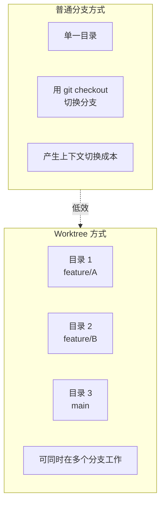
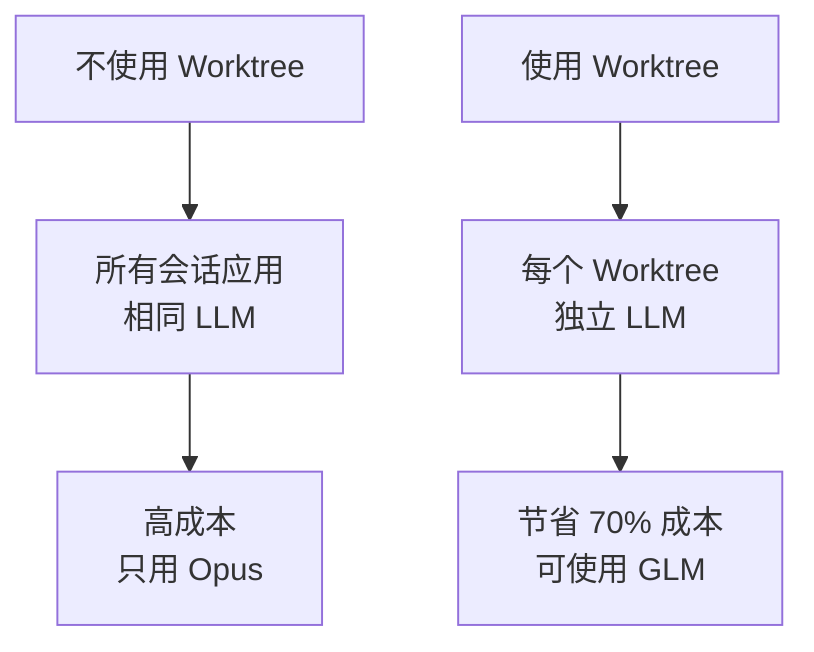
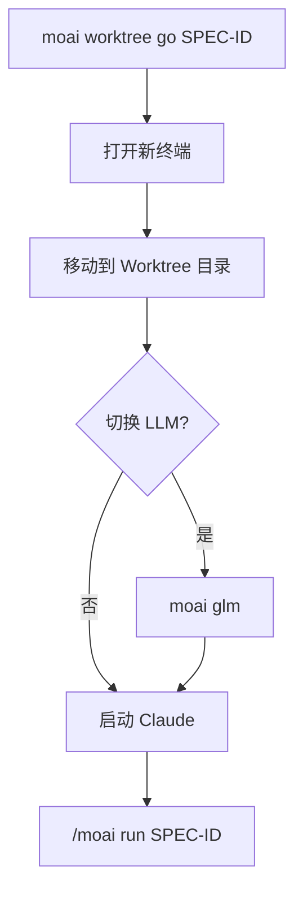
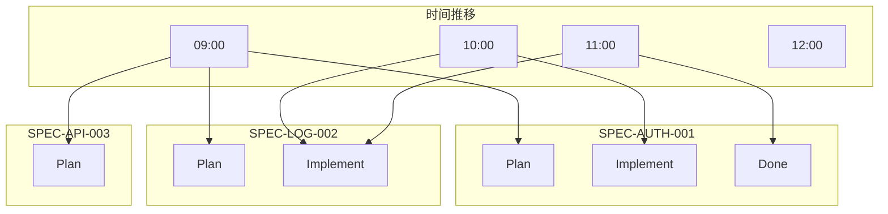
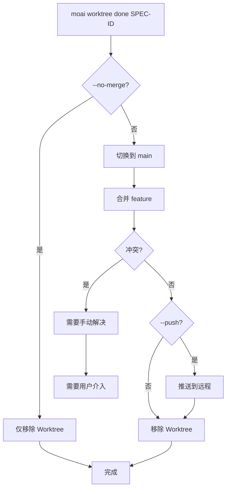
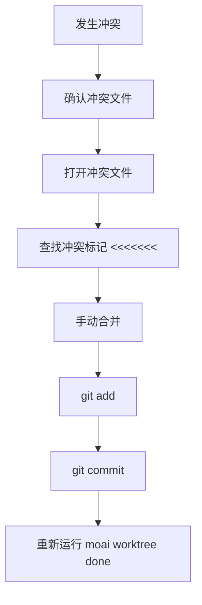
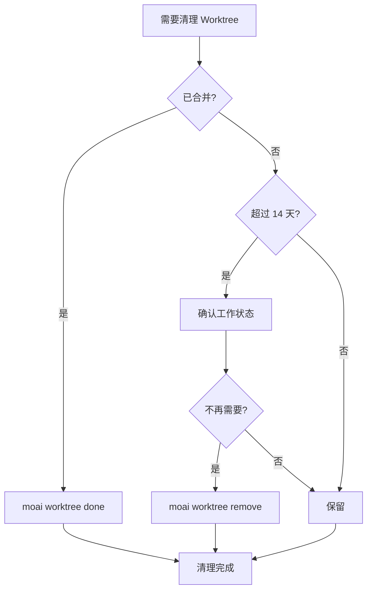
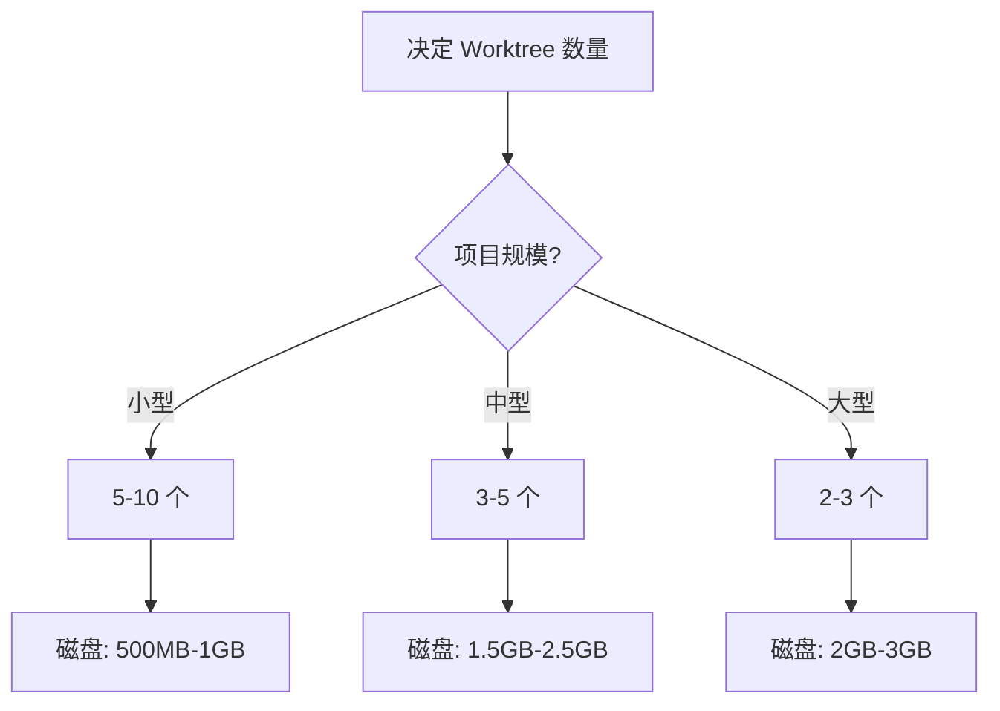
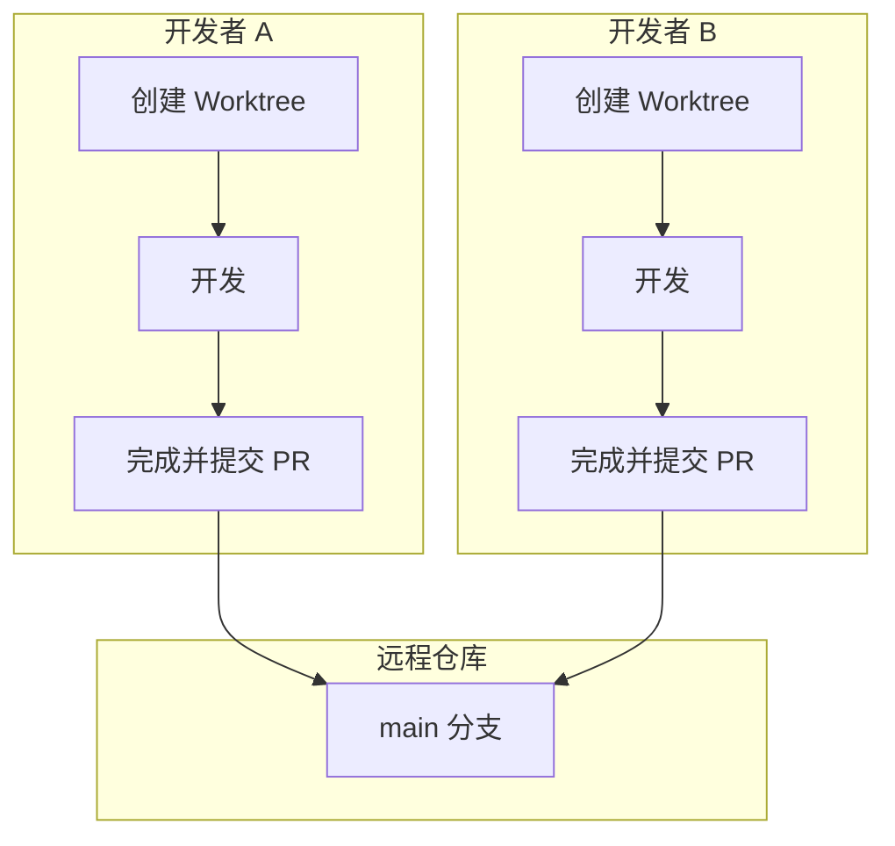

使用 Git Worktree 时经常遇到的问题与解答，都汇总在这里。

## 目录

1. [基本概念](#基本概念)
2. [使用相关](#使用相关)
3. [问题排查](#问题排查)
4. [性能与优化](#性能与优化)
5. [团队协作](#团队协作)

---

## 基本概念

### Q: Git Worktree 和普通分支有什么区别？

**A**: Git Worktree 让你可以在**物理上分离的目录**中工作：


```mermaid
graph TB
    subgraph Traditional["普通分支方式"]
        T1[单一目录]
        T2[用 git checkout<br/>切换分支]
        T3[产生上下文切换成本]
    end

    subgraph Worktree["Worktree 方式"]
        W1[目录 1<br/>feature/A]
        W2[目录 2<br/>feature/B]
        W3[目录 3<br/>main]
        W4[可同时在多个分支工作]
    end

    Traditional -.->|低效| Worktree
```

**主要区别**：

| 特征          | 普通分支            | Git Worktree    |
| ------------- | ------------------- | --------------- |
| 工作目录      | 共享 1 个           | N 个独立        |
| 分支切换      | 需要 `git checkout` | 只需移动目录    |
| 同时工作      | 不可能              | 可能            |
| LLM 配置      | 共享                | 独立            |
| 冲突可能性    | 高                  | 低              |

---

### Q: 为什么要使用 Worktree？

**A**: 核心原因有两个：并行开发和托克诺米克斯：

1. **LLM 配置独立性** —— 可以为每个 SPEC 分配不同的 LLM
   - Plan 阶段: Opus（高质量推理）
   - Implement 阶段: GLM（低成本）
   - Document 阶段: Sonnet（中等）

2. **并行开发** —— 可以同时推进多个 SPEC
3. **防止冲突** —— 独立的工作空间将冲突降到最低
4. **节省成本** —— 实现阶段使用 GLM 可减少约 70% 成本


```mermaid
graph TB
    A[不使用 Worktree] --> B[所有会话应用<br/>相同 LLM]
    B --> C[高成本<br/>只用 Opus]

    D[使用 Worktree] --> E[每个 Worktree<br/>独立 LLM]
    E --> F[节省 70% 成本<br/>可使用 GLM]
```

---

### Q: 在 MoAI-ADK 中 Worktree 是必需的吗？

**A**: 不是必需的，但**强烈推荐**：

- **单一 SPEC 开发**：没有 Worktree 也可以
- **多 SPEC 开发**：Worktree 实际上必不可少
- **团队协作**：用 Worktree 防止冲突
- **成本优化**：用 Worktree 分离 LLM

---

## 使用相关

### Q: 如何创建 Worktree？

**A**: 有两种方法：

**方法 1：自动创建（推荐）**

```bash
# 在 SPEC 计划阶段自动创建
> /moai plan "功能描述" --worktree

# 自动完成:
# 1. 生成 SPEC 文档
# 2. 创建 Worktree
# 3. 创建 Feature 分支
```

**方法 2：手动创建**

```bash
# 手动创建 Worktree
moai worktree new SPEC-AUTH-001

# 从特定分支创建
moai worktree new SPEC-AUTH-001 --from develop
```

---

### Q: 如何进入 Worktree？

**A**: 使用 `moai worktree go` 命令：

```bash
# 进入 Worktree
moai worktree go SPEC-AUTH-001

# 打开新终端并移动到 Worktree
# 提示符发生变化
(SPEC-AUTH-001) $
```

**进入后的工作流程**：


```mermaid
flowchart TD
    A[moai worktree go SPEC-ID] --> B[打开新终端]
    B --> C[移动到 Worktree 目录]
    C --> D{切换 LLM?}
    D -->|是| E[moai glm]
    D -->|否| F[启动 Claude]
    E --> F
    F --> G["/moai run SPEC-ID"]
```

---

### Q: 可以同时使用多个 Worktree 吗？

**A**: 可以，没有数量限制：

```bash
# Terminal 1
moai worktree go SPEC-AUTH-001
(SPEC-AUTH-001) $ moai glm

# Terminal 2
moai worktree go SPEC-LOG-002
(SPEC-LOG-002) $ moai glm

# Terminal 3
moai worktree go SPEC-API-003
(SPEC-API-003) $ moai glm

# 全部可以同时工作
```

**并行工作可视化**：


```mermaid
graph TB
    subgraph Time["时间推移"]
        T1[09:00]
        T2[10:00]
        T3[11:00]
        T4[12:00]
    end

    subgraph Worktree1["SPEC-AUTH-001"]
        W1A[Plan]
        W1B[Implement]
        W1C[Done]
    end

    subgraph Worktree2["SPEC-LOG-002"]
        W2A[Plan]
        W2B[Implement]
    end

    subgraph Worktree3["SPEC-API-003"]
        W3A[Plan]
    end

    T1 --> W1A
    T1 --> W2A
    T1 --> W3A

    T2 --> W1B
    T2 --> W2B

    T3 --> W1C
    T3 --> W2B
```

---

### Q: 如何完成一个 Worktree？

**A**: 使用 `moai worktree done` 命令：

```bash
# 基本完成（合并 + 清理）
moai worktree done SPEC-AUTH-001

# 连同推送到远程
moai worktree done SPEC-AUTH-001 --push

# 只移除、不合并
moai worktree done SPEC-AUTH-001 --no-merge
```

**完成流程**：


```mermaid
flowchart TD
    A[moai worktree done SPEC-ID] --> B{--no-merge?}
    B -->|是| C[仅移除 Worktree]
    B -->|否| D[切换到 main]
    D --> E[合并 feature]
    E --> F{冲突?}
    F -->|是| G[需要手动解决]
    F -->|否| H{--push?}
    H -->|是| I[推送到远程]
    H -->|否| J[移除 Worktree]
    I --> J
    C --> K[完成]
    J --> K
    G --> L[需要用户介入]
```

---

## 问题排查

### Q: 发生了 Worktree 冲突

**A**: 按以下步骤解决：


```mermaid
flowchart TD
    A[发生冲突] --> B[确认冲突文件]
    B --> C[打开冲突文件]
    C --> D[查找冲突标记 &lt;&lt;&lt;&lt;&lt;&lt;&lt;]
    D --> E[手动合并]
    E --> F[git add]
    F --> G[git commit]
    G --> H[重新运行 moai worktree done]
```

**实际示例**：

```bash
moai worktree done SPEC-AUTH-001
✗ 发生合并冲突!

# 1. 确认冲突文件
cd .moai/worktrees/SPEC-AUTH-001
git status
# 冲突文件: src/auth/jwt.ts

# 2. 解决冲突
code src/auth/jwt.ts

# 3. 确认并修改冲突标记
<<<<<<< HEAD
const secret = process.env.JWT_SECRET;
=======
const secret = config.jwt.secret;
>>>>>>> feature/SPEC-AUTH-001

# 4. 合并
const secret = process.env.JWT_SECRET || config.jwt.secret;

# 5. 提交
git add src/auth/jwt.ts
git commit -m "fix: resolve merge conflict"

# 6. 重试完成
cd /path/to/project
moai worktree done SPEC-AUTH-001
✓ 完成!
```

---

### Q: Worktree 损坏了

**A**: 按以下步骤恢复：

```bash
# 1. 诊断
moai worktree status SPEC-AUTH-001
✗ Worktree 目录不存在

# 2. 移除现有 Worktree
moai worktree remove SPEC-AUTH-001 --force

# 3. 重建 Worktree
moai worktree new SPEC-AUTH-001

# 4. 确认恢复
moai worktree status SPEC-AUTH-001
✓ Worktree 正常
```

---

### Q: 磁盘空间不足

**A**: 清理旧的 Worktree：

```bash
# 1. 查看磁盘使用量
$ du -sh .moai/worktrees/*
2.5G    .moai/worktrees/SPEC-AUTH-001
1.8G    .moai/worktrees/SPEC-LOG-002
3.2G    .moai/worktrees/SPEC-API-003

# 2. 清理旧的 Worktree
$ moai worktree clean --older-than 14

# 将被清理的 Worktree:
#   - SPEC-OLD-001 (30 天前, 2.1GB)
#   - SPEC-OLD-002 (45 天前, 1.7GB)

是否继续? [y/N] y

✓ 清理 2 个 Worktree 完成
✓ 释放 3.8GB 磁盘空间
```

**清理策略**：


```mermaid
graph TD
    A[需要清理 Worktree] --> B{已合并?}
    B -->|是| C[moai worktree done]
    B -->|否| D{超过 14 天?}
    D -->|是| E[确认工作状态]
    D -->|否| F[保留]
    E --> G{不再需要?}
    G -->|是| H[moai worktree remove]
    G -->|否| F
    C --> I[清理完成]
    H --> I
    F --> I
```

---

### Q: LLM 没有按预期工作

**A**: 检查各 Worktree 的 LLM 配置：

```bash
# 查看当前 LLM
moai config
当前 LLM: GLM 5

# 在 Worktree 中切换 LLM
moai worktree go SPEC-AUTH-001
(SPEC-AUTH-001) $ moai cc
→ 已切换为 Claude Opus

# 其他 Worktree 不受影响
(SPEC-AUTH-001) $ exit
moai worktree go SPEC-LOG-002
(SPEC-LOG-002) $ moai config
当前 LLM: GLM 5 (无变化)
```

---

### Q: Git 命令不工作

**A**: 确认自己在正确的目录中：

```bash
# 确认 Worktree 目录
pwd
/path/to/your-project/.moai/worktrees/SPEC-AUTH-001

# 查看 Git 状态
git status
On branch feature/SPEC-AUTH-001
nothing to commit, working tree clean

# 如果发生 Git 错误
git fetch --all
git rebase origin/feature/SPEC-AUTH-001
```

---

## 性能与优化

### Q: Worktree 会影响性能吗？

**A**: 只有微小的影响：

**优点**：

- 各 Worktree 相互独立，缓存高效
- Git 操作快（本地分支）
- 利用文件系统缓存

**缺点**：

- 占用磁盘空间（每个 Worktree 都有重复）
- 初次创建 Worktree 需要时间

**优化技巧**：

```bash
# 1. 移除不需要的 Worktree
moai worktree clean --merged-only

# 2. Git 垃圾回收
git gc --aggressive --prune=now

# 3. 压缩 Worktree
git worktree prune
```

---

### Q: 可以创建多少个 Worktree？

**A**: 理论上没有限制，但实际上以下因素会限制数量：

**限制因素**：

1. **磁盘空间**：每个 Worktree 约占用 100MB-1GB
2. **内存**：每个 Worktree 中打开的会话
3. **文件系统**：可同时打开的文件数

**建议**：

- **小型项目**：5-10 个 Worktree
- **中型项目**：3-5 个 Worktree
- **大型项目**：2-3 个 Worktree


```mermaid
graph TD
    A[决定 Worktree 数量] --> B{项目规模?}
    B -->|小型| C[5-10 个]
    B -->|中型| D[3-5 个]
    B -->|大型| E[2-3 个]

    C --> F[磁盘: 500MB-1GB]
    D --> G[磁盘: 1.5GB-2.5GB]
    E --> H[磁盘: 2GB-3GB]
```

---

### Q: 可以自动清理 Worktree 吗？

**A**: 可以，使用定期清理脚本：

```bash
#!/bin/bash
# clean-worktrees.sh

# 清理已合并的 Worktree
moai worktree clean --merged-only

# 清理超过 30 天的 Worktree
moai worktree clean --older-than 30

# Git 垃圾回收
cd /path/to/project
git gc --aggressive --prune=now

echo "Worktree 清理完成"
```

**设置 cron 任务**：

```bash
# 每周日凌晨 2 点运行
0 2 * * 0 /path/to/clean-worktrees.sh >> /var/log/worktree-cleanup.log 2>&1
```

---

## 团队协作

### Q: 团队如何使用 Worktree？

**A**: 推荐以下工作流：


```mermaid
graph TB
    subgraph DevA["开发者 A"]
        A1[创建 Worktree]
        A2[开发]
        A3[完成并提交 PR]
    end

    subgraph DevB["开发者 B"]
        B1[创建 Worktree]
        B2[开发]
        B3[完成并提交 PR]
    end

    subgraph Remote["远程仓库"]
        R[main 分支]
    end

    A1 --> A2 --> A3 --> R
    B1 --> B2 --> B3 --> R
```

**团队协作指南**：

1. **Worktree 命名规范**：`SPEC-{类别}-{编号}`
2. **定期同步**：`git pull origin main`
3. **PR 审查之前**：在本地完成测试
4. **防止冲突**：经常与 `main` 同步

---

### Q: 如何在 Worktree 与远程仓库之间同步？

**A**: 定期运行 `git pull`：

```bash
# 在各 Worktree 中同步
moai worktree go SPEC-AUTH-001
(SPEC-AUTH-001) $ git pull origin main

# 或同步所有 Worktree
for spec in $(moai worktree list --porcelain | awk '{print $1}'); do
    cd ~/.moai/worktrees/$spec
    echo "Syncing $spec..."
    git pull origin main
done
```

---

### Q: PR 审查期间如何管理 Worktree？

**A**: 使用以下策略：

```bash
# 创建 PR 之前
moai worktree status SPEC-AUTH-001
# 确认状态

git log main..feature/SPEC-AUTH-001
# 确认变更

# PR 审查期间
# 保留 Worktree（等待合并）

# PR 批准后
moai worktree done SPEC-AUTH-001 --push
# 合并并清理

# PR 被拒绝后
cd .moai/worktrees/SPEC-AUTH-001
# 继续修改工作
```

---

## 其他问题

### Q: 可以不用 Worktree 就使用 MoAI-ADK 吗？

**A**: 可以，但不推荐：

```bash
# 不使用 Worktree
> /moai plan "功能描述"
# 跳过 Worktree 创建步骤

# 但会出现以下问题:
# 1. 所有会话应用相同 LLM
# 2. 无法并行开发
# 3. 上下文切换成本
```

---

### Q: 需要备份 Worktree 吗？

**A**: Worktree 由 Git 管理，无需单独备份：

```bash
# Worktree 是 Git 的一部分
# 推送到远程仓库即自动备份

# 定期推送到远程
git push origin feature/SPEC-AUTH-001

# Worktree 丢失时恢复
git fetch origin
git worktree add SPEC-AUTH-001 origin/feature/SPEC-AUTH-001
```

---

## 相关文档

- [Git Worktree 概述](/zh/worktree/)
- [完整指南](/zh/worktree/guide)
- [实际使用示例](/zh/worktree/examples)

## 需要更多帮助？

- [GitHub Issues](https://github.com/modu-ai/moai-adk/issues) —— 错误报告、功能请求
- [Discord 社区](https://discord.gg/Z7E7Mdc5aN) —— 实时交流、分享技巧
