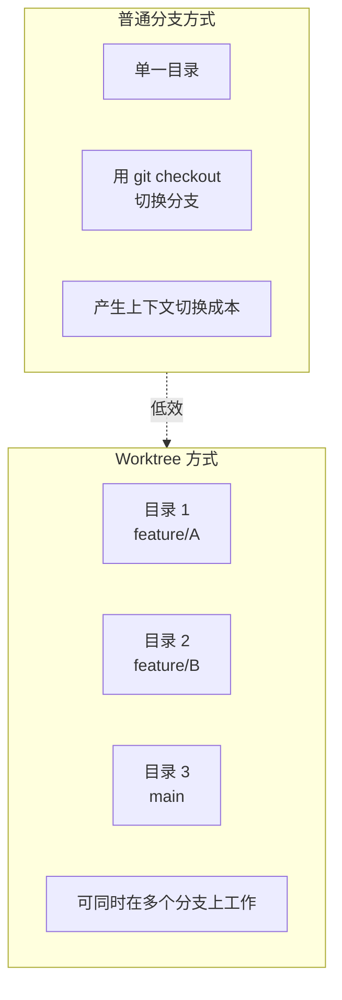
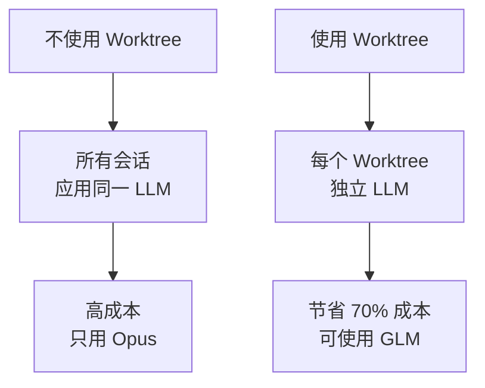
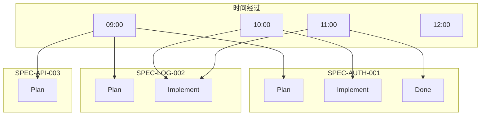
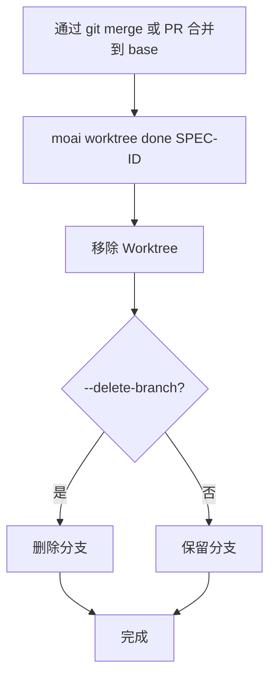
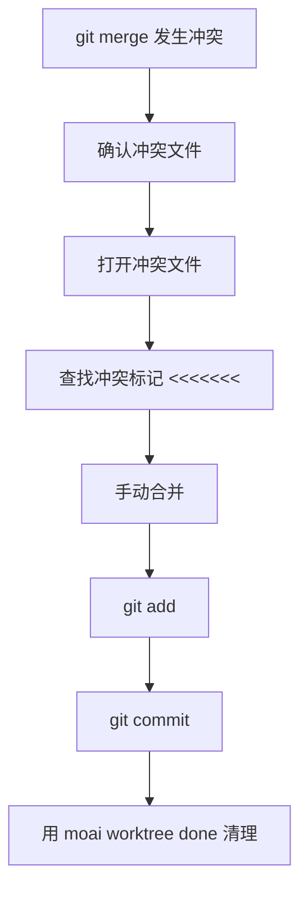
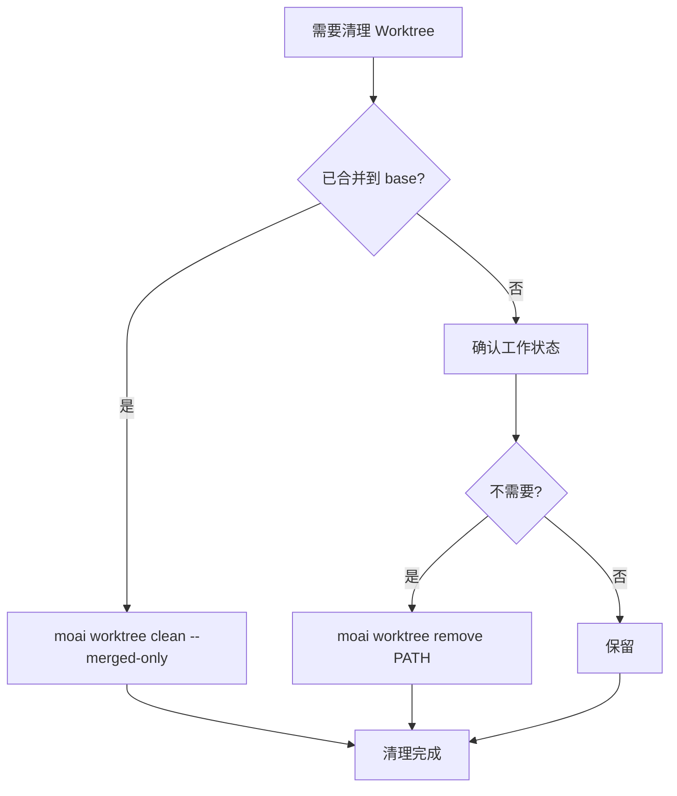
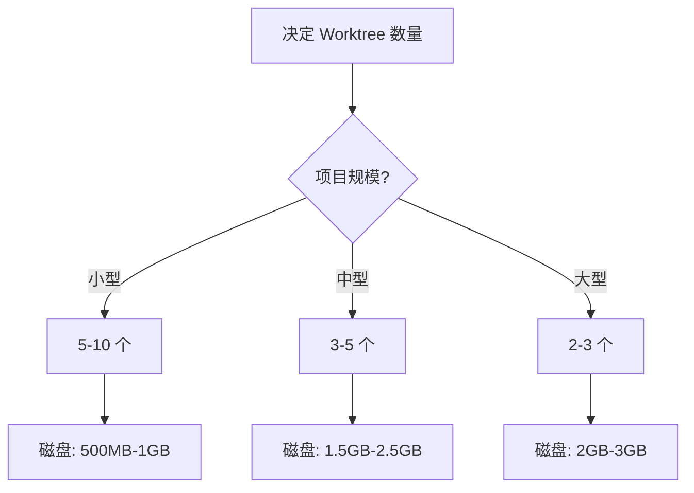
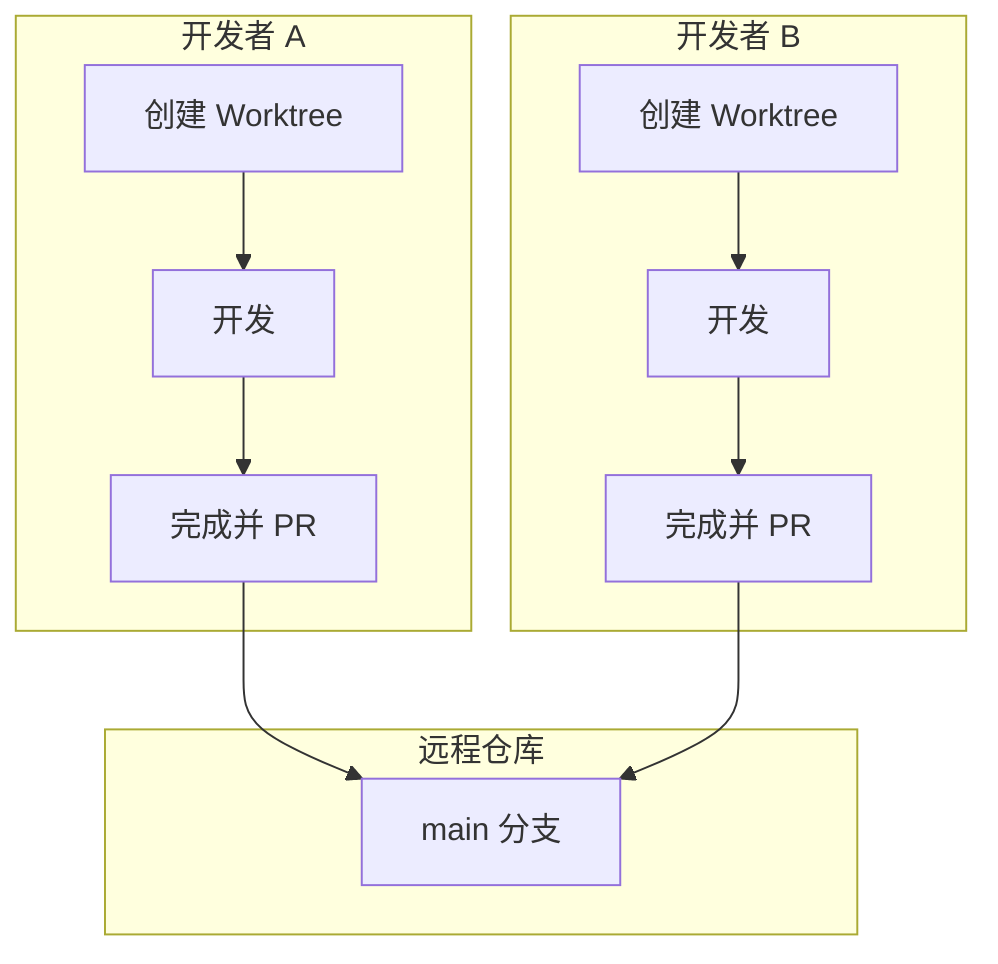

使用 Git Worktree 时经常遇到的问题与解答,都汇总在这里。

## 目录

1. [基本概念](#基本概念)
2. [使用相关](#使用相关)
3. [问题排查](#问题排查)
4. [性能与优化](#性能与优化)
5. [团队协作](#团队协作)

---

## 基本概念

### Q: Git Worktree 与普通分支有什么区别?

**A**: Git Worktree 让你能在**物理上分离的目录**中工作:


```mermaid
graph TB
    subgraph Traditional["普通分支方式"]
        T1[单一目录]
        T2[用 git checkout<br/>切换分支]
        T3[产生上下文切换成本]
    end

    subgraph Worktree["Worktree 方式"]
        W1[目录 1<br/>feature/A]
        W2[目录 2<br/>feature/B]
        W3[目录 3<br/>main]
        W4[可同时在多个分支上工作]
    end

    Traditional -.->|低效| Worktree
```

**主要区别**:

| 特征          | 普通分支            | Git Worktree    |
| ------------- | ------------------- | --------------- |
| 工作目录      | 1 个共享            | N 个独立        |
| 分支切换      | 需要 `git checkout` | 只需移动目录    |
| 并行工作      | 不可能              | 可能            |
| LLM 设置      | 共享                | 独立            |
| 冲突可能性    | 高                  | 低              |

---

### Q: 为什么要使用 Worktree?

**A**: 核心有两个理由 —— 并行开发与托克诺米克斯:

1. **LLM 设置独立性** —— 可以为每个 SPEC 分配不同的 LLM
   - Plan 阶段: Opus (高质量推理)
   - Implement 阶段: GLM (低成本)
   - Document 阶段: Sonnet (中等)

2. **并行开发** —— 可以同时推进多个 SPEC
3. **冲突防止** —— 独立的工作空间把冲突降到最低
4. **成本节约** —— 在实现阶段使用 GLM 可减少约 70% 成本


```mermaid
graph TB
    A[不使用 Worktree] --> B[所有会话<br/>应用同一 LLM]
    B --> C[高成本<br/>只用 Opus]

    D[使用 Worktree] --> E[每个 Worktree<br/>独立 LLM]
    E --> F[节省 70% 成本<br/>可使用 GLM]
```

---

### Q: 在 MoAI-ADK 中 Worktree 是必需的吗?

**A**: 不,不是必需的,但**强烈推荐**:

- **单一 SPEC 开发**: 没有 Worktree 也可以
- **多 SPEC 开发**: Worktree 实际上是必需的
- **团队协作**: 用 Worktree 防止冲突
- **成本优化**: 用 Worktree 分离 LLM

---

## 使用相关

### Q: 如何创建 Worktree?

**A**: 有两种方法:

**方法 1: 自动创建 (推荐)**

```bash
# 在 SPEC 计划阶段自动创建
> /moai plan "功能描述" --worktree

# 自动完成:
# 1. 生成 SPEC 文档
# 2. 创建 Worktree
# 3. 创建 Feature 分支
```

**方法 2: 手动创建**

```bash
# 手动创建 Worktree (默认: 基于 origin/main)
moai worktree new SPEC-AUTH-001

# 基于本地 main 创建
moai worktree new SPEC-AUTH-001 --base main
```

---

### Q: 如何进入 Worktree?

**A**: `moai worktree go` 会输出 Worktree 路径。与 shell 的 `cd` 组合来移动(它不会直接启动 shell 会话):

```bash
# 输出路径后移动
cd "$(moai worktree go SPEC-AUTH-001)"
```

**进入后的工作流程**:

```mermaid
flowchart TD
    A[moai worktree go SPEC-ID] --> B[把路径输出到 stdout]
    B --> C["用 cd \"$(...)\" 移动"]
    C --> D{更换 LLM?}
    D -->|是| E[moai glm]
    D -->|否| F[启动 Claude]
    E --> F
    F --> G["/moai run SPEC-ID"]
```

---

### Q: 可以同时使用多个 Worktree 吗?

**A**: 可以,不限数量:

```bash
# Terminal 1
cd "$(moai worktree go SPEC-AUTH-001)"
$ moai glm

# Terminal 2
cd "$(moai worktree go SPEC-LOG-002)"
$ moai glm

# Terminal 3
cd "$(moai worktree go SPEC-API-003)"
$ moai glm

# 全部可以同时工作
```

**并行工作可视化**:


```mermaid
graph TB
    subgraph Time["时间经过"]
        T1[09:00]
        T2[10:00]
        T3[11:00]
        T4[12:00]
    end

    subgraph Worktree1["SPEC-AUTH-001"]
        W1A[Plan]
        W1B[Implement]
        W1C[Done]
    end

    subgraph Worktree2["SPEC-LOG-002"]
        W2A[Plan]
        W2B[Implement]
    end

    subgraph Worktree3["SPEC-API-003"]
        W3A[Plan]
    end

    T1 --> W1A
    T1 --> W2A
    T1 --> W3A

    T2 --> W1B
    T2 --> W2B

    T3 --> W1C
    T3 --> W2B
```

---

### Q: 如何完成 Worktree?

**A**: `moai worktree done` 会移除 Worktree 并可选地删除分支。**它不执行合并、推送** —— base 合并请先用 `git merge` 或 PR 处理:

```bash
# 只移除 Worktree
moai worktree done SPEC-AUTH-001

# 移除 Worktree + 删除分支
moai worktree done SPEC-AUTH-001 --delete-branch

# 用于自动化的无输出模式 (PR 合并后清理)
moai worktree done SPEC-AUTH-001 --auto
```

**完成流程**:


```mermaid
flowchart TD
    A[通过 git merge 或 PR 合并到 base] --> B[moai worktree done SPEC-ID]
    B --> C[移除 Worktree]
    C --> D{--delete-branch?}
    D -->|是| E[删除分支]
    D -->|否| F[保留分支]
    E --> G[完成]
    F --> G[完成]
```

---

## 问题排查

### Q: 发生了 Worktree 冲突

**A**: 用以下步骤解决:

合并冲突发生在 `git merge` 或 PR 阶段。Worktree CLI 不参与合并。


```mermaid
flowchart TD
    A[git merge 发生冲突] --> B[确认冲突文件]
    B --> C[打开冲突文件]
    C --> D[查找冲突标记 &lt;&lt;&lt;&lt;&lt;&lt;&lt;]
    D --> E[手动合并]
    E --> F[git add]
    F --> G[git commit]
    G --> H[用 moai worktree done 清理]
```

**实际示例**:

```bash
git checkout main
git merge feature/SPEC-AUTH-001
✗ 发生合并冲突!

# 1. 确认冲突文件
git status
# 冲突文件: src/auth/jwt.ts

# 2. 解决冲突
code src/auth/jwt.ts

# 3. 确认并修改冲突标记
<<<<<<< HEAD
const secret = process.env.JWT_SECRET;
=======
const secret = config.jwt.secret;
>>>>>>> feature/SPEC-AUTH-001

# 4. 合并
const secret = process.env.JWT_SECRET || config.jwt.secret;

# 5. 提交
git add src/auth/jwt.ts
git commit -m "fix: resolve merge conflict"
git push origin main

# 6. 合并后清理 Worktree
moai worktree done SPEC-AUTH-001 --delete-branch
✓ 完成!
```

---

### Q: Worktree 损坏了

**A**: 用以下步骤恢复:

```bash
# 1. 诊断 (恢复损坏的注册表)
moai worktree recover

# 2. 确认当前状态
moai worktree status
# ╭─ Worktree Status ──────────────────────────────╮
# │ Repository: /path/to/your-project              │
# │ Total worktrees: 0                             │
# │                                                │
# │ No worktrees found.                            │
# ╰────────────────────────────────────────────────╯

# 3. 移除现有 Worktree (指定路径)
moai worktree remove ~/.moai/worktrees/your-project/SPEC-AUTH-001 --force

# 4. 重新创建 Worktree
moai worktree new SPEC-AUTH-001
```

---

### Q: 磁盘空间不足

**A**: 清理已完成合并的 Worktree:

```bash
# 1. 确认磁盘使用量
$ du -sh ~/.moai/worktrees/your-project/*
2.5G    ~/.moai/worktrees/your-project/SPEC-AUTH-001
1.8G    ~/.moai/worktrees/your-project/SPEC-LOG-002
3.2G    ~/.moai/worktrees/your-project/SPEC-API-003

# 2. 只清理已合并到 base 的 Worktree
$ moai worktree clean --merged-only

✓ 已合并的 Worktree 清理完成
✓ 释放磁盘空间
```

**清理策略**:


```mermaid
graph TD
    A[需要清理 Worktree] --> B{已合并到 base?}
    B -->|是| C[moai worktree clean --merged-only]
    B -->|否| D[确认工作状态]
    D --> E{不需要?}
    E -->|是| F[moai worktree remove PATH]
    E -->|否| G[保留]
    C --> H[清理完成]
    F --> H
    G --> H
```

---

### Q: LLM 没有按预期工作

**A**: 确认每个 Worktree 的 LLM 设置:

```bash
# 确认当前 LLM 后端 (每个 Worktree 的设置记录在 .moai/config/sections/llm.yaml)
cat .moai/config/sections/llm.yaml
# 或与项目状态一起确认
moai status

# 在 Worktree 中更换 LLM
cd "$(moai worktree go SPEC-AUTH-001)"
$ moai cc   # 切换到 Claude 后端

# 其他 Worktree 不受影响
$ cd "$(moai worktree go SPEC-LOG-002)"
$ cat .moai/config/sections/llm.yaml   # 这个 Worktree 的设置保持不变
```

---

### Q: Git 命令不起作用

**A**: 确认你是否在正确的目录中:

```bash
# 确认 Worktree 目录
pwd
/Users/you/.moai/worktrees/your-project/SPEC-AUTH-001

# 确认 Git 状态
git status
On branch feature/SPEC-AUTH-001
nothing to commit, working tree clean

# 如果发生 Git 错误
git fetch --all
git rebase origin/feature/SPEC-AUTH-001
```

---

## 性能与优化

### Q: Worktree 会影响性能吗?

**A**: 只有微乎其微的影响:

**优点**:

- 每个 Worktree 独立,缓存高效
- Git 操作快 (本地分支)
- 利用文件系统缓存

**缺点**:

- 占用磁盘空间 (每个 Worktree 都有重复)
- 初次创建 Worktree 需要时间

**优化提示**:

```bash
# 1. 移除不需要的 Worktree
moai worktree clean --merged-only

# 2. Git 垃圾回收
git gc --aggressive --prune=now

# 3. Worktree 压缩
git worktree prune
```

---

### Q: 可以创建多少个 Worktree?

**A**: 理论上不限,但实际上以下因素会限制数量:

**限制因素**:

1. **磁盘空间**: 每个 Worktree 使用约 100MB-1GB
2. **内存**: 每个 Worktree 中打开的会话
3. **文件系统**: 可同时打开的文件数

**推荐**:

- **小型项目**: 5-10 个 Worktree
- **中型项目**: 3-5 个 Worktree
- **大型项目**: 2-3 个 Worktree


```mermaid
graph TD
    A[决定 Worktree 数量] --> B{项目规模?}
    B -->|小型| C[5-10 个]
    B -->|中型| D[3-5 个]
    B -->|大型| E[2-3 个]

    C --> F[磁盘: 500MB-1GB]
    D --> G[磁盘: 1.5GB-2.5GB]
    E --> H[磁盘: 2GB-3GB]
```

---

### Q: 可以自动清理 Worktree 吗?

**A**: 可以,你可以使用定期清理脚本:

```bash
#!/bin/bash
# clean-worktrees.sh

# 清理已合并到 base 的 Worktree
moai worktree clean --merged-only

# Git 垃圾回收
cd /path/to/project
git gc --aggressive --prune=now

echo "Worktree 清理完成"
```

**Cron 任务设置**:

```bash
# 每周日凌晨 2 点执行
0 2 * * 0 /path/to/clean-worktrees.sh >> /var/log/worktree-cleanup.log 2>&1
```

---

## 团队协作

### Q: 团队中如何使用 Worktree?

**A**: 推荐以下工作流程:


```mermaid
graph TB
    subgraph DevA["开发者 A"]
        A1[创建 Worktree]
        A2[开发]
        A3[完成并 PR]
    end

    subgraph DevB["开发者 B"]
        B1[创建 Worktree]
        B2[开发]
        B3[完成并 PR]
    end

    subgraph Remote["远程仓库"]
        R[main 分支]
    end

    A1 --> A2 --> A3 --> R
    B1 --> B2 --> B3 --> R
```

**团队协作指南**:

1. **Worktree 命名规范**: `SPEC-{类别}-{编号}`
2. **定期同步**: `git pull origin main`
3. **PR 审查前**: 在本地完成测试
4. **冲突防止**: 经常与 `main` 同步

---

### Q: 如何把 Worktree 与 base 分支同步?

**A**: `moai worktree sync` 会把 base 分支的变更拉取到 Worktree。用
`--strategy` 选择 merge (默认) 或 rebase:

```bash
# 把当前目录的 Worktree 与 base(main) 同步 —— merge 策略
moai worktree sync

# 用 rebase 策略同步特定 Worktree
moai worktree sync SPEC-AUTH-001 --strategy rebase

# 基于其他 base 分支同步
moai worktree sync SPEC-AUTH-001 --base develop
```

---

### Q: PR 审查期间如何管理 Worktree?

**A**: 使用以下策略:

```bash
# 创建 PR 前
moai worktree status
# 确认状态

git log main..feature/SPEC-AUTH-001
# 确认变更

# PR 审查期间
# 保留 Worktree (等待合并)

# PR 批准并合并后清理 Worktree
moai worktree done SPEC-AUTH-001 --delete-branch

# PR 被拒绝后
cd "$(moai worktree go SPEC-AUTH-001)"
# 继续修改工作
```

---

## 附加问题

### Q: 可以不使用 Worktree 而使用 MoAI-ADK 吗?

**A**: 可以,但不推荐:

```bash
# 不使用 Worktree
> /moai plan "功能描述"
# 跳过 Worktree 创建步骤

# 但会产生以下问题:
# 1. 所有会话应用同一 LLM
# 2. 无法并行开发
# 3. 上下文切换成本
```

---

### Q: 需要备份 Worktree 吗?

**A**: Worktree 由 Git 管理,因此不需要单独备份:

```bash
# Worktree 是 Git 的一部分
# 推送到远程仓库即自动备份

# 定期推送到远程
git push origin feature/SPEC-AUTH-001

# Worktree 丢失时恢复
git fetch origin
git worktree add SPEC-AUTH-001 origin/feature/SPEC-AUTH-001
```

---

## 相关文档

- [Git Worktree 概述](/zh/worktree/)
- [完整指南](/zh/worktree/guide)
- [实际使用示例](/zh/worktree/examples)

## 需要更多帮助吗?

- [GitHub Issues](https://github.com/modu-ai/moai-adk/issues) —— 错误报告、功能请求
- [Discord 社区](https://discord.gg/Z7E7Mdc5aN) —— 实时交流、分享技巧
