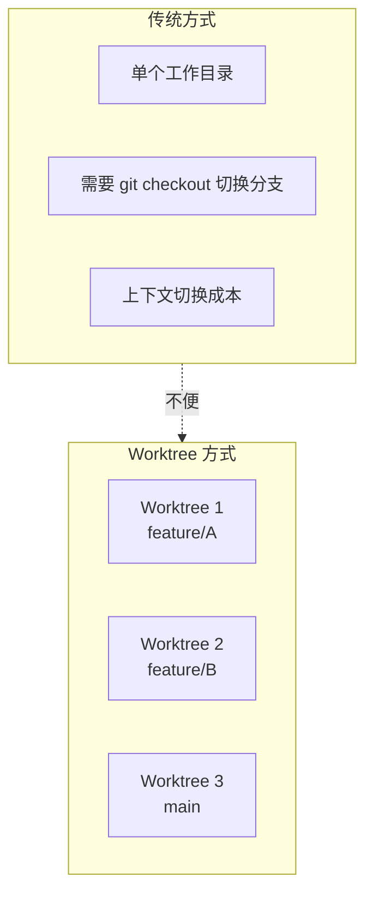
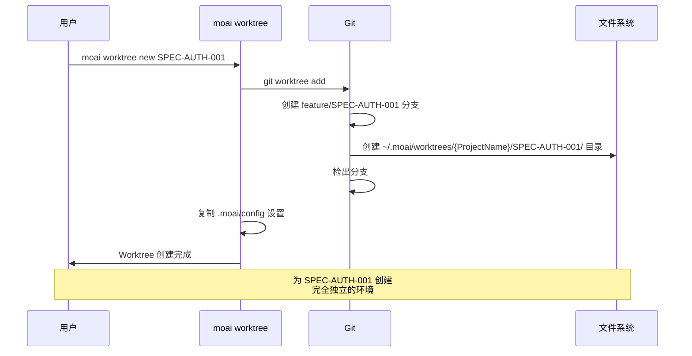
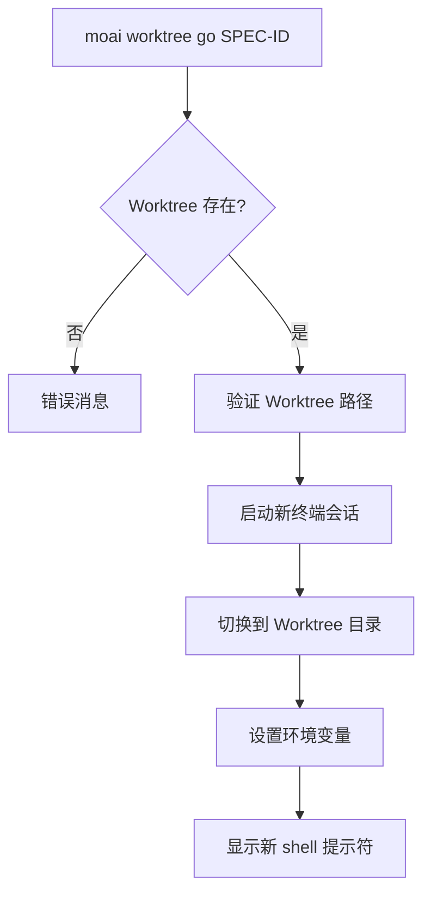
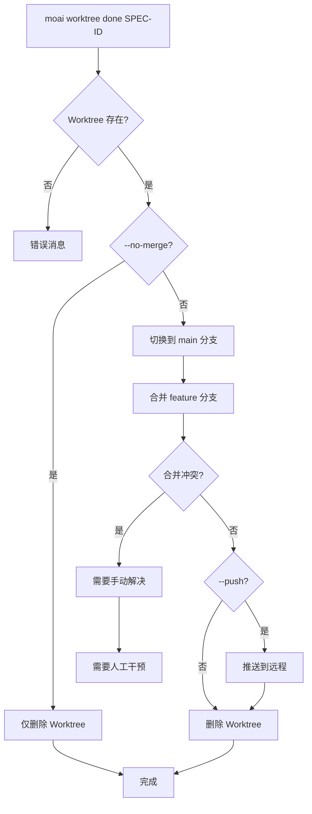
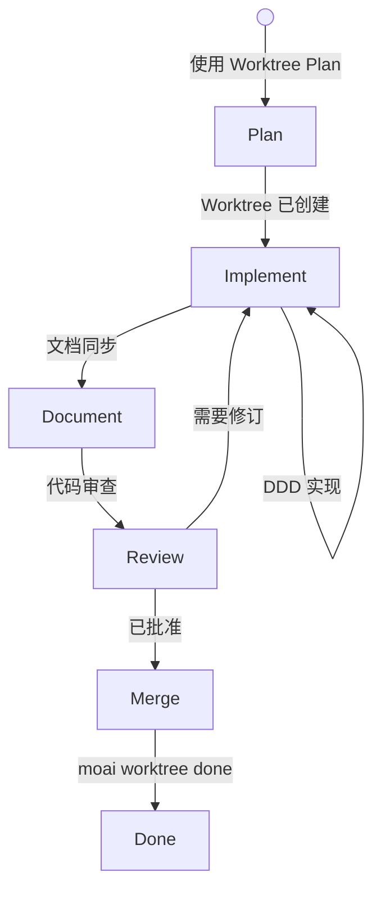
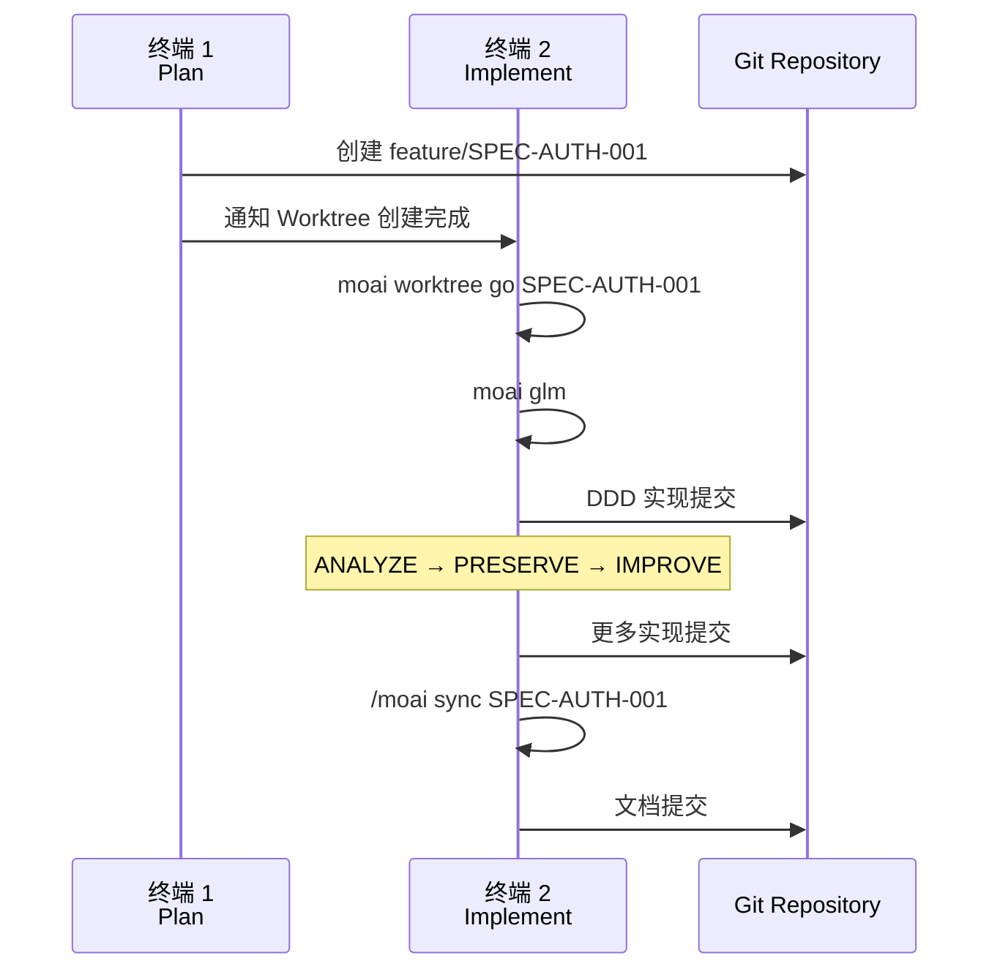
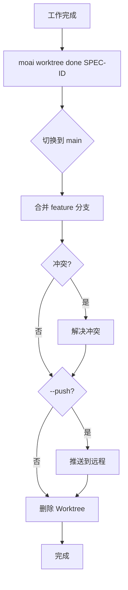
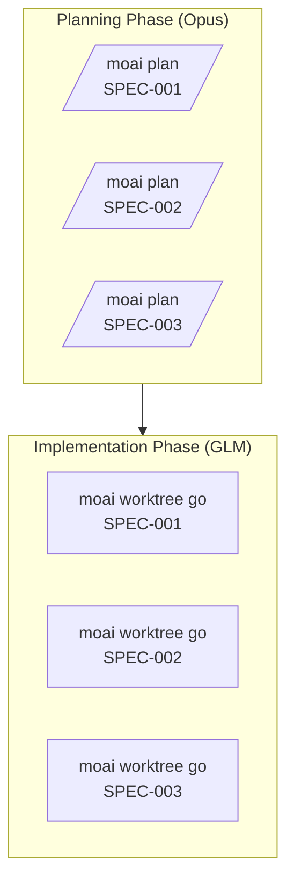
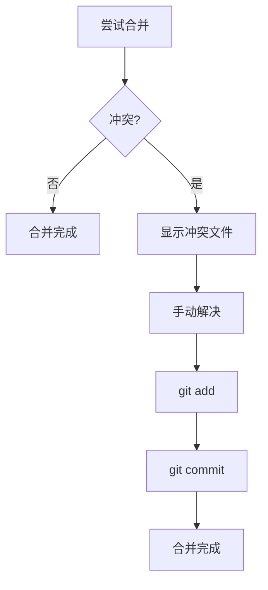
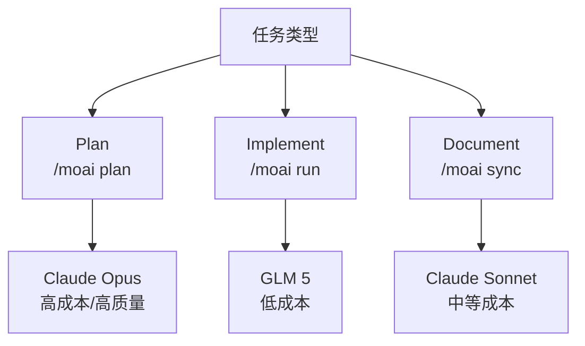

本指南详细说明使用 Git Worktree 进行 MoAI-ADK 并行开发的所有方面。

## 目录

1. [Worktree 基础](#worktree-基础)
2. [命令参考](#命令参考)
3. [工作流程指南](#工作流程指南)
4. [高级功能](#高级功能)
5. [最佳实践](#最佳实践)

---

## Worktree 基础

### 什么是 Git Worktree?

Git Worktree 是一个 Git 功能,允许您**同时在多个目录中处理同一个 Git 仓库**。



### MoAI-ADK 中的 Worktree

MoAI-ADK 使用 Git Worktree 为每个 SPEC 提供**完全独立的环境**:

- **独立 Git 状态**: 每个 Worktree 维护自己的分支和提交历史
- **独立的 LLM 设置**: 可以在每个 Worktree 中使用不同的 LLM
- **隔离的工作空间**: 文件系统级别的完全分离

---

## 命令参考

### moai worktree new

创建新的 Worktree。

#### 语法

```bash
moai worktree new SPEC-ID [options]
```

#### 参数

- **SPEC-ID** (必需): 要创建的 SPEC ID (例如: `SPEC-AUTH-001`)

#### 选项

- `-b, --branch BRANCH`: 指定要使用的分支名称 (默认: `feature/SPEC-ID`)
- `--from BASE`: 指定基础分支 (默认: `main`)
- `--force`: 如果 Worktree 已存在,强制重新创建

#### 使用示例

```bash
# 基本用法
moai worktree new SPEC-AUTH-001

# 从特定分支创建
moai worktree new SPEC-AUTH-001 --from develop

# 强制重新创建
moai worktree new SPEC-AUTH-001 --force
```

#### 操作过程



---

### moai worktree go

进入 Worktree 并启动新的 shell 会话。

#### 语法

```bash
moai worktree go SPEC-ID
```

#### 参数

- **SPEC-ID** (必需): 要进入的 Worktree ID

#### 使用示例

```bash
# 进入 Worktree
moai worktree go SPEC-AUTH-001

# 进入后更改 LLM
moai glm

# 启动 Claude Code
claude

# 开始工作
> /moai run SPEC-AUTH-001
```

#### 操作过程



---

### moai worktree list

列出所有 Worktree。

#### 语法

```bash
moai worktree list [options]
```

#### 选项

- `-v, --verbose`: 包含详细信息
- `--porcelain`: 以可解析格式输出

#### 使用示例

```bash
# 基本列表
moai worktree list

# 详细信息
moai worktree list --verbose

# 输出示例
SPEC-AUTH-001  feature/SPEC-AUTH-001  /path/to/worktree/SPEC-AUTH-001  [active]
SPEC-AUTH-002  feature/SPEC-AUTH-002  /path/to/worktree/SPEC-AUTH-002
SPEC-AUTH-003  feature/SPEC-AUTH-003  /path/to/worktree/SPEC-AUTH-003
```

---

### moai worktree done

完成 Worktree 工作并合并后清理。

#### 语法

```bash
moai worktree done SPEC-ID [options]
```

#### 参数

- **SPEC-ID** (必需): 要完成的 Worktree ID

#### 选项

- `--push`: 合并后推送到远程仓库
- `--no-merge`: 仅删除 Worktree 而不合并
- `--force`: 即使有冲突也强制合并

#### 使用示例

```bash
# 基本合并和清理
moai worktree done SPEC-AUTH-001

# 推送到远程
moai worktree done SPEC-AUTH-001 --push

# 仅删除而不合并
moai worktree done SPEC-AUTH-001 --no-merge
```

#### 操作过程



---

### moai worktree remove

删除 Worktree (不合并)。

#### 语法

```bash
moai worktree remove SPEC-ID [options]
```

#### 参数

- **SPEC-ID** (必需): 要删除的 Worktree ID

#### 选项

- `--force`: 即使有更改也强制删除
- `--keep-branch`: 保留分支,仅删除 Worktree

#### 使用示例

```bash
# 基本删除
moai worktree remove SPEC-AUTH-001

# 强制删除
moai worktree remove SPEC-AUTH-001 --force

# 保留分支
moai worktree remove SPEC-AUTH-001 --keep-branch
```

---

### moai worktree status

检查 Worktree 的状态。

#### 语法

```bash
moai worktree status [SPEC-ID]
```

#### 参数

- **SPEC-ID** (可选): 检查特定 Worktree 的状态 (未指定则显示所有)

#### 使用示例

```bash
# 所有 Worktree 状态
moai worktree status

# 特定 Worktree 状态
moai worktree status SPEC-AUTH-001

# 输出示例
Worktree: SPEC-AUTH-001
Branch: feature/SPEC-AUTH-001
Path: /path/to/worktree/SPEC-AUTH-001
Status: Clean (2 commits ahead of main)
LLM: GLM 5
```

---

### moai worktree clean

清理已合并或完成的 Worktree。

#### 语法

```bash
moai worktree clean [options]
```

#### 选项

- `--merged-only`: 仅清理已合并的 Worktree
- `--older-than DAYS`: 仅清理 N 天前的 Worktree
- `--dry-run`: 仅显示而不实际删除

#### 使用示例

```bash
# 清理已合并的 Worktree
moai worktree clean --merged-only

# 清理 7 天前的 Worktree
moai worktree clean --older-than 7

# 预览
moai worktree clean --dry-run
```

---

### moai worktree config

检查或修改 Worktree 设置。

#### 语法

```bash
moai worktree config [key] [value]
```

#### 参数

- **key** (可选): 设置键
- **value** (可选): 设置值

#### 使用示例

```bash
# 显示所有设置
moai worktree config

# 检查特定设置
moai worktree config root

# 更改设置
moai worktree config root /new/path/to/worktrees
```

---

## 工作流程指南

### 完整开发周期



### 步骤 1: SPEC 规划 (阶段 1)

```bash
# 在终端 1 中
> /moai plan "实现用户认证系统" --worktree
```

**输出**:

```
✓ SPEC 文档创建: .moai/specs/SPEC-AUTH-001/spec.md
✓ Worktree 创建: ~/.moai/worktrees/{ProjectName}/SPEC-AUTH-001
✓ 分支创建: feature/SPEC-AUTH-001
✓ 分支检出完成

下一步:
1. 在新终端中运行: moai worktree go SPEC-AUTH-001
2. 更改 LLM: moai glm
3. 开始开发: claude
```

### 步骤 2: 实现 (阶段 2)

```bash
# 在终端 2 中
moai worktree go SPEC-AUTH-001

# 进入 Worktree 后提示符更改
(SPEC-AUTH-001) $ moai glm
→ 已切换到 GLM 5

(SPEC-AUTH-001) $ claude
> /moai run SPEC-AUTH-001
```

**工作流程**:



### 步骤 3: 完成和合并 (阶段 3)

```bash
# 在终端 2 中完成工作后
exit

# 在终端 1 中
moai worktree done SPEC-AUTH-001 --push
```

**流程**:



---

## 高级功能

### 并行工作策略

#### 策略 1: 分离 Plan 和 Implement



#### 策略 2: 同时开发

```bash
# 终端 1: SPEC-001 Plan
> /moai plan "认证" --worktree

# 终端 2: SPEC-002 Plan (完成后)
> /moai plan "日志" --worktree

# 终端 3, 4, 5: 并行实现
moai worktree go SPEC-001 && moai glm  # 终端 3
moai worktree go SPEC-002 && moai glm  # 终端 4
moai worktree go SPEC-003 && moai glm  # 终端 5
```

### Worktree 之间切换

```bash
# 检查当前 Worktree
moai worktree status

# 切换到不同的 Worktree
moai worktree go SPEC-AUTH-002

# 或直接导航
cd ~/.moai/worktrees/SPEC-AUTH-002
```

### 冲突解决



---

## 最佳实践

### 1. Worktree 命名规范

```bash
# 好的示例
moai worktree new SPEC-AUTH-001      # 清晰的 SPEC ID
moai worktree new SPEC-FRONTEND-007  # 包含类别

# 避免
moai worktree new feature-branch     # 没有 SPEC ID
moai worktree new temp               # 模糊的名称
```

### 2. 定期清理

```bash
# 每周运行
moai worktree clean --merged-only

# 每月运行
moai worktree clean --older-than 30
```

### 3. LLM 选择指南



### 4. 提交消息规范

```bash
# 在 Worktree 中提交时
git commit -m "feat(SPEC-AUTH-001): 实现基于 JWT 的认证

- 添加 JWT 令牌生成/验证逻辑
- 实现刷新令牌轮换
- 在登出时使令牌无效

Co-Authored-By: Claude <noreply@anthropic.com>"
```

### 5. 终端管理

```bash
# 为每个 Worktree 使用单独的终端
# 推荐使用 iTerm2、VS Code 或 tmux

# tmux 示例
tmux new-session -d -s spec-001 'moai worktree go SPEC-001'
tmux new-session -d -s spec-002 'moai worktree go SPEC-002'

# 切换会话
tmux attach-session -t spec-001
```

### 6. 进度跟踪

```bash
# 检查所有 Worktree 状态
moai worktree status --verbose

# 检查 Git 日志
cd ~/.moai/worktrees/{ProjectName}/SPEC-AUTH-001
git log --oneline --graph --all

# 检查更改
git diff main
```

## 相关文档

- [Git Worktree 概述](./index)
- [实际使用示例](./examples)
- [FAQ](./faq)
