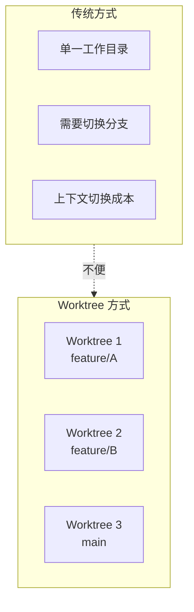
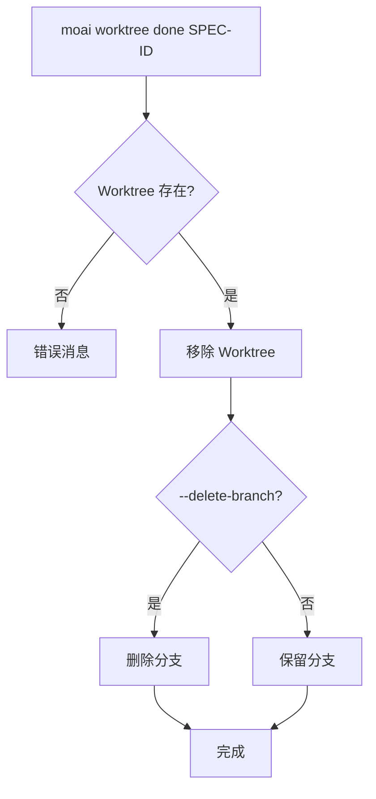
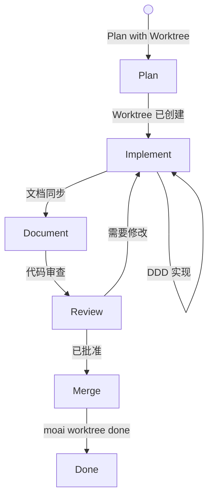
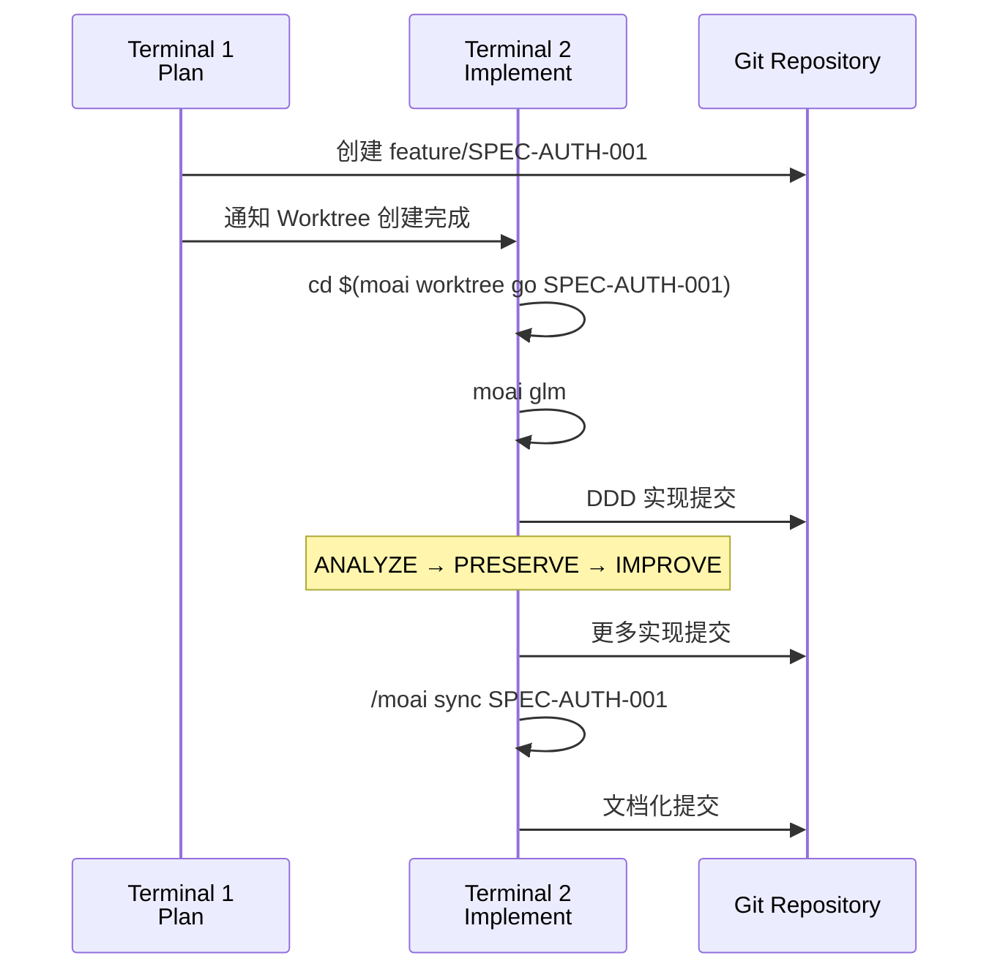
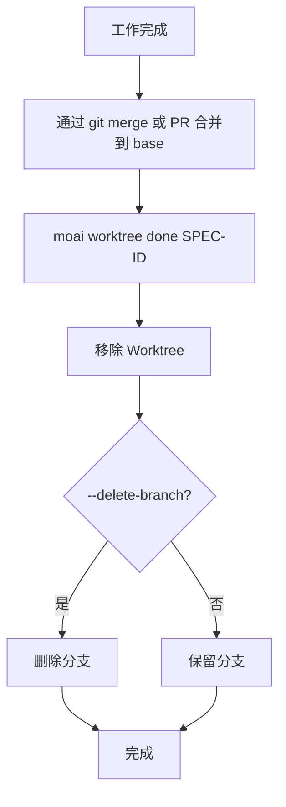
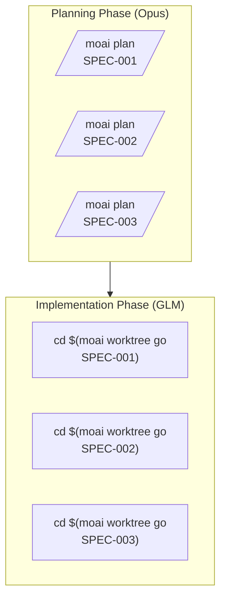
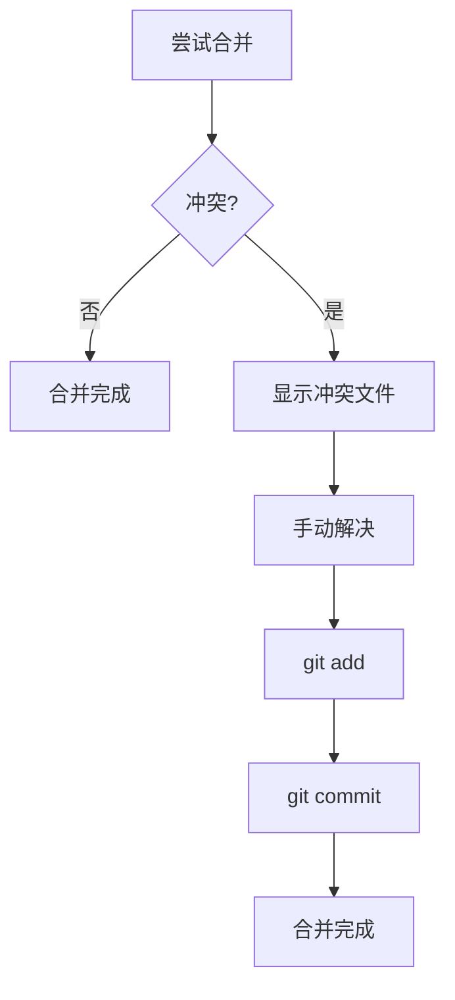
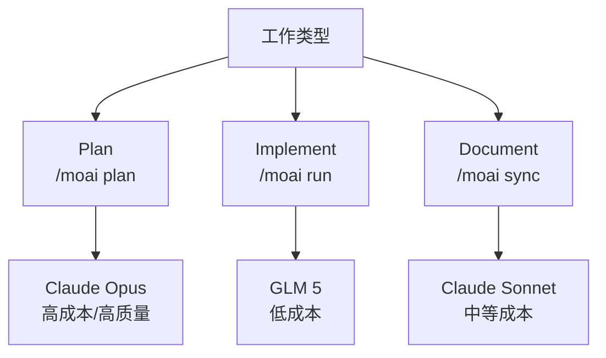

使用 Git Worktree 进行 MoAI-ADK 并行开发的一切 —— 从基础概念、命令参考、工作流到最佳实践,这一篇文档全部讲清。

## 目录

1. [Worktree 基础](#worktree-基础)
2. [命令详细参考](#命令详细参考)
3. [工作流指南](#工作流指南)
4. [高级功能](#高级功能)
5. [最佳实践](#最佳实践)

---

## Worktree 基础

### 什么是 Git Worktree?

Git Worktree 是 Git 内置功能,让你能**在多个目录中同时对同一个 Git 仓库工作**。不用每次在分支间移动时都用 `git checkout` 切换上下文,而是为每个分支各开一个目录。


```mermaid
graph TB
    subgraph Traditional["传统方式"]
        T1[单一工作目录]
        T2[需要切换分支]
        T3[上下文切换成本]
    end

    subgraph Worktree["Worktree 方式"]
        W1[Worktree 1<br/>feature/A]
        W2[Worktree 2<br/>feature/B]
        W3[Worktree 3<br/>main]
    end

    Traditional -.->|不便| Worktree
```

### MoAI-ADK 中的 Worktree

MoAI-ADK 在这一功能之上叠加了 SPEC 单位的隔离环境。因为每个 SPEC 都拥有完全独立的环境,即使多个智能体并行工作也不会踩到彼此的工作:

- **独立的 Git 状态** —— 每个 Worktree 维护自己的分支和提交历史
- **分离的 LLM 设置** —— 每个 Worktree 可以使用不同的 LLM 执行模式。给计划分配 Claude、给实现分配 GLM 的托克诺米克斯运用就来源于此
- **隔离的工作空间** —— 在文件系统层面完全分离

---

## 命令详细参考

### moai worktree new

创建新的 Worktree。

#### 语法

```bash
moai worktree new SPEC-ID [options]
```

#### 参数

- **SPEC-ID** (必需): 要创建的 SPEC 的 ID (例: `SPEC-AUTH-001`)

#### 选项

- `--path PATH`: 直接指定 Worktree 路径 (默认: SPEC ID 时为 `~/.moai/worktrees/<ProjectName>/<SPEC-ID>`,其他为 `../<branch-name>`)
- `--base BRANCH`: 基准分支 (默认: `origin/main`,自动 fetch)。本地专属提交请用 `--base main`
- `--from-current`: 以当前 HEAD 为基准 (跳过 `git fetch origin main`,与 `--base` 互斥)
- `--tmux`: 创建 Worktree 后创建 tmux 会话
- `--team`: 在新 Worktree 中自动启动 Claude/GLM 会话

#### 使用示例

```bash
# 基本用法 (基于 origin/main)
moai worktree new SPEC-AUTH-001

# 基于本地 main 创建
moai worktree new SPEC-AUTH-001 --base main

# 基于当前 HEAD 创建
moai worktree new SPEC-AUTH-001 --from-current

# 连同 tmux 会话一起创建
moai worktree new SPEC-AUTH-001 --tmux
```

#### 动作过程


```mermaid
sequenceDiagram
    participant User as 用户
    participant CLI as moai worktree
    participant Git as Git
    participant FS as 文件系统

    User->>CLI: moai worktree new SPEC-AUTH-001
    CLI->>Git: git worktree add
    Git->>Git: 创建 feature/SPEC-AUTH-001 分支
    Git->>FS: 创建 ~/.moai/worktrees/{ProjectName}/SPEC-AUTH-001/ 目录
    Git->>Git: 检出分支
    CLI->>CLI: 复制 .moai/config 设置
    CLI->>User: Worktree 创建完成

    Note over User,FS: 为 SPEC-AUTH-001 创建<br/>完全独立的环境
```

---

### moai worktree go

输出 Worktree 路径。它只把路径字符串输出到标准输出以供 shell 导航使用,不会直接启动 shell 会话。与 shell 的 `cd` 组合使用。

#### 语法

```bash
moai worktree go SPEC-ID
```

#### 参数

- **SPEC-ID** (必需): 要输出路径的 Worktree 的 ID

#### 使用示例

```bash
# 只输出路径
moai worktree go SPEC-AUTH-001

# 移动到输出的路径
cd "$(moai worktree go SPEC-AUTH-001)"

# 移动后开始开发
moai glm
claude
> /moai run SPEC-AUTH-001
```

#### 动作过程

```mermaid
flowchart TD
    A[moai worktree go SPEC-ID] --> B{Worktree 存在?}
    B -->|否| C[错误消息]
    B -->|是| D[把 Worktree 路径输出到 stdout]
    D --> E["在 shell 中活用,如 cd \"$(...)\""]
```

---

### moai worktree list

显示所有 Worktree 的列表。

#### 语法

```bash
moai worktree list [options]
```

#### 选项

- `-v, --verbose`: 包含每个 Worktree 的详细信息

#### 使用示例

```bash
# 基本列表
moai worktree list

# 详细信息
moai worktree list --verbose

# 输出示例
SPEC-AUTH-001  feature/SPEC-AUTH-001  ~/.moai/worktrees/your-project/SPEC-AUTH-001  [active]
SPEC-AUTH-002  feature/SPEC-AUTH-002  ~/.moai/worktrees/your-project/SPEC-AUTH-002
SPEC-AUTH-003  feature/SPEC-AUTH-003  ~/.moai/worktrees/your-project/SPEC-AUTH-003
```

---

### moai worktree done

移除 Worktree 并可选地删除分支。**它不执行合并、推送** —— 到 base 分支的合并请用 `git merge` 或 PR 另行进行。

#### 语法

```bash
moai worktree done SPEC-ID [options]
```

#### 参数

- **SPEC-ID** (必需): 要完成的 Worktree 的 ID

#### 选项

- `--force`: 即使有未提交的变更也强制移除
- `--delete-branch`: 移除 Worktree 后也删除分支
- `--auto`: 用于自动化的无输出模式 (例: PR 合并后清理)

#### 使用示例

```bash
# 移除 Worktree
moai worktree done SPEC-AUTH-001

# 移除 Worktree + 删除分支
moai worktree done SPEC-AUTH-001 --delete-branch

# PR 合并后自动清理 (无输出)
moai worktree done SPEC-AUTH-001 --auto
```

#### 动作过程


```mermaid
flowchart TD
    A[moai worktree done SPEC-ID] --> B{Worktree 存在?}
    B -->|否| C[错误消息]
    B -->|是| D[移除 Worktree]
    D --> E{--delete-branch?}
    E -->|是| F[删除分支]
    E -->|否| G[保留分支]
    F --> H[完成]
    G --> H[完成]
```

---

### moai worktree remove

移除 Worktree (无合并)。分支被保留。

#### 语法

```bash
moai worktree remove PATH [options]
```

#### 参数

- **PATH** (必需): 要移除的 Worktree 的路径

#### 选项

- `--force`: 即使有未提交的变更也强制移除

#### 使用示例

```bash
# 基本移除
moai worktree remove ~/.moai/worktrees/your-project/SPEC-AUTH-001

# 强制移除
moai worktree remove ~/.moai/worktrees/your-project/SPEC-AUTH-001 --force
```

---

### moai worktree status

确认 Worktree 的状态。

#### 语法

```bash
moai worktree status [options]
```

#### 选项

- `--all`: 显示包含完整提交哈希的所有详细信息

#### 使用示例

```bash
# Worktree 状态
moai worktree status

# 完整详细信息
moai worktree status --all

# 输出示例 (rounded-border 卡片; status 会自动 prune stale 引用后再显示)
╭─ Worktree Status ────────────────────────────────────────────╮
│ Repository: /path/to/your-project                            │
│ Total worktrees: 1                                           │
│                                                              │
│ feature/SPEC-AUTH-001                                        │
│   Path: ~/.moai/worktrees/your-project/SPEC-AUTH-001         │
│   HEAD: 4f3a2b1c                                             │
╰──────────────────────────────────────────────────────────────╯
```

---

### moai worktree clean

清理已合并或已完成的 Worktree。

#### 语法

```bash
moai worktree clean [options]
```

#### 选项

- `--merged-only`: 只移除分支已合并到 base 的 Worktree
- `--base BRANCH`: 用于 `--merged-only` 判定的 base 分支 (默认: `main`)

#### 使用示例

```bash
# 清理已合并的 Worktree (base=main)
moai worktree clean --merged-only

# 基于其他 base 分支清理
moai worktree clean --merged-only --base develop
```

---

### moai worktree config

显示 Worktree 设置。设置值派生自 Git 仓库,因此为**只读**(不支持 `config set`)。

#### 语法

```bash
moai worktree config [key]
```

#### 参数

- **key** (可选): 要显示的设置键。可用键为 `root` (仓库根目录)、
  `all` (全部设置,默认)

#### 使用示例

```bash
# 显示所有设置
moai worktree config
# Worktree Configuration:
#   root: /path/to/your-project

# 确认特定设置
moai worktree config root
# Worktree root: /path/to/your-project
```

---

### moai worktree sync

将 Worktree 与 base 分支的变更同步。

```bash
# 将当前目录 Worktree 与 main 同步 (merge 策略,默认)
moai worktree sync

# 用 rebase 策略同步特定 Worktree
moai worktree sync SPEC-AUTH-001 --strategy rebase

# 基于其他 base 分支
moai worktree sync SPEC-AUTH-001 --base develop
```

选项: `--base` (基准分支,默认 `main`)、`--strategy` (`merge` 或 `rebase`,
默认 `merge`)。

---

### moai worktree switch

切换到与给定分支关联的 Worktree 目录。

```bash
moai worktree switch SPEC-AUTH-001
```

与只输出路径的 `go` 不同,`switch` 会按分支名查找 Worktree 并提供移动引导。

---

### moai worktree recover

扫描磁盘并执行 `git worktree repair` 以修复损坏的 Worktree 注册表。

```bash
moai worktree recover
```

---

### moai worktree clean vs recover vs 状态守卫

`clean` 清理 stale 引用,`recover` 修复注册表。下面三个命令是编排器在
`Agent(isolation: "worktree")` 调用前后对工作树状态进行快照、校验、恢复的
状态守卫原语。

#### moai worktree snapshot

捕获 HEAD、分支、porcelain、`.moai/specs/` 下 untracked 文件状态,并以 JSON
写入 `.moai/state/`。

```bash
moai worktree snapshot --agent-name my-agent --out .moai/state/snap.json
```

#### moai worktree verify

将当前工作树与快照比较。退出码: `0`=clean、`1`=divergence、
`2`=suspect(空 worktreePath)、`3`=两者皆有。

```bash
moai worktree verify --snapshot .moai/state/snap.json --agent-name my-agent
```

#### moai worktree restore

执行 `git restore --source=<snapshot HEAD> --staged --worktree :/` 将工作树
恢复到快照 HEAD 状态。Untracked 文件不会被 git 恢复,因此只会给出路径引导,
需要手动重新生成。

```bash
moai worktree restore --snapshot .moai/state/snap.json

# 不执行,只输出命令
moai worktree restore --snapshot .moai/state/snap.json --dry-run
```

---

## 工作流指南

### 完整开发周期


```mermaid
flowchart TD
    Start(( )) -->|"Plan with Worktree"| Plan["Plan"]
    Plan -->|"Worktree 已创建"| Implement["Implement"]
    Implement -->|"DDD 实现"| Implement
    Implement -->|"文档同步"| Document["Document"]
    Document -->|"代码审查"| Review["Review"]
    Review -->|"已批准"| Merge["Merge"]
    Review -->|"需要修改"| Implement
    Merge -->|"moai worktree done"| Done["Done"]
```

### 第 1 步: SPEC 计划 (Phase 1)

```bash
# 在 Terminal 1
> /moai plan "实现用户认证系统" --worktree
```

**输出**:

```
✓ SPEC 文档创建: .moai/specs/SPEC-AUTH-001/spec.md
✓ Worktree 创建: ~/.moai/worktrees/{ProjectName}/SPEC-AUTH-001
✓ 分支创建: feature/SPEC-AUTH-001
✓ 分支切换完成

下一步:
1. 在新终端运行: cd "$(moai worktree go SPEC-AUTH-001)"
2. 更换 LLM: moai glm
3. 开始开发: claude
```

### 第 2 步: 实现 (Phase 2)

```bash
# 在 Terminal 2 (moai worktree go 输出路径 → 用 cd 移动)
cd "$(moai worktree go SPEC-AUTH-001)"

# 移动到 Worktree 后切换 LLM 后端
$ moai glm

$ claude
> /moai run SPEC-AUTH-001
```

**工作流程**:


```mermaid
sequenceDiagram
    participant T1 as Terminal 1<br/>Plan
    participant T2 as Terminal 2<br/>Implement
    participant Git as Git Repository

    T1->>Git: 创建 feature/SPEC-AUTH-001
    T1->>T2: 通知 Worktree 创建完成

    T2->>T2: cd $(moai worktree go SPEC-AUTH-001)
    T2->>T2: moai glm
    T2->>Git: DDD 实现提交
    Note over T2: ANALYZE → PRESERVE → IMPROVE

    T2->>Git: 更多实现提交
    T2->>T2: /moai sync SPEC-AUTH-001
    T2->>Git: 文档化提交
```

### 第 3 步: 完成与合并 (Phase 3)

```bash
# 在 Terminal 2 完成工作后 (push 通过 git/PR 另行进行)
exit

# base 分支合并用 git merge 或 PR 处理后,
# 在 Terminal 1 清理 Worktree
moai worktree done SPEC-AUTH-001 --delete-branch
```

**流程**:


```mermaid
flowchart TD
    A[工作完成] --> B[通过 git merge 或 PR 合并到 base]
    B --> C[moai worktree done SPEC-ID]
    C --> D[移除 Worktree]
    D --> E{--delete-branch?}
    E -->|是| F[删除分支]
    E -->|否| G[保留分支]
    F --> H[完成]
    G --> H[完成]
```

---

## 高级功能

### 并行工作策略

#### 策略 1: 分离 Plan 与 Implement

这是托克诺米克斯的基本策略。计划阶段用高推理模型 (Opus) 集中处理,实现阶段用低成本模型 (GLM) 并行分散:


```mermaid
graph TB
    subgraph Planning["Planning Phase (Opus)"]
        P1[/moai plan<br/>SPEC-001/]
        P2[/moai plan<br/>SPEC-002/]
        P3[/moai plan<br/>SPEC-003/]
    end

    subgraph Implementation["Implementation Phase (GLM)"]
        I1["cd $(moai worktree go<br/>SPEC-001)"]
        I2["cd $(moai worktree go<br/>SPEC-002)"]
        I3["cd $(moai worktree go<br/>SPEC-003)"]
    end

    Planning --> Implementation
```

#### 策略 2: 同时开发

```bash
# Terminal 1: SPEC-001 Plan
> /moai plan "认证" --worktree

# Terminal 2: SPEC-002 Plan (完成后)
> /moai plan "日志" --worktree

# Terminal 3、4、5: 并行实现
cd "$(moai worktree go SPEC-001)" && moai glm  # Terminal 3
cd "$(moai worktree go SPEC-002)" && moai glm  # Terminal 4
cd "$(moai worktree go SPEC-003)" && moai glm  # Terminal 5
```

### Worktree 间切换

```bash
# 确认当前 Worktree
moai worktree status

# 切换到其他 Worktree (输出路径 → cd)
cd "$(moai worktree go SPEC-AUTH-002)"

# 或直接移动
cd ~/.moai/worktrees/your-project/SPEC-AUTH-002
```

### 冲突解决


```mermaid
flowchart TD
    A[尝试合并] --> B{冲突?}
    B -->|否| C[合并完成]
    B -->|是| D[显示冲突文件]
    D --> E[手动解决]
    E --> F[git add]
    F --> G[git commit]
    G --> H[合并完成]
```

---

## 最佳实践

### 1. Worktree 命名规范

```bash
# 好的示例
moai worktree new SPEC-AUTH-001      # 明确的 SPEC ID
moai worktree new SPEC-FRONTEND-007  # 包含类别

# 应避免的示例
moai worktree new feature-branch     # 未使用 SPEC ID
moai worktree new temp               # 模糊的名称
```

### 2. 定期清理

```bash
# 定期清理已合并的 Worktree
moai worktree clean --merged-only
```

### 3. LLM 选择指南

按工作阶段分别分配模型是 Worktree 托克诺米克斯的核心:


```mermaid
graph TD
    A[工作类型] --> B[Plan<br/>/moai plan]
    A --> C[Implement<br/>/moai run]
    A --> D[Document<br/>/moai sync]

    B --> E[Claude Opus<br/>高成本/高质量]
    C --> F[GLM 5<br/>低成本]
    D --> G[Claude Sonnet<br/>中等成本]
```

### 4. 提交信息规范

```bash
# 在 Worktree 中提交时
git commit -m "feat(SPEC-AUTH-001): 实现基于 JWT 的认证

- 添加 JWT 令牌生成/验证逻辑
- 实现刷新令牌轮换
- 登出时令牌失效

Co-Authored-By: Claude <noreply@anthropic.com>"
```

### 5. 终端管理

```bash
# 每个 Worktree 使用单独的终端
# 推荐使用 iTerm2、VS Code 或 tmux

# tmux 示例
tmux new-session -d -s spec-001 -c "$(moai worktree go SPEC-001)"
tmux new-session -d -s spec-002 -c "$(moai worktree go SPEC-002)"

# 切换会话
tmux attach-session -t spec-001
```

### 6. 跟踪进度

```bash
# 确认所有 Worktree 状态
moai worktree status --all

# 确认 Git 日志
cd ~/.moai/worktrees/{ProjectName}/SPEC-AUTH-001
git log --oneline --graph --all

# 确认变更
git diff main
```

## tmux 集成与自动合并

### moai worktree new --tmux 标志

自动创建 tmux 会话,可在工作树环境中进行隔离开发。

```bash
moai worktree new SPEC-AUTH-001 --tmux
```

**动作流程:**
1. 创建 Worktree (既有动作)
2. 自动创建 tmux 会话 (名称: `moai-{ProjectName}-{SPEC-ID}`)
3. 根据 LLM 模式注入环境变量 (GLM/CG 模式)
4. cd 到 Worktree 后执行 `/moai run {SPEC-ID}`

```bash
# 附加 tmux 会话
tmux attach-session -t moai-my-project-SPEC-AUTH-001
```


未安装 tmux 时 graceful degradation: 会显示手动 cd 引导消息。


### 执行模式选择门 (Decision Point 3.5)

`/moai plan` 完成后、Run 开始前,自动检测执行模式并请求用户选择。

**tmux 可用时 (2 个选项):**
- Worktree + \{当前模式\} (Recommended): 创建工作树 + tmux 会话后执行
- Sub-agent Mode: 顺序执行子智能体

**tmux 不可用时:**
- Sub-agent Mode (Recommended): 顺序执行子智能体


静态 Agent Teams 编排层已废弃。并行协作由 Claude Code 原生团队成员运行时
(`moai cg` 的 GLM tmux 窗格、CG 模式) 运营 —— 详情请参考 CG 模式文档。


### Auto-merge 默认动作

在工作树上下文中执行 `/moai sync` 时,auto-merge 是默认动作。

| 标志 | 动作 |
|--------|------|
| (无) | 在工作树上下文中自动合并 |
| `--merge` | Deprecated (显示警告) |
| `--skip-mx` | 跳过 @MX 标签扫描步骤 |

### 合并后自动清理

PR 合并成功时自动清理:
- 移除工作树目录
- 删除特性分支 (`--delete-branch`)
- 更新注册表


清理失败不会影响合并结果。失败时手动清理: `moai worktree done SPEC-{ID}`


### 错误处理 (errors.go)

提供结构化的错误类型和恢复命令。

| 错误类型 | 说明 | 恢复命令 |
|-----------|------|-----------|
| `WorktreeCreateError` | Worktree 创建失败 | `moai worktree new {SPEC-ID}` |
| `TmuxNotAvailableError` | tmux 不可用 | `cd {path} && /moai run {SPEC-ID}` |
| `AutoMergeBlockedError` | 自动合并被阻止 | `/moai sync {SPEC-ID}` |
| `CleanupFailedError` | 清理失败 | `moai worktree done {SPEC-ID}` |

## 相关文档

- [Git Worktree 概述](/zh/worktree/)
- [实际使用示例](/zh/worktree/examples)
- [常见问题](/zh/worktree/faq)
