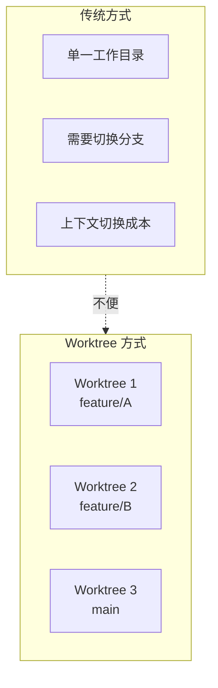
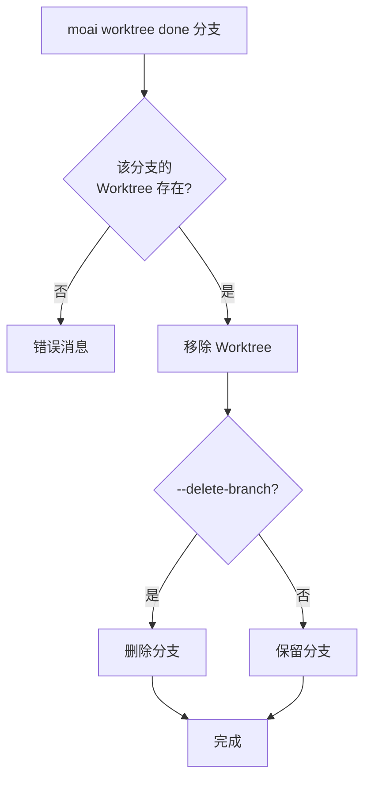
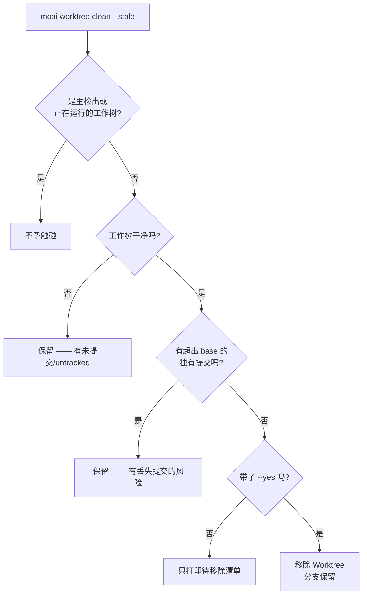
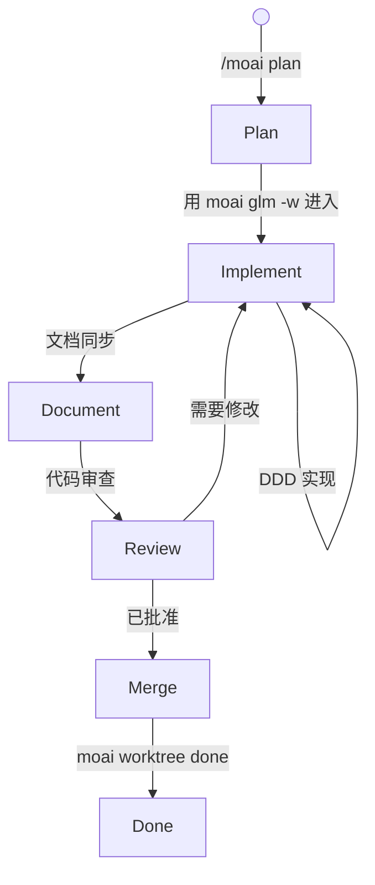
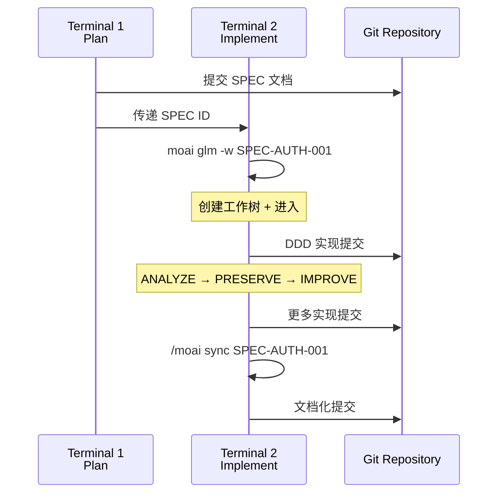
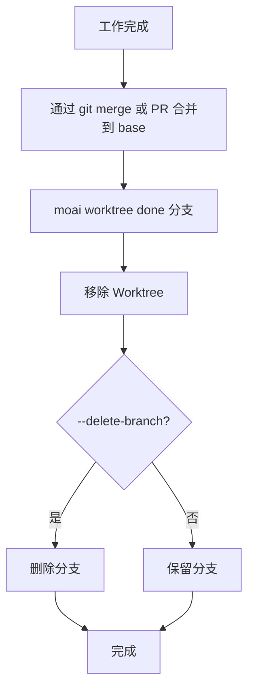
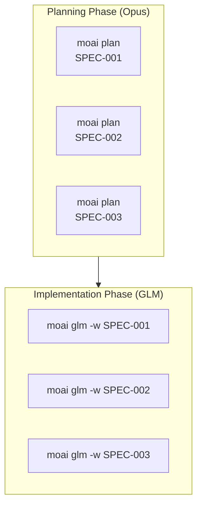
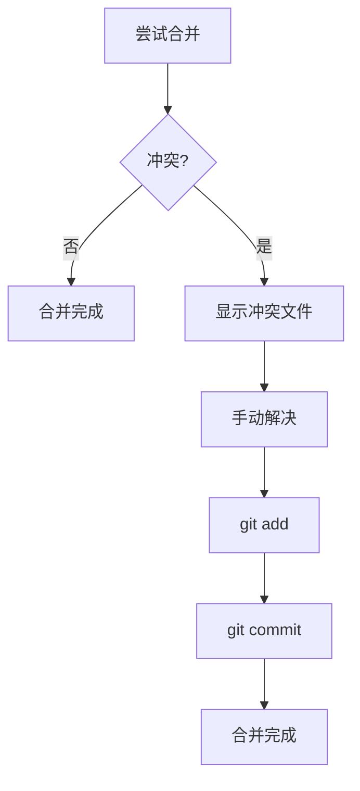
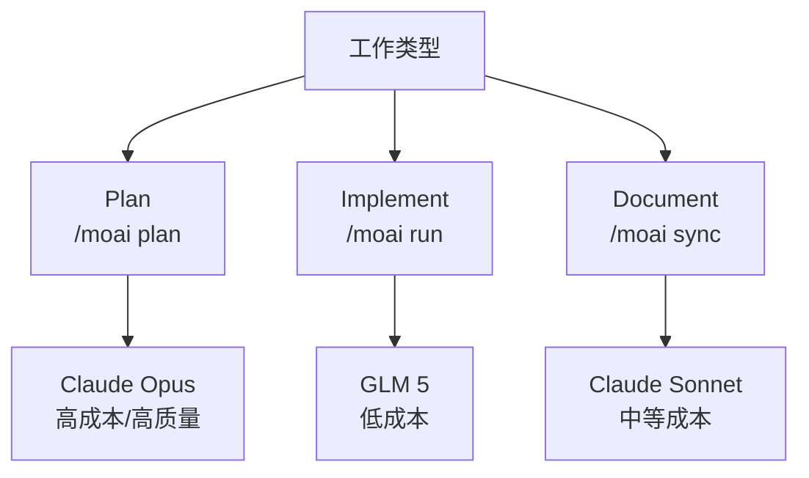

用 Git Worktree 做 MoAI-ADK 并行开发的一切都收在这一篇里,从基础概念、命令
参考、工作流一直讲到最佳实践。

## 目录

1. [Worktree 基础](#worktree-基础)
2. [命令详细参考](#命令详细参考)
3. [工作流指南](#工作流指南)
4. [高级功能](#高级功能)
5. [最佳实践](#最佳实践)

---

## Worktree 基础

### 什么是 Git Worktree?

Git Worktree 是 Git 内置功能,让你能**在多个目录中同时对同一个 Git 仓库工作**。
不必每次切换分支都用 `git checkout` 换掉上下文,而是为每个分支各开一个目录。


```mermaid
graph TD
    subgraph Traditional["传统方式"]
        T1[单一工作目录]
        T2[需要切换分支]
        T3[上下文切换成本]
    end

    subgraph Worktree["Worktree 方式"]
        W1[Worktree 1<br/>feature/A]
        W2[Worktree 2<br/>feature/B]
        W3[Worktree 3<br/>main]
    end

    Traditional -.->|不便| Worktree
```

### MoAI-ADK 中的 Worktree

MoAI-ADK 在这一功能之上叠加了 SPEC 单位的隔离环境。因为每个 SPEC 的环境彻底
分开,即使多个智能体并行工作也不会踩到彼此的成果:

- **独立的 Git 状态** —— 每个 Worktree 维护自己的分支和提交历史
- **分离的 LLM 设置** —— 每个 Worktree 可以使用不同的 LLM 执行模式。给计划分配
  Claude、给实现分配 GLM 的代币经济学运用就来源于此
- **隔离的工作空间** —— 在文件系统层面完全分离

### 分工:进入靠启动器,管理靠 worktree,查询靠 git

三件事分别落在不同的命令上。先把这条边界划清楚,后面的内容就好读了。

| 你想做的事 | 负责方 |
|-----------|------|
| 创建 Worktree、进入 Worktree | 启动器 `moai cc`、`moai glm`、`moai cg` 的 `-w` 标志 |
| 查看 Worktree 列表 | `git worktree list` |
| 同步、清理、恢复、状态守卫 | `moai worktree` (别名 `moai wt`) 子命令 |

---

## 命令详细参考

### 创建 Worktree 并进入

`moai worktree` 里没有创建命令。工作树由启动器的 `-w` 标志创建,并当场把会话
也一起拉起来。

#### 语法

```bash
moai cc  -w [名称] [--spawn]
moai glm -w [名称] [--spawn]
moai cg  -w [名称] [--spawn]
```

#### `-w` 的取值如何解析

- **短名称** (`feat-auth`) —— 在 `.claude/worktrees/feat-auth/` 下解析,不存在
  就新建
- **绝对路径** —— 重新进入 `~/.moai/worktrees/` 或
  `<项目>/.claude/worktrees/` 下的既有工作树
- **省略取值** (只写 `-w`) —— 自动生成名称
- 上述两个前缀之外的绝对路径会被拒绝,以免误把工作树建到奇怪的位置

#### `--spawn`:守住当前会话再开一个

只给 `-w` 时,当前进程会被**替换**成工作树会话。想保留现在这个窗口再多开一个
工作树,就加上 `--spawn`。它会打开一个新的 tmux 窗口(焦点不变),并输出可供
切换的 pane ID。

`--spawn` 只在 tmux 会话内有效。在 tmux 之外使用时,它什么都不改动,直接以错误
结束。

#### 使用示例

```bash
# 创建工作树并以 Claude 后端进入
moai cc -w feat-auth

# 以 GLM 后端进入同一个工作树
moai glm -w feat-auth

# 保留当前会话 + 在新 tmux 窗口中启动 GLM 队友
moai cg -w feat-auth --spawn

# 想在任意位置手动建工作树,直接用 git
git worktree add -b feature/SPEC-AUTH-001 \
    ~/.moai/worktrees/your-project/SPEC-AUTH-001 origin/main
moai glm -w ~/.moai/worktrees/your-project/SPEC-AUTH-001
```

#### 查看列表

```bash
git worktree list
```

---

### moai worktree sync

把 base 分支的变更同步进 Worktree。

#### 语法

```bash
moai worktree sync [branch-name]
```

#### 参数

- **branch-name** (可选): 要同步的工作树所在分支。省略时以当前目录所在的工作树
  为对象

#### 选项

- `--base BRANCH`: 基准分支 (默认值: `main`)
- `--strategy MODE`: `merge` (默认值) 或 `rebase`

#### 使用示例

```bash
# 把当前目录的 Worktree 与 main 同步 (merge 策略,默认)
moai worktree sync

# 用 rebase 策略同步指定的 Worktree
moai worktree sync feature/SPEC-AUTH-001 --strategy rebase

# 基于其他 base 分支
moai worktree sync feature/SPEC-AUTH-001 --base develop
```

---

### moai worktree done

删掉分支所属的 Worktree,需要的话连分支一起删除。不过它**既不合并也不推送**。
到 base 分支的合并请用 `git merge` 或 PR 另行完成。

#### 语法

```bash
moai worktree done <branch-name>
```

#### 参数

- **branch-name** (必需,恰好一个): 要清理的工作树所在的分支名。给出
  `SPEC-AUTH-001` 这样的 SPEC ID 形式时,会展开为 `feature/SPEC-AUTH-001`

#### 选项

- `--force`: 即使有未提交的变更也强制移除
- `--delete-branch`: 移除 Worktree 后也删除分支
- `--auto`: 供自动化使用的静默模式。找不到工作树也不会以错误结束,很适合挂在 PR
  合并之后的清理步骤上

#### 使用示例

```bash
# 移除 Worktree
moai worktree done feature/SPEC-AUTH-001

# 移除 Worktree + 删除分支
moai worktree done feature/SPEC-AUTH-001 --delete-branch

# PR 合并后自动清理 (无输出)
moai worktree done feature/SPEC-AUTH-001 --auto
```

#### 动作过程


```mermaid
flowchart TD
    A[moai worktree done 分支] --> B{该分支的<br/>Worktree 存在?}
    B -->|否| C[错误消息]
    B -->|是| D[移除 Worktree]
    D --> E{--delete-branch?}
    E -->|是| F[删除分支]
    E -->|否| G[保留分支]
    F --> H[完成]
    G --> H[完成]
```

---

### moai worktree remove

移除 Worktree (无合并)。分支被保留。

#### 语法

```bash
moai worktree remove <path>
```

#### 参数

- **path** (必需,恰好一个): 要移除的 Worktree 的**文件系统路径**。不是分支名
  也不是 SPEC ID

#### 选项

- `--force`: 即使有未提交的变更也强制移除

#### 使用示例

```bash
# 基本移除
moai worktree remove ~/.moai/worktrees/your-project/SPEC-AUTH-001

# 强制移除
moai worktree remove ~/.moai/worktrees/your-project/SPEC-AUTH-001 --force
```

---

### moai worktree clean

清理 stale 引用,并挑出已合并或已废弃的 Worktree 移除。

#### 语法

```bash
moai worktree clean [options]
```

#### 选项

- (无标志): 只 prune stale 的工作树引用
- `--merged-only`: 只移除分支已合并进 base 的 Worktree
- `--stale`: 清扫没有任何东西可失去的废弃 Worktree (默认只预览)
- `--yes`: 不再预览,真正执行 `--stale` 的移除
- `--json`: 与 `--stale` 搭配时，以 JSON 输出所有非保护 Worktree 及其保留理由、dirty、合并与锚定状态。不会移除任何东西，并且优先于 `--yes`
- `--base BRANCH`: 判定 `--merged-only` 与 `--stale` 所用的 base 分支 (默认值: `origin/main`)

`--stale` 与 `--merged-only` 不能一起使用。

#### --stale 的安全规则

`--stale` 只把**同时**满足下面两个条件的工作树归入移除对象。

1. 工作树是干净的 —— 既没有未提交变更,也没有 untracked 文件
2. 分支上没有超出 base 的独有提交

两条里只要有一条不满足,该工作树就会被保留,并一并打印保留的原因。**分支在任何
情况下都不会被删除** —— 即使工作树目录消失了,提交仍然以分支名留在那里。主检出
以及正在运行该命令的工作树始终排除在移除对象之外。


```mermaid
flowchart TD
    A[moai worktree clean --stale] --> B{是主检出或<br/>正在运行的工作树?}
    B -->|是| C[不予触碰]
    B -->|否| D{工作树干净吗?}
    D -->|否| E[保留 —— 有未提交/untracked]
    D -->|是| F{有超出 base 的<br/>独有提交吗?}
    F -->|是| G[保留 —— 有丢失提交的风险]
    F -->|否| H{带了 --yes 吗?}
    H -->|否| I[只打印待移除清单]
    H -->|是| J[移除 Worktree<br/>分支保留]
```

#### 使用示例

```bash
# 只清理 stale 引用
moai worktree clean

# 清理已合并的 Worktree (base=main)
moai worktree clean --merged-only

# 基于其他 base 分支清理
moai worktree clean --merged-only --base develop

# 预览废弃的 Worktree —— 什么都不会删除
moai worktree clean --stale

# 看过预览内容之后再真正移除
moai worktree clean --stale --yes
```


 `--stale` 默认只预览。请先用眼睛确认清单,再加上
`--yes` 重新运行。


---

### moai worktree recover

扫描磁盘并执行 `git worktree repair` 以修复损坏的 Worktree 注册表。修复后 prune
stale 引用,最后打印识别到的工作树列表。它没有标志。

```bash
moai worktree recover
```

---

### 状态守卫:snapshot、verify、restore

下面三条命令是编排器在 `Agent(isolation: "worktree")` 调用前后对工作树状态进行
拍照、对照、回退的状态守卫原语。

#### moai worktree snapshot

捕获 HEAD、分支、porcelain 以及 `.moai/specs/` 下 untracked 文件的状态,并以
JSON 写入 `.moai/state/`。

选项: `--out` (保存路径,默认值 `.moai/state/worktree-snapshot-<id>.json`)、
`--agent-name` (记录智能体名称)。

```bash
moai worktree snapshot --agent-name my-agent --out .moai/state/snap.json
```

#### moai worktree verify

把当前工作树与快照放在一起比。`--snapshot` 是必填的,给出 `--agent-response`
还能一并检测智能体响应 JSON 中空的 `worktreePath`。

退出码: `0`=clean、`1`=divergence、`2`=suspect(空 worktreePath)、`3`=两者皆有。

```bash
moai worktree verify --snapshot .moai/state/snap.json --agent-name my-agent
```

#### moai worktree restore

执行 `git restore --source=<snapshot HEAD> --staged --worktree :/`,把被跟踪的
文件回退到快照 HEAD 状态。Untracked 文件无法由 git 找回,因此只会告诉你路径,
需要自己重新创建。

```bash
moai worktree restore --snapshot .moai/state/snap.json

# 不执行,只输出命令
moai worktree restore --snapshot .moai/state/snap.json --dry-run
```


 `restore` 会丢弃被跟踪文件的本地改动。回退之前请确认
没有需要留下的东西。


---

## 工作流指南

### 完整开发周期


```mermaid
flowchart TD
    Start(( )) -->|"/moai plan"| Plan["Plan"]
    Plan -->|"用 moai glm -w 进入"| Implement["Implement"]
    Implement -->|"DDD 实现"| Implement
    Implement -->|"文档同步"| Document["Document"]
    Document -->|"代码审查"| Review["Review"]
    Review -->|"已批准"| Merge["Merge"]
    Review -->|"需要修改"| Implement
    Merge -->|"moai worktree done"| Done["Done"]
```

### 第 1 步: SPEC 计划 (Phase 1)

计划在主检出里进行。

```bash
# 在 Terminal 1
> /moai plan "实现用户认证系统"
```

**输出 (示例)**:

```
✓ SPEC 文档创建: .moai/specs/SPEC-AUTH-001/spec.md

下一步:
1. 在新终端运行: moai glm -w SPEC-AUTH-001
2. 开始开发: /moai run SPEC-AUTH-001
```

### 第 2 步: 实现 (Phase 2)

```bash
# 在 Terminal 2 —— 创建工作树并以 GLM 后端进入
$ moai glm -w SPEC-AUTH-001

# 在进入的会话中直接运行
> /moai run SPEC-AUTH-001
```

**工作流程**:


```mermaid
sequenceDiagram
    participant T1 as Terminal 1<br/>Plan
    participant T2 as Terminal 2<br/>Implement
    participant Git as Git Repository

    T1->>Git: 提交 SPEC 文档
    T1->>T2: 传递 SPEC ID

    T2->>T2: moai glm -w SPEC-AUTH-001
    Note over T2: 创建工作树 + 进入
    T2->>Git: DDD 实现提交
    Note over T2: ANALYZE → PRESERVE → IMPROVE

    T2->>Git: 更多实现提交
    T2->>T2: /moai sync SPEC-AUTH-001
    T2->>Git: 文档化提交
```

### 第 3 步: 完成与合并 (Phase 3)

```bash
# 在 Terminal 2 完成工作后 (push 通过 git/PR 另行进行)
exit

# base 分支合并用 git merge 或 PR 处理后,
# 在 Terminal 1 清理 Worktree
moai worktree done feature/SPEC-AUTH-001 --delete-branch
```

**流程**:


```mermaid
flowchart TD
    A[工作完成] --> B[通过 git merge 或 PR 合并到 base]
    B --> C[moai worktree done 分支]
    C --> D[移除 Worktree]
    D --> E{--delete-branch?}
    E -->|是| F[删除分支]
    E -->|否| G[保留分支]
    F --> H[完成]
    G --> H[完成]
```

---

## 高级功能

### 并行工作策略

#### 策略 1: 分离 Plan 与 Implement

这是代币经济学的基本策略。计划阶段用推理强的模型 (Opus) 集中做完,实现阶段用
便宜的模型 (GLM) 分成几路并行跑:


```mermaid
graph TD
    subgraph Planning["Planning Phase (Opus)"]
        P1["moai plan<br/>SPEC-001"]
        P2["moai plan<br/>SPEC-002"]
        P3["moai plan<br/>SPEC-003"]
    end

    subgraph Implementation["Implementation Phase (GLM)"]
        I1["moai glm -w SPEC-001"]
        I2["moai glm -w SPEC-002"]
        I3["moai glm -w SPEC-003"]
    end

    Planning --> Implementation
```

#### 策略 2: 同时开发

```bash
# Terminal 1: 把计划集中处理掉
> /moai plan "认证"
> /moai plan "日志"

# Terminal 3、4、5: 并行实现 (每个终端一行)
moai glm -w SPEC-001   # Terminal 3
moai glm -w SPEC-002   # Terminal 4
moai glm -w SPEC-003   # Terminal 5
```

如果你在用 tmux,不必来回换窗口,在一个终端里就能全部拉起来:

```bash
moai glm -w SPEC-001 --spawn
moai glm -w SPEC-002 --spawn
moai glm -w SPEC-003 --spawn
```

### Worktree 间切换

```bash
# 确认当前都有哪些 Worktree
git worktree list

# 进入其他 Worktree 会话
moai glm -w SPEC-AUTH-002
```

### 冲突解决


```mermaid
flowchart TD
    A[尝试合并] --> B{冲突?}
    B -->|否| C[合并完成]
    B -->|是| D[显示冲突文件]
    D --> E[手动解决]
    E --> F[git add]
    F --> G[git commit]
    G --> H[合并完成]
```

---

## 最佳实践

### 1. Worktree 命名规范

```bash
# 好的示例
moai glm -w SPEC-AUTH-001      # 明确的 SPEC ID
moai glm -w SPEC-FRONTEND-007  # 包含类别

# 应避免的示例
moai glm -w feature-branch     # 未使用 SPEC ID
moai glm -w temp               # 模糊的名称
```

### 2. 定期清理

```bash
# 定期清理已合并的 Worktree
moai worktree clean --merged-only

# 确认废弃的 Worktree 后再清理
moai worktree clean --stale
moai worktree clean --stale --yes
```

### 3. LLM 选择指南

按工作阶段分别分配模型是 Worktree 代币经济学的核心:


```mermaid
graph TD
    A[工作类型] --> B[Plan<br/>/moai plan]
    A --> C[Implement<br/>/moai run]
    A --> D[Document<br/>/moai sync]

    B --> E[Claude Opus<br/>高成本/高质量]
    C --> F[GLM 5<br/>低成本]
    D --> G[Claude Sonnet<br/>中等成本]
```

### 4. 提交信息规范

```bash
# 在 Worktree 中提交时
git commit -m "feat(SPEC-AUTH-001): 实现基于 JWT 的认证

- 添加 JWT 令牌生成/验证逻辑
- 实现刷新令牌轮换
- 登出时令牌失效

Co-Authored-By: Claude <noreply@anthropic.com>"
```

### 5. 终端管理

`--spawn` 替你管好 tmux 窗口,所以几乎不需要手动创建会话。

```bash
# 在 tmux 里一次拉起三个工作树会话
moai glm -w SPEC-001 --spawn
moai glm -w SPEC-002 --spawn
moai cc  -w SPEC-003 --spawn

# 用输出的 pane ID 切过去
tmux select-window -t %7
```

### 6. 跟踪进度

```bash
# 确认已登记的 Worktree
git worktree list

# 确认 Git 日志
git -C ~/.moai/worktrees/your-project/SPEC-AUTH-001 log --oneline --graph --all

# 确认变更
git -C ~/.moai/worktrees/your-project/SPEC-AUTH-001 diff main
```

## 相关文档

- [Git Worktree 概述](/zh/worktree/)
- [实际使用示例](/zh/worktree/examples)
- [常见问题](/zh/worktree/faq)
- [moai worktree CLI 参考](/zh/cli-reference/worktree)
