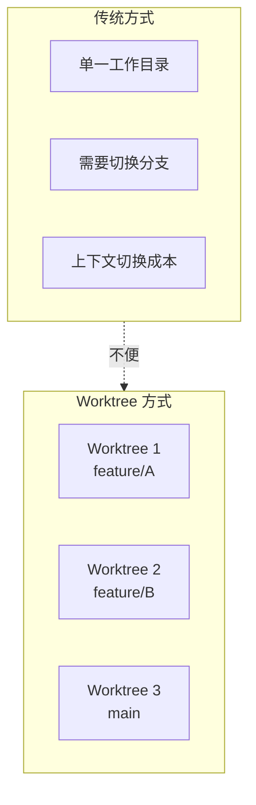
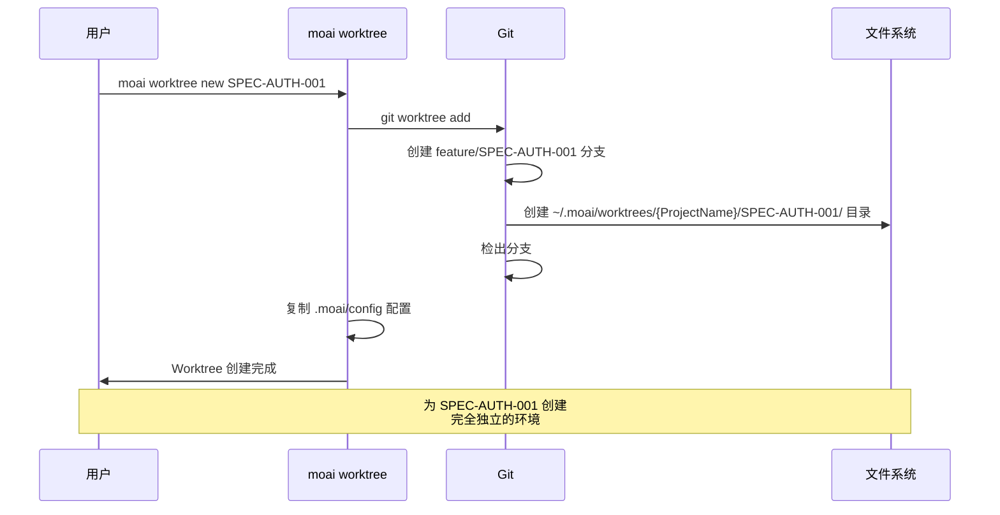
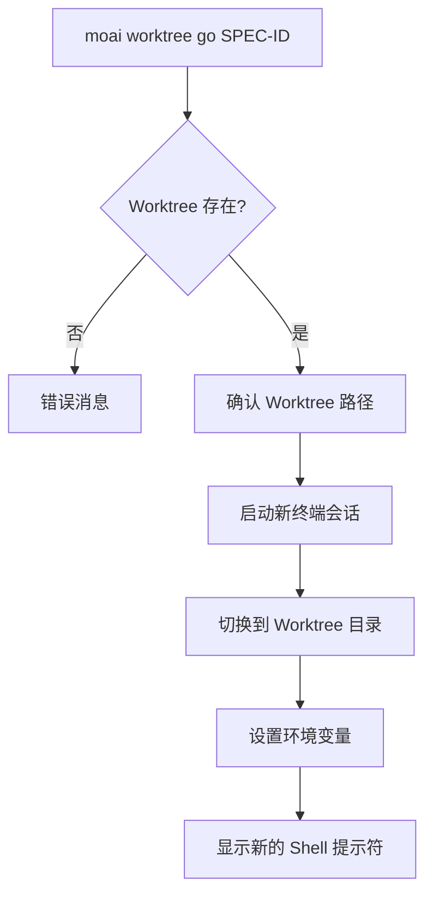
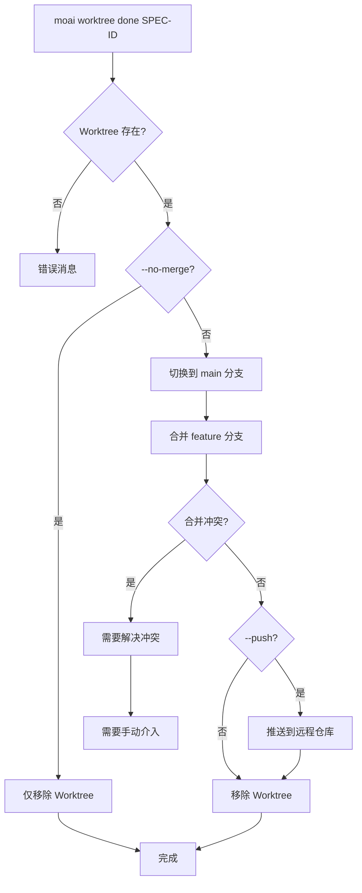
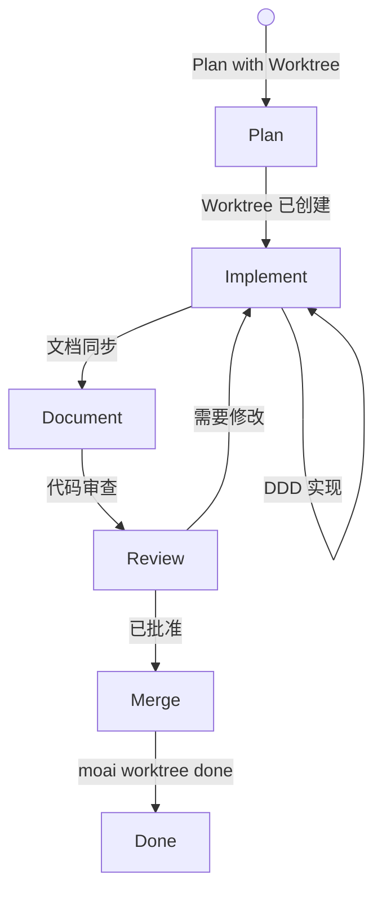
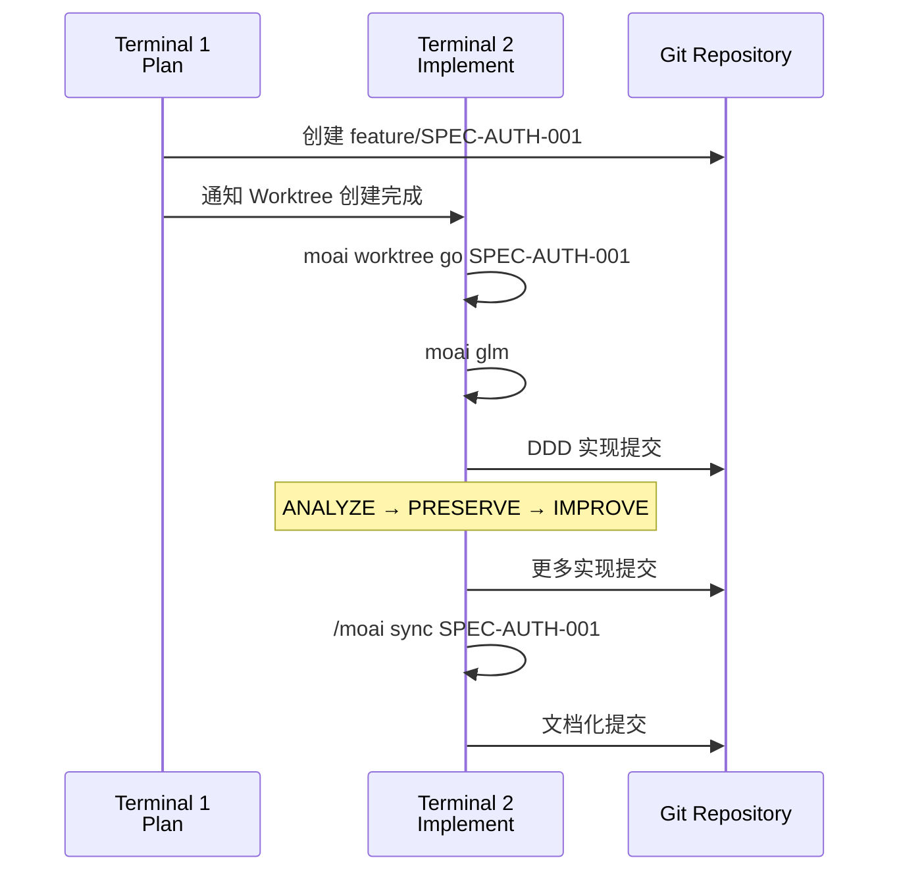
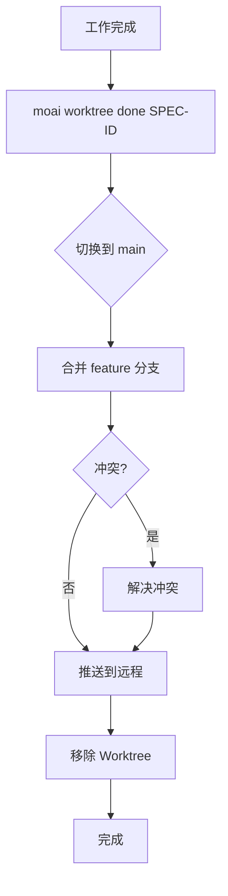
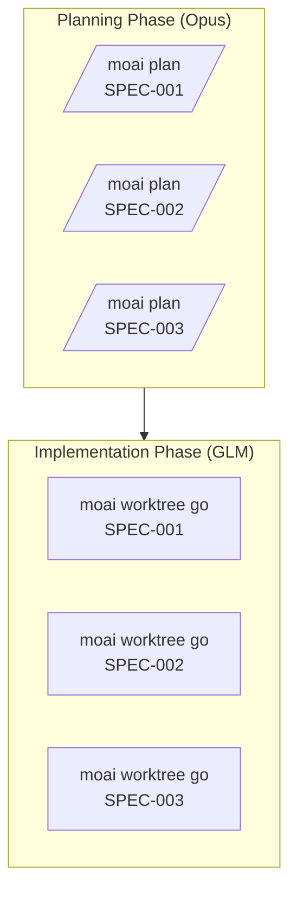
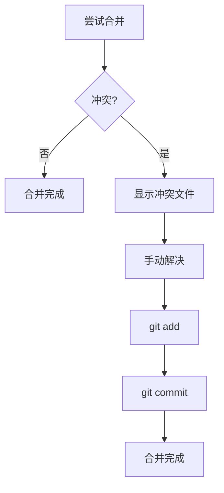
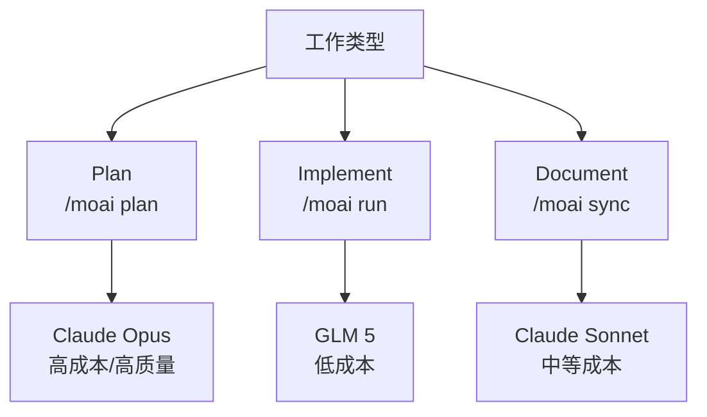

使用 Git Worktree 进行 MoAI-ADK 并行开发的一切 —— 从基础概念、命令参考、
工作流到最佳实践，这一篇文档全部讲清。

## 目录

1. [Worktree 基础](#worktree-基础)
2. [命令详细参考](#命令详细参考)
3. [工作流指南](#工作流指南)
4. [高级功能](#高级功能)
5. [最佳实践](#最佳实践)

---

## Worktree 基础

### 什么是 Git Worktree？

Git Worktree 是让**一个 Git 仓库可以在多个目录中同时工作**的 Git 内置功能。
在分支之间往返时，不再用 `git checkout` 反复切换上下文，而是为每个分支各开
一个目录。


```mermaid
graph TB
    subgraph Traditional["传统方式"]
        T1[单一工作目录]
        T2[需要切换分支]
        T3[上下文切换成本]
    end

    subgraph Worktree["Worktree 方式"]
        W1[Worktree 1<br/>feature/A]
        W2[Worktree 2<br/>feature/B]
        W3[Worktree 3<br/>main]
    end

    Traditional -.->|不便| Worktree
```

### MoAI-ADK 中的 Worktree

MoAI-ADK 在这一功能之上叠加了以 SPEC 为单位的隔离环境。由于每个 SPEC 都拥有
完全独立的环境，即使代理并行工作也不会踩到彼此的成果：

- **独立的 Git 状态** —— 每个 Worktree 维持自己的分支和提交历史
- **分离的 LLM 配置** —— 每个 Worktree 可以使用不同的 LLM 运行模式。
  计划用 Claude、实现用 GLM 的托克诺米克斯运营正来源于此
- **隔离的工作空间** —— 在文件系统层面完全分离

---

## 命令详细参考

### moai worktree new

创建新的 Worktree。

#### 语法

```bash
moai worktree new SPEC-ID [options]
```

#### 参数

- **SPEC-ID**（必填）：要创建的 SPEC 的 ID（例：`SPEC-AUTH-001`）

#### 选项

- `-b, --branch BRANCH`：指定要使用的分支名（默认值：`feature/SPEC-ID`）
- `--from BASE`：指定基础分支（默认值：`main`）
- `--force`：如已存在 Worktree 则强制重建

#### 使用示例

```bash
# 基本用法
moai worktree new SPEC-AUTH-001

# 从特定分支创建
moai worktree new SPEC-AUTH-001 --from develop

# 强制重建
moai worktree new SPEC-AUTH-001 --force
```

#### 运行过程


```mermaid
sequenceDiagram
    participant User as 用户
    participant CLI as moai worktree
    participant Git as Git
    participant FS as 文件系统

    User->>CLI: moai worktree new SPEC-AUTH-001
    CLI->>Git: git worktree add
    Git->>Git: 创建 feature/SPEC-AUTH-001 分支
    Git->>FS: 创建 ~/.moai/worktrees/{ProjectName}/SPEC-AUTH-001/ 目录
    Git->>Git: 检出分支
    CLI->>CLI: 复制 .moai/config 配置
    CLI->>User: Worktree 创建完成

    Note over User,FS: 为 SPEC-AUTH-001 创建<br/>完全独立的环境
```

---

### moai worktree go

进入 Worktree 并开启新的 Shell 会话。

#### 语法

```bash
moai worktree go SPEC-ID
```

#### 参数

- **SPEC-ID**（必填）：要进入的 Worktree 的 ID

#### 使用示例

```bash
# 进入 Worktree
moai worktree go SPEC-AUTH-001

# 进入后切换 LLM
moai glm

# 启动 Claude Code
claude

# 开始工作
> /moai run SPEC-AUTH-001
```

#### 运行过程


```mermaid
flowchart TD
    A[moai worktree go SPEC-ID] --> B{Worktree 存在?}
    B -->|否| C[错误消息]
    B -->|是| D[确认 Worktree 路径]
    D --> E[启动新终端会话]
    E --> F[切换到 Worktree 目录]
    F --> G[设置环境变量]
    G --> H[显示新的 Shell 提示符]
```

---

### moai worktree list

显示所有 Worktree 的列表。

#### 语法

```bash
moai worktree list [options]
```

#### 选项

- `-v, --verbose`：包含详细信息
- `--porcelain`：以可解析的格式输出

#### 使用示例

```bash
# 基本列表
moai worktree list

# 详细信息
moai worktree list --verbose

# 输出示例
SPEC-AUTH-001  feature/SPEC-AUTH-001  /path/to/worktree/SPEC-AUTH-001  [active]
SPEC-AUTH-002  feature/SPEC-AUTH-002  /path/to/worktree/SPEC-AUTH-002
SPEC-AUTH-003  feature/SPEC-AUTH-003  /path/to/worktree/SPEC-AUTH-003
```

---

### moai worktree done

完成 Worktree 的工作，合并后进行清理。

#### 语法

```bash
moai worktree done SPEC-ID [options]
```

#### 参数

- **SPEC-ID**（必填）：要完成的 Worktree 的 ID

#### 选项

- `--push`：合并后推送到远程仓库
- `--no-merge`：不合并，只移除 Worktree
- `--force`：即使有冲突也强制合并

#### 使用示例

```bash
# 基本合并与清理
moai worktree done SPEC-AUTH-001

# 推送到远程仓库
moai worktree done SPEC-AUTH-001 --push

# 只移除、不合并
moai worktree done SPEC-AUTH-001 --no-merge
```

#### 运行过程


```mermaid
flowchart TD
    A[moai worktree done SPEC-ID] --> B{Worktree 存在?}
    B -->|否| C[错误消息]
    B -->|是| D{--no-merge?}
    D -->|是| E[仅移除 Worktree]
    D -->|否| F[切换到 main 分支]
    F --> G[合并 feature 分支]
    G --> H{合并冲突?}
    H -->|是| I[需要解决冲突]
    H -->|否| J{--push?}
    J -->|是| K[推送到远程仓库]
    J -->|否| L[移除 Worktree]
    K --> L
    E --> M[完成]
    L --> M
    I --> N[需要手动介入]
```

---

### moai worktree remove

移除 Worktree（不合并）。

#### 语法

```bash
moai worktree remove SPEC-ID [options]
```

#### 参数

- **SPEC-ID**（必填）：要移除的 Worktree 的 ID

#### 选项

- `--force`：即使有未保存更改也强制移除
- `--keep-branch`：保留分支，只移除 Worktree

#### 使用示例

```bash
# 基本移除
moai worktree remove SPEC-AUTH-001

# 强制移除
moai worktree remove SPEC-AUTH-001 --force

# 保留分支
moai worktree remove SPEC-AUTH-001 --keep-branch
```

---

### moai worktree status

查看 Worktree 的状态。

#### 语法

```bash
moai worktree status [SPEC-ID]
```

#### 参数

- **SPEC-ID**（可选）：查看特定 Worktree 的状态（不指定则显示全部）

#### 使用示例

```bash
# 所有 Worktree 状态
moai worktree status

# 特定 Worktree 状态
moai worktree status SPEC-AUTH-001

# 输出示例
Worktree: SPEC-AUTH-001
Branch: feature/SPEC-AUTH-001
Path: /path/to/worktree/SPEC-AUTH-001
Status: Clean (2 commits ahead of main)
LLM: GLM 5
```

---

### moai worktree clean

清理已合并或已完成的 Worktree。

#### 语法

```bash
moai worktree clean [options]
```

#### 选项

- `--merged-only`：只清理已合并的 Worktree
- `--older-than DAYS`：只清理超过 N 天的 Worktree
- `--dry-run`：只显示、不实际移除

#### 使用示例

```bash
# 清理已合并的 Worktree
moai worktree clean --merged-only

# 清理超过 7 天的 Worktree
moai worktree clean --older-than 7

# 预览
moai worktree clean --dry-run
```

---

### moai worktree config

查看或修改 Worktree 配置。

#### 语法

```bash
moai worktree config [key] [value]
```

#### 参数

- **key**（可选）：配置键
- **value**（可选）：配置值

#### 使用示例

```bash
# 显示所有配置
moai worktree config

# 查看特定配置
moai worktree config root

# 修改配置
moai worktree config root /new/path/to/worktrees
```

---

## 工作流指南

### 完整开发周期


```mermaid
flowchart TD
    Start(( )) -->|"Plan with Worktree"| Plan["Plan"]
    Plan -->|"Worktree 已创建"| Implement["Implement"]
    Implement -->|"DDD 实现"| Implement
    Implement -->|"文档同步"| Document["Document"]
    Document -->|"代码审查"| Review["Review"]
    Review -->|"已批准"| Merge["Merge"]
    Review -->|"需要修改"| Implement
    Merge -->|"moai worktree done"| Done["Done"]
```

### 第 1 阶段：SPEC 计划 (Phase 1)

```bash
# 在 Terminal 1
> /moai plan "实现用户认证系统" --worktree
```

**输出**：

```
✓ 生成 SPEC 文档: .moai/specs/SPEC-AUTH-001/spec.md
✓ 创建 Worktree: ~/.moai/worktrees/{ProjectName}/SPEC-AUTH-001
✓ 创建分支: feature/SPEC-AUTH-001
✓ 分支切换完成

下一步:
1. 在新终端运行: moai worktree go SPEC-AUTH-001
2. 切换 LLM: moai glm
3. 开始开发: claude
```

### 第 2 阶段：实现 (Phase 2)

```bash
# 在 Terminal 2
moai worktree go SPEC-AUTH-001

# 进入 Worktree 后提示符发生变化
(SPEC-AUTH-001) $ moai glm
→ 已设置为 GLM 5。

(SPEC-AUTH-001) $ claude
> /moai run SPEC-AUTH-001
```

**工作流程**：


```mermaid
sequenceDiagram
    participant T1 as Terminal 1<br/>Plan
    participant T2 as Terminal 2<br/>Implement
    participant Git as Git Repository

    T1->>Git: 创建 feature/SPEC-AUTH-001
    T1->>T2: 通知 Worktree 创建完成

    T2->>T2: moai worktree go SPEC-AUTH-001
    T2->>T2: moai glm
    T2->>Git: DDD 实现提交
    Note over T2: ANALYZE → PRESERVE → IMPROVE

    T2->>Git: 更多实现提交
    T2->>T2: /moai sync SPEC-AUTH-001
    T2->>Git: 文档化提交
```

### 第 3 阶段：完成与合并 (Phase 3)

```bash
# 在 Terminal 2 完成工作后
exit

# 在 Terminal 1
moai worktree done SPEC-AUTH-001 --push
```

**流程**：


```mermaid
flowchart TD
    A[工作完成] --> B[moai worktree done SPEC-ID]
    B --> C{切换到 main}
    C --> D[合并 feature 分支]
    D --> E{冲突?}
    E -->|是| F[解决冲突]
    E -->|否| G[推送到远程]
    F --> G
    G --> H[移除 Worktree]
    H --> I[完成]
```

---

## 高级功能

### 并行工作策略

#### 策略 1：Plan 与 Implement 分离

这是托克诺米克斯的基本策略。计划阶段集中交给高推理模型 (Opus) 处理，实现
阶段用低成本模型 (GLM) 并行分摊：


```mermaid
graph TB
    subgraph Planning["Planning Phase (Opus)"]
        P1[/moai plan<br/>SPEC-001/]
        P2[/moai plan<br/>SPEC-002/]
        P3[/moai plan<br/>SPEC-003/]
    end

    subgraph Implementation["Implementation Phase (GLM)"]
        I1[moai worktree go<br/>SPEC-001]
        I2[moai worktree go<br/>SPEC-002]
        I3[moai worktree go<br/>SPEC-003]
    end

    Planning --> Implementation
```

#### 策略 2：同时开发

```bash
# Terminal 1: SPEC-001 Plan
> /moai plan "认证" --worktree

# Terminal 2: SPEC-002 Plan（完成后）
> /moai plan "日志" --worktree

# Terminal 3, 4, 5: 并行实现
moai worktree go SPEC-001 && moai glm  # Terminal 3
moai worktree go SPEC-002 && moai glm  # Terminal 4
moai worktree go SPEC-003 && moai glm  # Terminal 5
```

### 在 Worktree 之间切换

```bash
# 查看当前 Worktree
moai worktree status

# 切换到其他 Worktree
moai worktree go SPEC-AUTH-002

# 或直接移动
cd ~/.moai/worktrees/SPEC-AUTH-002
```

### 解决冲突


```mermaid
flowchart TD
    A[尝试合并] --> B{冲突?}
    B -->|否| C[合并完成]
    B -->|是| D[显示冲突文件]
    D --> E[手动解决]
    E --> F[git add]
    F --> G[git commit]
    G --> H[合并完成]
```

---

## 最佳实践

### 1. Worktree 命名规范

```bash
# 好的示例
moai worktree new SPEC-AUTH-001      # 清晰的 SPEC ID
moai worktree new SPEC-FRONTEND-007  # 包含类别

# 应避免的示例
moai worktree new feature-branch     # 未使用 SPEC ID
moai worktree new temp               # 含糊的名称
```

### 2. 定期清理

```bash
# 每周运行
moai worktree clean --merged-only

# 每月运行
moai worktree clean --older-than 30
```

### 3. LLM 选择指南

按工作阶段划分并分配模型，是 Worktree 托克诺米克斯的核心：


```mermaid
graph TD
    A[工作类型] --> B[Plan<br/>/moai plan]
    A --> C[Implement<br/>/moai run]
    A --> D[Document<br/>/moai sync]

    B --> E[Claude Opus<br/>高成本/高质量]
    C --> F[GLM 5<br/>低成本]
    D --> G[Claude Sonnet<br/>中等成本]
```

### 4. 提交信息规范

```bash
# 在 Worktree 中提交时
git commit -m "feat(SPEC-AUTH-001): 实现基于 JWT 的认证

- 添加 JWT 令牌生成/验证逻辑
- 实现刷新令牌轮换
- 登出时使令牌失效

Co-Authored-By: Claude <noreply@anthropic.com>"
```

### 5. 终端管理

```bash
# 为每个 Worktree 使用独立终端
# 推荐使用 iTerm2、VS Code 或 tmux

# tmux 示例
tmux new-session -d -s spec-001 'moai worktree go SPEC-001'
tmux new-session -d -s spec-002 'moai worktree go SPEC-002'

# 切换会话
tmux attach-session -t spec-001
```

### 6. 跟踪进展

```bash
# 查看所有 Worktree 状态
moai worktree status --verbose

# 查看 Git 日志
cd ~/.moai/worktrees/{ProjectName}/SPEC-AUTH-001
git log --oneline --graph --all

# 查看变更
git diff main
```

## tmux 集成与自动合并

### moai worktree new --tmux 标志

自动创建 tmux 会话，可在 worktree 环境中进行隔离开发。

```bash
moai worktree new SPEC-AUTH-001 --tmux
```

**运行流程：**
1. 创建 Worktree（既有行为）
2. 自动创建 tmux 会话（名称：`moai-{ProjectName}-{SPEC-ID}`）
3. 根据 LLM 模式注入环境变量（GLM/CG 模式）
4. cd 到 Worktree 后执行 `/moai run {SPEC-ID}`

```bash
# 附加 tmux 会话
tmux attach-session -t moai-my-project-SPEC-AUTH-001
```


若未安装 tmux 则 graceful degradation：显示手动 cd 引导消息。


### 运行模式选择闸口 (Decision Point 3.5)

`/moai plan` 完成后、Run 开始前，会自动检测运行模式并请用户选择。

**tmux 可用时（3 个选项）：**
- Worktree + \{当前模式\} (Recommended)：创建 worktree + tmux 会话
- Team Mode：Agent Teams 并行执行
- Sub-agent Mode：顺序执行

**tmux 不可用时（2 个选项）：**
- Sub-agent Mode (Recommended)
- Team Mode (in-process)

### Auto-merge 默认行为

在 worktree 上下文中运行 `/moai sync` 时，auto-merge 是默认行为。

| 标志 | 行为 |
|--------|------|
| （无） | 在 worktree 上下文中自动合并 |
| `--no-merge` | 跳过自动合并 |
| `--merge` | Deprecated（显示警告） |

### 合并后自动清理

PR 合并成功时自动清理：
- 移除 worktree 目录
- 删除 feature 分支（`--delete-branch`）
- 更新注册表


清理失败不影响合并结果。失败时手动清理：`moai worktree done SPEC-{ID}`


### 错误处理 (errors.go)

提供结构化的错误类型与恢复命令。

| 错误类型 | 说明 | 恢复命令 |
|-----------|------|-----------|
| `WorktreeCreateError` | Worktree 创建失败 | `moai worktree new {SPEC-ID}` |
| `TmuxNotAvailableError` | tmux 不可用 | `cd {path} && /moai run {SPEC-ID}` |
| `AutoMergeBlockedError` | 自动合并被阻止 | `/moai sync {SPEC-ID}` |
| `CleanupFailedError` | 清理失败 | `moai worktree done {SPEC-ID}` |

## 相关文档

- [Git Worktree 概述](/zh/worktree/)
- [实际使用示例](/zh/worktree/examples)
- [常见问题](/zh/worktree/faq)
