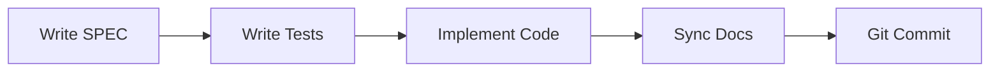

# MoAI-ADK Overview

## What is MoAI-ADK?

MoAI-ADK (MoAI Agentic Development Kit) is an open-source framework that practices **SPEC-First TDD development methodology** with a team of AI agents.

### Core Concept

Enforces **SPEC → TEST → CODE → DOC** order to build trust in AI-generated code.

## Key Features

### 1. SPEC-First Approach

All development starts with clear requirement definitions (SPEC).

- **EARS Syntax**: Clear requirements in WHEN-SHALL format
- **@TAG System**: Unique ID for every requirement
- **Traceability**: Guaranteed SPEC → TEST → CODE connection

### 2. Alfred SuperAgent

19 AI agents collaborate to support the entire development process.

- **10 Core Agents**: spec-builder, tdd-implementer, doc-syncer, etc.
- **6 Specialist Agents**: Language and domain experts
- **55 Claude Skills**: Reusable knowledge capsules

### 3. TDD Automation

Automatically performs Test-Driven Development.

- **RED**: Write failing tests
- **GREEN**: Minimal implementation to pass tests
- **REFACTOR**: Improve code quality

### 4. Documentation Sync

Code and documentation always match.

- **Auto-update**: All docs sync with one `/alfred:3-sync` command
- **Living Documents**: Auto-refresh with code changes
- **Consistency**: README, CHANGELOG, API docs all synchronized

## Why MoAI-ADK?

### Problems with Traditional AI Development

| Problem | Traditional Approach | MoAI-ADK Solution |
|---------|---------------------|-------------------|
| Unclear Requirements | Verbal explanation, intent mismatch | Clarified in SPEC documents |
| Missing Tests | "Test later" → Never happens | TDD enforced, 85%+ coverage |
| Outdated Docs | Forget to update after code changes | Auto-sync |
| Context Loss | Explain from scratch every time | Alfred remembers project history |

### Advantages of MoAI-ADK

1. **Trustworthy Code**: Verified code with SPEC-based tests
2. **Faster Development**: Fewer trial-and-error with clear SPEC
3. **Lower Maintenance Cost**: Easy to understand with matching docs and code
4. **Efficient Collaboration**: Clear communication through SPEC and TAG

## Next Steps

- [Architecture](/en/introduction/architecture) - Understand MoAI-ADK's 4-layer structure
- [Key Concepts](/en/introduction/concepts) - Details on SPEC, TDD, TAG system
- [Installation Guide](/en/getting-started/installation) - Get started with MoAI-ADK
