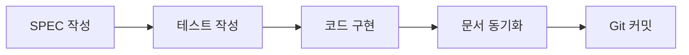

# MoAI-ADK 개요

## MoAI-ADK란?

MoAI-ADK (MoAI Agentic Development Kit)는 **SPEC-First TDD 개발 방법론**을 AI 에이전트 팀과 함께 실천하는 오픈소스 프레임워크입니다.

### 핵심 개념

**SPEC → TEST → CODE → DOC** 순서를 강제하여, AI 생성 코드에 대한 신뢰를 구축합니다.

## 주요 특징

### 1. SPEC-First 접근

모든 개발은 명확한 요구사항 정의(SPEC)부터 시작합니다.

- **EARS 문법** 사용: WHEN-SHALL 형식의 명확한 요구사항
- **@TAG 시스템**: 모든 요구사항에 고유 ID 부여
- **추적 가능**: SPEC → TEST → CODE 연결 보장

### 2. Alfred SuperAgent

19개 AI 에이전트 팀이 협력하여 개발 전 과정을 지원합니다.

- **10개 핵심 에이전트**: spec-builder, tdd-implementer, doc-syncer 등
- **6개 전문 에이전트**: 언어별, 도메인별 전문가
- **55개 Claude Skills**: 재사용 가능한 지식 캡슐

### 3. TDD 자동화

Test-Driven Development를 자동으로 수행합니다.

- **RED**: 실패하는 테스트 작성
- **GREEN**: 테스트를 통과하는 최소 구현
- **REFACTOR**: 코드 품질 개선

### 4. 문서 동기화

코드와 문서가 항상 일치합니다.

- **자동 업데이트**: `/alfred:3-sync` 명령 하나로 모든 문서 동기화
- **Living Documents**: 코드 변경에 따라 자동 갱신
- **일관성 보장**: README, CHANGELOG, API 문서 모두 동기화

## 왜 MoAI-ADK인가?

### 기존 AI 개발의 문제점

| 문제 | 기존 방식 | MoAI-ADK 해결책 |
|------|-----------|----------------|
| 요구사항 불명확 | 구두로 설명, 의도 불일치 | SPEC 문서로 명확화 |
| 테스트 부재 | "나중에 테스트" → 영원히 안 함 | TDD 강제, 85%+ 커버리지 |
| 문서 낙후 | 코드 수정 후 문서 업데이트 누락 | 자동 동기화 |
| 컨텍스트 손실 | 매번 처음부터 설명 | Alfred가 프로젝트 이력 기억 |

### MoAI-ADK의 장점

1. **신뢰할 수 있는 코드**: SPEC 기반 테스트로 검증된 코드
2. **빠른 개발**: 명확한 SPEC으로 시행착오 감소
3. **낮은 유지보수 비용**: 문서와 코드 일치로 이해 쉬움
4. **효율적 협업**: SPEC과 TAG로 명확한 커뮤니케이션

## 다음 단계

- [아키텍처](/ko/introduction/architecture) - MoAI-ADK의 4-레이어 구조 이해
- [주요 개념](/ko/introduction/concepts) - SPEC, TDD, TAG 시스템 상세
- [설치 가이드](/ko/getting-started/installation) - MoAI-ADK 설치 시작
