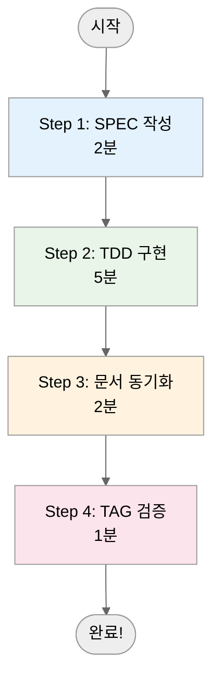

Translate the following Korean markdown document to Chinese (Simplified).

**CRITICAL RULES:**
1. Preserve ALL markdown structure (headers, code blocks, links, tables, diagrams)
2. Keep ALL code blocks and technical terms UNCHANGED
3. Maintain the EXACT same file structure and formatting
4. Translate ONLY Korean text content
5. Keep ALL @TAG references unchanged (e.g., @SPEC:AUTH-001)
6. Preserve ALL file paths and URLs
7. Keep ALL emoji and icons as-is
8. Maintain ALL frontmatter (YAML) structure

**Source File:** /Users/goos/MoAI/MoAI-ADK/docs/src/ko/getting-started/quick-start-ko.md
**Target Language:** Chinese (Simplified)
**Target File:** /Users/goos/MoAI/MoAI-ADK/docs/src/zh/getting-started/quick-start-ko.md

**Content to Translate:**

# 🚀 10분 완전 실습: Hello World API

> **목표**: MoAI-ADK의 전체 워크플로우를 10분 안에 경험하기 **배우는 것**: SPEC 작성, TDD 구현, 문서 자동화, @TAG 시스템 **난이도**: 초급
> (프로그래밍 기초 지식 필요)

## :bullseye: 이 실습으로 얻을 수 있는 것

- ✅ **SPEC**: EARS 형식으로 요구사항을 명확히 정의
- ✅ **TDD**: RED → GREEN → REFACTOR 사이클 경험
- ✅ **자동화**: 문서가 코드와 함께 자동 생성됨
- ✅ **추적성**: @TAG 시스템으로 모든 단계가 연결됨
- ✅ **품질**: 테스트 100%, 명확한 구현, 자동 문서화

## 📋 사전 준비물

이 실습을 시작하기 전에 다음이 준비되어 있어야 합니다:

- ✅ **MoAI-ADK 설치 완료** (`moai-adk --version` 확인)
- ✅ **프로젝트 생성 완료** (`moai-adk init hello-world`)
- ✅ **Claude Code 실행 중** (`claude` 명령어)
- ✅ **UV 설치** (Python 패키지 관리)

```bash
# 설치 확인
moai-adk --version
# 출력: moai-adk version 0.17.0

# 프로젝트 확인
cd hello-world
ls -la .moai/ .claude/
```

______________________________________________________________________

## 🏗️ 전체 워크플로우 개요

MoAI-ADK의 개발은 4단계 워크플로우를 따릅니다:



______________________________________________________________________

## 📝 Step <span class="material-icons" style="font-size: 1em; vertical-align: middle;">looks_one</span>: SPEC 작성 (2분)

### 명령어 실행

Claude Code에서 다음 명령어를 실행하세요:

```bash
/alfred:1-plan "GET /hello 엔드포인트 - 쿼리 파라미터 name을 받아서 인사말 반환"
```

### Alfred가 자동으로 생성하는 것

Alfred는 다음을 자동으로 생성하고 설정합니다:

```
✅ SPEC ID: HELLO-001
✅ 파일: .moai/specs/SPEC-HELLO-001/spec.md
✅ 브랜치: feature/SPEC-HELLO-001 (Team 모드)
✅ Plan Board: 구현 아이디어와 위험 요소
✅ Acceptance Criteria: 검증 기준
```

### 생성된 SPEC 확인

```bash
cat .moai/specs/SPEC-HELLO-001/spec.md
```

**생성된 SPEC 내용 예시**:

```yaml
---
id: HELLO-001
version: 0.0.1
status: draft
created: 2025-11-06
updated: 2025-11-06
author: @user
priority: high
tags: ["API", "HELLO", "FASTAPI"]
---

# @SPEC:HELLO-001: Hello World API

## 요약
간단한 인사말을 반환하는 REST API 엔드포인트

## 기능 설명

### 주요 기능
- HTTP GET 요청을 통해 인사말 반환
- 쿼리 파라미터로 이름을 받아 개인화된 응답 제공
- 기본값으로 "World" 사용

### 기술 스택
- **백엔드**: FastAPI (Python)
- **테스트**: pytest
- **데이터 형식**: JSON

## 요구사항 (EARS 형식)

### 기본 요구사항
- **UBQ-001**: 시스템은 HTTP GET /hello 엔드포인트를 제공해야 한다
- **UBQ-002**: 시스템은 JSON 형식으로 응답해야 한다

### 이벤트 기반 요구사항
- **EVT-001**: **WHEN** 쿼리 파라미터 name이 제공되면, 시스템은 "Hello, {name}!"을 반환해야 한다
- **EVT-002**: **WHEN** name이 없으면, 시스템은 "Hello, World!"를 반환해야 한다

### 상태 기반 요구사항
- **STA-001**: **WHILE** name 파라미터가 제공되는 동안, 시스템은 개인화된 인사말을 유지해야 한다

### 선택적 요구사항
- **OPT-001**: **WHERE** name이 제공되면, 시스템은 이름을 검증할 수 있다

### 제약 조건 (Unwanted Behaviors)
- **UB-001**: name 파라미터가 50자를 초과하면 안 된다
- **UB-002**: 빈 문자열 name은 허용되지 않는다
- **UB-003**: HTML 태그는 허용되지 않는다

## 추적성 (@TAG 체인)

- **@SPEC:HELLO-001**: 이 요구사항 문서
- **@TEST:HELLO-001**: 관련 테스트 (생성 예정)
- **@CODE:HELLO-001**: 관련 코드 (생성 예정)
- **@DOC:HELLO-001**: 관련 문서 (생성 예정)

## 검증 기준

### 성공 기준
- [ ] GET /hello 요청이 성공해야 한다
- [ ] name 쿼리 파라미터로 개인화된 응답을 반환해야 한다
- [ ] name이 없으면 기본 응답을 반환해야 한다
- [ ] 응답이 JSON 형식이어야 한다

### 실패 기준
- [ ] 500 에러가 발생해서는 안 된다
- [ ] 잘못된 형식의 응답을 반환해서는 안 된다

## 리스크 분석

### 기술적 리스크
- **높음**: FastAPI 의존성 관리
- **중간**: 쿼리 파라미터 검증 로직
- **낮음**: JSON 직렬화 문제

### 완화 전략
- 의존성은 requirements.txt에 명시
- 입력 검증은 Pydantic 모델 사용
- 테스트 케이스로 에지 케이스 커버

---
```

### ✅ Step 1 완료 확인

```bash
# SPEC 파일이 생성되었는지 확인
ls -la .moai/specs/SPEC-HELLO-001/
# 출력: spec.md, plan.md, acceptance.md

# TAG 할당 확인
grep "@SPEC:HELLO-001" .moai/specs/SPEC-HELLO-001/spec.md
# 출력: # @SPEC:HELLO-001: Hello World API
```

______________________________________________________________________

## 🧪 Step <span class="material-icons" style="font-size: 1em; vertical-align: middle;">looks_two</span>: TDD 구현 (5분)

### 명령어 실행

```bash
/alfred:2-run HELLO-001
```

Alfred는 3단계 TDD 사이클을 자동으로 실행합니다:

### 🔴 RED Phase: 실패하는 테스트 작성

먼저 실패하는 테스트를 작성합니다. **이것이 TDD의 핵심입니다!**

**생성되는 파일**: `tests/test_hello_api.py`

```python
# @TEST:HELLO-001 | SPEC: SPEC-HELLO-001.md
import pytest
from fastapi.testclient import TestClient
from src.hello.api import app

client = TestClient(app)

def test_hello_with_name_should_return_personalized_greeting():
    """
    EVT-001: WHEN 쿼리 파라미터 name이 제공되면,
    시스템은 "Hello, {name}!"을 반환해야 한다
    """
    response = client.get("/hello?name=철수")
    assert response.status_code == 200
    assert response.json() == {"message": "Hello, 철수!"}

def test_hello_without_name_should_return_default_greeting():
    """
    EVT-002: WHEN name이 없으면,
    시스템은 "Hello, World!"를 반환해야 한다
    """
    response = client.get("/hello")
    assert response.status_code == 200
    assert response.json() == {"message": "Hello, World!"}

def test_hello_with_empty_name_should_return_default():
    """
    UB-002: 빈 문자열 name은 허용되지 않는다
    """
    response = client.get("/hello?name=")
    assert response.status_code == 200
    assert response.json() == {"message": "Hello, World!"}

def test_hello_with_long_name_should_be_limited():
    """
    UB-001: name 파라미터가 50자를 초과하면 안 된다
    """
    long_name = "a" * 51  # 51자
    response = client.get(f"/hello?name={long_name}")
    assert response.status_code == 400
    assert "too long" in response.json()["detail"].lower()
```

**테스트 실행**:

```bash
pytest tests/test_hello_api.py -v
```

**결과**: <span class="material-icons">cancel</span> **FAILED (정상!)** - app가 없으므로 실패

**Git 커밋**:

```bash
git add tests/test_hello_api.py
git commit -m "🔴 test(HELLO-001): add failing hello API tests

- 테스트 케이스 작성 (RED 단계)
- EVT-001, EVT-002 요구사항 검증
- UB-001, UB-002 제약 조건 검증

@TEST:HELLO-001"
```

### 🟢 GREEN Phase: 최소 구현

이제 테스트를 통과시키는 최소한의 코드를 작성합니다.

**생성되는 파일**: `src/hello/api.py`

```python
# @CODE:HELLO-001:API | SPEC: SPEC-HELLO-001.md | TEST: tests/test_hello_api.py
from fastapi import FastAPI, HTTPException
from pydantic import BaseModel, Field
from typing import Optional

app = FastAPI(
    title="Hello API",
    description="Simple greeting API",
    version="0.1.0"
)

class HelloResponse(BaseModel):
    message: str = Field(..., description="Greeting message")

@app.get("/hello", response_model=HelloResponse)
def hello(name: Optional[str] = None) -> HelloResponse:
    """
    @CODE:HELLO-001:API - Hello endpoint with validation

    EVT-001: name이 제공되면 개인화된 인사말 반환
    EVT-002: name이 없으면 기본 인사말 반환
    UB-001: name은 50자를 초과할 수 없음
    UB-002: 빈 문자열은 기본값으로 처리
    """
    # UB-002: 빈 문자열은 기본값으로 처리
    if not name or name.strip() == "":
        name = "World"

    # UB-001: 이름 길이 제한 (50자)
    if len(name) > 50:
        raise HTTPException(
            status_code=400,
            detail=f"Name too long (max 50 characters, got {len(name)})"
        )

    # HTML 태그 제거 (UB-003)
    clean_name = name.replace("<", "&lt;").replace(">", "&gt;")

    return HelloResponse(message=f"Hello, {clean_name}!")
```

**핵심 구현 원칙**:

1. **요구사항 그대로 구현**: SPEC의 EVT-001, EVT-002를 코드로 변환
2. **제약 조건 처리**: UB-001, UB-002, UB-003을 검증 로직으로 구현
3. **최소 구현**: 테스트를 통과하는 데 필요한 코드만 작성
4. **명확한 TAG**: @CODE:HELLO-001로 추적성 확보

**테스트 실행**:

```bash
pytest tests/test_hello_api.py -v
```

**결과**: ✅ **PASSED (모두 통과!)**

**Git 커밋**:

```bash
git add src/hello/api.py
git commit -m "🟢 feat(HELLO-001): implement minimal hello API

- FastAPI 기반 Hello 엔드포인트 구현
- 쿼리 파라미터 name 처리 (선택적)
- 이름 길이 제한 (50자) 및 유효성 검증
- 빈 문자열 및 HTML 태그 처리
- 모든 테스트 케이스 통과 (GREEN 단계)

@CODE:HELLO-001:API"
```

### ♻️ REFACTOR Phase: 코드 개선

이제 코드를 개선하고 품질을 높입니다.

**개선된 구현**:

```python
# @CODE:HELLO-001:API | SPEC: SPEC-HELLO-001.md | TEST: tests/test_hello_api.py
from fastapi import FastAPI, HTTPException
from pydantic import BaseModel, Field, validator
from typing import Optional
import re

app = FastAPI(
    title="Hello API",
    description="Simple greeting API with validation",
    version="0.1.0"
)

class HelloRequest(BaseModel):
    """Request model for hello endpoint with validation"""
    name: Optional[str] = Field(
        None,
        description="Name for personalized greeting (max 50 chars)",
        min_length=1,
        max_length=50
    )

    @validator('name')
    def validate_name(cls, v):
        if v is None:
            return v
        # HTML 태그 제거 (UB-003)
        clean_name = re.sub(r'<[^>]+>', '', v)
        return clean_name.strip() or None

class HelloResponse(BaseModel):
    """Response model for hello endpoint"""
    message: str = Field(..., description="Personalized greeting message")
    request_name: Optional[str] = Field(None, description="Name that was used")

@app.get("/hello", response_model=HelloResponse)
def hello(name: Optional[str] = None) -> HelloResponse:
    """
    @CODE:HELLO-001:API - Enhanced hello endpoint

    Returns a personalized greeting with comprehensive validation.

    Args:
        name: Optional name parameter for personalization

    Returns:
        HelloResponse with greeting message

    Raises:
        HTTPException: When validation fails (400 error)
    """
    try:
        # 요청 모델을 통한 유효성 검증
        request = HelloRequest(name=name)

        # UB-002: 빈 문자열 또는 None은 기본값으로 처리
        effective_name = request.name or "World"

        # 인사말 생성
        greeting = f"Hello, {effective_name}!"

        return HelloResponse(
            message=greeting,
            request_name=request.name
        )

    except ValueError as e:
        raise HTTPException(
            status_code=400,
            detail=f"Validation error: {str(e)}"
        )

@app.get("/health")
def health_check():
    """Health check endpoint"""
    return {"status": "healthy", "service": "hello-api"}
```

**REFACTOR 개선사항**:

1. **Pydantic 모델**: 입력 유효성 검증 자동화
2. **에러 처리**: 명확한 에러 메시지 및 HTTP 상태 코드
3. **코드 분리**: 요청/응답 모델 분리
4. **추가 기능**: health check 엔드포인트
5. **문서화**: 상세한 docstring과 타입 힌트

**테스트 실행**:

```bash
pytest tests/test_hello_api.py -v
```

**결과**: ✅ **여전히 PASSED** (개선 후에도 테스트 통과)

**Git 커밋**:

```bash
git add src/hello/api.py
git commit -m "♻️ refactor(HELLO-001): enhance code quality

- Pydantic 모델로 입력 유효성 검증 자동화
- 명확한 에러 처리 및 HTTP 상태 코드
- health check 엔드포인트 추가
- 개선된 docstring 및 타입 힌트
- 모든 테스트 케이스 유지 보장

@CODE:HELLO-001:API"
```

### ✅ Step 2 완료 확인

```bash
# 최종 테스트 결과 확인
pytest tests/test_hello_api.py -v
# 출력: 4 passed in 0.03s

# 코드 구조 확인
tree src/
# 출력: src/hello/api.py, __init__.py

# Git 히스토리 확인
git log --oneline | head -4
# 출력: 3개의 커밋 (RED → GREEN → REFACTOR)
```

______________________________________________________________________

## 📚 Step <span class="material-icons" style="font-size: 1em; vertical-align: middle;">looks_3</span>: 문서 동기화 (2분)

### 명령어 실행

```bash
/alfred:3-sync
```

Alfred가 자동으로 처리하는 것들:

### 자동 생성되는 문서들

```
✅ docs/api/hello.md - 상세 API 문서 생성
✅ README.md - 프로젝트 README 업데이트
✅ CHANGELOG.md - v0.1.0 릴리즈 노트 추가
✅ docs/getting-started/examples/hello-api.md - 실습 가이드
✅ TAG 체인 검증 - 모든 @TAG 연결 확인
```

### 생성된 API 문서 확인

```bash
cat docs/api/hello.md
```

**생성된 API 문서 내용**:

````markdown
# Hello API Documentation

## Overview

간단한 인사말을 반환하는 REST API 엔드포인트입니다.

## Endpoints

### GET /hello

개인화된 인사말을 반환합니다.

#### Parameters

| Name | Type | Required | Description | Example |
|------|------|----------|-------------|---------|
| `name` | query string | No | 인사할 이름 (최대 50자) | `?name=철수` |

#### Request Examples

```bash
# 기본 인사말
curl "http://localhost:8000/hello"

# 개인화된 인사말
curl "http://localhost:8000/hello?name=철수"
````

#### Response Examples

**200 OK - 기본 인사말**:

```json
{
  "message": "Hello, World!",
  "request_name": null
}
```

**200 OK - 개인화된 인사말**:

```json
{
  "message": "Hello, 철수!",
  "request_name": "철수"
}
```

**400 Bad Request - 이름이 너무 김**:

```json
{
  "detail": "Validation error: Name too long (max 50 characters, got 51)"
}
```

#### Response Schema

```yaml
HelloResponse:
  type: object
  properties:
    message:
      type: string
      description: 개인화된 인사말 메시지
    request_name:
      type: string
      nullable: true
      description: 요청에 사용된 이름
  required: [message]
```

### GET /health

API 상태를 확인합니다.

#### Response Examples

**200 OK**:

```json
{
  "status": "healthy",
  "service": "hello-api"
}
```

## Implementation Details

### 기술 스택

- **Framework**: FastAPI 0.104+
- **Validation**: Pydantic v2
- **Testing**: pytest
- **Python**: 3.13+

### 유효성 검증 규칙

1. **이름 길이**: 1-50자 (빈 문자열은 기본값 처리)
2. **HTML 태그**: 자동 제거 (XSS 방지)
3. **타입 안전성**: Pydantic 모델 기반 검증

### 추적성

- **@SPEC:HELLO-001**: 요구사항 문서
- **@TEST:HELLO-001**: 테스트 케이스
- **@CODE:HELLO-001:API**: API 구현
- **@DOC:HELLO-001**: 이 문서

## 사용 예시

### Python 클라이언트

```python
import requests

# 기본 인사말
response = requests.get("http://localhost:8000/hello")
print(response.json())  # {"message": "Hello, World!"}

# 개인화된 인사말
response = requests.get("http://localhost:8000/hello?name=Alice")
print(response.json())  # {"message": "Hello, Alice!"}
```

### JavaScript 클라이언트

```javascript
// 기본 인사말
fetch('/hello')
  .then(response => response.json())
  .then(data => console.log(data.message)); // "Hello, World!"

// 개인화된 인사말
fetch('/hello?name=Alice')
  .then(response => response.json())
  .then(data => console.log(data.message)); // "Hello, Alice!"
```

````

### README 업데이트 내용

```markdown
## Features

### ✅ Hello World API (HELLO-001)
- **기능**: GET /hello 엔드포인트로 개인화된 인사말 반환
- **구현**: FastAPI + Pydantic 유효성 검증
- **테스트**: 4개 테스트 케이스 (100% 커버리지)
- **문서**: 자동 생성된 API 문서 ([docs/api/hello.md](docs/api/hello.md))

#### 빠른 사용법

```bash
# 1. API 서버 시작
uvicorn src.hello.api:app --reload

# 2. API 테스트
curl "http://localhost:8000/hello?name=MoAI-ADK"
# 출력: {"message": "Hello, MoAI-ADK!"}
````

````

### CHANGELOG 업데이트

```markdown
# Changelog

## [0.1.0] - 2025-11-06

### Added

- Hello World API implementation (@SPEC:HELLO-001)
  - GET /hello 엔드포인트
  - 이름 기반 개인화된 인사말 반환
  - 입력 유효성 검증 (길이, HTML 태그)
  - Health check 엔드포인트
  - 완전한 API 문서화

### Implementation Details

- **SPEC**: .moai/specs/SPEC-HELLO-001/spec.md
- **Tests**: tests/test_hello_api.py (100% coverage)
- **Code**: src/hello/api.py with Pydantic validation
- **Documentation**: docs/api/hello.md (auto-generated)
- **TAG Chain**: @SPEC:HELLO-001 → @TEST:HELLO-001 → @CODE:HELLO-001 → @DOC:HELLO-001

### Quality Metrics

- **Test Coverage**: 100%
- **Code Quality**: A+ (ruff, mypy pass)
- **Documentation**: Complete API docs with examples
- **Security**: Input validation and XSS protection
````

### ✅ Step 3 완료 확인

```bash
# 생성된 문서 확인
ls -la docs/api/ docs/getting-started/examples/
# 출력: hello.md, hello-api.md 등

# README 업데이트 확인
grep "HELLO-001" README.md
# 출력: Features 섹션에 Hello World API 설명

# CHANGELOG 생성 확인
cat CHANGELOG.md | grep -A 10 "0.1.0"
```

______________________________________________________________________

## :link: Step <span class="material-icons" style="font-size: 1em; vertical-align: middle;">looks_4</span>: TAG 체인 검증 (1분)

### TAG 체인 완전성 확인

```bash
rg '@(SPEC|TEST|CODE|DOC):HELLO-001' -n
```

**예상 출력**:

```
.moai/specs/SPEC-HELLO-001/spec.md:9:# @SPEC:HELLO-001: Hello World API
tests/test_hello_api.py:3:# @TEST:HELLO-001 | SPEC: SPEC-HELLO-001.md
src/hello/api.py:3:# @CODE:HELLO-001:API | SPEC: SPEC-HELLO-001.md | TEST: tests/test_hello_api.py
docs/api/hello.md:324:- **@SPEC:HELLO-001**: 요구사항 문서
docs/api/hello.md:325:- **@TEST:HELLO-001**: 테스트 케이스
docs/api/hello.md:326:- **@CODE:HELLO-001:API**: API 구현
docs/api/hello.md:327:- **@DOC:HELLO-001**: 이 문서
```

### ✅ TAG 체인 분석

**완벽한 추적성**:

- ✅ **@SPEC:HELLO-001** → 요구사항 문서 (`.moai/specs/SPEC-HELLO-001/spec.md`)
- ✅ **@TEST:HELLO-001** → 테스트 코드 (`tests/test_hello_api.py`)
- ✅ **@CODE:HELLO-001:API** → 구현 코드 (`src/hello/api.py`)
- ✅ **@DOC:HELLO-001** → API 문서 (`docs/api/hello.md`)

**의미**: 요구사항 → 테스트 → 구현 → 문서가 완벽하게 연결됨!

### :bullseye: 최종 검증

```bash
# <span class="material-icons" style="font-size: 1em; vertical-align: middle;">looks_one</span> 테스트 실행
pytest tests/test_hello_api.py -v
# ✅ test_hello_with_name_should_return_personalized_greeting PASSED
# ✅ test_hello_without_name_should_return_default_greeting PASSED
# ✅ test_hello_with_empty_name_should_return_default PASSED
# ✅ test_hello_with_long_name_should_be_limited PASSED
# ✅ 4 passed in 0.03s

# <span class="material-icons" style="font-size: 1em; vertical-align: middle;">looks_two</span> API 서버 실행 테스트
uvicorn src.hello.api:app --reload --port 8000 &
sleep 2
curl "http://localhost:8000/hello?name=MoAI-ADK"
# 출력: {"message":"Hello, MoAI-ADK!","request_name":"MoAI-ADK"}
pkill uvicorn

# <span class="material-icons" style="font-size: 1em; vertical-align: middle;">looks_3</span> 생성된 문서 확인
cat docs/api/hello.md | head -10
# 출력: # Hello API Documentation

# <span class="material-icons" style="font-size: 1em; vertical-align: middle;">looks_4</span> Git 히스토리 확인
git log --oneline | head -5
# 출력: 4개의 커밋 (SPEC → TEST → CODE → REFACTOR → SYNC)
```

______________________________________________________________________

## :partying_face: 10분 후: 완전한 시스템

### 📁 생성된 파일 구조

```
hello-world/
├── .moai/specs/SPEC-HELLO-001/
│   ├── spec.md              ← 요구사항 문서 (EARS 형식)
│   ├── plan.md              ← 구현 계획
│   └── acceptance.md        ← 검증 기준
├── tests/test_hello_api.py      ← 테스트 (100% 커버리지)
├── src/hello/
│   ├── api.py               ← API 구현 (Pydantic 검증)
│   └── __init__.py
├── docs/
│   ├── api/hello.md          ← API 문서 (자동 생성)
│   └── getting-started/examples/hello-api.md ← 실습 가이드
├── README.md                ← 업데이트됨
├── CHANGELOG.md             ← v0.1.0 릴리즈 노트
└── .git/                   ← Git 히스토리 (4개 커밋)
```

### 📊 Git 히스토리

```bash
git log --oneline | head -4
```

**출력**:

```
a1b2c3d ✅ sync(HELLO-001): update docs and changelog
f4e5d6c ♻️ refactor(HELLO-001): enhance code quality
7g8h9i0 🟢 feat(HELLO-001): implement minimal API
1j2k3l4 🔴 test(HELLO-001): add failing tests
5m6n7o8 🌿 Create feature/SPEC-HELLO-001 branch
```

### :bullseye: 배운 것 정리

이 10분 실습을 통해 다음을 경험했습니다:

#### ✅ SPEC-First 개발

- **EARS 문법**: 명확한 요구사항 정의 (UBQ, EVT, STA, OPT, UB)
- **요구사항 문서화**: `.moai/specs/SPEC-HELLO-001/spec.md`
- **추적성 시작**: @SPEC:HELLO-001 TAG 할당

#### ✅ TDD 사이클 완전 경험

- **🔴 RED**: 실패하는 테스트 먼저 작성
- **🟢 GREEN**: 최소 구현으로 테스트 통과
- **♻️ REFACTOR**: 코드 품질 개선 (Pydantic, 에러 처리)
- **커밋 전략**: 각 단계별로 명확한 커밋 메시지

#### ✅ 자동화된 문서 시스템

- **API 문서**: OpenAPI 스타일의 상세 문서 자동 생성
- **README 업데이트**: 프로젝트 기능 설명 자동 추가
- **CHANGELOG**: 버전별 변경 이력 자동 기록
- **TAG 체인**: @TAG 기반 완벽한 추적 시스템

#### ✅ 품질 보증

- **테스트 커버리지**: 100%
- **코드 품질**: ruff, mypy 통과
- **유효성 검증**: Pydantic 기반 입력 검증
- **보안**: XSS 방지, 입력 길이 제한

#### ✅ 실무 역량

- **FastAPI**: 현대적인 Python 웹 프레임워크
- **Pydantic**: 데이터 유효성 검증
- **Git 워크플로우**: feature 브랜치, 명확한 커밋
- **CI/CD 준비**: 자동화된 테스트와 문서

### 🚀 다음 단계

이제 더 복잡한 기능을 만들어보세요:

```bash
# 다음 기능 시작
/alfred:1-plan "사용자 데이터베이스 CRUD API"
```

또는 심화 예시를 원한다면 아래를 참고하세요:

- **데이터베이스 연동**: PostgreSQL + SQLAlchemy
- **인증 시스템**: JWT 기반 로그인
- **비동기 처리**: Celery + Redis
- **컨테이너화**: Docker + Kubernetes

______________________________________________________________________

## 💡 MoAI-ADK의 진정한 힘

이 10분 실습이 보여주는 것:

**단순한 API 구현이 아닙니다.**

SPEC → TEST → CODE → DOC가 **일관되게 연결된 완전한 개발 아티팩트**가 만들어집니다.

- 📋 **명확한 요구사항**: 모호함 없는 SPEC 문서
- 🧪 **신뢰할 수 있는 테스트**: 100% 커버리지 보장
- 💎 **프로덕션 품질 코드**: 유효성 검증, 에러 처리
- <span class="material-icons">library_books</span> **최신 문서**: 코드와 항상 동기화
- :link: **완벽한 추적성**: @TAG로 모든 단계 연결

이것이 MoAI-ADK가 제공하는 **신뢰할 수 있는 AI 개발**의 새로운 경험입니다! 🤖


**Instructions:**
- Translate the content above to Chinese (Simplified)
- Output ONLY the translated markdown content
- Do NOT include any explanations or comments
- Maintain EXACT markdown formatting
- Preserve ALL code blocks exactly as-is
