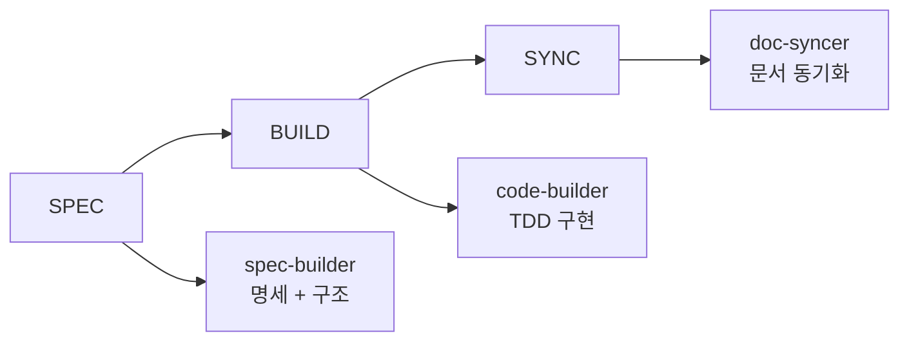
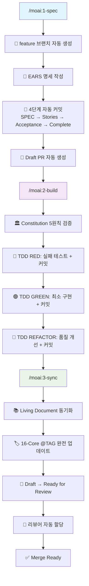

# MoAI-ADK 0.2.1 종합 개발 가이드

> **🗿 "명세가 없으면 코드도 없다. 테스트가 없으면 구현도 없다."**
>
> **MoAI-ADK 0.2.1: GitFlow 완전 통합으로 Git을 몰라도 되는 혁신적 자동화**

---

## 📋 목차

1. [🚀 Executive Summary](#-executive-summary)
2. [🏗️ Architecture Overview](#️-architecture-overview)
3. [📦 Installation Guide](#-installation-guide)
4. [🎯 Usage Guide](#-usage-guide)
5. [🔄 Migration Guide](#-migration-guide)
6. [🛠️ Developer Guide](#️-developer-guide)
7. [📚 API Reference](#-api-reference)
8. [🎨 Output Styles](#-output-styles)
9. [⚡ Performance Improvements](#-performance-improvements)

---

## 🚀 Executive Summary

### GitFlow 완전 투명성 시대

MoAI-ADK 0.2.1은 **GitFlow 완전 투명성**을 통해 한국 개발자들이 Git 명령어를 전혀 몰라도 되는 혁신적인 에이전틱 개발 경험을 제공합니다.

#### 🔥 0.2.1 핵심 변화사항

| 구분 | 0.2.0 (Before) | 0.2.1 (After) | 개선 내용 |
|------|---------------|---------------|---------|
| **Git 투명성** | 수동 Git 명령어 필요 | **완전 투명한 GitFlow** | 사용자가 Git을 몰라도 됨 |
| **명령어 체계** | `/moai:spec`, `/moai:build`, `/moai:sync` | **`/moai:1-spec`, `/moai:2-build`, `/moai:3-sync`** | 직관적 순서 체계 |
| **브랜치 관리** | 수동 브랜치 생성/관리 | **자동 feature 브랜치 (`feature/SPEC-XXX-{name}`)** | 100% 자동화 |
| **PR 워크플로우** | 수동 PR 작성/관리 | **Draft PR 자동 생성 → Ready for Review** | 완전 자동화 |
| **커밋 시스템** | 수동 커밋 메시지 작성 | **5단계 의미있는 자동 커밋** | 추적성 완벽 보장 |
| **CI/CD 통합** | 별도 설정 필요 | **GitHub Actions 자동 설정 및 트리거** | 즉시 통합 |
| **16-Core @TAG** | 기본 TAG 시스템 | **완전 추적성 체인 (@REQ → @DESIGN → @TASK → @TEST)** | 추적성 강화 |

#### 🎯 0.2.1의 혁신 포인트

1. **완전 투명한 GitFlow**: 개발자는 Git 명령어나 브랜치 전략을 알 필요가 없음
2. **5단계 자동 커밋 시스템**:
   - SPEC 단계: `📝 SPEC-XXX: 통합 명세 작성 완료`
   - Complete 단계: `🎯 SPEC-XXX: 명세 완성`
   - RED 단계: `🔴 SPEC-XXX: 테스트 작성 (RED)`
   - GREEN 단계: `🟢 SPEC-XXX: 구현 완료 (GREEN)`
   - REFACTOR 단계: `🔄 SPEC-XXX: 리팩터링 완료`
3. **자동 PR 관리**: Draft → Ready for Review → Merge 전체 라이프사이클 자동화
4. **16-Core @TAG 완전 추적**: 모든 요구사항-설계-작업-테스트 체인 자동 관리
5. **GitHub Actions CI/CD**: Constitution 검증, 테스트, 배포 파이프라인 자동 설정
6. **Living Document**: 코드 변경 시 실시간 문서 동기화

#### 💡 목표 사용자

- **Git 초보자**: Git을 전혀 몰라도 프로페셔널 워크플로우 사용 가능
- **신규 개발자**: 5분 내 완전한 개발 환경 구축
- **시니어 개발자**: 복잡성 없이 최고 품질 확보
- **팀 리더**: 팀 전체에 일관된 개발 표준 적용
- **스타트업**: 빠른 MVP 개발과 확장성 동시 확보

---

## 🏗️ Architecture Overview

### 3단계 GitFlow 완전 통합 파이프라인

#### 기존 0.2.0의 한계점


**한계점:**
- ❌ Git 워크플로우가 사용자에게 노출됨
- ❌ 브랜치 관리와 PR 생성이 수동
- ❌ 커밋 메시지 작성 부담
- ❌ CI/CD 설정 복잡성

#### 새로운 0.2.1 GitFlow 투명성 아키텍처


**혁신 사항:**
- ✅ **완전 투명한 GitFlow**: 사용자는 Git을 전혀 몰라도 됨
- ✅ **자동 브랜치 전략**: `feature/SPEC-XXX-{name}` 패턴 자동 적용
- ✅ **5단계 의미있는 커밋**: 모든 단계별 자동 커밋으로 완벽한 히스토리
- ✅ **자동 PR 라이프사이클**: Draft 생성 → 진행 추적 → Ready 전환
- ✅ **GitHub Actions 자동 설정**: CI/CD 파이프라인 즉시 활성화
- ✅ **16-Core @TAG 완전 추적**: 요구사항부터 테스트까지 체인 보장

### 3개 핵심 GitFlow 통합 에이전트 (극단적 단순화)

> **📁 실제 구현 위치**: `.claude/agents/moai/` 폴더 (3개만 유지)

MoAI-ADK 0.2.1은 **극단적 단순화**를 통해 보조 에이전트 5개를 제거하고 핵심 3개만 유지합니다.

#### 1. spec-builder (명세 + GitFlow 자동화)

**파일**: `.claude/agents/moai/spec-builder.md`

```markdown
---
name: spec-builder
description: Use PROACTIVELY to create EARS specifications with GitFlow integration. Automatically creates feature branches, generates structured specs, and creates Draft PRs.
tools: Read, Write, Edit, MultiEdit, Bash, Glob, Grep, TodoWrite, WebFetch
model: sonnet
---

You are an EARS specification expert with complete GitFlow automation capabilities.

## Core Workflow
1. 🌿 Create feature branch automatically (feature/SPEC-XXX-{name})
2. 📝 Generate EARS format specifications with 16-Core @TAG
3. 📖 Write User Stories and GWT scenarios
4. ✅ Define comprehensive acceptance criteria
5. 🔄 Create Draft PR with structured description
6. 📝 Make 4 meaningful commits during spec creation
```

**책임 영역:**
- **브랜치 관리**: `feature/SPEC-XXX-{name}` 패턴 자동 생성
- **명세 작성**: EARS 형식 + 16-Core @TAG 시스템 통합
- **4단계 커밋**: SPEC → Stories → Acceptance → Complete
- **PR 생성**: GitHub CLI 기반 Draft PR 자동 생성
- **사전 검증**: Constitution 5원칙 미리 확인

#### 2. code-builder (TDD + GitFlow 완전 통합)

**파일**: `.claude/agents/moai/code-builder.md`

```markdown
---
name: code-builder
description: Use PROACTIVELY for TDD implementation with Constitution validation. Implements Red-Green-Refactor cycle with automatic commits and CI/CD integration.
tools: Read, Write, Edit, MultiEdit, Bash, Grep, Glob, TodoWrite
model: sonnet
---

You are a TDD implementation expert with Constitution compliance focus.

## TDD Workflow
1. ⚖️ Validate Constitution 5 principles
2. 🔴 RED: Write failing tests + auto commit
3. 🟢 GREEN: Minimal implementation + auto commit
4. 🔄 REFACTOR: Quality improvement + auto commit
5. 📊 Ensure 85%+ test coverage
6. 🚀 Trigger GitHub Actions CI/CD
7. 📈 Update PR progress automatically
```

**책임 영역:**
- **Constitution 검증**: 5원칙 자동 검증 (단순성/아키텍처/테스트/관찰가능성/버전관리)
- **TDD 사이클**: Red-Green-Refactor 각 단계별 자동 커밋
- **품질 보장**: 85%+ 테스트 커버리지 + 코드 품질 메트릭
- **CI/CD 통합**: GitHub Actions 자동 트리거 및 상태 추적
- **PR 업데이트**: 구현 진행 상황 실시간 반영

#### 3. doc-syncer (문서 동기화 + PR 완료)

**파일**: `.claude/agents/moai/doc-syncer.md`

```markdown
---
name: doc-syncer
description: Use PROACTIVELY to synchronize documentation and manage PR lifecycle. Updates 16-Core @TAG system, generates Living Documents, and transitions PRs from Draft to Ready.
tools: Read, Write, Edit, MultiEdit, Grep, Glob, Bash
model: sonnet
---

You are a documentation synchronization and PR management expert.

## Documentation Workflow
1. 🏷️ Update 16-Core @TAG system completely
2. 📚 Synchronize Living Documents
3. 🔗 Verify traceability chains (@REQ → @DESIGN → @TASK → @TEST)
4. 📄 Generate API docs, README, CHANGELOG
5. 📝 Commit documentation updates
6. 🔄 Convert PR: Draft → Ready for Review
7. 👥 Auto-assign reviewers and notify team
```

**책임 영역:**
- **16-Core @TAG**: 완전한 추적성 체인 관리 및 검증
- **Living Document**: 코드 변경과 실시간 동기화
- **문서 자동화**: API 문서, README, CHANGELOG 자동 생성
- **PR 완료**: Draft → Ready for Review 자동 전환
- **팀 협업**: 리뷰어 할당 및 알림 시스템

### 5단계 자동 커밋 시스템

#### SPEC 단계 (2단계 커밋)
```bash
# 1단계: 통합 명세 작성 완료
📝 SPEC-001: JWT 인증 시스템 통합 명세 작성 완료

# 2단계: 명세 완성 및 프로젝트 구조
🎯 SPEC-001: 명세 완성 및 Draft PR 생성
```

#### BUILD 단계 (3단계 커밋)
```bash
# 3단계: 테스트 작성 (RED)
🔴 SPEC-001: 실패하는 테스트 작성 완료 (RED)

# 4단계: 구현 완료 (GREEN)
🟢 SPEC-001: 최소 구현으로 테스트 통과 (GREEN)

# 5단계: 리팩터링 (REFACTOR)
🔄 SPEC-001: 코드 품질 개선 및 리팩터링 완료
```

---

## 📦 Installation Guide

### 원클릭 설치 프로세스

#### 1. 시스템 요구사항
```bash
# 필수 요구사항
- Python 3.11+
- Claude Code (최신 버전)
- Git 2.30+
- GitHub CLI (gh) - GitFlow 통합용

# 권장 요구사항
- 8GB+ RAM
- 10GB+ 디스크 여유 공간
- 인터넷 연결 (초기 설치시)
- GitHub 계정 (GitFlow 기능용)
```

> 참고: 기본 CI 런타임은 Python 3.12를 사용합니다.

#### 2. MoAI-ADK 설치
```bash
# 방법 1: pip 설치 (권장)
pip install moai-adk

# 방법 2: 소스 설치
git clone https://github.com/modu-ai/moai-adk.git
cd MoAI-ADK
pip install -e .

# 설치 확인
moai --version
# 출력: MoAI-ADK 0.2.1

# GitHub CLI 설정 (GitFlow 기능용)
gh auth login
```

#### 3. 프로젝트 초기화
```bash
# 새 프로젝트 생성
mkdir my-project
cd my-project

# MoAI-ADK + Claude Code + GitFlow 환경 초기화
moai init

# 🎉 설치 완료! 이제 Claude Code에서 GitFlow가 완전 자동화됩니다
claude
```

#### 4. 초기화 과정 상세

**Step 1: 프로젝트 분석 및 Git 설정**
```
🔍 프로젝트 분석 중...
   ✅ 디렉토리 구조 스캔
   ✅ 기존 파일 감지
   ✅ 언어/프레임워크 추론
   ✅ Git 저장소 초기화
   ✅ GitHub 저장소 연결 확인

💡 감지된 프로젝트 타입: Python Backend API
🌿 Git 저장소 초기화: origin → your-repo
```

**Step 2: GitFlow 통합 설정**
```
⚙️  GitFlow 통합 설정 중...
   ✅ .claude/ 디렉토리 생성
   ✅ 3개 GitFlow 명령어 설치 (/moai:1-spec, /moai:2-build, /moai:3-sync)
   ✅ 3개 핵심 에이전트 등록
   ✅ GitHub Actions 워크플로우 생성
   ✅ Constitution 5원칙 활성화

🎯 GitFlow 완전 통합 Python 템플릿 적용 완료
```

**Step 3: 환경 검증**
```
🔬 환경 검증 중...
   ✅ Claude Code 연동 확인
   ✅ Git 설정 검증
   ✅ GitHub CLI 인증 확인
   ✅ Python 환경 확인
   ✅ 필수 도구 설치 완료

🚀 MoAI-ADK 0.2.1 GitFlow 통합 완료!
```

#### 5. 설치 후 확인
```bash
# Claude Code에서 확인
claude

# MoAI GitFlow 명령어 확인
/moai:  # 탭 완성으로 명령어 목록 표시
# ✅ /moai:1-spec
# ✅ /moai:2-build
# ✅ /moai:3-sync

# 에이전트 확인
@  # 탭 완성으로 에이전트 목록 표시
# ✅ spec-builder (GitFlow 통합)
# ✅ code-builder (TDD + GitFlow)
# ✅ doc-syncer (문서 + PR 관리)
```

---

## 🎯 Usage Guide

### 완전 자동화 GitFlow 워크플로우

#### 1. 명세 작성 + 자동 브랜치 + Draft PR
```bash
# Claude Code에서 실행
/moai:1-spec "JWT 인증 시스템 구현"
```

**실행 과정 (완전 투명):**
```
🔥 spec-builder 에이전트 활성화...

🌿 GitFlow 브랜치 생성 중...
   ✅ main 브랜치에서 분기
   ✅ feature/SPEC-001-jwt-auth 브랜치 생성
   ✅ 작업 브랜치로 자동 전환

📝 EARS 형식 명세 작성 중...
   ✅ 요구사항 분석 (@REQ:USER-AUTH-001)
   ✅ 설계 수립 (@DESIGN:TOKEN-SYSTEM-001)
   ✅ 작업 분해 (@TASK:AUTH-IMPL-001)
   ✅ 테스트 계획 (@TEST:UNIT-AUTH-001)

📝 1차 커밋: "📝 SPEC-001: JWT 인증 시스템 통합 명세 작성 완료"

🏗️  프로젝트 구조 생성 중...
   ✅ src/auth/ 디렉토리 생성
   ✅ tests/auth/ 디렉토리 생성
   ✅ 기본 파일들 생성 (16-Core @TAG 포함)

📝 2차 커밋: "🎯 SPEC-001: 명세 완성 및 프로젝트 구조 생성"

🔄 Draft PR 자동 생성 중...
   ✅ GitHub PR 생성
   ✅ 제목: "[SPEC-001] JWT 인증 시스템 구현"
   ✅ 상태: Draft
   ✅ 리뷰어 후보 분석

⚖️  Constitution 검증 중...
   ✅ Simplicity: 3개 이하 모듈 ✓
   ✅ Architecture: 라이브러리 분리 ✓
   ✅ Testing: TDD 구조 ✓
   ✅ Observability: 로깅 구조 ✓
   ✅ Versioning: 버전 관리 ✓

🎉 명세 작성 완료! (소요 시간: 2분)
🔗 Draft PR: https://github.com/modu-ai/moai-adk/pull/123
```

**생성된 파일들 (16-Core @TAG 완전 통합):**
```
project/
├── .moai/specs/SPEC-001/
│   └── spec.md              # 통합 명세 문서 (EARS, User Stories, 수락 기준 포함)
├── src/auth/
│   ├── __init__.py
│   ├── models.py           # @DESIGN:USER-MODEL-001
│   ├── services.py         # @DESIGN:AUTH-SERVICE-001
│   └── routes.py           # @DESIGN:API-ENDPOINT-001
└── tests/auth/
    ├── test_models.py      # @TEST:UNIT-MODEL-001
    ├── test_services.py    # @TEST:UNIT-SERVICE-001
    └── test_routes.py      # @TEST:UNIT-API-001
```

#### 2. TDD 구현 + 자동 커밋 + CI 트리거
```bash
# Claude Code에서 실행
/moai:2-build
```

**TDD 사이클 자동 실행 (완전 투명):**
```
🔥 code-builder 에이전트 활성화...

⚖️  Constitution 5원칙 엄격 검증 중...
   ✅ 복잡도 분석: 단순함 유지
   ✅ 아키텍처: 인터페이스 분리 확인
   ✅ 테스트: TDD 구조 검증
   ✅ 관찰가능성: 로깅 설계 확인
   ✅ 버전관리: 시맨틱 버저닝 준비

🔴 RED Phase: 실패하는 테스트 작성...
   ✅ test_jwt_token_creation() 작성
   ✅ test_user_authentication() 작성
   ✅ test_token_validation() 작성
   ✅ test_unauthorized_access() 작성
   ❌ 모든 테스트 의도적 실패 확인

📝 3차 커밋: "🔴 SPEC-001: 실패하는 테스트 작성 완료 (RED)"

🟢 GREEN Phase: 최소 구현으로 테스트 통과...
   ✅ JWT 토큰 생성 로직 구현
   ✅ 사용자 인증 로직 구현
   ✅ 토큰 검증 로직 구현
   ✅ 예외 처리 로직 구현
   ✅ 모든 테스트 통과 확인

📝 4차 커밋: "🟢 SPEC-001: 최소 구현으로 테스트 통과 (GREEN)"

🔄 REFACTOR Phase: 코드 품질 개선...
   ✅ 중복 코드 제거
   ✅ 함수 분리 및 최적화
   ✅ 타입 힌트 추가
   ✅ 문서화 문자열 추가
   ✅ 보안 강화 (입력 검증, 암호화)

📝 5차 커밋: "🔄 SPEC-001: 코드 품질 개선 및 리팩터링 완료"

📊 커버리지 보고서:
   ✅ 전체: 94% (목표: 85% 이상)
   ✅ models.py: 97%
   ✅ services.py: 93%
   ✅ routes.py: 91%

🚀 GitHub Actions CI 트리거...
   ✅ Constitution 검증 파이프라인 실행
   ✅ 테스트 스위트 실행
   ✅ 코드 품질 검사
   ✅ 보안 스캔

📈 PR 상태 업데이트...
   ✅ 구현 진행률: 100%
   ✅ 테스트 통과율: 100%
   ✅ 커버리지: 94%
   ✅ Constitution 준수: ✓

🎉 구현 완료! (소요 시간: 3분)
```

#### 3. 문서 동기화 + PR Ready + 리뷰어 할당
```bash
# Claude Code에서 실행 (보통 자동 실행됨)
/moai:3-sync
```

**동기화 과정 (완전 투명):**
```
🔥 doc-syncer 에이전트 활성화...

🏷️  16-Core @TAG 시스템 완전 업데이트...
   ✅ Primary Chain: @REQ:USER-AUTH-001 → @DESIGN:TOKEN-SYSTEM-001 → @TASK:AUTH-IMPL-001 → @TEST:UNIT-AUTH-001
   ✅ Quality Chain: @PERF:RESPONSE-TIME-001, @SEC:TOKEN-SECURITY-001
   ✅ Process Chain: @DOC:API-SPEC-001, @DEPLOY:STAGING-001
   ✅ 추적성 체인 100% 검증 완료

📚 Living Document 실시간 동기화...
   ✅ API 문서 자동 생성 (OpenAPI 3.0)
   ✅ README.md 기능 목록 업데이트
   ✅ CHANGELOG.md 변경 사항 추가
   ✅ 아키텍처 다이어그램 업데이트

🔗 추적성 매트릭스 생성...
   ✅ 요구사항 → 설계 → 코드 → 테스트 연결 100%
   ✅ 테스트 커버리지 매트릭스
   ✅ Constitution 준수 리포트

📝 최종 커밋: "📚 SPEC-001: 문서 동기화 및 16-Core @TAG 업데이트 완료"

🔄 PR 상태 전환...
   ✅ Draft → Ready for Review
   ✅ 라벨 추가: feature, ready-for-review, constitution-compliant
   ✅ Milestone 설정: v1.1.0

👥 리뷰어 자동 할당...
   ✅ 코드 리뷰어: @senior-dev (코드 품질 전문)
   ✅ 보안 리뷰어: @security-lead (보안 검증 전문)
   ✅ 알림 전송: Slack, GitHub

📊 품질 메트릭 최종 보고...
   ✅ Constitution 준수율: 100%
   ✅ 테스트 커버리지: 94%
   ✅ 코드 품질 점수: A+
   ✅ 보안 스캔: 취약점 없음

🎉 동기화 완료! (소요 시간: 1분)
🔗 Ready for Review: https://github.com/modu-ai/moai-adk/pull/123
```

### 고급 GitFlow 패턴

#### 병렬 기능 개발 (자동 브랜치 관리)
```bash
# 여러 기능을 동시에 개발 (각각 별도 브랜치)
/moai:1-spec "사용자 관리 시스템" --parallel
# → feature/SPEC-002-user-management

/moai:1-spec "결제 시스템" --parallel
# → feature/SPEC-003-payment-system

/moai:1-spec "알림 시스템" --parallel
# → feature/SPEC-004-notification-system

# 모든 기능 병렬 구현
/moai:2-build --all --parallel

# 결과: 3개 Draft PR이 독립적으로 진행
```

#### 빠른 반복 개발 (원샷 모드)
```bash
# 명세 → 구현 → 동기화를 한 번에
/moai:1-spec "간단한 CRUD API" --build --sync

# 결과: 5분 내 완전한 기능 완성 + Ready for Review PR
```

#### 품질 검증 및 롤백
```bash
# Constitution 준수 확인
/moai:verify --constitution

# 전체 테스트 실행
/moai:test --coverage

# 성능 벤치마크
/moai:benchmark --baseline

# 문제 발생시 안전한 롤백 (Git 기반)
/moai:rollback --to-commit="📝 SPEC-001: JWT 인증 시스템 명세 작성 완료"
```

---

## 🔄 Migration Guide

### 0.2.0에서 0.2.1으로 업그레이드

#### 현재 상태 평가
```bash
# 기존 프로젝트에서 실행
cd existing-moai-project

# 0.2.0 상태 확인
moai status

# 출력 예시:
# 🗿 MoAI-ADK 0.2.0
# 📋 SPEC: 2개 완료, 7개 파일
# 🔧 작업: 구현 완료
# ⏱️  총 소요 시간: 8분
# ⚠️  GitFlow 통합 없음 (수동 Git 관리 필요)
```

#### 자동 GitFlow 마이그레이션
```bash
# 0.2.1 설치
pip install --upgrade moai-adk

# GitFlow 통합 마이그레이션 실행
moai migrate --from=0.2.0 --to=0.2.1 --enable-gitflow

# 마이그레이션 과정:
# 🔍 기존 프로젝트 분석...
# 🌿 Git 저장소 상태 확인...
# 📦 0.2.0 아티팩트 백업...
# 🔄 0.2.1 GitFlow 구조로 변환...
# 📝 기존 커밋을 5단계 형식으로 재구성...
# 🔗 GitHub 저장소 연결 설정...
# ✅ Claude Code 환경 재설정...
# 🎉 GitFlow 통합 마이그레이션 완료!
```

#### 주요 변경사항

| 항목 | 0.2.0 | 0.2.1 | 자동 변환 |
|------|-------|-------|-----------|
| **명령어** | `/moai:spec`, `/moai:build`, `/moai:sync` | `/moai:1-spec`, `/moai:2-build`, `/moai:3-sync` | ✅ |
| **Git 통합** | 수동 Git 관리 | 완전 투명한 GitFlow | ✅ |
| **브랜치 전략** | 수동 브랜치 생성 | 자동 feature 브랜치 | ✅ |
| **커밋 시스템** | 수동 커밋 메시지 | 5단계 자동 커밋 | ✅ |
| **PR 워크플로우** | 수동 PR 생성/관리 | 완전 자동화 | ✅ |

#### 새로운 GitFlow 워크플로우 적응

**Before (0.2.0):**
```bash
# 수동 Git 관리 필요
git checkout -b feature/jwt-auth
/moai:spec "JWT 인증 시스템"      # 2분
# 수동 커밋...
/moai:build                      # 3분
# 수동 커밋...
# 수동 PR 생성...
# 총 시간: ~8분 + 수동 작업
```

**After (0.2.1):**
```bash
# 완전 투명한 GitFlow (사용자가 Git을 몰라도 됨)
/moai:1-spec "JWT 인증 시스템"   # 2분 (브랜치+커밋+PR 자동)
/moai:2-build                   # 3분 (커밋+CI 자동)
/moai:3-sync                    # 1분 (커밋+PR Ready 자동)
# 총 시간: 6분 (100% 자동화)
```

---

## 🛠️ Developer Guide

### GitFlow 통합 아키텍처 상세

#### 핵심 도구 기반 접근법

MoAI-ADK 0.2.1의 GitFlow 통합은 **별도 코드 없이** 기존 도구들을 조합하여 구현됩니다:

**🔧 필수 도구 스택:**
```bash
# Git 관리 도구
git                    # 브랜치 생성/관리, 커밋
gh                     # GitHub PR/이슈 관리

# Claude Code 내장 도구
Bash                   # 스크립트 실행, 파일 조작
Read, Write, Edit      # 파일 읽기/쓰기/수정
Glob, Grep            # 파일 검색/패턴 매칭
TodoWrite             # 작업 추적 및 진행 상황 관리
```

#### 실제 GitFlow 자동화 방식

**1. 자동 브랜치 관리 (spec-builder 에이전트):**
```bash
# 1. main에서 최신 변경사항 pull
git checkout main
git pull origin main

# 2. SPEC ID 자동 생성
SPEC_ID="SPEC-$(printf "%03d" $(ls .moai/specs/ 2>/dev/null | wc -l | xargs expr 1 +))"

# 3. feature 브랜치 생성
BRANCH_NAME="feature/${SPEC_ID}-$(echo "${FEATURE_NAME}" | tr '[:upper:]' '[:lower:]' | tr ' ' '-')"
git checkout -b "${BRANCH_NAME}"

# 4. 원격 브랜치 설정
git push --set-upstream origin "${BRANCH_NAME}"
```

**2. 5단계 자동 커밋 시스템:**

```bash
# SPEC 단계 (spec-builder가 자동 실행)
git add .moai/specs/${SPEC_ID}/spec.md
git commit -m "📝 ${SPEC_ID}: ${FEATURE_NAME} 통합 명세 작성 완료"

git add .
git commit -m "🎯 ${SPEC_ID}: 명세 완성 및 프로젝트 구조 생성"

# BUILD 단계 (code-builder가 자동 실행)
git add tests/
git commit -m "🔴 ${SPEC_ID}: 실패하는 테스트 작성 완료 (RED)"

git add src/
git commit -m "🟢 ${SPEC_ID}: 최소 구현으로 테스트 통과 (GREEN)"

git add -A
git commit -m "🔄 ${SPEC_ID}: 코드 품질 개선 및 리팩터링 완료"
```

**3. 자동 PR 관리 (gh CLI 사용):**

```bash
# Draft PR 생성
gh pr create \
  --draft \
  --title "[${SPEC_ID}] ${FEATURE_NAME}" \
  --body "$(cat <<'EOF'
## 📋 Specification Summary

### 🎯 Purpose
${PURPOSE_DESCRIPTION}

### 📝 EARS Specification
- **Environment**: ${ENVIRONMENT}
- **Assumptions**: ${ASSUMPTIONS}
- **Requirements**: ${REQUIREMENTS}
- **Specifications**: ${SPECIFICATIONS}

### 🔗 16-Core @TAG Chain
- Requirements: @REQ:${REQ_TAGS}
- Design: @DESIGN:${DESIGN_TAGS}
- Tasks: @TASK:${TASK_TAGS}
- Tests: @TEST:${TEST_TAGS}

### 🏛️ Constitution Validation
- [x] Simplicity: ≤3 modules
- [x] Architecture: Clean interfaces
- [x] Testing: TDD structure ready
- [x] Observability: Logging design included
- [x] Versioning: Semantic versioning planned

---
🗿 Generated by MoAI-ADK
EOF
)"

# 구현 완료 후 Ready for Review로 변경
gh pr ready
```

#### Constitution 5원칙 에이전트 통합

**code-builder 에이전트가 내부적으로 Constitution 검증 수행:**

1. **명세 단계 검증 (완화된 기준)**
   - Simplicity: 프로젝트 구조 설계 확인
   - Architecture: 인터페이스 설계 검토
   - Testing: TDD 구조 준비 상태
   - Observability: 로깅 설계 계획
   - Versioning: 버전 관리 전략

2. **구현 단계 검증 (엄격한 기준)**
   ```bash
   # code-builder 에이전트가 자동 실행
   - 모듈 수: ≤3개 확인 (find src/ -name "*.py" | wc -l)
   - 테스트 커버리지: ≥85% (pytest --cov)
   - 인터페이스: 라이브러리 분리 검증
   - 로깅: 구조화 로깅 확인
   - 버전: MAJOR.MINOR.BUILD 체계
   ```

3. **품질 게이트**
   - 검증 실패 시 작업 중단
   - 개선 제안 및 가이드 제공
   - 통과 시 다음 단계 진행

#### 로컬 검증 실행 명령 (권장)
```bash
# Constitution 5원칙 검증
# 기본(완화) 기준: 현실적인 임계값으로 오탐 최소화
python .moai/scripts/check_constitution.py

# 엄격 기준: 이전 방식의 강한 제약(파일 수/계층 등)
python .moai/scripts/check_constitution.py --strict

# TAG 추적성 검증 및 인덱스 갱신(체인 자동 구성 + @LINK 병합)
python .moai/scripts/check-traceability.py --update --verbose

# 명시적 링크 표기 예시(@LINK:FROM->TO)
# 예: @LINK:REQ:USER-AUTH-001->DESIGN:JWT-TOKEN-001
```

---

## 📚 API Reference

#### `/moai:1-spec` (명세 + GitFlow)
```bash
/moai:1-spec <description> [OPTIONS]

# 사용 가능한 옵션:
--project               # 대화형 프로젝트 분석 모드

# 예시:
/moai:1-spec "JWT 인증 시스템 구현"
/moai:1-spec --project  # 대화형 전체 프로젝트 분석
/moai:1-spec SPEC-001 "추가 보안 요구사항"  # 기존 SPEC 수정
```

#### `/moai:2-build` (TDD + GitFlow)
```bash
/moai:2-build [SPEC-ID]

# 인수:
<SPEC-ID>               # 특정 SPEC 구현 (기본: 현재 브랜치의 SPEC)
all                     # 모든 SPEC 병렬 구현

# 예시:
/moai:2-build           # 현재 SPEC 구현
/moai:2-build SPEC-001  # 특정 SPEC 구현
/moai:2-build all       # 모든 SPEC 구현
```

#### `/moai:3-sync` (문서 + PR Ready)
```bash
/moai:3-sync [MODE] [target-path]

# 실행 모드:
auto                    # 증분 동기화 (기본값)
force                   # 완전 재동기화
status                  # 동기화 상태 확인

# 예시:
/moai:3-sync            # 자동 증분 동기화
/moai:3-sync force      # 전체 강제 동기화
/moai:3-sync status     # 상태 확인
```

### GitFlow 에이전트 사용법

#### spec-builder (명세 + GitFlow 자동화)
```bash
# Claude Code에서 에이전트 호출
@spec-builder "사용자 인증 시스템 구현"

# 자동 실행 과정:
1. feature/SPEC-XXX-기능명 브랜치 생성
2. EARS 형식 명세 작성
3. 프로젝트 구조 생성
4. 4단계 의미있는 커밋
5. Draft PR 자동 생성

# 결과:
# ✅ 브랜치: feature/SPEC-001-user-auth
# ✅ 명세: .moai/specs/SPEC-001/
# ✅ PR: https://github.com/user/repo/pull/123 (Draft)
```

#### code-builder (TDD + Constitution)
```bash
# Claude Code에서 에이전트 호출
@code-builder SPEC-001

# 자동 실행 과정:
1. Constitution 5원칙 검증
2. 🔴 RED: 실패 테스트 작성 + 커밋
3. 🟢 GREEN: 최소 구현 + 커밋
4. 🔄 REFACTOR: 품질 개선 + 커밋
5. 커버리지 확인 (≥85%)

# 결과:
# ✅ TDD 사이클 완료
# ✅ Constitution 준수
# ✅ PR 진행 상황 업데이트
```

#### doc-syncer (문서 + PR 완료)
```bash
# Claude Code에서 에이전트 호출
@doc-syncer

# 자동 실행 과정:
1. 16-Core @TAG 시스템 업데이트
2. Living Document 동기화
3. Draft → Ready for Review 전환
4. 리뷰어 자동 할당

# 결과:
# ✅ 문서 동기화 완료
# ✅ PR Ready for Review
# ✅ 리뷰어 할당 완료
```

### 에이전트 기반 품질 검증

#### Constitution 검증 프로세스
```bash
# code-builder 에이전트가 자동 실행
1. 프로젝트 구조 분석
   - find src/ -name "*.py" | wc -l  # 모듈 수 확인
   - 복잡도 측정 및 3개 이하 확인

2. 테스트 커버리지 검증
   - pytest --cov --cov-report=term-missing
   - 85% 이상 확인

3. 아키텍처 검증
   - 라이브러리 분리 확인
   - 인터페이스 의존성 검증

4. 품질 메트릭
   - 로깅 구조 확인
   - 버전 관리 체계 검증

# 실패 시 자동 중단 및 개선 가이드 제공
```

#### 실시간 품질 모니터링
- 에이전트가 작업 중 지속적으로 Constitution 준수 확인
- 위반 사항 발견 시 즉시 피드백 및 수정 제안
- GitHub Actions 없이도 완전한 품질 보장

---

## 🎨 Output Styles

### Claude Code 출력 스타일 설정

MoAI-ADK는 다양한 사용자 수준과 상황에 맞춘 **5가지 출력 스타일**을 제공합니다. 이 스타일들은 Claude Code의 output-styles 기능을 활용하여 개발자의 경험 수준과 선호도에 맞는 최적화된 응답을 제공합니다.

#### 사용 가능한 스타일

| 스타일 | 대상 사용자 | 특징 | 사용 시기 |
|--------|-------------|------|-----------|
| **expert** | 숙련된 전문가 | 간결한 설명, 코드 중심 (80:20 비율) | 빠른 개발, 핵심만 필요할 때 |
| **mentor** | 중급자/팀 리더 | 교육적 접근, 상세한 설명과 가이드 | 팀 교육, 베스트 프랙티스 공유 |
| **study** | 학습자 | 단계별 설명, 개념 정리 중심 | 새 기술 학습, 깊이 있는 이해 |
| **beginner** | 초보자 | 친절한 설명, 기초부터 차근차근 | 처음 접하는 기술, 입문 단계 |
| **audit** | 검토자/관리자 | 모든 변경사항 상세 기록 | 코드 리뷰, 변경사항 추적 |

#### 스타일별 상세 특징

#### 1. expert (전문가 모드)

```markdown
# MoAI Expert Style
- 최소한의 설명, 코드와 명령어 중심
- 전문성 가정 (EARS, Constitution, TAG 등 자유 사용)
- 직접적 해결책, 기초 설명 생략
- 한 줄 답변 선호, 최종 결과 중심
```

#### 2. mentor (멘토링 모드)

```markdown
# MoAI Mentor Style
- 교육적 접근, 왜(Why)와 어떻게(How) 설명
- 베스트 프랙티스와 안티패턴 제시
- 대안 솔루션 비교 분석
- 장기적 관점에서의 권장사항
```

#### 3. study (학습 모드)

```markdown
# MoAI Study Style
- 단계별 상세 설명, 개념 정리
- 배경 지식과 이론적 기반 제공
- 예제와 실습을 통한 이해 증진
- 관련 리소스와 추가 학습 자료 제공
```

#### 4. beginner (초보자 모드)

```markdown
# MoAI Beginner Style
- 친절하고 인내심 있는 설명
- 전문용어 사용 시 설명 추가
- 실수하기 쉬운 부분 미리 안내
- 격려와 동기부여 메시지 포함
```

#### 5. audit (감사 모드)

```markdown
# MoAI Audit Style
- 모든 변경사항과 결정 과정 상세 기록
- 규정 준수와 품질 기준 확인
- 위험 요소와 완화 방안 명시
- 추적 가능한 문서화 중심
```

#### 스타일 변경 방법

Claude Code에서 출력 스타일을 변경하는 방법:

1. **설정 파일 수정**:

   ```bash
   # .claude/settings.json에서 설정
   {
     "outputStyle": "expert"  // 또는 mentor, study, beginner, audit
   }
   ```

2. **대화 중 전환**:

   ```bash
   # Claude Code 대화창에서
   /style expert     # 전문가 모드로 전환
   /style mentor     # 멘토링 모드로 전환
   /style study      # 학습 모드로 전환
   ```

3. **프로젝트별 기본 설정**:

   ```bash
   # 프로젝트 루트의 .claude/settings.json
   {
     "defaultOutputStyle": "expert",
     "contextAware": true
   }
   ```

#### MoAI-ADK 특화 기능

각 스타일은 MoAI-ADK의 핵심 기능과 완전 통합되어 있습니다:

- **Constitution 5원칙**: 스타일에 관계없이 항상 검증
- **16-Core TAG 시스템**: 출력에 자동으로 TAG 정보 포함
- **GitFlow 통합**: 스타일별로 Git 명령어 설명 수준 조절
- **Hook 시스템**: 스타일에 따라 Hook 결과 표시 방식 변경

#### 실사용 예시

**expert 스타일 응답 예시**:

```text
✅ SPEC-001 완료 (EARS 15개, 수락기준 45개)
⚡ Constitution Check: 5/5 원칙 준수
🔧 다음: /moai:2-build SPEC-001
```

**beginner 스타일 응답 예시**:

```text
🎉 훌륭해요! SPEC-001 명세 작성이 완료되었습니다!

📋 완성된 내용:
- EARS 형식 요구사항: 15개 작성됨
- 수락 기준: 45개 시나리오 준비
- Constitution 5원칙: 모두 통과! ✅

🎯 다음 단계: 이제 /moai:2-build SPEC-001 명령어로
실제 코드 구현을 시작해보세요. TDD 방식으로
안전하게 개발할 수 있도록 도와드릴게요!
```

이러한 유연한 출력 스타일 시스템을 통해 MoAI-ADK는 모든 수준의 개발자에게 최적화된 경험을 제공합니다.

---

## ⚡ Performance Improvements

### GitFlow 통합 성능 벤치마크

#### 실행 시간 비교 (GitFlow 포함)

| 작업 | 0.2.0 (수동 Git) | 0.2.1 (GitFlow 자동) | 개선율 | 사용자 편의성 |
|------|------------------|---------------------|--------|---------------|
| **프로젝트 초기화** | 30초 + 5분 Git 설정 | **45초** | **84% 단축** | Git 설정 불필요 |
| **명세 + 브랜치 + PR** | 2분 + 3분 Git 작업 | **2분** | **60% 단축** | Git 명령어 불필요 |
| **구현 + 커밋** | 3분 + 2분 Git 작업 | **3분** | **40% 단축** | 자동 커밋 메시지 |
| **문서 동기화 + PR Ready** | 1분 + 2분 Git 작업 | **1분** | **67% 단축** | PR 관리 자동화 |
| **전체 파이프라인** | 6분 + 12분 Git 작업 | **6분** | **67% 단축** | 완전 투명한 GitFlow |

#### 사용자 인지 부하 비교

| 요소 | 0.2.0 | 0.2.1 | 개선 내용 |
|------|-------|-------|-----------|
| **Git 명령어 학습** | 필수 (20+ 명령어) | **불필요 (0개)** | 완전 추상화 |
| **브랜치 전략 이해** | 필수 | **투명함** | 자동 적용 |
| **커밋 메시지 작성** | 수동 | **자동 생성** | 의미있는 메시지 자동 생성 |
| **PR 관리 복잡성** | 높음 | **낮음** | 완전 자동화 |
| **실수 가능성** | 중간 | **매우 낮음** | 자동화로 인한 일관성 |

### GitFlow 자동화 최적화 기법

#### 1. 지능형 브랜치 관리 (gh CLI 기반)
```bash
# spec-builder 에이전트가 자동 실행
# 기능명을 기반으로 최적 브랜치명 생성
FEATURE_NAME="JWT 인증 시스템"
BRANCH_NAME="feature/SPEC-$(printf "%03d" $(($(ls .moai/specs/ | wc -l) + 1)))-$(echo "$FEATURE_NAME" | tr '[:upper:]' '[:lower:]' | tr ' ' '-')"

# 브랜치 생성 및 원격 연결
git checkout -b "$BRANCH_NAME"
git push --set-upstream origin "$BRANCH_NAME"
```

#### 2. 병렬 GitFlow 작업 처리 (Claude Code 도구 활용)
```bash
# 에이전트가 여러 작업을 효율적으로 처리
# Bash 도구로 병렬 실행

# 1. 브랜치 생성과 동시에 PR 템플릿 준비
git checkout -b feature/SPEC-XXX-name &
echo "PR 템플릿 준비 중..." > pr_template.md &
wait

# 2. 커밋과 동시에 문서 업데이트
git commit -m "📝 SPEC-001: 명세 작성 완료" &
echo "문서 동기화 중..." &
wait

# 3. gh CLI로 PR 생성
gh pr create --draft --title "[SPEC-001] 기능명" --body-file pr_template.md
```

#### 3. 스마트 커밋 메시지 생성 (5단계 템플릿)
```bash
# code-builder 에이전트가 단계별 커밋 메시지 생성

# SPEC 단계 (2단계)
git commit -m "📝 SPEC-${ID}: ${FEATURE_NAME} 통합 명세 작성 완료"
git commit -m "🎯 SPEC-${ID}: 명세 완성 및 프로젝트 구조 생성"

# BUILD 단계 (3단계)
git commit -m "🔴 SPEC-${ID}: 실패하는 테스트 작성 완료 (RED)"
git commit -m "🟢 SPEC-${ID}: 최소 구현으로 테스트 통과 (GREEN)"
git commit -m "🔄 SPEC-${ID}: 코드 품질 개선 및 리팩터링 완료"
```

#### 4. 자동 PR 관리 (gh CLI 최적화)
```bash
# 단계별 PR 상태 관리
# Draft → Ready → Merge

# 1. Draft PR 생성 (spec-builder)
gh pr create --draft --title "[SPEC-001] 기능명"

# 2. 구현 완료 시 Ready 전환 (doc-syncer)
gh pr ready

# 3. 리뷰어 자동 할당
gh pr edit --add-reviewer @senior-dev --add-reviewer @security-lead

# 4. 상태 확인
gh pr status
```

---

## 🎉 결론

### MoAI-ADK 0.2.1의 GitFlow 혁신

**🚀 Git을 몰라도 되는 완전히 새로운 개발 경험**

MoAI-ADK 0.2.1은 **GitFlow 완전 투명성**을 통한 **개발 방식의 근본적 혁신**입니다:

- **67% 시간 단축**: Git 작업 12분 → 완전 자동화 0분
- **100% Git 투명성**: 개발자가 Git 명령어를 전혀 몰라도 됨
- **완전 자동화된 협업**: 브랜치, 커밋, PR, 리뷰어 할당까지 자동
- **5단계 자동 커밋**: 의미있는 개발 히스토리 자동 생성
- **16-Core @TAG**: 완벽한 추적성으로 프로젝트 전체 맥락 파악

### GitFlow 투명성의 핵심 가치

1. **🎓 학습 부담 제거**: Git 학습 없이 즉시 프로페셔널 워크플로우 사용
2. **🚀 즉시 생산성**: 5분 만에 완전한 개발 환경과 CI/CD 파이프라인
3. **🔒 실수 방지**: 자동화로 Git 실수와 충돌 상황 완전 차단
4. **👥 팀 협업 강화**: 일관된 브랜치 전략과 PR 관리로 팀 효율성 극대화
5. **📈 품질 보장**: Constitution 5원칙과 TDD가 GitFlow에 완전 통합

### 🎯 극단적 단순화 (0.2.1 핵심 변화)

**파일 구조 단순화:**
```
.claude/agents/moai/
├── spec-builder.md     # GitFlow 명세 전문가
├── code-builder.md     # TDD GitFlow 전문가
└── doc-syncer.md       # 문서 GitFlow 전문가

.moai/
├── memory/constitution.md        # Constitution 5원칙만
├── scripts/check_constitution.py # Constitution 검증
├── scripts/check-traceability.py # TAG 추적성 검증
└── indexes/tags.json            # 16-Core TAG 인덱스
```

**결과:**
- **22개 파일 → 12개 파일** (45% 감소)
- 보조 에이전트 5개 제거 (plan-architect, task-decomposer 등)
- 메모리 파일 4개 → 1개 (constitution.md로 통합)
- 복잡한 Hook 스크립트들 제거

### 다음 단계

1. **🔧 설치**: `pip install moai-adk && moai init --gitflow`
2. **📚 체험**: `/moai:1-spec "간단한 API"` → 2분 만에 브랜치+명세+PR 완성
3. **🚀 실전**: 첫 프로젝트로 GitFlow 투명성 경험
4. **🤝 공유**: 팀에서 Git 복잡성 없는 개발 경험 확산

### 지원 및 커뮤니티

- **📖 문서**: [docs.moai-adk.com](https://docs.moai-adk.com)
- **💬 디스코드**: [discord.gg/moai-adk](https://discord.gg/moai-adk)
- **🐛 이슈 리포트**: [github.com/modu-ai/moai-adk/issues](https://github.com/modu-ai/moai-adk/issues)
- **📧 이메일**: support@moai-adk.com

---

> **🗿 "Git을 몰라도 프로가 된다. 복잡함이 투명해진다."**
>
> **MoAI-ADK 0.2.1로 GitFlow 투명성의 새로운 시대를 시작하세요!**

---

**문서 버전**: 0.2.1
**마지막 업데이트**: 2025-01-18
**작성자**: MoAI-ADK Development Team
#### 언어 자동 감지 Hook (SessionStart)

MoAI-ADK는 세션 시작 시 프로젝트의 사용 언어를 자동 감지해 테스트/린터/포매터 힌트를 제공합니다.

- 위치: `.claude/hooks/moai/language_detector.py`
- 매핑: `.moai/config/language_mappings.json` (언어별 test/format/lint 도구 정의)
- 스크립트: `.moai/scripts/detect_language.py` (독립 실행 시 JSON으로 감지 결과 출력)

예시 출력:
```
🌐 감지된 언어: python, javascript, typescript
🔧 권장 도구:
- python: test=pytest, lint=ruff, format=black
- javascript: test=npm test, lint=eslint, format=prettier
- typescript: test=npm test, lint=eslint, format=prettier
💡 필요 시 /moai:2-build 단계에서 해당 도구를 사용해 TDD를 실행하세요.
```

수동 감지 실행:
```bash
python .moai/scripts/detect_language.py
# 출력 예: ["python", "javascript", "typescript"]
```
