# MoAI-ADK 0.2.2 종합 개발 가이드

> **🗿 "명세가 없으면 코드도 없다. 테스트가 없으면 구현도 없다."**
>
> **MoAI-ADK 0.2.2: 개인/팀 모드 통합 시스템으로 모든 개발자를 위한 완전한 Git 자동화**

---

## 📋 목차

1. [🚀 Executive Summary](#-executive-summary)
2. [🏗️ Architecture Overview](#️-architecture-overview)
3. [📦 Installation Guide](#-installation-guide)
4. [🎯 Usage Guide](#-usage-guide)
5. [🔄 Migration Guide](#-migration-guide)
6. [🛠️ Developer Guide](#️-developer-guide)
7. [📚 API Reference](#-api-reference)
8. [🎨 Output Styles](#-output-styles)
9. [⚡ Performance Improvements](#-performance-improvements)
10. [🔧 File Structure & Configuration](#-file-structure--configuration)
11. [🛠️ Troubleshooting Guide](#️-troubleshooting-guide)
12. [📋 System Verification](#-system-verification)

---

## 🚀 Executive Summary

### 완전한 Git 투명성과 개인/팀 모드 통합

MoAI-ADK 0.2.2는 **개인/팀 모드 자동 감지 시스템**과 **Git 완전 자동화**를 통해 모든 개발자가 Git을 몰라도 되는 혁신적인 개발 경험을 제공합니다.

#### 🔥 0.2.2 핵심 변화사항

| 구분                  | v0.2.1 (Before) | v0.2.2 (After)             | 개선 내용                   |
| --------------------- | --------------- | -------------------------- | --------------------------- |
| **개발 모드**         | 단일 모드       | **개인/팀 모드 자동 선택** | 사용 패턴별 최적화          |
| **Git 통합**          | 기본 자동화     | **완전한 Git 투명성**      | Git 명령어 완전 불필요      |
| **체크포인트 시스템** | 없음            | **자동 백업/롤백**         | 실험적 개발 안전 보장       |
| **브랜치 전략**       | 고정된 GitFlow  | **모드별 최적 전략**       | 개인/팀 상황별 맞춤화       |
| **Git 관리**          | 수동 Git 작업   | **완전 자동화된 Git 통합** | git-manager 에이전트 기반   |
| **설정 복잡도**       | 수동 설정       | **원클릭 모드 선택**       | moai init --personal/--team |
| **롤백 기능**         | Git 수동        | **체크포인트 기반 롤백**   | 시점별 안전한 복구          |

#### 🎯 0.2.2의 혁신 포인트

1. **🧪 개인 모드 (Personal Mode)**:
   - **자동 체크포인트(태그 기반)**: 5분 주기 + 파일 변경 시 즉시 Annotated Tag 생성
   - **간소화된 브랜치**: `feature/{description}` 패턴으로 실험 분리

- **롤백 친화적 흐름**: `git tag -a moai_cp/...` 활용으로 1분 내 복구를 목표
- **실험적 개발**: 실패해도 걱정 없는 안전망 제공

2. **🏢 팀 모드 (Team Mode)**:
   - **GitHub Issue 중심 백로그**: `/moai:1-spec` → `[SPEC-XXX]` Issue 생성 후 담당자·라벨 자동 권장
   - **7단계 자동 커밋**: 의미 있는 히스토리를 남기는 RED→GREEN→REFACTOR
   - **PR 라이프사이클 자동화(옵션)**: GitHub App 설정 후 Draft → Ready 전환, 리뷰어 추천을 자동화
   - **팀 협업 신호**: Slack/이메일 알림·Project 보드 업데이트 트리거 제공

3. **🔧 완전 자동화된 Git 관리**:

   **워크플로우 통합 Git 처리** (99% 케이스):

   ```bash
   /moai:1-spec      # spec-builder + git-manager (브랜치 생성, 커밋)
   /moai:2-build     # code-builder + git-manager (TDD 커밋)
   /moai:3-sync      # doc-syncer + git-manager (문서 동기화, PR 관리)
   ```

   **직접 Git 작업** (1% 특수 케이스):

   ```bash
   @agent-git-manager "체크포인트 생성"
   @agent-git-manager "브랜치 생성: feature/new-feature"
   @agent-git-manager "개인 모드 롤백"
   ```

> ⚠️ **0.2.2 Git 관리 시스템 안내**
>
> - **완전 자동화**: 모든 워크플로우에서 Git 작업이 자동으로 처리됩니다
> - **브랜치 전략**: git-manager가 모드별로 최적화된 브랜치를 자동 생성
> - **체크포인트**: 각 작업 단계마다 자동으로 안전한 복구 지점 생성
> - **커밋 메시지**: TRUST 원칙 기반으로 구조화된 커밋 메시지 자동 생성
> - **PR 관리**: 팀 모드에서 GitHub Issue → Draft PR → Ready 전환까지 자동화
> - **직접 호출**: 특수한 경우에만 `@agent-git-manager` 직접 호출 사용

4. **🎛️ 자동 모드 감지**:
   - **설치 시 선택**: `moai init --personal` (기본값) / `moai init --team`
   - **동적 전환**: 언제든지 모드 변경 가능
   - **상황별 최적화**: 개인 실험 vs 팀 협업에 맞춤

#### 🧭 신규 4단계 워크플로우: `/moai:0-project` → `/moai:3-sync`

1. **/moai:0-project – 프로젝트 킥오프**
   - `moai init` 시 복사되는 빈 프로젝트 문서(`.moai/project/{product,structure,tech}.md`)를 대화형 질문으로 갱신합니다.
   - CLAUDE.md는 `@.moai/project/product.md` 와 같이 `@` 임포트를 사용해 프로젝트 문서를 로드합니다. 내용을 업데이트한 뒤 `/clear` 또는 재시작을 통해 Claude 메모리에 반영하세요.
   - 기존 코드베이스인 경우에는 파일 구조·언어·테스트 커버리지 등을 분석해 초안을 채웁니다.
   - 자동 초안이 필요하면 `python3 .moai/scripts/project_initializer.py --analyze` 명령을 실행해 요약본을 생성하고, Claude 상에서 세부사항을 보완하세요.
   - 업데이트가 끝나면 **Claude Code를 재시작**해 CLAUDE 메모리에 새 프로젝트 문서를 로드합니다.

2. **/moai:1-spec – auto 제안 & 일괄 생성**
   - 프로젝트 문서를 읽고 도메인/기능에 맞는 SPEC 후보를 자동 제안합니다.
   - **Personal 모드**: 확인 후 `.moai/specs/`에 명세 파일을 일괄 생성합니다.
   - **Team 모드**: 확인 후 GitHub Issue/Discussion 등을 생성하고, feature 브랜치 템플릿과 연동합니다(중복 SPEC 방지).

3. **/moai:2-build – TDD (개인: 자동 체크포인트, 팀: 구조화 커밋)**

4. **/moai:3-sync – 문서/PR 동기화 & 상태 보고**

> ❗️ `--project` 옵션으로 다중 SPEC을 생성하던 기존 방식은 `/moai:0-project` + `/moai:1-spec` auto 플로우로 대체되었습니다.

#### 💡 목표 사용자

- **🧪 개인 개발자**: 실험과 롤백이 자유로운 안전한 개발 환경
- **🏢 팀 개발자**: 완전 자동화된 GitFlow와 협업 시스템
- **📚 학습자**: Git 학습 부담 없이 즉시 프로페셔널 워크플로우
- **🚀 스타트업**: 빠른 개발과 높은 품질을 동시 달성

---

## 🏗️ Architecture Overview

### 개인/팀 모드 통합 시스템

#### 모드 자동 감지 및 전환

```mermaid
graph TD
    A[moai init] --> B{모드 선택}
    B -->|--personal| C[🧪 개인 모드]
    B -->|--team| D[🏢 팀 모드]
    B -->|기본값| C

    C --> C1[자동 체크포인트 활성화]
    C1 --> C2[간소화된 브랜치 전략]
    C2 --> C3[파일 감시 시스템]
    C3 --> C4[체크포인트 롤백 시스템]

    D --> D1[GitFlow 표준 활성화]
    D1 --> D2[Draft PR 자동 생성]
    D2 --> D3[7단계 커밋 시스템]
    D3 --> D4[팀 협업 도구 연동]

    style C fill:#e3f2fd
    style D fill:#f3e5f5
```



### Git 관리 시스템 아키텍처

#### 개인 모드 (Personal Mode) 워크플로우

```bash
# 1. 프로젝트 시작
moai init my-project --personal

# 2. 프로젝트 킥오프 (project 문서 초안 업데이트 + 메모리 로드)
/moai:0-project

# 3. 완전 자동화된 개발 워크플로우
/moai:1-spec                    # spec-builder + git-manager (자동 브랜치/커밋)
/moai:2-build                   # code-builder + git-manager (TDD + 자동 체크포인트)
/moai:3-sync                    # doc-syncer + git-manager (문서화 + 최종 커밋)

# 특수한 경우에만 직접 호출
@agent-git-manager "체크포인트 생성"
@agent-git-manager "이전 상태로 롤백"
```

#### 팀 모드 (Team Mode) 워크플로우

```bash
# 1. 팀 프로젝트 시작
moai init team-project --team

# 2. 프로젝트 킥오프 (project 문서 초안 업데이트 + GitHub 이슈 워크스페이스 연결)
/moai:0-project

# 3. 완전한 GitFlow 자동화
/moai:1-spec                    # spec-builder + git-manager (GitHub Issue + 브랜치 생성)
/moai:2-build                   # code-builder + git-manager (TDD + 7단계 자동 커밋)
/moai:3-sync                    # doc-syncer + git-manager (문서화 + PR Ready + 리뷰어 할당)

# 필요시 git-manager 직접 호출
@agent-git-manager "브랜치 상태 확인"
@agent-git-manager "최신 변경사항 동기화"
```

### project-manager + 핵심 에이전트 + git-manager

#### project-manager (프로젝트 킥오프 전문가)

**파일**: `.claude/agents/moai/project-manager.md`

**핵심 기능:**

- `/moai:0-project` 실행 시 레포지토리를 스캔해 신규/레거시 상황을 감지하고 인터뷰 트리를 선택
- product/structure/tech 문서를 대화형으로 작성하고 CLAUDE 메모리에 반영

**레거시 프로젝트 자동 분석 시스템:**

1. **자동 코드베이스 분석**: 프로젝트 구조 스캔, 핵심 파일 내용 분석, 기술 스택 자동 감지
2. **스마트 인터뷰**: 자동 분석으로 파악된 정보는 제외하고 부족한 정보만 선별적 질문
3. **통합 문서 생성**: 자동 분석(70-80%) + 사용자 응답(20-30%) = 완전한 프로젝트 문서

**처리 시간**: 기존 15-20분 → 5-8분으로 단축 (질문 수 70% 감소)

- 개인/팀 모드, 출력 스타일, 협업 도구 설정을 재확인하며 필요한 경우 `/moai:0-project update`에서 조정
- spec-builder, doc-syncer, git-manager가 후속 단계에서 사용할 공통 컨텍스트(팀 규모, 기술 스택, 레거시 제약)를 요약

#### cc-manager (환경/권한 최적화)

**파일**: `.claude/agents/moai/cc-manager.md`

- Claude Code 권한/훅/MCP 구성을 점검하고 Guard 정책이 올바르게 작동하는지 확인
- 프로젝트 전반의 설정 문제(permissions.allow, hooks 실행권한 등)를 진단하고 수정 제안을 제공
- 필요 시 project-manager와 협력해 모드 전환이나 환경 재구성 경고를 전달

#### 1. spec-builder (EARS 명세 + 모드별 브랜치 전략)

**파일**: `.claude/agents/moai/spec-builder.md`

**개인 모드 지원:**

- 간소화된 브랜치: `feature/{description}`
- 체크포인트와 함께 명세 작성
- 빠른 실험을 위한 간소화된 구조

**팀 모드 지원:**

- GitFlow 브랜치: `feature/SPEC-XXX-{name}`
- Draft PR 자동 생성
- 완전한 EARS 명세 + 16-Core @TAG

#### 2. code-builder (TDD + 모드별 커밋 전략)

**파일**: `.claude/agents/moai/code-builder.md`

**개인 모드 지원:**

- TDD 각 단계마다 자동 체크포인트
- 실패해도 안전한 실험 환경
- 체크포인트 기반 빠른 롤백

**팀 모드 지원:**

- 7단계 자동 커밋 (RED-GREEN-REFACTOR)
- TRUST 원칙 엄격 검증
- CI/CD 자동 트리거

#### 3. doc-syncer (문서 + 모드별 PR 관리)

**파일**: `.claude/agents/moai/doc-syncer.md`

**개인 모드 지원:**

- 간소화된 문서 동기화
- 체크포인트와 함께 문서화
- PR 생략 가능한 완료 프로세스

**팀 모드 지원:**

- 완전한 Living Document 동기화
- Draft → Ready for Review 전환
- 리뷰어 자동 할당

#### 4. git-manager (Git 작업 전담)

**파일**: `.claude/agents/moai/git-manager.md`

**모든 Git 작업의 중앙 관리자:**

- 체크포인트 생성/관리
- 브랜치 전략 실행
- 롤백 시스템 관리
- 원격 저장소 동기화
- 모드별 Git 전략 자동 선택

#### 5. debug-helper (통합 디버깅 시스템)

**파일**: `.claude/agents/moai/debug-helper.md`

- **일반 오류 디버깅**: 코드/Git/설정 오류 분석 및 해결책 제시
- **개발 가이드 위반 검사**: 5원칙 준수도 체계적 검증
- **구조화된 진단**: 문제 분석 → 영향도 평가 → 해결 방안 → 후속 작업 권장
- **에이전트 위임**: 진단만 수행하고 실제 수정은 전담 에이전트에게 위임
- **단일 책임**: debug-helper는 문제 식별에만 집중, 수정 작업은 code-builder/git-manager 등이 담당

### Git 관리 시스템

#### 완전 자동화된 Git 워크플로우

**워크플로우 기반 Git 처리** (권장 - 99% 케이스):

```bash
# 명세 작성 단계
/moai:1-spec                # spec-builder + git-manager
                           # → 브랜치 생성, SPEC 커밋 자동 처리

# TDD 구현 단계
/moai:2-build              # code-builder + git-manager
                           # → RED/GREEN/REFACTOR 커밋 자동 처리
                           # → 단계별 체크포인트 자동 생성

# 문서 동기화 단계
/moai:3-sync               # doc-syncer + git-manager
                           # → 문서 동기화, PR 관리 자동 처리
```

**직접 Git 작업** (특수 케이스 - 1%):

```bash
# 체크포인트 관련
@agent-git-manager "체크포인트 생성"
@agent-git-manager "체크포인트 목록 확인"
@agent-git-manager "이전 상태로 롤백"

# 브랜치 관련
@agent-git-manager "브랜치 상태 확인"
@agent-git-manager "브랜치 생성: feature/custom-feature"
@agent-git-manager "브랜치 정리"

# 동기화 관련
@agent-git-manager "원격 저장소 동기화"
@agent-git-manager "충돌 해결"
```

#### Git 작업 원칙

**🎯 Git 작업 우선순위**:

1. **99% 케이스**: 워크플로우 명령어 사용 (완전 자동 처리)
2. **1% 특수 케이스**: @agent-git-manager 직접 호출
3. **긴급상황**: 표준 git 명령어 사용

**✅ 자동으로 처리되는 Git 작업**:

- 브랜치 생성 및 전환 (모드별 최적화)
- 체크포인트 생성 및 관리 (안전한 복구 지점)
- 커밋 메시지 생성 (TRUST 원칙 기반)
- PR 생성 및 상태 관리 (팀 모드)
- 원격 저장소 동기화

#### git-manager 에이전트 특징

**🤖 완전 자동화된 Git 관리**:

- **모드별 최적화**: 개인/팀 모드에 따른 차별화된 Git 전략
- **개발 가이드 준수**: 모든 Git 작업이 5원칙을 자동으로 준수
- **16-Core @TAG**: TAG 시스템과 완전 연동된 커밋 관리
- **체크포인트 시스템**: 자동 백업 및 복구 (Annotated Tag 기반)
- **롤백 관리**: 안전한 이전 상태 복원
- **동기화 전략**: 모드별 원격 저장소 동기화
- **브랜치 관리**: 스마트 브랜치 생성 및 정리

#### 동기화 시스템

원격 저장소 동기화도 git-manager가 자동으로 처리합니다. 수동 점검이 필요하면 다음과 같이 요청할 수 있습니다.

```text
@agent-git-manager "원격 저장소와 최신 동기화 상태인지 확인"
@agent-git-manager "충돌 해결 절차 안내"
```

CLI에서 직접 확인하려면 `python .moai/scripts/sync_manager.py status` 를 실행하세요.

---

## 📦 Installation Guide

### 개인/팀 모드 선택적 설치

#### 1. 시스템 요구사항

```bash
# 필수 요구사항
- Python 3.11+
- Claude Code (최신 버전)
- Git 2.30+

# 선택 요구사항 (모드별)
개인 모드:
- watchdog (pip install watchdog) - 파일 감시용

팀 모드:
- GitHub CLI (gh) - PR 자동화용
- GitHub 계정 - 협업 기능용
```

#### 2. MoAI-ADK 설치

```bash
# 기본 설치
pip install moai-adk==0.2.2

# 개인 모드로 초기화 (기본값)
mkdir my-personal-project
cd my-personal-project
moai init --personal

# 팀 모드로 초기화
mkdir team-project
cd team-project
moai init --team

# 설치 확인
moai --version
# 출력: MoAI-ADK 0.2.2
```

#### 3. 모드별 초기화 과정

**개인 모드 초기화:**

```
🧪 개인 모드 초기화 중...

⚙️ 개인 개발 최적화 설정:
   ✅ .moai/config.json (personal 모드)
   ✅ 자동 체크포인트 활성화 (5분 간격)
   ✅ 파일 감시 시스템 (watchdog 설치 시)
   ✅ 간소화된 브랜치 전략
   ✅ 체크포인트 롤백 시스템

🤖 Git 관리:
   ✅ git-manager 에이전트 자동 체크포인트
   ✅ 브랜치/커밋/롤백 자동화
   ✅ 필요 시 `@agent-git-manager` 로 수동 지시 가능

🎉 개인 모드 설정 완료! 안전한 실험적 개발 환경 준비됨
```

**팀 모드 초기화:**

```
🏢 팀 모드 초기화 중...

⚙️ 팀 협업 최적화 설정:
   ✅ .moai/config.json (team 모드)
   ✅ GitFlow 표준 워크플로우
   ✅ Draft PR 자동 생성(Anthropic GitHub App 설정 시)
   ✅ 7단계 자동 커밋 패턴
   ✅ GitHub Actions CI/CD 연동

📁 협업 도구 연동:
   ✅ `/install-github-app` 실행 및 Anthropic GitHub App 설치
   ✅ GitHub CLI 연동 확인
   ✅ 리뷰어 추천/배정 자동화 (App + gh 설정 시)
   ✅ PR 라이프사이클/알림 연동

🎉 팀 모드 설정 완료! 전문적인 협업 환경 준비됨
```

#### 4. 모드 전환

가장 안전한 방법은 `/moai:0-project update`를 다시 실행해 인터뷰 도중 개인/팀 모드를 재선택하는 것입니다. 마법사는 기존 문서를 분석하고 팀 규모·협업 흐름을 다시 물어본 뒤 `.moai/config.json`을 일관되게 갱신합니다.

직접 CLI로 전환해야 할 경우에만 아래 명령을 사용하세요:

```bash
# 개인 → 팀 모드 전환 (수동)
moai config --mode team

# 팀 → 개인 모드 전환 (수동)
moai config --mode personal

# 현재 모드 확인
moai config --show
```

---

## 🎯 Usage Guide

### 0단계: `/moai:0-project` 프로젝트 문서 초기화

| 구분      | 질문 예시                         | 출력                         | 메모리 반영                       |
| --------- | --------------------------------- | ---------------------------- | --------------------------------- |
| Product   | “프로젝트 이름/비전/성공 지표는?” | `.moai/project/product.md`   | CLAUDE.md `Project Overview` 섹션 |
| Structure | “핵심 도메인/모듈/외부 연동은?”   | `.moai/project/structure.md` | CLAUDE.md `System Structure` 섹션 |
| Tech      | “언어/프레임워크/배포 타깃은?”    | `.moai/project/tech.md`      | CLAUDE.md `Tech Stack` 섹션       |

- **신규 프로젝트**: 대화형 질문(최대 10문항)으로 각 문서를 채운 뒤 저장한다.
- **기존 코드베이스**: `python3 .moai/scripts/project_initializer.py --analyze` 명령으로 언어/디렉터리/테스트 정보를 요약한 뒤 Claude 대화로 세부 내용을 보완한다.
- **설정 갱신**: 개인/팀 모드나 출력 스타일을 바꾸고 싶을 때는 `/moai:0-project update` 로 마법사를 다시 실행해 조정한다. (필요 시에만 `moai config --mode ...` 등 수동 명령 사용)
- **완료 후**: “Claude Code를 재시작해 새로운 프로젝트 문서를 메모리로 다시 불러오세요” 안내가 출력된다.

### 1단계: `/moai:1-spec` auto 제안 흐름

1. `.moai/project/*.md`를 읽어 주요 기능/우선순위를 추출한다.
2. **Personal 모드**: 제안 목록(예: SPEC-001~003)을 표시하고 사용자 승인 시 `.moai/specs/`에 일괄 생성한다.
3. **Team 모드**: GitHub Issue(또는 Discussion)를 생성하고 라벨·담당자·프로젝트 보드와 연동한다.
4. 수동 단일 SPEC이 필요할 때는 `/moai:1-spec "기능명"`을 사용하면 기존 방식으로 한 개만 생성한다.

---

### 개인 모드 (Personal Mode) 사용법

#### 안전한 실험적 개발 흐름

1. **프로젝트 문서 정리** – `/moai:0-project` 로 product/structure/tech 문서를 최신 상태로 맞춥니다.
2. **SPEC 작성** – `/moai:1-spec` 에서 필요한 기능을 선택해 `.moai/specs/`에 생성합니다.
3. **TDD 구현** – `/moai:2-build` 가 RED → GREEN → REFACTOR를 자동으로 수행하며, git-manager가 각 단계에서 체크포인트와 커밋을 남깁니다.
4. **문서 동기화** – `/moai:3-sync` 로 Living Document와 TAG 추적성을 갱신합니다.

> 체크포인트와 브랜치 관리, 커밋 메시지 작성, 롤백 지점 생성은 **git-manager 에이전트가 자동으로 처리**합니다. 실패한 실험도 안전하게 롤백되므로 Git 명령을 직접 실행할 필요가 없습니다.

#### 수동 개입이 필요할 때

특별한 실험이나 복구가 필요하면 Claude 대화창에서 다음과 같이 git-manager 에이전트를 직접 호출합니다.

```text
@agent-git-manager "체크포인트 생성: 새로운 실험 시작"
@agent-git-manager "체크포인트 목록 확인"
@agent-git-manager "최근 체크포인트로 롤백"
```

커맨드라인이 필요한 경우에는 통합 스크립트를 사용할 수 있습니다.

```bash
# 최근 체크포인트 5개 확인
python .moai/scripts/checkpoint_manager.py list 5

# 수동 체크포인트 생성
python .moai/scripts/checkpoint_manager.py create "실험 종료"

# 지정 태그로 롤백
python .moai/scripts/checkpoint_manager.py rollback moai_cp/20240924-153015
```

### 팀 모드 (Team Mode) 사용법

#### 완전한 GitFlow 자동화

1. **백로그 준비** – `/moai:0-project` 로 프로젝트 컨텍스트를 정리한 뒤 `/moai:1-spec` 을 실행하면, 확인한 SPEC이 GitHub Issue 또는 Discussion 으로 등록되고 대응되는 feature 브랜치가 생성됩니다.
2. **기능 개발** – 담당자는 생성된 Issue에서 브랜치 정보를 확인하고 `/moai:2-build SPEC-XXX` 를 실행하여 RED/GREEN/REFACTOR 커밋과 체크포인트를 자동으로 생성합니다.
3. **문서 & PR 동기화** – `/moai:3-sync` 는 Living Document 를 갱신하고 Draft PR 을 Ready for Review 로 승격하며 리뷰어 지정까지 수행합니다.

> 팀 모드에서도 git-manager가 브랜치 관리, 커밋 시그니처, 체크포인트 생성, PR 상태 전환을 자동으로 처리합니다. 수동으로 Git 명령을 실행할 필요가 없으며, 필요시 `@agent-git-manager` 에게 지시하면 됩니다.

#### 병렬 작업 시 팁

- GitHub CLI 로 Issue 상세를 확인하고 담당자를 조정합니다.
  ```bash
  gh issue list --label SPEC
  gh issue view SPEC-001 --web
  ```
- 브랜치나 PR 상태가 궁금하면 에이전트에게 직접 요청합니다.
  ```text
  @agent-git-manager "feature/SPEC-001-user-auth 브랜치 상태 요약"
  @agent-git-manager "현재 PR 동기화 방법 안내"
  ```

#### GitHub App & Actions 설정 가이드

1. 터미널에서 `claude`를 실행하고 `/install-github-app`을 입력하여 Anthropic GitHub App 설치 마법사를 실행합니다.
2. 설치 범위(Repository)와 권한을 승인한 뒤, `gh auth status`로 GitHub CLI 인증을 확인합니다.
3. 레포지토리에 다음 시크릿을 설정합니다:
   - `ANTHROPIC_API_KEY`
   - 필요 시 `OPENAI_API_KEY` 등 추가 키
4. `.github/workflows/claude-code.yml` 예시를 참고해 다음과 같이 구성합니다:

```yaml
jobs:
  review:
    uses: anthropics/claude-code-action/.github/workflows/pr-review.yml@v1
    with:
      model: claude-3-5-sonnet-latest
```

5. 워크플로 실행 후 Slack/이메일 등 알림이 필요하면 GitHub App → Slack 연결을 추가합니다.

### Git 관리 가이드

모든 Git 작업은 기본적으로 git-manager 에이전트가 자동화합니다. 사용자는 `/moai:0-project` → `/moai:3-sync` 워크플로우만 실행하면 되며, 브랜치 생성·체크포인트·커밋·PR 준비가 자동으로 수행됩니다.

필요 시 다음과 같이 git-manager 에이전트나 보조 스크립트를 활용해 수동 진단이 가능합니다.

```text
@agent-git-manager "체크포인트 진행 상황 요약"
@agent-git-manager "현재 브랜치 동기화 절차 안내"
```

```bash
# 브랜치 상태 진단
python .moai/scripts/branch_manager.py status

# 원격 동기화 점검
python .moai/scripts/sync_manager.py status
```

---

## 🔄 Migration Guide

### 이전 버전에서 0.2.2로 업그레이드

#### v0.2.1에서 v0.2.2로 업그레이드

```bash
# 현재 상태 백업
moai backup --version=0.2.1

# 0.2.2 설치
pip install --upgrade moai-adk==0.2.2

# 마이그레이션 실행
moai migrate --from=0.2.1 --to=0.2.2

# 마이그레이션 과정:
# 🔍 기존 프로젝트 분석...
# 🎛️ 개인/팀 모드 자동 감지 및 설정...
# 🤖 git-manager 에이전트 구성...
# ⚙️ 체크포인트 시스템 활성화...
# 🎉 0.2.2 마이그레이션 완료!
```

#### 주요 변경사항 자동 적용

| 항목            | Before | After               | 자동 변환      |
| --------------- | ------ | ------------------- | -------------- |
| **모드 시스템** | 없음   | 개인/팀 모드        | ✅ 자동 감지   |
| **Git 자동화**  | 수동 Git 작업   | git-manager 에이전트 기반 자동화 | ✅ 자동 구성   |
| **체크포인트**  | 없음   | 자동 백업/롤백      | ✅ 자동 활성화 |
| **설정 구조**   | 단순   | 모드별 최적화       | ✅ 자동 생성   |

---

## 🛠️ Developer Guide

### 개인/팀 모드 시스템 구현

#### 모드 감지 및 전환 메커니즘

**설정 파일 구조** (`.moai/config.json`):

```json
{
  "project": {
    "mode": "personal", // "personal" | "team"
    "name": "my-project",
    "description": "개인 실험 프로젝트"
  },
  "git_strategy": {
    "personal": {
      "auto_checkpoint": true,
      "checkpoint_interval": 300,
      "max_checkpoints": 50,
      "cleanup_days": 7,
      "branch_prefix": "feature/",
      "auto_commit": true
    },
    "team": {
      "use_gitflow": true,
      "main_branch": "main",
      "develop_branch": "develop",
      "feature_prefix": "feature/SPEC-",
      "auto_pr": true,
      "draft_pr": true,
      "reviewer_auto_assign": true
    }
  },
  "constitution": {
    "simplicity_threshold": 5,
    "test_coverage_target": 85,
    "enforce_tdd": true,
    "require_tags": true,
    "principles": {
      "simplicity": {
        "max_projects": 5,
        "notes": "프로젝트 규모에 따라 근거를 기록하고 조정하세요."
      }
    }
  }
}
```

#### 자동 체크포인트 시스템 구현

**AutoCheckpointManager** (`.moai/hooks/auto_checkpoint.py`):

```python
class AutoCheckpointManager:
    def __init__(self, project_root):
        self.project_root = project_root
        self.config = self.load_config()

    def should_create_checkpoint(self):
        """체크포인트 생성 조건 확인"""
        if not self.is_personal_mode():
            return False

        if not self.has_uncommitted_changes():
            return False

        return self.time_since_last_checkpoint() >= self.get_checkpoint_interval()

    def create_checkpoint(self, message=""):
        """체크포인트 생성"""
        checkpoint_id = self.generate_checkpoint_id()

        # 1. 모든 변경사항 스테이징
        subprocess.run(["git", "add", "-A"], cwd=self.project_root)

        # 2. 체크포인트 커밋 생성
        commit_message = f"🔄 Auto-checkpoint: {datetime.now().strftime('%H:%M:%S')}"
        if message:
            commit_message += f"\n\n{message}"

        subprocess.run(["git", "commit", "-m", commit_message], cwd=self.project_root)

        # 3. 백업 브랜치 생성
        subprocess.run(["git", "branch", checkpoint_id, "HEAD"], cwd=self.project_root)

        # 4. 메타데이터 저장
        self.save_checkpoint_metadata(checkpoint_id, message)

        return True
```

**FileWatcher** (`.moai/hooks/file_watcher.py`):

```python
class MoAIFileWatcher(FileSystemEventHandler):
    def __init__(self, checkpoint_manager):
        self.checkpoint_manager = checkpoint_manager
        self.changed_files = set()
        self.debounce_delay = 5  # 5초 후 체크포인트

    def on_modified(self, event):
        """파일 변경 감지"""
        if self.should_watch_file(event.src_path):
            self.changed_files.add(event.src_path)
            self.schedule_checkpoint()

    def schedule_checkpoint(self):
        """체크포인트 예약"""
        if self.timer:
            self.timer.cancel()

        self.timer = threading.Timer(self.debounce_delay, self.trigger_checkpoint)
        self.timer.start()

    def trigger_checkpoint(self):
        """체크포인트 실행"""
        if self.changed_files:
            message = f"Modified {len(self.changed_files)} files"
            self.checkpoint_manager.create_checkpoint(message)
            self.changed_files.clear()
```

#### git-manager 기반 Git 자동화

**git-manager 에이전트** (`.claude/agents/moai/git-manager.md`):

```markdown
---
name: git-manager
description: Git 작업 전담 에이전트 - 개인/팀 모드별 Git 전략 자동화
tools: Read, Write, Edit, MultiEdit, Bash, Grep, Glob, TodoWrite
model: sonnet
---

You are a Git operations specialist managing mode-specific Git strategies.

## Core Responsibilities

### Personal Mode Git Operations

- Auto-checkpoint creation every 5 minutes
- File change detection and immediate backup
- Checkpoint-based rollback system
- Simplified branching: feature/{description}

### Team Mode Git Operations

- GitFlow standard branching: feature/SPEC-XXX-{name}
- 7-stage automatic commits (RED-GREEN-REFACTOR)
- Draft PR creation and lifecycle management
- Team collaboration integration

### Git Command Implementation

- 워크플로우 명령(`/moai:0-project`~`/moai:3-sync`)과 연동된 자동 Git 작업
- 수동 요청 시 `@agent-git-manager` 지시를 해석하여 브랜치/체크포인트/동기화를 실행
- 내부 스크립트(`.moai/scripts/*`)를 호출해 진단·복구 기능 제공
```

---

## 📚 API Reference

### MoAI 핵심 명령어

#### `/moai:debug` (통합 디버깅 시스템)

```bash
# 일반 오류 디버깅
/moai:debug "TypeError: 'NoneType' object has no attribute 'name'"
/moai:debug "fatal: refusing to merge unrelated histories"
/moai:debug "ImportError: No module named 'requests'"

# TRUST 원칙 준수도 검사
/moai:debug --constitution-check
```

**기능:**

- **일반 오류 분석**: 코드/Git/설정 오류의 원인 분석 및 해결책 제시
- **개발 가이드 검사**: 5원칙(Simplicity/Architecture/Testing/Observability/Versioning) 준수도 체계 검증
- **구조화된 진단**: 문제 식별 → 영향도 평가 → 해결 방안 → 후속 에이전트 추천
- **에이전트 위임**: debug-helper는 진단만 수행, 실제 수정은 전담 에이전트(code-builder/git-manager 등)에게 위임

**출력 형식:**

- 문제 위치, 원인 분석, 해결 방안을 구조화된 형태로 제시
- 적절한 후속 명령어(`/moai:2-build`, `/moai:3-sync` 등) 추천
- 개발 가이드 검사 시 원칙별 준수율과 개선 우선순위 제공

#### `/moai:1-spec` (명세 작성)

```bash
/moai:1-spec ["단일 SPEC 제목"] [SPEC-ID]

# 기본(auto) 사용법 – 프로젝트 문서를 읽고 제안 목록 확인 후 일괄 생성
/moai:1-spec

# 수동 모드 – 단일 SPEC을 직접 작성하고 싶을 때
/moai:1-spec "JWT 인증 시스템"

# 기존 SPEC 보완 – 수동 모드와 함께 사용
/moai:1-spec SPEC-001 "보안 요구사항 보강"
```

> ✅ **Personal 모드**: 확인한 제안을 `.moai/specs/`에 로컬 파일로 생성합니다.
>
> ✅ **Team 모드**: 확인한 제안을 GitHub Issue(또는 Discussion)로 등록하고, feature/SPEC-XXX 브랜치 템플릿과 연결합니다(중복 SPEC 방지).

#### `/moai:2-build` (TDD 구현)

```bash
/moai:2-build [SPEC-ID]

# 현재 SPEC 구현
/moai:2-build

# 특정 SPEC 구현
/moai:2-build SPEC-001

# 모든 SPEC 구현
/moai:2-build all
```

> ℹ️ `brainstorming.enabled` 가 `true` 이면, `/moai:2-build` 커맨드에서 code-builder와 브리지 에이전트들을 오케스트레이션하여 Claude 출력과 비교한 뒤 최종 구현 방향을 확정합니다.

#### `/moai:3-sync` (문서 동기화)

```bash
/moai:3-sync [MODE] [target-path]

# 자동 동기화 (모드별 최적화)
/moai:3-sync

# 강제 완전 동기화
/moai:3-sync force

# 상태 확인
/moai:3-sync status
```

> ℹ️ **동기화 자동화 상태**: `/moai:3-sync` 는 TAG 인덱스를 갱신하고 `docs/status/sync-report.md` 에 요약 리포트를 생성하며 `docs/sections/index.md`의 `Last Updated` 메타를 자동 반영합니다.
>
> - README·심층 문서·PR 업데이트는 체크리스트에 따라 수동으로 마무리하세요.

### git-manager 에이전트 활용

Git 관련 보조 명령은 별도의 `/moai:git:*` 커맨드로 제공되지 않습니다. git-manager 에이전트가 워크플로우 전반의 브랜치/체크포인트/PR 작업을 자동으로 처리하며, 필요한 경우 직접 지시를 내려 세부 작업을 실행할 수 있습니다.

```text
@agent-git-manager "체크포인트 현황 공유"
@agent-git-manager "feature/SPEC-002-data-sync 브랜치 정리"
```

CLI 진단이 필요하면 다음 스크립트를 사용할 수 있습니다.

```bash
python .moai/scripts/checkpoint_manager.py list 5
python .moai/scripts/branch_manager.py status
python .moai/scripts/sync_manager.py status
```

---
### 진단 명령어

#### `/moai:status`

```bash
# 프로젝트 진단 보고서 출력
/moai:status
```

> ℹ️ `moai:status` 는 SessionStart Hook 에서 제공하던 상세 진단을 독립 명령으로 분리한 것입니다. 기본 알림은 경량화되고, 필요할 때만 전체 보고서를 확인할 수 있습니다.

---

## 🎨 Output Styles

MoAI-ADK 0.2.2는 개인/팀 모드와 연동된 **5가지 출력 스타일**을 제공합니다.

### 사용 가능한 스타일

| 스타일       | 대상 사용자   | 개인/팀 모드 최적화 | 특징                    |
| ------------ | ------------- | ------------------- | ----------------------- |
| **expert**   | 숙련 개발자   | 양쪽 모드           | 간결한 설명, 결과 중심  |
| **mentor**   | 팀 리더/멘토  | 팀 모드 특화        | 교육적, 베스트 프랙티스 |
| **study**    | 학습자        | 개인 모드 특화      | 단계별 설명, 개념 정리  |
| **beginner** | 초보자        | 개인 모드 특화      | 친절한 설명, 실수 방지  |
| **audit**    | 검토자/관리자 | 팀 모드 특화        | 모든 변경사항 기록      |

### 모드별 스타일 자동 선택

스타일 조정은 `/moai:0-project update` 인터뷰 중 “출력 스타일” 질문에서 선택하는 것이 권장됩니다. CLI로 직접 설정해야 할 때만 아래 예시처럼 `moai config` 명령을 사용하세요.

```bash
# 개인 모드에서 권장 스타일 (수동 설정 필요 시)
moai config --mode personal --style study     # 학습 중심
moai config --mode personal --style beginner  # 초보자 친화

# 팀 모드에서 권장 스타일 (수동 설정 필요 시)
moai config --mode team --style mentor        # 팀 교육
moai config --mode team --style audit         # 변경사항 추적
```

---

## ⚡ Performance Improvements

### 개인/팀 모드별 성능 최적화

#### 개인 모드 성능 지표

| 작업            | 기존 방식        | 개인 모드                       | 개선율                 | 안전성         |
| --------------- | ---------------- | ------------------------------- | ---------------------- | -------------- |
| **실험적 개발** | 수동 백업 (10분) | **자동 체크포인트 (태그 기반)** | **자동화 (목표 95%+)** | 빠른 롤백 대비 |
| **빠른 반복**   | Git 명령어 필요  | **체크포인트만으로 충분**       | **80% 시간 단축**      | 실패 걱정 없음 |
| **브랜치 관리** | 복잡한 GitFlow   | **간소화된 브랜치**             | **70% 복잡도 감소**    | 충돌 최소화    |

#### 팀 모드 성능 지표

| 작업            | 기존 방식       | 팀 모드              | 개선율                   | 협업 효과      |
| --------------- | --------------- | -------------------- | ------------------------ | -------------- |
| **PR 생성**     | 수동 작성 (5분) | **자동 생성 (30초)** | **90% 시간 단축**        | 일관된 품질    |
| **리뷰어 할당** | 수동 선택       | **자동 제안**        | **자동화 (App 연동 시)** | 최적 배정      |
| **문서 동기화** | 수동 업데이트   | **Living Document**  | **실시간 동기화**        | 항상 최신 상태 |

### 시스템 리소스 최적화

#### 체크포인트 시스템 효율성

```bash
# 지능형 체크포인트 관리
- 중복 제거: 동일 상태 체크포인트 자동 병합
- 압축 저장: 증분 백업으로 용량 80% 절약
- 자동 정리: 7일 이상 된 체크포인트 자동 삭제
- 빠른 복구: 평균 5초 이내 롤백 완료
```

#### 모드별 메모리 사용량

```
개인 모드:
├── 체크포인트 관리: 50MB (메모리)
├── 파일 감시 시스템: 20MB (백그라운드)
└── 총 사용량: 70MB

팀 모드:
├── GitFlow 관리: 30MB (메모리)
├── PR 자동화: 25MB (GitHub API)
└── 총 사용량: 55MB
```

### 🔧 스크립트 시스템 통합 개선 (v0.2.2+)

#### 통합 시스템 아키텍처

MoAI-ADK 0.2.2에서는 `.moai/scripts/` 디렉터리의 **코드 중복 제거와 모듈화**를 통해 시스템 성능과 유지보수성을 대폭 개선했습니다.

```bash
.moai/scripts/
├── utils/                    # 🆕 통합 유틸리티 시스템
│   ├── __init__.py
│   ├── constants.py          # 중앙화된 상수 관리
│   ├── project_helper.py     # 프로젝트 관리 유틸리티
│   ├── git_helper.py         # Git 명령어 추상화
│   ├── checkpoint_system.py  # 통합 체크포인트 시스템
│   └── git_workflow.py       # 통합 Git 워크플로우
├── checkpoint_manager.py     # ♻️ 리팩토링됨 (래퍼)
├── rollback.py              # ♻️ 리팩토링됨 (래퍼)
├── branch_manager.py        # ♻️ 리팩토링됨 (래퍼)
├── commit_helper.py         # ♻️ 리팩토링됨 (래퍼)
└── [기타 스크립트들...]     # 기존 인터페이스 유지
```

#### 성능 개선 지표

| 개선 영역          | Before (v0.2.1)   | After (v0.2.2+)            | 개선율          |
| ------------------ | ----------------- | -------------------------- | --------------- |
| **코드 중복 제거** | 40% Git 코드 중복 | **통합 Git 시스템**        | **40% 감소**    |
| **일관성 향상**    | 스크립트별 상이   | **공통 상수/오류 처리**    | **100% 표준화** |
| **유지보수성**     | 분산된 로직       | **모듈화된 구조**          | **70% 향상**    |
| **타입 안전성**    | 일부만 타입 힌트  | **완전한 타입 힌트**       | **100% 적용**   |
| **TAG 규칙 준수**  | 부분적 준수       | **16-Core @TAG 완전 준수** | **100% 준수**   |

#### 통합 시스템 핵심 모듈

**1. `constants.py` - 중앙화된 상수 관리**

```python
# 모든 매직 넘버/스트링 제거
TRUST_PRINCIPLES = {
    "test_first": {"name": "Test First", "weight": 0.25},
    "readable": {"name": "Readable", "weight": 0.20},
    # ...
}
CHECKPOINT_TAG_PREFIX = "moai_cp/"
DEFAULT_BRANCH_NAME = "main"
```

**2. `checkpoint_system.py` - 통합 체크포인트**

```python
# checkpoint_manager.py + rollback.py 기능 통합
class CheckpointSystem:
    def create_checkpoint(self, message: str, is_auto: bool = False)
    def rollback_to_checkpoint(self, tag_or_index: str)
    def list_checkpoints(self, limit: Optional[int] = None)
```

**3. `git_workflow.py` - Git 워크플로우 통합**

```python
# 모든 Git 작업을 하나의 일관된 인터페이스로
class GitWorkflow:
    def create_feature_branch(self, feature_name: str)
    def create_constitution_commit(self, message: str)
    def sync_with_remote(self, push: bool = True)
```

#### 하위 호환성 보장

- **기존 CLI 인터페이스 유지**: 모든 스크립트는 동일한 명령어로 작동
- **래퍼 패턴 적용**: 기존 스크립트가 새로운 통합 시스템을 내부적으로 사용
- **점진적 마이그레이션**: 필요에 따라 개별 스크립트를 점진적으로 개선 가능

#### 제거된 불필요한 스크립트

```bash
# 🗑️ 정리된 파일들 (v0.2.2+)
❌ cleanup_inappropriate_docs.py  # 미사용 스크립트 제거
❌ detect_language.py             # 미사용 스크립트 제거
❌ checkpoint_watcher.py          # 통합 체크포인트 시스템으로 통합 (checkpoint_system.py)
```

이를 통해 **더 깔끔하고 유지보수하기 쉬운 코드베이스**를 구축했습니다.

---

## 🔧 File Structure & Configuration

### 완전히 검증된 MoAI-ADK 파일 구조

MoAI-ADK 0.2.2는 **Claude Code 표준 준수**와 **모든 경로 검증 완료**된 안정적인 파일 구조를 제공합니다.

#### 표준 디렉토리 구조

```
📁 MoAI-ADK/
├── .claude/                      # Claude Code 통합 (완전 검증됨)
│   ├── settings.json             # ✅ 모든 경로 정상 작동
│   ├── settings.local.json       # 추가 권한 설정
│   ├── commands/moai/            # MoAI 명령어 시스템
│   │   ├── 0-project.md         # 프로젝트 킥오프
│   │   ├── 1-spec.md            # 명세 작성 명령어
│   │   ├── 2-build.md           # TDD 구현 명령어
│   │   ├── 3-sync.md            # 문서 동기화 명령어
│   │   └── 4-debug.md           # 통합 디버깅 명령어
│   ├── agents/                  # 전문 에이전트 시스템
│   │   └── moai/               # project-manager, cc-manager, spec-builder, code-builder, doc-syncer, git-manager
│   │       ├── project-manager.md
│   │       ├── cc-manager.md
│   │       ├── spec-builder.md
│   │       ├── code-builder.md
│   │       ├── doc-syncer.md
│   │       └── git-manager.md
│   ├── hooks/moai/             # 자동화 훅 시스템 (실행권한 ✅)
│   │   ├── auto_checkpoint.py      # 자동 체크포인트 (개인 모드)
│   │   ├── check_style.py          # 코드 스타일 검증
│   │   ├── file_watcher.py         # 파일 변경 감지
│   │   ├── language_detector.py    # 언어 자동 감지
│   │   ├── policy_block.py         # 금지 명령 차단
│   │   ├── pre_write_guard.py      # 파일 작성 가드
│   │   ├── run_tests_and_report.py # 테스트 실행/리포트(옵션)
│   │   ├── session_start_notice.py # 세션 시작 알림
│   │   ├── steering_guard.py       # 사용자 입력 가드
│   │   └── tag_validator.py        # @TAG 시스템 검증
│   │   # (참고) auto_checkpoint/file_watcher/language_detector/run_tests_and_report 는 기본 settings.json 에서는 연결되어 있지 않으며, 선택 기능/향후 통합을 위해 제공됨
│   └── output-styles/          # 6가지 출력 스타일
│       ├── expert.md           # 숙련자용
│       ├── mentor.md           # 팀 리더용
│       ├── study.md            # 학습자용
│       ├── beginner.md         # 초보자용
│       ├── audit.md            # 검토자용
│       └── personal.md         # 개인 개발자용
├── .moai/                      # MoAI 시스템 코어
│   ├── config.json            # 개인/팀 모드 설정
│   ├── memory/                # 개발 가이드 저장소
│   │   └── development-guide.md    # 5원칙 + 16-Core @TAG
│   ├── project/               # 프로젝트 기본 문서 (init 시 빈 템플릿 복사)
│   │   ├── product.md         # 제품 비전 – /moai:0-project 로 업데이트
│   │   ├── structure.md       # 시스템 구조 – /moai:0-project 로 업데이트
│   │   └── tech.md            # 기술 스택 – /moai:0-project 로 업데이트
│   └── scripts/               # 핵심 스크립트 (실행권한 ✅) - v0.2.2+ 통합 개선
│       ├── utils/             # 🆕 통합 유틸리티 시스템
│       │   ├── __init__.py    # 패키지 초기화
│       │   ├── constants.py   # 중앙화된 상수 관리
│       │   ├── project_helper.py # 프로젝트 관리 유틸리티
│       │   ├── git_helper.py  # Git 명령어 추상화
│       │   ├── checkpoint_system.py # 통합 체크포인트 시스템
│       │   └── git_workflow.py # 통합 Git 워크플로우
│       ├── check_constitution.py   # 개발 가이드 검증
│       ├── check-traceability.py   # @TAG 추적성 검증
│       ├── doc_sync.py             # 문서/TAG 동기화 헬퍼
│       ├── checkpoint_manager.py   # ♻️ 체크포인트 관리 (통합 시스템 기반)
│       ├── branch_manager.py       # ♻️ 브랜치 자동화 (통합 시스템 기반)
│       ├── commit_helper.py        # ♻️ 커밋 자동화 (통합 시스템 기반)
│       ├── rollback.py             # ♻️ Git 롤백 시스템 (통합 시스템 기반)
│       └── 기타 진단/탐지 스크립트 (detect_project_type.py, sync_manager.py)
├── docs/                      # 프로젝트 문서
│   ├── status/                # 동기화 리포트 (자동 생성)
│   │   └── sync-report.md     # 최신 /moai:3-sync 결과
│   └── MOAI-ADK-0.2.2-GUIDE.md  # 이 문서
└── CLAUDE.md                  # 프로젝트 가이드 (핵심)
```

#### 설정 파일 상세

**`.claude/settings.json`** - 기본 구성(0.2.2 현재 레포지토리와 동일):

```json
{
  "hooks": {
    "PostToolUse": [
      {
        "hooks": [
          {
            "command": "python3 $CLAUDE_PROJECT_DIR/.claude/hooks/moai/check_style.py",
            "type": "command"
          }
        ],
        "matcher": "Edit|Write|MultiEdit"
      }
    ],
    "PreToolUse": [
      {
        "hooks": [
          {
            "command": "python3 $CLAUDE_PROJECT_DIR/.claude/hooks/moai/pre_write_guard.py",
            "type": "command"
          },
          {
            "command": "python3 $CLAUDE_PROJECT_DIR/.claude/hooks/moai/tag_validator.py",
            "type": "command"
          }
        ],
        "matcher": "Edit|Write|MultiEdit"
      },
      {
        "hooks": [
          {
            "command": "python3 $CLAUDE_PROJECT_DIR/.claude/hooks/moai/policy_block.py",
            "type": "command"
          }
        ],
        "matcher": "Bash"
      }
    ],
    "SessionStart": [
      {
        "hooks": [
          {
            "command": "python3 $CLAUDE_PROJECT_DIR/.claude/hooks/moai/session_start_notice.py",
            "type": "command"
          }
        ],
        "matcher": "*"
      }
    ],
    "UserPromptSubmit": [
      {
        "hooks": [
          {
            "command": "python3 $CLAUDE_PROJECT_DIR/.claude/hooks/moai/steering_guard.py",
            "type": "command"
          }
        ]
      }
    ]
  },
  "permissions": {
    "allow": [
      "Task",
      "Read",
      "Write",
      "Edit",
      "MultiEdit",
      "NotebookEdit",
      "Grep",
      "Glob",
      "TodoWrite",
      "WebFetch",
      "Bash(git:*)",
      "Bash(rg:*)",
      "Bash(ls:*)",
      "Bash(cat:*)",
      "Bash(echo:*)",
      "Bash(which:*)",
      "Bash(make:*)",
      "Bash(python:*)",
      "Bash(python3:*)",
      "Bash(pytest:*)",
      "Bash(ruff:*)",
      "Bash(black:*)",
      "Bash(mypy:*)",
      "Bash(bandit:*)",
      "Bash(coverage:*)",
      "Bash(pip:*)",
      "Bash(poetry:*)",
      "Bash(uv:*)",
      "Bash(npm:*)",
      "Bash(node:*)",
      "Bash(pnpm:*)",
      "Bash(moai:*)",
      "Bash(gh pr create:*)",
      "Bash(gh pr view:*)",
      "Bash(gh pr list:*)",
      "Bash(gh repo view:*)",
      "Bash(find:*)",
      "Bash(mkdir:*)",
      "Bash(touch:*)",
      "Bash(cp:*)",
      "Bash(mv:*)",
      "Bash(tree:*)",
      "Bash(diff:*)",
      "Bash(wc:*)",
      "Bash(sort:*)",
      "Bash(uniq:*)"
    ],
    "ask": [
      "Bash(git push:*)",
      "Bash(git merge:*)",
      "Bash(gh pr merge:*)",
      "Bash(pip install:*)",
      "Bash(poetry add:*)",
      "Bash(npm install:*)",
      "Bash(rm:*)"
    ],
    "defaultMode": "default",
    "deny": [
      "Read(./.env)",
      "Read(./.env.*)",
      "Read(./secrets/**)",
      "Read(~/.ssh/**)",
      "Bash(sudo:*)",
      "Bash(rm -rf :*)",
      "Bash(chmod -R 777 :*)",
      "Bash(dd:*)",
      "Bash(mkfs:*)",
      "Bash(fdisk:*)"
    ]
  }
}
```

> **Bash 권한 주의**: `Bash(git:*)`처럼 광범위한 패턴은 하위 명령 전체를 허용하므로, 필요할 때만 추가하고 Guard 훅(policies, steering_guard 등)으로 2차 방어선을 유지하세요.
> **민감 경로 차단**: `deny` 목록은 `.env`, `secrets/` 등 민감 정보를 1차로 차단하며, PreToolUse 훅이 추가 검증을 수행합니다.

**`.moai/config.json`** - 개인/팀 모드 설정:

```json
{
  "project": {
    "mode": "personal", // "personal" | "team"
    "name": "MoAI-ADK",
    "description": "MoAI Agentic Development Kit"
  },
  "git_strategy": {
    "personal": {
      "auto_checkpoint": true,
      "checkpoint_interval": 300,
      "max_checkpoints": 50,
      "cleanup_days": 7,
      "branch_prefix": "feature/",
      "auto_commit": true
    },
    "team": {
      "use_gitflow": true,
      "main_branch": "main",
      "develop_branch": "develop",
      "feature_prefix": "feature/SPEC-",
      "auto_pr": true,
      "draft_pr": true
    }
  },
  "constitution": {
    "simplicity_threshold": 5,
    "test_coverage_target": 85,
    "enforce_tdd": true,
    "require_tags": true,
    "principles": {
      "simplicity": {
        "max_projects": 5,
        "notes": "프로젝트 규모에 따라 근거를 기록하고 조정하세요."
      }
    }
  }
}
```

### 경로 검증 및 수정 이력

#### ✅ 해결된 경로 문제들

1. **Hook 스크립트 경로 정리**:
   - `OLD`: `.moai/hooks/` → `NEW`: `.claude/hooks/moai/`
   - 모든 Hook 스크립트가 Claude Code 표준 위치로 이동
   - `settings.json`의 모든 경로 참조 업데이트 완료

2. **Script 파일 위치 정리**:
   - `rollback.py`: `.claude/scripts/moai/git/` → `.moai/scripts/`
   - `git-manager.md`의 모든 경로 참조 수정 완료

3. **실행 권한 정리**:
   - 모든 Python 스크립트에 실행 권한 부여 (`chmod +x`)
   - Hook 스크립트 10개 모두 실행 가능 상태
   - Core 스크립트 9개 모두 실행 가능 상태

#### 🔍 경로 무결성 검증

```bash
# 모든 스크립트 실행 권한 확인
$ ls -la .claude/hooks/moai/*.py
-rwxr-xr-x  auto_checkpoint.py       # ✅ 실행 가능
-rwxr-xr-x  check_style.py           # ✅ 실행 가능
-rwxr-xr-x  file_watcher.py          # ✅ 실행 가능
-rwxr-xr-x  language_detector.py     # ✅ 실행 가능
-rwxr-xr-x  policy_block.py          # ✅ 실행 가능
-rwxr-xr-x  pre_write_guard.py       # ✅ 실행 가능
-rwxr-xr-x  run_tests_and_report.py  # ✅ 실행 가능
-rwxr-xr-x  session_start_notice.py  # ✅ 실행 가능
-rwxr-xr-x  steering_guard.py        # ✅ 실행 가능
-rwxr-xr-x  tag_validator.py         # ✅ 실행 가능

$ ls -la .moai/scripts/*.py
-rwxr-xr-x  branch_manager.py       # ✅ 실행 가능
-rwxr-xr-x  check-traceability.py   # ✅ 실행 가능
-rwxr-xr-x  check_constitution.py   # ✅ 실행 가능
-rwxr-xr-x  checkpoint_manager.py   # ✅ 실행 가능
-rwxr-xr-x  commit_helper.py        # ✅ 실행 가능
-rwxr-xr-x  detect_project_type.py  # ✅ 실행 가능
-rwxr-xr-x  doc_sync.py             # ✅ 실행 가능
-rwxr-xr-x  rollback.py             # ✅ 실행 가능
-rwxr-xr-x  sync_manager.py         # ✅ 실행 가능

# 경로 참조 무결성 확인
$ grep -r "\.claude/scripts\|\.moai/hooks" .claude
# 출력: (찾을 수 없음) ← 모든 오래된 경로 참조 제거됨
```

---

## 🛠️ Troubleshooting Guide

### 일반적인 문제 해결

#### 1. Hook 실행 오류

**문제**: `can't open file '/.claude/hooks/check_style.py': No such file or directory`

**원인**: 경로 불일치 또는 파일 이동 후 설정 미업데이트

**해결방법**:

```bash
# 1. 파일 위치 확인
ls -la .claude/hooks/moai/check_style.py

# 2. 실행 권한 확인
chmod +x .claude/hooks/moai/*.py

# 3. settings.json 경로 확인
grep -n "check_style.py" .claude/settings.json
# 올바른 경로: .claude/hooks/moai/check_style.py
```

#### 2. git-manager 스크립트 호출 오류

**문제**: git-manager 에이전트가 체크포인트/롤백 등의 명령을 실행하지 못함

**원인**: `.moai/scripts/rollback.py` 등 내부 스크립트 실행 권한 또는 경로가 잘못되었을 가능성

**해결방법**:

```bash
# 1. 스크립트 위치 확인
ls -la .moai/scripts/rollback.py

# 2. 실행 권한 설정
chmod +x .moai/scripts/*.py

# 3. 통합 체크포인트 시스템 테스트
python .moai/scripts/checkpoint_manager.py list 1
```

#### 3. 워처 상태 확인 문제 (v0.2.2+ 해결됨)

**문제**: 세션 시작 시 "ℹ️ 워처 상태 확인 필요: 상태를 판별할 수 없습니다" 표시

**원인**:

- checkpoint_watcher.py 삭제 후 세션 시작 훅의 상태 해석 로직 미업데이트
- UTF-8 인코딩 문제로 한글 텍스트 패턴 인식 실패

**해결방법** (v0.2.2+에서 자동 해결):

```bash
# 1. 체크포인트 시스템 직접 테스트
python .moai/scripts/checkpoint_manager.py list 1
# 정상 출력: "체크포인트 목록 (1개):"

# 2. 세션 재시작 후 확인
# 정상: "✅ 통합 체크포인트 시스템 사용 가능"

# 3. 수동 패치 (이미 적용됨)
# - session_start_notice.py에서 UTF-8 인코딩 명시
# - "moai_cp/" 패턴 인식 추가
# - "available" 상태 처리 완성
```

#### 4. 모드 전환 문제

**문제**: 개인/팀 모드가 제대로 전환되지 않음

**원인**: `.moai/config.json` 설정 오류

**해결방법**:

```bash
# 1. 현재 모드 확인
cat .moai/config.json | grep -A1 "mode"

# 2. 모드 수동 변경
# 개인 모드로 전환
sed -i 's/"mode": "team"/"mode": "personal"/' .moai/config.json

# 팀 모드로 전환
sed -i 's/"mode": "personal"/"mode": "team"/' .moai/config.json

# 3. 변경 확인
cat .moai/config.json
```

#### 4. 체크포인트 시스템 오류

**문제**: 자동 체크포인트가 생성되지 않음

**원인**: 개인 모드 설정 오류 또는 파일 감시 시스템 비활성화

**해결방법**:

```bash
# 1. 개인 모드 확인
grep -A5 "personal" .moai/config.json
# auto_checkpoint: true 확인

# 2. 통합 체크포인트 시스템 상태 확인
python .moai/scripts/checkpoint_manager.py list 1
# 출력에 "체크포인트 목록"이 나오면 정상 작동

# 2-1. 세션 시작 시 워처 상태 확인
# ✅ 통합 체크포인트 시스템 사용 가능  ← 정상
# ℹ️ 워처 상태 확인 필요             ← 문제 있음 (이제 해결됨)

# 3. 수동 체크포인트 테스트
python .moai/scripts/checkpoint_manager.py create "테스트 체크포인트"

# 4. 체크포인트 목록 확인
python .moai/scripts/checkpoint_manager.py list 5
```

#### 5. 개발 가이드 검증 오류

**문제**: TRUST 원칙 검증이 실행되지 않음

**원인**: 스크립트 경로 오류 또는 실행 권한 부족

**해결방법**:

```bash
# 1. 스크립트 실행 권한 확인
ls -la .moai/scripts/check_constitution.py

# 2. 수동 실행 테스트
python3 .moai/scripts/check_constitution.py

# 3. 실행 권한 부여 (필요시)
chmod +x .moai/scripts/check_constitution.py

# 4. 개발 가이드 설정 확인
cat .moai/config.json | grep -A5 "constitution"
```

### 시스템 진단 명령어

#### 종합 시스템 상태 확인

```bash
# MoAI-ADK 시스템 전체 검증
echo "=== MoAI-ADK 시스템 진단 ==="

echo "📁 파일 구조 확인:"
echo "Commands: $(ls .claude/commands/moai/*.md | wc -l)개"
echo "Agents: $(ls .claude/agents/*/*.md | wc -l)개"
echo "Hooks: $(ls .claude/hooks/moai/*.py | wc -l)개"
echo "Scripts: $(ls .moai/scripts/*.py | wc -l)개"

echo "🔧 실행 권한 확인:"
ls -la .claude/hooks/moai/*.py | grep -v "^-rwx" && echo "❌ 권한 오류" || echo "✅ 모든 Hook 실행 가능"
ls -la .moai/scripts/*.py | grep -v "^-rwx" && echo "❌ 권한 오류" || echo "✅ 모든 Script 실행 가능"

echo "⚙️ 설정 파일 확인:"
test -f .claude/settings.json && echo "✅ Claude Code 설정 존재" || echo "❌ settings.json 없음"
test -f .moai/config.json && echo "✅ MoAI 설정 존재" || echo "❌ config.json 없음"

echo "🔗 경로 무결성 확인:"
grep -r "\.claude/scripts\|\.moai/hooks" .claude >/dev/null && echo "❌ 오래된 경로 참조 발견" || echo "✅ 모든 경로 정상"
```

#### 빠른 복구 스크립트

```bash
#!/bin/bash
# MoAI-ADK 빠른 복구 스크립트

echo "🔧 MoAI-ADK 시스템 복구 중..."

# 1. 실행 권한 복구
chmod +x .claude/hooks/moai/*.py
chmod +x .moai/scripts/*.py
echo "✅ 실행 권한 복구 완료"

# 2. 기본 설정 복구
if [ ! -f .moai/config.json ]; then
cat > .moai/config.json << 'EOF'
{
  "project": {
    "mode": "personal",
    "name": "MoAI-Project",
    "description": "MoAI Agentic Development Kit Project"
  },
  "git_strategy": {
    "personal": {
      "auto_checkpoint": true,
      "checkpoint_interval": 300,
      "max_checkpoints": 50,
      "cleanup_days": 7,
      "branch_prefix": "feature/",
      "auto_commit": true
    },
    "team": {
      "use_gitflow": true,
      "main_branch": "main",
      "develop_branch": "develop",
      "feature_prefix": "feature/SPEC-",
      "auto_pr": true,
      "draft_pr": true
    }
  },
  "constitution": {
    "simplicity_threshold": 5,
    "test_coverage_target": 85,
    "enforce_tdd": true,
    "require_tags": true
  }
}
EOF
echo "✅ 기본 설정 복구 완료"
fi

# 3. 시스템 검증
python3 .moai/scripts/check_constitution.py --version >/dev/null 2>&1 && echo "✅ 개발 가이드 검증 정상" || echo "⚠️ 개발 가이드 검증 문제"

echo "🎉 MoAI-ADK 복구 완료!"
```

---

## 📋 System Verification

### 설치 후 검증 체크리스트

#### ✅ 필수 검증 항목

**1. 파일 구조 검증**

```bash
# 모든 핵심 파일이 올바른 위치에 존재하는지 확인
□ .claude/settings.json
□ .claude/commands/moai/ (핵심 커맨드)
□ .claude/agents/moai/ (project-manager, cc-manager, spec-builder, code-builder, doc-syncer, git-manager)
□ .claude/hooks/moai/ (steering_guard 등 보안/검증 훅)
□ .moai/config.json
□ .moai/scripts/ (자동화 스크립트 모음)
□ .moai/memory/development-guide.md
```

**2. 실행 권한 검증**

```bash
# 모든 Python 스크립트가 실행 가능한지 확인
□ .claude/hooks/moai/*.py (모두 rwxr-xr-x)
□ .moai/scripts/*.py (모두 rwxr-xr-x)
```

**3. 경로 참조 검증**

```bash
# 모든 경로 참조가 올바른지 확인
□ settings.json의 hook 경로들
□ git-manager.md 의 스크립트 경로들
□ 오래된 경로 참조 완전 제거
```

**4. 기능 테스트**

```bash
# 핵심 기능들이 정상 작동하는지 확인
□ /moai:debug --constitution-check 명령어 실행
□ /moai:1-spec 명령어 실행
□ /moai:2-build 명령어 실행
□ /moai:3-sync 명령어 실행
□ @agent-git-manager "체크포인트 현황 공유" 호출
□ python .moai/scripts/checkpoint_manager.py list 1 실행
```

#### 🧪 고급 검증 스크립트

```bash
#!/bin/bash
# MoAI-ADK 종합 시스템 검증

echo "🔍 MoAI-ADK 0.2.2 시스템 검증 시작..."

PASS=0
FAIL=0

# 함수 정의
check_file() {
    if [ -f "$1" ]; then
        echo "✅ $1"
        ((PASS++))
    else
        echo "❌ $1 (누락)"
        ((FAIL++))
    fi
}

check_executable() {
    if [ -x "$1" ]; then
        echo "✅ $1 (실행 가능)"
        ((PASS++))
    else
        echo "❌ $1 (실행 권한 없음)"
        ((FAIL++))
    fi
}

# 1. 핵심 파일 존재 검증
echo "📁 1. 핵심 파일 존재 검증"
check_file ".claude/settings.json"
check_file ".moai/config.json"
check_file ".moai/memory/development-guide.md"
check_file "CLAUDE.md"

# 2. 명령어 파일 검증
echo "📋 2. 명령어 파일 검증"
for cmd in 0-project 1-spec 2-build 3-sync 4-debug; do
    check_file ".claude/commands/moai/${cmd}.md"
done

# 3. 에이전트 파일 검증
echo "🤖 3. 에이전트 파일 검증"
for agent in project-manager cc-manager spec-builder code-builder doc-syncer git-manager; do
    check_file ".claude/agents/moai/${agent}.md"
done


# 4. Hook 스크립트 검증
echo "🪝 4. Hook 스크립트 검증"
for hook in auto_checkpoint check_style file_watcher language_detector policy_block pre_write_guard run_tests_and_report session_start_notice steering_guard tag_validator; do
    check_executable ".claude/hooks/moai/${hook}.py"
done

# 5. Core 스크립트 검증
echo "⚙️ 5. Core 스크립트 검증"
for script in branch_manager check-traceability check_constitution checkpoint_manager commit_helper detect_project_type doc_sync rollback sync_manager; do
    check_executable ".moai/scripts/${script}.py"
done

# 6. 설정 무결성 검증
echo "🔧 6. 설정 무결성 검증"
if grep -q ".claude/hooks/moai/check_style.py" .claude/settings.json; then
    echo "✅ settings.json 경로 정상"
    ((PASS++))
else
    echo "❌ settings.json 경로 오류"
    ((FAIL++))
fi

if grep -q ".moai/scripts/rollback.py" .claude/agents/moai/git-manager.md; then
    echo "✅ git-manager.md 경로 정상"
    ((PASS++))
else
    echo "❌ git-manager.md 경로 오류"
    ((FAIL++))
fi

# 7. 오래된 경로 참조 검증
echo "🔍 7. 경로 무결성 검증"
if ! grep -r "\.claude/scripts\|\.moai/hooks" .claude >/dev/null 2>&1; then
    echo "✅ 오래된 경로 참조 없음"
    ((PASS++))
else
    echo "❌ 오래된 경로 참조 발견"
    ((FAIL++))
fi

# 8. 모드 설정 검증
echo "🎛️ 8. 모드 설정 검증"
MODE=$(grep -o '"mode": "[^"]*"' .moai/config.json | cut -d'"' -f4)
if [[ "$MODE" == "personal" || "$MODE" == "team" ]]; then
    echo "✅ 모드 설정 정상 ($MODE)"
    ((PASS++))
else
    echo "❌ 모드 설정 오류 ($MODE)"
    ((FAIL++))
fi

# 결과 요약
echo ""
echo "🎯 검증 결과 요약:"
echo "━━━━━━━━━━━━━━━━━━━━━━━━━━━━━━━━━━━━━━━━━━━━━━━━━━━━━"
echo "✅ 통과: $PASS개"
echo "❌ 실패: $FAIL개"
echo "📊 성공률: $(( PASS * 100 / (PASS + FAIL) ))%"

if [ $FAIL -eq 0 ]; then
    echo ""
    echo "🎉 MoAI-ADK 0.2.2 시스템 검증 완료!"
    echo "🚀 모든 기능이 정상 작동할 준비가 되었습니다."
else
    echo ""
    echo "⚠️  $FAIL개 문제 발견. 위의 오류를 해결해 주세요."
    echo "💡 복구 가이드: docs/MOAI-ADK-0.2.2-GUIDE.md#troubleshooting-guide"
fi
```

#### 📊 성능 벤치마크 테스트

```bash
#!/bin/bash
# MoAI-ADK 성능 벤치마크

echo "⚡ MoAI-ADK 성능 벤치마크 테스트"

# 1. Hook 실행 속도 테스트
echo "🪝 Hook 실행 속도 테스트"
time python3 .claude/hooks/moai/check_style.py --test 2>/dev/null || echo "check_style.py 실행 완료"

# 2. 개발 가이드 검증 속도 테스트
echo "📜 개발 가이드 검증 속도 테스트"
time python3 .moai/scripts/check_constitution.py 2>/dev/null || echo "개발 가이드 검증 완료"

# 3. 체크포인트 생성 속도 테스트 (개인 모드)
echo "🔄 체크포인트 시스템 테스트"
if [[ $(grep -o '"mode": "[^"]*"' .moai/config.json | cut -d'"' -f4) == "personal" ]]; then
    time python .moai/scripts/checkpoint_manager.py create "벤치마크 테스트" 2>/dev/null || echo "체크포인트 생성 완료"
fi

# 4. 메모리 사용량 확인
echo "💾 메모리 사용량 확인"
ps aux | grep -E "(python.*moai|file_watcher)" | awk '{print $4, $11}' | head -5

echo "✅ 성능 벤치마크 완료"
```

---

## 🎉 결론

### MoAI-ADK 0.2.2의 개인/팀 모드 혁신

**🚀 모든 개발자를 위한 완전한 Git 자동화**

MoAI-ADK 0.2.2는 **개인/팀 모드 통합 시스템**을 통한 **개발 방식의 근본적 혁신**입니다:

#### 🧪 개인 모드의 가치

- **완전한 실험 자유**: 체크포인트 기반 안전한 시행착오
- **즉시 롤백**: 언제든지 이전 상태로 5초 내 복구
- **Git 학습 불필요**: 체크포인트만으로도 완전한 버전 관리
- **빠른 프로토타이핑**: 아이디어를 즉시 코드로, 실패해도 안전

#### 🏢 팀 모드의 가치

- **완전한 GitFlow 자동화**: 브랜치부터 PR까지 모든 과정 자동
- **일관된 협업 품질**: 7단계 자동 커밋으로 완벽한 히스토리
- **팀 생산성 극대화**: Git 명령어 학습 없이 즉시 전문적 협업
- **품질 보장**: TRUST 원칙과 TDD 자동 검증

### 🎯 핵심 성과 지표

```
┌─────────────────────────────────────────────────────────────┐
│ 🎉 MoAI-ADK 0.2.2 - 개인/팀 모드 통합 달성                │
├─────────────────────────────────────────────────────────────┤
│ 🧪 개인 모드: 실험적 개발을 위한 안전망 강화               │
│   - 자동 체크포인트: 5분마다 + 파일 변경 시 Annotated Tag │
│   - 체크포인트 롤백: 평균 < 1분 복구를 목표               │
│   - Git 투명성: 핵심 명령만 학습하면 운영 가능            │
│                                                           │
│ 🏢 팀 모드: Issue 기반 협업 자동화를 위한 토대             │
│   - GitFlow 지원: feature/SPEC-XXX-{slug} 브랜치 템플릿     │
│   - PR 라이프사이클: GitHub App 연동 시 Draft → Ready 지원 │
│   - 팀 협업 도구: 리뷰어 추천·알림·보드 업데이트 트리거    │
│                                                           │
│ 📊 통합 성과:                                             │
│   - 개발 시간: Git 반복 작업 기준으로 평균 60~70% 절감     │
│   - 실수 방지: 체크포인트·검증 후크로 오류 재현률 감소     │
│   - 학습 부담: 필수 슬래시 커맨드·GitFlow 절차로 축소      │
│   - 협업 효율: Issue 중심 흐름으로 리뷰 사이클 단축        │
└─────────────────────────────────────────────────────────────┘
```

### 🚀 다음 단계

1. **🔧 즉시 체험**: `pip install moai-adk==0.2.2 && moai init --personal`
2. **🧪 개인 실험**: 체크포인트 기반 안전한 개발 경험
3. **🏢 팀 도입**: `moai init --team`으로 완전 자동화된 협업
4. **🌟 커뮤니티 참여**: 경험 공유 및 피드백

### 지원 및 커뮤니티

- **📖 문서**: [docs.moai-adk.com](https://docs.moai-adk.com)
- **💬 디스코드**: [discord.gg/moai-adk](https://discord.gg/moai-adk)
- **🐛 이슈**: [github.com/modu-ai/moai-adk/issues](https://github.com/modu-ai/moai-adk/issues)
- **📧 지원**: support@moai-adk.com

---

> **🗿 "개인은 안전하게 실험하고, 팀은 완벽하게 협업한다."**
>
> **MoAI-ADK 0.2.2로 당신의 개발 방식을 혁신하세요!**

---

**문서 버전**: 0.2.2-project-kickoff
**마지막 업데이트**: 2025-09-24
**작성자**: MoAI-ADK Development Team

---

## 🔄 Document Update History

### 2024-09-24 - v0.2.2-system-simplification

- **시스템 단순화**: 불필요한 브레인스토밍 기능 완전 제거
  - **codex-bridge/gemini-bridge 에이전트 제거**: 외부 CLI 의존성 제거로 안정성 향상
  - **브레인스토밍 설정 제거**: `.moai/config.json`에서 brainstorming 관련 설정 제거
  - **프로젝트 문서 시스템 정리**: `.moai/project/{product,structure,tech}.md` 기반 일원화
- **project-manager 역할 명확화**: `/moai:0-project`에서 직접 호출되는 실제 작업 에이전트로 역할 정립
- **문서 구조 개선**: 중복 파일 제거 및 단일 소스 원칙 적용

### 2025-09-24 - v0.2.2-cli-optimization-enhanced

- **브리지 에이전트 CLI 최적화**: 공식 문서 규격 완전 준수 및 안정성 대폭 향상
  - **Codex CLI**: `gpt-5-codex` 모델 확정, `--model` → `-m` 플래그 표준화, `--full-auto` 자동화 모드 추가
  - **Gemini CLI**: `gemini-2.5-pro` 기본 + `gemini-2.5-flash` 지능형 fallback, 버전 호환성 로직 구현
  - **에러 처리**: CLI 버전 차이 자동 대응, 실패 시 fallback 전략 및 상세 진단 정보 제공
  - **0-project.md**: CLI 설치/버전 체크 로직 강화, 모델 지원 상황 확인 추가

### 2025-09-24 - v0.2.2-debug-system-enhanced

- **debug-helper 에이전트 추가**: 통합 디버깅 시스템 도입
  - 일반 오류 디버깅: 코드/Git/설정 오류 분석 및 해결책 제시
  - 개발 가이드 위반 검사: 5원칙 준수도 체계적 검증
  - 구조화된 진단 출력: 문제→영향도→해결방안→후속작업 순서
- **project-manager 자동화 강화**: 레거시 프로젝트 분석 시스템 구현
  - 자동 코드베이스 분석: 구조 스캔 + 기술 스택 감지
  - 스마트 인터뷰: 질문 수 70% 감소, 처리 시간 15-20분 → 5-8분
  - 불필요한 브레인스토밍 기능 제거로 단순화
- **에이전트 지침 순수화**: 모든 에이전트 정의 파일을 순수한 행동 지침으로 개선
  - 코드 블록 완전 제거: bash, Python, JSON 예제 등 실행 가능한 코드 제거
  - 지침 형태 통일: "~를 수행합니다", "~를 확인합니다" 형태로 일관성 확보
  - 구현과 지침 분리: 에이전트는 "무엇을 해야 하는지"에만 집중
  - 유지보수성 향상: 코드 없는 명확한 지침으로 수정 용이
- **Git 명령어 체계 전면 개선**: 중복 제거 및 자동화 강화
  - Git 명령어 디렉토리 제거: /moai:git:\* 명령어 5개 제거
  - 워크플로우 통합: 모든 Git 작업을 git-manager 에이전트로 통일
  - 자동화 수준 향상: 99% 자동 처리, 1% 특수 케이스만 직접 호출
- **`/moai:debug` 명령어 추가**: 통합 디버깅 명령어 체계 확립

### 2025-09-23 - v0.2.2-project-kickoff

- `/moai:0-project` → `/moai:1-spec` auto 흐름으로 4단계 워크플로우 재정의
- `moai init` 시 프로젝트 템플릿(.moai/project)을 기본 복사하고 CLAUDE.md에서 자동 import하도록 명시
- Personal/Team 모드 SPEC 생성 방식을 각각 로컬 파일·GitHub Issue 기반으로 분리
- 기존 `--project` 옵션 관련 안내 제거 및 새 팀 협업 플로우 문서화
- `/moai:1-spec` 명령 사용예와 Usage Guide(개인/팀) 시나리오 업데이트

### 2025-09-24 - v0.2.2-watcher-fix

**Major Fix: 워처 상태 표시 문제 완전 해결** @DEBT:WATCHER-STATUS-001

- **문제**: "ℹ️ 워처 상태 확인 필요: 상태를 판별할 수 없습니다" 오류 메시지
- **원인**: checkpoint_watcher.py 삭제 후 session_start_notice.py의 상태 해석 로직 미업데이트
- **해결**:
  - subprocess 호출에 UTF-8 인코딩 명시로 한글 텍스트 처리 개선
  - "moai_cp/" 패턴 인식 추가로 체크포인트 감지 강화
  - 모든 워처 상태 표시 위치에 "available" 상태 처리 완성
- **결과**: 세션 시작 시 "✅ 통합 체크포인트 시스템 사용 가능" 정상 표시

### 2025-09-23 - v0.2.2-doc-sync-enhanced

- `/moai:3-sync` 실행 시 생성되는 `docs/status/sync-report.md`와 `docs/sections/index.md` 자동 갱신 흐름을 문서화
- SessionStart/`/moai:status` 체크포인트 워처 상태 안내 및 `watchdog` 미설치 대비 절차를 반영

### 2025-09-22 - v0.2.2-updated

**Major Updates: 파일 구조 정리 및 검증 완료**

#### ✅ 추가된 섹션

1. **🔧 File Structure & Configuration** - 완전히 검증된 파일 구조
   - 표준 디렉토리 구조 상세 설명
   - 설정 파일 완전 검증된 내용
   - 경로 검증 및 수정 이력 문서화

2. **🛠️ Troubleshooting Guide** - 종합 문제 해결 가이드
   - Hook 실행 오류 해결 방법
   - Git 명령어 스크립트 오류 해결
   - 모드 전환 문제 해결
   - 체크포인트 시스템 오류 해결
   - 개발 가이드 검증 오류 해결
   - 시스템 진단 명령어 제공
   - 빠른 복구 스크립트 제공

3. **📋 System Verification** - 설치 후 검증 시스템
   - 필수 검증 항목 체크리스트
   - 고급 검증 스크립트 (bash)
   - 성능 벤치마크 테스트 스크립트

#### 🔧 해결된 주요 문제들

1. **Hook 스크립트 경로 정리**:
   - `.moai/hooks/` → `.claude/hooks/moai/` 이동
   - `settings.json` 모든 경로 참조 업데이트
   - 실행 권한 부여 완료

2. **Script 파일 위치 정리**:
   - `rollback.py`: `.claude/scripts/moai/git/` → `.moai/scripts/`
   - `git-manager.md` 모든 경로 참조 수정

3. **실행 권한 표준화**:
   - 모든 Python 스크립트 실행 권한 부여
   - Hook 스크립트 5개 모두 `rwxr-xr-x`
   - Core 스크립트 6개 모두 `rwxr-xr-x`

4. **Hook 시스템 최적화 (0.2.2 신규)**:
   - Stop Hook 비활성화: 불필요한 테스트 실행 제거로 개발 속도 향상
   - 보호 경로 정책 완화: `.moai/project/` 완전 허용, `.moai/memory/` 읽기 허용
   - 명령어 정책 개선: grep/find 차단 해제, rg 권장으로 정책 변경
   - SecurityManager API 보완: 누락된 메서드 추가로 테스트 호환성 개선

#### 📊 검증 현황 요약

- **파일 구조**: 템플릿 동기화 시마다 자동 점검(최소 주기 1주)
- **경로 참조**: CI에서 설정 스캐너를 실행해 누락 여부 확인
- **실행 권한**: `chmod +x` 체크를 사전 훅으로 강제
- **설정 파일**: `moai status`가 기본 항목을 진단하고 미충족 시 경고

#### 🎯 문서 품질 향상

- **1,500+줄** 상세 가이드 추가
- **실행 가능한 스크립트** 다수 포함
- **체크리스트** 기반 검증 프로세스
- **단계별 트러블슈팅** 가이드

이 업데이트로 MoAI-ADK 0.2.2는 **완전히 검증되고 안정적인** 상태가 되었습니다.

---

## 📋 검색 명령어 권장사항

### ⚡ 성능 최적화된 검색 도구

**🔍 권장 검색 도구**

- **파일 내용 검색**: `rg` (ripgrep) 권장 - 빠르고 .gitignore 자동 준수
- **파일 이름 검색**: `rg --files -g "패턴"` 권장
- **정규식 검색**: `rg "정규식패턴"` - grep보다 2-3배 빠름

**🛠️ 사용 가능한 기존 명령어**

- `grep`, `find` 명령어도 여전히 사용 가능
- 단, 성능과 편의성 측면에서 `rg` 사용을 권장
- MoAI-ADK Hook 정책에서 더 이상 차단하지 않음

### 📊 성능 비교 (예시)

| 검색 도구 | 대용량 프로젝트 (1M+ 파일) | .gitignore 준수 | 정규식 지원 | 권장도      |
| --------- | -------------------------- | --------------- | ----------- | ----------- |
| **rg**    | ⚡ 2-5초                   | ✅ 자동         | ✅ 고급     | 🟢 권장     |
| grep      | 🐌 10-30초                 | ❌ 수동 설정    | ✅ 기본     | 🟡 사용가능 |
| find      | 🐌 5-15초                  | ❌ 수동 설정    | ❌ 없음     | 🟡 사용가능 |

### 🎯 실용적 사용 예시

```bash
# 파일 내용에서 함수 검색 (권장)
rg "def.*setup" --type py

# 특정 파일 이름 검색 (권장)
rg --files -g "*test*.py"

# 기존 방식도 여전히 사용 가능
grep -r "function" src/
find . -name "*.js" -type f
```

이 가이드라인을 따르면 개발 효율성과 검색 성능을 크게 향상시킬 수 있습니다.
