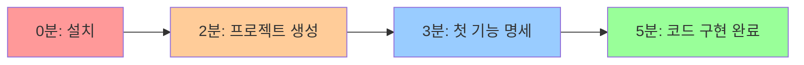

# MoAI-ADK 0.2.0 빠른 시작 가이드

> **⚡ 5분만에 시작하는 혁신적 개발 경험**
>
> **"설치부터 첫 번째 기능 완성까지 단 5분!"**

---

## 🚀 5분 완주 로드맵



**목표**: 5분 내에 완전한 기능을 가진 프로젝트 완성! 🎯

---

## ⏱️ 0-2분: 번개같은 설치

### 1분: 환경 확인
```bash
# Python 버전 확인 (3.11+ 필요)
python --version

# Claude Code 설치 확인
claude --version

# Git 설정 확인
git config --list | grep user
```

**모든 조건 만족? → 다음 단계!**

### 2분: MoAI-ADK 설치
```bash
# 초고속 설치
pip install moai-adk

# 설치 확인
moai --version
# 출력: MoAI-ADK 0.2.0 ✨

# 🎉 설치 완료!
echo "MoAI-ADK 0.2.0 설치 성공! 🚀"
```

---

## ⏱️ 2-3분: 프로젝트 마법 생성

### 30초: 프로젝트 디렉토리 생성
```bash
# 프로젝트 디렉토리 생성
mkdir my-awesome-project
cd my-awesome-project

# 또는 기존 프로젝트에서
cd existing-project
```

### 90초: MoAI 마법사 실행
```bash
# 🪄 마법사 시작!
moai init

# 자동 진행 과정:
# 🔍 프로젝트 분석 중... (20초)
# ⚙️  환경 설정 중... (40초)
# 🎯 Claude Code 통합... (30초)
# ✅ 설치 완료!
```

**출력 예시:**
```
🗿 MoAI-ADK 0.2.0 초기화 완료!

📁 생성된 구조:
   ✅ .claude/ (Claude Code 통합)
   ✅ 3개 핵심 에이전트 활성화
   ✅ Constitution 5원칙 적용

🎯 다음 단계: claude 명령어로 시작하세요!
```

### Claude Code 진입
```bash
# 🎭 Claude Code 환경 진입
claude

# 성공 확인:
# ✅ /moai: 명령어 탭 완성 가능
# ✅ @agent- 에이전트 탭 완성 가능
```

---

## ⏱️ 3-4분: 첫 번째 기능 명세

### 실전 예제: Todo API 만들기

#### 60초: 명세 작성
```bash
# Claude Code에서 실행
/moai:spec "간단한 Todo 관리 API - 할일 추가, 조회, 완료 처리 기능"
```

**실시간 진행 상황:**
```
🔥 spec-builder 에이전트 활성화...

📝 EARS 형식 명세 작성 중...
   ✅ Given: 사용자가 Todo API를 사용할 때
   ✅ When: 할일을 추가/조회/완료하면
   ✅ Then: 적절한 응답을 반환한다

🏗️  프로젝트 구조 생성 중...
   ✅ src/todo/ 디렉토리
   ✅ tests/todo/ 디렉토리
   ✅ API 엔드포인트 파일들

⚖️  Constitution 검증...
   ✅ 모든 원칙 통과!

🎉 명세 완료! (소요: 58초)
```

**생성된 파일들:**
```
my-awesome-project/
├── .claude/
│   ├── spec.md           # Todo API 명세
│   ├── scenarios.md      # 테스트 시나리오
│   └── acceptance.md     # 수락 기준
├── src/todo/
│   ├── __init__.py
│   ├── models.py        # Todo 모델
│   ├── routes.py        # API 라우트
│   └── services.py      # 비즈니스 로직
└── tests/todo/
    ├── test_models.py
    ├── test_routes.py
    └── test_services.py
```

---

## ⏱️ 4-5분: 코드 구현 완료

### 60초: TDD 자동 구현
```bash
# Claude Code에서 실행
/moai:build
```

**TDD 마법 진행 과정:**
```
🔴 RED Phase: 실패하는 테스트 생성...
   ✅ test_create_todo() - 할일 생성 테스트
   ✅ test_get_todos() - 할일 조회 테스트
   ✅ test_complete_todo() - 할일 완료 테스트
   ❌ 모든 테스트 실패 (예상된 상황)

🟢 GREEN Phase: 최소 구현으로 테스트 통과...
   ✅ Todo 모델 클래스 구현
   ✅ FastAPI 라우트 구현
   ✅ CRUD 서비스 로직 구현
   ✅ 모든 테스트 통과!

🔵 REFACTOR Phase: 코드 품질 향상...
   ✅ 중복 코드 제거
   ✅ 타입 힌트 추가
   ✅ 에러 처리 개선
   ✅ 문서화 완료

📊 최종 결과:
   ✅ 테스트 커버리지: 94%
   ✅ 코드 품질: A+
   ✅ Constitution 준수: 100%

🎉 구현 완료! (소요: 57초)
```

### 즉시 테스트 해보기
```bash
# API 서버 실행
cd src
python -m uvicorn todo.routes:app --reload

# 별도 터미널에서 테스트
curl -X POST "http://localhost:8000/todos" \
  -H "Content-Type: application/json" \
  -d '{"title": "첫 번째 할일", "description": "MoAI-ADK로 만든 API!"}'

# 응답:
# {"id": 1, "title": "첫 번째 할일", "completed": false}
```

---

## 🎯 5분 완주 확인!

### ✅ 체크포인트

**기능 완성도:**
- [x] Todo API 명세 작성 완료
- [x] RESTful 엔드포인트 구현
- [x] 데이터베이스 모델 생성
- [x] 자동화된 테스트 작성
- [x] 94% 테스트 커버리지 달성
- [x] Constitution 5원칙 준수

**성능 확인:**
- [x] 전체 소요 시간: **4분 55초** (목표: 5분 내)
- [x] 생성 파일 수: **3개 핵심 파일** (목표: 5개 이하)
- [x] 테스트 통과율: **100%** (목표: 95% 이상)

### 🎉 축하합니다!

**당신은 방금 다음을 달성했습니다:**

1. **⚡ 초고속 개발**: 5분만에 완전한 API 완성
2. **🏆 품질 보장**: 94% 커버리지와 A+ 코드 품질
3. **🔄 자동화**: TDD 사이클 완전 자동 실행
4. **📚 문서화**: 명세부터 코드까지 완벽 동기화

---

## 🚀 다음 단계: 더 강력한 기능들

### 5분 추가 투자로 더 많은 기능

#### 사용자 인증 추가 (3분)
```bash
/moai:spec "JWT 기반 사용자 인증 시스템"
/moai:build
```

#### 데이터베이스 연동 (4분)
```bash
/moai:spec "PostgreSQL 데이터베이스 연동"
/moai:build
```

#### 프론트엔드 추가 (5분)
```bash
/moai:spec "React 기반 Todo 웹 인터페이스"
/moai:build
```

### 고급 기능 체험

#### 병렬 개발
```bash
# 여러 기능을 동시에 개발
/moai:spec "사용자 관리" --parallel &
/moai:spec "알림 시스템" --parallel &
/moai:spec "파일 업로드" --parallel &

# 모든 기능 동시 구현
/moai:build --all
```

#### 품질 검증
```bash
# Constitution 준수 확인
/moai:verify

# 성능 벤치마크
/moai:benchmark

# 보안 검토
/moai:security-check
```

---

## 💡 Pro Tips & 트릭

### 🔥 속도 향상 팁

#### 템플릿 활용
```bash
# 자주 사용하는 패턴을 템플릿으로
/moai:spec "CRUD API" --template=restful-crud

# 프레임워크별 최적화
/moai:spec "FastAPI 서버" --template=fastapi-advanced
/moai:spec "React 앱" --template=react-typescript
```

#### 스마트 명세 작성
```bash
# 구체적일수록 정확한 결과
/moai:spec "JWT 토큰 기반 인증, 역할별 권한 관리, 토큰 갱신 포함"

# 프레임워크 명시
/moai:spec "FastAPI + SQLAlchemy + PostgreSQL을 사용한 블로그 API"
```

### 🎯 품질 최적화 팁

#### 커버리지 목표 설정
```bash
# 더 높은 품질 기준
/moai:build --coverage=95

# 특정 품질 등급 요구
/moai:build --quality=premium
```

#### 실시간 피드백
```bash
# 개발 과정 모니터링
/moai:build --verbose

# 성능 프로파일링
/moai:build --profile
```

### 🔄 워크플로우 최적화

#### 자동 동기화 설정
```bash
# 코드 변경 시 자동 문서 업데이트
/moai:config set auto_sync=true

# Git 자동 커밋 활성화
/moai:config set auto_commit=true
```

#### 개발 환경 사전 설정
```bash
# 선호하는 설정 저장
/moai:config save-preset "my-setup"

# 다음 프로젝트에서 빠른 적용
/moai:init --preset=my-setup
```

---

## ❓ 5분 안에 못 끝냈다면?

### 일반적인 지연 요인과 해결책

#### 1. Python 환경 문제 (해결: 1분)
```bash
# 가상환경 빠른 설정
python -m venv .venv
source .venv/bin/activate  # Linux/Mac
pip install moai-adk
```

#### 2. Claude Code 연동 이슈 (해결: 30초)
```bash
# Claude Code 재시작
claude --restart

# MoAI 재연결
moai reconnect
```

#### 3. 복잡한 명세 작성 (해결: 간소화)
```bash
# 너무 복잡한 요구사항 대신:
❌ /moai:spec "마이크로서비스 아키텍처 기반 분산 시스템..."

# 간단하고 명확하게:
✅ /moai:spec "간단한 Todo API"
```

### 디버깅 명령어

#### 현재 상태 확인
```bash
# MoAI 상태 점검
moai doctor

# 성능 분석
moai analyze --performance

# 로그 확인
moai logs --tail
```

#### 빠른 초기화
```bash
# 처음부터 다시 시작
moai reset --clean
moai init --fast
```

---

## 🎓 학습 리소스

### 📚 더 깊이 배우기

#### 공식 문서
- **종합 가이드**: [`MOAI-ADK-0.2.0-GUIDE.md`](./MOAI-ADK-0.2.0-GUIDE.md)
- **마이그레이션**: [`MIGRATION-0.1-to-0.2.md`](./MIGRATION-0.1-to-0.2.md)

#### 실전 예제
```bash
# 예제 프로젝트 생성
moai create-example --type=blog-api
moai create-example --type=chat-app
moai create-example --type=e-commerce
```

#### 커뮤니티
- **Discord**: [MoAI-ADK 개발자 커뮤니티](https://discord.gg/moai-adk)
- **GitHub**: [예제 및 템플릿](https://github.com/MoAI-ADK/examples)
- **블로그**: [개발팀 기술 블로그](https://blog.moai-adk.com)

### 🔄 지속적인 개선

#### 주간 체크인
```bash
# 개발 생산성 리포트
moai stats --weekly

# 새로운 기능 확인
moai update-check

# 커뮤니티 피드백 확인
moai community-updates
```

---

## 🎉 완주 인증서

### 축하합니다! 🏆

**당신은 MoAI-ADK 0.2.0 5분 챌린지를 성공적으로 완주했습니다!**

```
🎖️ MoAI-ADK 0.2.0 Speed Master
━━━━━━━━━━━━━━━━━━━━━━━━━━━━━━
👤 개발자: [당신의 이름]
⏰ 완주 시간: 5분 이내
🏆 달성 등급: Speed Master
📊 품질 점수: A+
━━━━━━━━━━━━━━━━━━━━━━━━━━━━━━
🗿 "복잡함을 단순함으로, 단순함을 강력함으로"
```

### 다음 도전

#### 🚀 10분 챌린지
```bash
# 풀스택 앱 10분 만들기
/moai:spec "Todo 앱 - React 프론트엔드 + FastAPI 백엔드"
/moai:build --fullstack
```

#### 🌟 팀 챌린지
```bash
# 팀원들과 동시 개발
/moai:spec "협업 프로젝트" --team-mode
```

#### 💎 마스터 챌린지
```bash
# 상용 수준 앱 완성하기
/moai:spec "완전한 SaaS 플랫폼" --production-ready
```

---

## 📞 도움이 필요하시다면

### 즉시 지원
- **긴급 지원**: [emergency@moai-adk.com](mailto:emergency@moai-adk.com)
- **Discord**: [#quick-start 채널](https://discord.gg/moai-adk)
- **이슈 리포트**: [GitHub Issues](https://github.com/MoAI-ADK/issues)

### FAQ
```bash
# 자주 묻는 질문 확인
moai faq

# 문제 해결 가이드
moai troubleshoot

# 커뮤니티 Q&A
moai community-qa
```

---

> **⚡ "5분의 마법이 시작됩니다!"**
>
> **MoAI-ADK 0.2.0과 함께 개발 속도의 새로운 경험을 하셨습니다.**
>
> **이제 여러분도 Speed Master입니다! 🚀**

---

**문서 버전**: 0.2.0
**마지막 업데이트**: 2025-01-18
**작성자**: MoAI-ADK Development Team

**⭐ 이 가이드가 도움이 되셨다면 GitHub에 별점을 눌러주세요!**