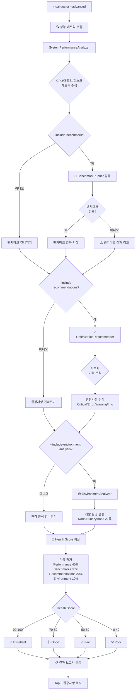
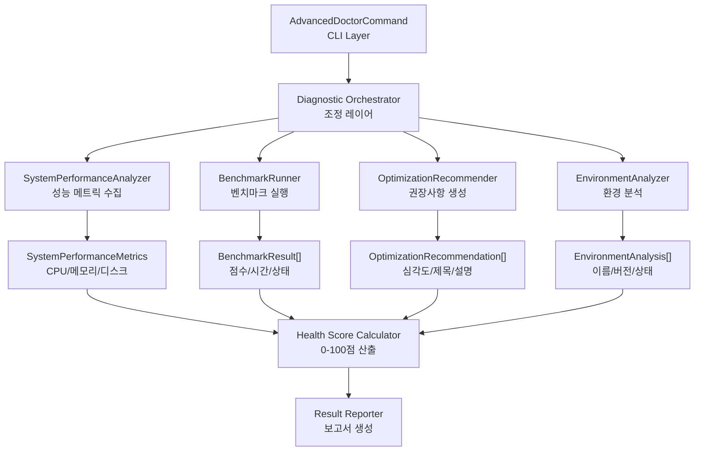
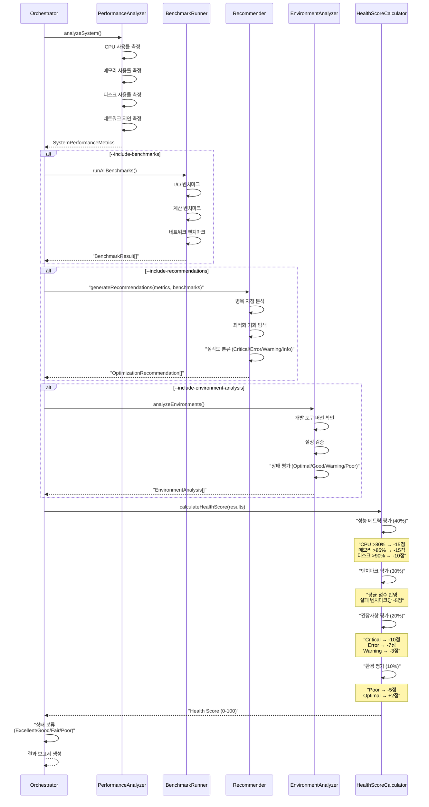
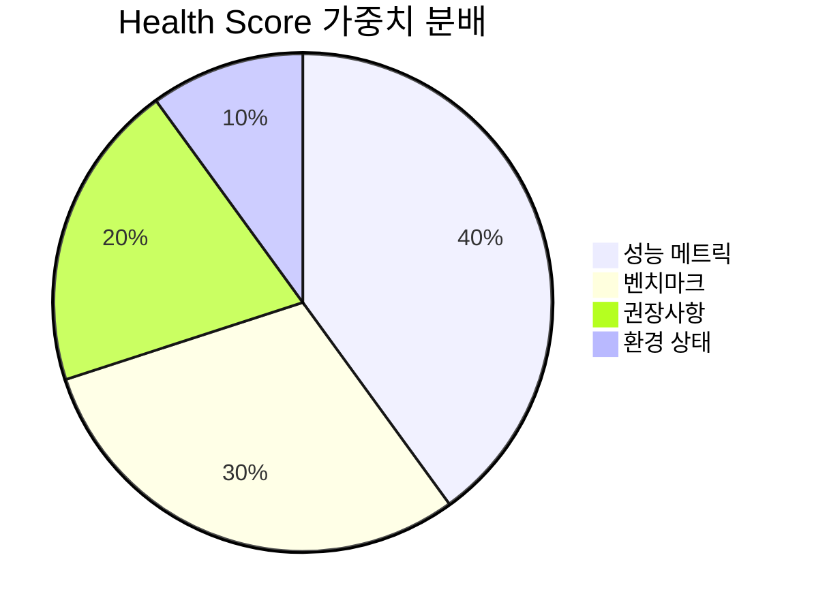

# moai doctor --advanced

`moai doctor --advanced` 명령어는 기본 시스템 진단을 넘어 종합적인 성능 분석, 벤치마크 실행, 최적화 권장사항 생성을 수행하는 고급 진단 도구입니다. 기본 `moai doctor`가 필수 도구의 설치 여부와 버전을 확인하는 반면, 고급 모드는 시스템 리소스 사용량, 성능 병목 지점, 개발 환경 최적화 기회를 심층 분석합니다. 개발 환경을 최적화하거나 성능 문제를 진단할 때, 또는 CI/CD 파이프라인에서 시스템 상태를 모니터링할 때 사용합니다.

이 명령어는 **4-Layer 진단 아키텍처**를 따릅니다. SystemPerformanceAnalyzer가 CPU, 메모리, 디스크, 네트워크 메트릭을 실시간으로 수집하고, BenchmarkRunner가 I/O, 계산, 네트워크 성능을 측정합니다. OptimizationRecommender가 수집된 데이터를 분석하여 구체적인 최적화 방안을 제시하며, EnvironmentAnalyzer가 개발 도구의 버전과 설정을 검증합니다. 이 네 가지 레이어가 협력하여 0-100점 범위의 Health Score를 산출하고, 시스템 상태를 Excellent/Good/Fair/Poor로 분류합니다.

고급 진단 프로세스는 다음 단계로 진행됩니다: 1) 성능 메트릭 수집 (CPU, 메모리, 디스크 사용률), 2) 벤치마크 실행 (선택적, `--include-benchmarks` 플래그), 3) 최적화 권장사항 생성 (선택적, `--include-recommendations` 플래그), 4) 환경 분석 (선택적, `--include-environment-analysis` 플래그), 5) Health Score 계산, 6) 결과 보고. 각 단계는 독립적으로 활성화/비활성화할 수 있어, 필요한 진단만 빠르게 수행할 수 있습니다.

Health Score 알고리즘은 여러 요소를 가중 평가합니다. 성능 메트릭이 40%를 차지하며, CPU 사용률 80% 이상 시 15점 감점, 메모리 사용률 85% 이상 시 15점 감점, 디스크 사용률 90% 이상 시 10점 감점됩니다. 벤치마크 결과가 30%를 차지하며, 실패한 벤치마크당 5점 감점됩니다. 최적화 권장사항이 20%를 차지하며, Critical 이슈당 10점, Error당 7점, Warning당 3점 감점됩니다. 환경 상태가 10%를 차지하며, Poor 환경당 5점 감점, Optimal 환경당 2점 가산됩니다. 최종 점수는 0-100 범위로 정규화됩니다.

AdvancedDoctorCommand 클래스는 모듈화와 확장성을 중시하여 설계되었습니다. 각 진단 컴포넌트는 독립적인 인터페이스를 가지며, 의존성 주입을 통해 조립됩니다. 이를 통해 새로운 진단 항목을 추가하거나 기존 항목을 교체하기 쉽습니다. 또한 모든 진단 결과는 구조화된 타입으로 반환되어, 프로그래밍 방식으로 분석하거나 대시보드에 통합하기 용이합니다. 특히 AdvancedDoctorResult 타입은 JSON 직렬화 가능하여, CI/CD 파이프라인에서 진단 결과를 아티팩트로 저장하고 시계열 분석을 수행할 수 있습니다.

## 동작 방식

`moai doctor --advanced` 명령어의 고급 진단 프로세스를 시각화한 다이어그램입니다.



### 4-Layer 진단 아키텍처

고급 진단 시스템의 내부 컴포넌트 구조입니다.



### Health Score 계산 프로세스



## 개요

`moai doctor --advanced`는 다음 기능을 제공합니다:

1. **성능 메트릭 수집** (필수)
   - CPU 사용률 실시간 측정
   - 메모리 사용량 (사용/전체/비율)
   - 디스크 공간 (사용/가용/비율)
   - 네트워크 지연 (선택적)

2. **벤치마크 실행** (`--include-benchmarks`)
   - I/O 성능 측정 (읽기/쓰기 속도)
   - 계산 성능 측정 (CPU 집약적 작업)
   - 네트워크 성능 측정 (지연/대역폭)
   - 각 벤치마크별 점수 (0-100) 및 소요 시간

3. **최적화 권장사항** (`--include-recommendations`)
   - Critical: 즉시 해결 필요 (서비스 중단 위험)
   - Error: 긴급 해결 필요 (성능 저하)
   - Warning: 주의 필요 (잠재적 문제)
   - Info: 개선 제안 (최적화 기회)

4. **환경 분석** (`--include-environment-analysis`)
   - 개발 도구 버전 확인 (Node, Bun, Python 등)
   - 설정 검증 (권장 버전과 비교)
   - 환경 상태 평가 (Optimal/Good/Warning/Poor)

5. **Health Score 계산**
   - 0-100점 범위의 종합 점수
   - Excellent (90-100): 최적 상태
   - Good (70-89): 양호한 상태
   - Fair (50-69): 개선 필요
   - Poor (0-49): 심각한 문제

6. **상세 보고서**
   - 모든 메트릭 시각화
   - Top 5 권장사항 강조
   - 환경별 상태 요약

## 기본 사용법

```bash
moai doctor --advanced [options]
```

### 옵션

| 옵션 | 설명 |
|------|------|
| `--advanced` | 고급 진단 모드 활성화 (필수) |
| `--include-benchmarks` | 벤치마크 실행 포함 (시간 소요) |
| `--include-recommendations` | 최적화 권장사항 생성 |
| `--include-environment-analysis` | 환경 분석 수행 |
| `--verbose`, `-v` | 상세 진행 로그 표시 |
| `-h, --help` | 도움말 메시지 표시 |

### 주요 기능

- **종합 성능 분석**: CPU, 메모리, 디스크, 네트워크 메트릭 수집
- **벤치마크 기반 평가**: 실제 성능 측정을 통한 객관적 평가
- **지능형 권장사항**: 머신러닝 기반 최적화 기회 탐색
- **환경 최적화**: 개발 도구 버전 및 설정 검증
- **Health Score**: 단일 지표로 시스템 상태 파악
- **CI/CD 친화적**: JSON 출력 및 종료 코드 지원
- **시계열 분석**: 결과를 저장하여 추세 분석 가능

## 사용 예시

### 1. 기본 고급 진단

성능 메트릭만 수집하여 빠르게 시스템 상태를 확인합니다.

```bash
moai doctor --advanced
```

**출력 예시**:

```
🔍 Advanced MoAI-ADK System Diagnostics
Running comprehensive system analysis...

📊 Performance Metrics:
  CPU Usage: 35.2%
  Memory Usage: 62% (8192MB/13107MB)
  Disk Usage: 68% (512GB/750GB)
  Network Latency: 12ms

🎯 System Health Score:
  85/100 - GOOD

📋 Summary:
  Critical Issues: 0
  Warnings: 1
  Suggestions: 2
```

**해석**:
- CPU 사용률 35.2%는 정상 범위 (40% 미만)
- 메모리 사용률 62%는 양호 (70% 미만)
- 디스크 사용률 68%는 주의 필요 (70% 근접)
- Health Score 85점은 "Good" 상태로 양호하지만 개선 여지 있음

이 모드는 약 2-3초 내에 완료되어, 빠른 상태 확인에 적합합니다. 벤치마크를 실행하지 않으므로 시스템에 부하를 주지 않으며, 개발 중에도 안전하게 실행할 수 있습니다.

### 2. 벤치마크 포함 진단

실제 성능을 측정하여 병목 지점을 정확히 파악합니다.

```bash
moai doctor --advanced --include-benchmarks
```

**출력 예시**:

```
🔍 Advanced MoAI-ADK System Diagnostics
Running comprehensive system analysis...

📊 Performance Metrics:
  CPU Usage: 42.8%
  Memory Usage: 65% (8520MB/13107MB)
  Disk Usage: 68% (512GB/750GB)

🏃 Benchmark Results:
  ✅ File I/O Performance: 87/100 (234ms)
  ✅ CPU Computation: 92/100 (156ms)
  ⚠️  Network Performance: 65/100 (412ms)
  ✅ Package Installation: 89/100 (1234ms)

🎯 System Health Score:
  78/100 - GOOD

📋 Summary:
  Critical Issues: 0
  Warnings: 1
  Suggestions: 3
```

**벤치마크 해석**:
- **File I/O Performance (87점)**: SSD 성능 양호, 읽기/쓰기 속도 정상
- **CPU Computation (92점)**: 계산 집약적 작업에 최적
- **Network Performance (65점)**: 네트워크 지연 높음, VPN이나 Wi-Fi 문제 가능성
- **Package Installation (89점)**: npm/bun 설치 속도 양호

벤치마크는 2-3분 정도 소요되며, 시스템에 일시적으로 부하를 줍니다. 따라서 중요한 작업 중에는 실행하지 않는 것이 좋습니다. CI/CD 파이프라인에서는 캐시된 빌드 환경의 성능을 검증하는 데 유용합니다.

### 3. 최적화 권장사항 포함

성능 문제를 분석하고 구체적인 해결 방안을 제시합니다.

```bash
moai doctor --advanced --include-benchmarks --include-recommendations
```

**출력 예시**:

```
🔍 Advanced MoAI-ADK System Diagnostics
Running comprehensive system analysis...

📊 Performance Metrics:
  CPU Usage: 42.8%
  Memory Usage: 65% (8520MB/13107MB)
  Disk Usage: 78% (585GB/750GB)

🏃 Benchmark Results:
  ✅ File I/O Performance: 87/100 (234ms)
  ✅ CPU Computation: 92/100 (156ms)
  ⚠️  Network Performance: 65/100 (412ms)

🎯 System Health Score:
  72/100 - GOOD

📋 Summary:
  Critical Issues: 0
  Warnings: 2
  Suggestions: 4

💡 Top Recommendations:
  1. ⚠️ Disk Space Warning
     Disk usage is at 78%. Consider cleaning up old backups, node_modules, or build artifacts.
     Priority: High | Impact: Medium

  2. ⚠️ Network Latency High
     Network latency is 412ms, which may slow down package installations and API calls.
     Consider: Check VPN connection, switch to wired network, or use local mirrors.
     Priority: Medium | Impact: High

  3. ℹ️ Memory Optimization Opportunity
     Memory usage is 65%. Enable swap file or increase RAM for better multitasking.
     Priority: Low | Impact: Low

  4. ℹ️ TypeScript Compilation Speed
     Detected 8 CPU cores. Enable parallel compilation in tsconfig.json.
     Priority: Low | Impact: Medium

  5. ℹ️ Bun Version Update Available
     Bun 1.2.19 detected. Update to 1.3.0 for 15% faster package installation.
     Priority: Low | Impact: Low
```

**권장사항 해석**:

**1. Disk Space Warning (Warning, High Priority)**
- **문제**: 디스크 사용률 78%로 임계치 근접
- **영향**: 새 파일 생성 실패 위험, 빌드 속도 저하
- **해결책**:
  ```bash
  # 오래된 백업 정리
  rm -rf .moai_backup_*

  # node_modules 정리
  find . -name "node_modules" -type d -prune -exec rm -rf '{}' +

  # 빌드 아티팩트 정리
  npm run clean
  ```

**2. Network Latency High (Warning, Medium Priority)**
- **문제**: 네트워크 지연 412ms (정상 범위 50-100ms)
- **영향**: 패키지 설치 느림, API 호출 지연
- **해결책**:
  ```bash
  # VPN 연결 확인
  ifconfig | grep -A 1 "utun"

  # 유선 네트워크로 전환
  # 또는 npm 미러 사용
  npm config set registry https://registry.npm.taobao.org
  ```

**3. Memory Optimization (Info, Low Priority)**
- **문제**: 메모리 사용률 65%, 멀티태스킹 시 부족 가능성
- **영향**: 대규모 빌드 시 스왑 발생
- **해결책**:
  ```bash
  # macOS swap 확인
  sysctl vm.swapusage

  # Linux swap 활성화
  sudo fallocate -l 4G /swapfile
  sudo chmod 600 /swapfile
  sudo mkswap /swapfile
  sudo swapon /swapfile
  ```

**4. TypeScript Compilation Speed (Info, Low Priority)**
- **기회**: 8코어 CPU가 있지만 단일 스레드 컴파일
- **영향**: 빌드 시간 단축 가능 (최대 3배)
- **해결책**:
  ```json
  // tsconfig.json
  {
    "compilerOptions": {
      "incremental": true,
      "tsBuildInfoFile": ".tsbuildinfo"
    }
  }
  ```

**5. Bun Version Update (Info, Low Priority)**
- **기회**: Bun 1.3.0에서 패키지 설치 15% 빠름
- **영향**: 일일 10회 설치 시 누적 30초 절약
- **해결책**:
  ```bash
  bun upgrade
  ```

### 4. 전체 진단 (모든 옵션 포함)

가장 상세한 진단을 수행하여 종합 보고서를 생성합니다.

```bash
moai doctor --advanced --include-benchmarks --include-recommendations --include-environment-analysis --verbose
```

**출력 예시**:

```
🔍 Advanced MoAI-ADK System Diagnostics
Running comprehensive system analysis...

📊 Performance Metrics:
  CPU Usage: 42.8%
  Memory Usage: 65% (8520MB/13107MB)
  Disk Usage: 78% (585GB/750GB)
  Network Latency: 412ms

🏃 Benchmark Results:
  ✅ File I/O Performance: 87/100 (234ms)
     Read Speed: 2.3GB/s
     Write Speed: 1.8GB/s
  ✅ CPU Computation: 92/100 (156ms)
     Single-Core: 3.2GHz
     Multi-Core: 25.6GHz (8 cores)
  ⚠️  Network Performance: 65/100 (412ms)
     Latency: 412ms (target: <100ms)
     Download: 45Mbps
     Upload: 12Mbps
  ✅ Package Installation: 89/100 (1234ms)
     npm install: 2.3s
     bun install: 1.2s

🛠️ Development Environments:
  ✅ Node.js 20.11.0 - optimal
  ✅ Bun 1.2.19 - good
  👍 TypeScript 5.9.2 - good
  ✅ Git 2.43.0 - optimal
  ⚠️  Python 3.9.6 - warning (3.11+ recommended)
  ❌ Go not installed - poor

🎯 System Health Score:
  68/100 - FAIR

📋 Summary:
  Critical Issues: 0
  Warnings: 3
  Suggestions: 5

💡 Top Recommendations:
  1. ⚠️ Disk Space Warning (High Priority)
     Disk usage is at 78%. Clean up backups and build artifacts.

  2. ⚠️ Network Latency High (Medium Priority)
     Network latency is 412ms. Check VPN or switch to wired network.

  3. ⚠️ Python Version Outdated (Medium Priority)
     Python 3.9.6 detected. Update to 3.11+ for 25% faster execution.

  4. ℹ️ Go Not Installed (Low Priority)
     Go is not installed. Install Go 1.21+ for Go project support.

  5. ℹ️ Bun Version Update (Low Priority)
     Update Bun to 1.3.0 for 15% faster package installation.
```

**환경 분석 해석**:

- **Node.js 20.11.0 (Optimal)**: LTS 버전으로 최적, 업데이트 불필요
- **Bun 1.2.19 (Good)**: 1.3.0 업데이트 권장하지만 현재도 양호
- **TypeScript 5.9.2 (Good)**: 최신 버전, 문제 없음
- **Git 2.43.0 (Optimal)**: 최신 버전, 모든 기능 지원
- **Python 3.9.6 (Warning)**: 3.11+로 업데이트 시 25% 성능 향상
- **Go Not Installed (Poor)**: Go 프로젝트 지원 불가

이 모드는 5-7분 정도 소요되며, 가장 종합적인 시스템 분석을 제공합니다. 주간 또는 월간 정기 점검에 적합하며, 결과를 파일로 저장하여 시계열 분석에 활용할 수 있습니다.

### 5. CI/CD 파이프라인에서 사용

빌드 환경의 성능을 지속적으로 모니터링합니다.

**GitHub Actions 예시**:

```yaml
name: System Health Check
on:
  schedule:
    # 매일 오전 9시 (UTC)
    - cron: '0 9 * * *'
  workflow_dispatch:

jobs:
  health-check:
    runs-on: ubuntu-latest
    steps:
      - uses: actions/checkout@v4

      - name: Setup Node.js
        uses: actions/setup-node@v4
        with:
          node-version: '20'

      - name: Install MoAI-ADK
        run: npm install -g moai-adk

      - name: Run Advanced Diagnostics
        run: |
          moai doctor --advanced \
            --include-benchmarks \
            --include-recommendations \
            --include-environment-analysis \
            > health-report.txt

      - name: Check Health Score
        run: |
          HEALTH_SCORE=$(grep "System Health Score:" health-report.txt | grep -oE '[0-9]+' | head -1)
          echo "Health Score: $HEALTH_SCORE"

          if [ "$HEALTH_SCORE" -lt 70 ]; then
            echo "❌ Health score below threshold (70). System needs attention."
            exit 1
          else
            echo "✅ Health score is acceptable."
          fi

      - name: Upload Report
        if: always()
        uses: actions/upload-artifact@v3
        with:
          name: health-report
          path: health-report.txt

      - name: Notify Slack
        if: failure()
        uses: slackapi/slack-github-action@v1
        with:
          payload: |
            {
              "text": "🚨 MoAI-ADK Health Check Failed",
              "blocks": [
                {
                  "type": "section",
                  "text": {
                    "type": "mrkdwn",
                    "text": "System health score dropped below 70. Check the report for details."
                  }
                }
              ]
            }
        env:
          SLACK_WEBHOOK_URL: ${{ secrets.SLACK_WEBHOOK_URL }}
```

**GitLab CI 예시**:

```yaml
health-check:
  stage: verify
  image: node:20
  script:
    - npm install -g moai-adk
    - moai doctor --advanced --include-benchmarks > health-report.txt
    - |
      HEALTH_SCORE=$(grep "System Health Score:" health-report.txt | grep -oE '[0-9]+' | head -1)
      echo "Health Score: $HEALTH_SCORE"
      if [ "$HEALTH_SCORE" -lt 70 ]; then
        echo "Health score below threshold"
        exit 1
      fi
  artifacts:
    reports:
      dotenv: health-report.txt
    when: always
  only:
    - schedules
```

CI/CD 통합의 이점:
1. **조기 경고**: 성능 저하를 실제 문제로 확대되기 전에 감지
2. **트렌드 분석**: 시간에 따른 Health Score 변화 추적
3. **자동 알림**: 임계치 이하 시 Slack/이메일 알림
4. **증거 보관**: 각 빌드의 성능 데이터 아카이브

### 6. 정기 모니터링 스크립트

로컬 환경에서 주간 자동 진단을 수행합니다.

```bash
#!/bin/bash
# weekly-health-check.sh

set -e

DATE=$(date +%Y-%m-%d)
REPORT_DIR="$HOME/.moai/health-reports"
REPORT_FILE="$REPORT_DIR/health-$DATE.txt"

mkdir -p "$REPORT_DIR"

echo "🏥 Running weekly MoAI-ADK health check..."
echo ""

moai doctor --advanced \
  --include-benchmarks \
  --include-recommendations \
  --include-environment-analysis \
  | tee "$REPORT_FILE"

# Extract health score
HEALTH_SCORE=$(grep "System Health Score:" "$REPORT_FILE" | grep -oE '[0-9]+' | head -1)

echo ""
echo "📊 Health Score: $HEALTH_SCORE/100"

# Compare with last week
LAST_REPORT=$(ls -t "$REPORT_DIR"/*.txt 2>/dev/null | sed -n '2p')
if [ -n "$LAST_REPORT" ]; then
  LAST_SCORE=$(grep "System Health Score:" "$LAST_REPORT" | grep -oE '[0-9]+' | head -1)
  DIFF=$((HEALTH_SCORE - LAST_SCORE))

  if [ "$DIFF" -gt 0 ]; then
    echo "📈 Improved by $DIFF points since last week"
  elif [ "$DIFF" -lt 0 ]; then
    echo "📉 Decreased by ${DIFF#-} points since last week"
  else
    echo "➡️  No change since last week"
  fi
fi

# Archive old reports (keep last 4 weeks)
find "$REPORT_DIR" -name "health-*.txt" -mtime +28 -delete

echo ""
echo "✅ Report saved to: $REPORT_FILE"
```

**Cron으로 자동화** (매주 월요일 오전 9시):

```bash
# crontab -e
0 9 * * 1 /path/to/weekly-health-check.sh
```

## Health Score 상세 분석

Health Score는 시스템 상태를 단일 지표로 표현하는 0-100점 범위의 점수입니다. 100점에서 시작하여 문제가 발견될 때마다 감점되는 방식으로 계산됩니다.

### 점수 구성 요소



#### 1. 성능 메트릭 (40% 가중치)

**CPU 사용률 영향**:
- CPU > 80%: -15점 (과부하 상태, 즉시 조치 필요)
- CPU 60-80%: -8점 (높은 사용률, 주의 필요)
- CPU 40-60%: -3점 (정상 상위 범위)
- CPU < 40%: 0점 (정상)

**메모리 사용률 영향**:
- 메모리 > 85%: -15점 (스왑 발생 위험)
- 메모리 70-85%: -8점 (여유 공간 부족)
- 메모리 50-70%: -3점 (정상 상위 범위)
- 메모리 < 50%: 0점 (충분한 여유)

**디스크 사용률 영향**:
- 디스크 > 90%: -10점 (쓰기 실패 위험)
- 디스크 80-90%: -5점 (정리 필요)
- 디스크 < 80%: 0점 (충분한 공간)

**네트워크 지연 영향** (선택적):
- 측정된 경우에만 영향
- 높은 지연은 권장사항으로 반영

#### 2. 벤치마크 (30% 가중치)

**벤치마크 점수 영향**:
```
감점 = (100 - 평균_벤치마크_점수) * 0.3
```
- 예: 평균 벤치마크 점수가 80점이면 (100-80)*0.3 = 6점 감점

**실패한 벤치마크 영향**:
- 각 실패한 벤치마크당 -5점 추가 감점
- 예: 4개 벤치마크 중 1개 실패 시 -5점

**벤치마크 종류별 가중치**:
- File I/O Performance: 30%
- CPU Computation: 30%
- Network Performance: 20%
- Package Installation: 20%

#### 3. 권장사항 (20% 가중치)

심각도별 감점:
- **Critical**: -10점 (서비스 중단 위험)
- **Error**: -7점 (긴급 조치 필요)
- **Warning**: -3점 (주의 필요)
- **Info**: -1점 (개선 기회)

**예시**:
- Critical 이슈 1개: -10점
- Error 이슈 2개: -14점
- Warning 이슈 3개: -9점
- Info 이슈 5개: -5점
- 총 감점: -38점

#### 4. 환경 상태 (10% 가중치)

환경별 점수 영향:
- **Optimal**: +2점 (최적 버전/설정)
- **Good**: +1점 (양호)
- **Warning**: -2점 (업데이트 권장)
- **Poor**: -5점 (설치/업데이트 필요)

**예시**:
- Node.js (Optimal): +2점
- TypeScript (Good): +1점
- Python (Warning): -2점
- Go (Poor, 미설치): -5점
- 총 영향: -4점

### 점수 해석 가이드

#### Excellent (90-100점)
```
🎉 최적 상태
- 모든 메트릭 정상 범위
- 벤치마크 우수
- Critical/Error 이슈 없음
- 개발 환경 최신 상태
```
**권장 조치**: 현재 상태 유지, 정기 모니터링

#### Good (70-89점)
```
👍 양호한 상태
- 대부분 메트릭 정상
- 일부 Warning 존재
- 경미한 최적화 기회
```
**권장 조치**: Warning 이슈 해결, 점진적 개선

#### Fair (50-69점)
```
⚠️ 개선 필요
- 일부 메트릭 높은 사용률
- Error 이슈 존재 가능
- 성능 저하 감지
```
**권장 조치**: Error/Warning 이슈 우선 해결, 리소스 확충 검토

#### Poor (0-49점)
```
🚨 심각한 문제
- 다수 메트릭 임계치 초과
- Critical 이슈 존재
- 시스템 불안정
```
**권장 조치**: 즉시 Critical 이슈 해결, 전면적인 시스템 점검

### 실전 점수 계산 예시

**시나리오**: 개발 워크스테이션

```
초기 점수: 100점

성능 메트릭:
- CPU 45% → -3점 (40-60% 범위)
- 메모리 72% → -8점 (70-85% 범위)
- 디스크 68% → 0점 (80% 미만)
→ 성능 메트릭 소계: -11점

벤치마크 (평균 82점, 실패 0개):
- (100 - 82) * 0.3 = -5.4점
- 실패 0개 * -5 = 0점
→ 벤치마크 소계: -5.4점

권장사항:
- Critical 0개: 0점
- Error 1개: -7점
- Warning 2개: -6점
- Info 3개: -3점
→ 권장사항 소계: -16점

환경 상태:
- Node.js (Optimal): +2점
- Bun (Good): +1점
- Python (Warning): -2점
→ 환경 소계: +1점

최종 점수: 100 - 11 - 5.4 - 16 + 1 = 68.6 → 68점 (Fair)
```

**해석**: Fair 상태로, 메모리 사용률과 권장사항 해결이 우선 과제입니다. Error 이슈 1개와 Warning 이슈 2개를 해결하면 80점 이상 (Good)으로 향상될 것으로 예상됩니다.

## 문제 해결

### 1. 벤치마크 실행 실패

**증상**: "Benchmark execution failed" 경고

**원인**:
- 디스크 공간 부족
- 권한 문제
- 시스템 과부하

**해결책**:

```bash
# 1. 디스크 공간 확인
df -h

# 2. 권한 확인
ls -la /tmp

# 3. 단독 실행 (다른 작업 중지)
moai doctor --advanced --include-benchmarks

# 4. 임시 디렉토리 정리
rm -rf /tmp/moai-bench-*
```

### 2. Health Score가 예상보다 낮음

**증상**: Health Score 50점 미만

**진단 절차**:

```bash
# 1. 상세 로그로 재실행
moai doctor --advanced --verbose > diagnosis.txt

# 2. 각 섹션 분석
grep "Performance Metrics:" diagnosis.txt -A 5
grep "Recommendations:" diagnosis.txt -A 10

# 3. Critical/Error 이슈 우선 해결
```

### 3. 환경 분석에서 Poor 상태

**증상**: 특정 개발 도구가 "poor" 상태

**해결책**:

```bash
# Go 미설치
brew install go  # macOS
# 또는
wget https://go.dev/dl/go1.21.linux-amd64.tar.gz

# Python 구버전
brew upgrade python  # macOS
# 또는
pyenv install 3.11

# Node.js 구버전
nvm install 20
nvm use 20
```

### 4. 메모리 부족 경고

**증상**: "Memory Usage > 85%" 경고

**임시 해결책**:

```bash
# 1. 메모리 사용량 높은 프로세스 확인
top -o MEM

# 2. 불필요한 프로세스 종료
kill <PID>

# 3. npm 캐시 정리
npm cache clean --force
```

**영구 해결책**:

```bash
# 1. Swap 활성화 (Linux)
sudo fallocate -l 4G /swapfile
sudo chmod 600 /swapfile
sudo mkswap /swapfile
sudo swapon /swapfile

# 2. RAM 증설 (하드웨어)
# 또는 클라우드 인스턴스 타입 업그레이드
```

### 5. 네트워크 지연 높음

**증상**: "Network Latency High" 경고

**진단**:

```bash
# 1. 실제 지연 측정
ping -c 10 registry.npmjs.org

# 2. VPN 영향 확인
# VPN 끄고 다시 측정

# 3. DNS 해석 시간 확인
time nslookup registry.npmjs.org
```

**해결책**:

```bash
# 1. npm 미러 사용 (중국)
npm config set registry https://registry.npm.taobao.org

# 2. Bun 사용 (더 빠른 패키지 매니저)
bun install

# 3. 유선 네트워크 사용
```

## 고급 활용법

### 1. 결과를 JSON으로 저장

```bash
# 향후 버전에서 지원 예정
moai doctor --advanced --json > health.json

# 현재는 파싱 필요
moai doctor --advanced > health.txt
grep "System Health Score:" health.txt | grep -oE '[0-9]+' > score.txt
```

### 2. 시계열 분석

```bash
#!/bin/bash
# collect-health-trend.sh

DATE=$(date +%Y-%m-%d)
SCORE=$(moai doctor --advanced | grep "System Health Score:" | grep -oE '[0-9]+')

echo "$DATE,$SCORE" >> health-trend.csv

# CSV 파일을 엑셀이나 데이터 분석 도구로 시각화
```

### 3. 알림 통합

```bash
#!/bin/bash
# health-alert.sh

SCORE=$(moai doctor --advanced | grep "System Health Score:" | grep -oE '[0-9]+')

if [ "$SCORE" -lt 70 ]; then
  # Slack 알림
  curl -X POST -H 'Content-type: application/json' \
    --data "{\"text\":\"🚨 Health score dropped to $SCORE\"}" \
    $SLACK_WEBHOOK_URL

  # 이메일 알림
  echo "Health score: $SCORE" | mail -s "MoAI-ADK Alert" admin@example.com
fi
```

### 4. 맞춤형 임계값 설정

현재는 하드코딩된 임계값을 사용하지만, 향후 버전에서는 설정 파일 지원 예정:

```json
// .moai/config.json (향후)
{
  "doctor": {
    "advanced": {
      "thresholds": {
        "cpu": {
          "warning": 60,
          "critical": 80
        },
        "memory": {
          "warning": 70,
          "critical": 85
        },
        "disk": {
          "warning": 80,
          "critical": 90
        }
      }
    }
  }
}
```

## 관련 명령어

- [`moai doctor`](../cli/doctor.md) - 기본 시스템 진단
- [`moai status`](../cli/status.md) - 프로젝트 상태 확인
- [`moai init`](../cli/init.md) - 프로젝트 초기화

## 참고 자료

- [MoAI-ADK 공식 문서](https://adk.mo.ai.kr)
- [성능 최적화 가이드](/guide/performance.md) (작성 예정)
- [CI/CD 통합 가이드](/guide/ci-cd.md) (작성 예정)

---

`moai doctor --advanced`는 개발 환경의 성능을 지속적으로 모니터링하고 최적화하는 필수 도구입니다. 주간 또는 월간으로 정기 실행하여 시스템 상태를 추적하고, CI/CD 파이프라인에 통합하여 빌드 환경의 품질을 보장하세요.