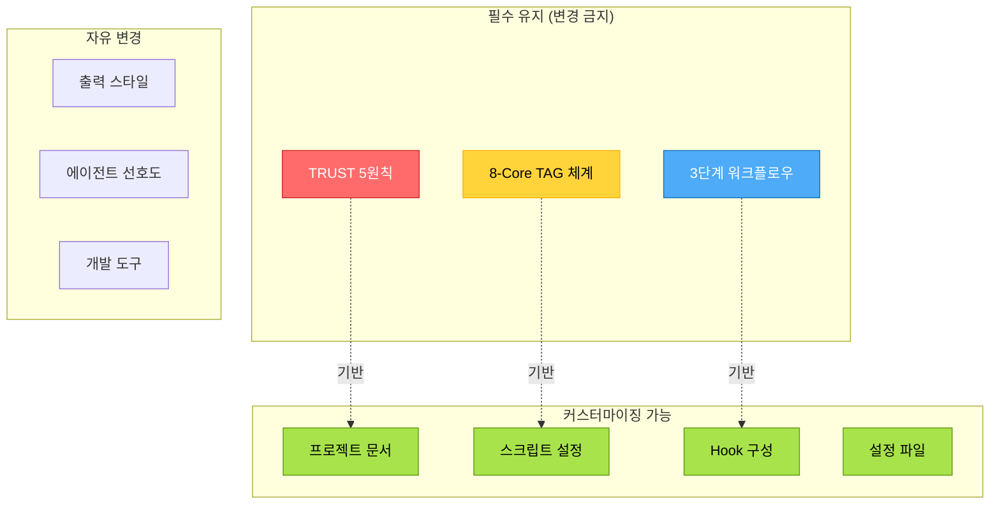

# 템플릿 커스터마이징 가이드

## 개요

MoAI-ADK는 `moai init` 명령으로 프로젝트를 초기화할 때 표준화된 템플릿을 제공합니다. 이 가이드는 템플릿 구조를 이해하고 프로젝트에 맞게 커스터마이징하는 방법을 설명합니다.

### 템플릿 철학

**"Convention over Configuration, but Flexible"**

- **Convention**: 80% 프로젝트에 적합한 기본 설정 제공
- **Configuration**: 20% 요구사항에 맞는 유연한 커스터마이징 지원
- **Flexibility**: 언어, 프레임워크, 팀 문화에 맞는 조정 가능

### 커스터마이징 범위



---

## 템플릿 디렉토리 구조

### 전체 구조 개요

```
moai-adk-ts/templates/
├── .moai/                          # MoAI 프로젝트 설정 디렉토리
│   ├── project/                    # 프로젝트 문서 (커스터마이징 필수)
│   │   ├── product.md              # 제품 비전 & 요구사항
│   │   ├── structure.md            # 아키텍처 & 설계
│   │   └── tech.md                 # 기술 스택 & 도구
│   ├── memory/                     # 개발 가이드 (변경 금지)
│   │   └── development-guide.md    # TRUST 원칙, TAG 시스템
│   ├── scripts/                    # 자동화 스크립트 (설정 조정 가능)
│   │   ├── project-init.ts         # 프로젝트 초기화
│   │   ├── spec-builder.ts         # SPEC 생성
│   │   ├── tdd-runner.ts           # TDD 실행
│   │   ├── doc-syncer.ts           # 문서 동기화
│   │   ├── debug-analyzer.ts       # 디버그 분석
│   │   ├── tag-updater.ts          # TAG 업데이트
│   │   ├── trust-checker.ts        # TRUST 검증
│   │   └── test-analyzer.ts        # 테스트 분석
│   ├── specs/                      # SPEC 저장소 (자동 생성)
│   │   └── .gitkeep
│   ├── reports/                    # 리포트 저장소 (자동 생성)
│   │   └── .gitkeep
│   └── config.json                 # MoAI 설정 (조정 가능)
├── .claude/                        # Claude Code 설정 디렉토리
│   ├── settings.json               # Claude Code 설정 (커스터마이징 권장)
│   └── hooks/                      # 8개 Hook 파일
│       └── moai/
│           ├── pre-write-guard.cjs
│           ├── tag-enforcer.cjs
│           ├── policy-block.cjs
│           ├── session-notice.cjs
│           ├── steering-guard.cjs
│           ├── performance-monitor.cjs (옵션)
│           ├── audit-logger.cjs (옵션)
│           └── quality-check.cjs (옵션)
└── CLAUDE.md                       # 에이전트 가이드 (변경 금지)
```

### 디렉토리 역할 요약

| 디렉토리 | 역할 | 커스터마이징 |
|----------|------|--------------|
| `.moai/project/` | 프로젝트 문서 | **필수** |
| `.moai/memory/` | 개발 가이드 | 금지 |
| `.moai/scripts/` | 자동화 스크립트 | 설정만 |
| `.moai/config.json` | MoAI 설정 | 권장 |
| `.claude/settings.json` | Claude 설정 | 권장 |
| `.claude/hooks/` | Hook 시스템 | 선택적 |
| `CLAUDE.md` | 에이전트 가이드 | 금지 |

---

## 프로젝트 문서 커스터마이징

### 1. product.md (제품 정의)

**목적**: 프로젝트의 비전, 사용자, 문제, 차별점 정의

#### 템플릿 구조

```markdown
# {{PROJECT_NAME}} Product Definition

## @VISION:MISSION-001 핵심 미션
**[프로젝트의 핵심 미션과 목표를 정의하세요]**

## @REQ:USER-001 주요 사용자층
### 1차 사용자
- **대상**: [주요 사용자층을 정의하세요]
- **핵심 니즈**: [사용자가 해결하고자 하는 문제]

## @REQ:PROBLEM-001 해결하는 핵심 문제
1. [해결하려는 주요 문제 1]
2. [해결하려는 주요 문제 2]

## @VISION:STRATEGY-001 차별점 및 강점
1. [주요 차별점 1]
2. [주요 차별점 2]

## @REQ:SUCCESS-001 성공 지표
1. [측정 지표 1]
2. [측정 지표 2]
```

#### 커스터마이징 예시

**CLI 도구 프로젝트**:
```markdown
# DevTools-CLI Product Definition

## @VISION:MISSION-001 핵심 미션
**개발자의 반복 작업을 자동화하는 강력한 CLI 도구**

### 핵심 가치 제안
복잡한 개발 워크플로우를 단일 명령으로 실행하여 생산성 10배 향상

## @REQ:USER-001 주요 사용자층
### 1차 사용자
- **대상**: 풀스택 개발자 (개인 및 소규모 팀)
- **핵심 니즈**: 프로젝트 설정 자동화, 코드 생성, 배포 간소화
- **핵심 시나리오**:
  1. 새 프로젝트 5분 내 셋업
  2. CRUD API 자동 생성
  3. 한 명령으로 테스트 → 빌드 → 배포

## @REQ:PROBLEM-001 해결하는 핵심 문제
1. **프로젝트 초기 설정**: 매번 30분 소요 → 5분으로 단축
2. **보일러플레이트 코드**: 반복 작업 자동화
3. **배포 복잡도**: 다단계 프로세스 → 단일 명령

## @VISION:STRATEGY-001 차별점 및 강점
1. **Zero Configuration**: 설정 파일 없이 즉시 사용 가능
2. **Language Agnostic**: TypeScript, Python, Go 등 다중 언어 지원
3. **Extensible**: 플러그인 시스템으로 무한 확장

## @REQ:SUCCESS-001 성공 지표
1. **프로젝트 셋업 시간**: 30분 → 5분 (83% 감소)
2. **코드 생성 시간**: 2시간 → 10분 (92% 감소)
3. **월간 활성 사용자**: 100명 → 1,000명 (10배 증가)
```

**Web API 프로젝트**:
```markdown
# E-Commerce-API Product Definition

## @VISION:MISSION-001 핵심 미션
**중소 쇼핑몰을 위한 확장 가능한 E-Commerce API 플랫폼**

## @REQ:USER-001 주요 사용자층
### 1차 사용자
- **대상**: 중소 규모 온라인 쇼핑몰 운영자
- **핵심 니즈**: 안정적 결제, 재고 관리, 주문 처리 자동화
- **핵심 시나리오**:
  1. 다중 결제 게이트웨이 통합
  2. 실시간 재고 동기화
  3. 주문 상태 자동 업데이트

### 2차 사용자
- **대상**: 프론트엔드 개발자 (API 소비자)
- **핵심 니즈**: 명확한 API 문서, 빠른 응답 속도, 일관된 에러 처리

## @REQ:PROBLEM-001 해결하는 핵심 문제
1. **결제 게이트웨이 통합 복잡도**: 각 PG사마다 다른 API 표준화
2. **재고 동기화 지연**: 실시간 재고 반영 시스템 구축
3. **확장성 부족**: 트래픽 증가 시 병목 현상 해결

## @REQ:SUCCESS-001 성공 지표
1. **API 응답 속도**: 평균 200ms 이하
2. **가용성**: 99.9% 업타임
3. **동시 처리**: 1,000 req/sec 지원
```

### 2. structure.md (아키텍처 설계)

**목적**: 시스템 아키텍처, 모듈 구조, 추적성 전략 정의

#### 커스터마이징 예시

**마이크로서비스 아키텍처**:
```markdown
# My-Microservices Structure Design

## @STRUCT:ARCHITECTURE-001 시스템 아키텍처

### 아키텍처 전략
**마이크로서비스 + API Gateway + Event-Driven**

```
Microservices Architecture
├── API Gateway          # Kong / Nginx
│   ├── 인증/인가
│   ├── Rate Limiting
│   └── 로드 밸런싱
├── Services             # 독립 배포 가능한 서비스
│   ├── User Service     # 사용자 관리
│   ├── Product Service  # 상품 관리
│   ├── Order Service    # 주문 처리
│   └── Payment Service  # 결제 처리
├── Event Bus            # Kafka / RabbitMQ
│   └── 서비스 간 비동기 통신
└── Data Layer           # Database per Service
    ├── User DB (PostgreSQL)
    ├── Product DB (MongoDB)
    ├── Order DB (PostgreSQL)
    └── Cache (Redis)
```

**선택 이유**:
- **독립 배포**: 서비스별 배포 및 롤백 가능
- **기술 다양성**: 각 서비스에 최적 기술 스택 선택
- **확장성**: 부하가 높은 서비스만 스케일 아웃
- **장애 격리**: 한 서비스 장애가 전체에 영향 최소화

## @STRUCT:MODULES-001 모듈별 책임 구분

### 1. User Service
- **책임**: 사용자 인증, 프로필 관리, 권한 부여
- **입력**: 회원가입, 로그인, 프로필 수정 요청
- **처리**: JWT 발급, 비밀번호 암호화, 권한 검증
- **출력**: 인증 토큰, 사용자 정보

| 컴포넌트 | 역할 | 주요 기능 |
|----------|------|-----------|
| AuthController | API 엔드포인트 | POST /auth/login, /auth/register |
| AuthService | 비즈니스 로직 | JWT 생성, 비밀번호 검증 |
| UserRepository | 데이터 접근 | 사용자 CRUD |
| PermissionGuard | 권한 검증 | 역할 기반 접근 제어 (RBAC) |

### 2. Order Service
- **책임**: 주문 생성, 상태 관리, 배송 추적
- **입력**: 주문 생성, 주문 조회, 상태 변경 요청
- **처리**: 재고 확인, 결제 연동, 배송 상태 업데이트
- **출력**: 주문 정보, 배송 추적 번호

## @STRUCT:INTEGRATION-001 외부 시스템 통합

### 결제 게이트웨이 (PG사)
- **인증 방식**: API Key + HMAC Signature
- **데이터 교환**: REST API (JSON)
- **장애 시 대체**: 다중 PG사 연동 (failover)
- **위험도**: High (결제 실패 시 매출 손실)

### 배송사 API 연동
- **용도**: 배송 상태 조회 및 업데이트
- **의존성 수준**: Medium (배송 추적 기능)
- **성능 요구사항**: 1초 이내 응답

## @STRUCT:TRACEABILITY-001 추적성 전략

### 8-Core @TAG 체계 적용

**서비스별 TAG 도메인**:
- User Service: `USER-XXX`, `AUTH-XXX`
- Product Service: `PRODUCT-XXX`, `CATEGORY-XXX`
- Order Service: `ORDER-XXX`, `CART-XXX`
- Payment Service: `PAYMENT-XXX`, `REFUND-XXX`

### TAG 추적성 관리 (코드 스캔 방식)
- **검증 방법**: `/moai:3-sync` 실행 시 각 서비스 독립적으로 스캔
- **추적 범위**: 각 서비스의 src/, tests/ 디렉토리
- **유지 주기**: PR 생성 전 필수 검증
- **중간 캐시 없음**: 각 서비스 코드가 유일한 진실의 원천
```

**모놀리식 + 계층형 아키텍처**:
```markdown
# My-Monolith Structure Design

## @STRUCT:ARCHITECTURE-001 시스템 아키텍처

### 아키텍처 전략
**3-Tier 계층형 아키텍처 (MVC 패턴)**

```
3-Tier Architecture
├── Presentation Layer   # 프레젠테이션 계층
│   ├── Controllers      # API 엔드포인트
│   ├── Views            # UI 템플릿
│   └── DTOs             # 데이터 전송 객체
├── Business Layer       # 비즈니스 로직 계층
│   ├── Services         # 도메인 로직
│   ├── Use Cases        # 유스케이스 구현
│   └── Domain Models    # 도메인 모델
└── Data Layer           # 데이터 접근 계층
    ├── Repositories     # 데이터 저장소
    ├── ORM Models       # ORM 엔티티
    └── Database         # PostgreSQL
```

**선택 이유**:
- **단순성**: 초기 개발 빠름, 배포 간단
- **트랜잭션 일관성**: 단일 DB로 ACID 보장
- **성능**: 네트워크 오버헤드 없음 (로컬 함수 호출)
- **개발 경험**: 팀 규모 작고 익숙한 아키텍처

## @STRUCT:MODULES-001 모듈별 책임 구분

### 1. Controllers (Presentation Layer)
- **책임**: HTTP 요청 처리, 입력 검증, 응답 생성
- **입력**: HTTP Request (JSON)
- **처리**: DTO 변환, 서비스 호출
- **출력**: HTTP Response (JSON)

### 2. Services (Business Layer)
- **책임**: 비즈니스 로직 구현, 트랜잭션 관리
- **입력**: DTO 또는 도메인 모델
- **처리**: 도메인 로직 실행, 여러 Repository 조합
- **출력**: 도메인 모델 또는 결과 DTO

### 3. Repositories (Data Layer)
- **책임**: 데이터 접근, CRUD 추상화
- **입력**: 도메인 모델
- **처리**: SQL 쿼리 실행, ORM 매핑
- **출력**: 도메인 모델 또는 엔티티
```

### 3. tech.md (기술 스택)

**목적**: 언어, 프레임워크, 도구, 품질 게이트 정의

#### 커스터마이징 예시

**TypeScript + Node.js 프로젝트**:
```markdown
# My-Backend Technology Stack

## @TECH:STACK-001 언어 & 런타임

### 주 언어 선택
- **언어**: TypeScript
- **버전**: TypeScript 5.x, Node.js 20.x LTS
- **선택 이유**:
  - 타입 안전성으로 런타임 오류 감소
  - 풍부한 생태계 (npm 패키지)
  - 비동기 처리 우수 (async/await)
- **패키지 매니저**: pnpm (디스크 효율성, 빠른 설치)

### 멀티 플랫폼 지원

| 플랫폼 | 지원 상태 | 검증 도구 | 주요 제약 |
|--------|-----------|-----------|-----------|
| **Windows** | 완전 지원 | GitHub Actions (Windows Runner) | 파일 경로 처리 |
| **macOS** | 완전 지원 | GitHub Actions (macOS Runner) | 없음 |
| **Linux** | 완전 지원 | Docker 컨테이너 | 없음 |

## @TECH:FRAMEWORK-001 핵심 프레임워크 & 라이브러리

### 1. 주요 의존성

```json
{
  "dependencies": {
    "fastify": "^4.25.0",           // 고성능 웹 프레임워크
    "prisma": "^5.8.0",              // ORM
    "@prisma/client": "^5.8.0",
    "zod": "^3.22.0",                // 스키마 검증
    "pino": "^8.17.0"                // 구조화 로깅
  }
}
```

### 2. 개발 도구

```json
{
  "devDependencies": {
    "vitest": "^1.1.0",              // 테스트 프레임워크
    "@biomejs/biome": "^1.4.0",      // 린터 + 포매터
    "tsx": "^4.7.0",                 // TypeScript 실행
    "tsup": "^8.0.0"                 // 번들러
  }
}
```

### 3. 빌드 시스템
- **빌드 도구**: tsup (esbuild 기반)
- **번들링**: 단일 파일 번들 생성 (dist/index.js)
- **타겟**: Node.js 20.x ESM
- **성능 목표**: 빌드 시간 < 10초

## @TECH:QUALITY-001 품질 게이트 & 정책

### 테스트 커버리지
- **목표**: 85% 이상
- **측정 도구**: Vitest Coverage (c8)
- **실패 시 대응**: PR 블로킹 (CI에서 자동 검사)

### 정적 분석

| 도구 | 역할 | 설정 파일 | 실패 시 조치 |
|------|------|-----------|--------------|
| Biome | 린터 + 포매터 | biome.json | CI 실패 |
| TypeScript | 타입 검사 | tsconfig.json | 빌드 실패 |
| Prisma | 스키마 검증 | schema.prisma | 마이그레이션 실패 |

### 자동화 스크립트

```bash
# 품질 검사 파이프라인
pnpm test              # Vitest 테스트 실행
pnpm lint              # Biome 린트 검사
pnpm type-check        # TypeScript 타입 검증
pnpm build             # 빌드 검증
```

## @TECH:SECURITY-001 보안 정책 & 운영

### 비밀 관리
- **정책**: 환경 변수 (.env) 사용, Git 추적 금지
- **도구**: dotenv (로컬), AWS Secrets Manager (프로덕션)
- **검증**: pre-commit hook으로 .env 커밋 차단

### 의존성 보안

```json
{
  "security": {
    "audit_tool": "pnpm audit",
    "update_policy": "주간 자동 업데이트 (Dependabot)",
    "vulnerability_threshold": "High 이상 즉시 패치"
  }
}
```

## @TECH:DEPLOY-001 배포 채널 & 전략

### 1. 배포 채널
- **주 채널**: Docker 컨테이너 → AWS ECS
- **릴리스 절차**:
  1. GitHub Actions CI/CD
  2. 테스트 통과 → Docker 이미지 빌드
  3. ECR 푸시 → ECS 자동 배포
- **버전 정책**: Semantic Versioning (major.minor.patch)
- **rollback 전략**: ECS Task Definition 이전 버전으로 복구

### 3. CI/CD 파이프라인

| 단계 | 목적 | 사용 도구 | 성공 조건 |
|------|------|-----------|-----------|
| Lint | 코드 품질 | Biome | 0 errors |
| Test | 기능 검증 | Vitest | 커버리지 ≥85% |
| Build | 빌드 검증 | tsup | 빌드 성공 |
| Deploy | 배포 | AWS ECS | Health Check 통과 |
```

**Python + FastAPI 프로젝트**:
```markdown
# My-Python-API Technology Stack

## @TECH:STACK-001 언어 & 런타임

### 주 언어 선택
- **언어**: Python
- **버전**: Python 3.11+
- **선택 이유**:
  - 빠른 프로토타입 개발
  - ML/AI 생태계 활용
  - 풍부한 데이터 처리 라이브러리
- **패키지 매니저**: Poetry (의존성 잠금, 가상환경 통합)

## @TECH:FRAMEWORK-001 핵심 프레임워크 & 라이브러리

### 1. 주요 의존성

```toml
[tool.poetry.dependencies]
python = "^3.11"
fastapi = "^0.109.0"           # ASGI 웹 프레임워크
uvicorn = "^0.27.0"             # ASGI 서버
pydantic = "^2.5.0"             # 데이터 검증
sqlalchemy = "^2.0.0"           # ORM
alembic = "^1.13.0"             # 마이그레이션
```

### 2. 개발 도구

```toml
[tool.poetry.group.dev.dependencies]
pytest = "^7.4.0"               # 테스트
pytest-cov = "^4.1.0"           # 커버리지
ruff = "^0.1.0"                 # 린터 + 포매터
mypy = "^1.8.0"                 # 타입 체커
```

## @TECH:QUALITY-001 품질 게이트 & 정책

### 테스트 커버리지
- **목표**: 85% 이상
- **측정 도구**: pytest-cov
- **실패 시 대응**: `pytest --cov --cov-fail-under=85`

### 정적 분석

| 도구 | 역할 | 설정 파일 | 실패 시 조치 |
|------|------|-----------|--------------|
| ruff | 린터 + 포매터 | pyproject.toml | CI 실패 |
| mypy | 타입 검사 | pyproject.toml | 타입 오류 보고 |
| bandit | 보안 스캔 | .bandit | 취약점 경고 |

### 자동화 스크립트

```bash
# 품질 검사 파이프라인
poetry run pytest --cov --cov-report=html    # 테스트 + 커버리지
poetry run ruff check .                       # 린트
poetry run ruff format .                      # 포맷
poetry run mypy src/                          # 타입 검사
```
```

---

## 스크립트 커스터마이징

### 스크립트 역할

MoAI-ADK는 8개 TypeScript 스크립트를 제공합니다:

| 스크립트 | 역할 | 커스터마이징 가능 항목 |
|----------|------|----------------------|
| `project-init.ts` | 프로젝트 초기화 | 템플릿 경로, 기본값 |
| `spec-builder.ts` | SPEC 생성 | EARS 템플릿, 출력 형식 |
| `tdd-runner.ts` | TDD 실행 | 테스트 명령, 커버리지 목표 |
| `doc-syncer.ts` | 문서 동기화 | 스캔 범위, 리포트 형식 |
| `debug-analyzer.ts` | 디버그 분석 | 오류 패턴, 해결 방안 |
| `tag-updater.ts` | TAG 업데이트 | TAG 패턴, 검증 규칙 |
| `trust-checker.ts` | TRUST 검증 | 품질 임계값, 도구 선택 |
| `test-analyzer.ts` | 테스트 분석 | 커버리지 계산, 리포트 |

### 스크립트 설정 조정

#### 1. tdd-runner.ts

**기본 설정**:
```typescript
// tdd-runner.ts
const DEFAULT_CONFIG = {
  testCommand: 'npm test',
  coverageThreshold: 85,
  watchMode: false,
  bail: true,
};
```

**커스터마이징**:
```typescript
// .moai/config.json
{
  "tdd": {
    "testCommand": "pnpm test",        // pnpm 사용
    "coverageThreshold": 90,           // 목표 90%로 상향
    "watchMode": true,                  // 감시 모드 활성화
    "bail": false,                      // 첫 실패 시 중단 안 함
    "framework": "vitest",              // 명시적 프레임워크 지정
    "testPattern": "**/*.test.ts"       // 테스트 파일 패턴
  }
}
```

#### 2. trust-checker.ts

**기본 설정**:
```typescript
// trust-checker.ts
const QUALITY_GATES = {
  testCoverage: 85,
  maxComplexity: 10,
  maxFileLines: 300,
  maxFunctionLines: 50,
};
```

**커스터마이징**:
```typescript
// .moai/config.json
{
  "trust": {
    "testCoverage": 90,          // 커버리지 목표 상향
    "maxComplexity": 8,           // 복잡도 더 엄격하게
    "maxFileLines": 250,          // 파일 크기 제한 강화
    "maxFunctionLines": 40,       // 함수 크기 제한 강화
    "tools": {
      "linter": "biome",          // 린터 명시
      "formatter": "biome",       // 포매터 명시
      "typeChecker": "tsc"        // 타입 체커 명시
    }
  }
}
```

#### 3. doc-syncer.ts

**기본 설정**:
```typescript
// doc-syncer.ts
const SYNC_CONFIG = {
  scanPaths: ['src/', 'tests/', 'docs/'],
  outputPath: '.moai/reports/sync-report.md',
  validateTags: true,
};
```

**커스터마이징**:
```typescript
// .moai/config.json
{
  "sync": {
    "scanPaths": [
      "src/",
      "tests/",
      "docs/",
      "lib/"                      // 추가 스캔 경로
    ],
    "outputPath": "docs/sync-report.md",  // 리포트 위치 변경
    "validateTags": true,
    "generateIndex": true,        // TAG 인덱스 생성 (선택)
    "autoFix": false,             // 자동 수정 비활성화
    "reportFormat": "markdown"    // 리포트 형식
  }
}
```

### 프로젝트별 스크립트 확장

#### 예시: Python 프로젝트 TDD 설정

```typescript
// .moai/config.json
{
  "tdd": {
    "testCommand": "poetry run pytest",
    "coverageCommand": "poetry run pytest --cov --cov-report=html",
    "coverageThreshold": 85,
    "framework": "pytest",
    "testPattern": "tests/**/*_test.py",
    "markers": {
      "unit": "pytest -m unit",
      "integration": "pytest -m integration",
      "slow": "pytest -m slow"
    }
  }
}
```

#### 예시: Go 프로젝트 TDD 설정

```typescript
// .moai/config.json
{
  "tdd": {
    "testCommand": "go test ./...",
    "coverageCommand": "go test -cover -coverprofile=coverage.out ./...",
    "coverageThreshold": 80,
    "framework": "go-test",
    "testPattern": "**/*_test.go",
    "race": true,                 // Race detector 활성화
    "short": false                // 짧은 테스트만 실행하지 않음
  }
}
```

---

## Hook 커스터마이징

### Hook 시스템 개요

MoAI-ADK는 4개 라이프사이클에 8개 Hook을 제공합니다:

**필수 Hook (5개)**:
1. `pre-write-guard.cjs` - 파일 쓰기 전 검증
2. `tag-enforcer.cjs` - @TAG 규칙 강제
3. `policy-block.cjs` - Bash 명령 정책 검증
4. `session-notice.cjs` - 세션 시작 알림
5. `steering-guard.cjs` - 사용자 프롬프트 검증

**옵션 Hook (3개)**:
6. `performance-monitor.cjs` - 성능 모니터링
7. `audit-logger.cjs` - 감사 로깅
8. `quality-check.cjs` - 품질 검사

### Hook 활성화/비활성화

#### settings.json 수정

**개발 초기 (최소 Hook)**:
```json
{
  "hooks": {
    "PreToolUse": [
      {
        "hooks": [
          {"command": "node $CLAUDE_PROJECT_DIR/.claude/hooks/moai/pre-write-guard.cjs", "type": "command"}
        ],
        "matcher": "Edit|Write"
      }
    ],
    "SessionStart": [
      {
        "hooks": [
          {"command": "node $CLAUDE_PROJECT_DIR/.claude/hooks/moai/session-notice.cjs", "type": "command"}
        ],
        "matcher": "*"
      }
    ]
  }
}
```

**프로덕션 준비 (모든 Hook)**:
```json
{
  "hooks": {
    "PreToolUse": [
      {
        "hooks": [
          {"command": "node $CLAUDE_PROJECT_DIR/.claude/hooks/moai/pre-write-guard.cjs", "type": "command"},
          {"command": "node $CLAUDE_PROJECT_DIR/.claude/hooks/moai/tag-enforcer.cjs", "type": "command"}
        ],
        "matcher": "Edit|Write|MultiEdit"
      },
      {
        "hooks": [
          {"command": "node $CLAUDE_PROJECT_DIR/.claude/hooks/moai/policy-block.cjs", "type": "command"}
        ],
        "matcher": "Bash"
      }
    ],
    "PostToolUse": [
      {
        "hooks": [
          {"command": "node $CLAUDE_PROJECT_DIR/.claude/hooks/moai/performance-monitor.cjs", "type": "command"},
          {"command": "node $CLAUDE_PROJECT_DIR/.claude/hooks/moai/audit-logger.cjs", "type": "command"},
          {"command": "node $CLAUDE_PROJECT_DIR/.claude/hooks/moai/quality-check.cjs", "type": "command"}
        ],
        "matcher": "Edit|Write"
      }
    ],
    "SessionStart": [
      {
        "hooks": [
          {"command": "node $CLAUDE_PROJECT_DIR/.claude/hooks/moai/session-notice.cjs", "type": "command"}
        ],
        "matcher": "*"
      }
    ],
    "UserPromptSubmit": [
      {
        "hooks": [
          {"command": "node $CLAUDE_PROJECT_DIR/.claude/hooks/moai/steering-guard.cjs", "type": "command"}
        ]
      }
    ]
  }
}
```

### Hook 로직 커스터마이징

#### pre-write-guard.cjs 확장

**기본 로직**:
```javascript
// pre-write-guard.cjs
const filePath = process.env.CLAUDE_TOOL_FILE_PATH;

// 기본 검증: 파일 크기, 민감 파일
if (filePath.includes('.env')) {
  console.error('Error: Cannot write to .env file');
  process.exit(1);
}
```

**확장 예시 (TypeScript 파일에 TAG 강제)**:
```javascript
// pre-write-guard.cjs
const filePath = process.env.CLAUDE_TOOL_FILE_PATH;
const fileContent = process.env.CLAUDE_TOOL_FILE_CONTENT;

// 기존 검증
if (filePath.includes('.env')) {
  console.error('Error: Cannot write to .env file');
  process.exit(1);
}

// 커스텀 검증: TypeScript 파일은 반드시 TAG 포함
if ((filePath.endsWith('.ts') || filePath.endsWith('.tsx')) && !filePath.includes('test')) {
  const hasTag = /@(REQ|DESIGN|TASK|TEST|FEATURE|API|UI|DATA):[\w-]+/.test(fileContent);

  if (!hasTag) {
    console.warn('Warning: TypeScript file should contain at least one @TAG');
    // 경고만 (에러 아님)
  }
}
```

#### policy-block.cjs 확장

**기본 로직**:
```javascript
// policy-block.cjs
const command = process.env.CLAUDE_TOOL_COMMAND;

// 위험 명령 차단
const dangerousCommands = ['rm -rf', 'sudo', 'chmod -R 777'];
if (dangerousCommands.some(cmd => command.includes(cmd))) {
  console.error(`Error: Dangerous command blocked: ${command}`);
  process.exit(1);
}
```

**확장 예시 (프로덕션 DB 접근 차단)**:
```javascript
// policy-block.cjs
const command = process.env.CLAUDE_TOOL_COMMAND;
const environment = process.env.NODE_ENV || 'development';

// 기존 검증
const dangerousCommands = ['rm -rf', 'sudo', 'chmod -R 777'];
if (dangerousCommands.some(cmd => command.includes(cmd))) {
  console.error(`Error: Dangerous command blocked: ${command}`);
  process.exit(1);
}

// 커스텀 검증: 프로덕션 환경에서 DB 변경 금지
if (environment === 'production') {
  const dbCommands = ['DROP TABLE', 'TRUNCATE', 'DELETE FROM users'];
  if (dbCommands.some(cmd => command.toUpperCase().includes(cmd))) {
    console.error(`Error: Database modification blocked in production`);
    process.exit(1);
  }
}
```

---

## 설정 파일 커스터마이징

### .moai/config.json

**전체 구조**:
```json
{
  "project": {
    "name": "my-project",
    "description": "프로젝트 설명",
    "version": "0.1.0",
    "mode": "personal",              // personal | team
    "initialized": true,
    "created_at": "2025-10-01T00:00:00Z"
  },
  "constitution": {
    "enforce_tdd": true,
    "require_tags": true,
    "test_coverage_target": 85,
    "simplicity_threshold": 5,
    "principles": {
      "simplicity": {
        "max_projects": 5,
        "notes": "프로젝트 규모에 따라 조정"
      }
    }
  },
  "pipeline": {
    "current_stage": "initialized",
    "available_commands": [
      "/moai:1-spec",
      "/moai:2-build",
      "/moai:3-sync"
    ]
  },
  "tags": {
    "storage_type": "code_scan",
    "auto_sync": true,
    "categories": [
      "REQ", "DESIGN", "TASK", "TEST",
      "FEATURE", "API", "UI", "DATA"
    ],
    "code_scan_policy": {
      "no_intermediate_cache": true,
      "realtime_validation": true,
      "scan_tools": ["rg", "grep"],
      "scan_command": "rg '@TAG' -n",
      "philosophy": "TAG의 진실은 코드 자체에만 존재"
    }
  },
  "git_strategy": {
    "personal": {
      "auto_commit": true,
      "auto_checkpoint": true,
      "branch_prefix": "feature/",
      "checkpoint_interval": 300,
      "cleanup_days": 7,
      "max_checkpoints": 50
    },
    "team": {
      "use_gitflow": true,
      "main_branch": "main",
      "develop_branch": "develop",
      "feature_prefix": "feature/SPEC-",
      "auto_pr": true,
      "draft_pr": true
    }
  }
}
```

### 프로젝트 유형별 설정

#### Personal 모드 (개인 개발)

```json
{
  "project": {
    "mode": "personal"
  },
  "constitution": {
    "enforce_tdd": true,
    "test_coverage_target": 80    // 개인: 80%도 충분
  },
  "git_strategy": {
    "personal": {
      "auto_commit": true,        // 자동 커밋 활성화
      "auto_checkpoint": true,    // 체크포인트 활성화
      "checkpoint_interval": 600  // 10분마다
    }
  }
}
```

#### Team 모드 (팀 협업)

```json
{
  "project": {
    "mode": "team"
  },
  "constitution": {
    "enforce_tdd": true,
    "test_coverage_target": 90    // 팀: 90% 이상
  },
  "git_strategy": {
    "team": {
      "use_gitflow": true,
      "main_branch": "main",
      "develop_branch": "develop",
      "auto_pr": true,              // PR 자동 생성
      "draft_pr": true,             // Draft PR로 시작
      "require_review": true        // 리뷰 필수
    }
  }
}
```

### .claude/settings.json

**기본 구조**:
```json
{
  "env": {
    "MOAI_RUNTIME": "typescript",
    "MOAI_PROJECT_PATH": "./my-project",
    "MOAI_AUTO_ROUTING": "true",
    "NODE_ENV": "development"
  },
  "hooks": { /* ... */ },
  "permissions": { /* ... */ }
}
```

**환경 변수 커스터마이징**:
```json
{
  "env": {
    "MOAI_RUNTIME": "python",               // Python 프로젝트
    "MOAI_PROJECT_PATH": "/absolute/path",  // 절대 경로
    "MOAI_AUTO_ROUTING": "false",           // 수동 라우팅
    "MOAI_LOG_LEVEL": "debug",              // 로그 레벨
    "NODE_ENV": "production",               // 프로덕션 환경
    "DATABASE_URL": "postgresql://...",     // 커스텀 환경 변수
    "API_KEY": "{{SECRET}}"                 // 비밀 (실제로는 .env 사용)
  }
}
```

---

## 언어별 템플릿 변형

### TypeScript 프로젝트

**구조**:
```
my-ts-project/
├── src/
├── tests/
├── .moai/
│   ├── project/
│   ├── scripts/  (TypeScript 스크립트)
│   └── config.json
└── .claude/
```

**특화 설정**:
```json
{
  "tdd": {
    "framework": "vitest",
    "testPattern": "**/*.test.ts",
    "coverageReporter": "c8"
  },
  "trust": {
    "tools": {
      "linter": "biome",
      "typeChecker": "tsc"
    }
  }
}
```

### Python 프로젝트

**구조**:
```
my-py-project/
├── src/
├── tests/
├── .moai/
│   ├── project/
│   ├── scripts/  (Python 스크립트 변환 필요)
│   └── config.json
└── .claude/
```

**특화 설정**:
```json
{
  "tdd": {
    "framework": "pytest",
    "testCommand": "poetry run pytest",
    "testPattern": "tests/**/*_test.py",
    "coverageCommand": "poetry run pytest --cov"
  },
  "trust": {
    "tools": {
      "linter": "ruff",
      "formatter": "ruff",
      "typeChecker": "mypy"
    }
  }
}
```

### Java 프로젝트

**구조**:
```
my-java-project/
├── src/main/java/
├── src/test/java/
├── .moai/
│   ├── project/
│   ├── scripts/  (Java 호환 필요)
│   └── config.json
└── .claude/
```

**특화 설정**:
```json
{
  "tdd": {
    "framework": "junit",
    "testCommand": "mvn test",
    "coverageCommand": "mvn jacoco:report",
    "coverageThreshold": 85
  },
  "trust": {
    "tools": {
      "linter": "checkstyle",
      "formatter": "google-java-format"
    }
  }
}
```

---

## Personal vs Team 모드 차이

### Personal 모드 (개인 개발)

**특징**:
- 간소화된 워크플로우
- 자동 커밋 및 체크포인트
- SPEC은 로컬 파일로 관리
- PR 없이 브랜치 작업

**설정**:
```json
{
  "project": {
    "mode": "personal"
  },
  "git_strategy": {
    "personal": {
      "auto_commit": true,
      "auto_checkpoint": true,
      "checkpoint_interval": 600,
      "branch_prefix": "feature/",
      "cleanup_days": 7
    }
  }
}
```

**워크플로우**:
```bash
# 1. SPEC 작성 (로컬 파일)
/moai:1-spec
# → .moai/specs/SPEC-001/ 생성

# 2. TDD 구현 (자동 커밋)
/moai:2-build
# → 자동으로 중간 커밋

# 3. 문서 동기화
/moai:3-sync
# → 로컬 리포트 생성
```

### Team 모드 (팀 협업)

**특징**:
- GitFlow 기반 워크플로우
- GitHub Issue/PR 연동
- Draft PR로 시작, Ready로 전환
- 리뷰 및 승인 프로세스

**설정**:
```json
{
  "project": {
    "mode": "team"
  },
  "git_strategy": {
    "team": {
      "use_gitflow": true,
      "main_branch": "main",
      "develop_branch": "develop",
      "feature_prefix": "feature/SPEC-",
      "auto_pr": true,
      "draft_pr": true,
      "require_review": true
    }
  }
}
```

**워크플로우**:
```bash
# 1. SPEC 작성 (GitHub Issue)
/moai:1-spec
# → GitHub Issue 생성
# → feature/SPEC-001 브랜치 생성
# → Draft PR 생성

# 2. TDD 구현 (PR 업데이트)
/moai:2-build
# → PR 자동 업데이트

# 3. 문서 동기화 (PR Ready)
/moai:3-sync
# → Draft → Ready 전환
# → 리뷰어 자동 할당
```

---

## 베스트 프랙티스

### 1. 템플릿 수정 시 버전 관리

**문제**: 템플릿 업데이트 시 커스터마이징 손실

**해결 방법**:
```bash
# 1. 커스터마이징 백업
cp .moai/project/product.md .moai/project/product.md.backup
cp .claude/settings.json .claude/settings.json.backup

# 2. 템플릿 업데이트
moai update

# 3. 변경 사항 비교 및 병합
diff .moai/project/product.md .moai/project/product.md.backup
```

### 2. 프로젝트별 템플릿 재사용

**패턴**: 유사 프로젝트에 템플릿 재사용

**방법**:
```bash
# 1. 템플릿 추출
mkdir ~/my-moai-templates/
cp -r my-project/.moai/project/ ~/my-moai-templates/my-template/

# 2. 새 프로젝트에 적용
moai init new-project
cp -r ~/my-moai-templates/my-template/ new-project/.moai/project/
```

### 3. 팀 표준 템플릿 공유

**패턴**: 팀 전체에 표준 템플릿 배포

**방법**:
```bash
# 1. Git 저장소로 템플릿 관리
git clone https://github.com/my-org/moai-templates.git
cd moai-templates/

# 2. 프로젝트별 템플릿
templates/
├── backend-api/
├── frontend-spa/
└── cli-tool/

# 3. 프로젝트 초기화 시 적용
moai init my-project
cp -r moai-templates/backend-api/ my-project/.moai/project/
```

### 4. EARS 커스터마이징

**기본 EARS**:
```markdown
### Ubiquitous Requirements
- 시스템은 [기능]을 제공해야 한다
```

**도메인 특화 EARS (IoT)**:
```markdown
### Device Requirements
- WHEN [디바이스 상태]일 때, 시스템은 [센서 데이터]를 수집해야 한다
- WHILE [네트워크 끊김]일 때, 시스템은 [로컬 버퍼]에 데이터를 저장해야 한다
- IF [배터리 수준] < 20%이면, 시스템은 [절전 모드]로 전환해야 한다
```

**도메인 특화 EARS (금융)**:
```markdown
### Transaction Requirements
- WHEN [거래 요청]이면, 시스템은 [3초 이내] 응답해야 한다
- IF [거래 금액] > [일일 한도]이면, 시스템은 [추가 인증]을 요구해야 한다
- 시스템은 [거래 기록]을 [10년간] 보관해야 한다
```

---

## 안티패턴

### 1. 핵심 파일 수정 (금지)

**잘못된 예**:
```bash
# CLAUDE.md 수정 (금지)
vi CLAUDE.md

# development-guide.md 수정 (금지)
vi .moai/memory/development-guide.md
```

**올바른 방법**:
```bash
# 프로젝트 문서만 수정
vi .moai/project/product.md
vi .moai/project/structure.md
vi .moai/project/tech.md
```

### 2. TAG 체계 변경 (금지)

**잘못된 예**:
```json
// config.json
{
  "tags": {
    "categories": [
      "MY_CUSTOM_TAG",  // 금지
      "ANOTHER_TAG"     // 금지
    ]
  }
}
```

**올바른 방법**:
```json
{
  "tags": {
    "categories": [
      "REQ", "DESIGN", "TASK", "TEST",
      "FEATURE", "API", "UI", "DATA"
    ]
  }
}
```

### 3. 3단계 워크플로우 변경 (금지)

**잘못된 예**:
```json
{
  "pipeline": {
    "available_commands": [
      "/moai:1-custom",  // 금지
      "/moai:2-custom"   // 금지
    ]
  }
}
```

**올바른 방법**:
```json
{
  "pipeline": {
    "available_commands": [
      "/moai:1-spec",
      "/moai:2-build",
      "/moai:3-sync"
    ]
  }
}
```

---

## 문제 해결

### 템플릿 복원

**문제**: 잘못된 수정으로 템플릿 손상

**해결 방법**:
```bash
# 1. 백업에서 복원
moai restore

# 2. 특정 파일 복원
moai restore --file=.moai/project/product.md

# 3. 완전 재초기화 (주의: 모든 변경 사항 손실)
rm -rf .moai/
moai init --force
```

### 스크립트 오류

**문제**: 스크립트 실행 오류

**해결 방법**:
```bash
# 1. Node.js 버전 확인
node --version  # ≥ 20.x 필요

# 2. 스크립트 직접 실행
node .moai/scripts/tdd-runner.ts

# 3. 로그 확인
@agent-debug-helper "스크립트 오류 분석"
```

---

## 관련 문서

- [cc-manager 가이드](../claude/agents/cc-manager.md) - settings.json 최적화
- [프로젝트 초기화 가이드](../getting-started/quick-start.md) - 초기 설정
- [개발 가이드](@.moai/memory/development-guide.md) - TRUST 원칙

---

## 요약

MoAI-ADK 템플릿 커스터마이징은:

- **필수 커스터마이징**: 프로젝트 문서 (product.md, structure.md, tech.md)
- **권장 커스터마이징**: 설정 파일 (config.json, settings.json)
- **선택적 커스터마이징**: Hook 시스템, 스크립트 설정
- **변경 금지**: TRUST 원칙, 8-Core TAG, 3단계 워크플로우

프로젝트 특성에 맞게 유연하게 조정하되, 핵심 철학은 유지합니다.

```bash
# 시작하기
moai init my-project
# → 템플릿 생성 후 .moai/project/ 문서부터 커스터마이징
```