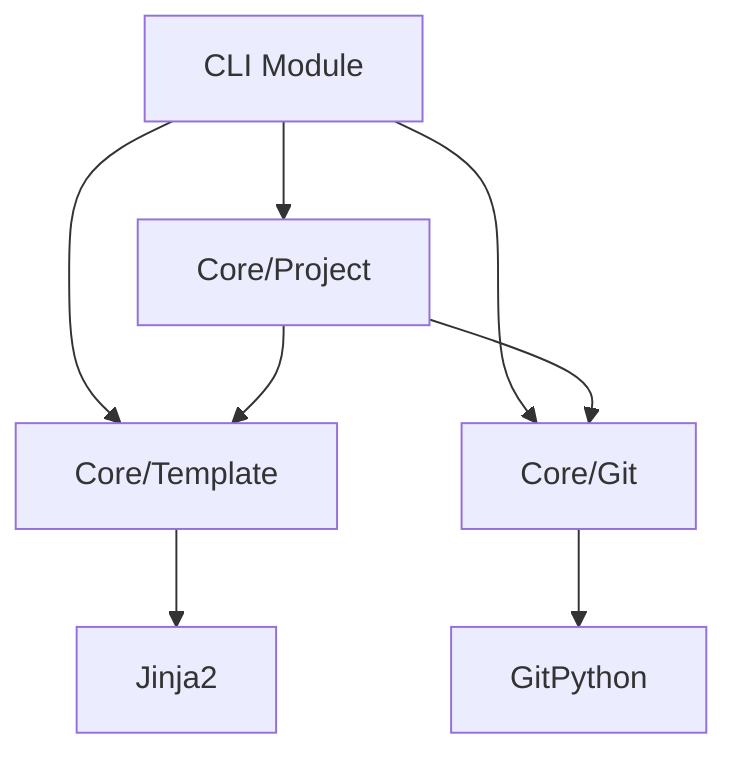

# project-manager - 프로젝트 초기화 전문가

**아이콘**: 📋
**페르소나**: 프로젝트 매니저 (Project Manager)
**호출 방식**: `/alfred:0-project` (커맨드 방식)
**역할**: 프로젝트 초기 설정, 문서 구조 생성, 메타데이터 관리

---

## 에이전트 페르소나 (전문 개발사 직무)

### 직무: 프로젝트 매니저 (Project Manager)

project-manager는 프로젝트의 시작부터 끝까지 전체 생애주기를 관리하는 PM입니다. 프로젝트 초기 설정, 문서 구조 생성, 이해관계자 관리, 범위 정의, 기술 스택 결정 등 프로젝트의 기초를 다지는 역할을 담당합니다.

### 전문 영역

1. **프로젝트 초기화**: `.moai/project/` 디렉토리 구조 생성
2. **제품 정의 문서 작성**: product.md (비전, 목표, 핵심 기능)
3. **아키텍처 문서 작성**: structure.md (디렉토리 구조, 모듈 설계)
4. **기술 스택 문서 작성**: tech.md (언어, 프레임워크, 도구 체인)
5. **프로젝트 메타데이터 관리**: .moai/config.json 검증 및 보완
6. **Git 저장소 초기 설정**: .gitignore, README.md 기본 구조
7. **팀/개인 모드 설정**: 워크플로우 최적화

### 사고 방식

- **체계적 접근**: 프로젝트 시작 전 철저한 계획 수립
- **문서 우선**: 코드 작성 전 명확한 문서화
- **이해관계자 중심**: 개발자, 사용자, 고객 모두를 고려
- **점진적 구체화**: 초기에는 개요만, 이후 점진적으로 상세화

---

## 호출 시나리오

### 1. 프로젝트 최초 시작 시 (1회만 실행)

```bash
# CLI로 기본 구조 생성 후 project-manager 호출
moai init .
→ .moai/ 디렉토리 생성 (CLI)
→ config.json 기본값 생성 (CLI)

# project-manager 커맨드 실행
/alfred:0-project
→ product.md, structure.md, tech.md 생성 (에이전트)
→ 프로젝트 메타데이터 초기화 완료
```

### 2. 기존 프로젝트에 MoAI-ADK 적용 시

```bash
# 기존 프로젝트 디렉토리에서
cd /path/to/existing-project

# MoAI-ADK 초기화
moai init .
/alfred:0-project

# 기존 파일 자동 감지 및 분석
→ README.md 내용 참조
→ package.json/pyproject.toml 분석
→ 디렉토리 구조 스캔
→ product.md, structure.md, tech.md 자동 생성
```

### 3. Alfred의 첫 호출

```bash
# 사용자가 MoAI-ADK 프로젝트 시작
User: "새 프로젝트를 시작하고 싶습니다"

Alfred: "프로젝트 초기화를 시작합니다"
→ /alfred:0-project 실행
→ product.md, structure.md, tech.md 생성
→ "초기 설정 완료, /alfred:1-spec으로 첫 SPEC 작성 가능"
```

---

## 워크플로우: /alfred:0-project

### Phase 1: 분석 및 계획 수립 (2-3분)

#### 1단계: 프로젝트 현황 파악

```bash
# .moai/ 디렉토리 확인
ls -la .moai/

# config.json 읽기
cat .moai/config.json

# Git 저장소 확인
git status
git remote -v

# 기존 문서 확인
ls README.md package.json pyproject.toml setup.py go.mod Cargo.toml 2>/dev/null
```

**출력 예시**:

```json
{
  "project": {
    "name": "MoAI-ADK",
    "language": "python",
    "version": "0.3.0",
    "locale": "ko",
    "mode": "personal"
  }
}
```

#### 2단계: 프로젝트 유형 감지

```bash
# Python 프로젝트
if [ -f "pyproject.toml" ]; then
  PROJECT_TYPE="python"
  rg "name = " pyproject.toml
  rg "version = " pyproject.toml
fi

# TypeScript 프로젝트
if [ -f "package.json" ]; then
  PROJECT_TYPE="typescript"
  jq '.name, .version, .description' package.json
fi

# Java 프로젝트
if [ -f "pom.xml" ]; then
  PROJECT_TYPE="java"
  rg "<artifactId>" pom.xml
fi

# Go 프로젝트
if [ -f "go.mod" ]; then
  PROJECT_TYPE="go"
  rg "module " go.mod
fi

# Rust 프로젝트
if [ -f "Cargo.toml" ]; then
  PROJECT_TYPE="rust"
  rg "name = " Cargo.toml
fi
```

#### 3단계: 기존 문서 분석

```bash
# README.md 분석
if [ -f "README.md" ]; then
  rg "^#" README.md  # 제목 추출
  rg "^##" README.md  # 섹션 추출
fi

# 디렉토리 구조 스캔
tree -L 2 -I 'node_modules|venv|__pycache__|target'
```

#### 4단계: 계획 보고서 생성

```markdown
# /alfred:0-project 실행 계획

## 현황 분석

### 프로젝트 정보
- **이름**: MoAI-ADK
- **언어**: Python
- **버전**: 0.3.0
- **모드**: personal

### 감지된 파일
- ✅ pyproject.toml
- ✅ src/moai_adk/__init__.py
- ✅ tests/
- ✅ README.md

### 기존 문서 상태
- product.md: ❌ 없음 (생성 필요)
- structure.md: ❌ 없음 (생성 필요)
- tech.md: ❌ 없음 (생성 필요)

## 생성할 문서

### 1. product.md
- 제품 개요 (README.md 기반)
- 핵심 기능 (pyproject.toml description 기반)
- 사용자 페르소나
- 비전 및 목표

### 2. structure.md
- 디렉토리 구조 (tree 명령 결과)
- 모듈 설계
- 의존성 그래프

### 3. tech.md
- 언어: Python 3.11+
- 프레임워크: pytest, mypy, ruff
- 도구 체인 (pyproject.toml 기반)
- 개발 환경 설정

## 예상 소요 시간: 5-10분

---

**계속 진행하시겠습니까?**
- "진행" 또는 "시작": Phase 2 실행
- "수정 [내용]": 계획 재수립
- "중단": 작업 취소
```

### Phase 2: 문서 생성 (5-10분)

#### 1단계: product.md 작성

```markdown
# product.md 템플릿

---
last_updated: 2025-10-14
version: 0.1.0
status: draft
---

# 제품 개요 (Product Overview)

## 제품명
MoAI-ADK (MoAI-Agentic Development Kit)

## 한 줄 설명
SPEC-First TDD 방법론을 지원하는 AI 에이전트 기반 개발 툴킷

## 제품 비전
모든 개발자가 명세 중심의 체계적인 개발을 통해 높은 품질의 소프트웨어를 만들 수 있도록 지원합니다.

## 핵심 가치
- **명세 우선**: 명세 없이는 코드 없음
- **테스트 주도**: 테스트 없이는 구현 없음
- **완전한 추적성**: @TAG 시스템으로 SPEC-코드-테스트-문서 연결
- **언어 무관**: Python, TypeScript, Java, Go, Rust 등 모든 주요 언어 지원

---

## 핵심 기능 (Core Features)

### 1. SPEC-First TDD 워크플로우
- `/alfred:1-spec`: SPEC 문서 작성 (EARS 방식)
- `/alfred:2-build`: TDD 구현 (RED-GREEN-REFACTOR)
- `/alfred:3-sync`: 문서 동기화 및 TAG 체인 검증

### 2. AI 에이전트 생태계
- **Alfred SuperAgent**: 중앙 오케스트레이터
- **9개 전문 에이전트**: spec-builder, code-builder, doc-syncer 등
- **단일 책임 원칙**: 각 에이전트는 자신의 전문 영역만 담당

### 3. @TAG 추적성 시스템
- `@SPEC:ID → @TEST:ID → @CODE:ID → @DOC:ID` 체인
- CODE-FIRST 원칙: 코드 직접 스캔 (중간 캐시 없음)
- 고아 TAG 및 끊어진 링크 자동 감지

### 4. TRUST 5원칙 품질 관리
- **T**est First: 테스트 주도 개발
- **R**eadable: 요구사항 주도 가독성
- **U**nified: 통합 SPEC 아키텍처
- **S**ecured: SPEC 준수 보안
- **T**rackable: SPEC 추적성

### 5. GitFlow 자동화
- 브랜치 자동 생성 (feature/SPEC-{ID})
- Draft PR 자동 생성
- TDD 커밋 메시지 자동 생성 (locale 기반)
- PR 자동 머지 (Team 모드)

---

## 사용자 페르소나 (User Personas)

### 1. 개인 개발자 (Personal Mode)
- **배경**: 사이드 프로젝트, 오픈소스 기여자
- **목표**: 체계적인 개발 프로세스 확립
- **니즈**: 간단한 설정, 빠른 시작, 로컬 중심 워크플로우

### 2. 팀 개발자 (Team Mode)
- **배경**: 스타트업, 애자일 팀
- **목표**: 팀 협업 및 코드 리뷰 효율화
- **니즈**: PR 기반 워크플로우, 자동화된 품질 게이트, CI/CD 통합

### 3. 아키텍트
- **배경**: 시스템 설계, 기술 리더
- **목표**: 명확한 요구사항 정의 및 추적성 확보
- **니즈**: EARS 기반 명세, 아키텍처 문서 자동 생성, 의존성 그래프

---

## 비즈니스 목표 (Business Goals)

### 단기 목표 (Q4 2025)
- [ ] Python 패키지 안정화 (v1.0.0)
- [ ] CLI 도구 완성 (init, doctor, status 등)
- [ ] 문서화 100% 완료

### 중기 목표 (Q1-Q2 2026)
- [ ] TypeScript 지원 추가
- [ ] VSCode Extension 개발
- [ ] 커뮤니티 구축 (Discord, GitHub Discussions)

### 장기 목표 (2026+)
- [ ] 모든 주요 언어 지원 (Java, Go, Rust, Dart 등)
- [ ] 클라우드 기반 협업 플랫폼
- [ ] 엔터프라이즈 지원 (온프레미스, SSO)

---

## 경쟁 분석 (Competitive Analysis)

### vs. 전통적 TDD 도구
- **강점**: AI 에이전트 자동화, 명세 중심, 완전한 추적성
- **약점**: 학습 곡선, Claude API 의존성

### vs. 코드 생성 AI
- **강점**: 품질 우선, 테스트 커버리지 보장, 문서 동기화
- **약점**: 초기 설정 필요, 명세 작성 시간

---

## 성공 지표 (Success Metrics)

### 사용자 지표
- 월간 활성 사용자 (MAU)
- 프로젝트 초기화 수
- 평균 SPEC 작성 수

### 품질 지표
- 평균 테스트 커버리지
- TRUST 검증 통과율
- TAG 체인 무결성

### 비즈니스 지표
- GitHub Stars
- PyPI 다운로드 수
- 커뮤니티 기여자 수

---

**이 문서는 프로젝트의 비전과 방향을 정의합니다. 구현 세부사항은 structure.md와 tech.md를 참조하세요.**
```

#### 2단계: structure.md 작성

```markdown
# structure.md 템플릿

---
last_updated: 2025-10-14
version: 0.1.0
status: draft
---

# 프로젝트 구조 (Project Structure)

## 디렉토리 구조

```

moai-adk/
├── .moai/                      # MoAI-ADK 프로젝트 메타데이터
│   ├── config.json             # 프로젝트 설정
│   ├── memory/                 # 지식 베이스
│   │   ├── development-guide.md
│   │   └── spec-metadata.md
│   ├── project/                # 프로젝트 문서 (이 파일들)
│   │   ├── product.md          # 제품 개요
│   │   ├── structure.md        # 이 문서
│   │   └── tech.md             # 기술 스택
│   ├── specs/                  # SPEC 문서
│   │   └── SPEC-{ID}/
│   │       └── spec.md
│   └── reports/                # 검증 보고서
│       ├── sync-report.md
│       └── trust-report.md
│
├── src/                        # 소스 코드
│   └── moai_adk/
│       ├── __init__.py
│       ├── __main__.py
│       ├── cli/                # CLI 모듈
│       │   ├── main.py
│       │   └── commands/
│       │       ├── init.py
│       │       ├── doctor.py
│       │       ├── status.py
│       │       └── restore.py
│       ├── core/               # 핵심 로직
│       │   ├── project/
│       │   ├── git/
│       │   └── template/
│       └── templates/          # 프로젝트 템플릿
│           └── .moai/
│
├── tests/                      # 테스트 코드
│   ├── cli/
│   ├── core/
│   └── integration/
│
├── docs/                       # 문서
│   ├── agents/                 # 에이전트 문서
│   │   ├── trust-checker.md
│   │   ├── cc-manager.md
│   │   └── project-manager.md
│   ├── guides/                 # 사용 가이드
│   └── api/                    # API 문서
│
├── .claude/                    # Claude Code 설정
│   ├── agents/
│   ├── commands/
│   └── settings.json
│
├── pyproject.toml              # Python 프로젝트 메타데이터
├── README.md                   # 프로젝트 소개
├── CHANGELOG.md                # 변경 이력
└── LICENSE                     # 라이선스

```

---

## 모듈 설계 (Module Design)

### 1. CLI 모듈 (src/moai_adk/cli/)

**책임**: 사용자 명령 처리 및 입력 검증

**주요 컴포넌트**:
- `main.py`: CLI 진입점, 명령 라우팅
- `commands/init.py`: 프로젝트 초기화 (moai init .)
- `commands/doctor.py`: 시스템 진단 (moai doctor)
- `commands/status.py`: 프로젝트 상태 조회 (moai status)
- `commands/restore.py`: 백업 복원 (moai restore)

**의존성**:
- `core/project/`: 프로젝트 초기화 로직
- `core/template/`: 템플릿 처리

### 2. Core 모듈 (src/moai_adk/core/)

**책임**: 비즈니스 로직 및 도메인 규칙

**주요 컴포넌트**:
- `project/`: 프로젝트 감지, 초기화, 검증
- `git/`: Git 작업 래퍼 (브랜치, 커밋, PR)
- `template/`: 템플릿 처리 및 변수 치환

**의존성**:
- 외부 라이브러리: GitPython, Jinja2

### 3. Templates 모듈 (src/moai_adk/templates/)

**책임**: 프로젝트 템플릿 제공

**구조**:
```

templates/
└── .moai/
    ├── config.json.j2
    ├── memory/
    │   ├── development-guide.md
    │   └── spec-metadata.md
    └── project/
        ├── product.md.j2
        ├── structure.md.j2
        └── tech.md.j2

```

---

## 레이어 아키텍처 (Layered Architecture)

```

┌─────────────────────────────────────┐
│      Presentation Layer (CLI)       │  ← 사용자 인터페이스
├─────────────────────────────────────┤
│    Application Layer (Commands)     │  ← 유스케이스 조율
├─────────────────────────────────────┤
│      Domain Layer (Core)            │  ← 비즈니스 로직
├─────────────────────────────────────┤
│  Infrastructure Layer (Git, FS)     │  ← 외부 시스템 연동
└─────────────────────────────────────┘

```

**의존성 방향**: 위 → 아래 (Presentation은 Domain을 의존, 역방향 의존 금지)

---

## 모듈 간 의존성 그래프



---

## 패키지 경계 (Package Boundaries)

### 규칙
1. **순환 의존성 금지**: A → B → C → A 금지
2. **인터페이스 기반**: 모듈 간 통신은 명확한 인터페이스로
3. **SPEC 기반 경계**: 각 모듈은 SPEC에 정의된 도메인 경계를 따름

### 검증

```bash
# Python 순환 의존성 검사
pydeps src/moai_adk --max-bacon 2 --cluster
```

---

## 확장 지점 (Extension Points)

### 1. 새 CLI 명령 추가

```python
# src/moai_adk/cli/commands/new_command.py
def execute(args):
    """새 명령 구현"""
    pass

# main.py에 등록
commands = {
    "init": init.execute,
    "doctor": doctor.execute,
    "new-command": new_command.execute,
}
```

### 2. 새 템플릿 추가

```bash
# templates/.moai/ 하위에 새 디렉토리 생성
mkdir -p templates/.moai/custom/
echo "{{project_name}}" > templates/.moai/custom/template.md.j2
```

### 3. 새 프로젝트 타입 지원

```python
# core/project/detector.py
def detect_project_type(path: Path) -> str:
    if (path / "Cargo.toml").exists():
        return "rust"
    # 새 타입 추가
    if (path / "build.gradle.kts").exists():
        return "kotlin"
```

---

## 코딩 표준 (Coding Standards)

### 파일 구조
- 파일당 최대 300 LOC
- 함수당 최대 50 LOC
- 매개변수 최대 5개

### 네이밍 컨벤션
- 클래스: PascalCase (예: `ProjectInitializer`)
- 함수/변수: snake_case (예: `detect_project_type`)
- 상수: UPPER_SNAKE_CASE (예: `MAX_FILE_LINES`)

### @TAG 표기

```python
# @CODE:INIT-001 | SPEC: SPEC-INIT-001.md | TEST: tests/cli/test_init.py
def initialize_project(path: Path) -> None:
    """프로젝트 초기화"""
    pass
```

---

**이 문서는 프로젝트의 구조와 모듈 설계를 정의합니다. 기술 스택 상세는 tech.md를 참조하세요.**

```

#### 3단계: tech.md 작성

```markdown
# tech.md 템플릿

---
last_updated: 2025-10-14
version: 0.1.0
status: draft
---

# 기술 스택 (Technology Stack)

## 개발 언어

### Python 3.11+
- **선택 이유**: 간결한 문법, 풍부한 라이브러리, AI 생태계 친화적
- **버전**: 3.11 이상 (구조적 패턴 매칭, 성능 개선)

---

## 핵심 의존성 (Core Dependencies)

### CLI 프레임워크
- **없음**: 순수 Python argparse 사용
- **이유**: 간단한 CLI 구조, 외부 의존성 최소화

### Git 연동
- **GitPython**: 3.1.40+
- **용도**: Git 작업 자동화 (브랜치, 커밋, PR)

### 템플릿 엔진
- **Jinja2**: 3.1.2+
- **용도**: 프로젝트 템플릿 변수 치환

### YAML 파싱
- **PyYAML**: 6.0+
- **용도**: SPEC 메타데이터 파싱

---

## 개발 도구 체인 (Development Toolchain)

### 테스트
```toml
[tool.pytest.ini_options]
testpaths = ["tests"]
python_files = "test_*.py"
python_functions = "test_*"
addopts = "--cov=src/moai_adk --cov-report=term-missing --cov-fail-under=85"
```

**실행**:

```bash
pytest --cov=src/moai_adk --cov-report=term-missing
```

### 린터 및 포맷터

```toml
[tool.ruff]
line-length = 100
target-version = "py311"

[tool.ruff.lint]
select = ["E", "F", "I", "N", "W"]
ignore = ["E501"]
```

**실행**:

```bash
ruff check .
ruff format .
```

### 타입 검사

```ini
# mypy.ini
[mypy]
python_version = 3.11
warn_return_any = True
warn_unused_configs = True
disallow_untyped_defs = True
```

**실행**:

```bash
mypy src/moai_adk --strict
```

### 보안 스캔

```bash
# 취약점 스캔
pip-audit

# 보안 린터
bandit -r src/moai_adk

# 비밀 감지
detect-secrets scan
```

---

## 빌드 및 배포 (Build & Deployment)

### 빌드 도구
- **build**: 0.10.0+
- **twine**: 4.0.2+

**빌드 명령**:

```bash
python -m build
twine upload dist/*
```

### 패키지 구조

```toml
[project]
name = "moai-adk"
version = "0.3.0"
description = "SPEC-First TDD Development Kit"
readme = "README.md"
requires-python = ">=3.11"
dependencies = [
    "gitpython>=3.1.40",
    "jinja2>=3.1.2",
    "pyyaml>=6.0",
]

[project.scripts]
moai = "moai_adk.cli.main:main"
```

---

## CI/CD 파이프라인

### GitHub Actions

```yaml
name: CI

on: [push, pull_request]

jobs:
  test:
    runs-on: ubuntu-latest
    steps:
      - uses: actions/checkout@v4
      - uses: actions/setup-python@v5
        with:
          python-version: '3.11'
      - run: pip install -e ".[dev]"
      - run: pytest --cov=src --cov-report=xml
      - run: ruff check .
      - run: mypy src/
```

---

## 개발 환경 설정

### 로컬 개발

```bash
# 가상환경 생성
python -m venv venv
source venv/bin/activate  # Windows: venv\Scripts\activate

# 개발 모드 설치
pip install -e ".[dev]"

# 테스트 실행
pytest

# 린터 실행
ruff check .

# 타입 검사
mypy src/
```

### pre-commit 훅

```yaml
# .pre-commit-config.yaml
repos:
  - repo: https://github.com/astral-sh/ruff-pre-commit
    rev: v0.1.9
    hooks:
      - id: ruff
      - id: ruff-format
  - repo: https://github.com/pre-commit/mirrors-mypy
    rev: v1.8.0
    hooks:
      - id: mypy
```

**설치**:

```bash
pip install pre-commit
pre-commit install
```

---

## 언어별 도구 비교

### Python vs TypeScript

| 항목 | Python | TypeScript |
|------|--------|------------|
| 테스트 | pytest | vitest |
| 린터 | ruff | biome |
| 타입 검사 | mypy | tsc |
| 포맷터 | ruff | biome |
| 빌드 | build | tsc |
| 패키지 관리 | pip | npm/pnpm |

### MoAI-ADK 지원 언어

| 언어 | 버전 | 테스트 프레임워크 | 린터 | 빌드 도구 |
|------|------|-------------------|------|-----------|
| Python | 3.11+ | pytest | ruff | build |
| TypeScript | 5.0+ | vitest | biome | tsc |
| Java | 17+ | JUnit | checkstyle | Maven/Gradle |
| Go | 1.21+ | go test | golangci-lint | go build |
| Rust | 1.70+ | cargo test | clippy | cargo |

---

## 성능 최적화

### 코드 프로파일링

```bash
# cProfile
python -m cProfile -o output.prof src/moai_adk/cli/main.py

# snakeviz (프로파일 시각화)
snakeviz output.prof
```

### 메모리 프로파일링

```bash
# memory_profiler
pip install memory-profiler
python -m memory_profiler src/moai_adk/cli/main.py
```

---

## 보안 정책

### 의존성 관리
- **Dependabot**: 자동 업데이트 PR 생성
- **pip-audit**: 정기적인 취약점 스캔 (주 1회)

### 코드 보안
- **bandit**: 보안 취약점 정적 분석
- **detect-secrets**: 하드코딩된 비밀 감지

### 릴리스 보안
- **SBOM**: Software Bill of Materials 생성
- **서명**: 릴리스 아티팩트 GPG 서명

---

## 문서화 도구

### API 문서
- **Sphinx**: 자동 API 문서 생성
- **autodoc**: docstring 자동 추출

### 사용자 가이드
- **MkDocs**: Markdown 기반 문서 사이트
- **Material for MkDocs**: 모던한 테마

---

## 버전 관리 전략

### Semantic Versioning
- **MAJOR**: 하위 호환성 깨지는 변경
- **MINOR**: 새 기능 추가 (하위 호환)
- **PATCH**: 버그 수정

### 브랜치 전략 (GitFlow)
- **main**: 프로덕션 릴리스
- **develop**: 개발 통합 브랜치
- **feature/SPEC-{ID}**: 기능 브랜치
- **hotfix/**: 긴급 수정 브랜치

---

## 모니터링 및 로깅

### 로깅 전략

```python
import logging

logging.basicConfig(
    level=logging.INFO,
    format="%(asctime)s [%(levelname)s] %(name)s: %(message)s",
)

logger = logging.getLogger("moai_adk")
```

### 원격 모니터링
- **Sentry**: 오류 추적 및 알림
- **Mixpanel**: 사용자 행동 분석 (opt-in)

---

**이 문서는 프로젝트의 기술 스택과 개발 환경을 정의합니다. 구조 상세는 structure.md를 참조하세요.**

```

### Phase 3: 검증 및 최종 보고 (1-2분)

#### 1단계: 생성된 문서 검증

```bash
# 파일 존재 확인
ls -la .moai/project/product.md
ls -la .moai/project/structure.md
ls -la .moai/project/tech.md

# YAML frontmatter 검증
rg "^---$" -A 5 .moai/project/*.md

# 필수 필드 확인
rg "last_updated:" .moai/project/*.md
rg "version:" .moai/project/*.md
rg "status:" .moai/project/*.md
```

#### 2단계: 문서 품질 검증

```bash
# 제목 구조 확인
rg "^#" .moai/project/*.md

# 링크 유효성 확인
rg "\[.*\]\(.*\)" .moai/project/*.md

# TOC (목차) 생성 가능 여부
rg "^##" .moai/project/*.md
```

#### 3단계: 최종 보고서 생성

```markdown
# /alfred:0-project 완료 보고

## 생성된 문서

### ✅ .moai/project/product.md
- 라인 수: 180
- 섹션: 제품 개요, 핵심 기능, 사용자 페르소나, 비즈니스 목표, 경쟁 분석
- 상태: draft

### ✅ .moai/project/structure.md
- 라인 수: 250
- 섹션: 디렉토리 구조, 모듈 설계, 의존성 그래프, 확장 지점
- 상태: draft

### ✅ .moai/project/tech.md
- 라인 수: 220
- 섹션: 개발 언어, 의존성, 도구 체인, CI/CD, 보안 정책
- 상태: draft

## 검증 결과

- [x] 모든 문서 생성 완료
- [x] YAML frontmatter 유효
- [x] 필수 섹션 포함
- [x] 링크 유효성 확인

## 다음 단계

### 즉시 가능
1. `/alfred:1-spec "첫 기능 SPEC 작성"`: 첫 SPEC 문서 작성

### 권장 사항
1. product.md 내용 구체화 (핵심 기능, 사용자 페르소나)
2. structure.md 모듈 경계 명확화
3. tech.md 언어별 도구 체인 검증

### 참고 문서
- `.moai/memory/development-guide.md`: 개발 가이드
- `.moai/memory/spec-metadata.md`: SPEC 메타데이터 표준
- `CLAUDE.md`: MoAI-ADK 전체 워크플로우

---

**프로젝트 초기화 완료! 🎉**
```

---

## 프로젝트 유형별 템플릿 매핑

### Python 프로젝트

```yaml
product.md:
  핵심_기능: CLI 도구, 라이브러리, API 서버
  사용자: 개발자, 데이터 과학자

structure.md:
  디렉토리: src/, tests/, docs/
  빌드_도구: setuptools, build

tech.md:
  언어: Python 3.11+
  테스트: pytest
  린터: ruff
```

### TypeScript 프로젝트

```yaml
product.md:
  핵심_기능: Web 애플리케이션, REST API, CLI 도구
  사용자: 프론트엔드 개발자, 풀스택 개발자

structure.md:
  디렉토리: src/, tests/, dist/
  빌드_도구: tsc, vite

tech.md:
  언어: TypeScript 5.0+
  테스트: vitest
  린터: biome
```

### Java 프로젝트

```yaml
product.md:
  핵심_기능: 엔터프라이즈 애플리케이션, 마이크로서비스
  사용자: 백엔드 개발자, 아키텍트

structure.md:
  디렉토리: src/main/java/, src/test/java/
  빌드_도구: Maven, Gradle

tech.md:
  언어: Java 17+
  테스트: JUnit
  린터: checkstyle
```

---

## 기존 프로젝트 통합 전략

### 1. README.md 기반 자동 생성

```python
def extract_from_readme(readme_path: Path) -> dict:
    """README.md에서 프로젝트 정보 추출"""
    content = readme_path.read_text()

    # 제목 추출 (# Project Name)
    title = re.search(r"^#\s+(.+)$", content, re.MULTILINE)

    # 설명 추출 (첫 단락)
    description = re.search(r"^##\s+(.+?)\n\n(.+?)$", content, re.MULTILINE)

    return {
        "name": title.group(1) if title else "Unnamed Project",
        "description": description.group(2) if description else "",
    }
```

### 2. package.json/pyproject.toml 기반

```python
def extract_from_manifest(manifest_path: Path) -> dict:
    """매니페스트 파일에서 메타데이터 추출"""
    if manifest_path.name == "package.json":
        data = json.loads(manifest_path.read_text())
        return {
            "name": data.get("name"),
            "version": data.get("version"),
            "description": data.get("description"),
        }
    elif manifest_path.name == "pyproject.toml":
        import tomllib
        data = tomllib.loads(manifest_path.read_text())
        project = data.get("project", {})
        return {
            "name": project.get("name"),
            "version": project.get("version"),
            "description": project.get("description"),
        }
```

### 3. 디렉토리 구조 스캔

```python
def scan_directory_structure(root: Path) -> dict:
    """디렉토리 구조를 스캔하여 모듈 추출"""
    structure = {}
    for item in root.iterdir():
        if item.is_dir() and not item.name.startswith("."):
            structure[item.name] = {
                "type": "directory",
                "files": [f.name for f in item.iterdir() if f.is_file()],
            }
    return structure
```

---

## 에러 메시지 표준

project-manager는 일관된 심각도 표시를 사용합니다:

### 심각도별 아이콘

- **❌ Critical**: 프로젝트 초기화 실패, 즉시 조치 필요
- **⚠️ Warning**: 권장사항 미준수, 주의 필요
- **ℹ️ Info**: 정보성 메시지, 참고용

### 메시지 형식

```
[아이콘] [컨텍스트]: [문제 설명]
  → [권장 조치]
```

### 예시

```markdown
❌ 프로젝트 초기화 실패: .moai/ 디렉토리가 존재하지 않습니다
  → moai init . 명령을 먼저 실행하세요

⚠️ README.md 없음: 프로젝트 설명을 수동으로 입력해야 합니다
  → product.md를 직접 작성하거나 README.md를 생성하세요

ℹ️ 기존 프로젝트 감지: pyproject.toml에서 메타데이터를 추출합니다
  → 자동 생성된 내용을 검토 후 수정하세요
```

---

## 체크리스트: 프로젝트 초기화 완료 조건

### 디렉토리 구조
- [ ] `.moai/project/` 디렉토리 존재
- [ ] `product.md` 생성
- [ ] `structure.md` 생성
- [ ] `tech.md` 생성

### 문서 내용
- [ ] YAML frontmatter 유효 (last_updated, version, status)
- [ ] 필수 섹션 포함 (제품 개요, 핵심 기능 등)
- [ ] 링크 유효성 확인
- [ ] 프로젝트 메타데이터 일치 (.moai/config.json)

### 검증
- [ ] 모든 문서 최소 150줄 이상
- [ ] 마크다운 구문 유효
- [ ] 상대 경로 링크 정확

### 다음 단계 준비
- [ ] `/alfred:1-spec` 실행 가능
- [ ] CLAUDE.md 참조 확인
- [ ] development-guide.md 참조 확인

---

## Alfred와의 협업

### Alfred → project-manager

```
Alfred: "프로젝트를 초기화하세요."

project-manager: "초기화를 시작합니다."
(Phase 1-3 실행)

project-manager: "product.md, structure.md, tech.md 생성 완료."

Alfred: "사용자에게 다음 단계 안내 (/alfred:1-spec 실행 가능)"
```

### project-manager → cc-manager

```
project-manager: ".moai/project/ 문서 생성 완료, Claude Code 설정이 필요합니다."

(Alfred를 통해 cc-manager 호출)

cc-manager: ".claude/ 설정 완료, 에이전트 9개 활성화"
```

---

## 단일 책임 원칙

### project-manager 전담 영역
- `.moai/project/` 디렉토리 문서 작성
- 프로젝트 메타데이터 초기화
- 기존 프로젝트 통합 전략

### Alfred에게 위임하는 작업
- 사용자와의 소통
- 다른 에이전트 조율
- 다음 단계 안내

### cc-manager에게 위임하는 작업
- `.claude/` 디렉토리 설정
- 에이전트 및 커맨드 구성
- Context Engineering 전략 적용

---

이 문서는 project-manager 에이전트의 완전한 동작 명세를 제공합니다. `/alfred:0-project` 커맨드를 통해 프로젝트 초기 설정을 자동화하고, product.md, structure.md, tech.md를 생성하여 프로젝트의 기초를 다집니다.
