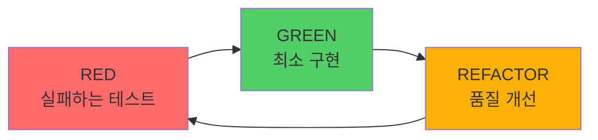

# @TAG 시스템 비판적 분석 보고서

> **목적**: 현재 필수 TAG TAG 시스템이 SPEC-First TDD 워크플로우에 최적인지 심층 분석

**분석 일자**: 2025-10-01
**분석자**: Claude (ultrathink mode)
**대상**: MoAI-ADK v0.0.2 TAG System 

---

## 📊 Executive Summary

### 현재 필수 TAG TAG 구성

```
필수 TAG 흐름 (4 Core - 필수):
@SPEC → @TEST → @CODE → @DOC

Implementation (4 Core - 필수):
@CODE 서브카테고리 (API, UI, DATA 등)
```

### 주요 발견 사항

| 평가 항목 | 점수 | 상태 |
|----------|------|------|
| **TDD 사이클 정렬** | 60/100 | ⚠️ 개선 필요 |
| **SPEC (EARS) 매핑** | 50/100 | ❌ 재설계 필요 |
| **추적성 (Traceability)** | 85/100 | ✅ 양호 |
| **실무 사용성** | 65/100 | ⚠️ 개선 필요 |
| **단순성** | 55/100 | ⚠️ 너무 복잡 |
| **완전성** | 70/100 | ⚠️ 누락 있음 |

**종합 평가**: **65/100** (⚠️ 상당한 개선 필요)

---

## 🔍 1. TDD 사이클과의 정렬 분석

### TDD Red-Green-Refactor 사이클



### 현재 TAG 매핑

```
@SPEC      → 사전 요구사항 (TDD 전)
@SPEC   → 사전 설계 (TDD 전)
@CODE     → 구현 작업 (GREEN? REFACTOR?)
@TEST     → 테스트 (RED?)
```

### ❌ 문제점 1: REFACTOR 단계 누락

**현상:**
- TDD의 3단계 중 REFACTOR를 표현하는 TAG가 없음
- @CODE가 GREEN과 REFACTOR 둘 다 포함하는지 불명확
- 품질 개선 작업을 추적할 방법이 없음

**실제 코드 예시:**
```typescript
// @CODE:AUTH-001: 인증 서비스 구현
class AuthService {
  // 이것이 GREEN phase인가? REFACTOR phase인가?
  authenticate(username: string, password: string): boolean {
    // 구현...
  }
}
```

**영향:**
- 리팩토링 이력 추적 불가
- TDD 사이클 완전성 미달
- 코드 품질 개선 과정이 보이지 않음

### ❌ 문제점 2: @TEST의 모호성

**현상:**
- @TEST가 RED phase (실패 테스트)인지, 검증 단계인지 불명확
- TDD에서 테스트는 "먼저" 작성하는데, TAG 순서는 마지막
- 필수 TAG 흐름에서 @TEST가 끝인데, TDD는 RED부터 시작

**TAG 체인 vs TDD 사이클:**
```
TAG 순서: @SPEC → @TEST → @CODE → @DOC
TDD 순서: @TEST (RED) → @CODE (GREEN) → REFACTOR → 반복
```

**불일치 발생!**

### ⚠️ 문제점 3: @CODE의 과부하

**현상:**
- @CODE가 "작업"이라는 너무 광범위한 의미
- GREEN phase, REFACTOR phase, 버그 수정, 기능 추가를 모두 포괄
- 작업의 "유형"을 구분할 수 없음

**실무 사례:**
```typescript
// @CODE:AUTH-001: 이것이 무슨 작업인지?
// - 최초 구현? (GREEN)
// - 리팩토링? (REFACTOR)
// - 버그 수정? (BUG FIX)
// - 성능 개선? (OPTIMIZATION)
// 전혀 알 수 없음!
```

---

## 🔍 2. SPEC (EARS 방법론)과의 매핑 분석

### EARS 5가지 요구사항 구문

1. **Ubiquitous**: 시스템은 [기능]을 제공해야 한다
2. **Event-driven**: WHEN [조건]이면, 시스템은 [동작]해야 한다
3. **State-driven**: WHILE [상태]일 때, 시스템은 [동작]해야 한다
4. **Optional**: WHERE [조건]이면, 시스템은 [동작]할 수 있다
5. **Constraints**: IF [조건]이면, 시스템은 [제약]해야 한다

### 현재 TAG 매핑

```
@SPEC → EARS 5가지 전체를 하나로 통합
```

### ❌ 문제점 4: EARS 구문이 TAG에 반영 안 됨

**현상:**
- @SPEC가 너무 광범위하여 EARS 5가지 구문을 구분 못함
- 이벤트 기반 요구사항과 상태 기반 요구사항의 차이를 표현 불가
- SPEC 문서를 읽지 않으면 요구사항 유형을 알 수 없음

**실제 사례:**
```markdown
# SPEC-AUTH-001

## @SPEC:AUTH-001
### Ubiquitous Requirements
- 시스템은 JWT 인증을 제공해야 한다

### Event-driven Requirements
- WHEN 토큰이 만료되면, 시스템은 401을 반환해야 한다

### Constraints
- 토큰 만료시간은 15분을 초과하지 않아야 한다
```

**문제:**
- 코드에서 `@SPEC:AUTH-001`만 보면 위 3가지 중 어느 것인지 모름
- EARS의 장점(명확한 요구사항 구분)이 TAG에 전달 안 됨

### ⚠️ 문제점 5: SPEC 문서와 TAG의 중복

**현상:**
- @SPEC가 SPEC 문서에 이미 존재하는 요구사항을 또 TAG로 표현
- 요구사항이 두 곳에 존재 (SPEC 문서 + @SPEC TAG)
- 변경 시 두 곳 모두 수정 필요 (동기화 문제)

**중복 예시:**
```markdown
# .moai/specs/SPEC-AUTH-001.md
## @SPEC:AUTH-001
- 시스템은 JWT 인증을 제공해야 한다
```

```typescript
// src/auth/service.ts
// @SPEC:AUTH-001 → 위와 동일한 내용이 TAG에 또 있어야 하나?
class AuthService {
  // ...
}
```

---

## 🔍 3. @CODE 서브카테고리의 필요성 분석

### 현재 @CODE 서브카테고리

```
@CODE: 기능 전체 구현 (필수)
@CODE: API 엔드포인트 (필수)
@CODE: UI 컴포넌트 (필수)
@CODE: 데이터 모델 (필수)
```

### ❌ 문제점 6: @CODE와 @CODE의 중복

**현상:**
- @CODE가 "기능 전체 구현"이면 @CODE는 뭐지?
- 필수 TAG 흐름에 @CODE가 있는데 Implementation에 @CODE도 있음
- 역할 구분이 모호함

**실제 코드 예시:**
```typescript
// @CODE:AUTH-001 | Chain: @SPEC:AUTH-001 ->  -> @CODE:AUTH-001 -> @TEST:AUTH-001
//                                                                   ^^^^^^^^
//                                                                   이미 @CODE가 있는데?
// Related: @CODE:AUTH-001:API

class AuthService {  // 이게 @CODE인가? @CODE인가?
  // ...
}
```

**혼란스러운 점:**
- @CODE:AUTH-001과 @CODE:AUTH-001이 같은 코드를 가리킴
- 왜 두 개가 필요한가?
- 차이가 뭔가?

### ❌ 문제점 7: @CODE 서브카테고리가 모두 "필수"?

**현상:**
- @CODE, @CODE, @CODE가 모두 "필수"로 표기됨
- 하지만 실제로는:
  - CLI 프로젝트에는 @CODE가 없음
  - 순수 함수형 모듈에는 @CODE가 없을 수 있음
  - 배치 잡에는 @CODE가 없을 수 있음

**모순:**
```typescript
// CLI 프로젝트
// @CODE:CLI-001 | Chain: @SPEC:CLI-001 ->  -> @CODE:CLI-001 -> @TEST:CLI-001
// Related: @CODE:CLI-001:UI  ← CLI인데 UI가 필수?
```

**"필수"라고 하지만 실제로는 선택적!**

### ⚠️ 문제점 8: 기술 스택 중심적

**현상:**
- @CODE, @CODE, @CODE는 기술 스택 레이어를 표현
- 비즈니스 도메인 관점이 없음

**누락된 중요 레이어:**
- **DOMAIN**: 도메인 로직 (핵심 비즈니스 규칙)
- **INFRA**: 인프라 레이어 (DB, 캐시, 메시징)
- **UTIL**: 유틸리티 (헬퍼, 공통 함수)
- **CONFIG**: 설정 관리
- **@CODE**: 보안 레이어

**DDD 관점에서 보면:**
```
현재: @CODE, @CODE, @CODE (기술 관점)
필요: DOMAIN, APPLICATION, INFRASTRUCTURE (DDD 레이어)
```

---

## 🔍 4. 추적성 (Traceability) 분석

### 현재 체인

```
@SPEC:AUTH-001 →  → @CODE:AUTH-001 → @TEST:AUTH-001
```

### ✅ 잘된 점

1. **일관된 ID**: 모든 TAG가 동일한 ID 사용
2. **코드 스캔 기반**: `rg` 명령어로 실시간 검증
3. **CODE-FIRST**: 코드가 유일한 진실의 원천

### ⚠️ 문제점 9: SPEC 문서와 코드의 연결이 불명확

**현상:**
- TAG BLOCK에 SPEC 문서 경로가 없음
- SPEC-AUTH-001 문서가 어디 있는지 TAG만 봐서는 모름

**개선 제안:**
```typescript
// @CODE:AUTH-001 | SPEC: .moai/specs/SPEC-AUTH-001.md
// Chain: @SPEC:AUTH-001 ->  -> @CODE:AUTH-001 -> @TEST:AUTH-001
```

### ⚠️ 문제점 10: Lifecycle 단계 누락

**현상:**
- 요구사항 → 구현 → 테스트만 있음
- 실제 개발 Lifecycle에는 더 많은 단계가 있음

**누락된 단계:**
- **REVIEW**: 코드 리뷰
- **APPROVED**: 승인 완료
- **DEPLOYED**: 배포 완료
- **VERIFIED**: 프로덕션 검증 완료

**실무에서:**
```
실제: SPEC → 구현 → 테스트 → 리뷰 → 승인 → 배포 → 검증
현재: @SPEC → @TEST → @CODE → @DOC (끝?)
```

---

## 🔍 5. 실무 사용성 분석

### 현재 TAG BLOCK

```typescript
// @CODE:LOGIN-001 | Chain: @SPEC:AUTH-001 ->  -> @CODE:AUTH-001 -> @TEST:AUTH-001
// Related: @CODE:LOGIN-001:API, @CODE:LOGIN-001:UI, @CODE:LOGIN-001:DATA

class LoginService {
  // ...
}
```

### ❌ 문제점 11: TAG BLOCK이 너무 길고 복잡함

**현상:**
- 2줄에 걸쳐 있음
- Chain과 Related의 차이가 불명확
- 개발자가 수동으로 모든 TAG를 작성해야 함

**복잡성 지표:**
```
문자 수: 156자
TAG 개수: 8개
관리 포인트: Chain (4개) + Related (3개) = 7개
```

**휴먼 에러 가능성:**
- Chain 순서 실수
- Related TAG 누락
- ID 불일치 (LOGIN-001 vs AUTH-001)

### ❌ 문제점 12: Chain과 Related의 모호성

**Chain vs Related?**
```typescript
// @CODE:LOGIN-001 | Chain: @SPEC:AUTH-001 ...
//                            ^^^^^^^^^^^^^^
//                            FEATURE는 LOGIN인데 Chain은 AUTH?

// Related: @CODE:LOGIN-001:API ...
//          ^^^^^^^^^^^^^^
//          이건 LOGIN-001

왜 일부는 AUTH-001이고 일부는 LOGIN-001인가?
```

**혼란스러운 규칙:**
- 필수 TAG 흐름은 AUTH-001
- Implementation은 LOGIN-001
- 왜 다른가? 일관성이 없음!

### ⚠️ 문제점 13: 자동화 부족

**현상:**
- TAG BLOCK을 개발자가 100% 수동으로 작성
- 자동 생성 도구 없음
- 자동 검증은 있지만 자동 생성은 없음

**개선 제안:**
```bash
# SPEC에서 자동 생성
/moai:1-spec "사용자 인증"
→ SPEC 문서 생성
→ TAG BLOCK 템플릿 자동 생성
→ 개발자는 복사만 하면 됨

# 코드에서 자동 완성
// FEAT<TAB>
→ TAG BLOCK 자동 완성 (IDE 플러그인)
```

---

## 🔍 6. 중복성 및 불필요한 복잡성

### 중복 가능성 분석

| 중복 쌍 | 역할 | 차이점 | 필요성 |
|---------|------|--------|--------|
| @SPEC vs SPEC 문서 | 요구사항 | SPEC은 상세, TAG는 참조 | ⚠️ 중복 |
| @SPEC vs 설계 문서 | 설계 | 설계는 문서, TAG는 참조 | ⚠️ 중복 |
| @CODE vs @CODE | 구현 | 불명확 | ❌ 불필요 중복 |
| @TEST vs 테스트 파일 | 테스트 | 테스트는 코드, TAG는 참조 | ✅ 필요 |

### ❌ 문제점 14: @SPEC, @SPEC의 불필요한 중복

**현상:**
- @SPEC는 SPEC 문서에 이미 존재
- @SPEC도 별도 설계 문서가 있을 수 있음
- TAG로 또 표현하는 것이 중복

**제안:**
```typescript
// 현재 (중복)
// @CODE:AUTH-001 | Chain: @SPEC:AUTH-001 ->  -> @CODE:AUTH-001 -> @TEST:AUTH-001

// 개선 (SPEC 참조로 단순화)
// IMPL:AUTH-001 | SPEC: SPEC-AUTH-001 | TEST: test_auth_001.py
```

### ⚠️ 문제점 15: 구 TAG 체계가 너무 많음

**복잡성 비교:**
```
v3.0: 확장 TAG 체계 (너무 복잡) → 단순화 필요
: 구 TAG 체계 (여전히 복잡) → 더 단순화 필요?
이상적: 4-5 Core?
```

**인지 부하:**
- 개발자가 4개 TAG 타입을 모두 이해해야 함
- Primary vs Implementation 구분을 알아야 함
- 어떤 TAG가 필수고 선택인지 헷갈림

---

## 🔍 7. 누락된 중요 TAG

### TDD & SPEC에서 중요하지만 현재 시스템에 없는 TAG

| TAG | 용도 | 필요성 | 우선순위 |
|-----|------|--------|----------|
| **REFACTOR** | 리팩토링 작업 추적 | TDD의 핵심 단계 | 🔴 높음 |
| **BUG** | 버그 수정 추적 | 결함 이력 관리 | 🔴 높음 |
| **@CODE** | 성능 최적화 추적 | 품질 속성 | 🟡 중간 |
| **@CODE** | 보안 이슈 추적 | TRUST-S 원칙 | 🔴 높음 |
| **@CODE** | 기술 부채 추적 | 리팩토링 우선순위 | 🟡 중간 |
| **@DOC** | 폐기 예정 기능 | 호환성 관리 | 🟢 낮음 |
| **EXPERIMENT** | 실험적 기능 | A/B 테스트 | 🟢 낮음 |

### ❌ 문제점 16: REFACTOR TAG 누락 (치명적)

**영향:**
- TDD의 3단계 중 REFACTOR를 추적 못함
- 코드 품질 개선 이력이 보이지 않음
- "왜 이렇게 바뀌었는지" 알 수 없음

**실제 필요 사례:**
```typescript
// 버전 1 (GREEN phase)
// GREEN:AUTH-001: 최소 구현
function authenticate(user, pass) {
  return user === "admin" && pass === "1234";
}

// 버전 2 (REFACTOR phase)
// REFACTOR:AUTH-001: bcrypt 적용, 타입 안전성 추가
async function authenticate(
  username: string,
  password: string
): Promise<boolean> {
  const user = await findUser(username);
  return bcrypt.compare(password, user.passwordHash);
}

// 현재 시스템에서는 이 개선 과정을 TAG로 추적 불가!
```

### ❌ 문제점 17: BUG, SECURITY TAG 누락

**영향:**
- 버그 수정이 일반 @CODE로 기록됨
- 보안 패치와 일반 기능 구분 안 됨
- TRUST-S (Secured) 원칙 추적 불가

**실제 필요 사례:**
```typescript
// 보안 패치
// @CODE:AUTH-002: SQL Injection 방어 추가
// @CODE:AUTH-001: 토큰 검증 로직 오류 수정

// 현재는 이것들이 모두 @CODE로 통합되어 구분 불가
```

---

## 📋 개선 제안

### 제안 1: TDD 사이클 중심 필수 TAG (추천 ⭐)

```
@SPEC:ID → @TEST:ID → @CODE:ID → @DOC:ID

- @SPEC:ID: SPEC 문서 (.moai/specs/SPEC-ID.md)
- @TEST:ID: 테스트 코드 (TDD RED → 검증)
- @CODE:ID: 구현 코드 (TDD GREEN → REFACTOR)
- @DOC:ID: Living Document (README, API 문서)
```

**장점:**
- 단순함 (4개만)
- TDD 사이클과 정렬
- 중복 최소화
- SPEC ↔ 코드 명확한 연결

**예시:**
```typescript
// @CODE:AUTH-001 | SPEC: SPEC-AUTH-001.md | TEST: auth.test.ts
export class AuthService {
  // 구현...
}
```

### 제안 2: TDD + EARS 통합 6-Core

```
Primary:
@SPEC:ID → RED:ID → GREEN:ID → REFACTOR:ID

EARS (SPEC 내부):
UBIQ:ID, EVENT:ID, STATE:ID, OPT:ID, CONST:ID

Quality:
@CODE:ID, @CODE:ID, @CODE:ID, @CODE:ID
```

**장점:**
- TDD 3단계 명확화
- EARS 구문 반영
- 품질 속성 추적 가능

**단점:**
- 복잡도 증가 (10+ TAG 타입)

### 제안 3: 현재 시스템 최소 개선

**변경점:**
```
Before:
@SPEC → @TEST → @CODE → @DOC
@CODE 서브카테고리 (API, UI, DATA 등)

After:
@SPEC → @TEST → IMPL → REFACTOR
@CODE, @CODE, @CODE, DOMAIN (선택적)
```

**개선 사항:**
1. @SPEC → @SPEC (SPEC 문서 명시)
2. @CODE → IMPL (구현 명확화)
3. REFACTOR 추가 (TDD 완전성)
4. @CODE 제거 (중복 제거)
5. @SPEC 통합 (@SPEC에 포함)
6. Implementation을 선택적으로 변경

---

## 🎯 최종 권장사항

### 우선순위 1 (즉시 적용) 🔴

1. **REFACTOR TAG 추가**
   - TDD 사이클 완전성 확보
   - 품질 개선 이력 추적

2. **@CODE 제거 또는 @CODE와 통합**
   - 중복 제거
   - 역할 명확화

3. **@CODE 서브카테고리를 "필수"에서 "선택적"으로 변경**
   - 프로젝트 유형별 유연성 확보

### 우선순위 2 (단기 개선) 🟡

4. **TAG BLOCK 단순화**
   - Chain 축소
   - Related 제거 또는 간소화

5. **자동 생성 도구 개발**
   - SPEC에서 TAG BLOCK 템플릿 자동 생성
   - IDE 플러그인 개발

6. **BUG, @CODE TAG 추가**
   - 결함 추적
   - TRUST-S 원칙 준수

### 우선순위 3 (장기 개선) 🟢

7. **필수 TAG로 재설계**
   - @SPEC → @TEST → @CODE → @DOC
   - 근본적 단순화

8. **EARS 구문 TAG화**
   - UBIQ, EVENT, STATE 등
   - 요구사항 유형 명확화

9. **Lifecycle TAG 추가**
   - REVIEW, APPROVED, DEPLOYED
   - 전체 개발 과정 추적

---

## 📊 점수 재평가 (개선 후 예상)

| 평가 항목 | 현재 | 제안 1 적용 시 | 제안 3 적용 시 |
|----------|------|----------------|----------------|
| TDD 사이클 정렬 | 60/100 | 95/100 | 85/100 |
| SPEC 매핑 | 50/100 | 90/100 | 70/100 |
| 추적성 | 85/100 | 95/100 | 90/100 |
| 실무 사용성 | 65/100 | 90/100 | 80/100 |
| 단순성 | 55/100 | 95/100 | 75/100 |
| 완전성 | 70/100 | 85/100 | 85/100 |
| **종합** | **65/100** | **92/100** | **81/100** |

---

## 🔚 결론

### 현재 필수 TAG TAG 시스템의 핵심 문제

1. **TDD 사이클 불완전**: REFACTOR 단계 누락
2. **EARS 미반영**: 요구사항 유형 구분 불가
3. **중복성**: @CODE vs @CODE, @SPEC vs SPEC
4. **복잡성**: 4개 TAG가 너무 많고 관계 복잡
5. **실무 사용성**: TAG BLOCK 길고 수동 관리 어려움
6. **누락**: REFACTOR, BUG, @CODE 등

### 권장 조치

**즉시 조치 (v0.0.3):**
- REFACTOR TAG 추가
- @CODE 제거 또는 IMPL로 통합
- @CODE 서브카테고리를 선택적으로 변경

**단기 조치 (v0.1.0):**
- TAG BLOCK 단순화
- 자동 생성 도구 개발

**장기 조치 (v1.0.0):**
- 필수 TAG 시스템으로 재설계
- EARS 통합
- Lifecycle TAG 추가

### 최종 평가

**현재 시스템은 SPEC + TDD에 부분적으로만 적합합니다 (65/100).**
**상당한 개선이 필요하며, 특히 TDD 사이클 완전성과 단순성 측면에서 재설계를 권장합니다.**

---

**보고서 끝**
