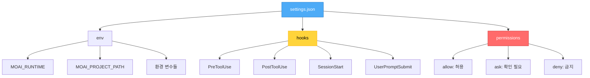
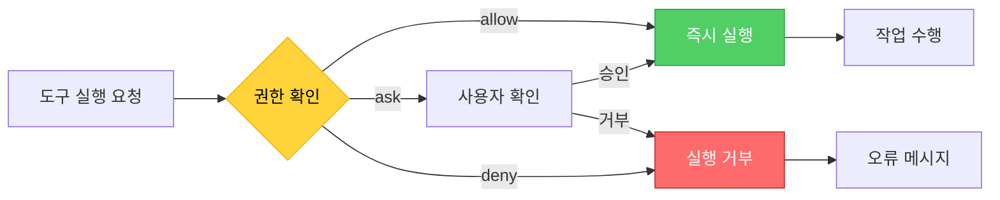
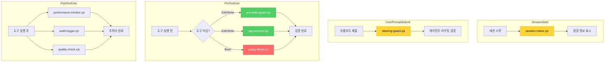
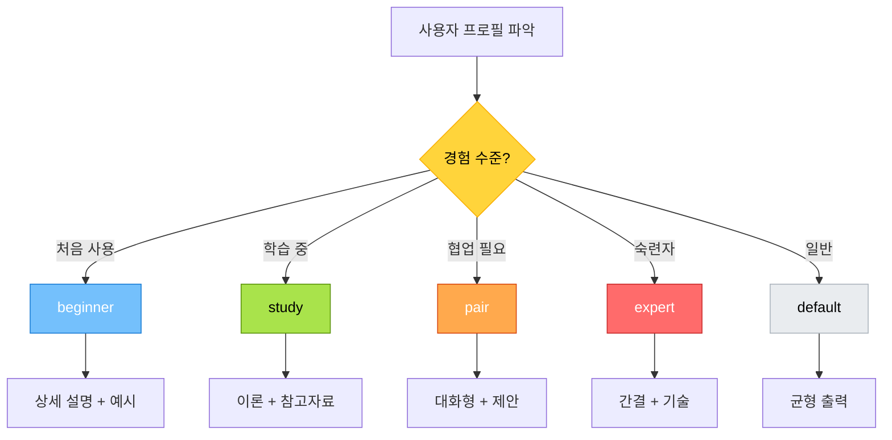
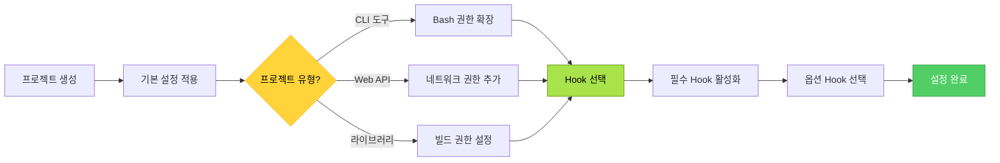
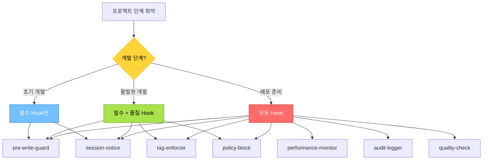

# cc-manager - Claude Code 설정 관리 에이전트

## 개요

cc-manager는 MoAI-ADK의 **Claude Code 설정 중앙 제어탑** 역할을 담당하는 전문 에이전트입니다. settings.json 구조 최적화, 파일 권한 관리, Hook 시스템 구성, 출력 스타일 설정 등 Claude Code 환경 전반을 관리합니다.

### 역할과 책임

**핵심 역할**: Claude Code 설정 표준화 및 최적화

- .claude/settings.json 구조 설계 및 최적화
- 파일 접근 권한 관리 (allow/ask/deny)
- Hook 시스템 통합 및 활성화 (8개 Hook 관리)
- 출력 스타일 구성 (beginner/study/pair/expert/default)
- Statusline 설정 및 최적화
- 프로젝트별 맞춤 설정 워크플로우

### 3단계 워크플로우에서의 위치

```mermaid
graph TB
    subgraph "개발 준비 단계"
        A[프로젝트 초기화] -->|설정 생성| B[cc-manager 활성화]
        B --> C[설정 최적화]
    end

    subgraph "개발 실행 단계"
        C --> D[/moai:1-spec]
        D --> E[/moai:2-build]
        E --> F[/moai:3-sync]
    end

    subgraph "설정 조정 단계"
        F -->|필요시| G[@agent-cc-manager]
        G --> C
    end

    style B fill:#4dabf7,stroke:#1971c2,color:#fff
    style G fill:#4dabf7,stroke:#1971c2,color:#fff
```

**cc-manager 활성화 시점**:
- 프로젝트 초기화 직후
- Hook 시스템 추가/제거 필요 시
- 권한 정책 변경 필요 시
- 출력 스타일 최적화 필요 시

### 다른 에이전트와의 협력

- **설정 제공**:
  - 모든 에이전트: settings.json 기반 동작 규칙 준수
  - Hook 시스템: 8개 Hook 파일과 연동
- **독립 운영**: 온디맨드 방식으로 사용자 요청 시에만 활성화
- **설정 검증**: debug-helper와 협력하여 설정 무결성 검증

---

## 핵심 기능

### 1. settings.json 구조 관리

#### 표준 구조

```json
{
  "env": {
    "MOAI_RUNTIME": "typescript",
    "MOAI_PROJECT_PATH": "./project-name",
    "MOAI_AUTO_ROUTING": "true",
    "MOAI_PERFORMANCE_MONITORING": "true",
    "NODE_ENV": "development"
  },
  "hooks": {
    "PreToolUse": [...],
    "PostToolUse": [...],
    "SessionStart": [...],
    "UserPromptSubmit": [...]
  },
  "permissions": {
    "allow": [...],
    "ask": [...],
    "deny": [...],
    "defaultMode": "default"
  }
}
```

**구조 최적화 원칙**:
- env: 프로젝트 환경 변수 정의
- hooks: 4개 라이프사이클 Hook 설정
- permissions: 3단계 권한 정책 (allow/ask/deny)

#### 설정 계층 구조



### 2. 권한 관리 시스템

#### 3단계 권한 정책

**Allow (자동 허용)**:
```json
{
  "permissions": {
    "allow": [
      "Task",
      "Read",
      "Write",
      "Edit",
      "MultiEdit",
      "Grep",
      "Glob",
      "TodoWrite",
      "Bash(git:*)",
      "Bash(rg:*)",
      "Bash(npm:*)",
      "Bash(node:*)"
    ]
  }
}
```

**Ask (사용자 확인 필요)**:
```json
{
  "permissions": {
    "ask": [
      "Bash(git push:*)",
      "Bash(git merge:*)",
      "Bash(gh pr merge:*)",
      "Bash(npm install:*)",
      "Bash(rm:*)"
    ]
  }
}
```

**Deny (완전 금지)**:
```json
{
  "permissions": {
    "deny": [
      "Read(./.env)",
      "Read(./.env.*)",
      "Read(./secrets/**)",
      "Read(~/.ssh/**)",
      "Bash(sudo:*)",
      "Bash(rm -rf :*)",
      "Bash(chmod -R 777 :*)",
      "Bash(dd:*)"
    ]
  }
}
```

#### 권한 관리 워크플로우



**권한 조정 가이드**:
1. **프로젝트 초기**: 최소 권한으로 시작
2. **개발 중**: 필요에 따라 allow 확장
3. **배포 전**: 보안 강화를 위해 ask/deny 강화

### 3. Hook 시스템 통합

#### 8개 Hook 파일 구조

MoAI-ADK는 4개 라이프사이클에 8개 Hook 파일을 제공합니다:

**PreToolUse 단계** (3개 Hook):
1. `pre-write-guard.cjs` - 파일 쓰기 전 검증
2. `tag-enforcer.cjs` - @TAG 규칙 강제
3. `policy-block.cjs` - Bash 명령 정책 검증

**SessionStart 단계** (1개 Hook):
4. `session-notice.cjs` - 세션 시작 알림

**UserPromptSubmit 단계** (1개 Hook):
5. `steering-guard.cjs` - 사용자 프롬프트 검증

**PostToolUse 단계** (3개 Hook, 옵션):
6. `performance-monitor.cjs` - 성능 모니터링
7. `audit-logger.cjs` - 감사 로깅
8. `quality-check.cjs` - 품질 검사

#### Hook 설정 구조

```json
{
  "hooks": {
    "PreToolUse": [
      {
        "hooks": [
          {
            "command": "node $CLAUDE_PROJECT_DIR/.claude/hooks/moai/pre-write-guard.cjs",
            "type": "command"
          },
          {
            "command": "node $CLAUDE_PROJECT_DIR/.claude/hooks/moai/tag-enforcer.cjs",
            "type": "command"
          }
        ],
        "matcher": "Edit|Write|MultiEdit"
      },
      {
        "hooks": [
          {
            "command": "node $CLAUDE_PROJECT_DIR/.claude/hooks/moai/policy-block.cjs",
            "type": "command"
          }
        ],
        "matcher": "Bash"
      }
    ],
    "SessionStart": [
      {
        "hooks": [
          {
            "command": "node $CLAUDE_PROJECT_DIR/.claude/hooks/moai/session-notice.cjs",
            "type": "command"
          }
        ],
        "matcher": "*"
      }
    ],
    "UserPromptSubmit": [
      {
        "hooks": [
          {
            "command": "node $CLAUDE_PROJECT_DIR/.claude/hooks/moai/steering-guard.cjs",
            "type": "command"
          }
        ]
      }
    ]
  }
}
```

#### Hook 통합 아키텍처



### 4. 출력 스타일 설정

#### 5가지 출력 모드

**1. beginner (초심자 모드)**:
```json
{
  "outputStyle": {
    "mode": "beginner",
    "verbosity": "high",
    "explanations": true,
    "examples": true,
    "warnings": true
  }
}
```
- 상세한 설명 제공
- 각 단계별 예시 포함
- 경고 및 주의사항 강조

**2. study (학습 모드)**:
```json
{
  "outputStyle": {
    "mode": "study",
    "verbosity": "medium",
    "explanations": true,
    "theory": true,
    "references": true
  }
}
```
- 이론적 배경 설명
- 참고 자료 링크 제공
- 개념 이해 중심

**3. pair (페어 프로그래밍 모드)**:
```json
{
  "outputStyle": {
    "mode": "pair",
    "verbosity": "medium",
    "collaboration": true,
    "suggestions": true,
    "discussion": true
  }
}
```
- 협업 중심 대화
- 제안 및 토론 활성화
- 양방향 소통 강조

**4. expert (전문가 모드)**:
```json
{
  "outputStyle": {
    "mode": "expert",
    "verbosity": "low",
    "concise": true,
    "technical": true,
    "assumptions": "minimal"
  }
}
```
- 간결한 출력
- 기술적 세부사항 중심
- 불필요한 설명 최소화

**5. default (기본 모드)**:
```json
{
  "outputStyle": {
    "mode": "default",
    "verbosity": "medium",
    "balanced": true
  }
}
```
- 균형잡힌 출력
- 중간 수준 설명
- 범용적 사용

#### 출력 스타일 선택 플로우



### 5. Statusline 구성

#### Statusline 요소

```json
{
  "statusline": {
    "enabled": true,
    "format": "{mode} | {project} | {stage} | {tags}",
    "components": {
      "mode": "PROJECT_MODE",
      "project": "PROJECT_NAME",
      "stage": "CURRENT_STAGE",
      "tags": "TAG_COUNT"
    }
  }
}
```

**표시 정보**:
- 현재 모드 (Personal/Team)
- 프로젝트 이름
- 개발 단계 (1-spec/2-build/3-sync)
- TAG 카운트

---

## 사용 패턴

### 기본 사용법

```bash
# 전체 설정 최적화
@agent-cc-manager "Claude Code 설정 최적화"

# 권한 조정
@agent-cc-manager "파일 쓰기 권한 조정"
@agent-cc-manager "Bash 명령 ask 정책 추가"

# Hook 관리
@agent-cc-manager "pre-write-guard 훅 활성화"
@agent-cc-manager "모든 PostToolUse 훅 비활성화"

# 출력 스타일 변경
@agent-cc-manager "beginner 모드로 전환"
@agent-cc-manager "expert 모드 활성화"
```

### 프로젝트 초기화 시 설정

```bash
# 1. 프로젝트 생성 후 설정 확인
moai init my-project

# 2. cc-manager로 설정 검증
@agent-cc-manager "설정 구조 검증"

# 3. 필요시 권한 조정
@agent-cc-manager "개발에 필요한 Bash 명령 allow 추가"

# 4. Hook 활성화 확인
@agent-cc-manager "필수 Hook 활성화 상태 확인"
```

### Hook 추가/제거

```bash
# Hook 활성화
@agent-cc-manager "performance-monitor 훅 추가"
@agent-cc-manager "audit-logger 훅 활성화"

# Hook 비활성화
@agent-cc-manager "quality-check 훅 제거"
@agent-cc-manager "PreToolUse 훅 전체 비활성화"

# Hook 상태 확인
@agent-cc-manager "현재 활성화된 Hook 목록 보기"
```

---

## 설정 최적화 워크플로우

### 1. 초기 설정 최적화



### 2. 권한 정책 최적화

**단계별 권한 확장**:

**Phase 1: 개발 시작** (최소 권한)
```json
{
  "allow": ["Task", "Read", "Grep", "Glob"],
  "ask": ["Write", "Edit", "Bash(*)"],
  "deny": ["Read(.env)", "Bash(sudo:*)"]
}
```

**Phase 2: 활발한 개발** (필요 권한 확장)
```json
{
  "allow": ["Task", "Read", "Write", "Edit", "Grep", "Glob", "Bash(git:*)", "Bash(npm:*)"],
  "ask": ["Bash(git push:*)", "Bash(rm:*)"],
  "deny": ["Read(.env)", "Bash(sudo:*)"]
}
```

**Phase 3: 배포 준비** (보안 강화)
```json
{
  "allow": ["Task", "Read", "Grep", "Glob"],
  "ask": ["Write", "Edit", "Bash(git:*)", "Bash(npm:*)"],
  "deny": ["Read(.env)", "Read(./secrets/**)", "Bash(sudo:*)", "Bash(rm -rf :*)"]
}
```

### 3. Hook 최적화 전략



---

## 공통 설정 패턴

### 1. Personal 모드 설정

```json
{
  "env": {
    "MOAI_PROJECT_PATH": "./my-project",
    "PROJECT_MODE": "personal",
    "AUTO_CHECKPOINT": "true"
  },
  "hooks": {
    "PreToolUse": [
      {
        "hooks": [{"command": "node $CLAUDE_PROJECT_DIR/.claude/hooks/moai/pre-write-guard.cjs", "type": "command"}],
        "matcher": "Edit|Write"
      }
    ],
    "SessionStart": [
      {
        "hooks": [{"command": "node $CLAUDE_PROJECT_DIR/.claude/hooks/moai/session-notice.cjs", "type": "command"}],
        "matcher": "*"
      }
    ]
  },
  "permissions": {
    "allow": ["Task", "Read", "Write", "Edit", "Grep", "Glob", "TodoWrite", "Bash(git:*)"],
    "ask": ["Bash(git push:*)"],
    "deny": ["Read(.env)", "Bash(sudo:*)"]
  }
}
```

### 2. Team 모드 설정

```json
{
  "env": {
    "MOAI_PROJECT_PATH": "./team-project",
    "PROJECT_MODE": "team",
    "AUTO_PR": "true",
    "DRAFT_PR": "true"
  },
  "hooks": {
    "PreToolUse": [
      {
        "hooks": [
          {"command": "node $CLAUDE_PROJECT_DIR/.claude/hooks/moai/pre-write-guard.cjs", "type": "command"},
          {"command": "node $CLAUDE_PROJECT_DIR/.claude/hooks/moai/tag-enforcer.cjs", "type": "command"}
        ],
        "matcher": "Edit|Write|MultiEdit"
      },
      {
        "hooks": [{"command": "node $CLAUDE_PROJECT_DIR/.claude/hooks/moai/policy-block.cjs", "type": "command"}],
        "matcher": "Bash"
      }
    ],
    "SessionStart": [
      {
        "hooks": [{"command": "node $CLAUDE_PROJECT_DIR/.claude/hooks/moai/session-notice.cjs", "type": "command"}],
        "matcher": "*"
      }
    ],
    "UserPromptSubmit": [
      {
        "hooks": [{"command": "node $CLAUDE_PROJECT_DIR/.claude/hooks/moai/steering-guard.cjs", "type": "command"}]
      }
    ]
  },
  "permissions": {
    "allow": ["Task", "Read", "Write", "Edit", "MultiEdit", "Grep", "Glob", "TodoWrite", "Bash(git:*)", "Bash(gh pr:*)"],
    "ask": ["Bash(git push:*)", "Bash(git merge:*)", "Bash(gh pr merge:*)"],
    "deny": ["Read(.env)", "Read(./secrets/**)", "Bash(sudo:*)", "Bash(rm -rf :*)"]
  }
}
```

### 3. 보안 강화 설정

```json
{
  "permissions": {
    "allow": [
      "Task",
      "Read",
      "Grep",
      "Glob"
    ],
    "ask": [
      "Write",
      "Edit",
      "MultiEdit",
      "Bash(git:*)",
      "Bash(npm:*)",
      "Bash(node:*)"
    ],
    "deny": [
      "Read(./.env)",
      "Read(./.env.*)",
      "Read(./secrets/**)",
      "Read(~/.ssh/**)",
      "Read(~/.aws/**)",
      "Bash(sudo:*)",
      "Bash(rm -rf :*)",
      "Bash(chmod -R 777 :*)",
      "Bash(dd:*)",
      "Bash(mkfs:*)",
      "Bash(fdisk:*)"
    ]
  }
}
```

---

## 문제 해결

### 일반적인 설정 문제

#### 1. Hook이 실행되지 않음

**증상**:
```
Hook 'pre-write-guard.cjs' 실행 오류
```

**해결 방법**:
```bash
# 1. Hook 파일 존재 확인
ls -la .claude/hooks/moai/

# 2. Node.js 경로 확인
which node

# 3. Hook 파일 권한 확인
chmod +x .claude/hooks/moai/*.cjs

# 4. cc-manager로 재설정
@agent-cc-manager "Hook 시스템 재구성"
```

#### 2. 권한 거부 오류

**증상**:
```
Permission denied: Write operation blocked
```

**해결 방법**:
```bash
# 1. 현재 권한 정책 확인
@agent-cc-manager "현재 권한 설정 보기"

# 2. 필요한 권한 추가
@agent-cc-manager "Write 도구를 allow 목록에 추가"

# 3. 권한 정책 검증
@agent-debug-helper "권한 설정 검증"
```

#### 3. 환경 변수 인식 오류

**증상**:
```
MOAI_PROJECT_PATH not found
```

**해결 방법**:
```bash
# 1. settings.json의 env 섹션 확인
@agent-cc-manager "환경 변수 설정 확인"

# 2. 환경 변수 재설정
@agent-cc-manager "MOAI_PROJECT_PATH 환경 변수 설정"

# 3. 세션 재시작
# Claude Code 재시작 필요
```

### Hook 관련 문제

#### Hook 실행 순서 오류

**문제**: PreToolUse Hook이 잘못된 순서로 실행됨

**해결 방법**:
```json
{
  "hooks": {
    "PreToolUse": [
      {
        "hooks": [
          {"command": "node $CLAUDE_PROJECT_DIR/.claude/hooks/moai/pre-write-guard.cjs", "type": "command"},
          {"command": "node $CLAUDE_PROJECT_DIR/.claude/hooks/moai/tag-enforcer.cjs", "type": "command"}
        ],
        "matcher": "Edit|Write|MultiEdit"
      }
    ]
  }
}
```
**핵심**: hooks 배열 순서가 실행 순서를 결정합니다.

#### Hook 조건부 실행

**요구사항**: 특정 파일 패턴에만 Hook 실행

**해결 방법**:
```javascript
// pre-write-guard.cjs 내부에서 조건 확인
const filePath = process.env.CLAUDE_TOOL_FILE_PATH;

if (filePath.endsWith('.ts') || filePath.endsWith('.tsx')) {
  // TypeScript 파일에만 검증 수행
  performValidation();
}
```

---

## 고급 기능

### 1. 동적 권한 조정

```bash
# 개발 단계별 권한 자동 조정
@agent-cc-manager "개발 단계를 '초기'에서 '활발한 개발'로 전환"

# 결과: 권한 정책 자동 확장
```

### 2. Hook 조합 패턴

**패턴 1: 품질 게이트**
```json
{
  "hooks": {
    "PreToolUse": [
      {
        "hooks": [
          {"command": "node $CLAUDE_PROJECT_DIR/.claude/hooks/moai/pre-write-guard.cjs", "type": "command"},
          {"command": "node $CLAUDE_PROJECT_DIR/.claude/hooks/moai/tag-enforcer.cjs", "type": "command"}
        ],
        "matcher": "Edit|Write"
      }
    ],
    "PostToolUse": [
      {
        "hooks": [
          {"command": "node $CLAUDE_PROJECT_DIR/.claude/hooks/moai/quality-check.cjs", "type": "command"}
        ],
        "matcher": "Edit|Write"
      }
    ]
  }
}
```

**패턴 2: 보안 강화**
```json
{
  "hooks": {
    "PreToolUse": [
      {
        "hooks": [
          {"command": "node $CLAUDE_PROJECT_DIR/.claude/hooks/moai/policy-block.cjs", "type": "command"}
        ],
        "matcher": "Bash"
      }
    ],
    "PostToolUse": [
      {
        "hooks": [
          {"command": "node $CLAUDE_PROJECT_DIR/.claude/hooks/moai/audit-logger.cjs", "type": "command"}
        ],
        "matcher": "Bash"
      }
    ]
  }
}
```

### 3. 프로젝트별 맞춤 설정

```bash
# CLI 도구 프로젝트
@agent-cc-manager "CLI 도구에 최적화된 설정 적용"

# Web API 프로젝트
@agent-cc-manager "Web API 프로젝트 설정 적용"

# 라이브러리 프로젝트
@agent-cc-manager "라이브러리 빌드 설정 최적화"
```

---

## 베스트 프랙티스

### 설정 관리

1. **버전 관리**: settings.json을 Git에 포함하여 팀 공유
2. **로컬 오버라이드**: settings.local.json으로 개인 설정 분리
3. **문서화**: 설정 변경 이유를 주석으로 명시
4. **주기적 검증**: debug-helper로 설정 무결성 확인

### Hook 사용

1. **필수 Hook만 활성화**: 성능을 위해 불필요한 Hook 비활성화
2. **Hook 순서 최적화**: 빠른 검증을 먼저 실행
3. **에러 핸들링**: Hook 실패 시 적절한 오류 메시지 제공
4. **조건부 실행**: 파일 패턴 기반 선택적 Hook 실행

### 권한 정책

1. **최소 권한 원칙**: 필요한 최소한의 권한만 부여
2. **단계적 확장**: 필요시 점진적으로 권한 확대
3. **보안 우선**: 민감한 파일은 항상 deny 목록에
4. **ask 활용**: 위험한 작업은 사용자 확인 필수

---

## 관련 문서

- [Hook 시스템 상세 가이드](../advanced/hooks-detailed.md) - 8개 Hook 파일 상세 설명
- [debug-helper 가이드](./debug-helper.md) - 설정 검증 및 문제 해결
- [프로젝트 초기화 가이드](../../getting-started/quick-start.md) - 초기 설정 과정

---

## 요약

cc-manager는 Claude Code 설정의 중앙 제어탑으로서:

- **settings.json 최적화**: 구조화된 설정 관리
- **권한 관리**: 3단계 정책 (allow/ask/deny)
- **Hook 통합**: 8개 Hook 파일 관리
- **출력 스타일**: 5가지 모드 지원
- **프로젝트 맞춤**: 유형별 최적화 설정

온디맨드 방식으로 필요시에만 호출하여 프로젝트 설정을 최적화합니다.

```bash
# 시작하기
@agent-cc-manager "Claude Code 설정 최적화"
```