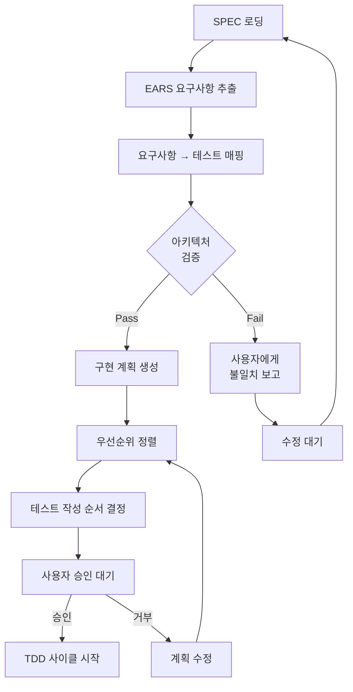
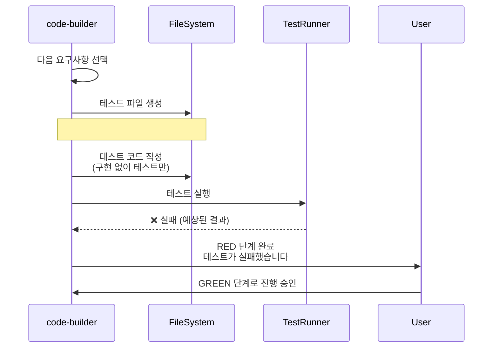
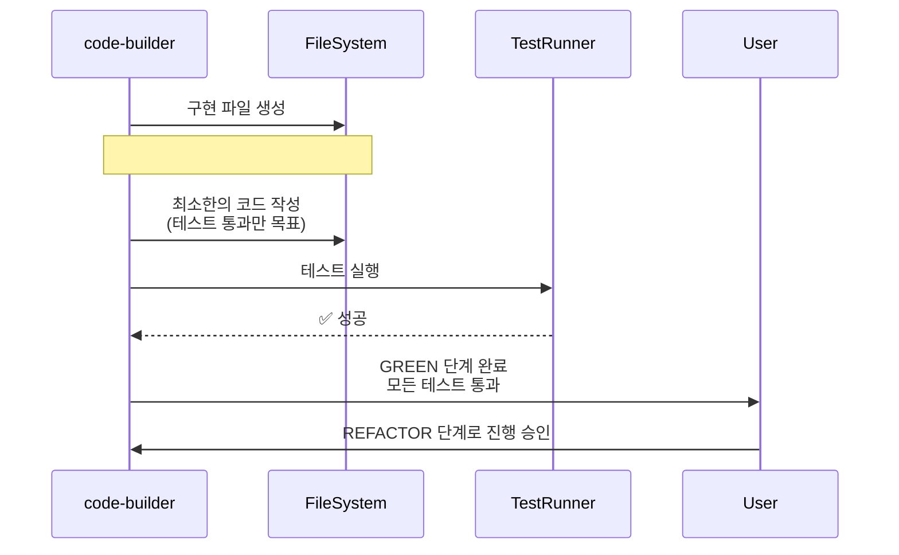
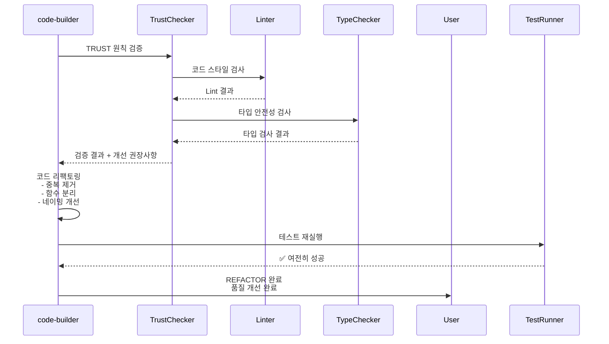
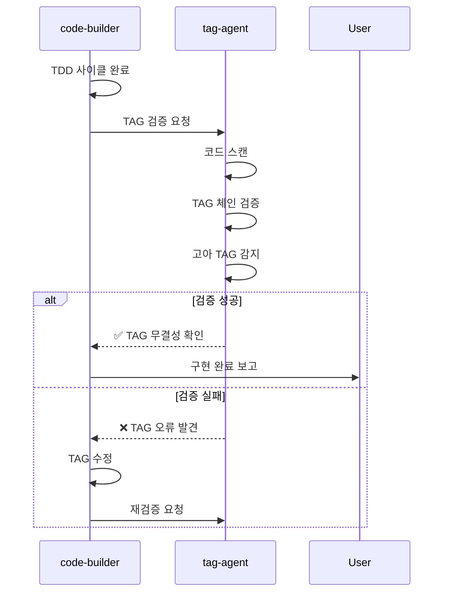
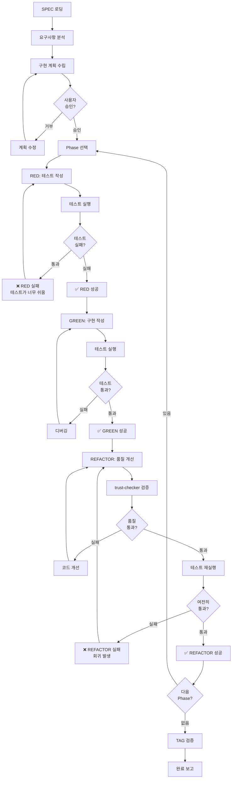

# code-builder - TDD 구현 전담 에이전트

## 개요

code-builder는 MoAI-ADK의 3단계 워크플로우 중 **2단계(/moai:2-build)**를 담당하는 핵심 에이전트입니다. SPEC 기반 Test-Driven Development (TDD) 방법론을 엄격히 따르며, RED-GREEN-REFACTOR 사이클을 자동화하여 고품질 코드를 생성합니다.

### 역할과 책임

**핵심 역할**: 테스트 없이는 구현 없음 (No Test, No Code) 원칙 구현

code-builder의 주요 책임은 다음과 같습니다. 첫째, SPEC 문서(spec.md, plan.md, acceptance.md)를 분석하여 구현 계획을 수립합니다. 이 과정에서 요구사항을 기술적 작업으로 변환하고, 아키텍처 설계를 검증하며, 기술 스택에 최적화된 도구를 선택합니다. 둘째, TDD 사이클을 엄격히 준수하여 코드를 생성합니다. RED 단계에서 실패하는 테스트를 작성하고, GREEN 단계에서 최소한의 코드로 테스트를 통과시키며, REFACTOR 단계에서 코드 품질을 개선합니다. 셋째, 언어별 최적 도구를 자동 선택하여 사용합니다. Python 프로젝트에서는 pytest와 mypy를, TypeScript에서는 Vitest와 Biome를, Go에서는 go test와 golint를 사용합니다. 넷째, @TAG 시스템을 통해 코드와 SPEC의 추적성을 유지합니다. 모든 구현 파일과 테스트 파일에 @CODE, @TEST, @CODE 서브카테고리 (API, UI, DATA 등) TAG를 명시하여 요구사항까지의 추적 경로를 명확히 합니다.

code-builder는 **점진적 구현** 전략을 사용합니다. 전체 기능을 한 번에 구현하는 대신, 작은 단위로 나누어 각 단위마다 TDD 사이클을 완료합니다. 이는 실패 지점을 빠르게 식별하고, 리팩토링 안전성을 확보하며, 코드 리뷰를 용이하게 합니다. 예를 들어, "사용자 인증" 기능을 구현할 때, 1) 사용자 모델 정의 및 테스트, 2) 비밀번호 해싱 및 테스트, 3) 토큰 생성 및 테스트, 4) 인증 미들웨어 및 테스트, 5) 통합 테스트 순서로 점진적으로 구현합니다.

### 3단계 워크플로우에서의 위치

```mermaid
graph LR
    A[/moai:1-spec] -->|SPEC 생성| B[/moai:2-build]
    B -->|코드 구현| C[/moai:3-sync]
    C -->|문서 동기화| D[완료]

```

**code-builder 활성화 시점**: 사용자가 `/moai:2-build` 명령어를 실행하거나 SPEC 기반 구현이 필요한 시점

### 다른 에이전트와의 협력

**입력**:
- spec-builder가 생성한 SPEC 문서 (`.moai/specs/SPEC-XXX/`)
- 프로젝트 기술 스택 정보 (`.moai/project/tech.md`)
- 기존 코드베이스 (리팩토링 또는 확장 시)

**출력**:
- 테스트 파일 (`tests/**/*.test.ts`, `tests/**/*_test.py` 등)
- 구현 파일 (`src/**/*.ts`, `src/**/*.py` 등)
- @TAG가 포함된 코드 주석
- 테스트 커버리지 리포트

**연계**:
- spec-builder: SPEC 문서를 기반으로 구현 범위 결정
- tag-agent: @CODE, @TEST, @CODE TAG 생성 및 검증 요청
- trust-checker: 코드 품질 검증 및 TRUST 원칙 준수 확인
- doc-syncer: 구현 완료 후 문서 동기화 요청

---

## 핵심 기능

### 1. SPEC 분석 및 구현 계획

code-builder는 SPEC 문서를 다층적으로 분석하여 구현 계획을 수립합니다.

#### EARS 요구사항 매핑

SPEC의 EARS 요구사항을 테스트 케이스로 변환합니다.

**Ubiquitous Requirements → 기본 기능 테스트**:
- "시스템은 이메일/비밀번호 인증을 제공해야 한다" → `test_should_authenticate_with_email_and_password`

**Event-driven Requirements → 이벤트 기반 테스트**:
- "WHEN 로그인 실패 3회 시, 계정을 잠가야 한다" → `test_should_lock_account_after_three_failed_attempts`

**State-driven Requirements → 상태 기반 테스트**:
- "WHILE 사용자가 인증된 상태일 때, API 접근을 허용해야 한다" → `test_should_allow_api_access_when_authenticated`

**Constraints → 경계 조건 테스트**:
- "토큰 만료시간은 15분을 초과하지 않아야 한다" → `test_token_should_expire_within_15_minutes`

```typescript
// SPEC 분석 의사코드
interface RequirementMapping {
  requirement: string;
  type: 'ubiquitous' | 'event-driven' | 'state-driven' | 'constraint';
  testName: string;
  testDescription: string;
  priority: 'critical' | 'high' | 'medium' | 'low';
}

function analyzeSpec(specPath: string): RequirementMapping[] {
  const spec = parseMarkdown(specPath);
  const mappings: RequirementMapping[] = [];

  // EARS 섹션 파싱
  for (const section of ['Ubiquitous', 'Event-driven', 'State-driven', 'Constraints']) {
    const requirements = extractRequirements(spec, section);

    for (const req of requirements) {
      mappings.push({
        requirement: req.text,
        type: section.toLowerCase() as any,
        testName: generateTestName(req.text),
        testDescription: req.text,
        priority: determinePriority(req, section)
      });
    }
  }

  return mappings;
}
```

#### 아키텍처 설계 검증

SPEC의 설계 결정이 프로젝트 구조와 일치하는지 확인합니다.

**모듈 경계 검증**: SPEC에서 정의한 모듈이 `structure.md`의 아키텍처와 정렬되는지 확인합니다. 예를 들어, SPEC에서 "인증 서비스 모듈"을 언급했다면, `src/auth/` 디렉토리가 존재하는지 확인합니다.

**의존성 검증**: 필요한 외부 라이브러리가 `package.json`, `requirements.txt`, `go.mod` 등에 선언되어 있는지 확인합니다. 누락된 경우 사용자에게 설치를 권장합니다.

**네이밍 규칙 검증**: 프로젝트의 코딩 스타일(camelCase, snake_case 등)을 자동 감지하여 일관된 네이밍을 적용합니다.



#### 구현 순서 결정

의존성 그래프를 분석하여 최적의 구현 순서를 결정합니다.

**Bottom-Up 전략**: 의존성이 없는 기본 유틸리티부터 구현하고, 상위 레이어로 진행합니다.
- 1단계: 데이터 모델 (`User`, `Token` 클래스)
- 2단계: 비즈니스 로직 (`PasswordHasher`, `TokenGenerator`)
- 3단계: 서비스 레이어 (`AuthenticationService`)
- 4단계: API 레이어 (`AuthController`)
- 5단계: 통합 테스트

```typescript
interface 구현Plan {
  phase: number;
  name: string;
  dependencies: string[];
  estimatedTests: number;
  files: {
    test: string;
    implementation: string;
  };
  tags: string[];
}

function build구현Plan(mappings: RequirementMapping[]): 구현Plan[] {
  const graph = buildDependencyGraph(mappings);
  const sorted = topologicalSort(graph);

  return sorted.map((node, index) => ({
    phase: index + 1,
    name: node.name,
    dependencies: node.dependencies,
    estimatedTests: node.requirements.length,
    files: {
      test: generateTestFilePath(node),
      implementation: generateImplFilePath(node)
    },
    tags: generateTags(node)
  }));
}
```

### 2. TDD 사이클 실행

code-builder는 RED-GREEN-REFACTOR 사이클을 엄격히 준수합니다.

#### RED: 실패하는 테스트 작성



**Python 예시 (pytest)**:
```python
# tests/auth/test_authentication_service.py
# @TEST:AUTH-001 | Chain: @SPEC:AUTH-001 ->  -> @CODE:AUTH-001 -> @TEST:AUTH-001
# Related: @CODE:AUTH-001, @CODE:AUTH-001:API, @CODE:AUTH-001:DATA

import pytest
from auth.service import AuthenticationService  # 아직 구현되지 않음
from auth.models import User

def test_should_authenticate_with_valid_credentials():
    """@TEST:AUTH-001: 유효한 자격증명으로 인증 성공"""
    # GIVEN
    service = AuthenticationService()
    username = "test@example.com"
    password = "SecurePassword123"

    # WHEN
    result = service.authenticate(username, password)

    # THEN
    assert result.is_authenticated is True
    assert result.user.email == username
    assert result.token is not None

def test_should_fail_with_invalid_password():
    """@TEST:AUTH-001: 잘못된 비밀번호로 인증 실패"""
    # GIVEN
    service = AuthenticationService()
    username = "test@example.com"
    password = "WrongPassword"

    # WHEN
    result = service.authenticate(username, password)

    # THEN
    assert result.is_authenticated is False
    assert result.error == "Invalid credentials"
```

**실행 결과 (RED)**:
```bash
$ pytest tests/auth/test_authentication_service.py

tests/auth/test_authentication_service.py::test_should_authenticate_with_valid_credentials FAILED
tests/auth/test_authentication_service.py::test_should_fail_with_invalid_password FAILED

ImportError: cannot import name 'AuthenticationService' from 'auth.service'
```

#### GREEN: 최소 구현으로 테스트 통과



**Python 구현 (GREEN)**:
```python
# src/auth/service.py
# @CODE:AUTH-001 | Chain: @SPEC:AUTH-001 ->  -> @CODE:AUTH-001 -> @TEST:AUTH-001
# Related: @CODE:AUTH-001:API, @CODE:AUTH-001:DATA

from typing import Optional
from dataclasses import dataclass
from auth.models import User
from auth.password import PasswordHasher
from auth.token import TokenGenerator

@dataclass
class AuthenticationResult:
    """@CODE:AUTH-001:API: 인증 결과 데이터 클래스"""
    is_authenticated: bool
    user: Optional[User] = None
    token: Optional[str] = None
    error: Optional[str] = None

class AuthenticationService:
    """@CODE:AUTH-001: 사용자 인증 서비스"""

    def __init__(self):
        self.password_hasher = PasswordHasher()
        self.token_generator = TokenGenerator()

    def authenticate(self, username: str, password: str) -> AuthenticationResult:
        """
        @CODE:AUTH-001:API: 사용자 인증 메서드

        Args:
            username: 사용자 이메일
            password: 비밀번호

        Returns:
            AuthenticationResult: 인증 결과
        """
        # @CODE:AUTH-001:DATA: 사용자 데이터 조회
        user = User.find_by_email(username)

        if not user:
            return AuthenticationResult(
                is_authenticated=False,
                error="Invalid credentials"
            )

        # 비밀번호 검증
        if not self.password_hasher.verify(password, user.password_hash):
            return AuthenticationResult(
                is_authenticated=False,
                error="Invalid credentials"
            )

        # 토큰 생성
        token = self.token_generator.generate(user.id)

        return AuthenticationResult(
            is_authenticated=True,
            user=user,
            token=token
        )
```

**실행 결과 (GREEN)**:
```bash
$ pytest tests/auth/test_authentication_service.py

tests/auth/test_authentication_service.py::test_should_authenticate_with_valid_credentials PASSED
tests/auth/test_authentication_service.py::test_should_fail_with_invalid_password PASSED

====== 2 passed in 0.12s ======
```

#### REFACTOR: 코드 품질 개선



**리팩토링 체크리스트**:

1. **TRUST 원칙 준수**:
   - ✅ **T**est First: 테스트가 먼저 작성됨
   - ✅ **R**eadable: 의도 드러내는 네이밍 사용
   - ✅ **U**nified: 타입 안전성 확보 (mypy 통과)
   - ✅ **S**ecured: 비밀번호는 해싱되어 저장
   - ✅ **T**rackable: @TAG 시스템으로 추적성 유지

2. **코드 제약 준수**:
   - ✅ 함수당 50 LOC 이하
   - ✅ 매개변수 5개 이하
   - ✅ 복잡도 10 이하
   - ✅ 테스트 커버리지 85% 이상

3. **리팩토링 적용**:
   - 중복 코드 제거 (DRY 원칙)
   - 함수 추출 (Extract Method)
   - 가드절 사용 (Early Return)
   - 매직 넘버 제거 (Named Constants)

```python
# 리팩토링 후
class AuthenticationService:
    """@CODE:AUTH-001: 사용자 인증 서비스"""

    # 매직 넘버를 상수로 추출
    MAX_LOGIN_ATTEMPTS = 3
    TOKEN_EXPIRY_MINUTES = 15

    def authenticate(self, username: str, password: str) -> AuthenticationResult:
        """@CODE:AUTH-001:API: 사용자 인증 메서드"""
        # 가드절 사용 (Early Return)
        user = self._find_user(username)
        if not user:
            return self._authentication_failed("Invalid credentials")

        if self._is_account_locked(user):
            return self._authentication_failed("Account locked")

        if not self._verify_password(password, user):
            self._increment_failed_attempts(user)
            return self._authentication_failed("Invalid credentials")

        # 성공 경로
        token = self._generate_token(user)
        self._reset_failed_attempts(user)

        return AuthenticationResult(
            is_authenticated=True,
            user=user,
            token=token
        )

    # Private 메서드로 세부 로직 추출
    def _find_user(self, username: str) -> Optional[User]:
        """@CODE:AUTH-001:DATA: 사용자 조회"""
        return User.find_by_email(username)

    def _verify_password(self, password: str, user: User) -> bool:
        """비밀번호 검증"""
        return self.password_hasher.verify(password, user.password_hash)

    def _authentication_failed(self, error: str) -> AuthenticationResult:
        """인증 실패 결과 생성"""
        return AuthenticationResult(is_authenticated=False, error=error)
```

### 3. 언어별 TDD 도구 지원

code-builder는 프로젝트의 주 언어를 자동 감지하여 최적의 도구를 선택합니다.

#### Python (pytest + mypy)

```bash
# 테스트 실행
pytest tests/ -v --cov=src --cov-report=html

# 타입 체크
mypy src/ --strict

# 코드 품질
ruff check src/
black src/ --check
```

**pytest fixture 자동 생성**:
```python
# tests/conftest.py
import pytest
from auth.service import AuthenticationService
from auth.models import User

@pytest.fixture
def auth_service():
    """인증 서비스 fixture"""
    return AuthenticationService()

@pytest.fixture
def test_user():
    """테스트 사용자 fixture"""
    return User(
        id="test-user-1",
        email="test@example.com",
        password_hash="$2b$12$..."
    )
```

#### TypeScript (Vitest + Biome)

```bash
# 테스트 실행
vitest run --coverage

# 타입 체크
tsc --noEmit

# 코드 품질
biome check src/
```

**Vitest 테스트 예시**:
```typescript
// tests/auth/authentication-service.test.ts
// @TEST:AUTH-001 | Chain: @SPEC:AUTH-001 ->  -> @CODE:AUTH-001 -> @TEST:AUTH-001

import { describe, it, expect, beforeEach } from 'vitest';
import { AuthenticationService } from '@/auth/service';
import type { User } from '@/auth/models';

describe('AuthenticationService', () => {
  let authService: AuthenticationService;

  beforeEach(() => {
    authService = new AuthenticationService();
  });

  it('should authenticate with valid credentials', async () => {
    // GIVEN
    const username = 'test@example.com';
    const password = 'SecurePassword123';

    // WHEN
    const result = await authService.authenticate(username, password);

    // THEN
    expect(result.isAuthenticated).toBe(true);
    expect(result.user?.email).toBe(username);
    expect(result.token).toBeDefined();
  });

  it('should fail with invalid password', async () => {
    // GIVEN
    const username = 'test@example.com';
    const password = 'WrongPassword';

    // WHEN
    const result = await authService.authenticate(username, password);

    // THEN
    expect(result.isAuthenticated).toBe(false);
    expect(result.error).toBe('Invalid credentials');
  });
});
```

#### Go (go test + golint)

```bash
# 테스트 실행
go test ./... -v -cover -coverprofile=coverage.out

# 코드 품질
golangci-lint run ./...
```

**Go 테스트 예시**:
```go
// tests/auth/authentication_service_test.go
// @TEST:AUTH-001 | Chain: @SPEC:AUTH-001 ->  -> @CODE:AUTH-001 -> @TEST:AUTH-001

package auth_test

import (
    "testing"
    "github.com/stretchr/testify/assert"
    "myproject/auth"
)

func TestAuthenticationService_Authenticate_ValidCredentials(t *testing.T) {
    // GIVEN
    service := auth.NewAuthenticationService()
    username := "test@example.com"
    password := "SecurePassword123"

    // WHEN
    result, err := service.Authenticate(username, password)

    // THEN
    assert.NoError(t, err)
    assert.True(t, result.IsAuthenticated)
    assert.Equal(t, username, result.User.Email)
    assert.NotEmpty(t, result.Token)
}

func TestAuthenticationService_Authenticate_InvalidPassword(t *testing.T) {
    // GIVEN
    service := auth.NewAuthenticationService()
    username := "test@example.com"
    password := "WrongPassword"

    // WHEN
    result, err := service.Authenticate(username, password)

    // THEN
    assert.Error(t, err)
    assert.False(t, result.IsAuthenticated)
    assert.Equal(t, "Invalid credentials", err.Error())
}
```

#### Java (JUnit 5 + Maven)

```bash
# 테스트 실행
mvn test -Dtest=AuthenticationServiceTest

# 코드 품질
mvn checkstyle:check
mvn spotbugs:check
```

**JUnit 5 테스트 예시**:
```java
// src/test/java/com/example/auth/AuthenticationServiceTest.java
// @TEST:AUTH-001 | Chain: @SPEC:AUTH-001 ->  -> @CODE:AUTH-001 -> @TEST:AUTH-001

package com.example.auth;

import org.junit.jupiter.api.BeforeEach;
import org.junit.jupiter.api.Test;
import org.junit.jupiter.api.DisplayName;
import static org.junit.jupiter.api.Assertions.*;

class AuthenticationServiceTest {
    private AuthenticationService authService;

    BeforeEach
    void setUp() {
        authService = new AuthenticationService();
    }

    Test
    DisplayName("Should authenticate with valid credentials")
    void shouldAuthenticateWithValidCredentials() {
        // GIVEN
        String username = "test@example.com";
        String password = "SecurePassword123";

        // WHEN
        AuthenticationResult result = authService.authenticate(username, password);

        // THEN
        assertTrue(result.isAuthenticated());
        assertEquals(username, result.getUser().getEmail());
        assertNotNull(result.getToken());
    }

    Test
    DisplayName("Should fail with invalid password")
    void shouldFailWithInvalidPassword() {
        // GIVEN
        String username = "test@example.com";
        String password = "WrongPassword";

        // WHEN
        AuthenticationResult result = authService.authenticate(username, password);

        // THEN
        assertFalse(result.isAuthenticated());
        assertEquals("Invalid credentials", result.getError());
    }
}
```

### 4. @TAG 통합

모든 구현 파일과 테스트 파일에 @TAG를 명시하여 추적성을 보장합니다.

#### TAG BLOCK 자동 생성

```typescript
// code-builder의 TAG BLOCK 생성 로직
function generateTagBlock(spec: SpecDocument, fileType: 'implementation' | 'test'): string {
  const domainId = spec.metadata.id.replace('SPEC-', ''); // SPEC-AUTH-001 -> AUTH-001

  const primaryChain = `@SPEC:${domainId} -> @SPEC:${domainId} -> @CODE:${domainId} -> @TEST:${domainId}`;

  const relatedTags = [];
  if (fileType === 'implementation') {
    relatedTags.push(`@CODE:${domainId}`);
    if (spec.hasAPI) relatedTags.push(`@CODE:${domainId}`);
    if (spec.hasUI) relatedTags.push(`@CODE:${domainId}`);
    if (spec.hasData) relatedTags.push(`@CODE:${domainId}`);
  }

  return `
# @${fileType === 'test' ? 'TEST' : 'FEATURE'}:${domainId} | Chain: ${primaryChain}
# Related: ${relatedTags.join(', ')}
  `.trim();
}
```

#### TAG 검증 자동 실행

TDD 사이클 완료 후 tag-agent를 호출하여 TAG 무결성을 검증합니다.



---

## 사용법

### 기본 사용

#### SPEC 기반 자동 구현

```bash
# SPEC 지정 후 구현
/moai:2-build SPEC-AUTH-001

# 실행 과정:
# 1. SPEC 문서 로딩 (.moai/specs/SPEC-AUTH-001/)
# 2. EARS 요구사항 분석
# 3. 구현 계획 수립
# 4. 사용자 승인 대기
# 5. TDD 사이클 실행 (RED → GREEN → REFACTOR)
# 6. TAG 검증
# 7. 완료 보고
```

**출력 예시**:
```
🔍 SPEC-AUTH-001 분석 중...

📋 구현 계획:
━━━━━━━━━━━━━━━━━━━━━━━━━━━━━━━━━━━━━━━━━
Phase 1: 데이터 모델
  - User 모델 정의
  - 테스트: 3개
  - 파일: src/auth/models.py, tests/auth/test_models.py

Phase 2: 비즈니스 로직
  - PasswordHasher 구현
  - TokenGenerator 구현
  - 테스트: 5개
  - 파일: src/auth/password.py, src/auth/token.py

Phase 3: 서비스 레이어
  - AuthenticationService 구현
  - 테스트: 8개
  - 파일: src/auth/service.py, tests/auth/test_service.py

Phase 4: API 레이어
  - AuthController 구현
  - 테스트: 6개
  - 파일: src/auth/controller.py, tests/auth/test_controller.py

Phase 5: 통합 테스트
  - End-to-end 인증 플로우
  - 테스트: 4개
  - 파일: tests/integration/test_auth_flow.py

━━━━━━━━━━━━━━━━━━━━━━━━━━━━━━━━━━━━━━━━━
총 26개 테스트 예상

이 계획으로 진행하시겠습니까? (y/n):
```

#### 점진적 구현 (Phase별)

```bash
# 특정 Phase만 구현
/moai:2-build SPEC-AUTH-001 --phase 1

# Phase 1 완료 후 Phase 2 진행
/moai:2-build SPEC-AUTH-001 --phase 2 --continue
```

### 고급 사용

#### 기존 코드 리팩토링

```bash
# 기존 코드를 TDD로 리팩토링
/moai:2-build --refactor src/auth/legacy_auth.py

# 실행 과정:
# 1. 기존 코드 분석
# 2. 현재 동작을 보존하는 테스트 생성 (Characterization Tests)
# 3. 리팩토링 계획 수립
# 4. TDD 사이클로 리팩토링
```

#### 테스트 커버리지 향상

```bash
# 커버리지가 낮은 파일 개선
/moai:2-build --improve-coverage src/auth/service.py

# 실행 과정:
# 1. 현재 커버리지 측정 (예: 65%)
# 2. 커버되지 않은 브랜치 식별
# 3. 누락된 테스트 케이스 생성
# 4. 목표 커버리지 달성 (기본: 85%)
```

#### 대화형 모드

```bash
# 단계별로 승인받으며 진행
/moai:2-build SPEC-AUTH-001 --interactive

# 각 단계마다 다음 질문에 답변:
# - RED: "이 테스트가 요구사항을 충분히 검증합니까? (y/n/수정)"
# - GREEN: "이 구현이 테스트를 통과했습니다. 계속하시겠습니까? (y/n/검토)"
# - REFACTOR: "리팩토링 제안: [목록]. 적용하시겠습니까? (y/n/선택)"
```

### 옵션 및 플래그

| 옵션 | 설명 | 예시 |
|------|------|------|
| `--phase <N>` | 특정 Phase만 구현 | `--phase 1` |
| `--continue` | 이전 Phase에서 이어서 진행 | `--continue` |
| `--refactor <file>` | 기존 코드 리팩토링 | `--refactor src/auth.py` |
| `--improve-coverage <file>` | 커버리지 향상 | `--improve-coverage src/auth.py` |
| `--interactive` | 대화형 모드 | `--interactive` |
| `--skip-refactor` | REFACTOR 단계 건너뛰기 | `--skip-refactor` |
| `--target-coverage <N>` | 목표 커버리지 설정 | `--target-coverage 90` |
| `--language <lang>` | 언어 명시 (자동 감지 무시) | `--language python` |

### 실전 시나리오

#### 시나리오 1: 신규 기능 구현 (Full TDD)

```bash
# 1. SPEC 확인
cat .moai/specs/SPEC-AUTH-001/spec.md

# 2. 구현 시작
/moai:2-build SPEC-AUTH-001 --interactive

# 대화형 진행:
> Phase 1/5: 데이터 모델
> RED: tests/auth/test_models.py 생성 완료
> 테스트가 실패했습니다 (예상된 결과):
>   - test_user_model_creation FAILED
>   - test_user_find_by_email FAILED
>
> GREEN 단계로 진행하시겠습니까? (y/n): y
>
> GREEN: src/auth/models.py 생성 완료
> 모든 테스트가 통과했습니다 ✅
>
> REFACTOR: 코드 품질 개선 제안
>   1. User 클래스에 __repr__ 메서드 추가
>   2. email 검증 로직을 별도 함수로 분리
>   3. password_hash 필드에 타입 힌트 추가
>
> 리팩토링을 적용하시겠습니까? (y/n/선택): y
>
> REFACTOR 완료 ✨
> 테스트 재실행: 모두 통과 ✅
>
> Phase 1 완료! Phase 2로 진행하시겠습니까? (y/n): y
```

#### 시나리오 2: 레거시 코드 개선

```bash
# 기존 인증 코드가 테스트 없이 작성됨
/moai:2-build --refactor src/auth/old_auth.py --interactive

# 실행 과정:
> 📊 기존 코드 분석 중...
> - 함수: 8개
> - 복잡도: 평균 15 (높음 ⚠️)
> - 테스트 커버리지: 0%
>
> 📝 Characterization Test 생성 중...
> 기존 동작을 보존하는 테스트 12개를 생성했습니다.
>
> ✅ 모든 Characterization Test 통과
> 이제 안전하게 리팩토링할 수 있습니다.
>
> 🔧 리팩토링 계획:
> 1. authenticate() 함수 분리 (복잡도 15 -> 5)
> 2. 중복 코드 제거 (3곳에서 반복)
> 3. 가드절 적용 (중첩 if 제거)
> 4. 타입 힌트 추가 (mypy 호환)
>
> 리팩토링을 시작하시겠습니까? (y/n): y
>
> [1/4] authenticate() 함수 분리 중...
> ✅ 테스트 통과
>
> [2/4] 중복 코드 제거 중...
> ✅ 테스트 통과
>
> [3/4] 가드절 적용 중...
> ✅ 테스트 통과
>
> [4/4] 타입 힌트 추가 중...
> ✅ 테스트 통과
> ✅ mypy 검사 통과
>
> 🎉 리팩토링 완료!
> - 복잡도: 15 -> 5 (67% 개선)
> - 테스트 커버리지: 0% -> 92%
> - 코드 라인: 250 -> 180 (28% 감소)
```

#### 시나리오 3: 버그 수정 (Test-First)

```bash
# 버그 리포트: 로그인 3회 실패 후에도 계정이 잠기지 않음
/moai:2-build --fix-bug "로그인 3회 실패 시 계정 잠금 미동작"

# 실행 과정:
> 🐛 버그 재현 테스트 작성 중...

# tests/auth/test_account_lock_bug.py 생성
def test_should_lock_account_after_three_failed_attempts():
    """버그 재현: 3회 실패 후 계정 잠금"""
    service = AuthenticationService()

    # 3회 실패
    for _ in range(3):
        service.authenticate("test@example.com", "wrong_password")

    # 4번째 시도
    result = service.authenticate("test@example.com", "correct_password")

    # 예상: 계정 잠김으로 실패해야 함
    assert result.is_authenticated is False
    assert result.error == "Account locked"

> ❌ 테스트 실패 (버그 확인됨)
>
> 🔍 원인 분석 중...
> - authenticate() 메서드에 failed_attempts 카운터 누락
> - Account lock 로직 구현 안 됨
>
> 🛠️  버그 수정 계획:
> 1. User 모델에 failed_attempts 필드 추가
> 2. authenticate() 실패 시 카운터 증가
> 3. 3회 실패 시 is_locked 플래그 설정
> 4. is_locked 체크 로직 추가
>
> 수정을 진행하시겠습니까? (y/n): y
>
> [수정 중...]
>
> ✅ 테스트 통과
> ✅ 기존 테스트 모두 통과 (회귀 없음)
>
> 🎉 버그 수정 완료!
```

---

## 워크플로우

### TDD 사이클 상세 흐름



### 입력 데이터

**SPEC 문서**:
- `spec.md`: EARS 요구사항, TAG BLOCK
- `plan.md`: 구현 계획, 아키텍처 설계
- `acceptance.md`: Given-When-Then 시나리오

**프로젝트 컨텍스트**:
- `.moai/project/structure.md`: 모듈 구조
- `.moai/project/tech.md`: 기술 스택, 품질 게이트
- `.moai/config.json`: 프로젝트 설정

**기존 코드베이스** (리팩토링 시):
- 현재 구현 파일
- 기존 테스트 (있는 경우)

### 출력 결과

#### 성공 시

```
✅ SPEC-AUTH-001 구현 완료

📊 구현 통계:
- Phase: 5/5 완료
- 테스트: 26개 작성 (모두 통과)
- 커버리지: 94% (목표: 85%)
- 파일: 8개 생성/수정

📁 생성된 파일:
  tests/auth/
    test_models.py (3 tests)
    test_password.py (2 tests)
    test_token.py (3 tests)
    test_service.py (8 tests)
    test_controller.py (6 tests)
    test_auth_flow.py (4 tests)

  src/auth/
    models.py (@CODE:AUTH-001:DATA)
    password.py (@CODE:AUTH-001)
    token.py (@CODE:AUTH-001)
    service.py (@CODE:AUTH-001, @CODE:AUTH-001:API)
    controller.py (@CODE:AUTH-001:API)

✅ TAG 검증 완료
  - TAG 체인 완전: @SPEC → @TEST → @CODE → @DOC
  - @CODE 서브카테고리: 5개 (FEATURE, API, DATA)
  - 고아 TAG 없음

🎯 TRUST 원칙 준수:
  ✅ Test First: 26개 테스트 우선 작성
  ✅ Readable: Lint 통과 (0 issues)
  ✅ Unified: Type check 통과 (mypy strict)
  ✅ Secured: 비밀번호 해싱, 토큰 암호화 적용
  ✅ Trackable: @TAG 시스템 완전 적용

🚀 다음 단계:
  1. 코드 리뷰 요청: git push origin feature/spec-auth-001
  2. 문서 동기화: /moai:3-sync
  3. 다음 SPEC 구현: /moai:1-spec
```

#### 실패 시

```
❌ 구현 실패: SPEC-AUTH-001

📊 진행 상황:
- Phase: 2/5 (Phase 3에서 중단)
- 테스트: 11/26 작성
- 커버리지: 45% (목표 미달)

❌ 실패 원인:
  Phase 3: 서비스 레이어 구현 중 오류 발생
  파일: src/auth/service.py
  오류: PasswordHasher 모듈을 찾을 수 없음

💡 해결 방법:
  1. PasswordHasher 의존성 설치:
     pip install bcrypt

  2. 또는 Phase 2 재확인:
     /moai:2-build SPEC-AUTH-001 --phase 2 --verify

  3. 의존성 문제 해결 후 재시도:
     /moai:2-build SPEC-AUTH-001 --phase 3 --continue

🔄 롤백 옵션:
  모든 변경사항 되돌리기:
    git checkout -- src/auth/ tests/auth/
```

---

## 커스터마이징

### 설정 옵션

code-builder는 `.moai/config.json`에서 다음 옵션을 지원합니다:

```json
{
  "code_builder": {
    "tdd_strict": true,
    "target_coverage": 85,
    "max_function_lines": 50,
    "max_complexity": 10,
    "auto_refactor": false,
    "interactive_mode": true,
    "language_overrides": {
      "python": {
        "test_framework": "pytest",
        "linter": "ruff",
        "formatter": "black",
        "type_checker": "mypy"
      },
      "typescript": {
        "test_framework": "vitest",
        "linter": "biome",
        "type_checker": "tsc"
      }
    },
    "test_naming": {
      "python": "test_should_{description}",
      "typescript": "should{Description}",
      "go": "Test{Component}_{Scenario}",
      "java": "should{Description}"
    }
  }
}
```

| 설정 | 설명 | 기본값 |
|------|------|--------|
| `tdd_strict` | TDD 사이클 강제 (테스트 먼저 작성) | `true` |
| `target_coverage` | 목표 테스트 커버리지 (%) | `85` |
| `max_function_lines` | 함수당 최대 라인 수 | `50` |
| `max_complexity` | 순환 복잡도 임계값 | `10` |
| `auto_refactor` | 자동 리팩토링 적용 | `false` |
| `interactive_mode` | 대화형 모드 기본 활성화 | `true` |

### 커스텀 테스트 템플릿

프로젝트별로 테스트 템플릿을 커스터마이징할 수 있습니다.

**템플릿 위치**: `.moai/templates/tests/{language}/test_template.{ext}`

**Python 템플릿 예시**:
```python
# .moai/templates/tests/python/test_template.py
"""
{{TEST_TAG}} | Chain: {{CHAIN}}
Related: {{RELATED_TAGS}}
"""

import pytest
from {{MODULE_PATH}} import {{CLASS_NAME}}

@pytest.fixture
def {{FIXTURE_NAME}}():
    """{{FIXTURE_DESCRIPTION}}"""
    return {{CLASS_NAME}}()

class Test{{CLASS_NAME}}:
    """{{TEST_DESCRIPTION}}"""

    def test_should_{{TEST_CASE}}(self, {{FIXTURE_NAME}}):
        """{{TEST_TAG}}: {{TEST_DESCRIPTION}}"""
        # GIVEN
        {{GIVEN_SETUP}}

        # WHEN
        {{WHEN_ACTION}}

        # THEN
        {{THEN_ASSERTION}}
```

### 확장 방법

#### 새로운 언어 지원 추가

```typescript
// .moai/scripts/code-builder.ts 확장
interface LanguageSupport {
  name: string;
  testFramework: string;
  testFileExtension: string;
  testFilePattern: string;
  runTestCommand: string;
  coverageCommand: string;
  linter: string;
  typeChecker?: string;
}

const rustSupport: LanguageSupport = {
  name: 'rust',
  testFramework: 'cargo test',
  testFileExtension: '.rs',
  testFilePattern: 'tests/**/*_test.rs',
  runTestCommand: 'cargo test',
  coverageCommand: 'cargo tarpaulin --out Html',
  linter: 'clippy',
  typeChecker: 'rustc'
};

// 언어 등록
languageRegistry.register(rustSupport);
```

#### 커스텀 리팩토링 규칙

```typescript
// .moai/scripts/custom-refactoring-rules.ts
import { RefactoringRule } from '@moai-adk/code-builder';

export const extractLongFunction: RefactoringRule = {
  name: 'extract-long-function',
  description: '50 LOC 초과 함수를 분리',
  matcher: (node) => node.type === 'FunctionDeclaration' && node.loc.lines > 50,
  refactor: (node) => {
    const extractedFunctions = splitFunctionByResponsibility(node);
    return extractedFunctions;
  }
};

export const removeNestedIfElse: RefactoringRule = {
  name: 'remove-nested-if-else',
  description: '중첩 if-else를 가드절로 변환',
  matcher: (node) => node.type === 'IfStatement' && getNestedDepth(node) > 2,
  refactor: (node) => {
    return convertToGuardClauses(node);
  }
};
```

---

## 문제 해결

### 일반적인 문제

#### 1. 테스트 실행 실패

**증상**: RED 단계에서 테스트가 예상과 다르게 실패함

**원인**:
- 테스트 프레임워크 미설치
- 의존성 버전 불일치
- 환경 변수 미설정

**해결**:
```bash
# 1. 시스템 진단 실행
moai doctor --advanced

# 2. 테스트 프레임워크 확인
# Python
pip list | grep pytest

# TypeScript
npm list vitest

# 3. 수동 테스트 실행으로 오류 확인
pytest tests/auth/test_models.py -v

# 4. 의존성 재설치
pip install -r requirements-dev.txt
```

#### 2. 커버리지 목표 미달

**증상**: "테스트 커버리지 65% (목표: 85%)" 경고

**원인**:
- 에러 핸들링 경로 미테스트
- 엣지 케이스 누락
- Private 메서드 미테스트

**해결**:
```bash
# 커버리지 리포트 확인
pytest --cov=src --cov-report=html
open htmlcov/index.html

# 커버되지 않은 라인 식별
pytest --cov=src --cov-report=term-missing

# code-builder로 커버리지 향상
/moai:2-build --improve-coverage src/auth/service.py --target-coverage 90
```

#### 3. 리팩토링 후 테스트 실패

**증상**: REFACTOR 단계에서 기존 테스트가 깨짐 (회귀)

**원인**:
- 리팩토링 중 동작 변경
- 테스트가 구현 세부사항에 의존

**해결**:
```bash
# 1. 변경 사항 확인
git diff src/auth/service.py

# 2. 실패한 테스트 로그 확인
pytest tests/auth/test_service.py -v --tb=long

# 3. 리팩토링 롤백
git checkout src/auth/service.py

# 4. 테스트 재검토 (구현 세부사항 의존 제거)
# Before (나쁜 예): 구현 세부사항 테스트
assert service._internal_cache == expected_cache

# After (좋은 예): 공개 API 테스트
assert service.get_user("id") == expected_user
```

#### 4. @TAG 검증 실패

**증상**: "고아 TAG 발견: @CODE:AUTH-001"

**원인**:
- TAG 체인 끊어짐
- 부모/자식 TAG 누락

**해결**:
```bash
# TAG 체인 시각화
@agent-tag-agent "AUTH-001 체인 확인"

# 출력:
# ❌ @CODE:AUTH-001 has no parent
# 💡 Add  as parent

# 수동 수정
# src/auth/service.py 파일 상단에 추가:
# @CODE:AUTH-001 | Chain: @SPEC:AUTH-001 ->  -> @CODE:AUTH-001 -> @TEST:AUTH-001

# 재검증
@agent-tag-agent "TAG 검증"
```

### 디버깅 팁

#### TDD 사이클 추적

```bash
# 상세 로깅 활성화
export MOAI_DEBUG=1
/moai:2-build SPEC-AUTH-001

# 로그 확인
cat .moai/logs/code-builder.log
```

#### 테스트 격리 문제

```python
# 테스트 간 상태 공유 방지
import pytest

@pytest.fixture(autouse=True)
def reset_database():
    """각 테스트 전후 데이터베이스 초기화"""
    yield
    db.session.rollback()
    db.drop_all()
    db.create_all()
```

#### 복잡도 측정

```bash
# Python
radon cc src/auth/service.py -a

# TypeScript
npx ts-complexity src/auth/service.ts

# Go
gocyclo -over 10 ./src/auth/
```

---

## 관련 문서 링크

### MoAI-ADK 공식 문서
- [3단계 워크플로우](/guide/workflow)
- [SPEC-First TDD](/guide/spec-first-tdd)
- [TRUST 원칙](/concepts/trust-principles)

### 에이전트 연계
- [spec-builder - SPEC 작성](/claude/agents/spec-builder)
- [doc-syncer - 문서 동기화](/claude/agents/doc-syncer)
- [tag-agent - TAG 관리](/claude/agents/tag-agent)
- [trust-checker - 품질 검증](/claude/agents/trust-checker)

### 고급 가이드
- [커스텀 리팩토링 규칙](/advanced/custom-refactoring)
- [언어별 TDD 가이드](/advanced/language-tdd-guides)
- [레거시 코드 개선](/advanced/legacy-refactoring)

### 실전 예제
- [웹 API TDD 예제](/examples/web-api-tdd)
- [React 컴포넌트 TDD](/examples/react-component-tdd)
- [CLI 도구 TDD](/examples/cli-tool-tdd)

---

## 요약

code-builder는 MoAI-ADK의 "테스트 없이는 구현 없음" 원칙을 구현하는 핵심 에이전트입니다. SPEC 기반 TDD 방법론, 언어별 최적 도구 지원, @TAG 추적성을 통해 고품질 코드를 자동 생성합니다.

### 핵심 특징
- RED-GREEN-REFACTOR 사이클 자동화
- 언어별 최적 도구 자동 선택 (Python, TypeScript, Go, Java, Rust 등)
- SPEC 요구사항 → 테스트 케이스 자동 매핑
- @TAG 시스템으로 완전한 추적성 유지
- TRUST 5원칙 강제 적용

### 다음 단계
TDD 구현 완료 후:
1. `/moai:3-sync` 실행 → doc-syncer가 문서 동기화
2. 코드 리뷰 및 PR 생성 → git-manager 활용
3. 반복: 다음 기능을 위한 `/moai:1-spec` 실행

**참고**: 모든 구현은 SPEC 기반으로 진행되며, 테스트 커버리지 85% 이상을 목표로 합니다.