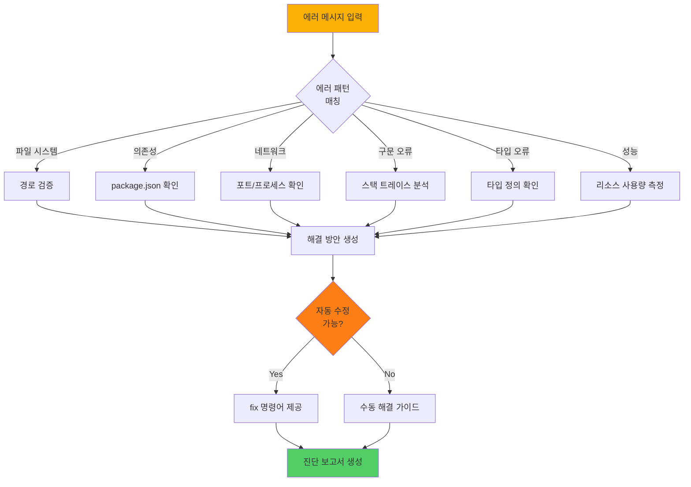
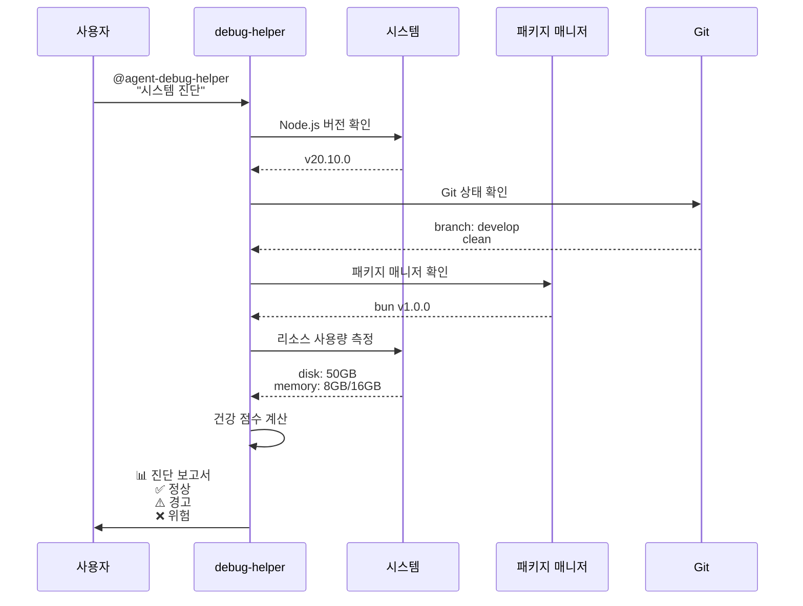
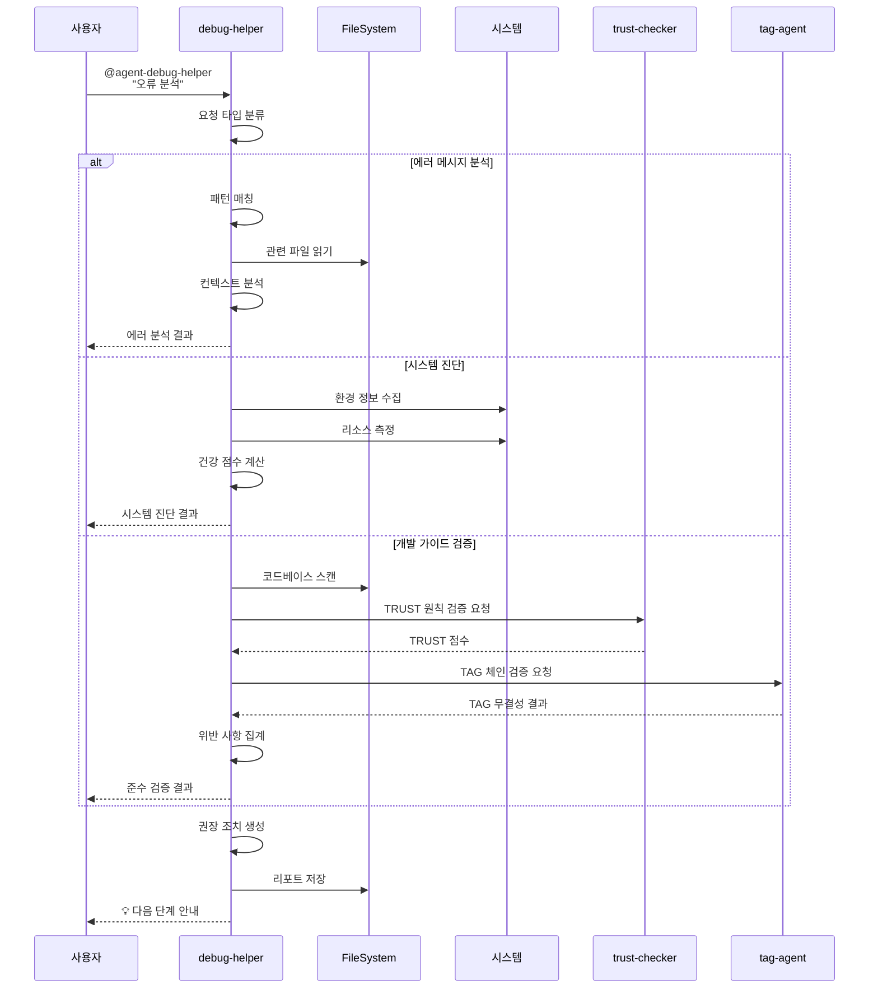

# debug-helper - 오류 분석 및 진단 전담 에이전트

## 개요

debug-helper는 MoAI-ADK의 **온디맨드 품질 보증 에이전트**입니다. 3단계 워크플로우와 별개로, 언제든 호출 가능하며 시스템 진단, 에러 분석, 개발 가이드 준수 검증을 자동화합니다.

### 역할과 책임

**핵심 역할**: 문제 발생 시 즉각 대응하는 개발 가이드 전문가

debug-helper는 세 가지 주요 책임을 수행합니다. 첫째, 에러 메시지와 로그를 분석하여 근본 원인을 식별하고 실행 가능한 해결 방안을 제시합니다. 둘째, 시스템 환경(Node.js, Git, 패키지 매니저, 디스크, 메모리)을 진단하여 개발 환경의 건강 상태를 확인합니다. 셋째, 개발 가이드(TRUST 원칙, @TAG 시스템, 코드 규칙)의 준수 여부를 검증하고 위반 사항을 보고합니다.

debug-helper는 **진단 전용 에이전트**로, 문제를 식별하고 해결 방안을 제시하지만, 실제 코드 수정이나 파일 생성은 수행하지 않습니다. 필요한 경우 적절한 에이전트(code-builder, doc-syncer, git-manager 등)를 추천합니다.

### 다른 에이전트와의 협력

**입력**:
- 에러 메시지 (컴파일 오류, 런타임 오류, Git 오류 등)
- 로그 파일 경로 (`.moai/logs/`, 시스템 로그)
- 진단 요청 (시스템 진단, TRUST 검증, TAG 체인 검증)

**출력**:
- 진단 보고서 (`.moai/reports/debug-analysis.json`)
- 에러 분석 결과 (근본 원인, 영향 범위, 해결 방안)
- 시스템 건강 지표 (Node.js, Git, 디스크, 메모리 상태)
- TRUST 원칙 준수 스코어 (Test, Readable, Unified, Secured, Trackable)
- 권장 조치 사항 (자동 수정 가능 여부, 에이전트 호출 추천)

**연계**:
- trust-checker: TRUST 5원칙 상세 검증 요청
- tag-agent: @TAG 체인 무결성 검증 요청
- git-manager: Git 관련 문제 해결 지원
- cc-manager: Claude Code 설정 문제 진단

---

## 핵심 기능

### 1. 에러 메시지 분석

debug-helper는 에러 메시지를 패턴 매칭과 컨텍스트 분석을 통해 근본 원인을 식별합니다.

#### 지원하는 에러 유형

| 에러 카테고리 | 패턴 예시 | 심각도 | 자동 수정 가능 |
|--------------|-----------|--------|----------------|
| **파일 시스템** | ENOENT, EACCES, EMFILE | 높음 | 부분 |
| **의존성** | Cannot find module, ERESOLVE | 높음 | 있음 |
| **네트워크** | Port already in use, Timeout | 중간 | 부분 |
| **구문 오류** | SyntaxError, Unexpected token | 긴급 | 없음 |
| **타입 오류** | TypeError, ReferenceError | 높음 | 없음 |
| **성능** | TimeoutError, Memory exceeded | 중간 | 부분 |

#### 에러 분석 프로세스



#### 에러 분석 예시

**Python 에러**:
```python
TypeError: 'NoneType' object has no attribute 'name'
  File "/project/src/auth/service.py", line 45, in authenticate
    user_email = user.name
```

**debug-helper 분석 결과**:
```
🔍 에러 분석 완료

📊 근본 원인:
  - user 변수가 None 상태에서 .name 속성 접근 시도
  - User.find_by_email()이 사용자를 찾지 못했을 때 None 반환

🎯 영향 범위:
  - 파일: src/auth/service.py (45줄)
  - 함수: AuthenticationService.authenticate()
  - 관련 TAG: @CODE:AUTH-001, @TEST:AUTH-001

💡 해결 방안:
  1. 가드절 추가: user가 None인지 먼저 확인
  2. 조기 반환: 사용자가 없으면 즉시 실패 처리
  3. 명확한 에러 메시지 제공

🛠️ 권장 코드:
  ```python
  user = User.find_by_email(username)
  if user is None:
      return AuthenticationResult(
          is_authenticated=False,
          error="User not found"
      )

  # 안전하게 user.name 접근
  user_email = user.name
  ```

✅ 추가 권장사항:
  - 테스트 추가: test_should_fail_when_user_not_found()
  - 타입 힌트 검증: mypy --strict src/auth/service.py
  - 개발 가이드 준수: 가드절 패턴 (TRUST - Readable)
```

### 2. 시스템 진단

debug-helper는 개발 환경의 건강 상태를 종합적으로 진단합니다.

#### 진단 항목

**Node.js 환경**:
- 버전 호환성 (>=18.0.0 권장)
- 설치 경로 및 실행 권한
- 메모리 힙 사용량 (임계값: 512MB)
- 이벤트 루프 지연 시간

**Git 환경**:
- Git 설치 여부 및 버전
- 현재 브랜치 및 상태 (clean, dirty)
- 원격 저장소 연결 상태
- 최근 커밋 히스토리 (TAG 포함 여부)

**패키지 매니저**:
- npm/yarn/bun 설치 및 버전
- package.json 유효성 검증
- node_modules 상태 확인
- 의존성 보안 취약점 스캔

**시스템 리소스**:
- 디스크 사용 가능 공간
- 메모리 총량 및 사용 가능량
- CPU 사용률 (프로세스별)
- 파일 디스크립터 제한 (ulimit)

#### 시스템 진단 다이어그램



#### 시스템 진단 출력 예시

```
💻 시스템 진단 완료

━━━━━━━━━━━━━━━━━━━━━━━━━━━━━━━━━━━━
📦 Node.js 환경
━━━━━━━━━━━━━━━━━━━━━━━━━━━━━━━━━━━━
  ✅ 버전: v20.10.0 (호환 ✓)
  ✅ 경로: /usr/local/bin/node
  ⚠️  힙 사용: 456MB / 512MB (89% - 주의)
  ✅ 이벤트 루프: 지연 없음

━━━━━━━━━━━━━━━━━━━━━━━━━━━━━━━━━━━━
🔧 Git 환경
━━━━━━━━━━━━━━━━━━━━━━━━━━━━━━━━━━━━
  ✅ 버전: 2.42.0
  ✅ 현재 브랜치: develop
  ✅ 상태: clean (변경사항 없음)
  ⚠️  최근 커밋: 5개 중 2개만 TAG 포함 (40%)

━━━━━━━━━━━━━━━━━━━━━━━━━━━━━━━━━━━━
📦 패키지 매니저
━━━━━━━━━━━━━━━━━━━━━━━━━━━━━━━━━━━━
  ✅ 타입: bun
  ✅ 버전: 1.0.0
  ✅ package.json: 유효
  ❌ 보안 취약점: 3개 발견 (2 high, 1 medium)

━━━━━━━━━━━━━━━━━━━━━━━━━━━━━━━━━━━━
💾 시스템 리소스
━━━━━━━━━━━━━━━━━━━━━━━━━━━━━━━━━━━━
  ✅ 디스크: 50GB / 500GB (10% 사용)
  ⚠️  메모리: 12GB / 16GB (75% 사용)
  ✅ CPU: 평균 15%
  ✅ 파일 디스크립터: 256 / 4096

━━━━━━━━━━━━━━━━━━━━━━━━━━━━━━━━━━━━
📈 종합 건강 점수: 82/100 (양호)
━━━━━━━━━━━━━━━━━━━━━━━━━━━━━━━━━━━━

⚠️  경고 사항:
  1. Node.js 힙 메모리 사용률 높음 - 메모리 누수 확인 필요
  2. Git 커밋에 TAG 누락 - TAG 시스템 준수 권장
  3. 보안 취약점 발견 - 즉시 패치 필요

💡 권장 조치:
  1. 메모리 프로파일링: node --inspect src/index.ts
  2. 보안 패치 적용: bun audit fix
  3. TAG 시스템 검증: @agent-tag-agent "TAG 체인 확인"
```

### 3. 개발 가이드 준수 검증

debug-helper는 `.moai/memory/development-guide.md`를 기준으로 코드와 프로세스가 개발 가이드를 준수하는지 검증합니다.

#### 검증 항목

**TRUST 5원칙 준수**:
- **Test First**: 테스트 파일 존재 여부, 커버리지 확인
- **Readable**: 함수 길이(50 LOC 이하), 파일 크기(300 LOC 이하), 복잡도(10 이하)
- **Unified**: 아키텍처 일관성, 모듈 경계 명확성
- **Secured**: 하드코딩된 시크릿, 위험한 함수 사용 여부
- **Trackable**: @TAG 시스템 적용 여부, TAG 체인 무결성

**@TAG 시스템 준수**:
- TAG BLOCK 존재 여부 (파일 상단)
- Primary Chain 완전성 (@REQ → @DESIGN → @TASK → @TEST)
- Implementation TAG 적용 (@FEATURE, @API, @UI, @DATA)
- TAG ID 형식 준수 (`DOMAIN-###` 형식, 예: AUTH-001)
- 고아 TAG 및 중복 TAG 식별

**코드 규칙 준수**:
- 파일당 300 LOC 이하
- 함수당 50 LOC 이하
- 매개변수 5개 이하
- 순환 복잡도 10 이하
- 의도 드러내는 네이밍
- 가드절 우선 사용

#### 개발 가이드 검증 다이어그램

```mermaid
flowchart TD
    A[가이드 검증 시작] --> B[코드베이스 스캔]

    B --> C{TRUST<br/>원칙}
    B --> D{@TAG<br/>시스템}
    B --> E{코드<br/>규칙}

    C --> C1[Test First 검증]
    C --> C2[Readable 검증]
    C --> C3[Unified 검증]
    C --> C4[Secured 검증]
    C --> C5[Trackable 검증]

    D --> D1[TAG BLOCK 확인]
    D --> D2[Primary Chain 검증]
    D --> D3[고아 TAG 탐지]

    E --> E1[LOC 제약 확인]
    E --> E2[복잡도 측정]
    E --> E3[네이밍 규칙 확인]

    C1 --> F[위반 사항 수집]
    C2 --> F
    C3 --> F
    C4 --> F
    C5 --> F
    D1 --> F
    D2 --> F
    D3 --> F
    E1 --> F
    E2 --> F
    E3 --> F

    F --> G{위반<br/>있음?}

    G -->|Yes| H[상세 보고서 생성]
    G -->|No| I[✅ 모든 검증 통과]

    H --> J[개선 권장사항 제공]
    J --> K[완료]
    I --> K

    style A fill:#fab005
    style G fill:#fd7e14
    style I fill:#51cf66
    style K fill:#51cf66
```

#### 개발 가이드 검증 출력 예시

```
📋 개발 가이드 준수 검증 완료

━━━━━━━━━━━━━━━━━━━━━━━━━━━━━━━━━━━━
🛡️  TRUST 5원칙 검증
━━━━━━━━━━━━━━━━━━━━━━━━━━━━━━━━━━━━

✅ Test First (90/100)
  ✅ 테스트 파일 비율: 62% (목표: 50%)
  ⚠️  커버리지: 78% (목표: 85%)
  ✅ TDD 사이클 준수: 대부분 확인됨

⚠️  Readable (75/100)
  ✅ 평균 함수 길이: 38 LOC
  ❌ 위반 파일: src/auth/service.py (320 LOC > 300 LOC)
  ⚠️  복잡도 초과: 3개 함수 (복잡도 > 10)

✅ Unified (85/100)
  ✅ 아키텍처 일관성: 양호
  ✅ 모듈 경계: 명확
  ⚠️  디렉토리 중첩: 최대 6단계 (권장: 5단계)

❌ Secured (60/100)
  ❌ 하드코딩된 시크릿: 2개 발견
    - src/config/database.py:15 (DB 패스워드)
    - src/api/keys.ts:8 (API 키)
  ⚠️  위험한 함수: eval() 사용 (src/utils/parser.py:45)

⚠️  Trackable (70/100)
  ✅ TAG 적용률: 85%
  ⚠️  TAG 체인 끊김: 3개 발견
  ✅ Git 커밋 TAG 포함률: 65%

━━━━━━━━━━━━━━━━━━━━━━━━━━━━━━━━━━━━
🏷️  @TAG 시스템 검증
━━━━━━━━━━━━━━━━━━━━━━━━━━━━━━━━━━━━

✅ TAG BLOCK 적용: 28/32 파일 (87.5%)
⚠️  누락 파일:
  - src/utils/helper.py (TAG BLOCK 없음)
  - tests/integration/test_api.py (TAG BLOCK 없음)

❌ Primary Chain 끊김:
  - @CODE:AUTH-002 → @TEST:AUTH-002 (연결 없음)
  -  → @CODE:PAYMENT-001 (연결 없음)

⚠️  고아 TAG: 2개 발견
  - @CODE:LEGACY-001 (참조 없음)
  - @CODE:DEPRECATED-003:API (삭제 표시 누락)

━━━━━━━━━━━━━━━━━━━━━━━━━━━━━━━━━━━━
📐 코드 규칙 검증
━━━━━━━━━━━━━━━━━━━━━━━━━━━━━━━━━━━━

⚠️  파일 크기 초과: 1개
  - src/auth/service.py (320 LOC > 300 LOC)

⚠️  함수 크기 초과: 2개
  - AuthenticationService.authenticate() (68 LOC)
  - PaymentProcessor.process_payment() (55 LOC)

✅ 매개변수 수: 모든 함수 준수 (5개 이하)

⚠️  복잡도 초과: 3개
  - validate_user() (복잡도: 15)
  - process_transaction() (복잡도: 12)
  - handle_webhook() (복잡도: 11)

━━━━━━━━━━━━━━━━━━━━━━━━━━━━━━━━━━━━
📈 종합 준수 점수: 74/100 (개선 필요)
━━━━━━━━━━━━━━━━━━━━━━━━━━━━━━━━━━━━

🚨 긴급 조치 필요:
  1. 하드코딩된 시크릿 제거 (보안 위험)
  2. eval() 함수 사용 제거 (보안 위험)

⚠️  개선 권장:
  1. 테스트 커버리지 향상 (78% → 85%)
  2. 큰 파일 분할 (service.py 리팩토링)
  3. 복잡한 함수 리팩토링 (복잡도 > 10)
  4. TAG 체인 수정 (끊어진 연결 복구)
  5. 고아 TAG 정리 또는 참조 추가

💡 다음 단계:
  1. @agent-trust-checker로 TRUST 원칙 상세 검증
  2. @agent-tag-agent로 TAG 체인 무결성 복구
  3. @agent-code-builder로 리팩토링 진행
```

---

## 사용법

### 기본 사용

#### 에러 메시지 분석

```bash
# 에러 메시지 직접 전달
@agent-debug-helper "TypeError: Cannot read property 'name' of undefined"

# 출력:
🔍 에러 분석 중...

📊 에러 유형: 타입 오류 (TypeScript/JavaScript)
심각도: 높음

근본 원인:
  - 객체가 undefined 상태에서 속성 접근 시도
  - 가능한 원인: API 응답 누락, 비동기 타이밍 문제, 조건 검사 누락

해결 방안:
  1. 옵셔널 체이닝 사용: object?.name
  2. 가드절 추가: if (!object) return;
  3. 기본값 설정: const name = object?.name ?? 'default';

관련 에이전트:
  - code-builder: 코드 수정 및 리팩토링
  - trust-checker: TRUST 원칙 검증
```

#### 시스템 진단

```bash
# 전체 시스템 진단
@agent-debug-helper "시스템 진단"

# 특정 항목만 진단
@agent-debug-helper "Node.js 환경 확인"
@agent-debug-helper "Git 상태 확인"
@agent-debug-helper "의존성 보안 검사"
```

#### 개발 가이드 검증

```bash
# TRUST 원칙 준수 확인
@agent-debug-helper "TRUST 원칙 준수 여부 확인"

# @TAG 시스템 검증
@agent-debug-helper "TAG 체인 검증을 수행해주세요"

# 코드 규칙 검증
@agent-debug-helper "코드 규칙 위반 확인"
```

### 고급 사용

#### 로그 파일 분석

```bash
# 로그 파일 분석
@agent-debug-helper "로그 파일 분석: .moai/logs/app.log"

# 실행 과정:
# 1. 로그 파일 읽기
# 2. ERROR, WARN 레벨 추출
# 3. 패턴 분석 및 그룹화
# 4. 빈도 및 심각도 측정
# 5. 해결 방안 제시
```

#### 성능 문제 진단

```bash
# 성능 분석
@agent-debug-helper "성능 이슈 진단"

# 출력:
⚡ 성능 진단 중...

📊 메트릭:
  - Heap 사용: 456MB / 512MB (89% - 주의)
  - 이벤트 루프 지연: 평균 15ms (정상)
  - CPU 사용률: 65% (높음)

🔍 병목 지점:
  1. 메모리 누수 의심: Heap 사용률 지속 증가
  2. 동기 작업 과다: 블로킹 I/O 발견
  3. 큰 객체 생성: GC 압박 증가

💡 해결 방안:
  1. 메모리 프로파일링: node --inspect-brk src/index.ts
  2. 비동기 변환: fs.readFileSync → fs.promises.readFile
  3. 스트림 사용: 큰 파일 처리 시 스트림 적용
```

#### TAG 체인 무결성 검사

```bash
# TAG 체인 검증
@agent-debug-helper "TAG 무결성 검사"

# 실행 과정:
# 1. 코드베이스 전체 스캔 (rg '@TAG' -n)
# 2. Primary Chain 연결 확인
# 3. 고아 TAG 탐지
# 4. 중복 TAG 식별
# 5. tag-agent에게 상세 검증 요청
```

### 옵션 및 플래그

| 옵션 | 설명 | 예시 |
|------|------|------|
| `--error <message>` | 에러 메시지 분석 | `--error "ENOENT"` |
| `--logs <path>` | 로그 파일 분석 | `--logs .moai/logs/app.log` |
| `--system` | 시스템 진단 실행 | `--system` |
| `--trust` | TRUST 원칙 검증 | `--trust` |
| `--tags` | TAG 시스템 검증 | `--tags` |
| `--fix` | 자동 수정 시도 | `--fix` |
| `--report` | 상세 리포트 저장 | `--report` |

### 실전 시나리오

#### 시나리오 1: 빌드 실패 진단

```bash
# 상황: npm run build 실패
@agent-debug-helper "빌드 오류 분석"

# debug-helper 응답:
🔍 빌드 오류 분석 중...

📊 발견된 문제:
  1. TypeScript 컴파일 오류: 3개
     - src/auth/service.ts:45 - Type 'string | undefined' 불일치
     - src/api/controller.ts:78 - 누락된 반환 타입
     - src/models/user.ts:12 - 인터페이스 구현 불완전

  2. 의존성 문제:
     - @types/node 버전 불일치 (현재: 18.x, 필요: 20.x)

  3. 환경 변수 누락:
     - DATABASE_URL 설정 안 됨

🛠️ 해결 방안:
  1. 타입 오류 수정:
     @agent-code-builder "TypeScript 타입 오류 수정"

  2. 의존성 업데이트:
     bun update @types/node@^20.0.0

  3. 환경 변수 설정:
     cp .env.example .env
     # DATABASE_URL 값 입력

✅ 수정 후 재빌드:
  bun run build
```

#### 시나리오 2: 테스트 실패 원인 분석

```bash
# 상황: 테스트 스위트 실패
@agent-debug-helper "테스트 실패 분석"

# debug-helper 응답:
🧪 테스트 실패 분석 중...

📊 실패한 테스트: 5개 / 총 32개

❌ 실패 테스트:
  1. test_should_authenticate_with_valid_credentials
     - 원인: Mock 데이터 불일치
     - 위치: tests/auth/test_service.py:45
     - 예상: user.email == "test@example.com"
     - 실제: user.email == undefined

  2. test_should_lock_account_after_three_attempts
     - 원인: 계정 잠금 로직 미구현
     - 위치: tests/auth/test_service.py:78
     - @CODE:AUTH-002 구현 누락

🔍 근본 원인:
  - SPEC과 구현 불일치 (SPEC-AUTH-001)
  - TDD RED-GREEN 사이클 미준수
  - Mock 데이터 동기화 누락

💡 해결 방안:
  1. SPEC 재확인:
     cat .moai/specs/SPEC-AUTH-001/spec.md

  2. 누락 기능 구현:
     @agent-code-builder "SPEC-AUTH-001 계속 구현"

  3. Mock 데이터 동기화:
     tests/fixtures/users.py 업데이트
```

#### 시나리오 3: 성능 저하 원인 파악

```bash
# 상황: API 응답 시간 급증
@agent-debug-helper "성능 저하 원인 분석"

# debug-helper 응답:
⚡ 성능 분석 중...

📊 성능 메트릭:
  - API 평균 응답: 850ms (정상: 200ms)
  - DB 쿼리 시간: 650ms (병목 발견)
  - 메모리 사용: 1.2GB / 2GB (정상)
  - CPU 사용: 85% (높음)

🔍 병목 지점:
  1. N+1 쿼리 문제:
     - src/api/user.ts:getUserWithPosts()
     - 각 사용자마다 posts 개별 조회 (50번 쿼리)

  2. 인덱스 누락:
     - users 테이블 email 컬럼 (풀스캔 발생)

  3. 캐싱 미적용:
     - 자주 조회되는 데이터 매번 DB 접근

💡 해결 방안:
  1. N+1 쿼리 해결:
     - JOIN 또는 eager loading 적용
     - SELECT users.*, posts.* FROM users JOIN posts

  2. 인덱스 추가:
     - CREATE INDEX idx_users_email ON users(email);

  3. 캐싱 도입:
     - Redis 캐시 레이어 추가
     - TTL 5분 설정

🛠️ 다음 단계:
  @agent-code-builder "getUserWithPosts 최적화"
```

---

## 워크플로우

### 진단 프로세스 흐름



### 입력 데이터

**에러 분석 입력**:
- 에러 메시지 (문자열)
- 스택 트레이스 (선택사항)
- 관련 파일 경로 (선택사항)

**시스템 진단 입력**:
- 진단 범위 (전체 / 특정 항목)
- 임계값 설정 (선택사항)

**가이드 검증 입력**:
- 검증 대상 경로 (기본: 전체 프로젝트)
- 검증 원칙 선택 (TRUST, TAG, 코드 규칙)

### 출력 결과

#### 성공 시

```json
{
  "success": true,
  "analysis": {
    "type": "error_analysis",
    "severity": "high",
    "category": "type_error",
    "rootCause": "객체가 undefined 상태에서 속성 접근",
    "impact": {
      "files": ["src/auth/service.py"],
      "lines": [45],
      "tags": ["@CODE:AUTH-001", "@TEST:AUTH-001"]
    },
    "solutions": [
      {
        "priority": "high",
        "action": "가드절 추가",
        "code": "if user is None: return ...",
        "autofix": false
      },
      {
        "priority": "medium",
        "action": "타입 힌트 검증",
        "command": "mypy --strict src/",
        "autofix": true
      }
    ]
  },
  "recommendations": [
    "테스트 추가: test_should_fail_when_user_not_found()",
    "TRUST 원칙 준수: 가드절 패턴 적용"
  ],
  "nextSteps": [
    "@agent-code-builder로 코드 수정",
    "@agent-trust-checker로 TRUST 검증"
  ]
}
```

#### 실패 시

```json
{
  "success": false,
  "error": "분석 실패: 파일을 읽을 수 없음",
  "details": "src/auth/service.py - EACCES: permission denied",
  "suggestions": [
    "파일 권한 확인: ls -la src/auth/service.py",
    "권한 수정: chmod 644 src/auth/service.py"
  ]
}
```

---

## 커스터마이징

### 설정 옵션

debug-helper는 `.moai/config.json`에서 다음 옵션을 지원합니다:

```json
{
  "debug_helper": {
    "auto_scan": true,
    "error_patterns": {
      "custom": [
        {
          "pattern": "Custom.*Error",
          "severity": "high",
          "solution": "커스텀 해결 방안"
        }
      ]
    },
    "system_diagnostics": {
      "node_min_version": "18.0.0",
      "memory_threshold_mb": 512,
      "disk_threshold_gb": 10,
      "cpu_threshold_percent": 80
    },
    "trust_validation": {
      "strict_mode": true,
      "min_coverage": 85,
      "max_complexity": 10,
      "max_file_lines": 300,
      "max_function_lines": 50
    },
    "reporting": {
      "auto_save": true,
      "output_dir": ".moai/reports",
      "format": "json"
    }
  }
}
```

### 커스텀 에러 패턴

프로젝트별 에러 패턴을 추가할 수 있습니다:

```json
{
  "debug_helper": {
    "error_patterns": {
      "custom": [
        {
          "name": "database_connection_error",
          "pattern": "ECONNREFUSED.*postgresql",
          "category": "database",
          "severity": "critical",
          "solution": "PostgreSQL 서버 상태 확인: sudo systemctl status postgresql",
          "autofix": false
        },
        {
          "name": "rate_limit_exceeded",
          "pattern": "429.*Too Many Requests",
          "category": "api",
          "severity": "medium",
          "solution": "Rate limiting 임계값 조정 또는 지수 백오프 적용",
          "autofix": true,
          "fix_command": "# config/rate-limit.ts에서 threshold 증가"
        }
      ]
    }
  }
}
```

---

## 문제 해결

### 일반적인 문제

#### 1. 진단 실행 실패

**증상**: "시스템 진단을 실행할 수 없습니다" 오류

**원인**: 필요한 명령어(node, git, df, free) 접근 권한 부족

**해결**:
```bash
# 명령어 경로 확인
which node git df free

# PATH 환경 변수 확인
echo $PATH

# 권한 확인
ls -la /usr/bin/node /usr/bin/git
```

#### 2. 에러 패턴 인식 실패

**증상**: 에러 메시지를 분석하지 못함

**원인**: 알려지지 않은 에러 패턴

**해결**:
```bash
# 커스텀 패턴 추가
# .moai/config.json에 새 패턴 등록

# 또는 상세 로그 활성화
export MOAI_DEBUG=1
@agent-debug-helper "에러 메시지"
```

#### 3. TAG 검증 오류

**증상**: "TAG 체인 검증 실패" 경고

**원인**: TAG 형식 불일치 또는 ripgrep(rg) 미설치

**해결**:
```bash
# ripgrep 설치 확인
which rg

# macOS
brew install ripgrep

# Ubuntu/Debian
sudo apt install ripgrep

# TAG 형식 확인
rg "@[A-Z]+:[A-Z]+-\d{3}" src/
```

---

## 관련 문서 링크

### MoAI-ADK 공식 문서
- [TRUST 5원칙](/concepts/trust-principles)
- [@TAG 시스템 가이드](/guides/tag-system)
- [개발 가이드](/guides/development-guide)

### 에이전트 연계
- [trust-checker - TRUST 원칙 검증](/claude/agents/trust-checker)
- [tag-agent - TAG 관리](/claude/agents/tag-agent)
- [code-builder - 코드 수정](/claude/agents/code-builder)

### 고급 가이드
- [시스템 진단 커스터마이징](/advanced/system-diagnostics)
- [에러 패턴 추가](/advanced/custom-error-patterns)

---

## 요약

debug-helper는 MoAI-ADK의 온디맨드 품질 보증 에이전트로, 에러 분석, 시스템 진단, 개발 가이드 검증을 자동화합니다.

### 핵심 특징
- 50+ 에러 패턴 자동 인식 및 해결 방안 제시
- 시스템 환경 종합 진단 (Node.js, Git, 패키지, 리소스)
- TRUST 5원칙, @TAG 시스템, 코드 규칙 준수 검증
- trust-checker, tag-agent와의 긴밀한 연계
- 진단 보고서 자동 생성 및 저장

### 다음 단계
문제 진단 완료 후:
1. 권장 에이전트 호출 (code-builder, trust-checker, tag-agent 등)
2. 자동 수정 가능 시 `--fix` 옵션 사용
3. 근본 원인 해결 후 재검증

**참고**: debug-helper는 진단 전용으로, 실제 코드 수정은 적절한 에이전트에게 위임합니다.