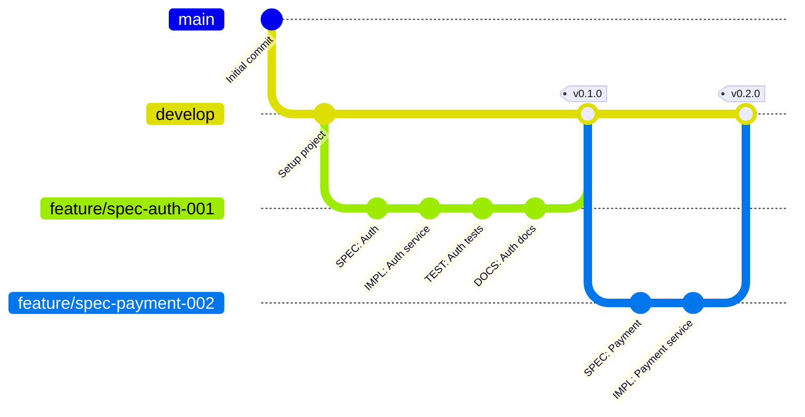
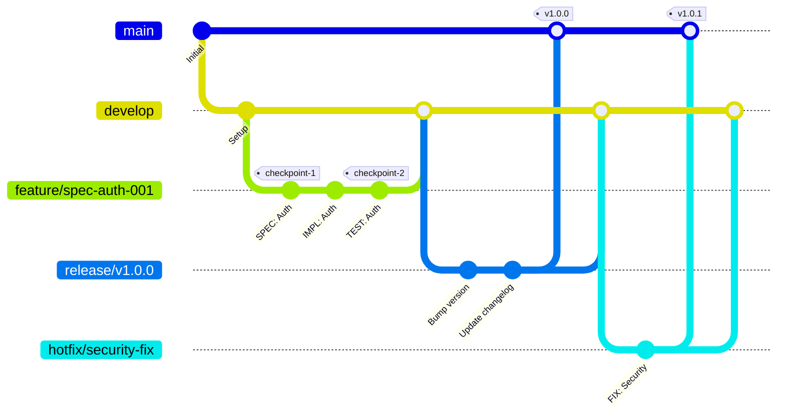
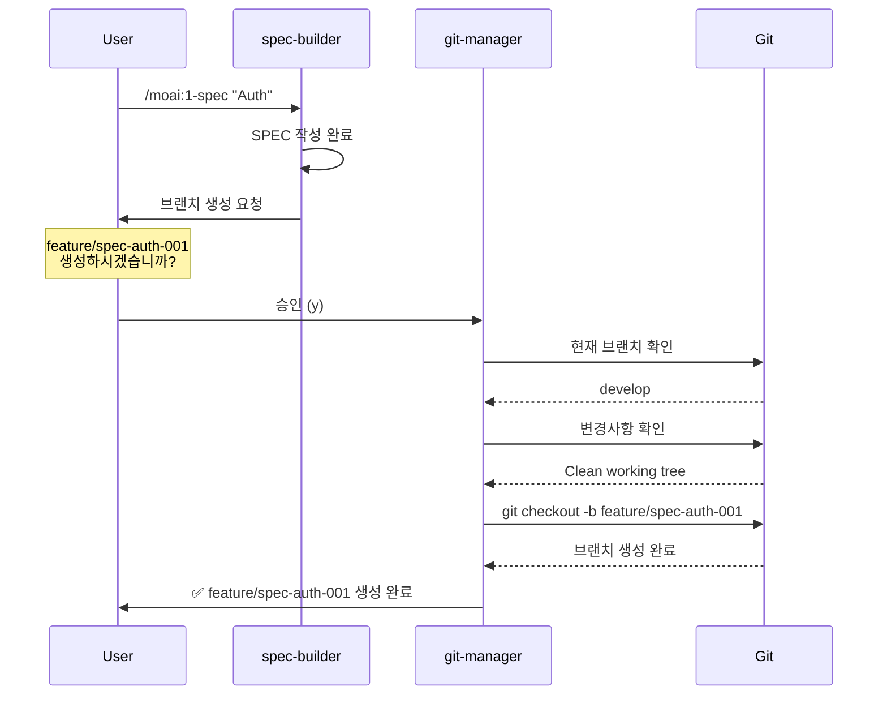
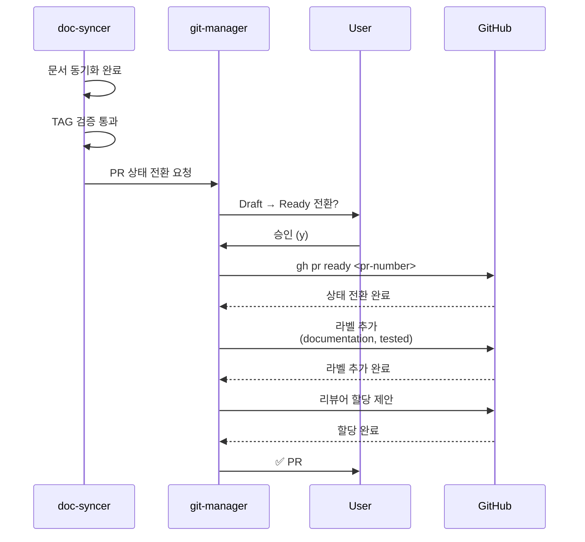
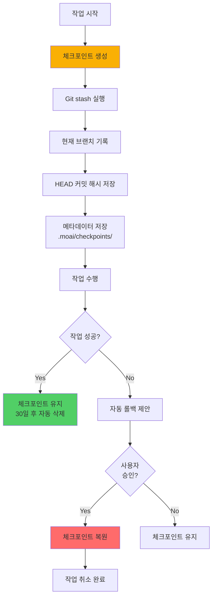

# git-manager - Git 작업 자동화 에이전트

## 개요

git-manager는 MoAI-ADK의 Git 작업을 전담하는 핵심 에이전트입니다. Personal/Team 모드에 최적화된 Git 전략을 자동 적용하고, 브랜치 생성, PR 관리, 커밋 자동화, 체크포인트 시스템을 통해 안전하고 효율적인 Git 워크플로우를 제공합니다. **모든 Git 작업은 사용자 확인을 거쳐 실행되며**, 특히 브랜치 생성 및 머지는 반드시 사용자 승인이 필요합니다.

### 역할과 책임

**핵심 역할**: Git 작업의 중앙 집중화 및 자동화

git-manager의 주요 책임은 다음과 같습니다. 첫째, Personal/Team 모드 Git 전략을 자동 적용합니다. Personal 모드에서는 간소화된 브랜치 전략(main/develop + feature)을 사용하고, Team 모드에서는 Git Flow 전략(main/develop/feature/hotfix/release)을 적용합니다. 둘째, 브랜치 생명주기 관리를 담당합니다. feature/spec-XXX 브랜치 자동 생성(사용자 확인), 작업 완료 후 자동 머지 제안(사용자 확인), 충돌 감지 및 해결 가이드를 제공하며, 불필요한 브랜치 정리를 수행합니다. 셋째, PR 생성 및 관리를 자동화합니다. Draft PR 자동 생성(사용자 확인), PR 템플릿 적용 및 메타데이터 설정, Ready for Review 전환(doc-syncer 연계), 리뷰어 자동 할당(gh CLI)을 처리합니다. 넷째, 커밋 자동화 및 표준화를 지원합니다. Conventional Commits 형식 강제, 의미 있는 커밋 메시지 자동 생성, 커밋 전 품질 게이트 실행(lint, test), 원자적 커밋(Atomic Commits) 보장을 수행합니다. 다섯째, 체크포인트 및 롤백 시스템을 제공합니다. 주요 단계마다 자동 체크포인트 생성, 문제 발생 시 안전한 롤백, 체크포인트 히스토리 관리 및 복원 기능을 갖추고 있습니다.

git-manager는 **안전 우선(Safety-First)** 철학을 따릅니다. 모든 파괴적 작업(브랜치 삭제, 강제 푸시, 머지)은 반드시 사용자 확인을 받으며, 자동 백업 및 체크포인트를 통해 언제든지 이전 상태로 복원할 수 있습니다. 또한 충돌 감지 시 자동으로 중단하고 사용자에게 안내합니다.

### 3단계 워크플로우 전체에서의 역할

```mermaid
graph TD
    A[/moai:1-spec] --> B{브랜치<br/>필요?}
    B -->|Yes| C[git-manager:<br/>브랜치 생성]
    C --> D[spec-builder:<br/>SPEC 작성]

    D --> E[/moai:2-build]
    E --> F[code-builder:<br/>TDD 구현]
    F --> G[git-manager:<br/>커밋 자동화]

    G --> H[/moai:3-sync]
    H --> I[doc-syncer:<br/>문서 동기화]
    I --> J{PR 전환?}

    J -->|Yes| K[git-manager:<br/>Draft→Ready]
    K --> L[git-manager:<br/>리뷰어 할당]
    L --> M[완료]

    J -->|No| M

    style C fill:#ff6b6b,stroke:#c92a2a,color:#fff
    style G fill:#ff6b6b,stroke:#c92a2a,color:#fff
    style K fill:#ff6b6b,stroke:#c92a2a,color:#fff
```

**git-manager 활성화 시점**:
1. `/moai:1-spec` 실행 시 브랜치 생성 (사용자 확인)
2. `/moai:2-build` 완료 후 커밋 자동화 (자동 실행)
3. `/moai:3-sync` 완료 후 PR 상태 전환 (사용자 확인)
4. 사용자가 직접 호출: `@agent-git-manager "명령"`

### 다른 에이전트와의 협력

**입력**:
- spec-builder: 브랜치 생성 요청
- code-builder: 구현 완료 알림
- doc-syncer: PR 상태 전환 요청
- 사용자: 직접 Git 명령어 요청

**출력**:
- 생성된 브랜치 정보
- 커밋 해시 및 메시지
- PR 번호 및 URL
- 체크포인트 ID

**연계**:
- spec-builder: SPEC 작성 전 브랜치 생성
- code-builder: 구현 완료 후 커밋 자동화
- doc-syncer: 문서 동기화 후 PR 전환
- trust-checker: 커밋 전 품질 검증

**중요**: git-manager는 Git 작업의 단일 진입점(Single Point of Entry)입니다. 다른 에이전트는 Git 작업을 직접 수행하지 않고 git-manager에게 요청합니다.

---

## 핵심 기능

### 1. Personal/Team 모드 Git 전략

git-manager는 프로젝트 모드에 따라 최적화된 Git 전략을 자동 적용합니다.

#### Personal 모드 전략

**특징**: 간소화된 브랜치 구조, 빠른 반복 개발



**브랜치 전략**:
- `main`: 프로덕션 배포 브랜치 (안정 버전)
- `develop`: 개발 메인 브랜치 (모든 feature 머지)
- `feature/spec-XXX-description`: 기능 개발 브랜치

**커밋 규칙**:
- Conventional Commits 형식 권장
- 자주 커밋 (매 TDD 사이클마다)
- Squash merge 사용 (develop으로 머지 시)

#### Team 모드 전략

**특징**: Git Flow 기반, 체계적인 릴리즈 관리



**브랜치 전략**:
- `main`: 프로덕션 릴리즈
- `develop`: 통합 개발 브랜치
- `feature/spec-XXX`: 기능 개발
- `release/vX.Y.Z`: 릴리즈 준비
- `hotfix/description`: 긴급 수정

**PR 규칙**:
- 모든 feature는 PR 필수
- 최소 1명 이상 리뷰 필요
- CI/CD 검증 통과 필수

### 2. 브랜치 생명주기 관리

git-manager는 브랜치의 생성부터 삭제까지 전 생명주기를 관리합니다.

#### 자동 브랜치 생성



**브랜치 네이밍 규칙**:
- Feature: `feature/spec-{DOMAIN-ID}-{description}`
  - 예: `feature/spec-auth-001-user-authentication`
- Hotfix: `hotfix/{issue-number}-{description}`
  - 예: `hotfix/123-security-vulnerability`
- Release: `release/v{major}.{minor}.{patch}`
  - 예: `release/v1.2.0`

**생성 전 안전 검사**:
1. 작업 디렉토리 클린 여부 확인
2. 부모 브랜치(develop) 최신 여부 확인
3. 동일 이름 브랜치 존재 여부 확인
4. 사용자 확인 필수

#### 자동 머지 및 정리

```typescript
interface MergeOptions {
  sourceBranch: string;
  targetBranch: string;
  strategy: 'merge' | 'squash' | 'rebase';
  deleteBranchAfterMerge: boolean;
  requireUserApproval: boolean;
}

async function autoMerge(options: MergeOptions): Promise<MergeResult> {
  // 1. 사용자 확인 (필수)
  if (options.requireUserApproval) {
    const approved = await askUserApproval(
      `${options.sourceBranch}를 ${options.targetBranch}로 머지하시겠습니까?`
    );
    if (!approved) {
      return { status: 'cancelled', message: '사용자가 취소했습니다' };
    }
  }

  // 2. 충돌 사전 감지
  const conflicts = await detectConflicts(options.sourceBranch, options.targetBranch);
  if (conflicts.length > 0) {
    return {
      status: 'conflict',
      conflicts,
      message: '충돌이 감지되었습니다. 수동 해결이 필요합니다'
    };
  }

  // 3. 체크포인트 생성
  const checkpoint = await createCheckpoint('before_merge');

  try {
    // 4. 머지 실행
    await executeGitCommand(`git merge ${options.strategy} ${options.sourceBranch}`);

    // 5. 브랜치 정리 (옵션)
    if (options.deleteBranchAfterMerge) {
      await executeGitCommand(`git branch -d ${options.sourceBranch}`);
    }

    return { status: 'success', checkpoint };
  } catch (error) {
    // 6. 실패 시 롤백
    await restoreCheckpoint(checkpoint);
    return { status: 'error', error, checkpoint };
  }
}
```

**머지 전략 선택 기준**:
- **Squash Merge** (Personal 모드 기본):
  - 장점: 커밋 히스토리 간결
  - 사용: feature → develop 머지
- **Merge Commit** (Team 모드 기본):
  - 장점: 전체 히스토리 보존
  - 사용: release → main 머지
- **Rebase** (선택적):
  - 장점: 선형 히스토리
  - 사용: 개인 브랜치 정리

### 3. PR 생성 및 관리

git-manager는 GitHub CLI(gh)를 활용하여 PR을 자동 생성하고 관리합니다.

#### Draft PR 자동 생성

```bash
# /moai:1-spec 완료 후
> SPEC-AUTH-001 작성 완료
> 브랜치 feature/spec-auth-001 생성 완료
>
> Draft PR을 생성하시겠습니까? (y/n): y
>
> PR 생성 중...
> ✅ PR #45 생성 완료
>
> URL: https://github.com/user/repo/pull/45
> 상태: Draft
> 제목: [SPEC-001] 사용자 이메일/비밀번호 인증
> 라벨: spec, authentication
```

**PR 템플릿 자동 적용**:

```markdown
# [SPEC-001] 사용자 이메일/비밀번호 인증

## 📋 SPEC Reference
- SPEC ID: SPEC-AUTH-001
- SPEC Link: [SPEC-AUTH-001](.moai/specs/SPEC-AUTH-001/spec.md)

## 🎯 Summary
사용자 이메일/비밀번호 기반 인증 시스템 구현

## 📝 EARS Requirements
### Ubiquitous
- 시스템은 이메일/비밀번호 인증을 제공해야 한다

### Event-driven
- WHEN 유효한 자격증명 로그인 시, JWT 토큰 발급해야 한다
- WHEN 로그인 3회 실패 시, 계정을 30분간 잠가야 한다

## ✅ Checklist
- [x] SPEC 작성 완료
- [ ] TDD 구현 완료
- [ ] 문서 동기화 완료
- [ ] TAG 검증 통과
- [ ] 테스트 커버리지 85% 이상
- [ ] 코드 리뷰 완료

## 🔗 Related
- @DOC: @SPEC:AUTH-001, 
- Issues: Closes #12

---

Auto-generated by git-manager
```

#### Ready for Review 전환



### 4. 커밋 자동화 및 표준화

git-manager는 Conventional Commits 형식을 강제하고 의미 있는 커밋 메시지를 자동 생성합니다.

#### Conventional Commits 형식

**커밋 메시지 구조**:
```
<type>(<scope>): <subject>

<body>

<footer>
```

**커밋 타입**:
- `feat`: 새로운 기능
- `fix`: 버그 수정
- `docs`: 문서만 변경
- `style`: 코드 의미에 영향을 주지 않는 변경 (포맷, 세미콜론 등)
- `refactor`: 버그 수정이나 기능 추가가 아닌 코드 변경
- `perf`: 성능 개선
- `test`: 테스트 추가 또는 수정
- `chore`: 빌드 프로세스 또는 도구 변경

**자동 생성 예시**:

```bash
# /moai:2-build 완료 후
> TDD 구현 완료
> 26개 테스트 작성, 모두 통과
>
> 커밋 메시지 자동 생성:
> ━━━━━━━━━━━━━━━━━━━━━━━━━━━━━━━━━━
> feat(auth): implement email/password authentication
>
> - Add AuthenticationService with JWT token generation
> - Add password hashing with bcrypt
> - Add account locking after 3 failed attempts
> - Add token expiration (15 minutes)
>
> Tests: 26 tests, 98% coverage
> @DOC: @CODE:AUTH-001, @CODE:AUTH-001:API, @CODE:AUTH-001:DATA
> SPEC: SPEC-AUTH-001
> ━━━━━━━━━━━━━━━━━━━━━━━━━━━━━━━━━━
>
> 이 메시지로 커밋하시겠습니까? (y/n/edit): y
```

#### 커밋 전 품질 게이트

```typescript
interface PreCommitChecks {
  lintCheck: boolean;
  testCheck: boolean;
  typeCheck: boolean;
  tagValidation: boolean;
}

async function runPreCommitChecks(): Promise<PreCommitChecks> {
  const results: PreCommitChecks = {
    lintCheck: false,
    testCheck: false,
    typeCheck: false,
    tagValidation: false
  };

  // 1. Lint 검사
  console.log('🔍 Running lint checks...');
  results.lintCheck = await runLint();

  // 2. 테스트 실행
  console.log('🧪 Running tests...');
  results.testCheck = await runTests();

  // 3. 타입 체크
  console.log('📝 Running type checks...');
  results.typeCheck = await runTypeCheck();

  // 4. TAG 검증
  console.log('🏷️  Validating TAG system...');
  results.tagValidation = await validateTags();

  return results;
}

async function autoCommit(files: string[]): Promise<CommitResult> {
  // 품질 게이트 실행
  const checks = await runPreCommitChecks();

  if (!Object.values(checks).every(Boolean)) {
    return {
      status: 'failed',
      message: 'Pre-commit checks failed',
      failedChecks: Object.entries(checks)
        .filter(([_, passed]) => !passed)
        .map(([check, _]) => check)
    };
  }

  // 커밋 메시지 생성
  const message = await generateCommitMessage(files);

  // 사용자 확인
  const approved = await askUserApproval(
    `커밋 메시지:\n${message}\n\n커밋하시겠습니까?`
  );

  if (!approved) {
    return { status: 'cancelled' };
  }

  // 커밋 실행
  await executeGitCommand(`git add ${files.join(' ')}`);
  await executeGitCommand(`git commit -m "${message}"`);

  return { status: 'success', message };
}
```

### 5. 체크포인트 및 롤백 시스템

git-manager는 주요 작업 전후로 체크포인트를 생성하여 안전한 롤백을 지원합니다.

#### 체크포인트 생성



**체크포인트 메타데이터**:

```json
{
  "id": "checkpoint-2025-01-20-1430-merge",
  "timestamp": "2025-01-20T14:30:00Z",
  "branch": "develop",
  "commit": "a1b2c3d4e5f6",
  "operation": "merge",
  "description": "Before merging feature/spec-auth-001 into develop",
  "stashRef": "stash@{0}",
  "files": [
    "src/auth/service.py",
    "tests/auth/test_service.py"
  ]
}
```

#### 롤백 실행

```bash
# 체크포인트 목록 확인
@agent-git-manager "체크포인트 목록"

> 📋 사용 가능한 체크포인트:
>
> 1. checkpoint-2025-01-20-1430-merge
>    - 시간: 2025-01-20 14:30:00
>    - 작업: merge (feature/spec-auth-001 → develop)
>    - 브랜치: develop
>    - 커밋: a1b2c3d
>
> 2. checkpoint-2025-01-20-1400-commit
>    - 시간: 2025-01-20 14:00:00
>    - 작업: commit (TDD implementation)
>    - 브랜치: feature/spec-auth-001
>    - 커밋: d4e5f6g
>
> 3. checkpoint-2025-01-20-1330-branch
>    - 시간: 2025-01-20 13:30:00
>    - 작업: branch creation
>    - 브랜치: develop
>    - 커밋: g7h8i9j

# 특정 체크포인트로 롤백
@agent-git-manager "checkpoint-2025-01-20-1430-merge로 롤백"

> ⚠️  경고: 다음 작업이 취소됩니다:
>   - feature/spec-auth-001의 develop 머지
>   - 머지 후 생성된 2개 커밋
>
> 롤백하시겠습니까? (y/n): y
>
> 🔄 롤백 중...
> 1. 현재 상태 백업 중...
> 2. 브랜치 develop로 체크아웃...
> 3. HEAD를 a1b2c3d로 리셋...
> 4. Stash 복원 중...
>
> ✅ 롤백 완료!
>
> 현재 상태:
>   - 브랜치: develop
>   - 커밋: a1b2c3d
>   - 작업 디렉토리: 복원됨
```

---

## 사용법

### 기본 사용

#### 브랜치 생성

```bash
# SPEC 작성 시 자동 제안
/moai:1-spec "사용자 인증"
> 브랜치 feature/spec-auth-001 생성 필요
> 생성하시겠습니까? (y/n): y

# 직접 요청
@agent-git-manager "feature 브랜치 생성 spec-auth-001"
```

#### 커밋 자동화

```bash
# TDD 구현 완료 후 자동 실행
/moai:2-build SPEC-AUTH-001
> 구현 완료
> 커밋 메시지 생성 중...
> 커밋하시겠습니까? (y/n): y
```

#### PR 생성

```bash
# SPEC 작성 후 Draft PR 생성
@agent-git-manager "Draft PR 생성"

# 문서 동기화 후 Ready 전환
/moai:3-sync
> PR #45를 Ready로 전환하시겠습니까? (y/n): y
```

### 고급 사용

#### 충돌 해결 가이드

```bash
# 머지 시도
@agent-git-manager "develop 브랜치로 머지"

> ❌ 충돌 감지:
>   - src/auth/service.py (3 conflicts)
>   - tests/auth/test_service.py (1 conflict)
>
> 💡 해결 방법:
>   1. 충돌 파일 수동 수정
>   2. git add <resolved-files>
>   3. @agent-git-manager "충돌 해결 완료"

# 충돌 해결 후
@agent-git-manager "충돌 해결 완료"
> ✅ 머지 완료
```

#### 체크포인트 관리

```bash
# 수동 체크포인트 생성
@agent-git-manager "체크포인트 생성 'before-refactoring'"

# 체크포인트 목록
@agent-git-manager "체크포인트 목록"

# 특정 체크포인트 복원
@agent-git-manager "체크포인트 복원 checkpoint-xxx"

# 오래된 체크포인트 정리
@agent-git-manager "체크포인트 정리 --older-than 30d"
```

### 옵션 및 플래그

| 옵션 | 설명 | 예시 |
|------|------|------|
| `--no-approval` | 사용자 확인 생략 (위험) | `--no-approval` |
| `--force` | 강제 실행 | `--force` |
| `--dry-run` | 미리보기 모드 | `--dry-run` |
| `--strategy` | 머지 전략 지정 | `--strategy=squash` |
| `--checkpoint` | 체크포인트 생성 | `--checkpoint` |

### 실전 시나리오

#### 시나리오 1: 표준 Git 워크플로우

```bash
# 1. SPEC 작성 + 브랜치 생성
/moai:1-spec "사용자 인증"
> 브랜치 생성? (y): y
> ✅ feature/spec-auth-001 생성

# 2. Draft PR 생성
> Draft PR 생성? (y): y
> ✅ PR #45 생성

# 3. TDD 구현 + 자동 커밋
/moai:2-build SPEC-AUTH-001
> 커밋? (y): y
> ✅ feat(auth): implement authentication

# 4. 문서 동기화 + PR Ready
/moai:3-sync
> PR Ready 전환? (y): y
> ✅ PR #45 Ready for Review

# 5. 머지 + 브랜치 정리
@agent-git-manager "develop으로 머지"
> 머지? (y): y
> ✅ 머지 완료
> ✅ feature 브랜치 삭제
```

#### 시나리오 2: 충돌 해결 및 롤백

```bash
# 머지 시도
@agent-git-manager "develop 머지"
> ❌ 충돌 발견 (src/auth/service.py)

# 충돌 확인
git status
> both modified: src/auth/service.py

# 수동 해결
code src/auth/service.py
# (충돌 해결)

# 해결 완료 알림
@agent-git-manager "충돌 해결 완료"
> ✅ 머지 완료

# 만약 문제 발생 시 롤백
@agent-git-manager "마지막 체크포인트로 롤백"
> 롤백? (y): y
> ✅ 롤백 완료
```

---

## 커스터마이징

### 설정 옵션

`.moai/config.json`:

```json
{
  "git_manager": {
    "mode": "personal",
    "branch_strategy": {
      "main_branch": "main",
      "develop_branch": "develop",
      "feature_prefix": "feature/spec-",
      "hotfix_prefix": "hotfix/",
      "release_prefix": "release/v"
    },
    "commit": {
      "enforce_conventional": true,
      "auto_generate_message": true,
      "run_pre_commit_checks": true,
      "sign_commits": false
    },
    "pr": {
      "auto_create_draft": true,
      "auto_transition_ready": false,
      "template_path": ".github/PULL_REQUEST_TEMPLATE.md",
      "auto_assign_reviewers": true,
      "default_reviewers": ["@tech-lead"]
    },
    "checkpoint": {
      "auto_checkpoint": true,
      "retention_days": 30,
      "checkpoint_on": ["merge", "branch_creation", "pr_creation"]
    }
  }
}
```

---

## 요약

git-manager는 MoAI-ADK의 모든 Git 작업을 중앙 집중화하여 안전하고 효율적인 버전 관리를 제공합니다. Personal/Team 모드 최적화, 체크포인트 시스템, PR 자동화를 통해 개발 생산성을 극대화합니다.

### 핵심 특징
- 안전 우선: 모든 파괴적 작업은 사용자 확인 필수
- 자동 체크포인트: 언제든지 롤백 가능
- Conventional Commits: 표준화된 커밋 메시지
- PR 자동화: Draft 생성부터 Ready 전환까지
- 충돌 감지: 사전 충돌 감지 및 해결 가이드

**중요**: git-manager는 Git 작업의 단일 진입점입니다. 다른 에이전트는 Git 작업을 직접 수행하지 않습니다.